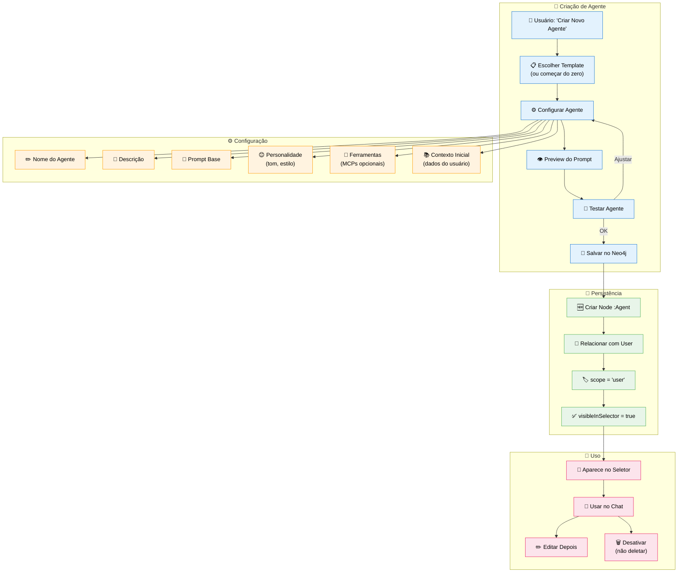
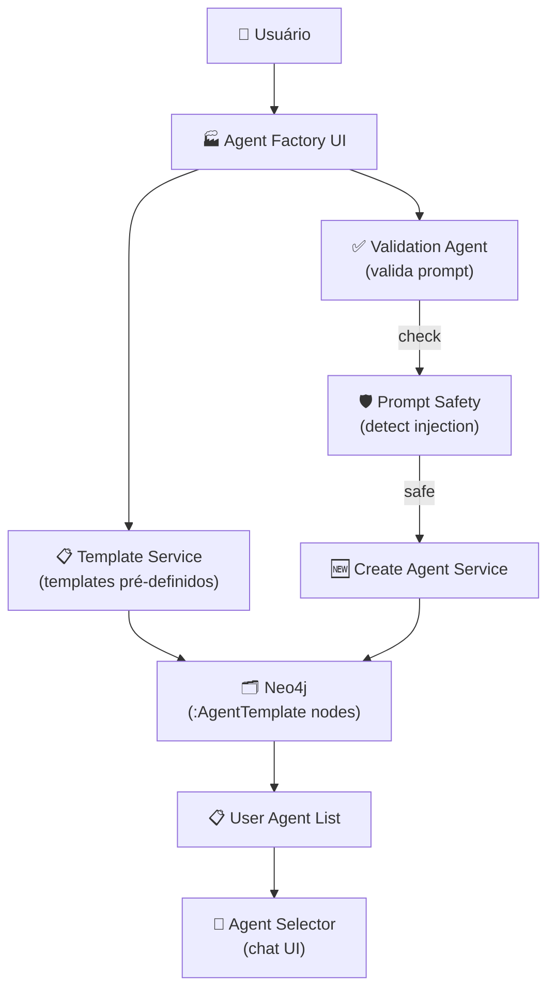

# Feature Specification: User Agent Factory

**Feature Branch**: `004-user-agent-factory`  
**Created**: 2025-12-07  
**Status**: Draft  
**Priority**: P1 (Backend Core)  
**Source**: TRG-SPC-20251206-008 + User input

## Process Flow (Business View)



### Flow Insights

**Gaps identificados**:
- Limite de agentes por usuário? (ex: máximo 5 custom agents)
- Como validar se prompt não é malicioso (prompt injection)?
- Template gallery: quem cria e aprova templates?
- Compartilhamento: usuário pode compartilhar custom agent com time?

**Oportunidades identificadas**:
- Templates pré-configurados por use case (Analista, Escritor, Pesquisador)
- Import/Export de agentes (JSON config)
- Marketplace de agentes (usuários compartilham criações)
- Analytics: quais custom agents mais usados
- Clone de agente: duplicar e modificar

**Riscos identificados**:
- Usuário cria agente com prompt ruim → frustração
- Proliferação de agentes inúteis → poluição do sistema
- Custo de LLM: custom agents consomem tokens
- Conflito de nomes: dois usuários criam "Assistente Pessoal"

---

## Agent Scope & Visibility

### Tipos de Agentes

O EKS suporta dois tipos de agentes com diferentes escopos de criação e visibilidade:

| Tipo | Criador | Visibilidade | Editável por | Ícone no Seletor |
|------|---------|--------------|--------------|------------------|
| **Global** | Admin | Configurável (corporativo/área/projeto) | Apenas Admin | 🌐 |
| **Pessoal** | Usuário | Apenas próprio usuário | Apenas criador | 👤 |

### Agentes Globais (Criados por Admin)

**Características**:
- Criados via interface administrativa (Spec 002 - Admin Node Manager)
- Podem ser atribuídos a múltiplos usuários, áreas ou projetos
- Propriedade `scope: "global"` no grafo
- Admin define `visibility`: `corporate` (todos), `area` (área específica), `project` (projeto específico)
- Aparecem automaticamente no Agent Team dos usuários com acesso

**Casos de Uso**:
- "Analista Financeiro" atribuído à área de Finanças
- "Especialista Jurídico" atribuído a usuários específicos
- "Assistente de Compliance" corporativo (todos têm acesso)

**Modelo de Dados**:

```cypher
(:Agent {
  scope: "global",
  created_by: admin_user_id,
  visibility: "area" | "corporate" | "project"
})

// Atribuições
(:Agent {scope: "global"})-[:AVAILABLE_TO]->(:User)
(:Agent {scope: "global"})-[:AVAILABLE_TO]->(:Area)
(:Agent {scope: "global"})-[:AVAILABLE_TO]->(:Project)
```

### Agentes Pessoais (Criados por Usuário)

**Características**:
- Criados via User Agent Factory (esta spec)
- Visíveis apenas para o criador
- Propriedade `scope: "user"` no grafo
- Usuário tem controle total: editar, desativar, deletar
- Limitados por user (ex: máximo 10 agentes pessoais)

**Casos de Uso**:
- "Meu Assistente de Produtividade" configurado com preferências pessoais
- "Revisor de Textos" customizado com estilo pessoal
- "Pesquisador Técnico" focado em tópicos de interesse

**Modelo de Dados**:

```cypher
(:Agent {
  scope: "user",
  created_by: user_id,
  visibility: "personal"
})-[:CREATED_BY]->(:User)
```

### Agent Team do Usuário

Todo usuário tem um "Agent Team" composto por:
1. **Agentes Globais** - atribuídos pelo Admin
2. **Agentes Pessoais** - criados pelo próprio usuário
3. **Agentes de Sistema** - Router, Memory Decay, etc. (sempre presentes)

Este Agent Team é carregado pelo Personal Lead Agent (Spec 005) para roteamento de queries.

---

## Agent Collaboration



### Data Flow

| From | To | What is passed | Purpose |
|------|-----|----------------|---------|
| **User** | Factory UI | Configuração do agente | Iniciar criação |
| **Factory UI** | Template Service | Template ID (opcional) | Carregar base pré-configurada |
| **Factory UI** | Validation Agent | Prompt text | Validar segurança e qualidade |
| **Validation Agent** | Create Agent Service | Validated config | Criar node no Neo4j |
| **Create Agent Service** | Neo4j | Agent node + relationship | Persistir agente |
| **Neo4j** | Agent Selector | Lista de agentes do user | Exibir no chat |

---

## User Scenarios & Testing

### User Story 1 - Criar Agente do Zero (Priority: P1)

Usuário acessa "Meus Agentes", clica em "Criar Novo", preenche nome, descrição e prompt, e salva. Agente aparece no seletor do chat.

**Why this priority**: Funcionalidade core. Sem isso, usuário não pode personalizar experiência.

**Independent Test**: Criar agente via UI, verificar node criado no Neo4j, confirmar aparição no seletor.

**Acceptance Scenarios**:

1. **Given** usuário em "Meus Agentes", **When** clica "Criar Novo Agente", **Then** abre modal/página com formulário de configuração

2. **Given** usuário preencheu nome "Analista Financeiro", descrição "Ajuda com análise de balanços", **When** insere prompt e clica "Salvar", **Then** agente é criado no Neo4j com `scope: "user"` e `ownerId: user.id`

3. **Given** agente criado, **When** usuário abre seletor no chat, **Then** vê "Analista Financeiro" na lista junto com Router e Task

---

### User Story 2 - Usar Template Pré-configurado (Priority: P2)

Usuário escolhe template "Assistente de Escrita" da galeria, ajusta descrição e prompt, e salva. Agente herda configurações do template.

**Why this priority**: Acelera criação. Usuários não técnicos têm dificuldade de escrever bons prompts.

**Independent Test**: Selecionar template, verificar que campos são pré-preenchidos.

**Acceptance Scenarios**:

1. **Given** usuário na tela de criação, **When** clica "Usar Template", **Then** vê galeria com templates (Assistente de Escrita, Pesquisador, Analista)

2. **Given** usuário selecionou "Assistente de Escrita", **When** template é carregado, **Then** nome, descrição e prompt base são pré-preenchidos

3. **Given** usuário ajustou prompt do template, **When** salva, **Then** agente é criado baseado no template mas com customizações

---

### User Story 3 - Testar Agente Antes de Salvar (Priority: P1)

Usuário configura agente e clica "Testar". Sistema abre chat sandbox onde pode fazer perguntas e ver comportamento antes de salvar definitivamente.

**Why this priority**: Evita criar agentes ruins. Usuário pode iterar antes de persistir.

**Independent Test**: Clicar "Testar", enviar mensagens, verificar resposta do agente.

**Acceptance Scenarios**:

1. **Given** usuário preencheu configuração, **When** clica "Testar Agente", **Then** abre janela de chat sandbox com agente temporário

2. **Given** sandbox aberto, **When** usuário envia "Olá", **Then** agente responde usando prompt configurado

3. **Given** teste satisfatório, **When** usuário clica "Salvar Agente", **Then** configuração é persistida no Neo4j

---

### User Story 4 - Editar Agente Existente (Priority: P1)

Usuário acessa lista de custom agents, clica "Editar" em um agente criado por ele, modifica prompt, e salva nova versão.

**Why this priority**: Evolução contínua. Agentes precisam ser refinados com o tempo.

**Independent Test**: Editar agente, verificar que nova versão de prompt é criada.

**Acceptance Scenarios**:

1. **Given** usuário em "Meus Agentes", **When** clica ícone de editar em "Analista Financeiro", **Then** abre formulário com dados atuais

2. **Given** usuário modifica prompt, **When** salva, **Then** nova versão de prompt é criada no Neo4j (versionamento)

3. **Given** nova versão salva, **When** usuário usa agente no chat, **Then** agente usa prompt mais recente

---

### User Story 5 - Desativar Agente (Priority: P2)

Usuário não quer mais usar custom agent mas não quer deletar (pode ter histórico). Clica "Desativar" e agente some do seletor.

**Why this priority**: Limpeza de lista sem perda de dados. Melhor UX do que poluir seletor com agentes não usados.

**Independent Test**: Desativar agente, verificar que `active: false` no Neo4j e agente não aparece no seletor.

**Acceptance Scenarios**:

1. **Given** usuário em "Meus Agentes", **When** clica "Desativar" em agente, **Then** modal de confirmação aparece

2. **Given** confirmação aceita, **When** agente é desativado, **Then** `active: false` no Neo4j

3. **Given** agente desativado, **When** usuário abre seletor no chat, **Then** agente NÃO aparece na lista

---

## Functional Requirements

### Agent Creation

**REQ-FAC-001**: Usuário DEVE poder criar custom agent via UI  
**REQ-FAC-002**: Formulário DEVE ter campos: nome (obrigatório), descrição (opcional), prompt (obrigatório)  
**REQ-FAC-003**: Sistema DEVE validar nome único por usuário (não pode ter 2 "Assistente")  
**REQ-FAC-004**: Prompt DEVE ter limite de 5000 caracteres  
**REQ-FAC-005**: Sistema DEVE criar node `:Agent` com `scope: "user"` e `ownerId: user.id`

### Templates

**REQ-FAC-006**: Sistema PODE oferecer templates pré-configurados (opcional para MVP)  
**REQ-FAC-007**: Template DEVE incluir: nome sugerido, descrição, prompt base, personalidade  
**REQ-FAC-008**: Usuário PODE modificar qualquer campo do template antes de salvar

### Validation

**REQ-FAC-009**: Sistema DEVE validar prompt contra prompt injection patterns básicos  
**REQ-FAC-010**: Sistema DEVE avisar se prompt contém instruções conflitantes (ex: "ignore instruções anteriores")  
**REQ-FAC-011**: Sistema PODE sugerir melhorias de prompt via LLM (opcional)

### Testing Sandbox

**REQ-FAC-012**: Sistema DEVE oferecer chat sandbox para testar agente antes de salvar  
**REQ-FAC-013**: Sandbox NÃO DEVE persistir conversas no histórico  
**REQ-FAC-014**: Sandbox DEVE usar configuração temporária do agente (não salva no Neo4j ainda)

### Agent Management

**REQ-FAC-015**: Usuário DEVE ver lista de seus custom agents em "Meus Agentes"  
**REQ-FAC-016**: Usuário PODE editar apenas seus próprios custom agents  
**REQ-FAC-017**: Edição de prompt DEVE criar nova versão (versionamento)  
**REQ-FAC-018**: Usuário PODE desativar agente (não deletar) via toggle `active: false`  
**REQ-FAC-019**: Agentes desativados NÃO DEVEM aparecer no seletor do chat

### Agent Visibility

**REQ-FAC-020**: Custom agents DEVEM aparecer no seletor apenas para o criador  
**REQ-FAC-021**: Admin PODE ver todos os custom agents de todos os usuários (visualização)  
**REQ-FAC-022**: Admin NÃO PODE editar custom agents de outros usuários (apenas desativar se violação)

### Resource Limits

**REQ-FAC-023**: Sistema PODE limitar número de custom agents por usuário (ex: 5 no free tier)  
**REQ-FAC-024**: Sistema DEVE rastrear uso (tokens) de custom agents para billing futuro

---

## Success Criteria

### Creation Flow
- ✅ Criar agente do zero em <2 minutos
- ✅ 100% dos agentes criados aparecem no seletor
- ✅ Validação de prompt detecta 90%+ de prompt injections óbvias
- ✅ Sandbox funciona sem latência perceptível (response <3s)

### User Adoption
- ✅ 50%+ dos usuários criam pelo menos 1 custom agent no primeiro mês
- ✅ Custom agents têm taxa de uso 30%+ (não ficam esquecidos)
- ✅ Taxa de abandono de criação <20% (usuários que começam mas não salvam)

### Quality & Safety
- ✅ 0 incidentes de prompt injection em produção
- ✅ Prompts criados têm qualidade média >3/5 (avaliação manual amostra)
- ✅ Custom agents não geram mais erros que agentes system

---

## Key Entities

### Neo4j Node Structure

```cypher
// Agent node (custom user agent)
(:Agent {
  id: string, // auto-generated UUID
  name: string, // "Analista Financeiro"
  description: string, // "Ajuda com análise de balanços"
  tipo: "custom", // distingue de system agents
  scope: "user", // sempre "user" para custom
  ownerId: string, // user.id do criador
  visibleInSelector: boolean, // true para custom agents
  currentPromptVersion: string, // ref to PromptVersion
  personality: string, // "formal" | "casual" | "técnico"
  mcpIds: string[], // MCPs habilitados (opcional)
  active: boolean, // true/false (soft delete)
  usageCount: integer, // quantas vezes foi usado
  createdAt: datetime,
  updatedAt: datetime
})

// AgentTemplate node (para templates pré-configurados)
(:AgentTemplate {
  id: string,
  name: string, // "Assistente de Escrita"
  description: string,
  category: string, // "productivity" | "analysis" | "creative"
  basePrompt: string,
  personality: string,
  icon: string, // emoji ou lucide icon
  featured: boolean, // destaque na galeria
  usageCount: integer, // quantas vezes foi usado
  createdAt: datetime
})

// PromptVersion node (compartilhado com spec 003)
(:PromptVersion {
  id: string,
  agentId: string,
  versionNumber: integer,
  promptText: string,
  changeJustification: string, // "Ajuste de tom" ou "Primeira versão"
  authorId: string, // ownerId
  createdAt: datetime
})

// Relationships
(:User)-[:OWNS]->(:Agent) // usuário owns custom agent
(:Agent)-[:HAS_PROMPT_VERSION]->(:PromptVersion)
(:Agent)-[:CURRENT_PROMPT]->(:PromptVersion)
(:Agent)-[:BASED_ON]->(:AgentTemplate) // se criado de template
(:PromptVersion)-[:PREVIOUS_VERSION]->(:PromptVersion)
```

---

## Technical Constraints

### Frontend
- UI de criação pode usar modal ou página dedicada
- Editor de prompt pode ter syntax highlighting (opcional)
- Galeria de templates usa grid responsivo (3 cols desktop, 1 col mobile)

### Backend
- Validation Agent pode usar regex patterns para prompt injection detection
- Sandbox usa mesma infraestrutura de chat mas com session isolado
- Template service carrega de nodes `:AgentTemplate` no Neo4j

### Neo4j
- Índice obrigatório: `Agent.ownerId`, `Agent.id`
- Constraint: `(Agent.name, Agent.ownerId)` UNIQUE (nome único por usuário)
- Constraint: `AgentTemplate.id` UNIQUE

### Agno Framework
- Custom agent usa mesmo pattern que system agents: `Agent(name=..., instructions=prompt)`
- Router deve incluir custom agents dinamicamente baseado em `ownerId`

---

## Assumptions

1. **Creation Limit**: MVP sem limite de custom agents (adicionar depois se necessário)
2. **Sharing**: MVP não permite compartilhar custom agents entre usuários
3. **Import/Export**: Não implementado no MVP (feature futura)
4. **Marketplace**: Não implementado no MVP (feature futura)
5. **Template Source**: Templates criados manualmente por admin (não UGC)

---

## Open Questions

1. **Templates Dinâmicos**: LLM pode sugerir templates baseado em comportamento do usuário?
2. **Agent Analytics**: Mostrar ao usuário estatísticas de uso do custom agent?
3. **Prompt Optimization**: Sistema pode auto-melhorar prompts com feedback?
4. **Collaboration**: Futuro: usuários podem co-criar agentes em time?
5. **Versioning UI**: Como mostrar histórico de versões de forma intuitiva?

---

## Related Specs

- **003-admin-login-config**: Admin pode visualizar todos os custom agents
- **TRG-SPC-009-agent-router**: Router deve incluir custom agents na seleção dinâmica
- **001-knowledge-pipeline**: Custom agents podem ter acesso a knowledge específico do usuário

---

## References

- Constitution: A.IV (Gestão de Prompts por Usuário), A.V (Mudanças Incrementais)
- Agno Framework: `Agent` class, `enable_user_memories=True`
- Project Reference: `CVCHub - Copia` - `types/admin.ts` (AdminAgentProfile structure)
