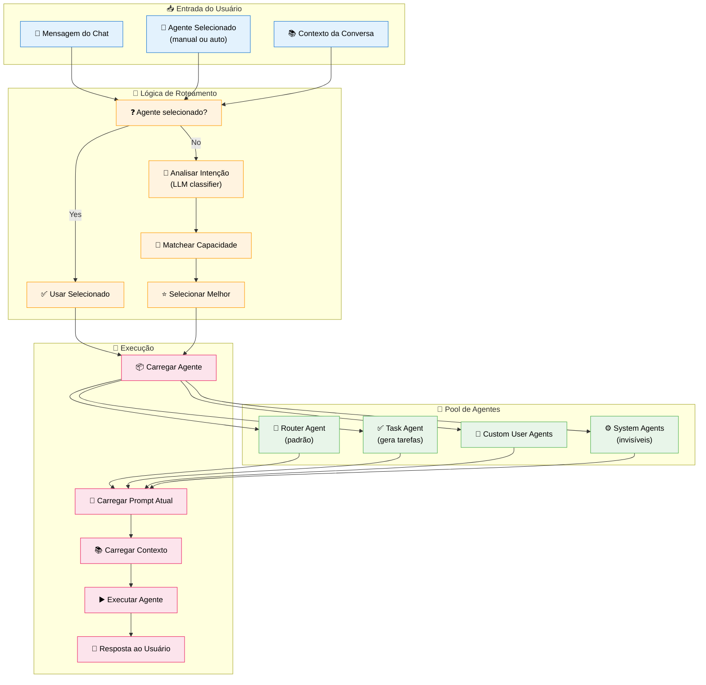
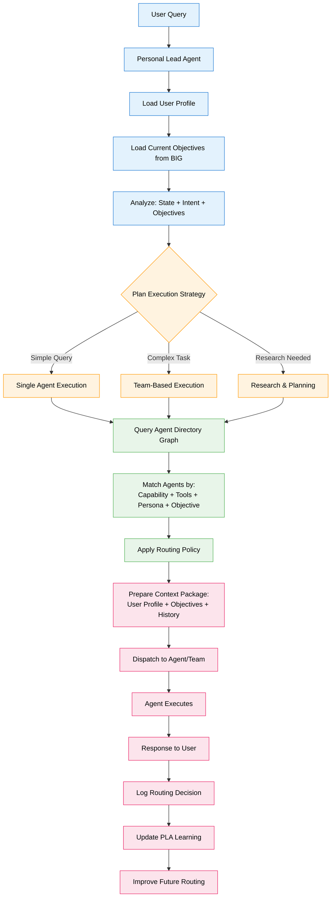
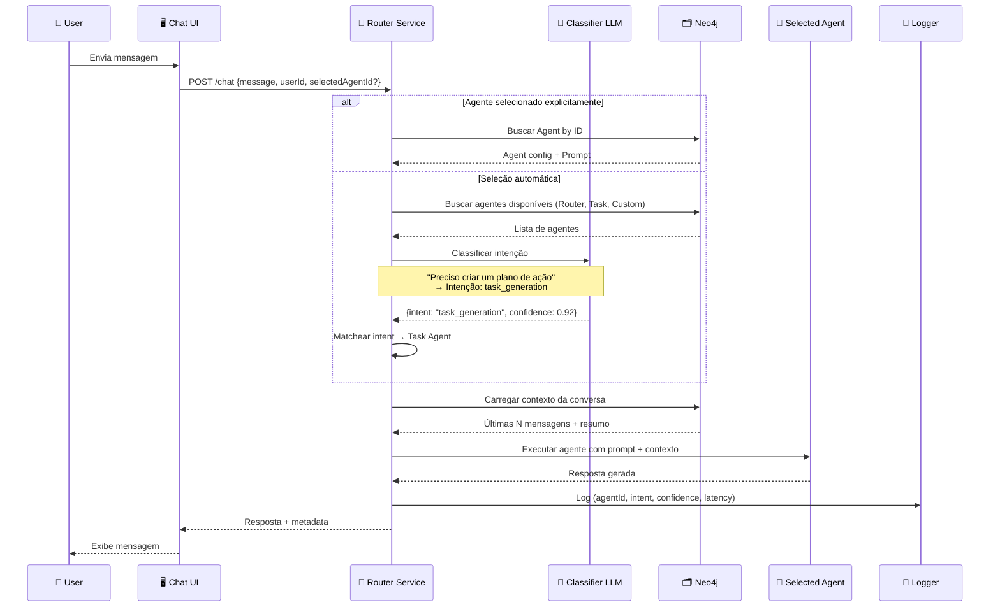

# Feature Specification: Personal Lead Agent (PLA) & Agent Router

**Feature Branch**: `005-agent-router`  
**Created**: 2025-12-07  
**Updated**: 2025-12-29 (Refined to PLA architecture)  
**Status**: Draft  
**Priority**: P0 (Foundation)  
**Source**: TRG-SPC-20251206-009 + Chat insights (chat011, chat012) + PLA architectural pattern

## Context & Purpose

The **Personal Lead Agent (PLA)** transforms the simple Agent Router into a sophisticated orchestrator. Instead of just classifying intent and routing to agents, the PLA acts as:

- **Personal Orchestrator** - Each user gets their own PLA instance that learns their patterns
- **Planner** - Analyzes user state + objectives + intent to plan execution strategy
- **Policy Engine** - Applies routing policies based on user profile and context
- **Dispatcher** - Delegates to specialized agents with rich context packages
- **Learner** - Improves routing decisions based on user feedback and outcomes

### Evolution: Router → PLA

**Original Router (Simple)**:
- Intent classification → Match capability → Select agent → Execute

**PLA (Sophisticated)**:
- Load user profile + objectives (from BIG) → Analyze state + intent + objectives → Plan execution (single/team/research) → Query Agent Directory Graph → Dispatch with context package → Learn from outcome

The PLA integrates with:
- **BIG (Business Intent Graph)** - Filters agents by user's current objectives
- **Agent Directory Graph** - Rich metadata about agent capabilities, tools, MCPs, personas
- **PKP (Persona Knowledge Profile)** - User's preferences, expertise, communication style
- **Hierarchical Agents (spec 035)** - Can activate multi-level agent conversations

## Process Flow (Business View)



### Agent Team Composition

Todo usuário possui um "Agent Team" dinâmico composto por três categorias de agentes:

#### 1. Agentes Globais (🌐 Admin-Managed)

**Origem**: Criados e gerenciados pelo Admin via Admin Node Manager (Spec 002)  
**Visibilidade**: Configurável por Admin (`corporate`, `area`, `project`, ou `user-specific`)  
**Características**:
- Propriedade `scope: "global"` no grafo
- Relacionamento `(:Agent {scope:"global"})-[:AVAILABLE_TO]->(:User|:Area|:Project)`
- Não editável pelo usuário (apenas Admin)
- Pode ter `priority_score` definido pelo Admin para influenciar roteamento
- Aparece no seletor com ícone 🌐

**Casos de Uso**:
- "Analista Financeiro" atribuído à área de Finanças
- "Especialista Jurídico" atribuído a usuários específicos
- "Assistente de Compliance" corporativo (todos têm acesso)

#### 2. Agentes Pessoais (👤 User-Created)

**Origem**: Criados pelo próprio usuário via User Agent Factory (Spec 004)  
**Visibilidade**: Apenas para o criador  
**Características**:
- Propriedade `scope: "user"` no grafo
- Relacionamento `(:Agent {scope:"user"})-[:CREATED_BY]->(:User)`
- Editável pelo usuário (prompt, personalidade, ferramentas)
- PLA aprende padrões de uso para roteamento
- Aparece no seletor com ícone 👤

**Casos de Uso**:
- "Meu Assistente de Produtividade" customizado
- "Revisor de Textos" com estilo pessoal
- "Pesquisador Técnico" focado em tópicos de interesse

#### 3. Agentes de Sistema (⚙️ System-Level)

**Origem**: Pré-configurados no sistema  
**Visibilidade**: Sempre disponíveis (alguns invisíveis no seletor)  
**Características**:
- Propriedade `scope: "system"` no grafo
- Funções essenciais (Router, Memory Decay, Curation, etc.)
- Não editáveis
- Alguns aparecem no seletor (Router), outros são internos

**Casos de Uso**:
- Router Agent (padrão de seleção automática)
- Memory Decay Agent (background - invisible)
- Curation Agent (background - invisible)

### PLA Agent Loading Strategy

Quando PLA precisa rotear uma query, ele carrega o Agent Team do usuário:

```cypher
// 1. Carregar Agentes Globais atribuídos ao usuário
MATCH (user:User {id: $userId})
MATCH (agent:Agent {scope: "global"})-[:AVAILABLE_TO]->(user)
WHERE agent.is_active = true

UNION

// 2. Carregar Agentes Globais da área do usuário
MATCH (user:User {id: $userId})-[:BELONGS_TO]->(area:Area)
MATCH (agent:Agent {scope: "global"})-[:AVAILABLE_TO]->(area)
WHERE agent.is_active = true

UNION

// 3. Carregar Agentes Pessoais do usuário
MATCH (user:User {id: $userId})
MATCH (agent:Agent {scope: "user"})-[:CREATED_BY]->(user)
WHERE agent.is_active = true

UNION

// 4. Carregar Agentes de Sistema
MATCH (agent:Agent {scope: "system"})
WHERE agent.is_active = true

RETURN agent
ORDER BY 
  agent.priority_score DESC,  // Agentes globais com prioridade
  agent.usage_count DESC      // Agentes pessoais por frequência
```

### Routing Priority Logic

PLA usa a seguinte lógica de prioridade para roteamento:

1. **User Manual Selection** (prioridade máxima) - Se usuário selecionou agente explicitamente, usar esse
2. **Global Agent Priority Score** - Admin define priority_score (0-10) para agentes globais
3. **Personal Agent Usage Patterns** - PLA aprende qual agente pessoal usar para qual tipo de query
4. **Confidence Score** - PLA calcula confidence por agente baseado em capabilities
5. **Fallback to Router** - Se nenhum agente específico tem confidence >0.7, usar Router padrão

**Exemplo de Decisão**:

```
User query: "Analise a situação financeira do projeto X"

PLA Analysis:
1. Load Agent Team: [Analista Financeiro (global), Meu Assistente (pessoal), Router (system)]
2. Calculate confidence:
   - Analista Financeiro: 0.95 (capability: financial_analysis, priority_score: 8)
   - Meu Assistente: 0.60 (generic, usage_count: 100)
   - Router: 0.50 (fallback)
3. Decision: Route to "Analista Financeiro" (highest confidence + priority)
4. Log: Store routing decision for future learning
```

### Flow Insights

**Gaps identificados**:
- Como priorizar: agente explicitamente selecionado vs agente mais capaz?
- Fallback: se nenhum agente capaz, usar Router ou retornar erro?
- Confidence score: abaixo de qual threshold pedir confirmação ao usuário?
- Multi-agent: intenção ambígua pode usar 2+ agentes sequencialmente?

**Oportunidades identificadas**:
- Auto-learning: router aprende preferências do usuário ao longo do tempo
- Sugestão proativa: "Parece que Task Agent seria melhor para isso. Quer trocar?"
- Ensemble: combinar respostas de múltiplos agentes
- A/B testing: router pode testar qual agente performa melhor
- Explainability: mostrar ao usuário POR QUE escolheu determinado agente

**Riscos identificados**:
- Latência: análise de intenção pode adicionar 1-2s
- Custo: cada roteamento usa tokens LLM
- Erro de classificação: escolher agente errado frustra usuário
- Conflito: usuário força agente ruim para tarefa

---

## PLA Architecture (Enhanced Flow)



### PLA vs Simple Router

| Aspect | Simple Router | Personal Lead Agent (PLA) |
|--------|--------------|---------------------------|
| **Scope** | Intent classification only | State + Intent + Objectives |
| **Agent Selection** | Match capability | Match capability + tools + persona + objective alignment |
| **Context** | Conversation history | User profile + objectives + preferences + history |
| **Execution** | Single agent always | Single / Team / Research (adaptive) |
| **Learning** | None | Learns from outcomes, improves routing |
| **Personalization** | Generic for all users | Per-user PLA instance |
| **Integration** | Standalone | Integrates with BIG, PKP, Agent Directory |

---

## Agent Collaboration



### Routing Decision Table

| User Intent | Confidence | Agent Selecionado | Reasoning |
|-------------|-----------|-------------------|-----------|
| Conversa geral | >0.7 | **Router Agent** | Intenção ambígua ou conversacional |
| "Crie um plano" | >0.8 | **Task Agent** | Palavra-chave clara |
| "Analise este balanço" | >0.8 | **Custom: Analista Financeiro** (se existir) | Match com nome/descrição do custom agent |
| "Ajuda com Python" | >0.6 | **Router Agent** | Sem custom agent matching → fallback |
| Comando ambíguo | <0.6 | **Router Agent** + Pergunta ao User | Baixa confiança → pedir confirmação |

---

## User Scenarios & Testing

### User Story 1 - Roteamento Automático para Task Agent (Priority: P1)

Usuário digita "Preciso de um plano de ação para meu projeto". Sistema analisa intenção, identifica `task_generation`, e roteia automaticamente para Task Agent.

**Why this priority**: Core do sistema inteligente. Sem isso, usuário precisa sempre selecionar manualmente.

**Independent Test**: Enviar mensagem sem selecionar agente, verificar que Task Agent foi usado.

**Acceptance Scenarios**:

1. **Given** usuário no chat sem agente selecionado, **When** envia "Crie um plano para lançar produto", **Then** Router Service classifica como `task_generation` e usa Task Agent

2. **Given** Task Agent executado, **When** resposta é enviada, **Then** UI mostra badge "🤖 Task Agent" indicando qual agente respondeu

3. **Given** log gerado, **When** admin visualiza analytics, **Then** vê que roteamento automático teve confidence >0.8

---

### User Story 2 - Seleção Manual de Agente (Priority: P1)

Usuário abre dropdown de agentes, seleciona "Custom: Analista Financeiro", envia mensagem. Sistema usa agente selecionado independente da intenção.

**Why this priority**: Controle do usuário. Às vezes usuário sabe melhor qual agente usar.

**Independent Test**: Selecionar agente manualmente, verificar que foi usado (não teve roteamento).

**Acceptance Scenarios**:

1. **Given** usuário seleciona "Analista Financeiro" no dropdown, **When** envia "Olá", **Then** Router Service pula classificação e usa agente selecionado

2. **Given** agente customizado selecionado, **When** execução completa, **Then** selection permanece ativa para próximas mensagens (sticky selection)

3. **Given** usuário quer voltar para auto-select, **When** clica "Auto" no dropdown, **Then** seleção é limpa e router volta a classificar

---

### User Story 3 - Fallback para Router Agent (Priority: P1)

Usuário envia mensagem ambígua "Me ajuda aqui". Sistema não consegue classificar com alta confiança, usa Router Agent como padrão.

**Why this priority**: Robustez. Sistema não pode falhar se classificação for incerta.

**Independent Test**: Enviar mensagem genérica, verificar que Router Agent é usado.

**Acceptance Scenarios**:

1. **Given** mensagem "Me ajuda", **When** classifier retorna confidence <0.6, **Then** Router Service usa Router Agent (fallback)

2. **Given** Router Agent executado, **When** responde, **Then** pode sugerir ao usuário: "💡 Quer que eu gere um plano de ação? (Task Agent)"

3. **Given** baixa confiança, **When** log é gerado, **Then** marca como `fallback: true` para análise

---

### User Story 4 - Match com Custom Agent (Priority: P2)

Usuário criou custom agent "Escritor de Emails". Envia "Escreva um email para cliente". Sistema detecta match com descrição do custom agent e sugere uso.

**Why this priority**: Personalização. Custom agents são inúteis se não forem descobertos automaticamente.

**Independent Test**: Criar custom agent com descrição específica, enviar mensagem matching, verificar sugestão.

**Acceptance Scenarios**:

1. **Given** user tem custom agent "Escritor de Emails" com descrição "Ajuda a redigir emails profissionais", **When** envia "Preciso escrever um email", **Then** classifier identifica match

2. **Given** match identificado, **When** confidence >0.7, **Then** Router Service usa custom agent automaticamente

3. **Given** confidence 0.5-0.7, **When** match ambíguo, **Then** sistema pergunta "💡 Quer usar 'Escritor de Emails'? [Sim] [Não]"

---

### User Story 5 - Contexto de Conversa Influencia Roteamento (Priority: P2)

Usuário está em conversa com Task Agent. Envia mensagem ambígua "E depois?". Sistema mantém Task Agent por contexto.

**Why this priority**: Continuidade. Conversa deve ser fluida sem trocar agente a cada mensagem.

**Independent Test**: Conversa multi-turn, verificar que agente não troca desnecessariamente.

**Acceptance Scenarios**:

1. **Given** conversa ativa com Task Agent, **When** usuário envia "Continue", **Then** Router Service mantém Task Agent (context stickiness)

2. **Given** mudança clara de tópico, **When** usuário envia "Agora me ajude com outra coisa", **Then** Router reclassifica intenção

3. **Given** conversa longa (>10 mensagens), **When** resumo é gerado, **Then** contexto é comprimido mas agente atual é mantido

---

## Functional Requirements

### Routing Logic

**REQ-RTR-001**: Sistema DEVE verificar se agente foi selecionado manualmente antes de classificar  
**REQ-RTR-002**: Se agente manual, sistema DEVE usar agente selecionado sem classificação  
**REQ-RTR-003**: Se auto-select, sistema DEVE classificar intenção via LLM  
**REQ-RTR-004**: Classificação DEVE retornar: intent, confidence (0-1), reasoning  
**REQ-RTR-005**: Sistema DEVE ter fallback para Router Agent se confidence <0.6

### Intent Classification

**REQ-RTR-006**: Classifier DEVE suportar intents: `general_conversation`, `task_generation`, `knowledge_query`, `custom_match`  
**REQ-RTR-007**: Classifier DEVE considerar últimas 3 mensagens da conversa para contexto  
**REQ-RTR-008**: Classifier DEVE detectar palavras-chave específicas (ex: "plano" → task_generation)  
**REQ-RTR-009**: Classifier PODE usar embeddings para semantic matching com custom agents

### Agent Selection

**REQ-RTR-010**: Sistema DEVE carregar apenas agentes visíveis ao usuário (scope: global + user owned)  
**REQ-RTR-011**: Sistema NÃO DEVE considerar system agents (Knowledge, Curation) no roteamento visível  
**REQ-RTR-012**: Se múltiplos custom agents match, escolher por: 1) confidence, 2) usageCount, 3) recency  
**REQ-RTR-013**: Seleção manual DEVE ter sticky behavior (permanece até usuário trocar ou escolher "Auto")

### Context Loading

**REQ-RTR-014**: Sistema DEVE carregar contexto da conversa: últimas N mensagens (N=10 default)  
**REQ-RTR-015**: Se conversa >50 mensagens, sistema DEVE usar resumo comprimido  
**REQ-RTR-016**: Contexto DEVE incluir: user_id, conversation_id, selected_agent_history

### Execution

**REQ-RTR-017**: Sistema DEVE carregar prompt atual do agente selecionado (via `:CURRENT_PROMPT`)  
**REQ-RTR-018**: Sistema DEVE injetar contexto no prompt do agente  
**REQ-RTR-019**: Sistema DEVE executar agente via Agno Framework  
**REQ-RTR-020**: Sistema DEVE capturar response, latency, token usage

### Logging & Analytics

**REQ-RTR-021**: Sistema DEVE logar cada roteamento: agentId, intent, confidence, latency, success  
**REQ-RTR-022**: Log DEVE ser persistido no Neo4j como node `:RoutingLog`  
**REQ-RTR-023**: Admin DEVE poder visualizar analytics de roteamento (qual agente mais usado, taxa de fallback)

---

## Success Criteria

### Accuracy
- ✅ Classificação correta >85% dos casos (manual validation amostra)
- ✅ Fallback rate <15% (maioria das mensagens têm classificação confiante)
- ✅ User override rate <10% (usuários raramente trocam agente após auto-select)

### Performance
- ✅ Latency de classificação <500ms (não adicionar lag perceptível)
- ✅ Latency total (classification + execution) <3s para 95% dos casos
- ✅ Throughput: 100+ req/s no router service

### User Experience
- ✅ Usuários entendem qual agente está respondendo (badge visual)
- ✅ Sugestões de troca de agente são úteis (não irritantes)
- ✅ Sticky selection funciona como esperado (não troca inesperadamente)

---

## Key Entities

### Neo4j Node Structure

```cypher
// RoutingLog node (analytics)
(:RoutingLog {
  id: string,
  userId: string,
  conversationId: string,
  messageText: string, // pode ser truncado para privacy
  selectedAgentId: string,
  wasManualSelection: boolean,
  classifiedIntent: string, // "task_generation" | "general_conversation" | etc
  confidence: float, // 0.0 - 1.0
  wasFallback: boolean,
  latencyMs: integer,
  timestamp: datetime
})

// Agent capability (metadata no Agent node)
(:Agent {
  ...existing fields...,
  capabilities: string[], // ["task_generation", "knowledge_query"]
  keywords: string[], // ["plano", "tarefa", "ação"]
  semanticDescription: string // para embedding matching
})

// Relationships
(:User)-[:TRIGGERED_ROUTING]->(:RoutingLog)
(:RoutingLog)-[:USED_AGENT]->(:Agent)
(:RoutingLog)-[:IN_CONVERSATION]->(:Conversation)
```

---

## PLA-Specific Requirements (New)

### Personal Lead Agent Instance

- **REQ-PLA-001**: Every user MUST have a dedicated PLA instance stored as (:UserAgent) in Neo4j
- **REQ-PLA-002**: PLA instance MUST persist: routing history, learned patterns, user preferences, success metrics
- **REQ-PLA-003**: PLA MUST load user profile from PKP (Persona Knowledge Profile) on every interaction
- **REQ-PLA-004**: PLA MUST load user's current objectives from BIG (Business Intent Graph)

### Execution Planning

- **REQ-PLA-005**: PLA MUST analyze query to determine execution strategy: single_agent | team_based | research_planning
- **REQ-PLA-006**: Single agent strategy: Direct routing for simple queries
- **REQ-PLA-007**: Team-based strategy: Activate multiple specialized agents for complex tasks
- **REQ-PLA-008**: Research & planning strategy: Hierarchical agents (spec 035) for strategic queries
- **REQ-PLA-009**: Execution plan MUST be logged for transparency and learning

### Agent Directory Graph

- **REQ-PLA-010**: System MUST maintain Agent Directory Graph with nodes: (:AgentCapability), (:Tool), (:MCP), (:Persona)
- **REQ-PLA-011**: Every agent MUST link to capabilities: (:Agent)-[:HAS_CAPABILITY]->(:AgentCapability)
- **REQ-PLA-012**: Every agent MUST link to tools: (:Agent)-[:USES_TOOL]->(:Tool)
- **REQ-PLA-013**: Agent Directory MUST support semantic search: match by capability description, not just keywords
- **REQ-PLA-014**: PLA MUST query Agent Directory with filters: user objectives, required capabilities, available tools

### Context Package

- **REQ-PLA-015**: PLA MUST prepare context package for dispatched agents including: user profile, current objectives, conversation history, relevant knowledge chunks
- **REQ-PLA-016**: Context package MUST be optimized: <10K tokens total, prioritize recent + relevant
- **REQ-PLA-017**: Context package MUST include BIG context: which objective is user working on, related OKRs, metrics
- **REQ-PLA-018**: Context package MUST be versioned: track what context was provided for debugging

### Routing Policy Engine

- **REQ-PLA-019**: PLA MUST apply routing policies: user role-based, objective-based, time-based, load-based
- **REQ-PLA-020**: Policies MUST be configurable per organization: conservative (always ask) vs aggressive (auto-route)
- **REQ-PLA-021**: Policy violations MUST be logged and reviewed: e.g., routing to agent user doesn't have access to
- **REQ-PLA-022**: PLA MUST support policy override: user can force agent selection despite policy

### Learning & Improvement

- **REQ-PLA-023**: PLA MUST log every routing decision with outcome: user satisfaction, task completion, time to resolution
- **REQ-PLA-024**: PLA MUST learn from explicit feedback: user thumbs up/down, agent switch, task abandonment
- **REQ-PLA-025**: PLA MUST learn from implicit signals: conversation length, follow-up questions, task completion
- **REQ-PLA-026**: PLA MUST improve routing accuracy over time: track accuracy per user, per intent type, per agent
- **REQ-PLA-027**: PLA MUST share learnings across users: patterns that work for similar roles/objectives

### Integration with Other Specs

- **REQ-PLA-028**: PLA MUST integrate with BIG (spec 030): filter agents by objective relevance
- **REQ-PLA-029**: PLA MUST integrate with PKP (spec 022): personalize routing based on user profile
- **REQ-PLA-030**: PLA MUST integrate with Hierarchical Agents (spec 035): activate multi-level conversations when needed
- **REQ-PLA-031**: PLA MUST integrate with Trust Score (spec 033): prefer agents with higher trust scores for critical tasks

---

## Technical Constraints

### Frontend
- Dropdown de agentes deve mostrar badge "🤖 Auto" quando auto-select ativo
- Response deve incluir metadata `{agentUsed: {id, name, icon}}`
- UI pode mostrar tooltip "Por que este agente?" com reasoning

### Backend
- Classifier pode usar Azure OpenAI gpt-4o-mini (barato e rápido)
- Classifier prompt deve ser versionado no Neo4j (como agent prompts)
- Router Service deve ter rate limiting para evitar abuso

### Agno Framework
- Usar `Router` class do Agno com `selector` function customizada
- Selector recebe: `(message, agents, context) => selected_agent`
- Agents dinâmicos carregados do Neo4j em runtime

---

## Classifier Prompt Template

```
You are an intent classifier for an AI agent routing system.

Given a user message, classify the intent into one of:
- general_conversation: Generic chat, questions, greetings
- task_generation: User wants to create tasks, plans, action items
- knowledge_query: User asks about specific knowledge/documents
- custom_match: Message matches description of a custom agent

Available agents:
{agents_json}

User message: "{message}"
Conversation context (last 3 messages):
{context}

Return JSON:
{
  "intent": "task_generation",
  "confidence": 0.85,
  "matchingAgentId": "agent_123" (if custom_match),
  "reasoning": "User explicitly asked for a plan"
}
```

---

## Assumptions

1. **Default Agent**: Router Agent é o padrão quando auto-select
2. **Classifier Cost**: ~$0.0001 por classificação (aceitável)
3. **Context Window**: Últimas 10 mensagens suficientes (não precisa histórico completo)
4. **Agent Capabilities**: Definidas manualmente por admin (não aprendidas automaticamente)
5. **Multi-agent**: MVP não suporta usar 2+ agentes simultaneamente (sequencial sim)

---

## Open Questions

1. **Learning**: Router deve aprender preferências do usuário? (ex: sempre prefere Task Agent)
2. **Confidence UI**: Mostrar confidence score ao usuário ou só admin?
3. **Override Feedback**: Usuário trocar agente gera feedback negativo para classifier?
4. **Context Compression**: Qual algoritmo para resumir conversas longas?
5. **Agent Ranking**: Múltiplos agentes com confidence similar → como desempatar?

---

## Related Specs

- **004-user-agent-factory**: Custom agents devem ser incluídos no pool de roteamento
- **003-admin-login-config**: Admin pode ver analytics de roteamento
- **001-knowledge-pipeline**: System agents (Knowledge, Curation) NÃO aparecem no roteamento

---

## References

- Agno Framework: `Router` class, `selector` function pattern
- Constitution: A.IV (Gestão de Prompts por Usuário)
- Azure OpenAI: GPT-4o-mini for classification
