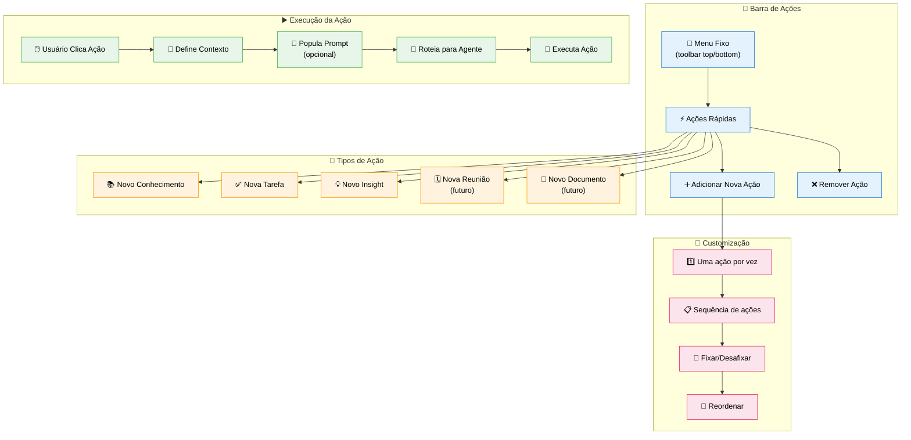
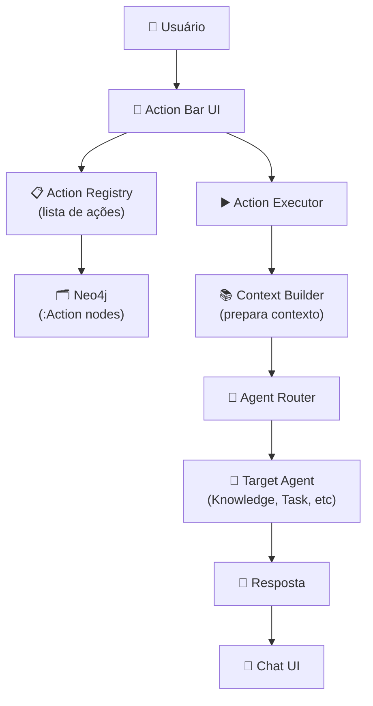

# Feature Specification: Chat Action Menu System

**Feature Branch**: `006-chat-action-menu`  
**Created**: 2025-12-07  
**Status**: Draft  
**Priority**: P1 (MVP Core)  
**Source**: User input (voice transcription)

## Process Flow (Business View)



### Flow Insights

**Gaps identificados**:
- Ações são globais ou por usuário? (provavelmente por usuário)
- Como funciona "adicionar nova ação"? Dropdown com opções pré-definidas?
- "Nova Pessoa" faz sentido como ação? (parece mais admin feature)
- Ações podem ter ícones customizados?
- Limite de ações simultâneas visíveis?

**Oportunidades identificadas**:
- Templates de ações: ações pré-configuradas para diferentes perfis de usuário
- Ações contextuais: aparecem baseadas no contexto da conversa
- Atalhos de teclado para ações frequentes (Ctrl+K → Conhecimento)
- Analytics: quais ações mais usadas por usuário
- Ações compostas: sequência automática (ex: Reunião → Resumo → Tarefas)

**Riscos identificados**:
- UI poluída com muitas ações
- Usuário não entende o que cada ação faz
- Ações redundantes (já pode fazer via mensagem normal)
- Performance: carregar ações dinamicamente pode adicionar latência

---

## Agent Collaboration



### Action → Agent Mapping

| Ação | Agente Alvo | Contexto Injetado | Prompt Template |
|------|-------------|-------------------|-----------------|
| **Novo Conhecimento** | Knowledge Agent | Última conversa + docs mencionados | "Extraia conhecimento estruturado de:" |
| **Nova Tarefa** | Task Agent | Última conversa + objetivos | "Gere plano de ação baseado em:" |
| **Novo Insight** | Router Agent | Toda a conversa + dados relevantes | "Analise e gere insights sobre:" |

---

## User Scenarios & Testing

### User Story 1 - Usar Ação Rápida "Nova Tarefa" (Priority: P1)

Usuário está discutindo projeto no chat. Clica ação "Nova Tarefa" no menu. Sistema analisa conversa e gera plano de ação automaticamente.

**Why this priority**: Core do MVP. Ações rápidas economizam tempo e melhoram UX.

**Independent Test**: Clicar ação, verificar que agente correto é acionado e contexto é passado.

**Acceptance Scenarios**:

1. **Given** usuário em conversa sobre projeto, **When** clica "✅ Nova Tarefa", **Then** Task Agent é acionado com contexto da conversa

2. **Given** Task Agent executado, **When** gera tarefas, **Then** resultado aparece no chat como resposta estruturada

3. **Given** ação executada, **When** histórico é verificado, **Then** mensagem tem tag `action: "new_task"` para analytics

---

### User Story 2 - Adicionar Nova Ação ao Menu (Priority: P2)

Usuário quer ação "Nova Reunião" mas não está visível. Clica "+", seleciona "Nova Reunião" de dropdown, e ação é adicionada ao menu.

**Why this priority**: Customização. Diferentes usuários têm workflows diferentes.

**Independent Test**: Adicionar ação, verificar que aparece no menu e é persistida.

**Acceptance Scenarios**:

1. **Given** usuário no chat, **When** clica botão "➕" no action bar, **Then** dropdown mostra ações disponíveis não visíveis

2. **Given** usuário seleciona "📅 Nova Reunião", **When** confirma, **Then** ação aparece no action bar

3. **Given** ação adicionada, **When** usuário recarrega página, **Then** ação permanece visível (persistida no Neo4j)

---

### User Story 3 - Uma Ação Por Vez (Priority: P1)

Usuário clica "Nova Tarefa", depois clica "Novo Conhecimento". Sistema executa primeira, depois segunda (não paralelo).

**Why this priority**: Simplicidade de implementação. Evita conflitos e confusão.

**Independent Test**: Clicar 2 ações rapidamente, verificar execução sequencial.

**Acceptance Scenarios**:

1. **Given** usuário clica "Nova Tarefa", **When** Task Agent está processando, **Then** outros botões ficam disabled

2. **Given** Task Agent terminou, **When** usuário clica "Novo Conhecimento", **Then** Knowledge Agent inicia (não paralelo)

3. **Given** ações em sequência, **When** completas, **Then** ambas aparecem no histórico do chat na ordem

---

### User Story 4 - Remover Ação do Menu (Priority: P2)

Usuário raramente usa "Nova Pessoa", quer limpar UI. Clica ícone de remover (ou long press), e ação some do menu.

**Why this priority**: Evitar poluição visual. Menu deve ser clean e focado.

**Independent Test**: Remover ação, verificar que não aparece mais mas pode ser re-adicionada.

**Acceptance Scenarios**:

1. **Given** usuário no action bar, **When** faz long press em "👤 Nova Pessoa", **Then** opção "Remover" aparece

2. **Given** confirmação aceita, **When** ação é removida, **Then** some do action bar

3. **Given** ação removida, **When** usuário clica "+", **Then** "Nova Pessoa" aparece como opção para adicionar

---

### User Story 5 - Reordenar Ações (Priority: P3)

Usuário usa "Nova Tarefa" muito mais que "Novo Insight". Arrasta ação para reordenar, colocando favoritas no início.

**Why this priority**: Nice to have. Melhora UX mas não é bloqueante.

**Independent Test**: Drag and drop ação, verificar nova ordem é salva.

**Acceptance Scenarios**:

1. **Given** usuário no action bar, **When** segura e arrasta "Nova Tarefa" para primeira posição, **Then** ordem muda visualmente

2. **Given** ordem mudada, **When** usuário solta ação, **Then** nova ordem é salva no Neo4j (`order: integer`)

3. **Given** ordem salva, **When** usuário recarrega página, **Then** ações aparecem na nova ordem

---

## Functional Requirements

### Action Bar UI

**REQ-ACT-001**: Sistema DEVE exibir action bar fixo no chat (top ou bottom)  
**REQ-ACT-002**: Action bar DEVE ser responsivo: desktop = horizontal, mobile = vertical/collapsible  
**REQ-ACT-003**: Cada ação DEVE ter: ícone, label, tooltip descritivo  
**REQ-ACT-004**: Action bar DEVE ter botão "➕" para adicionar ações

### Action Types

**REQ-ACT-005**: MVP DEVE suportar ações: "Novo Conhecimento", "Nova Tarefa", "Novo Insight"  
**REQ-ACT-006**: Futuro PODE adicionar: "Nova Reunião", "Novo Documento", "Nova Pessoa"  
**REQ-ACT-007**: Cada ação DEVE ter `targetAgent` definido (Knowledge, Task, Router)  
**REQ-ACT-008**: Cada ação PODE ter `promptTemplate` para popular mensagem

### Action Execution

**REQ-ACT-009**: Clicar ação DEVE injetar contexto no agente alvo  
**REQ-ACT-010**: Contexto DEVE incluir: últimas N mensagens (N=5 default), docs mencionados  
**REQ-ACT-011**: Ações DEVEM executar uma por vez (não paralelo)  
**REQ-ACT-012**: Ação em execução DEVE desabilitar outros botões (UI feedback)  
**REQ-ACT-013**: Resultado da ação DEVE aparecer no chat como mensagem do agente

### Customization

**REQ-ACT-014**: Usuário DEVE poder adicionar ações de lista pré-definida  
**REQ-ACT-015**: Usuário DEVE poder remover ações do menu (soft delete)  
**REQ-ACT-016**: Ações removidas PODEM ser re-adicionadas  
**REQ-ACT-017**: Usuário PODE reordenar ações (drag and drop ou up/down buttons)  
**REQ-ACT-018**: Configuração de ações DEVE ser persistida no Neo4j por usuário

### Defaults

**REQ-ACT-019**: Novo usuário DEVE ter ações padrão: "Novo Conhecimento", "Nova Tarefa"  
**REQ-ACT-020**: Admin PODE definir ações padrão por perfil (Mentor vs Startup)

---

## Success Criteria

### Adoption
- ✅ 60%+ dos usuários usam pelo menos 1 ação por semana
- ✅ "Nova Tarefa" é ação mais usada (>40% do total)
- ✅ Taxa de customização: 30%+ dos usuários adicionam/removem ações

### Usability
- ✅ Tempo médio para executar ação: <5s (click → resposta)
- ✅ Taxa de erro/abandono: <5% (usuário entende o que ação faz)
- ✅ NPS específico de ações: >70 (usuários acham útil)

### Performance
- ✅ Latência de execução: <3s (não adiciona overhead vs mensagem normal)
- ✅ UI responsiva: ações aparecem em <100ms ao carregar chat

---

## Key Entities

### Neo4j Node Structure

```cypher
// Action definition (global template)
(:ActionDefinition {
  id: string, // "new_knowledge"
  name: string, // "Novo Conhecimento"
  icon: string, // "book" (lucide icon name)
  targetAgent: string, // "knowledge_agent"
  promptTemplate: string, // "Extraia conhecimento de: {context}"
  category: string, // "knowledge" | "task" | "insight"
  defaultOrder: integer, // ordem sugerida
  active: boolean,
  createdAt: datetime
})

// User action config (per-user customization)
(:UserActionConfig {
  id: string,
  userId: string,
  actionDefinitionId: string,
  isVisible: boolean, // no action bar
  customOrder: integer, // ordem customizada
  customIcon: string (optional), // override icon
  customLabel: string (optional), // override label
  usageCount: integer, // analytics
  lastUsedAt: datetime,
  createdAt: datetime,
  updatedAt: datetime
})

// Action execution log
(:ActionExecution {
  id: string,
  userId: string,
  actionDefinitionId: string,
  conversationId: string,
  contextSnapshot: string, // JSON das últimas N msgs
  agentUsed: string,
  executionTimeMs: integer,
  success: boolean,
  timestamp: datetime
})

// Relationships
(:User)-[:HAS_ACTION_CONFIG]->(:UserActionConfig)
(:UserActionConfig)-[:BASED_ON]->(:ActionDefinition)
(:User)-[:EXECUTED_ACTION]->(:ActionExecution)
(:ActionExecution)-[:USED_DEFINITION]->(:ActionDefinition)
```

---

## Technical Constraints

### Frontend
- Action bar pode usar Radix UI Toolbar ou custom component
- Drag and drop pode usar `react-beautiful-dnd` ou `dnd-kit`
- Mobile: action bar colapsável em floating action button (FAB)

### Backend
- Action executor pode reusar mesma infraestrutura de router
- Context builder extrai últimas N mensagens + menções (@)
- Prompt template usa string interpolation simples

### Neo4j
- Índice obrigatório: `UserActionConfig.userId`, `ActionDefinition.id`
- Constraint: `(UserActionConfig.userId, UserActionConfig.actionDefinitionId)` UNIQUE

---

## Action Definitions (Initial MVP)

```json
[
  {
    "id": "new_knowledge",
    "name": "Novo Conhecimento",
    "icon": "book",
    "targetAgent": "knowledge_agent",
    "promptTemplate": "Extraia e estruture conhecimento da nossa conversa recente.",
    "category": "knowledge",
    "defaultOrder": 1
  },
  {
    "id": "new_task",
    "name": "Nova Tarefa",
    "icon": "check-square",
    "targetAgent": "task_agent",
    "promptTemplate": "Gere um plano de ação baseado na nossa conversa.",
    "category": "task",
    "defaultOrder": 2
  },
  {
    "id": "new_insight",
    "name": "Novo Insight",
    "icon": "lightbulb",
    "targetAgent": "router_agent",
    "promptTemplate": "Analise a conversa e gere insights estratégicos.",
    "category": "insight",
    "defaultOrder": 3
  }
]
```

---

## Assumptions

1. **Execution Model**: Ações são shortcuts para mensagens pré-formatadas (não chamadas API separadas)
2. **Context Size**: Últimas 5 mensagens suficientes para maioria das ações
3. **Customization Limit**: MVP permite add/remove/reorder mas não criar ações do zero
4. **Agent Availability**: Ações assumem que targetAgent existe e está ativo
5. **Mobile UX**: Action bar colapsa em FAB com 1-2 ações principais visíveis

---

## Open Questions

1. **Nova Pessoa**: Essa ação faz sentido para usuário final ou é admin feature?
2. **Ações Customizadas**: Usuário avançado pode criar ações próprias (definir targetAgent + prompt)?
3. **Ações Condicionais**: Ações aparecem/desaparecem baseado em contexto? (ex: "Resumir" só se conversa >10 msgs)
4. **Atalhos de Teclado**: Suportar Ctrl+K, Ctrl+T, etc?
5. **Feedback Visual**: Mostrar progress bar durante execução da ação?

---

## Related Specs

- **005-agent-router**: Ações usam router para direcionar ao agente correto
- **001-knowledge-pipeline**: Ação "Novo Conhecimento" aciona pipeline completo
- **TRG-SPC-002-task-generation**: Ação "Nova Tarefa" é interface principal para Task Agent

---

## References

- Constitution: A.II (Não Poluir Código), A.IV (Gestão de Prompts)
- UX Reference: Notion quick actions, Slack shortcuts
- Radix UI Toolbar: https://www.radix-ui.com/primitives/docs/components/toolbar
