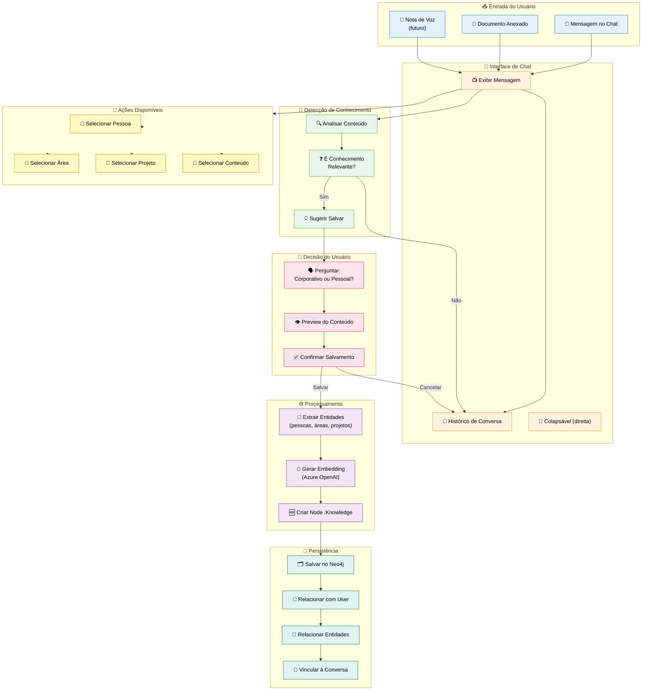
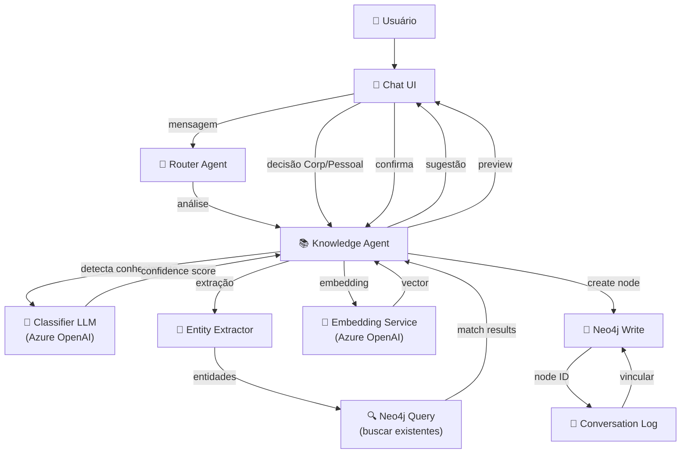

# Feature Specification: Chat & Knowledge Capture

**Feature Branch**: `007-chat-knowledge-capture`  
**Created**: 2025-12-07  
**Status**: Draft  
**Priority**: P1 (MVP Core)  
**Source**: TRG-SPC-20251206-001 + chat.txt context

## Process Flow (Business View)



### Flow Insights

**Gaps identificados**:
- Como detectar se conteúdo é "conhecimento relevante" vs conversa casual?
- Threshold de confiança para sugestão automática vs manual?
- Timeout se usuário não responde à pergunta Corp/Pessoal?
- Como lidar com conhecimento que muda ao longo do tempo (versioning)?
- Seleção de entidades (@mentions) funciona como autocomplete ou busca?

**Oportunidades identificadas**:
- Auto-detecção de reuniões (se documento tem participantes + data + ações)
- Sugestão inteligente de Corp/Pessoal baseada em histórico do usuário
- Extração automática de tarefas durante salvamento de conhecimento
- Preview mostra relacionamentos potenciais (pessoas, áreas já no grafo)
- Batch save: múltiplas mensagens selecionadas de uma vez

**Riscos identificados**:
- Falsos positivos: sugerir salvar conversa trivial
- Falsos negativos: não detectar conhecimento importante
- Latência: análise não pode travar chat (deve ser assíncrona)
- Privacy: conhecimento "Pessoal" vazar para outros usuários
- Conflito: mesmo conhecimento classificado diferente por diferentes users

---

## Agent Collaboration



### Data Flow

| From | To | What is passed | Purpose |
|------|-----|----------------|---------|
| **User** | Chat UI | Texto da mensagem | Input conversacional |
| **Chat UI** | Router Agent | Mensagem + histórico | Determinar agente apropriado |
| **Router Agent** | Knowledge Agent | Mensagem + contexto | Processar conhecimento |
| **Knowledge Agent** | Classifier LLM | Texto da mensagem | Avaliar se é conhecimento relevante |
| **Classifier LLM** | Knowledge Agent | {isKnowledge: bool, confidence: float, entities: []} | Resultado da análise |
| **Knowledge Agent** | Chat UI | Sugestão de salvamento + preview | Solicitar decisão do usuário |
| **Chat UI** | Knowledge Agent | {scope: "corporate"/"personal", confirmed: bool} | Decisão do usuário |
| **Knowledge Agent** | Entity Extractor | Texto do conhecimento | Identificar pessoas, áreas, projetos mencionados |
| **Entity Extractor** | Neo4j Query | Lista de entidades | Buscar nodes existentes |
| **Neo4j Query** | Knowledge Agent | Nodes encontrados | Preparar relacionamentos |
| **Knowledge Agent** | Embedding Service | Texto limpo | Gerar vetor para busca semântica |
| **Embedding Service** | Knowledge Agent | Vector[1536] | Embedding do conhecimento |
| **Knowledge Agent** | Neo4j Write | Node :Knowledge + relacionamentos | Persistir no grafo |
| **Neo4j Write** | Conversation Log | Node ID | Registrar knowledge capturado na conversa |

---

## User Scenarios & Testing

### User Story 1 - Salvar Conhecimento de Mensagem (Priority: P0 - BLOQUEANTE)

Usuário envia mensagem "Nossa startup foca em HealthTech e usa IA para diagnóstico precoce". Sistema detecta conhecimento, pergunta Corp/Pessoal, e salva no Neo4j.

**Why this priority**: **BLOQUEANTE MVP**. Sem isso, não há captura de conhecimento. É a feature #1 que "dá valor ao usuário".

**Independent Test**: Enviar mensagem com conhecimento claro, verificar detecção e salvamento.

**Acceptance Scenarios**:

1. **Given** usuário digitando no chat, **When** envia "Nossa startup foca em HealthTech", **Then** Knowledge Agent detecta conhecimento com confidence >0.7 e sugere "💡 Salvar esse conhecimento?"

2. **Given** sugestão de salvamento apareceu, **When** usuário clica "Sim", **Then** modal aparece perguntando "🗣️ Corporativo ou Pessoal?"

3. **Given** usuário seleciona "Corporativo", **When** confirma, **Then** node `:Knowledge` é criado no Neo4j com `visibility: "corporate"` e `ownerId: user.id`

4. **Given** knowledge salvo, **When** outro usuário da mesma empresa busca "HealthTech", **Then** esse conhecimento aparece nos resultados (se scope permitir)

---

### User Story 2 - Anexar Documento e Extrair Conhecimento (Priority: P1)

Usuário anexa PDF sobre "Plano de Go-to-Market". Sistema processa documento, detecta conhecimento, e pergunta se quer salvar.

**Why this priority**: Documentos são fonte rica de conhecimento estruturado. Complementa captura de chat.

**Independent Test**: Upload PDF, verificar processamento e extração.

**Acceptance Scenarios**:

1. **Given** usuário no chat, **When** anexa PDF "GTM-Strategy.pdf", **Then** sistema mostra "📄 Processando documento..."

2. **Given** PDF processado via Docling, **When** Knowledge Agent analisa conteúdo, **Then** detecta seções como "Target Market", "Pricing Strategy" e sugere salvar cada uma

3. **Given** múltiplas seções detectadas, **When** usuário escolhe "Salvar Todas", **Then** nodes separados são criados, todos vinculados ao documento pai

4. **Given** documento salvo, **When** chunks são criados, **Then** cada chunk tem relacionamento `:NEXT_CHUNK` sequencial + `:PART_OF` para documento

---

### User Story 3 - Selecionar Pessoa/Área no Chat (Priority: P1)

Durante conversa, usuário quer mencionar uma área específica. Digita "@Tecnol" e sistema mostra autocomplete com "Tecnologia (CVC)" e "Tecnologia (Startup XYZ)".

**Why this priority**: Relacionamentos entre conhecimento e entidades são core do grafo. Autocomplete facilita UX.

**Independent Test**: Digitar @ seguido de termo, verificar sugestões do Neo4j.

**Acceptance Scenarios**:

1. **Given** usuário digitando mensagem, **When** digita "@Tecno", **Then** dropdown aparece com sugestões de nodes `:Area` que match o termo

2. **Given** dropdown exibido, **When** usuário seleciona "Tecnologia (CVC)", **Then** tag é inserida no texto como `@Area:uuid-123`

3. **Given** mensagem com @mentions enviada, **When** Knowledge Agent processa, **Then** relacionamentos `:MENTIONS` são criados para cada entidade mencionada

4. **Given** conhecimento salvo com mentions, **When** usuário busca por "Tecnologia", **Then** esse conhecimento aparece como relacionado

---

### User Story 4 - Preview de Conhecimento Antes de Salvar (Priority: P1)

Usuário confirmou salvamento Corp/Pessoal. Antes de persistir, sistema mostra preview com: texto extraído, entidades detectadas, relacionamentos potenciais.

**Why this priority**: Transparência. Usuário vê exatamente o que será salvo e pode corrigir antes de confirmar.

**Independent Test**: Trigger salvamento, verificar modal de preview com dados corretos.

**Acceptance Scenarios**:

1. **Given** usuário escolheu "Corporativo", **When** sistema processa, **Then** modal preview aparece com: "📝 Texto", "🔬 Entidades", "🔗 Relacionamentos"

2. **Given** preview exibido, **When** mostra entidades "Pessoa: João Silva, Área: Marketing", **Then** usuário pode editar/remover antes de salvar

3. **Given** usuário edita entidades, **When** clica "Confirmar", **Then** apenas entidades editadas são relacionadas no grafo

4. **Given** preview confirmado, **When** salvamento completo, **Then** mensagem de sucesso "✅ Conhecimento salvo!" aparece no chat

---

### User Story 5 - Histórico de Conversa Persistente (Priority: P1)

Usuário fecha chat e retorna depois. Histórico de conversa é carregado do Neo4j, incluindo mensagens, conhecimentos salvos, e ações tomadas.

**Why this priority**: Continuidade. Conversa é contexto essencial para conhecimento futuro.

**Independent Test**: Criar conversa, fechar, reabrir, verificar histórico completo.

**Acceptance Scenarios**:

1. **Given** usuário tem conversa ativa, **When** fecha chat, **Then** node `:Conversation` é atualizado com `lastMessageAt: timestamp`

2. **Given** usuário retorna ao chat, **When** abre interface, **Then** últimas 50 mensagens são carregadas do Neo4j (query otimizada)

3. **Given** histórico carregado, **When** exibe mensagens, **Then** conhecimentos salvos têm badge "📚 Salvo" e são clicáveis (navega para node)

4. **Given** conversa muito longa (>1000 msgs), **When** histórico é requisitado, **Then** resumo é mostrado + opção "Carregar mais antigas"

---

## Functional Requirements

### Chat Interface

**REQ-CHT-001**: Sistema DEVE exibir chat colapsável no lado direito da interface  
**REQ-CHT-002**: Chat DEVE mostrar histórico de mensagens (user + agent)  
**REQ-CHT-003**: Chat DEVE suportar texto, anexos (PDF, DOCX, imagens), e futuramente áudio  
**REQ-CHT-004**: Chat DEVE ter input field com suporte a @mentions (autocomplete de entidades)  
**REQ-CHT-005**: Mensagens DEVEM ter timestamp, autor (user/agent), e status (enviando/enviada/erro)

### Histórico Expansível & Gerenciamento de Conversas

**REQ-CHT-006-EXT**: Chat DEVE ter painel de **histórico de conversas** expansível ao lado do chat principal  
**REQ-CHT-007-EXT**: Painel de histórico DEVE listar conversas recentes com título (auto-gerado ou nomeado pelo usuário) e timestamp  
**REQ-CHT-008-EXT**: Histórico DEVE ser expansível/colapsável de forma independente do chat (só o histórico expande, chat permanece)  
**REQ-CHT-009-EXT**: Cada conversa no histórico DEVE ter ícone de **deletar** (⚠️ com confirmação "Tem certeza?")  
**REQ-CHT-010-EXT**: Deletar conversa DEVE remover node `:Conversation` do Neo4j (ou marcar como `deleted: true` para auditoria)  
**REQ-CHT-011-EXT**: Histórico DEVE permitir renomear conversa (clique duplo ou ícone de editar)  
**REQ-CHT-012-EXT**: Usuário DEVE poder fixar conversas importantes (aparecem no topo do histórico)

### Knowledge Detection

**REQ-CHT-006**: Sistema DEVE analisar cada mensagem do usuário para detectar conhecimento relevante  
**REQ-CHT-007**: Detecção DEVE usar LLM (Azure OpenAI) com confidence score (0-1)  
**REQ-CHT-008**: Sistema DEVE sugerir salvamento se confidence >0.7  
**REQ-CHT-009**: Sugestão DEVE aparecer como botão não-intrusivo ("💡 Salvar conhecimento?")  
**REQ-CHT-010**: Sistema NÃO DEVE sugerir salvamento para: saudações, confirmações simples ("ok", "entendi"), perguntas genéricas

### User Decision & Classificação Visível

**REQ-CHT-011**: Ao clicar "Salvar", sistema DEVE perguntar "Corporativo ou Pessoal?"  
**REQ-CHT-012**: Modal DEVE ter descrições claras: "Corporativo = visível para sua empresa", "Pessoal = só você vê"  
**REQ-CHT-013**: Se usuário não responde em 30s, modal DEVE fechar (sem salvar)  
**REQ-CHT-014**: Sistema DEVE lembrar preferência padrão do usuário (ex: "sempre Pessoal para documentos")  
**REQ-CHT-015-VIS**: Chat DEVE ter **botão/toggle sempre visível** para selecionar tipo de conhecimento ANTES de enviar mensagem (ex: ícone de "🔒 Pessoal" ou "🏢 Corporativo" no header ou ao lado do input)  
**REQ-CHT-016-VIS**: Botão de tipo DEVE refletir seleção atual com cor/ícone distinto (Pessoal = azul/ícone de pessoa, Corporativo = roxo/ícone de empresa)  
**REQ-CHT-017-VIS**: Seleção de tipo DEVE influenciar **contexto de salvamento**: se usuário escolhe "Corporativo", mensagens/anexos enviados nessa sessão defaultam para corporativo  
**REQ-CHT-018-VIS**: Tipo selecionado DEVE ser persistido por sessão (não reseta a cada mensagem)  
**REQ-CHT-019-VIS**: **"Pessoal" significa persona dentro da empresa**, NÃO assuntos pessoais fora do trabalho (tooltip deve deixar isso claro)

### Knowledge Processing

**REQ-CHT-015**: Sistema DEVE extrair entidades: pessoas (@Person), áreas (@Area), projetos (@Project)  
**REQ-CHT-016**: Sistema DEVE buscar no Neo4j se entidades já existem antes de criar duplicatas  
**REQ-CHT-017**: Sistema DEVE gerar embedding (Azure OpenAI text-embedding-3-small) para busca semântica  
**REQ-CHT-018**: Preview DEVE mostrar: texto original, texto limpo, entidades detectadas, relacionamentos potenciais

### Neo4j Persistence

**REQ-CHT-019**: Sistema DEVE criar node `:Knowledge` com atributos: content, visibility, ownerId, createdAt, embedding  
**REQ-CHT-020**: Sistema DEVE criar relacionamentos: `(:User)-[:CREATED]->(:Knowledge)`, `(:Knowledge)-[:MENTIONS]->(:Person|:Area|:Project)`  
**REQ-CHT-021**: Knowledge DEVE ser vinculado à conversa: `(:Conversation)-[:CONTAINS_KNOWLEDGE]->(:Knowledge)`  
**REQ-CHT-022**: Sistema DEVE aplicar regras de visibilidade: Corp = mesmo company_id, Pessoal = mesmo user_id

### Document Handling

**REQ-CHT-023**: Sistema DEVE processar documentos via Docling (async)  
**REQ-CHT-024**: Documentos DEVEM virar node `:Document` + múltiplos nodes `:Chunk`  
**REQ-CHT-025**: Chunks DEVEM ter relacionamento sequencial: `(:Chunk)-[:NEXT_CHUNK]->(:Chunk)`  
**REQ-CHT-026**: Tabelas em documentos DEVEM ser convertidas para JSON e armazenadas como propriedade

### @Mentions & Autocomplete

**REQ-CHT-027**: Digitar "@" DEVE abrir dropdown com sugestões de entidades  
**REQ-CHT-028**: Sugestões DEVEM vir do Neo4j (query MATCH nodes WHERE name CONTAINS term)  
**REQ-CHT-029**: Seleção de entidade DEVE inserir tag `@Type:uuid` no texto  
**REQ-CHT-030**: Sistema DEVE resolver @mentions para criar relacionamentos `:MENTIONS` ao salvar

---

## Success Criteria

### Detection Accuracy
- ✅ 85%+ de conhecimento relevante é detectado (precision)
- ✅ <10% de falsos positivos (sugestões desnecessárias)
- ✅ Confidence score calibrado: >0.9 = alta certeza, 0.7-0.9 = sugestão, <0.7 = ignora

### User Adoption
- ✅ 70%+ dos usuários salvam pelo menos 1 conhecimento na primeira semana
- ✅ Taxa de confirmação de salvamento: >60% (usuários que clicam "Salvar" e confirmam)
- ✅ Tempo médio para salvar conhecimento: <15 segundos (detecção → decisão → confirmação)

### Performance
- ✅ Latência de detecção: <500ms (não bloqueia envio da mensagem)
- ✅ Preview de conhecimento: <2s para gerar
- ✅ Histórico de chat: <1s para carregar últimas 50 mensagens
- ✅ @mentions autocomplete: <300ms para buscar e exibir sugestões

### Data Quality
- ✅ 100% dos knowledge nodes têm embedding gerado
- ✅ 90%+ das entidades mencionadas são corretamente linkadas (não duplicadas)
- ✅ Relacionamentos Corp/Pessoal respeitados: 0 vazamentos de conhecimento Pessoal

---

## Key Entities

### Neo4j Node Structure

```cypher
// Knowledge node (conteúdo capturado)
(:Knowledge {
  id: string, // UUID
  content: string, // texto original
  contentClean: string, // texto processado (sem @mentions)
  visibility: string, // "corporate" | "personal"
  ownerId: string, // user.id do criador
  companyId: string, // para filtrar Corp
  confidence: float, // score da detecção (0-1)
  embedding: float[], // vector[1536] para busca semântica
  extractedAt: datetime,
  createdAt: datetime,
  updatedAt: datetime
})

// Conversation node (sessão de chat)
(:Conversation {
  id: string,
  userId: string,
  title: string, // gerado automaticamente ou user-defined
  summary: string, // resumo dinâmico (atualizado a cada 5 msgs)
  lastMessageAt: datetime,
  messageCount: integer,
  knowledgeCount: integer, // quantos knowledge capturados
  active: boolean,
  createdAt: datetime,
  // Campos complementares definidos em 025-conversation-persistence-system
  taskId: string?,            // Tarefa Ativa associada (quando aplicável)
  persistence_policy: string, // "full" | "insights_only" | "ephemeral"
  memory_scope: string,       // "corporate" | "personal" (decisão 009)
  deleted: boolean            // conversa foi removida da UI (histórico)
})

// Message node (cada mensagem do chat)
(:Message {
  id: string,
  conversationId: string,
  authorType: string, // "user" | "agent"
  authorId: string, // user.id ou agent.id
  content: string,
  contentType: string, // "text" | "document" | "voice"
  attachmentRef: string (optional), // ref para arquivo anexado
  knowledgeSuggested: boolean, // se sugestão foi feita
  knowledgeSaved: boolean, // se foi salvo
  timestamp: datetime
})

// Document node (arquivo anexado)
(:Document {
  id: string,
  filename: string,
  fileType: string, // "pdf" | "docx" | "txt"
  fileSize: integer, // bytes
  uploadedBy: string, // user.id
  processedAt: datetime (optional),
  doclingMetadata: json, // metadata from Docling
  createdAt: datetime
})

// Chunk node (pedaço de documento)
(:Chunk {
  id: string,
  documentId: string,
  sequence: integer, // ordem no documento (1, 2, 3...)
  content: string,
  chunkType: string, // "paragraph" | "table" | "list" | "heading"
  embedding: float[],
  createdAt: datetime
})

// Relationships
(:User)-[:CREATED]->(:Knowledge)
(:User)-[:STARTED]->(:Conversation)
(:Conversation)-[:CONTAINS]->(:Message)
(:Conversation)-[:CONTAINS_KNOWLEDGE]->(:Knowledge)
(:Message)-[:GENERATED_KNOWLEDGE]->(:Knowledge)
(:Knowledge)-[:MENTIONS]->(:Person|:Area|:Project)
(:Knowledge)-[:EXTRACTED_FROM]->(:Document)
(:Document)-[:HAS_CHUNK]->(:Chunk)
(:Chunk)-[:NEXT_CHUNK]->(:Chunk)
```

---

## Technical Constraints

### Frontend
- Chat UI pode usar biblioteca de componentes (Radix UI, Shadcn)
- Markdown rendering para mensagens (biblioteca: `react-markdown`)
- @mentions autocomplete pode usar `react-mentions` ou similar
- Collapse/expand animation suave (<300ms)

### Backend
- Knowledge detection via Azure OpenAI gpt-4o-mini (custo-benefício)
- Embedding via text-embedding-3-small (1536 dimensions)
- Docling para processamento de documentos (async com fila)
- Neo4j Cypher queries otimizadas (índices em Knowledge.ownerId, Knowledge.companyId)

### Neo4j
- Índice obrigatório: `Knowledge.id`, `Knowledge.embedding` (vector index)
- Constraint: `Knowledge.id` UNIQUE
- Full-text index em `Knowledge.content` para busca textual
- Vector index para busca semântica: `CALL db.index.vector.createNodeIndex(...)`

### Agno Framework
- Knowledge Agent usa `Agent(name="Knowledge Agent", instructions=prompt, enable_user_memories=True)`
- Router Agent decide quando acionar Knowledge Agent vs outros
- Classifier pode ser função auxiliar (não precisa ser Agent separado)

---

## Assumptions

1. **Detection Model**: GPT-4o-mini suficiente para classificar conhecimento (não precisa fine-tuning)
2. **Embedding Model**: text-embedding-3-small adequado para busca semântica
3. **Conversation Scope**: Cada conversa é isolada (não compartilha contexto entre conversas diferentes)
4. **Corporate Visibility**: "Corporativo" = visível para todos da mesma `company_id`, independente de área
5. **Document Processing**: Docling consegue processar 95%+ dos documentos sem falhas críticas

---

## Open Questions

1. **Timeout Behavior**: Se usuário não responde Corp/Pessoal em 30s, salvar como Pessoal (safe default) ou cancelar?
2. **Bulk Save**: Permitir selecionar múltiplas mensagens e salvar todas de uma vez?
3. **Versioning**: Se usuário edita conhecimento depois, criar nova versão ou sobrescrever?
4. **Search Integration**: Busca de conhecimento fica dentro do chat ou é feature separada?
5. **Notification**: Avisar usuário quando conhecimento Corp dele é visualizado por outro user?

---

## Related Specs

- **001-knowledge-pipeline**: Chat é input principal do pipeline (spec 001 detalha processamento)
- **005-agent-router**: Router decide quando usar Knowledge Agent
- **006-chat-action-menu**: Ação "Novo Conhecimento" pode forçar salvamento de mensagem selecionada
- **TRG-SPC-034-user-memory-decision**: Decisão Corp/Pessoal é spec separada (detalhamento da pergunta)

---

## References

- Agno Framework: `Agent`, `enable_user_memories`, `user_id` parameter
- Azure OpenAI: gpt-4o-mini (classification), text-embedding-3-small (embeddings)
- Neo4j: Vector index, Full-text index, Cypher queries
- Docling: Document processing, chunking, table extraction
- Constitution: A.I (Zero Hardcode), A.IV (Gestão de Prompts), A.VI (Grafos Central)
