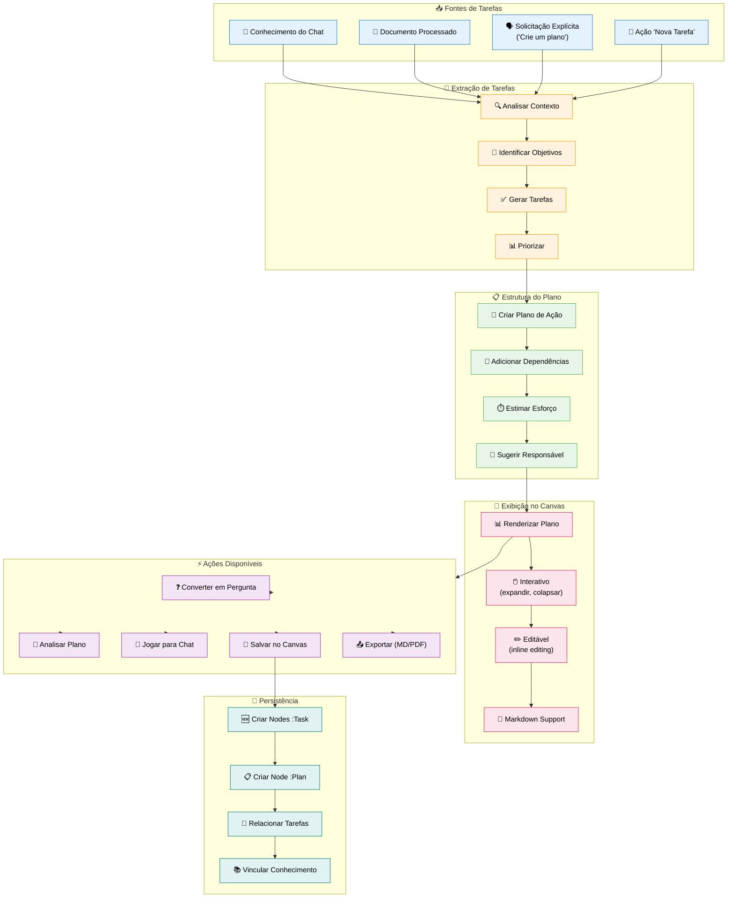
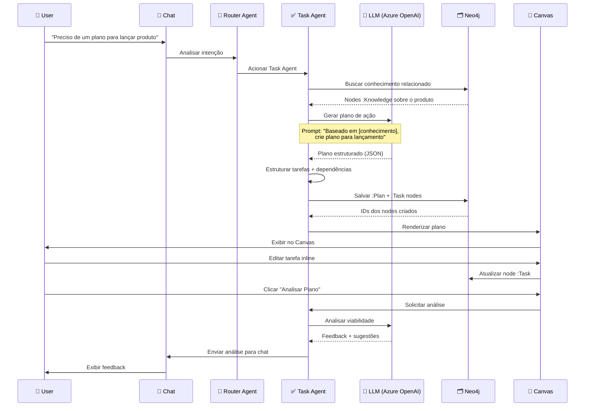

# Feature Specification: Task Generation & Canvas

**Feature Branch**: `008-task-generation-canvas`  
**Created**: 2025-12-07  
**Status**: Draft  
**Priority**: P1 (MVP Core)  
**Source**: TRG-SPC-20251206-002 + chat.txt context

## Process Flow (Business View)



### Flow Insights

**Gaps identificados**:
- Como detectar automaticamente objetivos vs tarefas vs sub-tarefas?
- Canvas pode exibir múltiplos planos simultaneamente ou um por vez?
- "Converter em Pergunta" gera nova mensagem no chat ou abre modal?
- Edição inline no Canvas persiste automaticamente ou precisa "Salvar"?
- Dependências de tarefas são detectadas automaticamente ou usuário define?

**Oportunidades identificadas**:
- Auto-detecção de deadlines mencionados no conhecimento
- Sugestão inteligente de responsável baseada em área/habilidades do user
- Templates de plano (Go-to-Market, Product Launch, Sprint Planning)
- Drag-and-drop para reordenar tarefas no Canvas
- Visualização em Kanban (Backlog, In Progress, Done)
- Integração com calendário (tarefas viram eventos)

**Riscos identificados**:
- Over-engineering: gerar tarefas muito granulares ou muito vagas
- Latência: geração de plano complexo pode levar >5s
- Conflito: múltiplos usuários editando mesmo plano simultaneamente
- Perda de dados: edição no Canvas não salva se usuário fecha página
- UX: Canvas poluído com muitos planos antigos

---

## Agent Collaboration



### Data Flow

| From | To | What is passed | Purpose |
|------|-----|----------------|---------|
| **User** | Chat | Solicitação de plano | Trigger task generation |
| **Chat** | Router Agent | Mensagem + contexto | Determinar que Task Agent deve ser usado |
| **Router Agent** | Task Agent | Intenção: "task_generation" | Acionar geração de tarefas |
| **Task Agent** | Neo4j | Query: buscar Knowledge relevante | Obter contexto para plano |
| **Neo4j** | Task Agent | Nodes :Knowledge + relacionamentos | Contexto rico para gerar tarefas |
| **Task Agent** | LLM | Prompt + contexto | Gerar plano estruturado |
| **LLM** | Task Agent | {tasks: [{title, description, priority, dependencies}]} | Plano em JSON |
| **Task Agent** | Neo4j | Nodes :Plan + :Task + relacionamentos | Persistir plano |
| **Task Agent** | Canvas | Plan ID + rendered HTML/Markdown | Exibir visualmente |
| **Canvas** | Neo4j | Task updates (inline edits) | Salvar mudanças do usuário |
| **Canvas** | Chat | "Analisar Plano" action | Solicitar feedback do agente |

---

## User Scenarios & Testing

### User Story 1 - Gerar Plano de Ação Automaticamente (Priority: P0 - BLOQUEANTE)

Usuário envia "Preciso de um plano para lançar nosso produto em 3 meses". Task Agent analisa, gera plano com 15 tarefas priorizadas, e exibe no Canvas.

**Why this priority**: **BLOQUEANTE MVP**. É a "segunda funcionalidade que ajuda o usuário" (primeira é captura de conhecimento). Sem isso, não há retroalimentação.

**Independent Test**: Enviar solicitação de plano, verificar geração e exibição.

**Acceptance Scenarios**:

1. **Given** usuário no chat, **When** envia "Crie um plano de lançamento", **Then** Task Agent é acionado automaticamente (Router detecta intenção)

2. **Given** Task Agent acionado, **When** busca conhecimento no Neo4j, **Then** encontra nodes sobre o produto e usa como contexto

3. **Given** contexto obtido, **When** LLM gera plano, **Then** retorna estrutura JSON com: título, objetivos, tarefas (title, description, priority, estimatedHours, assignedTo?)

4. **Given** plano gerado, **When** Task Agent persiste no Neo4j, **Then** cria nodes `:Plan` e múltiplos `:Task`, com relacionamentos `:HAS_TASK` e `:DEPENDS_ON`

5. **Given** plano salvo, **When** Canvas renderiza, **Then** exibe plano com seções colapsáveis, prioridades visual (cores), e status (🔴 não iniciado, 🟡 em progresso, 🟢 concluído)

---

### User Story 2 - Editar Tarefas Inline no Canvas (Priority: P1)

Usuário clica em título de tarefa no Canvas, edita texto inline, e mudança é salva automaticamente no Neo4j.

**Why this priority**: Interatividade do Canvas. Usuário precisa ajustar plano facilmente.

**Independent Test**: Clicar em tarefa, editar, verificar salvamento no Neo4j.

**Acceptance Scenarios**:

1. **Given** plano exibido no Canvas, **When** usuário clica em título da tarefa, **Then** campo vira editável (input inline)

2. **Given** campo editável, **When** usuário digita novo texto e pressiona Enter, **Then** node `:Task` é atualizado no Neo4j com `updatedAt: timestamp`

3. **Given** tarefa atualizada, **When** outro usuário (mesmo plano compartilhado) visualiza Canvas, **Then** vê mudança refletida (real-time ou ao recarregar)

4. **Given** edição inline, **When** usuário clica fora sem pressionar Enter, **Then** mudanças são descartadas (ou salvas se configurado auto-save)

---

### User Story 3 - Converter Plano em Pergunta (Priority: P2)

Usuário vê plano gerado, acha muito genérico, clica "Converter em Pergunta". Sistema gera pergunta contextual e envia para chat.

**Why this priority**: Refinamento. Usuário pode pedir mais detalhes sobre parte específica do plano.

**Independent Test**: Clicar ação "Converter em Pergunta", verificar mensagem no chat.

**Acceptance Scenarios**:

1. **Given** plano exibido no Canvas, **When** usuário clica botão "❓ Converter em Pergunta", **Then** dropdown aparece: "Sobre todo o plano" ou "Sobre tarefa específica"

2. **Given** usuário seleciona "Sobre tarefa 'Definir público-alvo'", **When** confirma, **Then** Task Agent gera pergunta: "Como você gostaria de detalhar a definição do público-alvo? Quais segmentos priorizar?"

3. **Given** pergunta gerada, **When** enviada para chat, **Then** aparece como mensagem do agente, aguardando resposta do usuário

4. **Given** usuário responde pergunta, **When** Task Agent processa resposta, **Then** atualiza tarefa correspondente com detalhes adicionais

---

### User Story 4 - Analisar Viabilidade do Plano (Priority: P1)

Usuário tem plano gerado, clica "Analisar Plano". Task Agent avalia prazo, recursos, dependências, e dá feedback no chat.

**Why this priority**: Inteligência. Sistema não apenas gera, mas também valida e sugere melhorias.

**Independent Test**: Clicar "Analisar", verificar feedback estruturado no chat.

**Acceptance Scenarios**:

1. **Given** plano com 15 tarefas e prazo de 3 meses, **When** usuário clica "🔬 Analisar Plano", **Then** Task Agent soma `estimatedHours` de todas as tarefas

2. **Given** total de horas estimado, **When** Task Agent compara com prazo (3 meses = ~480h úteis), **Then** identifica se é viável ou apertado

3. **Given** análise completa, **When** Task Agent envia feedback para chat, **Then** mensagem estruturada aparece: "✅ Viável", "⚠️ Prazo apertado", "🔴 Inviável" + sugestões de ajuste

4. **Given** sugestões apresentadas, **When** usuário segue sugestão (ex: "Adicionar 2 pessoas na tarefa X"), **Then** pode aplicar mudança diretamente no Canvas

---

### User Story 5 - Jogar Plano para Chat (Priority: P2)

Usuário quer discutir plano com equipe via chat. Clica "Jogar para Chat". Plano é convertido para Markdown e enviado como mensagem.

**Why this priority**: Colaboração. Plano no Canvas é visual, mas discussão acontece no chat.

**Independent Test**: Clicar ação, verificar Markdown formatado no chat.

**Acceptance Scenarios**:

1. **Given** plano no Canvas, **When** usuário clica "💬 Jogar para Chat", **Then** sistema gera Markdown estruturado do plano

2. **Given** Markdown gerado, **When** enviado para chat, **Then** aparece como mensagem do usuário com formatação:
   ```
   # Plano de Lançamento
   ## Objetivo: ...
   ### Tarefas:
   - [ ] Tarefa 1 (Prioridade: Alta)
   - [ ] Tarefa 2 (Prioridade: Média)
   ```

3. **Given** plano no chat, **When** outros usuários veem, **Then** podem responder, sugerir mudanças, e Task Agent pode atualizar plano no Canvas baseado em feedback

4. **Given** discussão no chat, **When** usuário menciona "@TaskAgent atualiza tarefa 3 com feedback do João", **Then** agente atualiza node :Task correspondente

---

### User Story 6 - Visualizar Dependências de Tarefas (Priority: P2)

Plano tem tarefas com dependências (ex: Tarefa 3 depende de Tarefa 1). Canvas mostra visualmente essas dependências.

**Why this priority**: Planejamento. Usuário entende ordem lógica de execução.

**Independent Test**: Criar plano com dependências, verificar visualização.

**Acceptance Scenarios**:

1. **Given** Task Agent gerou plano, **When** identifica dependências (tarefa X menciona resultado de tarefa Y), **Then** cria relacionamento `(:Task)-[:DEPENDS_ON]->(:Task)` no Neo4j

2. **Given** dependências criadas, **When** Canvas renderiza, **Then** exibe setas conectando tarefas dependentes (estilo Gantt simplificado)

3. **Given** visualização com dependências, **When** usuário clica em tarefa, **Then** destaca tarefas das quais depende (upstream) e que dependem dela (downstream)

4. **Given** tarefa com dependência não concluída, **When** usuário tenta marcar como "Em Progresso", **Then** sistema avisa: "⚠️ Tarefa X depende de Y que ainda não foi iniciada"

---

## Functional Requirements

### Task Generation

**REQ-TSK-001**: Sistema DEVE detectar solicitações de plano via Router Agent (keywords: "plano", "tarefas", "ações")  
**REQ-TSK-002**: Task Agent DEVE buscar conhecimento relevante no Neo4j antes de gerar plano  
**REQ-TSK-003**: Sistema DEVE usar LLM (Azure OpenAI gpt-4o) para gerar plano estruturado  
**REQ-TSK-004**: Plano DEVE incluir: título, objetivo, tarefas (título, descrição, prioridade, esforço estimado)  
**REQ-TSK-005**: Sistema DEVE detectar dependências entre tarefas automaticamente (quando possível)

### Canvas Rendering

**REQ-TSK-006**: Canvas DEVE exibir plano com seções colapsáveis (Objetivo, Tarefas, Análise)  
**REQ-TSK-007**: Tarefas DEVEM ter indicadores visuais: prioridade (cores), status (🔴🟡🟢), progresso (%)  
**REQ-TSK-008**: Canvas DEVE suportar Markdown para formatação de texto  
**REQ-TSK-009**: Sistema DEVE renderizar até 3 planos simultaneamente no Canvas (tabs ou split view)  
**REQ-TSK-010**: Canvas DEVE ter scroll infinito para planos longos (>50 tarefas)

### Interactivity

**REQ-TSK-011**: Usuário DEVE poder editar tarefas inline (título, descrição, prioridade)  
**REQ-TSK-012**: Edições inline DEVEM salvar automaticamente no Neo4j (debounce 500ms)  
**REQ-TSK-013**: Usuário DEVE poder marcar tarefa como concluída (checkbox ou status dropdown)  
**REQ-TSK-014**: Canvas DEVE suportar drag-and-drop para reordenar tarefas (futuramente)  
**REQ-TSK-015**: Clique em tarefa DEVE expandir detalhes (descrição completa, comentários, histórico)

### Actions

**REQ-TSK-016**: Botão "Converter em Pergunta" DEVE gerar pergunta contextual e enviar para chat  
**REQ-TSK-017**: Botão "Analisar Plano" DEVE acionar Task Agent para avaliar viabilidade  
**REQ-TSK-018**: Botão "Jogar para Chat" DEVE converter plano para Markdown e postar no chat  
**REQ-TSK-019**: Botão "Exportar" DEVE permitir download em formato Markdown ou PDF  
**REQ-TSK-020**: Botão "Salvar no Canvas" DEVE persistir plano como favorito/pinado

### Neo4j Persistence

**REQ-TSK-021**: Sistema DEVE criar node `:Plan` com atributos: title, objective, createdBy, createdAt, status  
**REQ-TSK-022**: Sistema DEVE criar nodes `:Task` com: title, description, priority, estimatedHours, status, order  
**REQ-TSK-023**: Relacionamentos: `(:Plan)-[:HAS_TASK]->(:Task)`, `(:Task)-[:DEPENDS_ON]->(:Task)`  
**REQ-TSK-024**: Plano DEVE vincular conhecimento origem: `(:Plan)-[:GENERATED_FROM]->(:Knowledge|:Conversation)`  
**REQ-TSK-025**: Tasks PODEM ter responsável: `(:Task)-[:ASSIGNED_TO]->(:User)`

### Collaboration

**REQ-TSK-026**: Plano PODE ser compartilhado: `(:Plan {visibility: "team"})` acessível por área/projeto  
**REQ-TSK-027**: Edições concorrentes DEVEM usar lock otimista (versioning) para evitar conflito  
**REQ-TSK-028**: Sistema DEVE logar mudanças: `(:TaskEdit {userId, field, oldValue, newValue, timestamp})`

---

## Success Criteria

### Generation Quality
- ✅ 80%+ dos planos gerados são considerados úteis pelo usuário (pesquisa)
- ✅ Tarefas geradas têm granularidade adequada (nem muito vagas, nem muito detalhadas)
- ✅ Dependências detectadas automaticamente com 70%+ de acurácia

### User Adoption
- ✅ 60%+ dos usuários geram pelo menos 1 plano na primeira semana
- ✅ Taxa de edição de planos: 80%+ (usuários ajustam planos gerados)
- ✅ Tempo médio de geração: <10 segundos para planos com <20 tarefas

### Performance
- ✅ Latência de geração: <5s para plano simples, <15s para plano complexo
- ✅ Renderização no Canvas: <1s para planos com <50 tarefas
- ✅ Salvamento de edição inline: <300ms (imperceptível ao usuário)

### Interaction
- ✅ Taxa de uso de ações: "Analisar Plano" >40%, "Jogar para Chat" >30%
- ✅ Taxa de conclusão de tarefas: planos têm progresso >50% (não ficam abandonados)

---

## Key Entities

### Neo4j Node Structure

```cypher
// Plan node (plano de ação)
(:Plan {
  id: string,
  title: string,
  objective: string,
  createdBy: string, // user.id
  visibility: string, // "personal" | "team" | "company"
  status: string, // "draft" | "active" | "completed" | "archived"
  progress: float, // 0.0 - 1.0 (% de tarefas concluídas)
  totalTasks: integer,
  completedTasks: integer,
  estimatedTotalHours: float,
  createdAt: datetime,
  updatedAt: datetime,
  completedAt: datetime (optional)
})

// Task node (tarefa individual)
(:Task {
  id: string,
  planId: string,
  title: string,
  description: string,
  priority: string, // "low" | "medium" | "high" | "critical"
  status: string, // "not_started" | "in_progress" | "completed" | "blocked"
  order: integer, // ordem no plano (1, 2, 3...)
  estimatedHours: float,
  actualHours: float (optional),
  assignedTo: string (optional), // user.id
  dueDate: datetime (optional),
  createdAt: datetime,
  updatedAt: datetime,
  completedAt: datetime (optional)
})

// TaskEdit node (histórico de mudanças)
(:TaskEdit {
  id: string,
  taskId: string,
  editedBy: string, // user.id
  field: string, // "title" | "description" | "status" | "priority"
  oldValue: string,
  newValue: string,
  timestamp: datetime
})

// TaskComment node (comentários em tarefas)
(:TaskComment {
  id: string,
  taskId: string,
  authorId: string,
  content: string,
  createdAt: datetime
})

// Relationships
(:User)-[:CREATED]->(:Plan)
(:Plan)-[:HAS_TASK]->(:Task)
(:Task)-[:DEPENDS_ON]->(:Task) // dependências
(:Task)-[:ASSIGNED_TO]->(:User)
(:Task)-[:HAS_EDIT]->(:TaskEdit)
(:Task)-[:HAS_COMMENT]->(:TaskComment)
(:Plan)-[:GENERATED_FROM]->(:Knowledge|:Conversation)
(:Plan)-[:RELATES_TO]->(:Project|:Area)
```

---

## Technical Constraints

### Frontend
- Canvas pode usar biblioteca de rendering (D3.js para grafos, React Flow para dependências)
- Markdown rendering via `react-markdown` ou `marked`
- Inline editing com `contentEditable` ou biblioteca `react-contenteditable`
- Drag-and-drop com `react-beautiful-dnd` ou `dnd-kit`

### Backend
- Task generation via Azure OpenAI gpt-4o (modelo mais capaz para planejamento)
- Prompt engineering: incluir exemplos de bons planos no system prompt
- Análise de viabilidade pode usar função auxiliar (cálculo de horas vs prazo)
- Export PDF via biblioteca `puppeteer` (render HTML → PDF)

### Neo4j
- Índice obrigatório: `Plan.id`, `Task.id`, `Task.planId`
- Constraint: `Plan.id` UNIQUE, `Task.id` UNIQUE
- Query otimizada para buscar plano + tarefas: `MATCH (p:Plan)-[:HAS_TASK]->(t:Task) WHERE p.id = $id RETURN p, collect(t)`
- Dependências via recursive query: `MATCH path = (t:Task)-[:DEPENDS_ON*]->(dep:Task) ...`

### Agno Framework
- Task Agent: `Agent(name="Task Agent", instructions=task_prompt, enable_user_memories=True)`
- Pode usar `run_multi_step=True` para gerar + analisar + refinar plano em múltiplas etapas
- Memória de planos anteriores para aprender padrões do usuário

---

## Assumptions

1. **LLM Capability**: GPT-4o consegue gerar planos estruturados de qualidade (não precisa fine-tuning)
2. **Canvas Limit**: Usuário não precisa visualizar >3 planos simultaneamente (tabs suficientes)
3. **Real-time**: Edições concorrentes são raras (lock otimista suficiente, não precisa WebSocket)
4. **Dependency Detection**: LLM consegue identificar dependências em 70%+ dos casos
5. **Export Format**: Markdown + PDF são formatos suficientes (não precisa DOCX, Excel)

---

## Open Questions

1. **Template Library**: Criar biblioteca de templates de plano (Go-to-Market, Sprint Planning) ou deixar LLM gerar do zero sempre?
2. **Kanban View**: Além de lista, oferecer visualização Kanban (colunas: Backlog, To Do, In Progress, Done)?
3. **Time Tracking**: Permitir usuário logar horas trabalhadas em tarefas?
4. **Notifications**: Notificar responsável quando tarefa é atribuída a ele?
5. **Recurring Tasks**: Suportar tarefas recorrentes (ex: reunião semanal)?

---

## Related Specs

- **007-chat-knowledge-capture**: Conhecimento capturado no chat é input para Task Agent
- **005-agent-router**: Router decide quando acionar Task Agent vs outros
- **006-chat-action-menu**: Ação "Nova Tarefa" é shortcut para Task Agent
- **TRG-SPC-002**: Esta spec absorve TRG-SPC-002 (Task Extraction & Canvas)

---

## References

- Agno Framework: `Agent`, `run_multi_step`, task orchestration patterns
- Azure OpenAI: gpt-4o for complex planning tasks
- Neo4j: Cypher recursive queries for dependencies, path finding
- Canvas rendering: D3.js, React Flow, Mermaid for visualizations
- Constitution: A.I (Zero Hardcode), A.V (Mudanças Incrementais), A.VI (Grafos Central)
