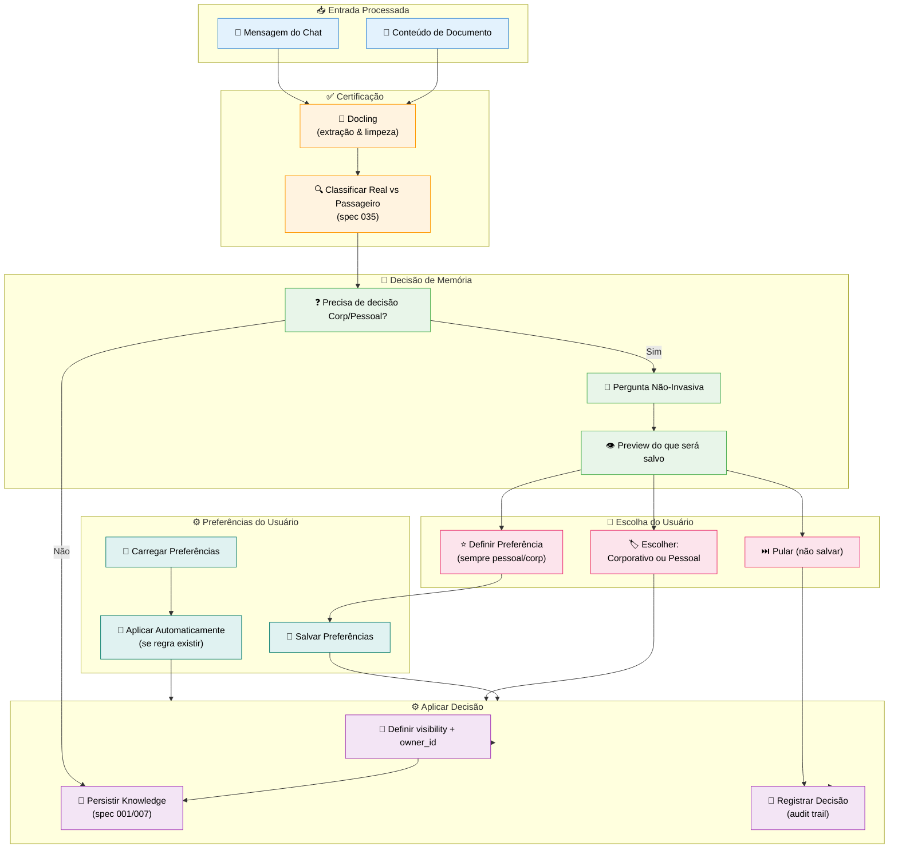
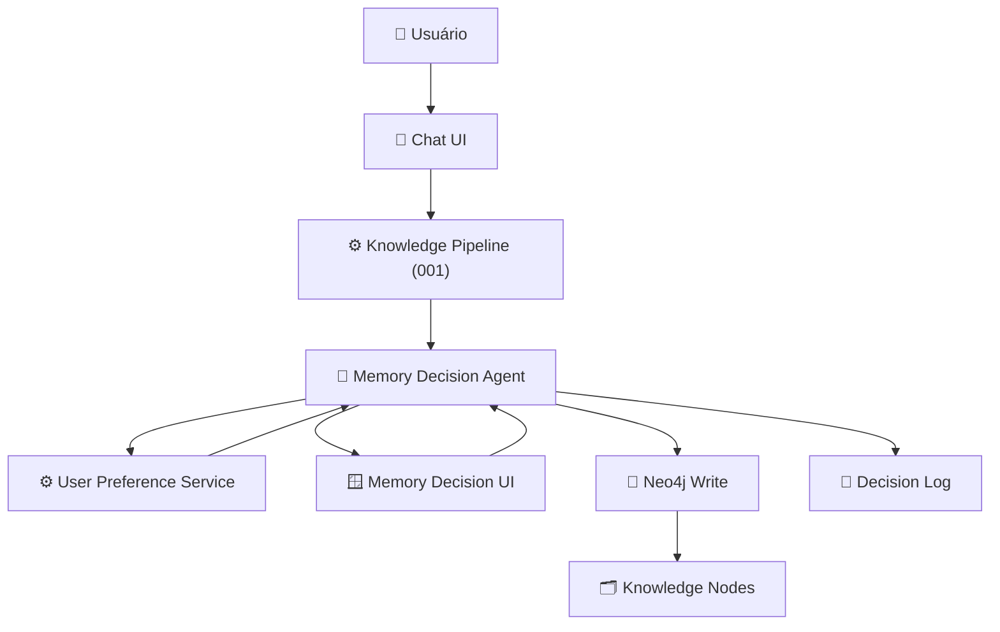

# Feature Specification: User Memory Decision System

**Feature Branch**: `009-user-memory-decision`  
**Created**: 2025-12-07  
**Status**: Draft  
**Priority**: P1 (Core)  
**Source**: TRG-SPC-20251207-034 + chat.txt + specs 001/007

## Process Flow (Business View)



### Flow Insights

**Gaps identificados**:
- Quando perguntar Corp/Pessoal: sempre ou só para dados classificados como "Real"?
- Onde mostrar a pergunta: modal, toast, banner no chat?
- Timeout: após quanto tempo aplicamos default? (30s é sugerido em 001)
- Preferências por tipo de fonte (chat vs documento) e por área/projeto?
- Como reclassificar conhecimento depois (mudar de Pessoal → Corporativo)?

**Oportunidades identificadas**:
- Aprender preferências por contexto (startup, CVC, CoCreateAI) e sugerir default
- UI amigável tipo "lembrar minha escolha para este tipo de dado"
- Dashboard para admin visualizar padrões de decisão (más classificações)
- Possibilidade de "modo silencioso" onde só é perguntado em casos ambíguos

**Riscos identificados**:
- Usuário clicar sempre no mesmo botão sem pensar (viés de hábito)
- Conhecimento sensível salvo como Corporativo indevidamente
- Equipes confundirem o que é "Corporativo" vs "Projeto" vs "Pessoal"
- Falta de transparência sobre quem pode ver dados Corporativos

---

## Agent Collaboration



### Papéis dos Agentes/Serviços

- **Memory Decision Agent**: Orquestra toda decisão Corp/Pessoal; lê contexto, aplica preferências, decide se precisa perguntar.
- **User Preference Service**: Lê/escreve preferências no Neo4j (`:UserPreference` / config do `:User`).
- **Memory Decision UI**: Componente frontend (modal/toast) que exibe pergunta e preview.
- **Knowledge Pipeline (001)**: Passa pelo Decision Agent ANTES de persistir knowledge.

---

## User Scenarios & Testing

### User Story 1 - Pergunta Simples Corp vs Pessoal (Priority: P0 - BLOQUEANTE)

Após processamento de mensagem com conhecimento relevante, sistema pergunta "Você quer guardar isso como conhecimento Corporativo ou Pessoal?" com preview.

**Why this priority**: Sem esta decisão, não há controle de visibilidade básica do conhecimento.

**Independent Test**: Enviar mensagem com conhecimento, verificar pergunta, escolher opção, checar Neo4j.

**Acceptance Scenarios**:

1. **Given** mensagem contendo conhecimento Real, **When** Knowledge Pipeline termina certificação, **Then** Memory Decision Agent verifica que não há preferência para este tipo de dado e dispara UI de decisão

2. **Given** UI de decisão aberta, **When** usuário seleciona "Pessoal" e confirma, **Then** knowledge é salvo com `visibility: "personal"` e `owner_id = user.id`

3. **Given** conhecimento salvo como Pessoal, **When** outro usuário da mesma empresa pesquisa, **Then** este knowledge NÃO aparece nos resultados

4. **Given** usuário seleciona "Corporativo" e confirma, **When** knowledge é salvo, **Then** `visibility: "corporate"` e `company_id = user.company_id`

---

### User Story 2 - Definir Preferência "Sempre Pessoal" (Priority: P1)

Usuário sempre trata PDFs pessoais como Pessoais. Na UI de decisão, marca "Sempre Pessoal para este tipo de dado".

**Why this priority**: Reduz fricção. Evita perguntar toda hora o mesmo.

**Independent Test**: Upload de documento duas vezes, verificar pergunta só na primeira.

**Acceptance Scenarios**:

1. **Given** usuário vê UI de decisão para PDF, **When** marca checkbox "Lembrar minha escolha para PDFs" e escolhe "Pessoal", **Then** preferência é salva em `:UserPreference` com `data_type="document"`, `format="pdf"`, `visibility_default="personal"`

2. **Given** preferência salva, **When** usuário envia novo PDF, **Then** Memory Decision Agent aplica `visibility="personal"` automaticamente sem mostrar UI (pode mostrar apenas toast informativo)

3. **Given** preferência aplicada automaticamente, **When** knowledge é salvo, **Then** DecisionLog registra que decisão veio de preferência e não de pergunta direta

---

### User Story 3 - Reclassificar Conhecimento (Priority: P2)

Usuário percebe que knowledge salvo como Pessoal deveria ser Corporativo. Acessa detalhe do knowledge e reclassifica.

**Why this priority**: Erros de classificação são inevitáveis; sistema precisa permitir correção.

**Independent Test**: Salvar knowledge como Pessoal, reclassificar para Corporativo, verificar visibilidade.

**Acceptance Scenarios**:

1. **Given** knowledge `K1` salvo com `visibility="personal"`, **When** usuário abre detalhe de K1 no Canvas/Viewer, **Then** vê opção para mudar visibilidade (se tiver permissão)

2. **Given** usuário escolhe "Tornar Corporativo", **When** confirma, **Then** sistema atualiza `visibility` → "corporate" e adiciona `company_id`

3. **Given** reclassificação feita, **When** outro usuário da mesma empresa pesquisa assunto, **Then** K1 agora aparece nos resultados

4. **Given** reclassificação é sensível, **When** ação ocorre, **Then** DecisionLog registra quem fez, quando, e de qual visibility para qual

---

### User Story 4 - Timeout e Default Seguro (Priority: P1)

Usuário ignora pergunta Corp/Pessoal. Após timeout, sistema aplica default seguro.

**Why this priority**: Evitar bloqueio de fluxo; decisão não pode travar pipeline.

**Independent Test**: Disparar UI de decisão, não interagir, medir comportamento.

**Acceptance Scenarios**:

1. **Given** UI de decisão aberta, **When** usuário não interage por 30 segundos, **Then** modal fecha automaticamente

2. **Given** timeout, **When** sistema aplica default, **Then** knowledge é salvo como `visibility="personal"` (safe default) **OU** knowledge é marcado como "pendente" se configurado assim (documentar em Assumptions)

3. **Given** knowledge salvo por default, **When** usuário acessa histórico de decisões, **Then** vê que foi aplicado default (sem ação explícita)

---

### User Story 5 - Preferências por Contexto (Priority: P2)

Usuário atua em múltiplos contextos (CVC, CoCreateAI, startup). Prefere que em contexto da startup tudo seja Corporativo, mas em contexto pessoal seja Pessoal.

**Why this priority**: Reflete realidade multi-organizacional do CVC Hub.

**Independent Test**: Mudar contexto (projeto/empresa), verificar decisões automáticas diferentes.

**Acceptance Scenarios**:

1. **Given** usuário está no contexto da startup "HealthAI", **When** Knowledge Pipeline roda, **Then** Memory Decision Agent aplica preferências associadas a `project_id` ou `company_id` daquela startup

2. **Given** mesmo usuário em contexto CoCreateAI interno, **When** salva conhecimento sobre assuntos internos, **Then** preferências diferentes podem ser aplicadas (ex: mais Pessoal)

3. **Given** mudança de contexto, **When** decisão automática é aplicada, **Then** DecisionLog registra `context_id` usado na decisão

---

## Functional Requirements

### Decision Trigger

**REQ-MEM-001**: Sistema DEVE acionar Memory Decision Agent **após** certificação Docling e classificação Real/Passageiro (spec 035)  
**REQ-MEM-002**: Sistema NÃO DEVE perguntar Corp/Pessoal para dados claramente Passageiros (logs transitórios, small talk)  
**REQ-MEM-003**: Sistema DEVE considerar tipo de fonte (chat, documento, form, api) ao decidir se pergunta

### User Prompt

**REQ-MEM-004**: UI de decisão DEVE ser não-invasiva (não bloquear completamente a interação, exceto se configurado)  
**REQ-MEM-005**: UI DEVE exibir texto claro explicando diferença entre Corporativo e Pessoal  
**REQ-MEM-006**: UI DEVE mostrar preview do conteúdo que será salvo (resumido se muito longo)  
**REQ-MEM-007**: UI DEVE oferecer opções: "Corporativo", "Pessoal", "Não salvar agora"  
**REQ-MEM-008**: UI PODE ter checkbox "Lembrar minha escolha para este tipo de dado"

### Preferences

**REQ-MEM-009**: Sistema DEVE permitir definir preferências por tipo de dado (chat vs documento) e por formato (pdf, docx, etc.)  
**REQ-MEM-010**: Sistema PODE permitir preferências por contexto (company_id, project_id)  
**REQ-MEM-011**: Preferências DEVEM ser armazenadas em node `:UserPreference` ou em propriedades do `:User` conforme `database-schema.md`  
**REQ-MEM-012**: Ao existir preferência que cubra o caso atual, sistema DEVE aplicar automaticamente sem perguntar (exceto se override habilitado)

### Default Behavior

**REQ-MEM-013**: Na ausência de preferência, sistema DEVE perguntar Corp/Pessoal para dados classificados como Real  
**REQ-MEM-014**: Na ausência de resposta (timeout), sistema DEVE aplicar default seguro (assumir Pessoal) ou marcar como pendente (definir em Assumptions)  
**REQ-MEM-015**: Defaults DEVEM ser configuráveis via admin (ex: org pode escolher default = Corporativo para documentos específicos)

### Logging & Audit

**REQ-MEM-016**: Toda decisão de memória DEVE ser registrada em node `:MemoryDecision`  
**REQ-MEM-017**: Log DEVE incluir: user_id, knowledge_id, source_type, chosen_visibility, was_default, preference_used?, timestamp  
**REQ-MEM-018**: Reclassificações DEVEM registrar old_visibility e new_visibility  
**REQ-MEM-019**: Admin DEVE poder consultar estatísticas agregadas (ex: % de dados pessoais vs corporativos)

### Integration with Knowledge Pipeline

**REQ-MEM-020**: Knowledge Pipeline (001) DEVE delegar decisão de visibility ao Memory Decision Agent  
**REQ-MEM-021**: Chat & Knowledge Capture (007) DEVE chamar Decision Agent antes de criar node :Knowledge  
**REQ-MEM-022**: Task Generation (008) PODE usar visibility para decidir onde exibir planos (pessoais vs corporativos)

---

## Success Criteria

### Decision Quality
- ✅ 95% dos casos de conhecimento Real recebem uma decisão explícita (usuário ou preferência)
- ✅ <5% dos usuários reportam arrependimento de classificação (via feedback)
- ✅ Zero incidentes de dados Pessoais sendo expostos indevidamente como Corporativos

### UX & Fricção
- ✅ Tempo médio gasto na UI de decisão <5 segundos
- ✅ Usuários configuram pelo menos 1 preferência nas primeiras 5 interações
- ✅ Taxa de aceitação das sugestões automáticas baseada em preferência >80%

### Observability
- ✅ Logs de decisão disponíveis para audit em Neo4j
- ✅ Administradores conseguem ver distribuição Pessoal vs Corporativo por área/empresa

---

## Key Entities

### Neo4j Node Structure

```cypher
// UserPreference (pode já existir em 001, aqui especializamos campos)
(:UserPreference {
  id: string,
  userId: string,
  dataType: string, // "chat" | "document" | "form" | "api"
  format: string, // ex: "pdf", "docx" (opcional)
  contextType: string, // "company" | "project" | null
  contextId: string, // company_id ou project_id
  visibilityDefault: string, // "personal" | "corporate" | "project"
  askMode: string, // "always" | "never" | "smart" (perguntar só quando ambíguo)
  createdAt: datetime,
  updatedAt: datetime
})

// MemoryDecision log
(:MemoryDecision {
  id: string,
  userId: string,
  knowledgeId: string (optional), // pode ser null se decisão aplicada antes de criar node
  sourceType: string, // "chat" | "document" | "form" | "api"
  sourceRef: string, // id mensagem, id documento, etc.
  chosenVisibility: string, // "personal" | "corporate" | "project" | "skipped"
  wasDefault: boolean,
  preferenceUsed: boolean,
  previousVisibility: string (optional),
  newVisibility: string (optional),
  contextId: string (optional),
  timestamp: datetime
})

// Relationships
(:User)-[:HAS_PREFERENCE]->(:UserPreference)
(:User)-[:MADE_DECISION]->(:MemoryDecision)
(:MemoryDecision)-[:APPLIED_TO]->(:Knowledge)
(:MemoryDecision)-[:IN_CONTEXT_OF]->(:Company|:Project)
```

---

## Technical Constraints

### Frontend
- Memory Decision UI deve ser componente reutilizável (pode ser usado em chat, document viewer, etc.)
- Pode usar modal, drawer ou toast com ações (ex: Radix Dialog/Toast)
- Preview de conteúdo deve truncar texto longo com opção "ver mais"

### Backend
- Decision Agent implementado como serviço separado ou parte do Knowledge Pipeline Service
- Deve ser idempotente: mesma fonte + mesmo usuário não gera múltiplos logs duplicados
- Integração com Docling: só dispara decisão após `status = processed`

### Neo4j
- Índices: `UserPreference.userId`, `MemoryDecision.userId`, `MemoryDecision.knowledgeId`
- Queries agregadas para analytics (ex: distribuição de chosenVisibility)

---

## Assumptions

1. **Timeout Default**: Se usuário não responde em 30s e não há preferência, default = `personal` (mais seguro)  
2. **Scope Corporativo**: "Corporativo" = todos usuários da mesma `company_id` dentro do CVC Hub  
3. **Project Visibility**: Escopo "project" será usado em specs futuras (não bloqueia MVP)  
4. **UI Location**: Decisão será feita principalmente no contexto do chat (não em telas separadas)  
5. **Admin Controls**: Admin pode forçar algumas categorias de dados a serem sempre Corporativas (ex: reports obrigatórios)

---

## Open Questions

1. **Padrão por Organização**: Cada organização (CVC, CoCreateAI, startup) pode definir defaults diferentes?  
2. **Multi-Owner**: Conhecimento pode ser de múltiplos donos? (ex: reunião com várias pessoas) Como tratar Pessoal vs Corporativo?  
3. **Delegação**: Admin pode reclassificar knowledge Pessoal de outros usuários? (risco de privacidade)  
4. **Histórico de Decisões**: Usuário deve ter tela para revisar todas as decisões de memória e ajustá-las?  
5. **Educação do Usuário**: Precisamos de onboarding específico explicando Corp vs Pessoal?

---

## Related Specs

- **001-knowledge-pipeline**: Define pipeline completo de conhecimento; esta spec detalha etapa de decisão de memória  
- **007-chat-knowledge-capture**: Chat é origem principal de conhecimento; decisão acontece logo após detecção  
- **008-task-generation-canvas**: Tarefas podem herdar visibility do conhecimento origem  
- **TRG-SPC-035-data-filtration**: Classificação Real vs Passageiro ocorre antes desta decisão

---

## References

- Constitution: A.XV (Visibilidade Hierárquica), A.XVII (Conflito de Memória), A.XX (Decisão de Memória)  
- `database-schema.md`: Metadados universais (`visibility`, `owner_id`, `memory_level`)  
- `specs/001-knowledge-pipeline/spec.md`: Requisitos funcionais de classificação  
- `Spec-Orchestrator/.specify/triage/triage_specification.md`: Entry TRG-SPC-20251207-034  
