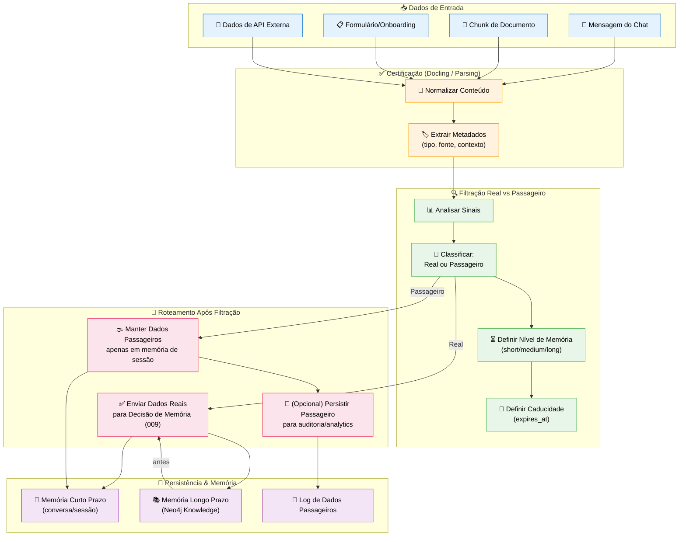
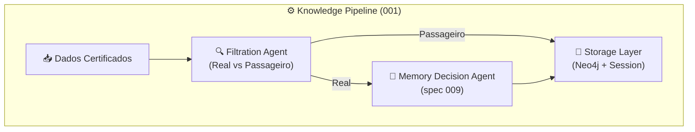

# Feature Specification: Data Filtration System (Real vs Passageiro)

**Feature Branch**: `010-data-filtration`  
**Created**: 2025-12-07  
**Status**: Draft  
**Priority**: P1 (Core)  
**Source**: TRG-SPC-20251207-035 + chat.txt + specs 001/007/009

## Process Flow (Business View)



### Real vs Passageiro (Conceitos)

| Tipo | Descrição | Comportamento |
|------|-----------|---------------|
| **Real** | Dado permanente, conhecimento consolidado, relevante além da sessão atual | Candidato a virar `:Knowledge` em Neo4j, com memória `medium/long` |
| **Passageiro** | Dado temporário, contexto de sessão, detalhes que não precisam ser reusados no futuro | Pode ficar apenas na memória de curto prazo (conversa), opcionalmente logado |

> "Posso guardar em memória e não necessariamente usar" → inclusive para dados Passageiros (para auditoria, debugging ou análises futuras), mas estes **não entram** no núcleo de conhecimento longo prazo por padrão.

### Flow Insights

**Gaps identificados**:
- Critérios exatos para decidir Real vs Passageiro (heurísticas + LLM?)
- Níveis de memória (`short/medium/long`) por tipo de dado (chat vs documento vs onboarding)
- Quando vale a pena persistir Passageiro para auditoria (regulatórios, LGPD)?
- Como visualizamos dados Passageiros (se é que o usuário precisa ver)?

**Oportunidades identificadas**:
- Gamificação: mostrar quanto conhecimento Real o usuário trouxe vs ruído Passageiro
- Otimizar custo: não gerar embeddings para Passageiro (apenas Real)
- Aprender padrões do usuário: quais tipos de dados ele tende a considerar importantes
- Ajudar o agente a "esquecer" ruído automaticamente, mantendo contexto limpo

**Riscos identificados**:
- Marcar dado Real como Passageiro → perda de conhecimento importante
- Marcar muito dado como Real → grafo inflado, ruído nas buscas
- Confusão com Corp/Pessoal (visibilidade) – aqui é outra dimensão (persistência)

---

## Agent Collaboration



### Papéis

- **Filtration Agent**: Classifica cada pedaço de dado como Real ou Passageiro e define `memory_level` + `expires_at`.
- **Memory Decision Agent (009)**: Só é chamado para dados Real; decide Corp/Pessoal.
- **Storage Layer**: Aplica decisão final e persiste (ou não) no Neo4j e/ou memória de sessão.

---

## User Scenarios & Testing

### User Story 1 - Filtrar Mensagem de Chat (Priority: P1)

Usuário manda mensagem casual "Bom dia!". Sistema classifica como Passageiro e não tenta salvar como conhecimento.

**Acceptance Scenarios**:

1. **Given** mensagem "Bom dia!", **When** Filtration Agent analisa, **Then** classifica como `type="transient"`, `memory_level="short"`, `expires_at` próximo (ex: fim da sessão)

2. **Given** tipo Passageiro, **When** pipeline continua, **Then** Memory Decision Agent **não é** acionado (sem pergunta Corp/Pessoal)

3. **Given** conversa longa cheia de small talk, **When** usuário pesquisa conhecimento depois, **Then** estas mensagens não aparecem como `:Knowledge`

---

### User Story 2 - Filtrar Informação Estrutural (Priority: P0 - Core)

Usuário escreve "Nossa startup trabalha com HealthTech e IA para diagnóstico". Sistema classifica como Real.

**Acceptance Scenarios**:

1. **Given** mensagem com fato estrutural sobre empresa/produto, **When** Filtration Agent analisa, **Then** classifica como `type="real"`, `memory_level="medium" ou "long"`

2. **Given** dado Real, **When** pipeline continua, **Then** Memory Decision Agent é acionado para Corp/Pessoal

3. **Given** knowledge criado, **When** usuário volta dias depois, **Then** essa informação ainda está disponível (não caducou)

---

### User Story 3 - Dados de Onboarding (Priority: P1)

Onboarding coleta nome, empresa, área, cargo. Sistema trata como Real e longo prazo.

**Acceptance Scenarios**:

1. **Given** formulário de onboarding enviado, **When** Filtration Agent analisa, **Then** marca campos principais como `type="real"`, `memory_level="long"`, `expires_at=null`

2. **Given** metadados profissionais, **When** knowledge é estruturado no Neo4j, **Then** nós `:User`, `:Company`, `:Area` são criados/atualizados com estes dados

---

### User Story 4 - Dados Temporários de Sessão (Priority: P1)

Usuário manda "Me lembra daqui 30 minutos de mandar o relatório". Pode ser importante no curto prazo, mas não precisa ser conhecimento de longo prazo.

**Acceptance Scenarios**:

1. **Given** mensagem com lembrete curto, **When** Filtration Agent analisa, **Then** classifica como `type="transient"`, `memory_level="short"`, `expires_at` em 30 minutos ou fim do dia

2. **Given** lembrete executado e expirado, **When** sessão termina, **Then** este dado pode ser removido ou arquivado separadamente, não poluindo grafo principal

---

## Functional Requirements

### Classification Logic

**REQ-FLT-001**: Sistema DEVE analisar cada unidade de dado certificada (mensagem, chunk, form) para classificar Real vs Passageiro  
**REQ-FLT-002**: Classificação DEVE considerar:
- Tipo de fonte (`source_type`: chat, document, form, api)
- Conteúdo semântico (presença de fatos estruturais vs saudações)
- Metadados (tipo de documento, tags, contexto)

**REQ-FLT-003**: Sistema PODE usar LLM para ajudar na classificação (ex: prompt que responde `"real"` ou `"transient"`)

**REQ-FLT-004**: Sistema DEVE ser configurável: regras baseadas em regex/keywords + LLM + tipo de fonte

### Memory Levels & Expiry

**REQ-FLT-005**: Para dados Real, sistema DEVE atribuir `memory_level` médio ou longo (`medium`/`long`) dependendo do tipo  
**REQ-FLT-006**: Para dados Passageiros, sistema DEVE atribuir `memory_level="short"` com `expires_at` definido  
**REQ-FLT-007**: Sistema DEVE respeitar metadados universais (`memory_level`, `expires_at`) definidos em `database-schema.md`

### Integration Points

**REQ-FLT-008**: Filtration Agent DEVE ser chamado **antes** de Memory Decision Agent (009)  
**REQ-FLT-009**: Knowledge Pipeline (001) DEVE usar resultado da filtração para decidir se dado pode virar `:Knowledge` ou apenas ficar em memória de sessão  
**REQ-FLT-010**: Chat & Knowledge Capture (007) NÃO DEVE tentar salvar conhecimento para dados marcados explicitamente como Passageiros (a menos que override)

### Override & Exceptions

**REQ-FLT-011**: Usuário PODE forçar que algo Passageiro vire Real (ex: botão "Salvar isto como conhecimento")  
**REQ-FLT-012**: Admin PODE definir tipos de dados que são sempre Reais (ex: atas de reunião) independentemente da heurística  
**REQ-FLT-013**: Admin PODE definir tipos de dados que são sempre Passageiros (ex: logs técnicos de debug)

### Logging

**REQ-FLT-014**: Toda classificação DEVE ser registrada em node `:DataFiltrationLog` para diagnóstico  
**REQ-FLT-015**: Log DEVE incluir: id da fonte, tipo de dado, classificação, nível de memória, expires_at, usados heurísticos/LLM

---

## Success Criteria

### Classification Quality
- ✅ 90%+ de dados claramente Real são classificados corretamente (validação manual por amostra)
- ✅ 90%+ de small talk é classificado como Passageiro
- ✅ <10% do grafo de `:Knowledge` é considerado "ruído" em revisões de qualidade

### Performance
- ✅ Latência de classificação adicional <300ms em média (LLM pode ser assíncrono quando necessário)
- ✅ Sistema suporta 100+ classificações/segundo sem degradação

### Resource Optimization
- ✅ Embeddings só gerados por padrão para dados Real (economia de custo)
- ✅ Dados Passageiros antigos são limpos/arquivados conforme `expires_at` (sem inchar armazenamento)

---

## Key Entities

### Neo4j Node Structure (Filtração)

```cypher
// DataFiltrationLog node
(:DataFiltrationLog {
  id: string,
  sourceId: string, // id da mensagem, chunk, etc.
  sourceType: string, // "message" | "chunk" | "form_field" | "api_record"
  classifiedType: string, // "real" | "transient"
  memoryLevel: string, // "short" | "medium" | "long"
  expiresAt: datetime,
  usedLLM: boolean,
  rulesApplied: string[],
  createdAt: datetime
})

// Integration with Knowledge/Message (example)
(:Message {id: ..., memory_level: ..., expires_at: ...})
(:Knowledge {id: ..., memory_level: ..., expires_at: ...})
```

---

## Technical Constraints

- Filtration não deve ser hardcoded em código; regras devem ser configuráveis (ex: arquivo de configuração ou nodes específicos `:FiltrationRule` no Neo4j)  
- LLM deve ser usado com prompts claros e custo controlado (somente quando heurísticas não forem conclusivas)  
- Mecanismo de limpeza (`expiry`) pode rodar em job agendado (cron/worker)

---

## Assumptions

1. **Heurísticas Iniciais**: Vamos começar com conjunto fixo de heurísticas + LLM simples, refinando depois com feedback  
2. **Granularidade**: Classificação acontece por mensagem/chunk, não por conversa inteira  
3. **Privacy**: Dados Passageiros podem ainda conter informação sensível; limpeza deve respeitar LGPD  
4. **Admin Control**: Organização pode ajustar regras de classificação (ex: tudo de onboarding é Real)

---

## Related Specs

- **001-knowledge-pipeline**: Esta spec insere camada explícita de filtração antes da decisão de memória  
- **007-chat-knowledge-capture**: Só considera candidatos Real para virar conhecimento  
- **009-user-memory-decision**: Atua somente em cima de dados Real  

---

## References

- `database-schema.md`: Campos `memory_level`, `expires_at`, `source_type`  
- `Spec-Orchestrator/.specify/triage/triage_specification.md`: Entry TRG-SPC-20251207-035  
- Constitution: A.XIII (Caducidade de Nodes), A.XIV (Memória Multinível)
