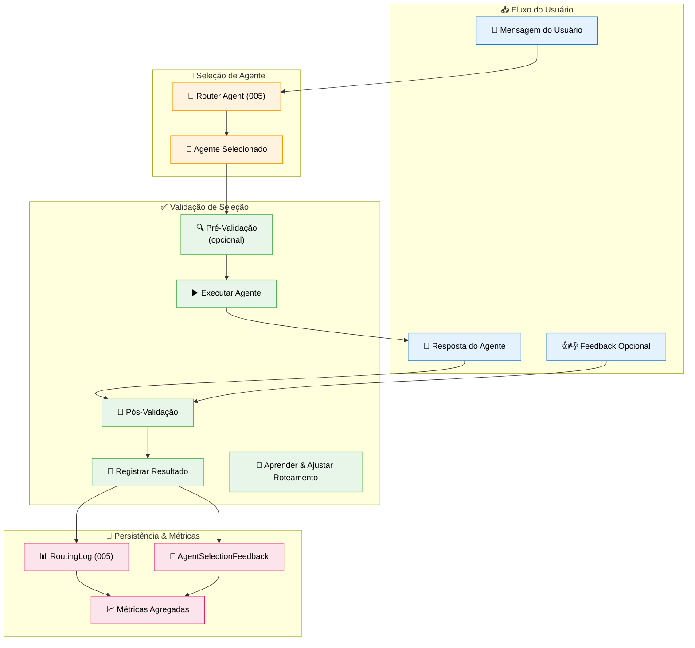
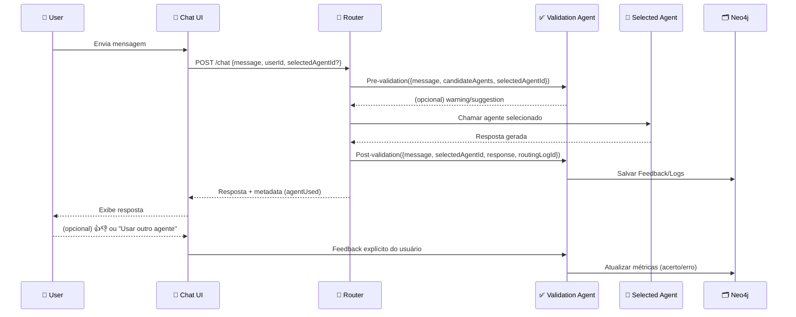

# Feature Specification: Validation Agent

**Feature Branch**: `011-validation-agent`  
**Created**: 2025-12-07  
**Status**: Draft  
**Priority**: P1 (MVP Backend)  
**Source**: TRG-SPC-20251206-010 + chat.txt + specs 005/007/008/009/010

## Process Flow (Business View)



### Objetivo

O Validation Agent **não escolhe o agente**, mas:
- Observa **antes/depois** da execução.
- Mede se o agente usado era o mais adequado.
- Aprende padrões de erro/acerto para **ajustar o Router (005)** ao longo do tempo.
- Mantém logs para análise (admin) e potencial aprendizado futuro.

---

## Agent Collaboration (técnico)



### Perguntas que o Validation Agent responde

- "O agente escolhido fazia sentido para esta intenção?"  
- "O usuário trocou de agente logo em seguida?"  
- "Quantas vezes este tipo de pergunta foi melhor respondida por outro agente?"  
- "O Router está melhorando ao longo do tempo?"

---

## User Scenarios & Testing

### User Story 1 - Métrica de Acerto do Router (Priority: P1)

Sistema mede quantas vezes o agente selecionado automaticamente foi, de fato, o agente usado até o final da interação.

**Acceptance Scenarios**:

1. **Given** Router seleciona Task Agent automaticamente, **When** usuário aceita resposta e continua conversa normalmente, **Then** Validation Agent registra `was_correct = true` para essa decisão

2. **Given** Router seleciona Router Agent, **When** usuário logo em seguida troca manualmente para outro agente (ex: Task Agent) para mesma intenção, **Then** Validation Agent registra `was_correct = false` e salva sugestão: "Task Agent seria melhor" 

3. **Given** várias interações ao longo do tempo, **When** admin visualiza métricas, **Then** vê taxa de acerto por tipo de intenção e por agente (ex: `task_generation → Task Agent: 92% acerto`)

---

### User Story 2 - Feedback Explícito do Usuário (Priority: P1)

Usuário recebe resposta e pode clicar 👍/👎 para indicar se o agente escolhido foi adequado.

**Acceptance Scenarios**:

1. **Given** resposta exibida no chat, **When** usuário clica 👍, **Then** Validation Agent registra feedback positivo associado àquele `routingLogId`

2. **Given** usuário clica 👎, **When** aparece pergunta rápida "O que houve? [Agente errado] [Resposta ruim] [Demorou demais]", **Then** escolha é registrada

3. **Given** vários feedbacks negativos indicando "Agente errado" para determinado padrão de mensagem, **When** Router é avaliado, **Then** métricas mostram baixo acerto e sugerem ajuste de regras

---

### User Story 3 - Sugestão Proativa de Agente (Priority: P2)

Com base em histórico, Validation Agent pode sugerir ao Router um agente alternativo quando a escolha parecer fraca.

**Acceptance Scenarios**:

1. **Given** histórico mostra que para mensagens do tipo "plano de ação" o Task Agent performa melhor, **When** Router seleciona Router Agent com baixa confiança, **Then** Validation Agent pode sugerir ao Router considerar Task Agent

2. **Given** sugestão aceita internamente, **When** Router ajusta escolha antes de executar agente, **Then** log registra que decisão foi influenciada pelo Validation Agent

3. **Given** comportamento de aprendizado habilitado, **When** novo padrão de uso emerge, **Then** Validation Agent ajusta estatísticas, sem sobrescrever regras hardcoded sem confirmação (apenas sugestão/score)

---

### User Story 4 - Diagnóstico de Erros de Roteamento (Priority: P1, Admin)

Admin abre dashboard de roteamento e vê onde Router está errando mais.

**Acceptance Scenarios**:

1. **Given** dados coletados pelo Validation Agent, **When** admin consulta Neo4j (via dashboard futuro), **Then** vê taxa de acerto por intenção (`task_generation`, `knowledge_query`, etc.)

2. **Given** intenção com baixa taxa de acerto, **When** admin inspeciona exemplos, **Then** consegue ver: mensagem original, agente escolhido, agente alternativo sugerido, feedback do usuário

3. **Given** insight extraído, **When** admin ajusta regras do Router (ou prompt do classifier), **Then** melhoria pode ser medida em rodadas seguintes

---

## Functional Requirements

### Integration with Router (spec 005)

**REQ-VAL-001**: Router DEVE chamar Validation Agent **antes** de executar agente (pré-validação leve, opcional) e **depois** (pós-validação obrigatória)  
**REQ-VAL-002**: Pré-validação NÃO DEVE bloquear fluxo de resposta (no máximo sugerir/anotar)  
**REQ-VAL-003**: Pós-validação DEVE registrar dados da interação: agente escolhido, intenção, confiança, latência, feedback implícito/ explícito

### Metrics & Logging

**REQ-VAL-004**: Validation Agent DEVE usar (ou estender) `:RoutingLog` definido em spec 005 para registrar métricas de seleção  
**REQ-VAL-005**: Log DEVE incluir campos adicionais: `was_correct`, `had_manual_switch`, `user_feedback_score`, `suggestedBetterAgentId?`  
**REQ-VAL-006**: Sistema DEVE permitir agregar logs por: agente, intenção, usuário, período de tempo

### Feedback Collection

**REQ-VAL-007**: Chat UI PODE exibir controles simples de feedback (👍/👎) por resposta  
**REQ-VAL-008**: Feedback explícito DEVE ser enviado ao Validation Agent com referência ao `routingLogId`  
**REQ-VAL-009**: Em caso de 👎, UI PODE coletar motivo em até 1 clique (chips de motivo), sem formulário longo

### Learning Loop (mínimo viável)

**REQ-VAL-010**: Validation Agent DEVE calcular estatísticas periიodicas (ex: taxa de acerto por agente/intenção)  
**REQ-VAL-011**: Resultados DEVEM ser acessíveis ao Router como sinais de **prioridade** (ex: penalizar agentes com histórico ruim para certa intenção)  
**REQ-VAL-012**: Qualquer alteração estrutural no comportamento do Router com base em métricas DEVE ser configurável (feature flag) e não automática hardcoded

### Safety & Non-Intrusiveness

**REQ-VAL-013**: Validation Agent NUNCA DEVE impedir a entrega de resposta ao usuário (no máximo atrasar logging)  
**REQ-VAL-014**: Se Validation Agent falhar (erro interno), Router DEVE continuar funcionando com comportamento atual  
**REQ-VAL-015**: Coleta de feedback NÃO DEVE ser obrigatória para o usuário (sem pop-ups agressivos)

---

## Success Criteria

### Routing Quality
- ✅ Acurácia do Router **aumenta** ao longo do tempo (comparar janela de 30 dias)
- ✅ Redução de trocas manuais de agente após resposta (usuário não precisa corrigir roteamento)

### Observability
- ✅ Admin consegue identificar top 3 padrões onde Router erra mais
- ✅ Logs completos disponíveis em Neo4j para consultas (sem buracos significativos)

### UX
- ✅ Usuários usam feedback (👍/👎) sem se sentirem sobrecarregados
- ✅ Sistema não adiciona latência perceptível (>300ms) por causa da validação

---

## Key Entities

### Extensão de `:RoutingLog` (spec 005)

Em spec 005, `:RoutingLog` já foi definido. Validation Agent **estende** seu uso com campos adicionais:

```cypher
// RoutingLog (estendido)
(:RoutingLog {
  id: string,
  userId: string,
  conversationId: string,
  messageText: string,
  selectedAgentId: string,
  wasManualSelection: boolean,
  classifiedIntent: string,
  confidence: float,
  wasFallback: boolean,
  latencyMs: integer,
  // Campos adicionados pela validação
  wasCorrect: boolean, // se seleção foi adequada
  hadManualSwitch: boolean, // se user trocou de agente em seguida
  userFeedbackScore: integer, // +1 (👍), 0 (none), -1 (👎)
  suggestedBetterAgentId: string, // opcional
  validatedAt: datetime
})
```

### AgentSelectionFeedback node

```cypher
(:AgentSelectionFeedback {
  id: string,
  routingLogId: string,
  userId: string,
  reason: string, // "wrong_agent" | "bad_answer" | "slow" | etc.
  comment: string, // opcional, se houver texto livre futuramente
  createdAt: datetime
})

(:User)-[:GAVE_FEEDBACK]->(:AgentSelectionFeedback)
(:AgentSelectionFeedback)-[:RELATES_TO]->(:RoutingLog)
```

---

## Technical Constraints

- Validation Agent roda como **camada de observabilidade** ao redor do Router, não como componente de negócio principal.  
- Toda lógica de aprendizado deve ser **configurável** e, de preferência, iniciada em modo "apenas medir" antes de influenciar o Router.  
- Logs devem ser compactos o suficiente para não explodirem o grafo (pode haver política de retenção para `:RoutingLog` e `:AgentSelectionFeedback`).

---

## Assumptions

1. **Feedback Baixo Volume**: Nem todo usuário dará feedback em todas as respostas; métricas usarão amostra parcial.  
2. **MVP sem Auto-Rewrite**: No MVP, Validation Agent não reescreve comportamento do Router sozinho; apenas gera sinais e métricas.  
3. **Privacidade**: Logs de routing não contêm dados sensíveis completos (mensagem pode ser truncada/anônima).  
4. **Multi-Agent Growth**: Sistema deve escalar para mais agentes, sem explodir complexidade de validação (métricas agregadas por intenção).

---

## Related Specs

- **005-agent-router**: Ponto principal de integração; usa Validation Agent como observador/avaliador.  
- **004-user-agent-factory**: Novos agentes do usuário entram no pool que também será avaliados pelo Validation Agent.  
- **007/008/009/010**: A qualidade do roteamento impacta diretamente captura de conhecimento, geração de tarefas, decisão de memória e filtração.

---

## References

- Triage: TRG-SPC-20251206-010 (Validation Agent)  
- Constitution: princípios de observabilidade, auto-improvement, não poluir agentes principais.
