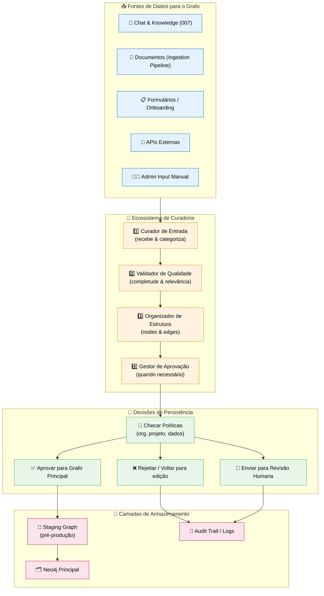
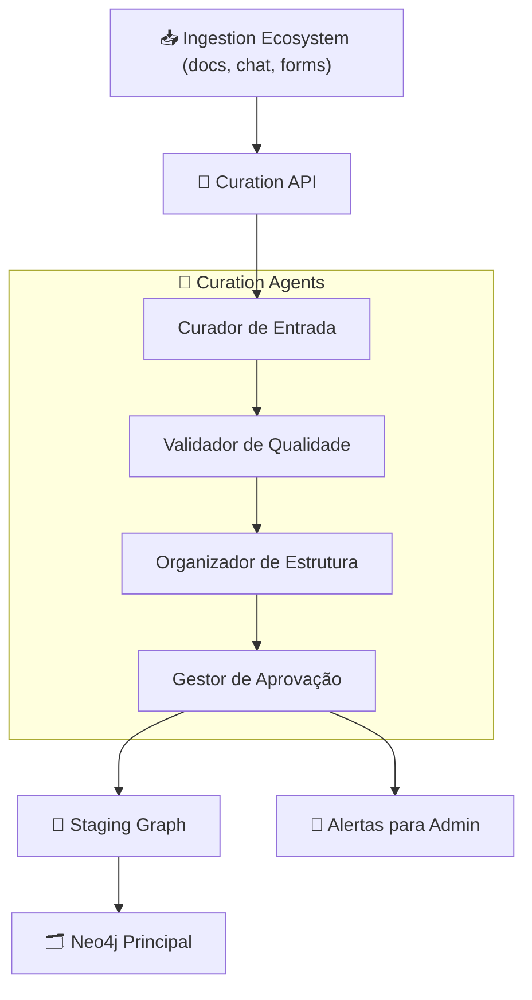

# Feature Specification: Graph Curation Ecosystem

**Feature Branch**: `012-graph-curation-ecosystem`  
**Created**: 2025-12-07  
**Status**: Draft  
**Priority**: P1 (Core)  
**Source**: TRG-SPC-20251206-021 + chat.txt + specs 001/003/007/008/009/010/011

## Process Flow (Business View)



### Papel do Ecossistema de Curadoria

- **Filtro final** antes de qualquer dado virar parte do grafo principal.  
- Garante que **tudo que entra** tenha:
  - Classificação correta (Real vs Passageiro – spec 010).
  - Decisão Corp/Pessoal (spec 009) respeitada.
  - Estrutura de nodes/edges coerente com o `database-schema.md`.
  - Proveniência e metadados completos.

---

## Agent Collaboration (Curation Layer)



### Papéis dos Sub-Agentes

- **Curador de Entrada**: recebe dados brutos + metadados da pipeline; verifica se há informações mínimas (tipo, owner, contexto).
- **Validador de Qualidade**: checa se conteúdo é legível, relevante, não duplicado demais.
- **Organizador de Estrutura**: decide como mapear o conteúdo em nodes/edges (quais labels, relacionamentos, granularidade).
- **Gestor de Aprovação**: aplica regras de aprovação (auto-approve vs human-review) e dispara alertas.

---

## User Scenarios & Testing

### User Story 1 - Curadoria de Documento Ingerido (Priority: P1)

Documento de reunião entra pela pipeline. Curation Ecosystem decide se e como vira nodes no grafo.

**Acceptance Scenarios**:

1. **Given** documento de reunião processado pelo Docling, **When** Ingestion Ecosystem envia chunks + metadados para Curation API, **Then** Curador de Entrada registra um `:CurationJob` com status `"pending"`

2. **Given** `:CurationJob` criado, **When** Validador de Qualidade encontra conteúdo incompleto (ex: sem participantes, sem data), **Then** job é marcado como `"needs_review"` e Admin recebe alerta

3. **Given** job válido, **When** Organizador de Estrutura roda, **Then** são criados (no Staging): nodes `:Meeting`, `:Person`, `:Company`, `:Task` e relacionamentos correspondentes

4. **Given** Staging populado, **When** Gestor de Aprovação aplica regras (ex: reuniões internas da CoCreateAI auto-aprovadas), **Then** dados são promovidos para grafo principal

---

### User Story 2 - Curadoria de Conhecimento do Chat (Priority: P1)

Conhecimento salvo via Chat & Knowledge Capture passa pela curadoria para garantir qualidade e estrutura.

**Acceptance Scenarios**:

1. **Given** conhecimento salvo (spec 007/009), **When** Knowledge Pipeline cria node candidato a `:Knowledge` em Staging, **Then** Curation Agents revisam: conteúdo, visibilidade, relacionamentos

2. **Given** conhecimento duplicado (já existe knowledge similar), **When** Validador detecta alta similaridade (via embeddings), **Then** job é marcado como `"duplicate_candidate"` e pode ser mesclado em knowledge existente

3. **Given** knowledge aprovado, **When** promovido para grafo principal, **Then** todos metadados universais (`source_type`, `owner_id`, `visibility`, `confidence`, `memory_level`) são garantidos

---

### User Story 3 - Workflow de Aprovação para Dados Sensíveis (Priority: P2)

Para certos tipos de dados (ex: documentos sensíveis), é exigida aprovação humana antes de entrar no grafo.

**Acceptance Scenarios**:

1. **Given** documento marcado como "sensível" por regra ou tag, **When** Organizador de Estrutura cria nodes no Staging, **Then** Gestor de Aprovação NÃO promove automaticamente, mas cria `:CurationApprovalRequest`

2. **Given** approval request criado, **When** admin acessa painel (futuro), **Then** vê resumo: fonte, tipo, visão pré-curada dos nodes/edges

3. **Given** admin aprova, **When** ação confirmada, **Then** nodes são movidos Staging → Grafo Principal e request é marcado como `"approved"`

---

## Functional Requirements

### Curation Jobs

**REQ-CUR-001**: Cada fluxo de dados que chega ao grafo DEVE criar um `:CurationJob` representando a curadoria daquele lote.  
**REQ-CUR-002**: `:CurationJob` DEVE conter: source_type, source_ref, created_by, status, priority, summary.  
**REQ-CUR-003**: Curation pipeline DEVE atualizar status: `pending` → `validating` → `structuring` → `awaiting_approval` → `approved`/`rejected`.

### Quality Validation

**REQ-CUR-004**: Validador de Qualidade DEVE checar:
- Completude mínima (campos obrigatórios por tipo, ex: reuniões precisam de data + participantes).
- Relevância (não é puro lixo ou spam).
- Duplicidade (similaridade alta com conhecimento existente).

**REQ-CUR-005**: Para duplicidade, sistema PODE usar embeddings de texto e threshold configurável.

### Structure Organization

**REQ-CUR-006**: Organizador de Estrutura DEVE usar schema definido em `database-schema.md` para decidir quais labels e relacionamentos criar.  
**REQ-CUR-007**: Organizador NÃO DEVE criar labels "soltos" fora da ontologia definida (Company, Area, Project, Person, Knowledge, Task, etc.).  
**REQ-CUR-008**: Organizador DEVE preservar proveniência (ex: `:Knowledge)-[:EXTRACTED_FROM]->(:Document)`).

### Approval Management

**REQ-CUR-009**: Gestor de Aprovação DEVE aplicar regras baseadas em:
- Tipo de fonte (interna/externa).
- Sensibilidade (tags, classificação).
- Organização (CVC, CoCreateAI, startup específica).

**REQ-CUR-010**: Para casos que exigem revisão humana, sistema DEVE criar `:CurationApprovalRequest` com link para `:CurationJob`.  
**REQ-CUR-011**: Aprovação humana DEVE ser logada com usuário, data, decisão e justificativa opcional.

### Integration with Admin System (003)

**REQ-CUR-012**: Admin panel (spec 003) DEVE exibir lista de `:CurationJob` abertos/pendentes.  
**REQ-CUR-013**: Admin DEVE poder filtrar por status, source_type, organização, projeto.  
**REQ-CUR-014**: Admin DEVE ver alertas de jobs falhos (ex: erro de schema, conteúdo corrompido).

---

## Success Criteria

### Data Quality
- ✅ >95% dos nodes no grafo principal têm metadados universais completos.  
- ✅ Duplicidade de knowledge <10% (amostra manual).  
- ✅ Zero casos críticos de dados sensíveis indevidos no grafo principal (detectados retroativamente).

### Operational
- ✅ Latência do pipeline de curadoria razoável: maioria dos jobs automáticos concluídos <5s.  
- ✅ Aprovações manuais realizadas em até 24h (SLA configurável).  
- ✅ Logs de curadoria suficientes para reconstruir origem de qualquer node.

---

## Key Entities (Neo4j)

```cypher
// CurationJob - representa uma execução de curadoria
(:CurationJob {
  id: string,
  sourceType: string, // "chat" | "document" | "form" | "api"
  sourceRef: string, // id da mensagem, doc, etc.
  createdBy: string, // user.id ou sistema
  status: string, // "pending" | "validating" | "structuring" | "awaiting_approval" | "approved" | "rejected" | "failed"
  priority: string, // "low" | "medium" | "high"
  summary: string,
  createdAt: datetime,
  updatedAt: datetime
})

// CurationIssue - problemas encontrados
(:CurationIssue {
  id: string,
  jobId: string,
  type: string, // "missing_field" | "low_quality" | "duplicate" | "schema_violation"
  description: string,
  severity: string, // "info" | "warning" | "error"
  createdAt: datetime
})

// CurationApprovalRequest
(:CurationApprovalRequest {
  id: string,
  jobId: string,
  requestedBy: string, // agente ou sistema
  approverRole: string, // ex: "admin", "data_steward"
  status: string, // "pending" | "approved" | "rejected"
  decisionBy: string,
  decisionAt: datetime,
  comment: string,
  createdAt: datetime
})

// Relationships
(:CurationJob)-[:HAS_ISSUE]->(:CurationIssue)
(:CurationJob)-[:HAS_APPROVAL_REQUEST]->(:CurationApprovalRequest)
(:CurationJob)-[:CURATES]->(:Knowledge|:Document|:Task|:Person|:Company)
(:User)-[:REQUESTED_APPROVAL]->(:CurationApprovalRequest)
(:User)-[:DECIDED_APPROVAL]->(:CurationApprovalRequest)
```

---

## Technical Constraints

- Curadoria deve ser **configurável**: regras de aprovação/auto-approve por tipo de dado/organização não podem ser hardcoded.  
- Deve existir clara separação entre **Staging Graph** e **Main Graph** (pode ser via label adicional ou DB separado).  
- CurationJobs e CurationIssues podem ser limpos/arquivados periodicamente, mantendo apenas histórico relevante.

---

## Assumptions

1. **Staging** pode ser modelado no mesmo Neo4j com um flag (`environment: "staging" | "main"`) ou DB separado, a decidir no plano técnico.  
2. **Aprovação manual** será usada apenas para dados sensíveis/estratégicos, não para todo fluxo.  
3. **Admin UI** para curadoria virá em specs futuras (este documento não detalha telas, apenas responsabilidades).

---

## Related Specs

- **001-knowledge-pipeline**: Esta spec detalha etapa de curadoria dentro do pipeline.  
- **003-admin-login-config**: Admin panel exibe jobs de curadoria e aprovações.  
- **007/008/009/010/011**: Curadoria garante que resultados dessas etapas entrem no grafo principal com qualidade e segurança.  
- **TRG-SPC-022** (Proveniência): Vai detalhar rastreabilidade de fonte para cada node.

---

## References

- `database-schema.md` (ontologia principal)  
- `Spec-Orchestrator/.specify/triage/triage_specification.md` Entry TRG-SPC-20251206-021  
- Constitution: princípios sobre caducidade, memória multinível, visibilidade hierárquica.
