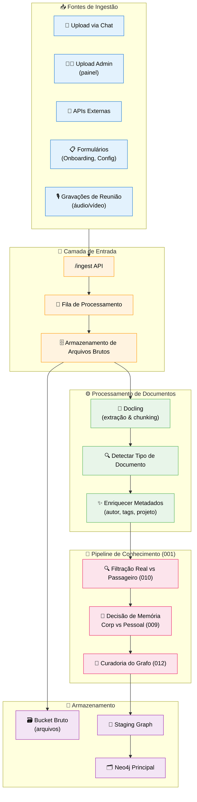
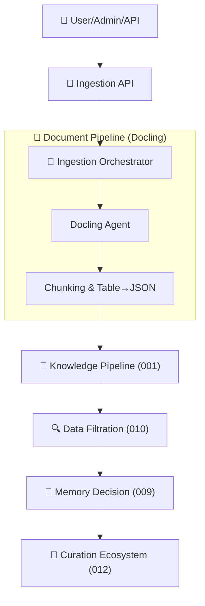

# Feature Specification: Ingestion Ecosystem (Documents & Data)

**Feature Branch**: `013-ingestion-ecosystem`  
**Created**: 2025-12-07  
**Status**: Draft  
**Priority**: P1 (Core)  
**Source**: TRG-SPC-20251206-003 (Document Pipeline) + TRG-SPC-20251206-011 (Ingestion Ecosystem) + chat.txt + specs 001/007/010/012

## Process Flow (Business View)



### Papel do Ecossistema de Ingestão

- Ponto **único de entrada** de dados estruturados/não estruturados.  
- Garante que **todo dado** passe por: 
  1) Certificação Docling/Parsing →  
  2) Filtração Real/Passageiro (010) →  
  3) Decisão de Memória (009) →  
  4) Curadoria do Grafo (012).  
- Dá visibilidade e controle: *o que entrou, de onde veio, como foi processado*.

---

## Agent Collaboration



- **Ingestion Orchestrator**: coordena o fluxo técnico (fila, Docling, chamadas para pipeline).  
- **Docling Agent**: encapsula interação com Docling (local ou serviço externo).  
- **Knowledge/Filtration/Decision/Curation Agents**: já especificados em specs anteriores.

---

## User Scenarios & Testing

### User Story 1 - Upload de Documento via Chat (Priority: P1)

Usuário anexa PDF de reunião no chat; sistema processa, chama Docling, e inicia pipeline completo.

**Acceptance Scenarios**:

1. **Given** usuário no chat, **When** anexa PDF, **Then** arquivo é enviado para Ingestion API e guardado em FileStore/RawBucket com metadados (user_id, company_id, filename, size).

2. **Given** arquivo salvo, **When** Ingestion Orchestrator lê fila, **Then** chama Docling para extração, obtendo texto, chunks, tabelas (como JSON) e metadados.

3. **Given** chunks gerados, **When** pipeline 001 roda, **Then** dados passam por Filtração (010), Decisão de Memória (009) e Curadoria (012), resultando em nodes `:Document`, `:Chunk`, `:Knowledge`, `:Task` conforme aplicável.

---

### User Story 2 - Ingestão em Lote por Admin (Priority: P1)

Admin sobe um ZIP com 50 documentos; ingestão acontece em lote com monitoramento de status.

**Acceptance Scenarios**:

1. **Given** admin no painel, **When** faz upload de ZIP, **Then** Ingestion API cria `:IngestionBatch` e múltiplos `:IngestionItem` (um por arquivo).

2. **Given** batch criado, **When** processamento inicia, **Then** admin consegue ver progresso (processando, concluído, erro) por item.

3. **Given** alguns documentos falham, **When** admin abre detalhes, **Then** vê motivo (erro Docling, tipo não suportado, etc.) logado.

---

### User Story 3 - Ingestão via API Externa (Priority: P2)

Sistema cliente envia dados via API (JSON) para ingestão; pipeline trata como fonte estruturada.

**Acceptance Scenarios**:

1. **Given** integração externa registrada, **When** POST `/ingest/api` é chamado com payload JSON, **Then** Ingestion API valida autenticação, formato e cria `:IngestionItem` do tipo `api`.

2. **Given** item API válido, **When** pipeline roda, **Then** dados são normalizados, classificados Real/Passageiro e potencialmente viram knowledge, tasks, etc.

---

## Functional Requirements

### Entry Points

**REQ-ING-001**: Sistema DEVE expor Ingestion API unificada para: uploads de chat, uploads admin, formulários e APIs externas.  
**REQ-ING-002**: Cada requisição de ingestão DEVE gerar pelo menos um `:IngestionItem` com metadados básicos (source_type, source_ref, user_id, company_id).

### Document Pipeline (Docling)

**REQ-ING-003**: Para documentos, sistema DEVE usar Docling para:
- Extração de texto.  
- Chunking em `:Chunk` com preservação de ordem.  
- Conversão de tabelas em JSON.  

**REQ-ING-004**: Documentos DEVEM ser taggeados com tipo (`meeting`, `report`, `email`, `note`, etc.), seja por heurística ou LLM.

### Integration with Knowledge Pipeline

**REQ-ING-005**: Após Docling, chunks/documents DEVEM ser enviados ao Knowledge Pipeline (001).  
**REQ-ING-006**: Knowledge Pipeline DEVE chamar Filtração (010) e Decisão de Memória (009) antes da Curadoria (012).

### Monitoring & Status

**REQ-ING-007**: Sistema DEVE permitir rastrear status por `:IngestionBatch` e `:IngestionItem` (pending, processing, completed, failed).  
**REQ-ING-008**: Erros de ingestão DEVEM ser registrados com causa (erro Docling, arquivo corrompido, timeout, etc.).

### Performance & Limits

**REQ-ING-009**: Ingestão deve suportar pelo menos N documentos simultâneos (N a definir no plano, ex: 100) sem travar.  
**REQ-ING-010**: Tamanho máximo de arquivo (ex: 50MB) e tipos suportados DEVEM ser documentados e validados na entrada.

---

## Success Criteria

- ✅ 95%+ dos documentos válidos submetidos são processados com sucesso.  
- ✅ Tempo médio de ingestão para documento padrão (<10MB) < 10s (extração + pipeline).  
- ✅ Admin consegue ver claramente o que foi ingerido, seu status e destino no grafo.

---

## Key Entities (Neo4j)

```cypher
// IngestionBatch (upload em lote)
(:IngestionBatch {
  id: string,
  createdBy: string, // user.id
  source: string, // "admin_upload" | "api" | "chat"
  totalItems: integer,
  processedItems: integer,
  failedItems: integer,
  status: string, // "pending" | "processing" | "completed" | "failed"
  createdAt: datetime,
  updatedAt: datetime
})

// IngestionItem (unidade mínima)
(:IngestionItem {
  id: string,
  batchId: string,
  sourceType: string, // "document" | "api" | "form" | "chat_upload"
  sourceRef: string, // file path, api record id, etc.
  userId: string,
  companyId: string,
  status: string, // "pending" | "processing" | "completed" | "failed"
  errorMessage: string,
  createdAt: datetime,
  updatedAt: datetime
})

(:IngestionBatch)-[:HAS_ITEM]->(:IngestionItem)
```

---

## Technical Constraints

- **Zero Hardcode**: tipos de documentos, limites de tamanho e regras de roteamento devem ser configuráveis (não fixos em código).  
- Ingestion Orchestrator deve ser desacoplado (pode ser worker/serviço separado, não travar UI).  
- Logs de ingestão podem ser usados para auditoria, mas devem ter retenção configurável.

---

## Assumptions

1. Docling é o motor principal de processamento de documentos; se falhar, não há fallback no MVP (apenas erro claro e logado).  
2. Armazenamento bruto (RawBucket) pode ser em serviço externo (S3/Azure Blob), abstraído no backend.  
3. Integrações futuras (ex: email, Slack) usarão mesma Ingestion API.

---

## Related Specs

- **001-knowledge-pipeline**: Define como dados processados viram conhecimento.  
- **007-chat-knowledge-capture**: Uploads via chat entram por este ecossistema.  
- **010-data-filtration**: Camada obrigatória após processamento.  
- **012-graph-curation-ecosystem**: Recebe dados já filtrados e decide como entram no grafo.

---

## References

- `database-schema.md`: Nodes `Document`, `Chunk`, `Knowledge`.  
- `Spec-Orchestrator/.specify/triage/triage_specification.md`: Entries TRG-SPC-20251206-003 e 011.  
- Projeto referência "CVCHub - Copia" para padrões de ingestão/Neo4j.
