# Feature Specification: Provenance & Retrieval System

**Feature Branch**: `014-provenance-system`  
**Created**: 2025-12-07  
**Status**: Draft  
**Priority**: P1 (Core)  
**Source**: TRG-SPC-20251206-022 + chat.txt + specs 001/007/008/010/012/013

## Process Flow (Business View)

```mermaid
flowchart TD
    subgraph Question["📥 Pergunta do Usuário"]
        UserMsg["💬 Mensagem no Chat"]
    end

    subgraph Retrieval["🔍 Recuperação"]
        IntentDetect["🧠 Detectar Intenção<br/>(consulta de conhecimento?)"]
        BuildQuery["📑 Montar Consulta<br/>(texto + filtros)"]
        SearchGraph["🗂️ Buscar no Neo4j<br/>(texto + vetores)"]
        RankResults["📊 Ranqueamento de Resultados"]
    end

    subgraph Provenance["🧾 Proveniência"]
        CollectSources["📡 Coletar Fontes<br/>(docs, chat, inferências)"]
        BuildProvenance["🏗️ Construir Estrutura de Proveniência"]
        AttachToAnswer["📎 Anexar Proveniência<br/>à Resposta"]
    end

    subgraph Answer["💬 Resposta ao Usuário"]
        Compose["✏️ Compor Resposta
(LLM)"]
        ShowSources["📚 Mostrar Fontes
(lista/resumo)"]
        DeepDive["🔎 Navegar para Fonte
(detahes no Canvas)"]
    end

    UserMsg --> IntentDetect
    IntentDetect --> BuildQuery
    BuildQuery --> SearchGraph
    SearchGraph --> RankResults
    RankResults --> CollectSources
    CollectSources --> BuildProvenance
    BuildProvenance --> Compose
    Compose --> ShowSources
    ShowSources --> DeepDive

    classDef q fill:#e3f2fd,stroke:#1976d2,color:#000
    classDef ret fill:#fff3e0,stroke:#ff9800,color:#000
    classDef prov fill:#e8f5e9,stroke:#4caf50,color:#000
    classDef ans fill:#fce4ec,stroke:#e91e63,color:#000

    class UserMsg q
    class IntentDetect,BuildQuery,SearchGraph,RankResults ret
    class CollectSources,BuildProvenance prov
    class Compose,ShowSources,DeepDive ans
```



### Objetivo

Garantir que **toda informação recuperada**:
- Tenha **fonte rastreável** (documento, internet, conversa, inferência).  
- Mostre ao usuário de onde veio cada parte da resposta.  
- Permita navegar até o node de origem (Canvas, viewer de documento, etc.).

---

## Agent Collaboration

```mermaid
flowchart TD
    User["👤 User"] --> Chat["💬 Chat UI"]
    Chat --> Router["🔀 Router (005)"]
    Router --> KnowledgeAgent["📚 Knowledge Agent"]

    KnowledgeAgent --> RetrievalAgent["🔍 Retrieval Agent"]
    RetrievalAgent --> Neo4j["🗂️ Neo4j Graph"]
    Neo4j --> RetrievalAgent

    RetrievalAgent --> ProvenanceAgent["🧾 Provenance Agent"]
    ProvenanceAgent --> Chat
```



- **Retrieval Agent**: resolve consulta (top N knowledge/document chunks).  
- **Provenance Agent**: constrói a camada de proveniência e formata para UI/LLM.

---

## User Scenarios & Testing

### User Story 1 - Resposta com Fontes Explícitas (Priority: P1)

Usuário pergunta: "Qual é o foco da nossa startup?". Sistema responde e mostra lista de fontes.

**Acceptance Scenarios**:

1. **Given** conhecimento sobre a startup já foi capturado (007/001), **When** usuário pergunta, **Then** resposta traz texto + seção "Fontes" listando: 
   - "📄 Reunião Kickoff - 2025-12-01"
   - "💬 Conversa: 'Estratégia da Startup'"

2. **Given** usuário clica em uma fonte, **When** seleciona "Reunião Kickoff", **Then** Canvas abre visão do documento/meeting com trecho relevante destacado.

3. **Given** resposta usa também **inferência** (não só fatos diretos), **When** for inferência, **Then** fonte indicada como "🧠 Inferência do sistema" com link para explicação (chain-of-thought resumido, se permitido).

---

### User Story 2 - Filtragem por Tipo de Fonte (Priority: P2)

Usuário quer ver apenas respostas baseadas em documentos oficiais, não em chat.

**Acceptance Scenarios**:

1. **Given** interface de busca avançada, **When** usuário marca filtro "Somente documentos oficiais", **Then** Retrieval Agent restringe pesquisa a nodes `:Document` e knowledge derivados.

2. **Given** filtro aplicado, **When** resposta exibida, **Then** lista de fontes contém somente documentos, sem conversas.

---

### User Story 3 - Rastreabilidade Completa (Priority: P1)

Admin quer auditar de onde veio uma decisão/tarefa gerada pelo sistema.

**Acceptance Scenarios**:

1. **Given** plano de tarefas gerado (008), **When** admin abre node `:Plan` no Canvas, **Then** vê relacionamentos de proveniência: `(:Plan)-[:GENERATED_FROM]->(:Knowledge|:Document|:Conversation)`.

2. **Given** knowledge `K1` usado como base, **When** navega para K1, **Then** vê: `EXTRACTED_FROM` documento, `MENTIONS` pessoas/áreas, `CREATED_BY` usuário.

3. **Given** necessidade de auditoria, **When** admin inspecciona o caminho completo, **Then** consegue reconstruir trilha: pergunta → retrieval → knowledge → documento original.

---

## Functional Requirements

### Provenance Data Model

**REQ-PROV-001**: Cada resposta gerada pelos agentes DEVE ter associada uma lista de fontes utilizadas.  
**REQ-PROV-002**: Fonte DEVE indicar pelo menos: tipo (`document`, `knowledge`, `conversation`, `api`, `inference`), id no grafo, descrição amigável e data relevante.  
**REQ-PROV-003**: Proveniência DEVE ser representada explicitamente em Neo4j através de relacionamentos (`:USED_SOURCE`, `:GENERATED_FROM`, etc.).

### Retrieval & Ranking

**REQ-PROV-004**: Retrieval Agent DEVE sempre retornar, junto com trechos de texto, os IDs dos nodes/relationships de origem.  
**REQ-PROV-005**: Sistema DEVE suportar combinação de: busca textual, vetorial (embeddings) e filtros semânticos (tipo de fonte, tempo, visibilidade).  
**REQ-PROV-006**: Ranking DEVE considerar relevância semântica + frescor (`relevance_score`, `last_accessed_at`, etc. do `database-schema.md`).

### UI de Proveniência

**REQ-PROV-007**: Chat UI DEVE exibir seção "Fontes" de forma clara e acessível (colapsável).  
**REQ-PROV-008**: Cada fonte na UI DEVE ser clicável, levando usuário ao Node correspondente no Canvas ou viewer.  
**REQ-PROV-009**: UI PODE permitir hover com preview de trechos relevantes da fonte.

### Auditing & Compliance

**REQ-PROV-010**: Sistema DEVE permitir reconstruir quais fontes foram usadas para gerar uma resposta específica (via log/ID de resposta).  
**REQ-PROV-011**: Para respostas que usam dados externos (internet/APIs), DEVE registrar URL/endpoints e timestamp.  
**REQ-PROV-012**: Proveniência DEVE respeitar regras de visibilidade: usuário não vê fontes que não tem permissão para acessar.

---

## Key Entities (Neo4j)

```cypher
// Answer node (opcional, para auditoria)
(:Answer {
  id: string,
  conversationId: string,
  messageId: string, // mensagem de saída no chat
  agentId: string,
  content: string,
  createdAt: datetime
})

// Provenance relationship
(:Answer)-[:USED_SOURCE {
  weight: float, // contribuição na resposta (0-1)
  reasoningSnippet: string // opcional, mini-explicação
}]->(:Knowledge|:Document|:Chunk|:Conversation|:ExternalSource)

// ExternalSource node
(:ExternalSource {
  id: string,
  sourceType: string, // "web" | "api" | "manual"
  url: string,
  description: string,
  accessedAt: datetime,
  reliabilityScore: float
})
```

Reuso de nodes principais já definidos:
- `:Knowledge`, `:Document`, `:Chunk`, `:Conversation`, `:Task`, `:Plan` etc.

---

## Technical Constraints

- Provenance não pode ser apenas texto livre; precisa estar **ligada ao grafo**.  
- LLM não deve "inventar" fontes; apenas listar as que foram efetivamente recuperadas.  
- Para manter performance, limitar número de fontes mostradas por padrão (ex: top 3), com opção "ver mais".

---

## Assumptions

1. Não vamos armazenar TODAS as respostas como `:Answer` no MVP; apenas as que exigem auditoria (flag).  
2. Proveniência detalhada (path de raciocínio) pode ser armazenada parcialmente (resumos) para evitar excesso de nós.  
3. Usuários não precisam ver detalhes técnicos (Cypher, IDs), apenas descrições amigáveis.

---

## Related Specs

- **001-knowledge-pipeline**: Define como conhecimento entra; esta spec define como é recuperado com fonte.  
- **007-chat-knowledge-capture**: Knowledge bem estruturado facilita boa proveniência.  
- **008-task-generation-canvas**: Planos/tarefas devem apontar para conhecimento/documents de origem.  
- **012-graph-curation-ecosystem**: Garante que dados no grafo já possuem metadados/proveniência básica.

---

## References

- `database-schema.md`: campos de metadados e proveniência.  
- `Spec-Orchestrator/.specify/triage/triage_specification.md`: Entry TRG-SPC-20251206-022.  
- Princípios de transparência/explicabilidade do projeto.
