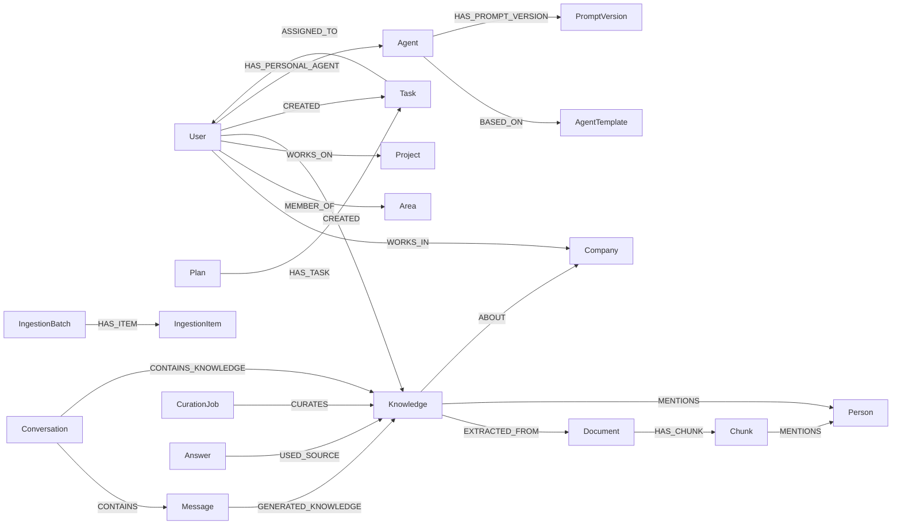

# Feature Specification: Neo4j Graph Data Model

**Feature Branch**: `015-neo4j-graph-model`  
**Created**: 2025-12-07  
**Status**: Draft  
**Priority**: P1 (Core)  
**Source**: TRG-SPC-20251206-005 + `database-schema.md` + specs 001/003/004/005/007–014

## Scope & Goals

- Consolidar em **um único modelo** os principais nodes e relacionamentos do CVC Hub.  
- Garantir que **todas as specs** (pipeline, memória, tasks, curadoria, proveniência, admin) convergem para a mesma ontologia.  
- Servir como **referência única** para implementação, queries, migrações e visualizações.

---

## Macro Graph View (Business-Level)

```mermaid
flowchart TD
    subgraph Org["🏢 Organização"]
        Company[":Company"]
        Area[":Area"]
        Project[":Project"]
    end

    subgraph People["👤 Pessoas"]
        User[":User"]
        Person[":Person"]
    end

    subgraph Knowledge["📚 Conhecimento & Tarefas"]
        Document[":Document"]
        Chunk[":Chunk"]
        Knowledge[":Knowledge"]
        Task[":Task"]
        Plan[":Plan"]
    end

    subgraph Agents["🤖 Agentes & Configs"]
        Agent[":Agent"]
        UserAgent[":Agent (custom)"]
        Preference[":UserPreference"]
        MemoryDecision[":MemoryDecision"]
        CurationJob[":CurationJob"]
        IngestionItem[":IngestionItem"]
        RoutingLog[":RoutingLog"]
    end

    Company <-.- Area
    Company <-.- Project
    Area <-.- User
    Project <-.- User

    User -->|OWNS| Knowledge
    User -->|CREATES| Task

    Document -->|HAS_CHUNK| Chunk
    Chunk -->|RELATES_TO| Knowledge
    Knowledge -->|GENERATES| Task
    Plan -->|HAS_TASK| Task

    User -->|HAS_PERSONAL_AGENT| UserAgent
    Agent -->|HAS_PROMPT| Knowledge

    IngestionItem --> Document
    CurationJob --> Knowledge
    RoutingLog --> Agent
```

> Detalhes de propriedades devem seguir `database-schema.md` + specs específicas (001, 007–014). Esta spec foca em **estrutura e coerência**.

---

## Core Node Types (Resumo)

### 1. Organização & Pessoas

- `:Company` – entidades CVC, CoCreateAI, Startups.  
- `:Area` – departamentos/equipes dentro de empresas.  
- `:Project` – projetos (programa CVC, iniciativas, produtos).  
- `:User` – usuários do sistema (mentores, founders, admin).  
- `:Person` – pessoas genéricas (contatos, stakeholders) que nem sempre têm login.

### 2. Conteúdo & Conhecimento

- `:Document` – documentos ingeridos (reuniões, relatórios…).  
- `:Chunk` – trechos de documentos para busca semântica.  
- `:Knowledge` – unidades de conhecimento consolidado (fatos, insights, definições).  
- `:Conversation` & `:Message` – histórico do chat (para contexto e rastreio).  
- `:Plan` & `:Task` – planos de ação e tarefas (Canvas).

### 3. Agentes & Configuração

- `:Agent` – agentes globais e customizados (Router, Task, Knowledge, custom user agents).  
- `:AgentTemplate` – templates para criação de agentes (004).  
- `:PromptVersion` – versionamento de instruções de agentes (003/004).  
- `:UserPreference` – preferências (memória, visibilidade, etc.).  
- `:MemoryDecision` – logs de decisão Corp/Pessoal (009).  
- `:DataFiltrationLog` – logs Real vs Passageiro (010).  
- `:RoutingLog` & `:AgentSelectionFeedback` – métrica de roteamento (005/011).  
- `:CurationJob`, `:CurationIssue`, `:CurationApprovalRequest` – curadoria (012).  
- `:IngestionBatch`, `:IngestionItem` – ingestão (013).  
- `:Answer` & `:ExternalSource` – proveniência de respostas (014).

---

## Key Relationships (Conceptual)



---

## Consistência com `database-schema.md`

- **Metadados universais** (`id`, `created_at`, `updated_at`, `source_type`, `source_ref`, `owner_id`, `visibility`, `confidence`, `memory_level`, `expires_at`) **devem ser aplicados** a nodes de conteúdo principais:
  - `:Document`, `:Chunk`, `:Knowledge`, `:Task`, `:Plan`, `:Conversation`, `:Message` (quando relevante).  
- Metadados de relacionamento (`relationship_strength`, `interaction_count`, `last_interaction_at`, `relationship_freshness`, `priority_score`) aplicam-se a edges como:
  - `(:User)-[:WORKS_ON]->(:Project)`  
  - `(:Knowledge)-[:RELATES_TO]->(:Project|:Area|:Company)`  
  - `(:Person)-[:WORKS_FOR]->(:Company)` etc.

Esta spec **não redefine** esses campos, mas reforça que **todo novo node** deve usar esse padrão.

---

## Coerência com Specs Existentes (Exemplos)

- **007 Chat & Knowledge Capture**: `:Knowledge` deve referenciar `:Conversation` e `:Message` corretos e manter `visibility`/`owner_id`.  
- **008 Task Generation & Canvas**: `:Plan` e `:Task` devem se relacionar com `:Knowledge` de origem via `:GENERATED_FROM`.  
- **009 User Memory Decision**: `:MemoryDecision` aponta para `:Knowledge` (quando criado) e registra `chosenVisibility`.  
- **010 Data Filtration**: `:DataFiltrationLog.sourceType` e `sourceId` referenciam `:Message`/`:Chunk` etc.  
- **011 Validation Agent**: `:RoutingLog` sempre referencia `:Agent` e, opcionalmente, `:Conversation`.  
- **012 Graph Curation**: `:CurationJob` sempre associa-se a nodes candidatos (Knowledge/Document/etc.) antes da promoção ao grafo principal.  
- **013 Ingestion Ecosystem**: `:IngestionItem.sourceRef` deve bater com `:Document.id`/arquivo físico.  
- **014 Provenance**: `:Answer` e `:USED_SOURCE` conectam com nodes definidos aqui (Document/Knowledge/Chunk/ExternalSource).

---

## High-Level Constraints & Rules

1. **Tudo é Node**: documentos, reuniões, conhecimento, tarefas, planos, pessoas, empresas, agentes.  
2. **Zero Hardcode de Schema**: novas entidades devem ser adicionadas via modelagem e documentação, não "soltas" no código.  
3. **Separação de Camadas**: 
   - Conteúdo de negócio (Document, Knowledge, Task, Plan).  
   - Estrutura organizacional (Company, Area, Project, User).  
   - Infra/operacional (Ingestion, Curation, Routing, Answer).  
4. **Memória Multinível**: `memory_level` + `expires_at` definem caducidade (010/Constitution).  
5. **Visibilidade Hierárquica**: `visibility` + relacionamentos de User→Company→Project→Area controlam o que cada um enxerga.

---

## Assumptions

1. `database-schema.md` continua sendo **fonte principal** de campos/tipos; esta spec é o mapa de alto nível.  
2. Em caso de conflito, specs de domínio (ex.: 007, 008, 009) + `database-schema.md` prevalecem; esta spec deve ser ajustada para refletir essas decisões.

---

## Related Specs

- `project-context/database-schema.md` – detalhes de campos/metadados.  
- 001, 003, 004, 005, 007–014 – todas as specs que criam/consomem nodes e edges.  
- TRG-SPC-20251206-005 – entrada original de triage para o Graph Data Model.
