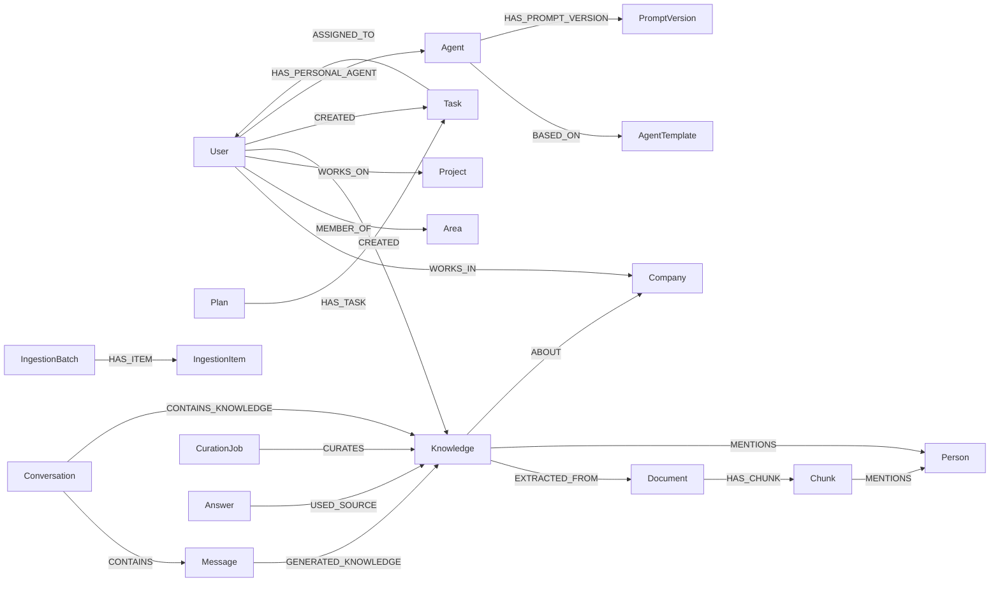

# Feature Specification: Neo4j Graph Data Model

**Feature Branch**: `015-neo4j-graph-model`  
**Created**: 2025-12-07  
**Status**: Draft  
**Priority**: P1 (Core)  
**Source**: TRG-SPC-20251206-005 + `database-schema.md` + specs 001/003/004/005/007–014

## Scope & Goals

- Consolidar em **um único modelo** os principais nodes e relacionamentos do CVC Hub.  
- Garantir que **todas as specs** (pipeline, memória, tasks, curadoria, proveniência, admin) convergem para a mesma ontologia.  
- Servir como **referência única** para implementação, queries, migrações e visualizações.

---

## Macro Graph View (Business-Level)

```mermaid
flowchart TD
    subgraph Org["🏢 Organização"]
        Company[":Company"]
        Area[":Area"]
        Project[":Project"]
    end

    subgraph People["👤 Pessoas"]
        User[":User"]
        Person[":Person"]
    end

    subgraph Knowledge["📚 Conhecimento & Tarefas"]
        Document[":Document"]
        Chunk[":Chunk"]
        Knowledge[":Knowledge"]
        Task[":Task"]
        Plan[":Plan"]
    end

    subgraph Agents["🤖 Agentes & Configs"]
        Agent[":Agent"]
        UserAgent[":Agent (custom)"]
        Preference[":UserPreference"]
        MemoryDecision[":MemoryDecision"]
        CurationJob[":CurationJob"]
        IngestionItem[":IngestionItem"]
        RoutingLog[":RoutingLog"]
    end

    Company <-.- Area
    Company <-.- Project
    Area <-.- User
    Project <-.- User

    User -->|OWNS| Knowledge
    User -->|CREATES| Task

    Document -->|HAS_CHUNK| Chunk
    Chunk -->|RELATES_TO| Knowledge
    Knowledge -->|GENERATES| Task
    Plan -->|HAS_TASK| Task

    User -->|HAS_PERSONAL_AGENT| UserAgent
    Agent -->|HAS_PROMPT| Knowledge

    IngestionItem --> Document
    CurationJob --> Knowledge
    RoutingLog --> Agent
```

> Detalhes de propriedades devem seguir `database-schema.md` + specs específicas (001, 007–014). Esta spec foca em **estrutura e coerência**.

---

## Core Node Types (Resumo)

### 1. Organização & Pessoas

- `:Company` / `:Organization` – entidades CVC, CoCreateAI, Startups (sinônimos).  
- `:Department` – departamentos/áreas dentro de empresas (preferir sobre `:Area`).  
- `:Project` – projetos (programa CVC, iniciativas, produtos).  
- `:User` – usuários do sistema (mentores, founders, admin).  
- `:Person` – pessoas genéricas (contatos, stakeholders) que nem sempre têm login.
- `:Location` – localização física.

> **Nota de Consistência**: Usar `:Department` em vez de `:Area` para alinhar com Meta-Grafo (050) e RBAC.

### 2. Conteúdo & Conhecimento

- `:Document` – documentos ingeridos (reuniões, relatórios…).  
- `:Chunk` – trechos de documentos para busca semântica.  
- `:Knowledge` – unidades de conhecimento consolidado (fatos, insights, definições).  
- `:Conversation` & `:Message` – histórico do chat (para contexto e rastreio).  
- `:Plan` & `:Task` – planos de ação e tarefas (Canvas).

### 3. Agentes & Configuração

- `:Agent` – agentes globais e customizados (Router, Task, Knowledge, custom user agents).  
- `:AgentTemplate` – templates para criação de agentes (004).  
- `:PromptVersion` – versionamento de instruções de agentes (003/004).  
- `:UserPreference` – preferências (memória, visibilidade, etc.).  
- `:MemoryDecision` – logs de decisão Corp/Pessoal (009).  
- `:DataFiltrationLog` – logs Real vs Passageiro (010).  
- `:RoutingLog` & `:AgentSelectionFeedback` – métrica de roteamento (005/011).  
- `:CurationJob`, `:CurationIssue`, `:CurationApprovalRequest` – curadoria (012).  
- `:IngestionBatch`, `:IngestionItem` – ingestão (013).  
- `:Answer` & `:ExternalSource` – proveniência de respostas (014).

---

## Key Relationships (Conceptual)



---

## Consistência com `database-schema.md`

- **Metadados universais** (`id`, `created_at`, `updated_at`, `source_type`, `source_ref`, `owner_id`, `visibility`, `confidence`, `memory_level`, `expires_at`) **devem ser aplicados** a nodes de conteúdo principais:
  - `:Document`, `:Chunk`, `:Knowledge`, `:Task`, `:Plan`, `:Conversation`, `:Message` (quando relevante).  
- Metadados de relacionamento (`relationship_strength`, `interaction_count`, `last_interaction_at`, `relationship_freshness`, `priority_score`) aplicam-se a edges como:
  - `(:User)-[:WORKS_ON]->(:Project)`  
  - `(:Knowledge)-[:RELATES_TO]->(:Project|:Area|:Company)`  
  - `(:Person)-[:WORKS_FOR]->(:Company)` etc.

Esta spec **não redefine** esses campos, mas reforça que **todo novo node** deve usar esse padrão.

---

## Coerência com Specs Existentes (Exemplos)

- **007 Chat & Knowledge Capture**: `:Knowledge` deve referenciar `:Conversation` e `:Message` corretos e manter `visibility`/`owner_id`.  
- **008 Task Generation & Canvas**: `:Plan` e `:Task` devem se relacionar com `:Knowledge` de origem via `:GENERATED_FROM`.  
- **009 User Memory Decision**: `:MemoryDecision` aponta para `:Knowledge` (quando criado) e registra `chosenVisibility`.  
- **010 Data Filtration**: `:DataFiltrationLog.sourceType` e `sourceId` referenciam `:Message`/`:Chunk` etc.  
- **011 Validation Agent**: `:RoutingLog` sempre referencia `:Agent` e, opcionalmente, `:Conversation`.  
- **012 Graph Curation**: `:CurationJob` sempre associa-se a nodes candidatos (Knowledge/Document/etc.) antes da promoção ao grafo principal.  
- **013 Ingestion Ecosystem**: `:IngestionItem.sourceRef` deve bater com `:Document.id`/arquivo físico.  
- **014 Provenance**: `:Answer` e `:USED_SOURCE` conectam com nodes definidos aqui (Document/Knowledge/Chunk/ExternalSource).

---

## High-Level Constraints & Rules

1. **Tudo é Node**: documentos, reuniões, conhecimento, tarefas, planos, pessoas, empresas, agentes.  
2. **Zero Hardcode de Schema**: novas entidades devem ser adicionadas via modelagem e documentação, não "soltas" no código.  
3. **Separação de Camadas**: 
   - Conteúdo de negócio (Document, Knowledge, Task, Plan).  
   - Estrutura organizacional (Company, Area, Project, User).  
   - Infra/operacional (Ingestion, Curation, Routing, Answer).  
4. **Memória Multinível**: `memory_level` + `expires_at` definem caducidade (010/Constitution).  
5. **Visibilidade Hierárquica**: `visibility` + relacionamentos de User→Company→Project→Area controlam o que cada um enxerga.

---

## Assumptions

1. `database-schema.md` continua sendo **fonte principal** de campos/tipos; esta spec é o mapa de alto nível.  
2. Em caso de conflito, specs de domínio (ex.: 007, 008, 009) + `database-schema.md` prevalecem; esta spec deve ser ajustada para refletir essas decisões.

---

---

## Consolidação Ontológica (Referência Cruzada)

Esta seção esclarece a relação entre conceitos similares definidos em diferentes specs.

### Knowledge vs MemoryItem

| Conceito | Spec | Propósito |
|----------|------|-----------|
| `:Knowledge` | 015 (este) | Node canônico de conhecimento consolidado |
| `:MemoryItem` | 017 | **Especialização** de Knowledge com ciclo de vida explícito |

**Regra**: `:MemoryItem` HERDA de `:Knowledge` conceptualmente. Na prática:
- Todo `:MemoryItem` tem as mesmas propriedades base de `:Knowledge`
- `:MemoryItem` adiciona: `status`, `salience`, `ttl`, `scope`
- Usar `:Knowledge` para compatibilidade, `:MemoryItem` quando precisar do ciclo de vida

### Objective vs StrategicObjective

| Conceito | Spec | Propósito |
|----------|------|-----------|
| `:Objective` | 040 (BIG) | Objetivo de negócio genérico |
| `:StrategicObjective` | 022 (Nível 2) | **Sinônimo** de Objective |

**Regra**: Usar `:Objective` como label canônico. `:StrategicObjective` é um alias semântico.

### Process (Múltiplos Contextos)

| Contexto | Spec | Descrição |
|----------|------|-----------|
| Memória Procedural | 017 | Playbook, how-to (como fazer algo) |
| Ontologia de Processo | 022 | MacroProcess, fluxo de valor |
| Query Profile | 050 | Anchor para queries de processo |

**Regra**: 
- `:Process` = processo de negócio (ontologia)
- Memória procedural usa `:Process` com `memory_class: "procedural"`
- Playbooks específicos podem usar sublabel `:Playbook` se necessário

### Department vs Area

**Regra**: Usar `:Department` como label canônico. `:Area` é deprecated.

### Pesos em Relacionamentos (Padronização)

| Propriedade | Uso | Obrigatório |
|-------------|-----|-------------|
| `confidence` | Certeza da relação | Sempre |
| `coherence` | Consistência com grafo | Quando aplicável |
| `recency` | Atualidade (decai) | Para relações temporais |
| `relevance_score` | Relevância para objetivo | Em [:SUPPORTS] |
| `influence_scope` | "local" / "systemic" | Quando aplicável |

**Regra**: `relevance_score` é usado especificamente em [:SUPPORTS] para objetivos. `confidence` é genérico.

---

## Pesos em Relacionamentos (Weight Properties)

Relacionamentos no Neo4j suportam propriedades. Para enriquecer semanticamente as conexões, adotamos um padrão de **pesos** que indicam qualidade, confiança e relevância da relação.

### Propriedades Padrão de Peso

| Propriedade | Tipo | Range | Descrição |
|-------------|------|-------|-----------|
| `confidence` | float | 0.0–1.0 | Quão certo estamos desta relação (fonte, validação) |
| `coherence` | float | 0.0–1.0 | Consistência com o restante do grafo |
| `recency` | float | 0.0–1.0 | Quão atual é esta relação (decai com tempo) |
| `influence_scope` | string | "local" / "systemic" | Impacto: local ao contexto ou sistêmico |

### Aplicação por Tipo de Relacionamento

```cypher
// Conhecimento extraído de documento
(:Knowledge)-[:EXTRACTED_FROM {
  confidence: 0.85,
  coherence: 0.9,
  recency: 1.0,
  method: "llm_extraction",
  extracted_at: datetime()
}]->(:Document)

// Relacionamento de subordinação
(:User)-[:REPORTS_TO {
  confidence: 1.0,       // Dado estruturado, alta confiança
  valid_from: date(),
  valid_to: null,
  source: "organogram"
}]->(:User)

// Menção em chunk (pode ser incerta)
(:Chunk)-[:MENTIONS {
  confidence: 0.7,       // Inferido por NER
  mention_type: "person",
  context_snippet: "...trecho relevante..."
}]->(:Person)

// Suporte a objetivo estratégico
(:Knowledge)-[:SUPPORTS {
  relevance_score: 0.8,
  influence_scope: "systemic",
  assigned_by: "agent",
  assigned_at: datetime()
}]->(:Objective)
```

### Decaimento de Recency

A propriedade `recency` deve ser recalculada periodicamente pelo Memory Decay Agent (spec 017):

```cypher
// Exemplo de decaimento exponencial
SET r.recency = r.recency * exp(-lambda * daysSinceUpdate)
```

---

## Chunks com `idx` (Posição Sequencial)

Em vez de usar relacionamentos `[:NEXT]` para encadear chunks de um documento, adotamos a propriedade `idx` para indicar posição.

### Vantagens do `idx` sobre `:NEXT`

| Aspecto | `[:NEXT]` chain | `idx` property |
|---------|-----------------|----------------|
| Query de janela | Requer traversal recursivo | `WHERE idx BETWEEN a AND b` |
| Inserção no meio | Requer atualizar cadeia | Apenas atualizar `idx` dos subsequentes |
| Performance | O(n) para encontrar posição | O(1) com índice composto |
| Paralelismo | Sequencial | Pode processar em batch |

### Modelo de Chunk com `idx`

```cypher
(:Chunk {
  chunk_id: string,       // UUID único
  doc_id: string,         // Referência ao documento pai
  idx: integer,           // Posição sequencial (0-based)
  text: string,           // Conteúdo do chunk
  token_count: integer,   // Tamanho em tokens
  embedding_id: string,   // Referência ao vetor (se externo)
  created_at: datetime,
  memory_class: string    // "semantic" | "episodic" | "procedural" | "evaluative"
})

// Índice composto para queries de janela
CREATE INDEX chunk_doc_idx FOR (c:Chunk) ON (c.doc_id, c.idx)
```

### Queries de Janela de Contexto

```cypher
// Recuperar chunk central + k vizinhos
MATCH (c:Chunk {chunk_id: $chunkId})
WITH c.doc_id AS docId, c.idx AS centerIdx
MATCH (w:Chunk {doc_id: docId})
WHERE w.idx BETWEEN centerIdx - $k AND centerIdx + $k
RETURN w ORDER BY w.idx
```

### Relacionamento com Documento

```cypher
// Chunk ainda se relaciona com documento via edge
(:Document)-[:HAS_CHUNK]->(:Chunk)

// Mas a ordem é determinada por idx, não por chain
MATCH (d:Document {id: $docId})-[:HAS_CHUNK]->(c:Chunk)
RETURN c ORDER BY c.idx
```

---

## Modelo de RBAC como Propriedade de Concessão

O controle de acesso é modelado **nas propriedades do relacionamento de concessão**, não em nodes separados de permissão.

### Estrutura

```cypher
(:User)-[:HAS_ROLE]->(:Role)-[:GRANTS {
  level: "tactical",          // "strategic" | "tactical" | "operational"
  scope_type: "Department",   // Tipo do escopo
  valid_from: date(),
  valid_to: null,
  granted_by: $adminId
}]->(:Permission)-[:ON_SCOPE]->(:Department)
```

### Níveis de Acesso

| Nível | Descrição | Visibilidade |
|-------|-----------|--------------|
| `strategic` | Acesso a informações estratégicas, OKRs, decisões de alto nível | Tudo |
| `tactical` | Acesso a processos, projetos, métricas departamentais | Tático + Operacional |
| `operational` | Acesso a tarefas, documentos operacionais | Apenas Operacional |

### Query de Verificação de Acesso

```cypher
// Verificar se usuário tem acesso a documento
MATCH (u:User {id: $userId})-[:HAS_ROLE]->(r:Role)-[g:GRANTS]->(p:Permission)-[:ON_SCOPE]->(s)
WHERE (d:Document {id: $docId})-[:BELONGS_TO*1..3]->(s)
  AND g.level IN ["strategic", "tactical", "operational"]  // baseado no nível do doc
  AND (g.valid_to IS NULL OR g.valid_to > date())
RETURN count(*) > 0 AS hasAccess
```

---

## Propriedades Temporais (Bitemporal)

Todo node de conteúdo deve suportar modelo bitemporal para auditoria e queries históricas.

### Propriedades Temporais Padrão

| Propriedade | Tipo | Descrição |
|-------------|------|-----------|
| `valid_from` | datetime | Quando o fato se tornou verdadeiro no mundo real |
| `valid_to` | datetime | Quando o fato deixou de ser verdadeiro (null = atual) |
| `recorded_at` | datetime | Quando o sistema registrou (auto) |
| `updated_at` | datetime | Última modificação no sistema (auto) |
| `expires_at` | datetime | Quando deve ser considerado caduco (null = não expira) |

### Queries Temporais

```cypher
// As-of query: "O que o sistema sabia em 2024-06-01?"
MATCH (k:Knowledge)
WHERE k.recorded_at <= datetime("2024-06-01")
RETURN k

// Valid-at query: "O que era verdade em 2024-06-01?"
MATCH (k:Knowledge)
WHERE k.valid_from <= date("2024-06-01")
  AND (k.valid_to IS NULL OR k.valid_to > date("2024-06-01"))
RETURN k

// Filtragem de validade atual
MATCH (d:Document)
WHERE (d.expires_at IS NULL OR d.expires_at > datetime())
  AND d.updated_at >= datetime() - duration({days: 30})
RETURN d ORDER BY d.updated_at DESC
```

---

## Referência ao Meta-Grafo

O schema deste modelo é autodescrito no **Meta-Grafo** (spec 050). O agente deve consultar o meta-grafo para:

1. Validar labels antes de gerar queries
2. Verificar relacionamentos permitidos
3. Aplicar Query Profiles por intenção
4. Respeitar políticas de acesso e validade

Ver: **050-meta-graph-schema** para detalhes completos do schema-as-data.

---

## Related Specs

- `project-context/database-schema.md` – detalhes de campos/metadados.  
- 001, 003, 004, 005, 007–014 – todas as specs que criam/consomem nodes e edges.  
- **050-meta-graph-schema** – Meta-grafo que descreve este modelo.
- **017-memory-ecosystem** – Decaimento de recency e classes de memória.
- TRG-SPC-20251206-005 – entrada original de triage para o Graph Data Model.
