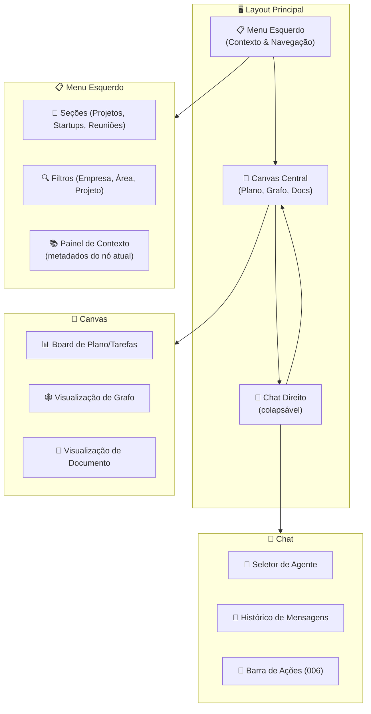

# Feature Specification: Main Interface Layout

**Feature Branch**: `016-main-interface-layout`  
**Created**: 2025-12-07  
**Status**: Draft  
**Priority**: P1 (MVP UI)  
**Source**: TRG-SPC-20251206-007 + chat.txt + frontend overview

## Overview

Layout principal da aplicação CVC Hub:
- **Canvas central** como área de trabalho (planos, grafos, documentos).  
- **Chat colapsável à direita** (assistente + agentes).  
- **Menu lateral esquerdo** (navegação, filtros, contexto).  
- Todo o comportamento de conhecimento/tarefas/memória definido nas specs de backend deve se refletir aqui.

---

## Layout Flow (Business View)

### Regras de Layout

- **Menu Esquerdo**: largura fixa (~280px), sempre visível em desktop; colapsável em mobile.  
- **Canvas Central**: ocupa a maior parte do espaço horizontal; foco visual principal.  
- **Chat Direito**: largura ajustável (~360px), colapsável por padrão em telas menores.  
- Layout responsivo: em mobile, Canvas vira "stack" com Chat em tela cheia alternável.

---

## User Scenarios & Testing

### User Story 1 - Foco no Canvas com Chat de Apoio (Priority: P1)

Usuário trabalha em um plano no Canvas e usa o Chat como apoio lateral.

**Acceptance Scenarios**:

1. **Given** usuário com plano aberto no Canvas, **When** digita pergunta no chat, **Then** resposta aparece na área de chat sem cobrir o Canvas.

2. **Given** resposta inclui tarefas/ajustes, **When** usuário clica em ação "Aplicar ao Plano", **Then** Canvas é atualizado (via Task Agent / Plan nodes) sem recarregar página.

3. **Given** usuário precisa de mais espaço, **When** clica em "esconder chat", **Then** painel direito recolhe e Canvas expande para ocupar área extra.

---

### User Story 2 - Navegação pelo Menu Esquerdo (Priority: P1)

Usuário alterna entre startups/projetos usando o menu, e Canvas/Chat se ajustam ao contexto.

**Acceptance Scenarios**:

1. **Given** usuário vê lista de projetos/startups no menu, **When** seleciona "Startup X", **Then** Canvas carrega visão principal daquela startup (plano atual, principais grafos) e Chat muda contexto (novo `conversation_id`).

2. **Given** filtros ativos (ex: área = Tecnologia), **When** usuário navega, **Then** tanto Canvas quanto Chat consideram esse contexto (Knowledge, Tasks e Agents filtrados por área).

---

### User Story 3 - Contexto do Nó Selecionado (Priority: P1)

Ao clicar em um node no Canvas (ex: `:Project`, `:Knowledge`, `:Task`), painel de contexto mostra detalhes.

**Acceptance Scenarios**:

1. **Given** usuários clicam em um card de tarefa no Canvas, **When** nó é selecionado, **Then** painel de contexto (no menu esquerdo ou lateral) mostra: título, descrição, responsável, status, links para knowledge/doc origem.

2. **Given** node `:Knowledge` selecionado, **When** contexto é exibido, **Then** mostra proveniência (014), visibilidade (009), nível de memória (010), e ações possíveis (editar, reclassificar, abrir no chat, etc.).

---

## Functional Requirements (UI)

### Layout Básico

- **REQ-UI-001**: Layout DEVE ser composto por três colunas principais em desktop: Menu, Canvas, Chat.  
- **REQ-UI-002**: Chat DEVE ser colapsável; Canvas DEVE reagir ocupando espaço extra.  
- **REQ-UI-003**: Em widths menores (mobile/tablet), Chat DEVE virar tela dedicada, acessível por botão (ex: ícone flutuante).

### Integração com Backend

- **REQ-UI-004**: Canvas DEVE trabalhar com IDs de nodes Neo4j (`:Plan`, `:Task`, `:Knowledge`, `:Project` etc.).  
- **REQ-UI-005**: Menu esquerdo DEVE carregar lista de `:Company`, `:Project`, `:Area`, `:Conversation` relevantes ao usuário (respeitando visibilidade).  
- **REQ-UI-006**: Chat DEVE receber `conversation_id`, `user_id`, `agent_id` e repassar ao backend conforme specs 005/007.

### Navegação & Estado

- **REQ-UI-007**: Seleção no menu (ex: Projeto) DEVE atualizar contexto global (company_id, project_id, area_id) usado por todos os componentes.  
- **REQ-UI-008**: Estado de qual painel está aberto/fechado (Chat, Menu colapsado etc.) DEVE ser persistido (ex: local storage) para melhor UX.

### Menu Adaptativo & Otimizado por Experiência

- **REQ-UI-009**: Menu lateral esquerdo NÃO DEVE ser fixo; DEVE adaptar-se com base na experiência do usuário.
- **REQ-UI-010**: Sistema DEVE rastrear quais itens do menu o usuário acessa mais frequentemente (via log de navegação ou métricas de uso).
- **REQ-UI-011**: Itens de menu mais usados DEVEM aparecer no topo ou com destaque visual (ex: ícone de favorito, cor diferente).
- **REQ-UI-012**: Menu PODE incluir seção "Acesso Rápido" ou "Recentes" que se auto-organiza com base no histórico.
- **REQ-UI-013**: Usuário DEVE poder fixar/desfixar itens manualmente (override da ordenação automática).
- **REQ-UI-014**: Mudanças de menu adaptativo DEVEM ser gravadas em `:UserPreferences` ou similar no grafo para persistência cross-device.

---

## Wireframe Conceitual (Texto)

- **Topo**: barra com logo, seleção de empresa (CVC / CoCreateAI / Startup), perfil do usuário (com avatar e menu de admin/usuário) e ícone de sino (Centro de Notificações).  
- **Coluna Esquerda (Menu)**:
  - Seções: "Startups", "Projetos", "Reuniões", "Minhas Tarefas", "Minha Agenda", "Gamificação / Meu Dashboard", "Favoritos".  
  - Seção "Minha Agenda" abre Calendar View (spec 023) no Canvas com visualização semanal/mensal e gráfico % pessoal vs corporativo.
  - Filtros: empresa, área, status do projeto.  
  - Painel de contexto quando um nó do Canvas é clicado.  
  - **Função principal**: navegação e seleção de contexto, **não** é onde o conteúdo principal é renderizado.  
  - **Menu adaptativo**: Itens mais acessados ficam no topo, seção "Recentes" se auto-organiza.
- **Centro (Canvas)**:
  - **Área principal de conteúdo**. Tudo que o usuário estiver "vendo" é renderizado aqui:
    - Visual do plano de tarefas (lista ou board) quando clica em "Minhas Tarefas" ou em uma tarefa específica.  
    - Visual de grafo (nodes/edges).  
    - Visualização de documento (preview do Docling).  
    - Dashboard de Gamificação / KPIs quando seleciona "Gamificação" / "Meu Dashboard".  
    - Qualquer outra visão acionada por notificações (Centro de Notificações) ou ações do chat.
- **Direita (Chat)**:
  - Header: seletor de agente (Router/Task/custom), status (online, tokens, etc.).  
  - Timeline de mensagens.  
  - ActionBar (006) com "Novo Conhecimento", "Nova Tarefa", "Novo Insight".

---

## Related Specs

- **003-admin-login-config** – Menu de admin, visibilidade de itens.  
- **005-agent-router** – Seletor de agente no Chat.  
- **006-chat-action-menu** – ActionBar dentro do Chat.  
- **007/008/001** – Chat & Knowledge, Task & Canvas, Pipeline de conhecimento.  
- **012/013/014/015** – Curadoria, Ingestão, Proveniência, Modelo de Grafo.
- **020-gamification-user-kpis** – Dashboard de Gamificação renderizado no Canvas quando usuário acessa via menu.
- **021-notification-center** – Sino de notificações no header, notificações abrem visões no Canvas.
- **023-agenda-calendar-system** – Minha Agenda no menu, renderizada no Canvas com visualização semanal/mensal e gráfico %.

---

## Notes

Detalhes visuais (cores, tipografia, componentes específicos de UI library) serão definidos no nível de implementação/Design System; esta spec garante a **estrutura funcional** e a coerência com o backend.
