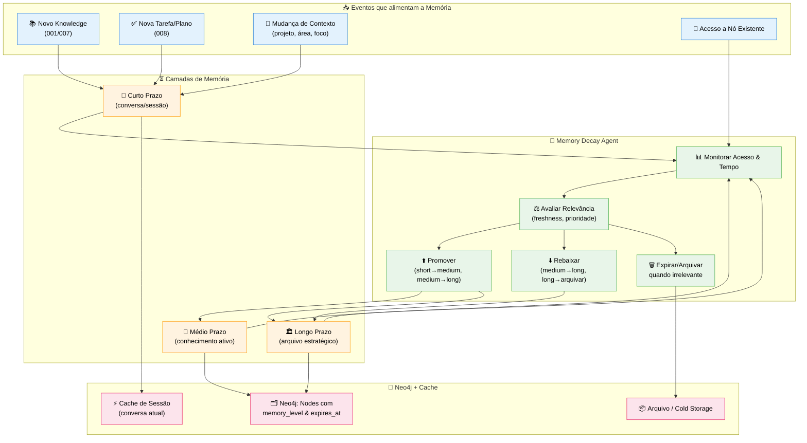
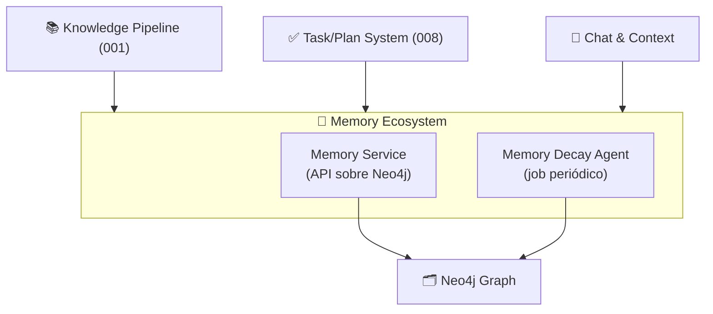

# Feature Specification: Memory Ecosystem & Memory Decay Agent

**Feature Branch**: `017-memory-ecosystem`  
**Created**: 2025-12-07  
**Status**: Draft  
**Priority**: P1 (Core)  
**Source**: TRG-SPC-20251206-012/013/014 (Memory Ecosystem, Memory Decay Agent) + `database-schema.md` + specs 001/009/010/012/015

## Purpose

Definir o **sistema de memória próprio do CVC Hub**, independente da memória interna do framework Agno:
- Camadas de memória: curto, médio e longo prazo.  
- Como nodes "envelhecem" (caducidade) e mudam de nível.  
- Como o uso recente e a relevância afetam o que é lembrado ou esquecido.  
- Como isso se conecta ao Neo4j (`memory_level`, `expires_at`, `freshness` em `database-schema.md`).
- **Resumo de histórico de chat** para manter visão ampla sem explodir o contexto da LLM (estratégias de janelamento progressivo podem ser usadas conforme necessidade futura).

> Arquitetura Confirmada (triage): **Sistema de memória PRÓPRIO (não usar memória do Agno)**.

---

## Process Flow (Business View)



---

## Agent Collaboration



- **Memory Service**: API para leitura/escrita de memória (front + agentes consultam este serviço em vez de acessar Neo4j direto).  
- **Memory Decay Agent**: job periódico que lê métricas de acesso/relevância e ajusta `memory_level`, `expires_at`, `freshness`.

---

## User Scenarios & Testing

### User Story 1 - Memória de Conversa de Curto Prazo (Priority: P1)

Usuário conversa sobre um tema; sistema mantém resumo e detalhes recentes sem necessariamente promover tudo para conhecimento longo prazo.

**Acceptance Scenarios**:

1. **Given** conversa ativa, **When** usuário envia várias mensagens de contexto, **Then** Memory Service mantém essas mensagens e resumo em memória de curto prazo (`memory_level="short"`, expirando após X horas/dia).

2. **Given** conversa termina e usuário não salva nada como conhecimento, **When** volta dias depois, **Then** apenas partes relevantes (promovidas a `:Knowledge`) permanecem; small talk de curto prazo pode ter caducado.

---

### User Story 2 - Promoção por Uso Frequente (Priority: P1)

Knowledge usado repetidamente é promovido de curto/médio para longo prazo.

**Acceptance Scenarios**:

1. **Given** node `K1` inicialmente `memory_level="medium"`, **When** é acessado muitas vezes em um intervalo curto (ex: 10 acessos em 7 dias), **Then** Decay Agent promove para `"long"` e ajusta `expires_at=null` (não expira automaticamente).

2. **Given** promoção aplicada, **When** K1 passa a ser considerado em buscas e sugestões prioritárias, **Then** relevance/freshness refletem isso.

---

### User Story 3 - Esquecimento Controlado (Priority: P1)

Dados de curto prazo que não são mais usados vão sendo "esquecidos" naturalmente.

**Acceptance Scenarios**:

1. **Given** node `K2` com `memory_level="short"` e `expires_at` definido, **When** ninguém acessa até depois de `expires_at`, **Then** Decay Agent marca como expirado (pode arquivar, remover de buscas ou mover para Archive).

2. **Given** dados expirados, **When** usuário tenta buscar por conteúdo antigo e pouco relevante, **Then** esses nodes não aparecem mais ou aparecem apenas em modo "arquivo".

---

### User Story 4 - Preferências de Memória por Usuário (Priority: P2)

Usuário avançado pode preferir reter mais (ou menos) memória.

**Acceptance Scenarios**:

1. **Given** usuário configura "conservador" vs "agressivo" para caducidade, **When** Decay Agent roda, **Then** parâmetros de `expires_at` e thresholds são ajustados levando em conta preferências do user.

2. **Given** startup em fase inicial (onde tudo é importante), **When** política define retenção maior, **Then** menos conhecimento é expurgado.

---

### User Story 5 - Resumo de Histórico para Contexto da LLM (Priority: P1)

Sistema mantém visão ampla de conversas longas sem explodir o contexto da LLM, usando resumos progressivos simples (últimas mensagens completas + poucos resumos agregados).

**Why this priority**: Conversas podem ter centenas de mensagens; enviar tudo para LLM é inviável (limite de tokens). Resumos em camadas permitem visão ampla sem perder nuances recentes.

**Acceptance Scenarios**:

1. **Given** conversa com muitas mensagens, **When** sistema prepara contexto para próxima resposta da LLM, **Then** contexto inclui: últimas `N_recent` mensagens completas +, se disponíveis, 1 resumo "recente" e 1 resumo "histórico", mantendo total de tokens abaixo de limite configurável.

2. **Given** conversa cresce ainda mais, **When** novas mensagens são adicionadas, **Then** sistema atualiza os resumos (em vez de enviar toda a conversa bruta) e continua respeitando o limite de tokens.

3. **Given** usuário está no histórico de chat, **When** clica para ver detalhes de um resumo, **Then** interface mostra as mensagens cobertas por aquele resumo sem alterar a forma como o contexto é enviado para LLM.

---

## Functional Requirements

### Memory Levels & Metadata

- **REQ-MEMECO-001**: Todo node de conteúdo relevante (`:Knowledge`, `:Task`, `:Plan`, `:Document`, `:Chunk`, `:Conversation`) DEVE ter `memory_level` e `expires_at` definidos (conforme `database-schema.md`).  
- **REQ-MEMECO-002**: `memory_level` permitido: `short`, `medium`, `long`.  
- **REQ-MEMECO-003**: `expires_at = null` indica que, por política, node não expira automaticamente (mas pode ser arquivado manualmente).

### Memory Decay Agent

- **REQ-MEMECO-004**: Decay Agent DEVE rodar em intervalo configurável (ex: 1x por dia).  
- **REQ-MEMECO-005**: Decay Agent DEVE ler, para cada node, ao menos: `created_at`, `last_accessed_at`, `access_count`, `relevance_score`, `memory_level`, `expires_at`.  
- **REQ-MEMECO-006**: Decay Agent DEVE aplicar regras:
  - **short → medium** se: `access_count` e `relevance_score` acima de threshold.  
  - **medium → long** se: uso consistente ao longo do tempo.  
  - **qualquer → archive** se: `now > expires_at` e `relevance_score` baixo.

### Memory Service API

- **REQ-MEMECO-007**: Camada de aplicação DEVE consultar memória via serviço (`Memory Service`) em vez de acessar Diretamente o driver Neo4j (abstração lógica, não necessariamente microserviço físico neste estágio).  
- **REQ-MEMECO-008**: Memory Service DEVE oferecer operações lógicas como:
  - `get_recent_context(user_id, project_id)`  
  - `get_relevant_knowledge(user_id, topic)`  
  - `update_access_metrics(node_id)` (incrementar `access_count`, atualizar `last_accessed_at`).  

### Metrics & Feedback Loop

- **REQ-MEMECO-009**: Cada leitura de node por agentes (Knowledge, Task, Router, etc.) DEVE atualizar `last_accessed_at` e `access_count`.  
- **REQ-MEMECO-010**: Sistema DEVE poder calcular métricas agregadas: top knowledge por uso, nodes obsoletos, etc., e essas métricas DEVEM estar disponíveis para o Observability Dashboard (018) via consultas agregadas (sem listar todos os nodes brutos).

### Colaboração com FeedbackAgent (Melhoria Contínua de Persona)

- **REQ-MEMECO-011**: Memory Decay Agent DEVE, durante job periódico, identificar **padrões de uso de longo prazo** do usuário (ex: tipos de conhecimento mais acessados, tarefas recorrentes, preferências de conteúdo).
- **REQ-MEMECO-012**: Quando padrões significativos são identificados (ex: usuário acessa `Knowledge` de tipo "planilhas" em 80% das consultas nos últimos 30 dias), Memory Decay DEVE notificar **FeedbackAgent (019)** com esses insights.
- **REQ-MEMECO-013**: Notificação ao FeedbackAgent DEVE incluir:
  - `user_id`
  - `pattern_type`: `'content_preference'`, `'tool_usage'`, `'skill_gap'`, etc.
  - `pattern_details`: JSON estruturado com métricas (ex: `{knowledge_type: 'planilhas', frequency: 0.8, period: '30d'}`).
  - `suggested_actions`: Lista de ações sugeridas (ex: `['add_mcp:excel', 'update_persona:abilities']`).
- **REQ-MEMECO-014**: FeedbackAgent DEVE processar essas notificações e decidir se propõe atualização de `:PersonaVersion` (spec 022) ou `:AgentPrompt` (spec 019).
- **REQ-MEMECO-015**: Fluxo de colaboração PODE ser acionado também **sob demanda** (não só periódico), quando usuário solicita reavaliação de perfil via Canvas (spec 022).

### Resumo de Histórico de Conversa (Summarização Progressiva)

- **REQ-MEMECO-016**: Sistema PODE manter resumos de histórico de chat para fornecer contexto condensado à LLM sem exceder o limite de tokens.
- **REQ-MEMECO-017** (MVP): Para cada conversa, sistema DEVE, no mínimo:
  - Manter as últimas `N_recent` mensagens completas (ex.: 20).
  - Manter 1 `:ConversationSummary` "recente" cobrindo um bloco de mensagens anteriores (ex.: últimas 50 antes das recentes).
  - Manter 1 `:ConversationSummary` "histórico" cobrindo o restante mais antigo (ex.: mensagens anteriores a esse bloco).
- **REQ-MEMECO-018**: Resumos DEVEM ser gerados por LLM (Azure OpenAI) com prompt focado em: contexto principal, decisões tomadas, pontos de dúvida/lacunas e características relevantes do usuário na conversa.
- **REQ-MEMECO-019**: Resumos DEVEM ser armazenados como nodes `:ConversationSummary` no grafo, ligados a `:Conversation` via `[:HAS_SUMMARY]`, podendo incluir campos como `window_label`, `window_size`, `range_start`, `range_end`, `token_count`.
- **REQ-MEMECO-020**: Ao montar contexto para LLM, sistema DEVE incluir as últimas `N_recent` mensagens completas e, se existirem, até 2 resumos ("recente" + "histórico"), garantindo que o total de tokens fique abaixo de limite configurável.
- **REQ-MEMECO-021**: Estratégias mais sofisticadas de janelamento progressivo (ex.: tamanhos de janela inspirados em sequência de Fibonacci) PODEM ser adotadas no futuro, mas não são obrigatórias no MVP.
- **REQ-MEMECO-022**: Usuário/empresa PODE desativar o uso de resumos (opt-out), caso prefira enviar mais mensagens brutas até o limite de tokens do modelo.
- **REQ-MEMECO-023**: Interface de histórico de chat DEVE permitir que usuário veja, ao clicar em um resumo, as mensagens cobertas por aquele resumo, sem alterar a forma como o contexto é enviado para LLM.

---

## Key Entities (Neo4j)

Aproveitando `database-schema.md`:

```cypher
// Exemplo de campos em Knowledge (já citados em outras specs)
(:Knowledge {
  id: string,
  content: string,
  source_type: string,
  source_ref: string,
  owner_id: string,
  visibility: string,
  confidence: float,
  memory_level: string, // "short" | "medium" | "long"
  expires_at: datetime,
  last_accessed_at: datetime,
  access_count: integer,
  relevance_score: float,
  freshness_decay_rate: float,
  last_validated_at: datetime,
  created_at: datetime,
  updated_at: datetime
})

// MemoryDecayJob log
(:MemoryDecayJob {
  id: string,
  runAt: datetime,
  nodesScanned: integer,
  nodesPromoted: integer,
  nodesDemoted: integer,
  nodesArchived: integer,
  durationMs: integer
})

(:MemoryDecayJob)-[:AFFECTED]->(:Knowledge|:Task|:Plan)

// ConversationSummary (resumos progressivos de histórico)
(:ConversationSummary {
  id: uuid,
  conversation_id: uuid,
  window_label: string,  // 'recent', 'historical', ou outro label
  window_size: integer,  // número de mensagens cobertas
  summary_text: text,  // Resumo gerado pela LLM
  message_count: integer,  // Quantas mensagens foram resumidas
  start_message_index: integer,  // Primeira mensagem incluída no resumo
  end_message_index: integer,  // Última mensagem incluída no resumo
  token_count: integer,  // Tokens do resumo (para controle de contexto)
  created_at: timestamp,
  invalidated_at: timestamp?  // Se mensagens foram editadas/deletadas
})

(:Conversation)-[:HAS_SUMMARY]->(:ConversationSummary)
(:ConversationSummary)-[:SUMMARIZES]->(:Message)  // Link para mensagens originais
```

---

## Technical Constraints

- Sistema de memória deve ser **configurável**, não amarrado a constantes hardcoded; thresholds de promoção/caducidade devem vir de configuração (ou nodes de config no grafo).  
- Decay Agent não pode ser pesado a ponto de travar o DB; deve operar em batches.  
- Algumas entidades (ex: logs críticos, decisões de admin) podem ser marcadas como `long` sem expiração.

---

## Assumptions

1. **MVP**: Decay Agent inicial usará regras simples (thresholds fixos), refinados depois com métricas.  
2. **Agno Memory**: vamos usar apenas nossa camada de memória + grafo; a memória interna do Agno será usada apenas para janelas de conversa pequenas, não como fonte de verdade de longo prazo.  
3. **Archive**: pode ser outra label no mesmo DB (`:Archived`) ou outro storage; decisão no plano técnico.

---

## Related Specs

- **001-knowledge-pipeline** – entrada de conhecimento.  
- **007-chat-knowledge-capture** – fonte principal de knowledge.  
- **009-user-memory-decision** – decisão Corp/Pessoal antes de persistir.  
- **010-data-filtration** – Real vs Passageiro + `memory_level` inicial.  
- **012-graph-curation-ecosystem** – garante qualidade antes de entrar no grafo.  
- **015-neo4j-graph-model** – modelo global de nodes/relacionamentos.
- **018-observability-dashboard** – exibe métricas de memória (distribuição por `memory_level`, jobs de decay) para admins/curadores.
- **019-multi-agent-orchestration** – FeedbackAgent processa insights de padrões de uso para propor melhorias de persona.
- **022-onboarding-ai-profile** – Persona do usuário e AI Profile são alvos de melhoria contínua via padrões detectados pelo Memory Decay Agent.

---

## References

- `database-schema.md`: metadados universais, freshness, relacionamento.
- Constitution: A.XIII (Caducidade de Nodes), A.XIV (Memória Multinível).

---

## Notes

### Implementação de Fibonacci Summarization

O MVP usa um modelo simples de summarização progressiva (últimas mensagens completas + poucos resumos agregados). Estratégias mais sofisticadas de janelamento (incluindo tamanhos de janela inspirados em sequência de Fibonacci) PODEM ser exploradas futuramente se métricas de uso mostrarem necessidade real, mas não são obrigatórias neste momento.
