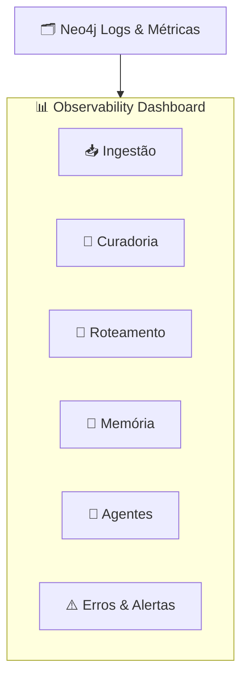

# Feature Specification: Observability & Metrics Dashboard

**Feature Branch**: `018-observability-dashboard`  
**Created**: 2025-12-07  
**Status**: Draft  
**Priority**: P2 (Core Support)  
**Source**: triage (Observability, Metrics) + specs 005/007–015/017

## Purpose

Oferecer ao admin e ao time técnico uma visão clara de:
- **Saúde do sistema** (ingestão, curadoria, memória, roteamento).  
- **Uso de agentes** (quais são mais usados, taxa de acerto, feedback).  
- **Qualidade de conhecimento** (duplicidade, caducidade, cobertura).  
- **Fluxos críticos** (erros em Docling, curadoria pendente, decisões de memória).  
- **Ciclo de feedback** entre uso real, memória (017) e times multi-agente (019), oferecendo sinais práticos para ajuste de persona, thresholds de memória e configurações de Team.

---

## High-Level View (Business)



### Cards principais

- **Ingestão**: status de batches, itens pendentes, taxa de sucesso/erro.  
- **Curadoria**: jobs pendentes, issues críticas, tempo médio de aprovação.  
- **Roteamento**: taxa de acerto do Router, uso de agentes, feedback dos usuários.  
- **Memória**: quantidade de knowledge por `memory_level`, nodes expirando, jobs de decay.  
- **Agentes**: chamadas por agente, latência, erros.  
- **Erros & Alertas**: últimos erros de pipeline, curadoria, ingestão, LLM.

---

## User Scenarios & Testing

### User Story 1 - Ver Saúde da Ingestão (Priority: P1)

Admin quer saber se documentos estão sendo processados corretamente.

**Acceptance Scenarios**:

1. **Given** dashboard aberto na aba "Ingestão", **When** há batches em andamento, **Then** gráfico/linha do tempo mostra número de `:IngestionBatch` por status (pending, processing, completed, failed).

2. **Given** um batch com muitos erros, **When** admin clica no card, **Then** vê lista de `:IngestionItem` com `status="failed"` e `errorMessage` resumido.

---

### User Story 2 - Monitorar Curadoria (Priority: P1)

Admin quer ver quantos jobs de curadoria estão travados ou aguardando aprovação.

**Acceptance Scenarios**:

1. **Given** dados em `:CurationJob`, **When** dashboard exibe seção "Curadoria", **Then** vê contagem de jobs por `status` (pending, validating, awaiting_approval, approved, rejected, failed).

2. **Given** jobs `awaiting_approval`, **When** admin clica, **Then** lista mostra fonte (documento/chat), prioridade e há link para o painel de curadoria (para aprovar/rejeitar).

---

### User Story 3 - Acompanhar Roteamento & Agentes (Priority: P1)

Admin quer saber se Router está escolhendo bem os agentes.

**Acceptance Scenarios**:

1. **Given** dados em `:RoutingLog` e `:AgentSelectionFeedback`, **When** admin abre aba "Roteamento", **Then** vê gráficos:
   - Taxa de acerto por intenção (task_generation, knowledge_query, etc.).  
   - Uso por agente (Router Agent, Task Agent, Knowledge Agent, custom).  
   - Feedback dos usuários (👍/👎).

2. **Given** queda na taxa de acerto, **When** admin filtra por período/intent/agent, **Then** consegue chegar a exemplos concretos (mensagens, agente escolhido, melhor agente sugerido pelo Validation Agent).

---

### User Story 4 - Acompanhar Memória & Caducidade (Priority: P2)

Admin quer ver como a memória está se comportando (quanto knowledge está ativo vs arquivado).

**Acceptance Scenarios**:

1. **Given** `:Knowledge` com `memory_level` e `expires_at`, **When** admin abre aba "Memória", **Then** vê distribuição de nodes por nível (`short`, `medium`, `long`) e quantos expiram em breve.

2. **Given** `:MemoryDecayJob` logs, **When** admin vê histórico, **Then** consegue ver quantos nodes foram promovidos/demovidos/arquivados por execução.

---

## Functional Requirements

### Data Sources

- **REQ-OBS-001**: Dashboard DEVE ler métricas de nodes já modelados:  
  `:IngestionBatch`, `:IngestionItem`, `:CurationJob`, `:CurationIssue`, `:RoutingLog`, `:AgentSelectionFeedback`, `:MemoryDecayJob`, `:Knowledge`, `:Task`, `:Plan`.

- **REQ-OBS-002**: Consultas de métricas DEVEM ser agregadas (usar `count`, `avg`, etc.), não listar todos os nodes bruto.

### UI & Interação

- **REQ-OBS-003**: Dashboard inicial DEVE mostrar visão geral com resumos (cards) de cada área: Ingestão, Curadoria, Roteamento, Memória, Agentes.  
- **REQ-OBS-004**: Cada card DEVE ser clicável para abrir detalhamento.

- **REQ-OBS-005**: UI DEVE permitir filtros por período (últimas 24h, 7 dias, 30 dias), por empresa (CVC, CoCreateAI, Startup), e por projeto.

### Alertas

- **REQ-OBS-006**: Sistema DEVE marcar em destaque:  
  - Taxa de erro de ingestão acima de threshold.  
  - Jobs de curadoria `failed` ou `stuck` por mais de X horas.  
  - Queda significativa de taxa de acerto de roteamento.  
  - Crescimento anormal de knowledge `short` que nunca é promovido.

- **REQ-OBS-007**: Alertas PODEM ser enviados via email/Slack em implementações futuras (não obrigatório no MVP).

### Segurança & Visibilidade

- **REQ-OBS-008**: Apenas usuários com role `admin` ou similar DEVEM ver dashboard completo.  
- **REQ-OBS-009**: Métricas específicas de startup devem respeitar visibilidade: um admin de startup não vê dados de outras startups/CVC.

### Feedback Loop com Memory (017) e Multi-Agent (019)

- **REQ-OBS-010**: Dashboard DEVE, na aba "Memória", combinar distribuição de `:Knowledge` por `memory_level` com histórico de `:MemoryDecayJob` (017), permitindo avaliar se políticas de promoção/caducidade estão funcionando.
- **REQ-OBS-011**: Dashboard DEVE permitir cruzar métricas de uso de agentes/Teams (ex.: dados de `:RoutingLog` e `:AgentSelectionFeedback`) com métricas de memória para apoiar decisões de ajuste de persona e TeamConfig descritas em 019.
- **REQ-OBS-012**: Insights dessas visões PODEM ser usados por admin/curador para revisar parâmetros de memória (thresholds) e configurações de Teams/prompt, sem automatizar essas decisões no MVP (apenas suporte à decisão).

---

## Key Entities & Queries (Exemplos)

### Ingestão

```cypher
// Contagem de batches por status
MATCH (b:IngestionBatch)
RETURN b.status AS status, count(*) AS total
ORDER BY total DESC;
```

### Curadoria

```cypher
// Jobs de curadoria pendentes de aprovação
MATCH (j:CurationJob {status: "awaiting_approval"})
RETURN j.id, j.sourceType, j.sourceRef, j.priority, j.createdAt
ORDER BY j.priority DESC, j.createdAt ASC;
```

### Roteamento

```cypher
// Taxa de acerto por intenção
MATCH (r:RoutingLog)
WITH r.classifiedIntent AS intent,
     count(*) AS total,
     sum(CASE WHEN r.wasCorrect THEN 1 ELSE 0 END) AS correct
RETURN intent, total, correct, correct * 1.0 / total AS accuracy
ORDER BY accuracy DESC;
```

### Memória

```cypher
// Distribuição de knowledge por nível de memória
MATCH (k:Knowledge)
RETURN k.memory_level AS level, count(*) AS total
ORDER BY total DESC;
```

---

## Technical Constraints

- Dashboard deve ser construído sobre **queries otimizadas** (uso de índices indicados em `database-schema.md` e nas specs de logs).  
- Visualizações podem ser feitas no frontend (Next.js) consumindo endpoints de métricas; esta spec não dita biblioteca de chart (Chart.js, ECharts, etc.).

---

## Related Specs

- 005, 011 – Roteamento & Validation Agent (fonte de métricas de agente).  
- 012 – Curation Ecosystem.  
- 013 – Ingestion Ecosystem.  
- 017 – Memory Ecosystem.  
- 019 – Multi-Agent Orchestration – usa métricas de roteamento/feedback para melhoria de Teams e persona.  
- 015 – Neo4j Graph Model (ontologia dos logs).
