# Feature Specification: Observability & Metrics Dashboard

**Feature Branch**: `018-observability-dashboard`  
**Created**: 2025-12-07  
**Status**: Draft  
**Priority**: P2 (Core Support)  
**Source**: triage (Observability, Metrics) + specs 005/007–015/017

## Purpose

Oferecer ao admin e ao time técnico uma visão clara de:
- **Saúde do sistema** (ingestão, curadoria, memória, roteamento).  
- **Uso de agentes** (quais são mais usados, taxa de acerto, feedback).  
- **Qualidade de conhecimento** (duplicidade, caducidade, cobertura).  
- **Fluxos críticos** (erros em Docling, curadoria pendente, decisões de memória).  
- **Ciclo de feedback** entre uso real, memória (017) e times multi-agente (019), oferecendo sinais práticos para ajuste de persona, thresholds de memória e configurações de Team.

---

## High-Level View (Business)

```mermaid
flowchart TD
    subgraph Dash["📊 Observability Dashboard"]
        CardIngestion["📥 Ingestão"]
        CardCuration["🧹 Curadoria"]
        CardRouting["🔀 Roteamento"]
        CardMemory["🧠 Memória"]
        CardAgents["🤖 Agentes"]
        CardErrors["⚠️ Erros & Alertas"]
    end

    DataNeo4j["🗂️ Neo4j Logs & Métricas"] --> Dash
```



### Cards principais

- **Ingestão**: status de batches, itens pendentes, taxa de sucesso/erro.  
- **Curadoria**: jobs pendentes, issues críticas, tempo médio de aprovação.  
- **Roteamento**: taxa de acerto do Router, uso de agentes, feedback dos usuários.  
- **Memória**: quantidade de knowledge por `memory_level`, nodes expirando, jobs de decay.  
- **Agentes**: chamadas por agente, latência, erros.  
- **Erros & Alertas**: últimos erros de pipeline, curadoria, ingestão, LLM.

---

## User Scenarios & Testing

### User Story 1 - Ver Saúde da Ingestão (Priority: P1)

Admin quer saber se documentos estão sendo processados corretamente.

**Acceptance Scenarios**:

1. **Given** dashboard aberto na aba "Ingestão", **When** há batches em andamento, **Then** gráfico/linha do tempo mostra número de `:IngestionBatch` por status (pending, processing, completed, failed).

2. **Given** um batch com muitos erros, **When** admin clica no card, **Then** vê lista de `:IngestionItem` com `status="failed"` e `errorMessage` resumido.

---

### User Story 2 - Monitorar Curadoria (Priority: P1)

Admin quer ver quantos jobs de curadoria estão travados ou aguardando aprovação.

**Acceptance Scenarios**:

1. **Given** dados em `:CurationJob`, **When** dashboard exibe seção "Curadoria", **Then** vê contagem de jobs por `status` (pending, validating, awaiting_approval, approved, rejected, failed).

2. **Given** jobs `awaiting_approval`, **When** admin clica, **Then** lista mostra fonte (documento/chat), prioridade e há link para o painel de curadoria (para aprovar/rejeitar).

---

### User Story 3 - Acompanhar Roteamento & Agentes (Priority: P1)

Admin quer saber se Router está escolhendo bem os agentes.

**Acceptance Scenarios**:

1. **Given** dados em `:RoutingLog` e `:AgentSelectionFeedback`, **When** admin abre aba "Roteamento", **Then** vê gráficos:
   - Taxa de acerto por intenção (task_generation, knowledge_query, etc.).  
   - Uso por agente (Router Agent, Task Agent, Knowledge Agent, custom).  
   - Feedback dos usuários (👍/👎).

2. **Given** queda na taxa de acerto, **When** admin filtra por período/intent/agent, **Then** consegue chegar a exemplos concretos (mensagens, agente escolhido, melhor agente sugerido pelo Validation Agent).

---

### User Story 4 - Acompanhar Memória & Caducidade (Priority: P2)

Admin quer ver como a memória está se comportando (quanto knowledge está ativo vs arquivado).

**Acceptance Scenarios**:

1. **Given** `:Knowledge` com `memory_level` e `expires_at`, **When** admin abre aba "Memória", **Then** vê distribuição de nodes por nível (`short`, `medium`, `long`) e quantos expiram em breve.

2. **Given** `:MemoryDecayJob` logs, **When** admin vê histórico, **Then** consegue ver quantos nodes foram promovidos/demovidos/arquivados por execução.

---

## Functional Requirements

### Data Sources

- **REQ-OBS-001**: Dashboard DEVE ler métricas de nodes já modelados:  
  `:IngestionBatch`, `:IngestionItem`, `:CurationJob`, `:CurationIssue`, `:RoutingLog`, `:AgentSelectionFeedback`, `:MemoryDecayJob`, `:Knowledge`, `:Task`, `:Plan`.

- **REQ-OBS-002**: Consultas de métricas DEVEM ser agregadas (usar `count`, `avg`, etc.), não listar todos os nodes bruto.

### UI & Interação

- **REQ-OBS-003**: Dashboard inicial DEVE mostrar visão geral com resumos (cards) de cada área: Ingestão, Curadoria, Roteamento, Memória, Agentes.  
- **REQ-OBS-004**: Cada card DEVE ser clicável para abrir detalhamento.

- **REQ-OBS-005**: UI DEVE permitir filtros por período (últimas 24h, 7 dias, 30 dias), por empresa (CVC, CoCreateAI, Startup), e por projeto.

### Alertas

- **REQ-OBS-006**: Sistema DEVE marcar em destaque:  
  - Taxa de erro de ingestão acima de threshold.  
  - Jobs de curadoria `failed` ou `stuck` por mais de X horas.  
  - Queda significativa de taxa de acerto de roteamento.  
  - Crescimento anormal de knowledge `short` que nunca é promovido.

- **REQ-OBS-007**: Alertas PODEM ser enviados via email/Slack em implementações futuras (não obrigatório no MVP).

### Segurança & Visibilidade

- **REQ-OBS-008**: Apenas usuários com role `admin` ou similar DEVEM ver dashboard completo.  
- **REQ-OBS-009**: Métricas específicas de startup devem respeitar visibilidade: um admin de startup não vê dados de outras startups/CVC.

### Feedback Loop com Memory (017) e Multi-Agent (019)

- **REQ-OBS-010**: Dashboard DEVE, na aba "Memória", combinar distribuição de `:Knowledge` por `memory_level` com histórico de `:MemoryDecayJob` (017), permitindo avaliar se políticas de promoção/caducidade estão funcionando.
- **REQ-OBS-011**: Dashboard DEVE permitir cruzar métricas de uso de agentes/Teams (ex.: dados de `:RoutingLog` e `:AgentSelectionFeedback`) com métricas de memória para apoiar decisões de ajuste de persona e TeamConfig descritas em 019.
- **REQ-OBS-012**: Insights dessas visões PODEM ser usados por admin/curador para revisar parâmetros de memória (thresholds) e configurações de Teams/prompt, sem automatizar essas decisões no MVP (apenas suporte à decisão).

---

## Key Entities & Queries (Exemplos)

### Ingestão

```cypher
// Contagem de batches por status
MATCH (b:IngestionBatch)
RETURN b.status AS status, count(*) AS total
ORDER BY total DESC;
```

### Curadoria

```cypher
// Jobs de curadoria pendentes de aprovação
MATCH (j:CurationJob {status: "awaiting_approval"})
RETURN j.id, j.sourceType, j.sourceRef, j.priority, j.createdAt
ORDER BY j.priority DESC, j.createdAt ASC;
```

### Roteamento

```cypher
// Taxa de acerto por intenção
MATCH (r:RoutingLog)
WITH r.classifiedIntent AS intent,
     count(*) AS total,
     sum(CASE WHEN r.wasCorrect THEN 1 ELSE 0 END) AS correct
RETURN intent, total, correct, correct * 1.0 / total AS accuracy
ORDER BY accuracy DESC;
```

### Memória

```cypher
// Distribuição de knowledge por nível de memória
MATCH (k:Knowledge)
RETURN k.memory_level AS level, count(*) AS total
ORDER BY total DESC;
```

---

## Technical Constraints

- Dashboard deve ser construído sobre **queries otimizadas** (uso de índices indicados em `database-schema.md` e nas specs de logs).  
- Visualizações podem ser feitas no frontend (Next.js) consumindo endpoints de métricas; esta spec não dita biblioteca de chart (Chart.js, ECharts, etc.).

---

## Entropia Operacional (Novo)

A **Entropia Operacional** mede o nível de "desordem informacional" no grafo, ajudando a priorizar curadoria, detectar drift e disparar insights proativos.

### Conceito

> *"Entropia é uma medida do estado das coisas. Alta entropia = muita desordem/incerteza. No EKS, queremos monitorar a entropia do conhecimento corporativo."*

### Componentes da Entropia

| Componente | Métrica | Descrição |
|------------|---------|-----------|
| **Staleness** | `staleness_score` | Quão desatualizado está o conhecimento |
| **Contradição** | `conflict_score` | Existência de claims conflitantes |
| **Lacuna de Evidência** | `evidence_score` | Conhecimento sem fonte/proveniência |
| **Dispersão** | `dispersion_score` | Conhecimento órfão (sem links) |

### Cálculo de Entropia por Entidade

```cypher
// Calcular entropia de um node de conhecimento
MATCH (k:Knowledge)
WITH k,
  // Staleness: dias desde última atualização (normalizado)
  CASE 
    WHEN k.updated_at IS NULL THEN 1.0
    ELSE min(1.0, duration.inDays(k.updated_at, datetime()) / 365.0)
  END AS staleness,
  
  // Conflict: tem claims contraditórios?
  EXISTS {
    MATCH (k)-[:ASSERTS]->(:Claim)-[:CONTRADICTS]->(:Claim)
  } AS has_conflict,
  
  // Evidence: tem proveniência?
  EXISTS {
    MATCH (k)-[:DERIVED_FROM]->(:Document|:Chunk)
  } AS has_evidence,
  
  // Dispersion: está conectado ao grafo?
  size((k)-[]-()) AS connection_count

RETURN k.id,
  staleness AS staleness_score,
  CASE WHEN has_conflict THEN 0.8 ELSE 0.0 END AS conflict_score,
  CASE WHEN has_evidence THEN 0.0 ELSE 0.5 END AS evidence_gap_score,
  CASE WHEN connection_count < 2 THEN 0.3 ELSE 0.0 END AS dispersion_score,
  // Entropia total (média ponderada)
  (staleness * 0.3 + 
   CASE WHEN has_conflict THEN 0.8 ELSE 0 END * 0.3 +
   CASE WHEN NOT has_evidence THEN 0.5 ELSE 0 END * 0.2 +
   CASE WHEN connection_count < 2 THEN 0.3 ELSE 0 END * 0.2
  ) AS total_entropy
```

### Dashboard de Entropia

```mermaid
flowchart TD
    subgraph EntropyDash["🌡️ Entropia Operacional"]
        GlobalEntropy["Score Global: 0.32"]
        ByArea["Por Área/Departamento"]
        ByType["Por Tipo de Conhecimento"]
        Hotspots["🔥 Hotspots de Entropia"]
    end
    
    Hotspots --> Action1["Curadoria Prioritária"]
    Hotspots --> Action2["Alertas Proativos"]
    Hotspots --> Action3["Trigger de Insights"]
```



### Requisitos de Entropia

- **REQ-OBS-013**: Dashboard DEVE exibir score de entropia global do grafo
- **REQ-OBS-014**: Dashboard DEVE permitir drill-down de entropia por área/departamento
- **REQ-OBS-015**: Sistema DEVE identificar "hotspots" de alta entropia para curadoria prioritária
- **REQ-OBS-016**: Quando entropia de uma área ultrapassa threshold, sistema DEVE disparar alerta
- **REQ-OBS-017**: Score de entropia DEVE ser recalculado diariamente pelo Memory Decay Agent

---

## 3 Classes de Agentes de Monitoramento (Novo)

O EKS utiliza três classes de agentes de monitoramento para gerar insights proativos:

### 1. Agentes de Observabilidade (Sinais)

Detectam **sinais operacionais** no fluxo de trabalho:

- Taxa de ingestão, erros, latência
- Uso de agentes e roteamento
- Acesso a conhecimento
- Métricas de memória

```cypher
// Exemplo: Detectar queda de uso de conhecimento
MATCH (k:Knowledge)
WHERE k.access_count > 10
  AND k.last_accessed_at < datetime() - duration({days: 30})
RETURN k.id, k.content, k.access_count
```

### 2. Agentes de Coerência (Norma vs Execução)

Detectam **desvios entre o declarado e o executado**:

- Processos definidos vs processos executados
- Valores declarados vs comportamento observado
- OKRs definidos vs progresso real
- Políticas vs práticas

```cypher
// Exemplo: Verificar se processos declarados estão sendo seguidos
MATCH (p:Process)-[:HAS_STEP]->(s:Step)
WHERE NOT EXISTS {
  MATCH (:Task)-[:FOLLOWS]->(s)
  WHERE (:Task).created_at > datetime() - duration({days: 30})
}
RETURN p.name AS process, collect(s.name) AS unused_steps
```

### 3. Agentes de Insight (Hipótese + Evidência)

Geram **hipóteses e buscam evidências** para insights estratégicos:

- Correlações entre eventos
- Padrões emergentes
- Riscos identificados
- Oportunidades detectadas

```cypher
// Exemplo: Detectar padrão de demanda
MATCH (c:Customer)-[:REQUESTED]->(d:Demand)
WHERE d.created_at > datetime() - duration({days: 90})
WITH c.segment AS segment, count(d) AS demand_count
WHERE demand_count > 10
RETURN segment, demand_count,
  "Aumento de demanda no segmento " + segment AS insight
```

### Estrutura de Insight Proativo

```cypher
(:ProactiveInsight {
  id: string,
  title: string,
  description: string,
  insight_type: string,     // "observation" | "coherence" | "strategic"
  confidence: float,
  evidence_refs: [string],  // IDs dos nodes que suportam
  generated_by: string,     // Agent ID
  generated_at: datetime,
  status: string,           // "new" | "reviewed" | "actioned" | "dismissed"
  priority: string          // "low" | "medium" | "high" | "critical"
})

(:ProactiveInsight)-[:BASED_ON]->(:Knowledge|:Document|:Metric)
(:ProactiveInsight)-[:NOTIFIES]->(:User)
```

### Requisitos dos Agentes de Monitoramento

- **REQ-OBS-018**: Sistema DEVE ter agentes de observabilidade monitorando sinais operacionais
- **REQ-OBS-019**: Sistema DEVE ter agentes de coerência verificando norma vs execução
- **REQ-OBS-020**: Sistema DEVE ter agentes de insight gerando hipóteses com evidência
- **REQ-OBS-021**: Insights proativos DEVEM ser armazenados como nodes `:ProactiveInsight`
- **REQ-OBS-022**: Insights DEVEM ser notificados aos usuários relevantes via Notification Center
- **REQ-OBS-023**: Dashboard DEVE exibir feed de insights proativos com filtros por tipo e prioridade

---

## Integração com CDC e Retrieval

O dashboard de observabilidade também monitora o Context Depth Controller:

### Métricas do CDC

| Métrica | Descrição |
|---------|-----------|
| `depth_distribution` | Distribuição de níveis D0-D4 usados |
| `profile_usage` | Query Profiles mais utilizados |
| `tokens_by_depth` | Média de tokens por nível de profundidade |
| `cdc_latency` | Latência da classificação de profundidade |

```cypher
// Distribuição de profundidade usada
MATCH (d:CDCDecision)
WHERE d.created_at > datetime() - duration({days: 7})
RETURN d.depth_level AS depth, count(*) AS usage
ORDER BY depth
```

---

---

## Consolidação com Labels Canônicos

O dashboard de observabilidade consulta nodes de múltiplas specs. Usar sempre labels canônicos:

| Métrica | Label Usado | Spec de Referência |
|---------|-------------|-------------------|
| Conhecimento por nível | `:Knowledge` | 015 |
| Claims e contradições | `:Claim`, `[:CONTRADICTS]` | 017 |
| Decisões do CDC | `:CDCDecision` | 051 |
| Insights proativos | `:ProactiveInsight` | 018 (este) |
| Departamentos | `:Department` (não :Area) | 015, 050 |

---

## Related Specs

- 005, 011 – Roteamento & Validation Agent (fonte de métricas de agente).  
- 012 – Curation Ecosystem.  
- 013 – Ingestion Ecosystem.  
- 015 – Neo4j Graph Model (labels canônicos).
- 017 – Memory Ecosystem (MemoryItem, Claims).  
- 019 – Multi-Agent Orchestration – usa métricas de roteamento/feedback para melhoria de Teams e persona.  
- **050 – Meta-Graph Schema** – Query Profiles monitorados.
- **051 – Context Depth Controller** – Métricas de CDC.
