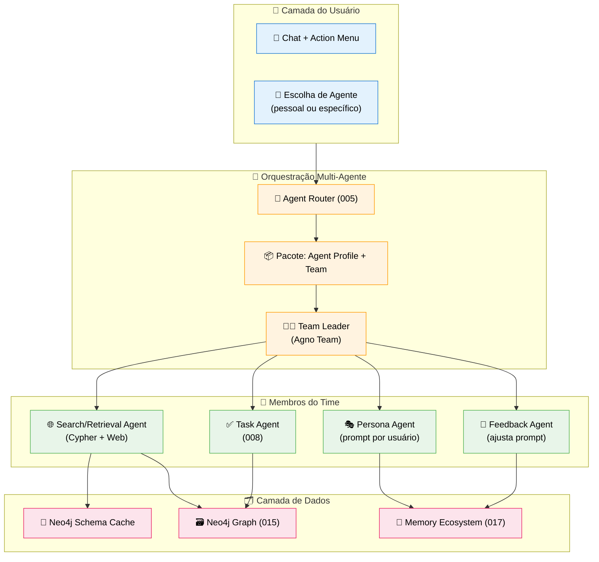
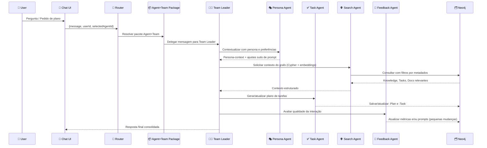

# Feature Specification: Multi-Agent Orchestration (Agno Teams)

**Feature Branch**: `019-multi-agent-orchestration`  
**Created**: 2025-12-07  
**Status**: Draft  
**Priority**: P1 (Core – Agents)  
**Source**: TRG-SPC-20251206-004 (Multi-Agent Orchestration) + chat.txt + Agno Teams docs + specs 004/005/007/008/015/017

> Ideia central: **cada agente do usuário vem em um pacote** `Agent Profile + Team`, onde o Team pode começar com 1 agente e crescer (multi-agente) ao longo do tempo, mas a interface para o usuário continua simples.

---

## Process Flow (Business View)



### Ideia de Uso

1. Usuário escolhe um **Agente Pessoal** ou **Agente Específico** (ex.: "Curador de Startup", "Planejador de Lançamento").  
2. Router (005) resolve esse agente para um **Pacote** `Agent Profile + Team`.  
3. O **Team Leader** recebe a mensagem, acessa o **Schema Cache** e decide:
   - Se precisa consultar o grafo (SearchAgent via Cypher).  
   - Se precisa criar/ajustar tarefas (TaskAgent).  
   - Se precisa ajustar gradualmente o prompt (FeedbackAgent).  
4. O resultado volta como resposta única para o Chat + atualizações em Tasks/Knowledge.

---

## Team Archetypes (no contexto do projeto)

> Observação: a doc do Agno fala de Teams com **Team Leader + members**, mas não fixa “3 tipos de Teams” nomeados. Neste projeto, definimos **3 arquétipos de Team** que serão mapeados para as configurações reais do Agno.

1. **Single-Agent Team**  
   - 1 membro apenas (o próprio agente).  
   - Usado para agentes simples ou em fase inicial.  
   - Orquestração mínima: Team Leader ≈ o próprio agente.

2. **Task-Centric Team**  
   - Focado no core atual do projeto: **tarefas e planos**.  
   - Membros típicos: `PersonaAgent`, `TaskAgent`, `FeedbackAgent`.  
   - Uso: planejamento, execução e melhoria contínua de planos.

3. **Research & Planning Team**  
   - Voltado para fluxos que combinam **busca + raciocínio + tarefas**.  
   - Membros típicos: `SearchAgent` (Cypher + web), `TaskAgent`, `PersonaAgent`.  
   - Uso: análise de contexto, benchmark, “planejar com base em informação espalhada”.

Cada agente cadastrado no Admin (003/004) escolhe 1 desses arquétipos como **tipo padrão de Team**, mas a composição real de membros é configurável (Zero Hardcode).

---

## Agent Collaboration (Sequence)



---

## User Scenarios & Testing

### User Story 1 – Pacote simples que evolui (Priority: P1)

Usuário começa com um agente pessoal simples (Single-Agent Team) que, ao longo do tempo, ganha membros de apoio (Task, Search, Feedback).

**Acceptance Scenarios**:

1. **Given** usuário cria Agente Pessoal via Admin, **When** não há Team configurado, **Then** sistema cria automaticamente um **Single-Agent Team** com um único membro.

2. **Given** agente simples em produção, **When** admin decide habilitar suporte a tarefas, **Then** pode migrar para arquétipo **Task-Centric Team** sem quebrar a interface do usuário (mesmo agente visível, Team interno muda).

3. **Given** Team atualizado, **When** usuário faz uma pergunta de planejamento, **Then** Team Leader delega parte do trabalho ao TaskAgent.

---

### User Story 2 – Orquestração para geração de plano com busca (Priority: P0 – Core)

Usuário pede um plano de ação e o Team combina busca no grafo + geração de tarefas.

**Acceptance Scenarios**:

1. **Given** knowledge e tarefas existentes no grafo, **When** usuário pede um plano ("me ajude a organizar o próximo ciclo da startup"), **Then** Router seleciona um pacote com **Research & Planning Team**.

2. **Given** Research & Planning Team ativo, **When** Team Leader analisa a pergunta, **Then** chama SearchAgent com metadados extraídos (empresa, projeto, área, horizonte de tempo).

3. **Given** SearchAgent retorna contexto (Knowledge/Tasks/Docs), **When** Team Leader delega para TaskAgent, **Then** novo plano é gerado/atualizado no Canvas (008), respeitando contexto.

---

### User Story 3 – Feedback Agent melhora prompts incrementalmente (Priority: P2)

Feedback Agent observa interações e faz micro-ajustes no prompt do agente, sem mudanças bruscas.

**Acceptance Scenarios**:

1. **Given** FeedbackAgent configurado no Team, **When** uma sequência de respostas é marcada como ruim (👎) pelo usuário, **Then** FeedbackAgent registra isso em logs apropriados (ex.: uso de `:AgentSelectionFeedback` ou outro nó de feedback de prompt).

2. **Given** padrões de erro identificados, **When** FeedbackAgent propõe ajustes, **Then** sugestões são pequenas e versionadas (ex.: nova `:PromptVersion` ligada ao `:Agent`).

3. **Given** nova versão de prompt aplicada, **When** desempenho melhora (via métricas de roteamento/feedback), **Then** admin pode ver isso no Observability Dashboard (018).

---

### User Story 4 – Ecossistema de Melhoria Contínua da Persona (Priority: P1)

FeedbackAgent age como um **ecossistema de melhoria contínua** para o **Personal Agent**: não só o texto do prompt, mas o mapeamento de persona (necessidades, habilidades, preferências, ferramentas) é refinado ao longo do tempo.

**Acceptance Scenarios**:

1. **Given** Personal Agent em uso, **When** FeedbackAgent analisa histórico recente (tarefas, perguntas, tipos de conhecimento usados), **Then** identifica necessidades recorrentes do usuário (ex.: precisa muito de planilhas, de integrações específicas, de relatórios) e propõe atualizações no mapeamento de persona.

2. **Given** proposta de melhoria de persona (ex.: adicionar novas habilidades, ajustar preferências, sugerir novos MCPs/tools ou fontes de conhecimento), **When** FeedbackAgent gera essa proposta, **Then** ela é registrada como nova versão de persona/prompt (ex.: `:PromptVersion` ou node de persona) **em estado de "proposta"**, sem sobrescrever a versão atual.

3. **Given** proposta gerada, **When** usuário recebe notificação (via Centro de Notificações) e clica, **Then** Canvas abre uma visão dedicada mostrando: persona atual vs proposta, mudanças sugeridas, novos MCPs/ferramentas sugeridos, permitindo **Aceitar**, **Rejeitar** ou **Adiar**.

4. **Given** usuário aceita a melhoria, **When** ação é aplicada, **Then** nova versão de persona/prompt é marcada como ativa, a anterior permanece no histórico (possibilidade de revert) e as mudanças passam a influenciar o comportamento do Personal Agent.

5. **Given** rotina diária/periódica configurada, **When** job de melhoria contínua roda, **Then** FeedbackAgent pode sugerir novos conteúdos para o usuário (ex.: knowledge relevante recém-ingerido, documentos estratégicos), disparando notificações ou cards no Canvas.

---

## Functional Requirements

### Packaging: Agent Profile + Team

- **REQ-MAO-001**: Cada agente configurado no Admin (003/004) DEVE possuir um `AgentProfile` e uma configuração de Team associada (`TeamConfig`).  
- **REQ-MAO-002**: `TeamConfig` DEVE indicar o arquétipo de Team (Single-Agent, Task-Centric, Research & Planning) e listar membros com `id`, `name`, `role` (seguindo recomendações do Agno Teams).

### Router → Team → Members

- **REQ-MAO-003**: Agent Router (005) DEVE resolver o `selectedAgentId` para um pacote `Agent+Team`, e executar `run` no Team (Team Leader), não diretamente no agente isolado.  
- **REQ-MAO-004**: Team Leader DEVE ter instruções que descrevem as responsabilidades de cada membro (`role`) e quando delegar para quem.  
- **REQ-MAO-005**: Team Leader PODE delegar para múltiplos membros em sequência (ex.: Persona → Search → Task → Feedback) antes de sintetizar resposta final.

### Retrieval com Cypher + Rewriter + Schema

- **REQ-MAO-006**: SearchAgent DEVE usar **Cypher** para navegar o grafo, combinando busca semântica (embeddings) com filtros por metadados (empresa, área, projeto, tipo de fonte, memória).  
- **REQ-MAO-007**: Sistema DEVE ter um componente de "Question Rewriter" que transforma pergunta natural em:  
  - Estrutura semântica (intenção, entidades, período, tipo de fonte).  
  - Query de alto nível que pode ser traduzida para Cypher.  
- **REQ-MAO-008**: Schema do Neo4j (labels, relacionamentos, índices principais) DEVE ser carregado em um **Schema Cache** na inicialização do login ou do chat, e usado pelo SearchAgent/Team Leader para montar consultas coerentes.

### Metadados Pergunta ↔ Metadados Nodes

- **REQ-MAO-009**: Rewriter DEVE extrair metadados da pergunta (empresa, área, projeto, período, tipo de documento, tipo de conhecimento) e mapeá-los para campos existentes no grafo (`company_id`, `area_id`, `project_id`, `source_type`, `created_at`, `memory_level`, `visibility`).  
- **REQ-MAO-010**: SearchAgent DEVE aplicar esses metadados como filtros em Cypher sempre que possível, reduzindo ruído na recuperação.

### Evolução Simples

- **REQ-MAO-011**: Arquitetura de Team DEVE permitir começar com Single-Agent Team e evoluir para Teams mais complexos sem mudar a interface do usuário.  
- **REQ-MAO-012**: Adição/remoção de membros no Team DEVE ser feita via configuração (não via hardcode), seguindo princípios de Zero Hardcode.

### Melhoria Contínua da Persona & Ferramentas

- **REQ-MAO-013**: FeedbackAgent, quando presente em Personal Agent Teams, DEVE tratar a **persona** como objeto estruturado (necessidades, habilidades, preferências, ferramentas sugeridas), não apenas como texto solto de prompt.  
- **REQ-MAO-014**: Alterações relevantes de persona/prompt DEVEM ser propostas inicialmente em modo "draft/proposta", com histórico de versões (ex.: `:PromptVersion` encadeadas) e opção de revert.  
- **REQ-MAO-015**: Propostas de melhoria de persona DEVEM ser apresentadas ao usuário via **Centro de Notificações** (021) e revisadas no **Canvas** em uma visão comparativa (versão atual vs proposta), permitindo aceitar/rejeitar/adiar.  
- **REQ-MAO-016**: FeedbackAgent PODE sugerir novas ferramentas/MCPs a serem ativadas para o usuário (com base nas necessidades observadas), mas a ativação DEVE ser confirmada explicitamente pelo usuário ou admin.  
- **REQ-MAO-017**: FeedbackAgent PODE rodar em rotina diária/periódica para analisar uso do sistema e sugerir novos conteúdos a estudar (knowledge, documentos, flows), gerando notificações apropriadas.

### Integração com AI Profile & Retrieval

- **REQ-MAO-018**: PersonaAgent DEVE carregar, a cada interação relevante, a `:PersonaVersion` ativa ligada ao `:AIProfile` do usuário (022) e ajustar tom/estilo de resposta e tipo de saída (plano, checklist, explicação) de acordo com `abilities` e `preferences` definidos ali.  
- **REQ-MAO-019**: SearchAgent, quando acionado em Teams pessoais, PODE usar `needs` e `abilities` do `:AIProfile` para priorizar knowledge e documentos mais alinhados ao perfil do usuário, em coordenação com as estratégias definidas no Retrieval Orchestrator (024).  
- **REQ-MAO-020**: FeedbackAgent DEVE considerar tanto padrões de uso de memória (017) quanto padrões de retrieval (logs `:RetrievalJob` de 024) ao propor novas versões de persona, garantindo que a evolução da persona reflita **o que o usuário realmente faz e busca**.

### Observability & Métricas (018)

- **REQ-MAO-021**: Execuções de Teams (Team Leader e membros) DEVEM registrar eventos em logs apropriados já definidos no projeto (ex.: `:RoutingLog`, `:AgentSelectionFeedback`), incluindo ao menos `agentId`/`teamId`, timestamp, latência e, quando aplicável, feedback do usuário, de forma que o Observability Dashboard (018) possa construir métricas por agente/time.  
- **REQ-MAO-022**: FeedbackAgent DEVE poder consumir métricas agregadas disponibilizadas via Observability (018) como insumo adicional, junto com padrões de memória (017) e outras fontes já descritas nesta spec, para decidir quando propor novas versões de persona/prompt ou ajustes em `TeamConfig`.

---

## Success Criteria

- ✅ Usuários conseguem obter planos/tarefas de qualidade sem escolher manualmente vários agentes – escolhem apenas "seu" agente.  
- ✅ Taxa de acerto de roteamento e de satisfação com respostas aumenta à medida que FeedbackAgent age (medido via Observability 018).  
- ✅ Novos agentes/membros podem ser adicionados sem reescrever fluxos de Chat/Canvas – apenas atualizando Teams e Router.

---

## Key Entities (Neo4j) – visão lógica

```cypher
// TeamConfig - configuração lógica de um Team ligado a um Agent
(:TeamConfig {
  id: string,
  agentId: string, // :Agent.id
  archetype: string, // "single" | "task_centric" | "research_planning" | etc.
  members: list<string>, // ids lógicos dos membros
  isUserSelectable: boolean, // se aparece para o usuário escolher diretamente
  runsInBackground: boolean, // se roda apenas em background
  canBeSummonedByRouter: boolean, // se pode ser convocado pelo roteador acima dos Teams
  createdAt: datetime,
  updatedAt: datetime
})

(:Agent)-[:HAS_TEAM]->(:TeamConfig)
```

Notas:
- Membros concretos (TaskAgent, SearchAgent, etc.) já são modelados como `:Agent` (spec 015) e ligados via configuração, não precisamos replicar isso no grafo em detalhes nesta spec.

### Tipos de Team quanto a visibilidade/uso

- **Personal Agent Team**: `isUserSelectable=true`, `runsInBackground=false`.  
  - Escolhido diretamente pelo usuário no chat.  
  - **FeedbackAgent é padrão** neste tipo de Team (sempre presente para aprender com o uso).  
- **User-Selectable Utility Team** (ex.: um research avançado): `isUserSelectable=true`, `runsInBackground=true`, `canBeSummonedByRouter=true`.  
  - Usuário pode escolher explicitamente, mas o Router também pode convocar em segundo plano.  
- **Background-Only Team** (ex.: Curator Team, Validation/Health Team): `isUserSelectable=false`, `runsInBackground=true`, `canBeSummonedByRouter=true`.  
  - Nunca aparece na lista do usuário, mas pode ser chamado pelo Router/Team Router para resolver necessidades específicas (curadoria, limpeza, pesquisa profunda).

Um **Team Router** lógico (camada acima do Agent Router) decide, para cada interação:
- Qual **Personal Agent Team** responde diretamente.  
- Quais **background teams** (Curator, Research & Planning, etc.) serão convocados em paralelo ou em etapas para complementar a resposta (ex.: pesquisar mais fundo, validar dados, ajustar plano).

---

## Assumptions

1. Agno Teams serão utilizados apenas como **runtime de orquestração**, enquanto o grafo Neo4j e o Memory Ecosystem (017) são a fonte de verdade de conhecimento/memória.  
2. Os "3 tipos de Team" citados para Agno são mapeados aqui como arquétipos de projeto – nomes exatos/mapeamento para a API do Agno serão detalhados no plano técnico.  
3. Performance de Teams (latência, custos de modelo) será monitorada via Observability (018) antes de ativar orquestrações mais pesadas por padrão.

---

## Related Specs

- **004-user-agent-factory** – criação de perfis de agentes e ligação com TeamConfig.  
- **005-agent-router** – resolve qual pacote Agent+Team responderá à interação.  
- **007-chat-knowledge-capture** – chat é porta de entrada para multi-agente.  
- **008-task-generation-canvas** – TaskAgent é membro crítico dos Teams orientados a tarefas.  
- **010-data-filtration**, **017-memory-ecosystem** – níveis de memória e caducidade influenciam retrieval.  
- **014-provenance-system**, **015-neo4j-graph-model** – definem dados usados na orquestração.  
- **018-observability-dashboard** – consolida métricas de roteamento/agents para acompanhar desempenho dos Teams.

