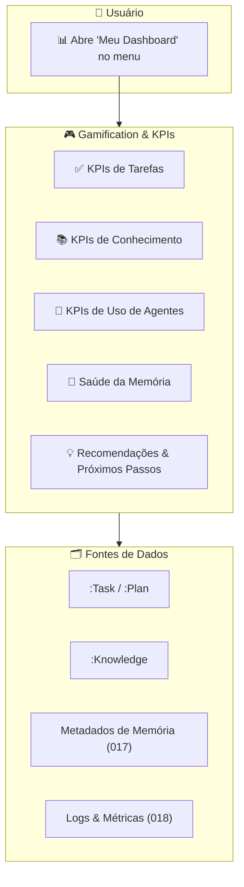
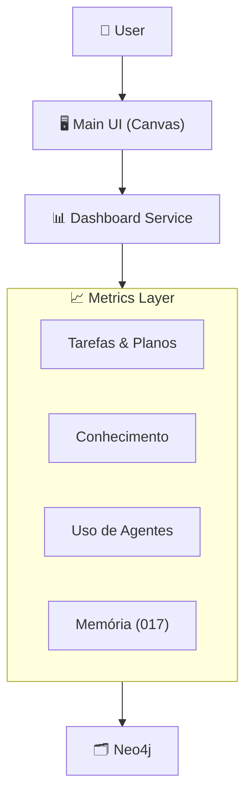

# Feature Specification: Gamification & User KPIs Dashboard

**Feature Branch**: `020-gamification-user-kpis`  
**Created**: 2025-12-07  
**Status**: Draft  
**Priority**: P2 (Core Experience)  
**Source**: triage (gamificação, KPIs) + chat.txt + specs 008/015/017/018

## Purpose

Criar um **dashboard pessoal** que mostre ao usuário:
- Se ele está **interagindo bem** com o sistema.  
- Se o seu **ecossistema de conhecimento/tarefas** está saudável.  
- Recomendações de melhoria contínua para seu **Personal Agent** e seu uso do sistema.

Esse dashboard aparece no **Canvas central** quando o usuário seleciona "Gamificação" / "Meu Dashboard" no menu.

---

## Process Flow (Business View)

### Principais KPIs (exemplos)

- **Tarefas**: tarefas criadas, concluídas, atrasadas; taxa de conclusão; tempo médio para concluir.  
- **Conhecimento**: knowledge criado, validado, usado em respostas/planos; proporção Real vs Passageiro.  
- **Uso de Agentes**: quais agentes/Teams mais usados; uso do Personal Agent; ações proativas.  
- **Memória**: distribuição short/medium/long; items prestes a expirar; knowledge obsoleto.

Recomendações aparecem como **"Próximos Passos"** (ex.: "revise estas tarefas atrasadas", "valide estes conhecimentos", "ative MCP X para melhorar seu fluxo").

---

## Agent Collaboration

- **Dashboard Service**: agrega métricas a partir de nós existentes (`:Task`, `:Plan`, `:Knowledge`, `:RoutingLog`, `:MemoryDecayJob`, etc.).  
- **Personal Improvement/Feedback Agent** (ver 019): pode usar esses KPIs para sugerir melhorias e disparar notificações.

---

## User Scenarios & Testing

### User Story 1 – Ver Saúde de Tarefas (Priority: P1)

Usuário quer saber se está "em dia" com as tarefas.

**Acceptance Scenarios**:

1. **Given** tarefas registradas no grafo, **When** usuário abre "Meu Dashboard", **Then** Canvas mostra KPIs básicos: tarefas concluídas, abertas, atrasadas, conclusão em %.

2. **Given** tarefas atrasadas, **When** usuário clica em um KPI (ex.: "Tarefas atrasadas"), **Then** Canvas muda para visão de lista/board de tarefas filtradas.

---

### User Story 2 – Ver Saúde do Conhecimento (Priority: P1)

Usuário quer saber se está alimentando bem o sistema com conhecimento útil.

**Acceptance Scenarios**:

1. **Given** knowledge capturado (007), **When** usuário abre dashboard, **Then** vê contagem de knowledge criados, validados, usados em planos/respostas.

2. **Given** knowledge nunca usado, **When** dashboard detecta isso, **Then** apresenta recomendação "Revisar conhecimento não usado" com link para Canvas mostrar esses items.

---

### User Story 3 – Indicadores de Memória (Priority: P2)

Usuário quer ver se sua memória está "organizada".

**Acceptance Scenarios**:

1. **Given** campos `memory_level` e `expires_at` preenchidos (017), **When** dashboard é aberto, **Then** mostra gráficos simples: quantos items em short/medium/long, quantos expiram em breve.

2. **Given** muitos items short prestes a expirar, **When** dashboard detecta, **Then** recomenda ações ("Promover o que é importante", "limpar ruído"), com CTA que abre Canvas com lista correspondente.

---

## Functional Requirements

- **REQ-GAM-001**: Dashboard DEVE ser acessível via item de menu ("Gamificação" ou "Meu Dashboard") e renderizado no **Canvas central** (016).  
- **REQ-GAM-002**: KPIs DEVEM ser computados a partir de Neo4j usando agregações, sem duplicar dados.  
- **REQ-GAM-003**: Dashboard DEVE permitir que o usuário clique em um KPI para "abrir" a visão correspondente no Canvas (tarefas, knowledge, etc.).  
- **REQ-GAM-004**: Dashboard PODE integrar com o Feedback/Personal Improvement Agent (019) para sugerir ações de melhoria contínua (ex.: ativar MCPs, revisar prompts, aprender novos conteúdos).  
- **REQ-GAM-005**: Recomendações importantes DEVEM poder gerar **notificações** (ver spec de Notification Center) para o usuário.

---

## Success Criteria

- ✅ Usuário entende rapidamente se está "bem" em tarefas, conhecimento, memória e uso do sistema.  
- ✅ Ações sugeridas pelo dashboard levam a melhorias observáveis (mais tarefas concluídas, menos conhecimento obsoleto).  
- ✅ Dashboard é usado como ponto de partida para autogestão (o usuário volta a ele espontaneamente).

---

## Related Specs

- **008-task-generation-canvas** – tarefas e planos que abastecem KPIs.  
- **015-neo4j-graph-model** – estrutura dos dados usados nos KPIs.  
- **017-memory-ecosystem** – dados de memória e caducidade.  
- **018-observability-dashboard** – visões para admin; aqui focamos no usuário final.  
- **019-multi-agent-orchestration** – Feedback/Personal Improvement Agent pode consumir esses KPIs para sugerir melhorias.
