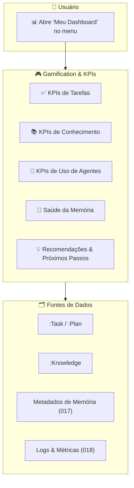
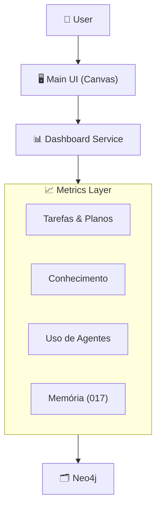
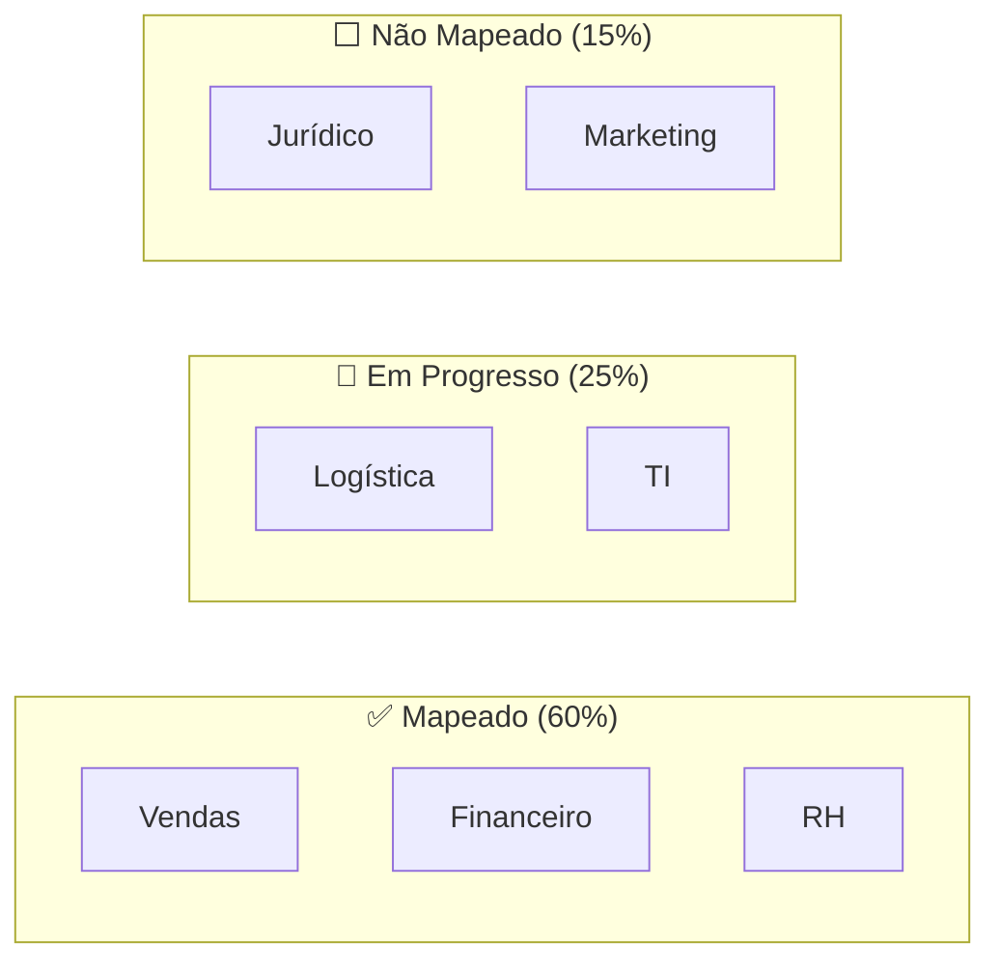

# Feature Specification: Incentivo por Ressonância & User KPIs Dashboard

**Feature Branch**: `020-gamification-user-kpis`  
**Created**: 2025-12-07  
**Updated**: 2025-01-19 (Reorientado para Incentivo por Ressonância)  
**Status**: Draft  
**Priority**: P2 (Core Experience)  
**Source**: triage (gamificação, KPIs) + chat02_08 (Ressonância) + specs 008/015/017/018

## Purpose

Criar um sistema de **incentivo por ressonância** que mostre ao usuário:
- O **impacto estrutural** de suas contribuições no grafo.  
- Como seu conhecimento está sendo **reutilizado** por outros.  
- Notificações semânticas quando algo relacionado ao seu domínio acontece.

> *"Não mostrar gamificação pro usuário, mas mostrar que a cada mapeamento, cada input que cite a área dele, aquilo seja notificação para outro usuário. Você vai montando sentido."*

### Por que Ressonância, não Gamificação Clássica?

| Gamificação Clássica | Incentivo por Ressonância |
|---------------------|---------------------------|
| Pontos e rankings | Impacto estrutural visível |
| Competição | Colaboração orgânica |
| Recompensas extrínsecas | Reconhecimento semântico |
| Pode gerar ruído (volume) | Foco em qualidade e conexões |
| Superficial | Profundo e significativo |

Esse dashboard aparece no **Canvas central** quando o usuário seleciona "Meu Dashboard" no menu.

---

## Process Flow (Business View)



### Principais KPIs (exemplos)

- **Tarefas**: tarefas criadas, concluídas, atrasadas; taxa de conclusão; tempo médio para concluir.  
- **Conhecimento**: knowledge criado, validado, usado em respostas/planos; proporção Real vs Passageiro.  
- **Uso de Agentes**: quais agentes/Teams mais usados; uso do Personal Agent; ações proativas.  
- **Memória**: distribuição short/medium/long; items prestes a expirar; knowledge obsoleto.

Recomendações aparecem como **"Próximos Passos"** (ex.: "revise estas tarefas atrasadas", "valide estes conhecimentos", "ative MCP X para melhorar seu fluxo").

---

## Agent Collaboration



- **Dashboard Service**: agrega métricas a partir de nós existentes (`:Task`, `:Plan`, `:Knowledge`, `:RoutingLog`, `:MemoryDecayJob`, etc.).  
- **Personal Improvement/Feedback Agent** (ver 019): pode usar esses KPIs para sugerir melhorias e disparar notificações.

---

## User Scenarios & Testing

### User Story 1 – Ver Saúde de Tarefas (Priority: P1)

Usuário quer saber se está "em dia" com as tarefas.

**Acceptance Scenarios**:

1. **Given** tarefas registradas no grafo, **When** usuário abre "Meu Dashboard", **Then** Canvas mostra KPIs básicos: tarefas concluídas, abertas, atrasadas, conclusão em %.

2. **Given** tarefas atrasadas, **When** usuário clica em um KPI (ex.: "Tarefas atrasadas"), **Then** Canvas muda para visão de lista/board de tarefas filtradas.

---

### User Story 2 – Ver Saúde do Conhecimento (Priority: P1)

Usuário quer saber se está alimentando bem o sistema com conhecimento útil.

**Acceptance Scenarios**:

1. **Given** knowledge capturado (007), **When** usuário abre dashboard, **Then** vê contagem de knowledge criados, validados, usados em planos/respostas.

2. **Given** knowledge nunca usado, **When** dashboard detecta isso, **Then** apresenta recomendação "Revisar conhecimento não usado" com link para Canvas mostrar esses items.

---

### User Story 3 – Indicadores de Memória (Priority: P2)

Usuário quer ver se sua memória está "organizada".

**Acceptance Scenarios**:

1. **Given** campos `memory_level` e `expires_at` preenchidos (017), **When** dashboard é aberto, **Then** mostra gráficos simples: quantos items em short/medium/long, quantos expiram em breve.

2. **Given** muitos items short prestes a expirar, **When** dashboard detecta, **Then** recomenda ações ("Promover o que é importante", "limpar ruído"), com CTA que abre Canvas com lista correspondente.

---

## Functional Requirements

- **REQ-GAM-001**: Dashboard DEVE ser acessível via item de menu ("Gamificação" ou "Meu Dashboard") e renderizado no **Canvas central** (016).  
- **REQ-GAM-002**: KPIs DEVEM ser computados a partir de Neo4j usando agregações, sem duplicar dados.  
- **REQ-GAM-003**: Dashboard DEVE permitir que o usuário clique em um KPI para "abrir" a visão correspondente no Canvas (tarefas, knowledge, etc.).  
- **REQ-GAM-004**: Dashboard PODE integrar com o Feedback/Personal Improvement Agent (019) para sugerir ações de melhoria contínua (ex.: ativar MCPs, revisar prompts, aprender novos conteúdos).  
- **REQ-GAM-005**: Recomendações importantes DEVEM poder gerar **notificações** (ver spec de Notification Center) para o usuário.

---

## Success Criteria

- ✅ Usuário entende rapidamente se está "bem" em tarefas, conhecimento, memória e uso do sistema.  
- ✅ Ações sugeridas pelo dashboard levam a melhorias observáveis (mais tarefas concluídas, menos conhecimento obsoleto).  
- ✅ Dashboard é usado como ponto de partida para autogestão (o usuário volta a ele espontaneamente).

---

## Incentivo por Ressonância (Novo)

O sistema de ressonância substitui a gamificação clássica por um modelo de **reconhecimento estrutural**.

### Conceito de Ressonância

> *"Mostrar que a cada mapeamento, cada input de outro usuário que cite a área dele, aquilo seja notificação para outro usuário. Você vai montando sentido. É uma forma de incentivar sem falar que está gamificando."*

A ressonância acontece quando:

1. **Seu conhecimento é reutilizado**: Alguém referencia/usa seu mapeamento
2. **Seu domínio é mencionado**: Novo conhecimento relacionado à sua área
3. **Seu processo se conecta**: Mapeamento de outro fecha conexão com o seu
4. **Sua contribuição consolida**: Conceito que você criou é validado/consolidado

### Notificações Semânticas

Em vez de "você ganhou 10 pontos", o usuário recebe notificações como:

- *"Seu mapeamento do processo de Contas a Pagar foi citado por 3 colegas"*
- *"O conceito 'Aprovação de NF' que você criou agora conecta 5 departamentos"*
- *"Maria do Comercial mapeou algo relacionado ao seu fluxo de Faturamento"*
- *"Seu conhecimento sobre LGPD foi usado em 12 respostas esta semana"*

---

## 💎 Notificação como Sinal Semântico (Conceito Core)

> **Este é um dos conceitos mais importantes do EKS.**

A notificação no EKS **não é operacional** ("faça isso").  
Ela é **epistemológica** ("algo relacionado ao seu domínio aconteceu").

### A Diferença Fundamental

| Notificação Tradicional | Notificação Semântica (EKS) |
|------------------------|----------------------------|
| "Você tem 3 tarefas pendentes" | "Um novo mapeamento citou sua área" |
| "Aprovação necessária" | "Um fluxo relacionado ao seu papel foi refinado" |
| "Deadline em 2 dias" | "Uma decisão recorrente que você descreveu apareceu em outro contexto" |
| "Nova mensagem de João" | "Um conceito que você usa foi reutilizado em outro processo" |

### O que isso comunica

A notificação semântica transmite uma mensagem clara ao colaborador:

> **"Seu modelo mental não é isolado. Ele está se conectando."**

Isso cria:
- **Senso de pertencimento estrutural** - não social
- **Validação epistemológica** - seu conhecimento tem impacto real
- **Motivação intrínseca** - ver conexões emergindo naturalmente
- **Consciência distribuída** - a empresa pensando junto

### Eventos Notificáveis (Epistemológicos)

```yaml
connection_events:
  - type: "area_citation"
    message: "Um novo mapeamento citou sua área"
    trigger: "Outro usuário criou conhecimento que referencia departamento/processo do usuário"
    
  - type: "flow_refinement"
    message: "Um fluxo relacionado ao seu papel foi refinado"
    trigger: "Processo conectado ao usuário foi atualizado/expandido"
    
  - type: "pattern_reuse"
    message: "Uma decisão recorrente que você descreveu apareceu em outro contexto"
    trigger: "Claim/Decision do usuário foi citado em outro domínio"
    
  - type: "concept_propagation"
    message: "Um conceito que você usa foi reutilizado em outro processo"
    trigger: "Conceito criado/usado pelo usuário aparece em novo contexto"

consolidation_events:
  - type: "knowledge_validated"
    message: "Seu conhecimento sobre X foi validado por múltiplas fontes"
    trigger: "Conhecimento atinge threshold de confirmações"
    
  - type: "semantic_convergence"
    message: "Seu mapeamento convergiu com o de [Nome] - vocês pensam parecido"
    trigger: "Dois mapeamentos independentes se conectam semanticamente"
```

### Modelo de Dados

```cypher
// Evento de Sinal Semântico
(:SemanticSignal {
  id: string,
  signal_type: string,  // "connection" | "consolidation" | "propagation" | "convergence"
  recipient_id: string, // Quem recebe o sinal
  message: string,      // Texto epistemológico (não imperativo)
  
  // Contexto semântico
  domain_affected: string,      // Área/processo do recipiente que foi tocado
  connection_source_id: string, // O que disparou a conexão
  connection_target_id: string, // O que foi conectado
  
  // Metadados
  significance_score: float,    // Quão significativa é a conexão (0.0-1.0)
  is_first_connection: boolean, // Primeira vez que esse tipo de conexão acontece?
  
  created_at: datetime,
  viewed_at: datetime,
  acknowledged: boolean
})

// Relacionamentos
(:User)-[:RECEIVED_SIGNAL]->(:SemanticSignal)
(:SemanticSignal)-[:CONNECTS]->(:Knowledge|:Process|:Concept)
(:SemanticSignal)-[:ORIGINATED_FROM]->(:User|:System)
```

### Requisitos do Sinal Semântico

- **REQ-SIG-001**: Notificações DEVEM ser epistemológicas ("algo aconteceu no seu domínio"), NÃO operacionais ("faça algo")
- **REQ-SIG-002**: Notificações DEVEM comunicar conexão, não obrigação
- **REQ-SIG-003**: Sistema DEVE detectar quando modelos mentais de diferentes usuários se conectam
- **REQ-SIG-004**: Notificações DEVEM ter `significance_score` para evitar ruído
- **REQ-SIG-005**: Sistema DEVE destacar "primeiras conexões" como eventos especiais

### Por que isso funciona

O colaborador não é pressionado a agir.  
Ele é **informado** de que seu conhecimento está **vivo** no sistema.

Isso cria um ciclo virtuoso:
1. Colaborador contribui conhecimento
2. Sistema detecta conexões emergentes
3. Colaborador recebe sinal semântico
4. Colaborador percebe que não está isolado
5. Colaborador contribui mais (motivação intrínseca)

> **"O EKS não gamifica contribuição. Ele revela conexão."**

### Modelo de Dados de Ressonância

```cypher
(:ResonanceEvent {
  id: string,
  event_type: string,       // "reuse" | "mention" | "connection" | "consolidation"
  source_user_id: string,   // Quem recebe a notificação
  trigger_user_id: string,  // Quem disparou (opcional, pode ser sistema)
  content_id: string,       // Knowledge/Process/Claim que ressoou
  description: string,      // Texto descritivo para notificação
  impact_score: float,      // Magnitude da ressonância (0.0-1.0)
  created_at: datetime,
  notified: boolean
})

(:User)-[:RESONATED_WITH]->(:ResonanceEvent)
(:ResonanceEvent)-[:ABOUT]->(:Knowledge|:Process|:Concept)
```

### Fluxo de Ressonância

```mermaid
flowchart TD
    Contribution[Usuário A contribui conhecimento]
    Detect[Sistema detecta conexões]
    CheckResonance{Ressoa com<br/>alguém?}
    CreateEvent[Criar ResonanceEvent]
    Notify[Notificar usuário(s) afetado(s)]
    Dashboard[Atualizar Dashboard de Ressonância]
    
    Contribution --> Detect
    Detect --> CheckResonance
    CheckResonance -->|Sim| CreateEvent
    CheckResonance -->|Não| End[Fim]
    CreateEvent --> Notify
    CreateEvent --> Dashboard
```

### Requisitos de Ressonância

- **REQ-RES-001**: Sistema DEVE detectar quando conhecimento de um usuário é reutilizado
- **REQ-RES-002**: Sistema DEVE notificar usuários quando seu domínio é mencionado
- **REQ-RES-003**: Notificações DEVEM ser semânticas, não numéricas (não "10 pontos")
- **REQ-RES-004**: Dashboard DEVE mostrar impacto estrutural, não ranking
- **REQ-RES-005**: Sistema DEVE detectar quando mapeamentos de diferentes usuários se conectam

---

## Seleção Semântica Natural

O sistema implementa **seleção semântica natural**: contribuições de qualidade ganham peso automaticamente.

### Princípios

1. **Reutilização aumenta peso**: Conhecimento citado/usado ganha `relevance_score`
2. **Conceitos isolados perdem relevância**: Sem conexões, decai naturalmente
3. **Sem bloqueio prévio**: Sistema não impede contribuição, autorregula depois
4. **Qualidade emerge**: Conceitos bons sobrevivem, ruins desaparecem

### Métricas de Impacto Estrutural

| Métrica | Descrição | Cálculo |
|---------|-----------|---------|
| `reuse_count` | Quantas vezes o conhecimento foi usado | Count de `:USED_SOURCE` |
| `connection_depth` | Quão profundo está no grafo | Avg de hops até raiz |
| `cross_dept_reach` | Quantos departamentos alcança | Count de depts conectados |
| `consolidation_rate` | Taxa de validação | Validated / Total |

```cypher
// Calcular impacto estrutural de conhecimento de um usuário
MATCH (u:User {id: $userId})-[:CREATED]->(k:Knowledge)
OPTIONAL MATCH (k)<-[:USED_SOURCE]-(a:Answer)
OPTIONAL MATCH (k)-[:RELATES_TO*1..3]->(:Department)
WITH u, k,
  count(DISTINCT a) AS reuse_count,
  size((k)-[]-()) AS connections
RETURN k.id, k.content,
  reuse_count,
  connections,
  CASE 
    WHEN reuse_count > 5 AND connections > 3 THEN "high_impact"
    WHEN reuse_count > 2 OR connections > 2 THEN "medium_impact"
    ELSE "building"
  END AS impact_level
```

---

## Dashboard de Ressonância

### Visão do Usuário

Em vez de pontos e rankings, o dashboard mostra:

```
┌─────────────────────────────────────────────────────────────┐
│  🌊 Sua Ressonância no EKS                                  │
├─────────────────────────────────────────────────────────────┤
│                                                             │
│  📊 Seu Conhecimento Impacta                                │
│  ├── 23 respostas usaram seu conteúdo esta semana          │
│  ├── 5 departamentos alcançados                             │
│  └── 3 processos conectados ao seu mapeamento               │
│                                                             │
│  🔔 Ressonâncias Recentes                                   │
│  ├── Maria citou seu processo de Faturamento                │
│  ├── Conceito "Aprovação NF" consolidado (4 fontes)         │
│  └── João conectou seu fluxo ao Financeiro                  │
│                                                             │
│  📈 Evolução do Impacto                                     │
│  [gráfico de conexões ao longo do tempo]                    │
│                                                             │
│  🎯 Oportunidades de Conexão                                │
│  ├── Seu processo de Vendas pode conectar com Logística     │
│  └── Conhecimento sobre Cliente X pode ajudar Suporte       │
│                                                             │
└─────────────────────────────────────────────────────────────┘
```

### Requisitos do Dashboard

- **REQ-RES-006**: Dashboard DEVE mostrar impacto em termos de conexões, não pontos
- **REQ-RES-007**: Dashboard DEVE listar ressonâncias recentes com contexto
- **REQ-RES-008**: Dashboard DEVE sugerir oportunidades de conexão (não obrigações)
- **REQ-RES-009**: Dashboard NÃO DEVE exibir rankings competitivos entre usuários
- **REQ-RES-010**: Dashboard PODE mostrar evolução temporal do impacto

---

## Cobertura de Macroprocessos

O sistema mostra visualmente o **progresso do mapeamento** organizacional.

### Visualização de Cobertura



### Requisitos de Cobertura

- **REQ-RES-011**: Sistema DEVE calcular % de cobertura de macroprocessos
- **REQ-RES-012**: Dashboard DEVE mostrar progresso visual de mapeamento
- **REQ-RES-013**: Contribuição para áreas não mapeadas DEVE gerar maior ressonância

---

## Gamificação para Tarefas (Fase Posterior)

> *"A gamificação é finita, até que tudo esteja mapeado. Posteriormente a gamificação poderia migrar para tarefas e projetos."*

Após a fase de mapeamento, o incentivo pode migrar para:

- Conclusão de tarefas
- Projetos entregues
- Refinamento de conteúdo
- Validação de qualidade

Isso é uma **evolução natural**, não uma substituição.

---

---

## Consolidação com Labels Canônicos

A ressonância é calculada sobre relações no grafo. Usar labels canônicos:

| Conceito | Label | Relacionamento Relevante |
|----------|-------|-------------------------|
| Conhecimento do usuário | `:Knowledge` | `[:CREATED]` |
| Reutilização | `:Answer` | `[:USED_SOURCE]` |
| Conexões de processo | `:Process` | `[:DESCRIBES_STEP]`, `[:EXECUTES]` |
| Departamentos | `:Department` | `[:IN_DEPARTMENT]` |
| Eventos de ressonância | `:ResonanceEvent` | Definido nesta spec |

---

## Related Specs

- **008-task-generation-canvas** – tarefas e planos que abastecem KPIs.  
- **015-neo4j-graph-model** – labels canônicos e pesos em relacionamentos.  
- **017-memory-ecosystem** – dados de memória e caducidade.  
- **018-observability-dashboard** – visões para admin; aqui focamos no usuário final.  
- **019-multi-agent-orchestration** – Feedback/Personal Improvement Agent pode consumir esses KPIs para sugerir melhorias.
- **021-notification-center** – Onde notificações semânticas aparecem.
- **022-onboarding-ai-profile** – Nível 2 gera conhecimento que ressoa.
- **050-meta-graph-schema** – Labels canônicos.
