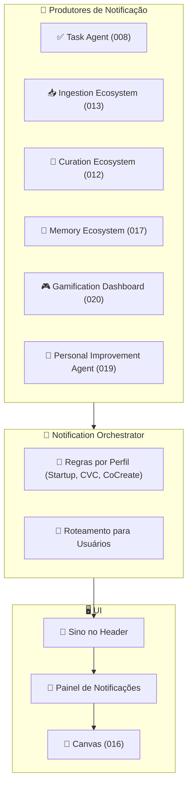

# Feature Specification: Notification Center

**Feature Branch**: `021-notification-center`  
**Created**: 2025-12-07  
**Status**: Draft  
**Priority**: P2 (Core Experience)  
**Source**: triage (notificações, proatividade) + chat.txt + specs 008/012/013/017/018/020

## Purpose

Criar um **Centro de Notificações** unificado para o usuário:
- Ícone de sino no **header** da interface.  
- Lista de notificações clicáveis, cada uma abrindo o contexto correto no **Canvas**.  
- Separação por perfis (Startup, CoCreateAI, CVC/mentores), cada um com tipo de notificação adequado.

---

## Layout & UX

- **Sino no header** (topo direito).  
- Ao clicar:
  - Abre **painel lateral** ou dropdown com lista de notificações.  
  - Cada item mostra: ícone + título + resumo + data/hora + CTA principal ("Ver no Canvas").
- Notificações **não bloqueiam** o usuário; são informativas e acionáveis.

### Tipos de Notificação (exemplos)

- **Tarefas**: tarefas do dia, tarefas atrasadas, novas tarefas atribuídas ao usuário.  
- **Conhecimento/Documentos**: novos documentos relevantes ingeridos, novos knowledge importantes.  
- **Gamificação/KPIs**: alertas de saúde do sistema pessoal, conquistas, recomendações de melhoria.  
- **Curadoria/Ingestão**: problemas em documentos submetidos pelo usuário (erro Docling, curadoria pendente).  
- **Personal Improvement**: sugestões do Feedback/Personal Agent (ex.: ajustar persona, habilitar novo MCP, estudar conteúdo sugerido).

---

## Process Flow (Business View)



---

## User Scenarios & Testing

### User Story 1 – Tarefas do Dia (Priority: P1)

Usuário quer ver rapidamente as tarefas que precisa cuidar hoje.

**Acceptance Scenarios**:

1. **Given** tarefas com prazo para hoje ou atrasadas, **When** usuário abre o Centro de Notificações, **Then** vê uma seção "Tarefas do dia" com essas tarefas listadas.

2. **Given** usuário clica em uma notificação de tarefa, **When** ação é executada, **Then** Canvas muda para visão de tarefas, com a tarefa em questão destacada.

---

### User Story 2 – Notificações por Perfil (Startup vs CVC) (Priority: P2)

Startups e mentores CVC recebem tipos de notificações diferentes.

**Acceptance Scenarios**:

1. **Given** usuário é fundador de startup, **When** novos documentos/knowledge sobre sua startup são ingeridos, **Then** recebe notificações relevantes ("Novo documento X disponível", "Novo insight Y gerado").

2. **Given** usuário é mentor CVC, **When** uma startup sob sua mentoria cria novo plano ou documento importante, **Then** recebe notificação voltada ao papel de mentor ("Startup Z atualizou o plano de ação").

---

### User Story 3 – Recomendações Proativas (Priority: P2)

O sistema envia sugestões proativas (perguntas, revisões, melhorias de persona).

**Acceptance Scenarios**:

1. **Given** Personal Improvement Agent detecta que persona/prompt do usuário pode ser melhorado, **When** gera proposta de ajuste, **Then** aparece uma notificação "Sugerimos melhorar sua persona".

2. **Given** usuário clica na notificação, **When** Canvas abre, **Then** vê os detalhes da proposta (ex.: nova versão de persona/prompt, novos MCPs sugeridos) e pode **aceitar, rejeitar ou adiar**.

3. **Given** usuário aceita, **When** ação é aplicada, **Then** nova configuração é registrada (ex.: nova `:PromptVersion`) e mudança é rastreável.

---

## Functional Requirements

- **REQ-NOTIF-001**: Centro de Notificações DEVE ser acessível via ícone de sino no header e abrir lista de notificações recentes.  
- **REQ-NOTIF-002**: Cada notificação DEVE ter tipo, título, mensagem curta, timestamp, referência ao objeto (Task, Knowledge, Document, Plan, Persona, etc.) e um CTA principal.  
- **REQ-NOTIF-003**: Ao clicar em uma notificação, **Canvas** DEVE abrir a visão correspondente (tarefas, documento, dashboard, etc.).  
- **REQ-NOTIF-004**: Notification Orchestrator DEVE aplicar regras de perfil (Startup, CVC, CoCreateAI) para decidir quais notificações cada usuário recebe.  
- **REQ-NOTIF-005**: Notificações DEVE estar conectadas ao Gamification Dashboard (020) e ao Personal Improvement Agent (019) para reforçar melhorias contínuas.

---

## Key Entities (Neo4j)

```cypher
(:Notification {
  id: string,
  type: string, // "task", "knowledge", "gamification", "curation", "personal_improvement", etc.
  title: string,
  message: string,
  severity: string, // "info" | "warning" | "critical"
  entityType: string, // "Task", "Plan", "Knowledge", "Document", "Persona", etc.
  entityId: string,
  profileScope: string, // "startup", "cvc", "cocreate", "all"
  createdAt: datetime,
  readAt: datetime
})

(:User)-[:HAS_NOTIFICATION]->(:Notification)
```

---

## Related Specs

- **008-task-generation-canvas** – origem de notificações de tarefas.  
- **012-graph-curation-ecosystem**, **013-ingestion-ecosystem** – origem de notificações de ingestão/curadoria.  
- **017-memory-ecosystem** – pode gerar alertas de expiração de memória.  
- **018-observability-dashboard** – base para alguns alertas técnicos.  
- **019-multi-agent-orchestration** – Personal Improvement/Feedback Agent como produtor de notificações.  
- **020-gamification-user-kpis** – métricas que podem virar notificações.
