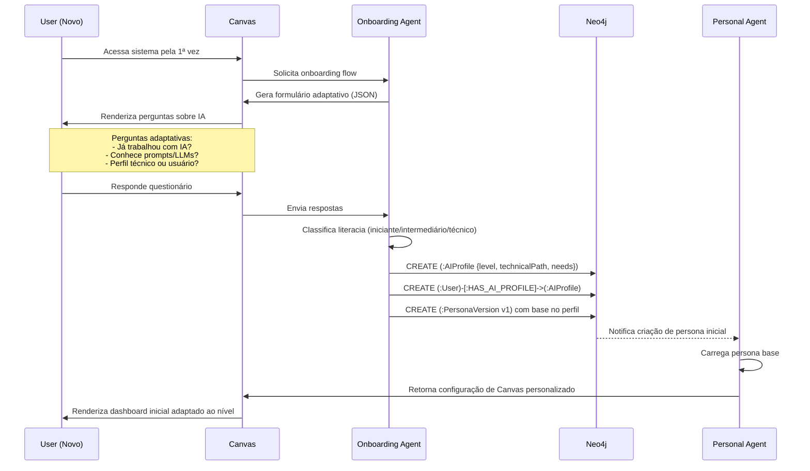
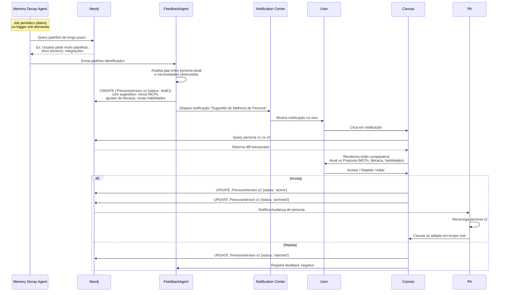
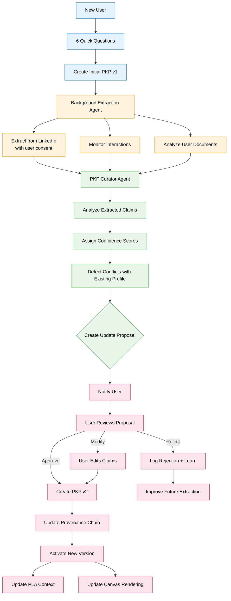
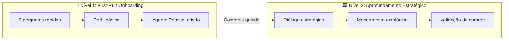

# Spec 022 – Persona Knowledge Profile (PKP) & Onboarding

**Feature Branch**: `022-onboarding-ai-profile`  
**Created**: 2025-12-07  
**Updated**: 2025-12-29 (Refined to PKP architecture)  
**Status**: Draft  
**Priority**: P0 (Foundation)  
**Source**: TRG-SPC-20251206-012 + Chat insights (chat011, chat012) + PKP architectural pattern

## Context & Purpose

The **Persona Knowledge Profile (PKP)** extends the simple AI Profile into a comprehensive, progressively built user model with provenance tracking. PKP is not just onboarding - it's **continuous profiling** that evolves with every interaction.

### Evolution: AI Profile → PKP

**Original AI Profile (Simple)**:
- One-time onboarding questionnaire → AI literacy level (Iniciante/Intermediário/Técnico) → Static profile

**PKP (Sophisticated)**:
- 6 quick questions (initial) → Continuous background extraction (LinkedIn, interactions, documents) → Curator Agent proposes updates → User reviews & validates → Versioned profile with provenance per claim → Confidence scores → Link to BIG objectives

PKP enables:
- **Progressive Profiling** - Profile builds over time, not just at onboarding
- **Provenance per Claim** - Every profile attribute has source: user input, LinkedIn, observed behavior, inferred
- **Confidence Scores** - Each claim has confidence (0.0-1.0) based on source quality and corroboration
- **User Control** - User reviews and approves AI-suggested profile updates
- **Versioning** - Profile evolves with full history and rollback capability
- **Objective Alignment** - Profile links to user's current objectives from BIG

The PKP integrates with:
- **BIG (Business Intent Graph)** - User's role determines which objectives are relevant
- **PLA (Personal Lead Agent)** - Uses PKP to personalize routing and responses
- **Canvas** - Adapts UI in real-time based on PKP (literacy level, preferences, tools)
- **Memory Decay Agent** - Identifies long-term patterns to suggest profile updates

### PKP Components

1. **Initial Profile (6 Quick Questions)** - Fast onboarding, minimal friction
2. **Background Extraction** - Continuous extraction from LinkedIn, documents, interactions
3. **Curator Agent** - Proposes profile updates with confidence scores
4. **User Review Workflow** - User validates/rejects/modifies suggestions
5. **Provenance Tracking** - Every claim has source + confidence + validation history
6. **Versioning** - Profile versions with [:SUPERSEDES] relationships

---

## Original System (Preserved for Compatibility)

O **Onboarding & AI Profile** é o sistema de avaliação inicial e contínua do nível de literacia em IA do usuário e seu "caminho" (técnico vs usuário comum), **levando em conta o tipo de organização e papel da pessoa** (CoCreate, CVC, Startup). Esse perfil é gravado no grafo, alimenta a persona do Personal Agent (019), e faz o Canvas (016) se adaptar **em tempo real em produção** para renderizar:

- **Formulários adaptativos** gerados por agentes, validados como JSON.
- **Flows personalizados** (guias, tutoriais, dashboards) de acordo com o nível de IA do usuário.
- **Visão de Persona** completa: literacia, ferramentas ativas, histórico de evolução, sugestões pendentes.

O sistema se auto-aperfeiçoa continuamente via colaboração entre:
- **Memory Decay Agent (017)**: Identifica padrões de uso de longo prazo.
- **FeedbackAgent (019)**: Propõe atualizações na persona/ferramentas.
- **Onboarding Agent**: Avalia literacia inicial e constrói o perfil base.

---

## High-Level View

```mermaid
flowchart TD
    A[Novo Usuário] -->|Acessa sistema| B[Onboarding Agent]
    B -->|Apresenta formulário adaptativo| C[Canvas: Onboarding Flow]
    C -->|Respostas do usuário| D{Avaliação de Literacia IA}
    D -->|Iniciante/Intermediário/Técnico| E[Cria :AIProfile no grafo]
    E -->|Liga a :User| F[:User]-[:HAS_AI_PROFILE]->[:AIProfile]
    F -->|Influencia| G[Personal Agent Persona]
    G -->|Canvas adapta em tempo real| H[Renderiza UI/flows personalizados]
    
    I[Memory Decay Agent] -->|Identifica padrões longo prazo| J[FeedbackAgent]
    J -->|Propõe atualização de persona| K[Nova :PersonaVersion]
    K -->|Notificação| L[User valida via Canvas]
    L -->|Aceita| M[Ativa nova versão]
    L -->|Rejeita/Adia| N[Mantém versão atual]
    
    M --> H
    N --> H
    
    style E fill:#e1f5ff
    style G fill:#ffe1f5
    style H fill:#f5ffe1
    style K fill:#fff5e1
```

---

## Process Flow: Onboarding Inicial



---

## Agent Collaboration: Melhoria Contínua da Persona



---

## User Scenarios

### Scenario 1 – Onboarding de Usuário Iniciante

**Given** novo usuário sem experiência em IA,  
**When** acessa o sistema,  
**Then** Onboarding Agent apresenta formulário simples (linguagem acessível) perguntando:
- "Você já usou ChatGPT ou ferramentas de IA?"
- "Você se considera técnico (programador) ou usuário comum?"
- "Quais suas principais necessidades? (tarefas, relatórios, planilhas, documentos)"

**And** com base nas respostas, cria `:AIProfile {level: 'iniciante', technicalPath: false}` e `:PersonaVersion` inicial,  
**And** Canvas renderiza dashboard simplificado com guias e tutoriais básicos.

---

### Scenario 2 – Onboarding de Usuário Técnico

**Given** novo usuário com perfil técnico,  
**When** acessa o sistema,  
**Then** Onboarding Agent apresenta formulário avançado perguntando:
- "Você trabalha com APIs/integrações?"
- "Já criou prompts ou agentes customizados?"
- "Precisa de acesso a ferramentas de desenvolvimento (MCPs)?"

**And** cria `:AIProfile {level: 'técnico', technicalPath: true}` e `:PersonaVersion` com MCPs técnicos sugeridos,  
**And** Canvas renderiza dashboard técnico com acesso direto a APIs, grafo, observabilidade.

---

### Scenario 3 – Evolução Contínua da Persona

**Given** usuário ativo há 3 meses,  
**When** Memory Decay Agent identifica que usuário sempre pede planilhas e relatórios financeiros,  
**Then** FeedbackAgent propõe:
- Adicionar habilidade "Análise Financeira" na persona.
- Sugerir MCPs de integração com Excel/Google Sheets.
- Aumentar nível de literacia de "iniciante" para "intermediário".

**And** usuário recebe notificação, visualiza diff no Canvas, aceita,  
**And** Canvas passa a renderizar widgets financeiros e atalhos para planilhas na home.

---

### Scenario 4 – Canvas Adaptativo em Tempo Real

**Given** usuário com `:AIProfile {level: 'intermediário'}`,  
**When** Personal Agent detecta pergunta técnica avançada,  
**Then** Canvas sugere upgrade de literacia ou exibe tutorial contextual inline,  
**And** FeedbackAgent registra esse evento para futura proposta de upgrade.

---

## PKP Progressive Profiling Flow (New)



### 6 Quick Questions (Initial PKP)

The initial onboarding is intentionally minimal to reduce friction:

1. **"What's your role?"** - Job title/function (used to link to BIG objectives)
2. **"Have you worked with AI before?"** - Yes/No/A little (literacy baseline)
3. **"Are you technical?"** - Developer/Technical/Business user (determines UI complexity)
4. **"What do you want to achieve?"** - Free text (initial objective mapping)
5. **"How do you prefer to communicate?"** - Chat/Email/Visual/Detailed (communication style)
6. **"Any tools you use daily?"** - Free text (tool familiarity)

These 6 questions take <2 minutes and provide enough to start. Everything else is extracted progressively.

---

## PKP-Specific Requirements (New)

### Progressive Profiling

- **REQ-PKP-001**: Initial onboarding MUST complete in <2 minutes with 6 quick questions
- **REQ-PKP-002**: System MUST continue profile building in background after initial onboarding
- **REQ-PKP-003**: Background extraction MUST run: on user consent (LinkedIn), continuously (interactions), on document upload
- **REQ-PKP-004**: Extraction MUST be non-blocking: user can use system while profile builds

### Provenance Tracking

- **REQ-PKP-005**: Every profile claim MUST have provenance: source type, source reference, extracted_at, confidence
- **REQ-PKP-006**: Source types MUST include: `user_input`, `linkedin`, `observed_behavior`, `document_analysis`, `inferred`
- **REQ-PKP-007**: Provenance chain MUST be traversable: Claim → Source → Original Data
- **REQ-PKP-008**: System MUST support provenance queries: "Where did this information come from?"

### Confidence Scores

- **REQ-PKP-009**: Every claim MUST have confidence score (0.0-1.0) based on source quality
- **REQ-PKP-010**: Confidence scoring: User input (1.0), LinkedIn (0.9), Observed behavior (0.7), Inferred (0.5)
- **REQ-PKP-011**: Multiple sources MUST increase confidence: 2 sources = +0.1, 3+ sources = +0.2 (capped at 1.0)
- **REQ-PKP-012**: Conflicting sources MUST decrease confidence and flag for user review

### Curator Agent & User Review

- **REQ-PKP-013**: PKP Curator Agent MUST run daily to analyze new data and propose updates
- **REQ-PKP-014**: Proposals MUST include: new claims, confidence scores, sources, reasoning
- **REQ-PKP-015**: User MUST be notified of proposals via notification center (non-intrusive)
- **REQ-PKP-016**: User MUST be able to: approve all, approve selected, reject all, modify claims
- **REQ-PKP-017**: User modifications MUST be recorded as `user_input` source with confidence 1.0

### Versioning

- **REQ-PKP-018**: PKP MUST be versioned: v1, v2, v3, ... with [:SUPERSEDES] relationships
- **REQ-PKP-019**: Each version MUST be immutable: changes create new version
- **REQ-PKP-020**: System MUST support rollback: activate previous version if needed
- **REQ-PKP-021**: Version history MUST show: what changed, when, why, who approved

### Integration with BIG

- **REQ-PKP-022**: User role in PKP MUST link to relevant objectives in BIG
- **REQ-PKP-023**: PKP MUST include: current_objectives (from BIG), expertise_areas (linked to BIG concepts)
- **REQ-PKP-024**: When user role changes, system MUST suggest objective updates
- **REQ-PKP-025**: PKP MUST filter knowledge retrieval by user's objective context

---

## Functional Requirements

### Onboarding Flow & Formulário Adaptativo

- **REQ-OAI-001**: Sistema DEVE apresentar formulário de onboarding na primeira vez que usuário acessa.
- **REQ-OAI-002**: Onboarding Agent DEVE gerar formulário como JSON estruturado, permitindo validação via schema (ex: JSON Schema).
- **REQ-OAI-003**: Perguntas DEVEM adaptar-se dinamicamente com base em respostas anteriores (ex: se usuário diz "técnico", próximas perguntas são mais avançadas).
- **REQ-OAI-004**: Formulário DEVE incluir perguntas sobre:
  - Experiência prévia com IA (sim/não, nível).
  - Perfil técnico vs usuário comum.
  - Necessidades principais (tarefas, documentos, análises, integrações).
  - Preferências de UI (detalhada vs simplificada).

### Onboarding por Organização & Papel

- **REQ-OAI-027**: Onboarding Agent DEVE receber, do node `:User` (criado/cadastrado pelo admin global em 003), ao menos: `organizationType` (`"cocreate" | "cvc" | "startup"`), `company` e `role` (ex.: gestor CVC, founder startup, analista CoCreate).
- **REQ-OAI-028**: Com base em `organizationType` e `role`, Onboarding Agent DEVE selecionar um **template de formulário** apropriado (ex.: fluxo CoCreate interno, fluxo CVC, fluxo Startup), carregado a partir de configuração no grafo ou arquivo JSON (Zero Hardcode).
- **REQ-OAI-029**: Fluxo de onboarding para CoCreate PODE enfatizar responsabilidades de curadoria/gestão de conhecimento, enquanto fluxos CVC/Startup PODEM enfatizar objetivos de negócio (investimento, crescimento, produto, etc.), mantendo estrutura técnica comum (AIProfile + PersonaVersion).

### Experiência Integrada Chat + Canvas

- **REQ-OAI-030**: Onboarding inicial DEVE ser orquestrado pelo chat: Onboarding Agent envia mensagens explicando cada etapa, enquanto o **formulário estruturado é renderizado no Canvas** como conteúdo central.
- **REQ-OAI-031**: Cada etapa do formulário DEVE ter, no Canvas, controles claros de ação (ex.: botões "Salvar e continuar" e opcionalmente "Concluir depois"), e a progressão para a próxima etapa SÓ DEVE ocorrer após ação explícita do usuário.
- **REQ-OAI-032**: Ao salvar uma etapa, sistema DEVE:
  - Persistir respostas em nodes `:OnboardingResponse` ligados ao `:User` e ao `:AIProfile`.  
  - Registrar também o vínculo com uma `:Conversation` de onboarding (ver 007), garantindo que o histórico de chat reflita o que foi respondido.  
  - Enviar mensagem de confirmação no chat e atualizar Canvas para próxima etapa (se houver).
- **REQ-OAI-033**: Usuário DEVE poder retomar onboarding incompleto em sessão futura; Canvas e chat DEVEM refletir etapa atual e etapas já concluídas.

### Gravação de AI Profile & Persona Inicial no Grafo

- **REQ-OAI-005**: Onboarding Agent DEVE criar nó `:AIProfile` ligado ao `:User` via relação `[:HAS_AI_PROFILE]`.
- **REQ-OAI-006**: `:AIProfile` DEVE conter:
  - `level`: `'iniciante'`, `'intermediário'`, `'técnico'`, `'especialista'`.
  - `technicalPath`: booleano indicando se é perfil técnico.
  - `needs`: array de necessidades principais (ex: `['planilhas', 'relatórios', 'integrações']`).
  - `created_at`, `updated_at`.
- **REQ-OAI-007**: Onboarding Agent DEVE criar `:PersonaVersion` inicial (v1) com:
  - `version`: `'v1'`.
  - `status`: `'active'`.
  - `prompt`: texto base do prompt do Personal Agent.
  - `mcps_suggested`: lista de MCPs sugeridos com base no perfil.
  - `abilities`: lista de habilidades iniciais.
  - `preferences`: preferências de interação (linguagem simples vs técnica).

### Canvas Adaptativo em Tempo Real

- **REQ-OAI-008**: Canvas DEVE consultar `:AIProfile` e `:PersonaVersion` ativa do usuário a cada renderização.
- **REQ-OAI-009**: Canvas DEVE adaptar:
  - **Layout**: Dashboard simplificado para iniciantes, avançado para técnicos.
  - **Widgets**: Exibir ou ocultar widgets com base em `needs` (ex: widget de planilhas só se `needs` inclui `'planilhas'`).
  - **Linguagem**: Tooltips e mensagens simples para iniciantes, técnicas para avançados.
  - **Atalhos**: Menu lateral com atalhos personalizados (ex: "Minhas Planilhas", "Integrações API").
- **REQ-OAI-010**: Mudanças em `:PersonaVersion` (quando usuário aceita proposta) DEVEM refletir no Canvas **imediatamente** (em produção), sem necessidade de logout/login.

### Colaboração Memory Decay ↔ Feedback

- **REQ-OAI-011**: Memory Decay Agent (017) DEVE rodar job periódico (ex: diário) para identificar padrões de uso de longo prazo.
- **REQ-OAI-012**: Quando padrões relevantes são identificados (ex: usuário sempre pede tipo específico de conteúdo), Memory Decay DEVE notificar FeedbackAgent (019).
- **REQ-OAI-013**: FeedbackAgent DEVE analisar gap entre `:PersonaVersion` ativa e padrões observados.
- **REQ-OAI-014**: Se gap significativo, FeedbackAgent DEVE criar nova `:PersonaVersion` com `status: 'draft'`, incluindo:
  - Sugestões de novos MCPs/ferramentas.
  - Ajustes em `abilities` (ex: adicionar "Análise Financeira").
  - Proposta de upgrade de `level` (ex: iniciante → intermediário).
- **REQ-OAI-015**: FeedbackAgent DEVE disparar notificação via Notification Center (021) para usuário revisar proposta.

### Visão de Persona no Canvas

- **REQ-OAI-016**: Canvas DEVE ter tela dedicada "Meu Perfil de IA / Minha Persona" acessível via menu principal.
- **REQ-OAI-017**: Essa tela DEVE exibir:
  - **Literacia Atual**: Nível de IA (iniciante, intermediário, técnico, especialista) com descrição.
  - **Caminho Técnico**: Indicador visual se é usuário comum ou técnico.
  - **Necessidades Mapeadas**: Lista de necessidades principais.
  - **Ferramentas Ativas**: MCPs e integrações atualmente configurados.
  - **Histórico de Evolução**: Timeline de versões de persona (v1, v2, v3...) com datas e mudanças.
  - **Sugestões Pendentes**: Cards de propostas do FeedbackAgent aguardando validação (diff atual vs proposta, com botões Aceitar/Rejeitar/Adiar).
- **REQ-OAI-018**: Usuário DEVE poder reverter para versão anterior de persona via interface (com confirmação).

### Validação de Formulário como JSON

- **REQ-OAI-019**: Onboarding Agent DEVE validar formulário gerado contra JSON Schema antes de enviar ao Canvas.
- **REQ-OAI-020**: Se validação falhar, agente DEVE regenerar formulário até obter JSON válido (max 3 tentativas).
- **REQ-OAI-021**: Canvas DEVE validar JSON recebido antes de renderizar; se inválido, exibir formulário padrão de fallback.

### Fluxo Sob Demanda

- **REQ-OAI-022**: Além do job periódico, FeedbackAgent DEVE poder ser acionado **sob demanda** quando:
  - Usuário solicita explicitamente reavaliação de perfil (botão "Reavaliar Meu Perfil").
  - Personal Agent detecta comportamento muito divergente da persona atual (trigger automático).
- **REQ-OAI-023**: Trigger sob demanda DEVE seguir mesmo fluxo de análise + proposta + notificação + validação.

### Integração com Retrieval Orchestrator

- **REQ-OAI-024**: Retrieval Orchestrator (024) DEVE considerar `:AIProfile` e `:PersonaVersion` ativa ao escolher estratégia de busca para intents de **orientação/coaching** (ex.: priorizar conteúdos alinhados a `needs` e `abilities`).
- **REQ-OAI-025**: Logs de retrieval (`:RetrievalJob` com intents, tipos de conteúdo acessados e sucesso percebido) DEVEM ser usados como insumo adicional pelo FeedbackAgent ao propor novas `:PersonaVersion` (além dos padrões detectados pelo Memory Decay Agent).
- **REQ-OAI-026**: Canvas PODE exibir, na visão de Persona, exemplos de como o perfil atual influencia a recuperação de conhecimento (ex.: "priorizando conteúdos sobre planilhas e relatórios").

---

## Success Criteria

- ✅ Novos usuários completam onboarding em < 2 minutos com formulário adaptativo.
- ✅ 90% dos usuários têm `:AIProfile` e `:PersonaVersion` ativa após onboarding.
- ✅ Canvas adapta layout/widgets em tempo real baseado em mudanças de persona (sem reload).
- ✅ FeedbackAgent propõe melhorias de persona mensalmente (job periódico) com taxa de aceitação > 60%.
- ✅ Usuários conseguem visualizar histórico completo de evolução de persona e reverter se necessário.
- ✅ Formulários gerados são 100% JSON válido (validação via schema).

---

## Key Entities (Neo4j)

### :AIProfile

```cypher
(:AIProfile {
  id: uuid,
  level: 'iniciante' | 'intermediário' | 'técnico' | 'especialista',
  technicalPath: boolean,
  needs: ['planilhas', 'relatórios', 'integrações', ...],
  created_at: timestamp,
  updated_at: timestamp
})
```

**Relationships**:
- `(:User)-[:HAS_AI_PROFILE]->(:AIProfile)` (1:1)
- `(:AIProfile)-[:CURRENT_PERSONA]->(:PersonaVersion)` (aponta para versão ativa)

---

### :PersonaVersion

```cypher
(:PersonaVersion {
  id: uuid,
  version: 'v1' | 'v2' | 'v3' | ...,
  status: 'active' | 'draft' | 'archived' | 'rejected',
  prompt: text,  // Base do prompt do Personal Agent
  mcps_suggested: ['excel_mcp', 'sheets_mcp', ...],
  abilities: ['Análise Financeira', 'Relatórios', ...],
  preferences: {
    language: 'simple' | 'technical',
    ui_complexity: 'basic' | 'advanced'
  },
  created_at: timestamp,
  created_by: 'onboarding_agent' | 'feedback_agent'
})
```

**Relationships**:
- `(:AIProfile)-[:HAS_VERSION]->(:PersonaVersion)` (histórico completo)
- `(:PersonaVersion)-[:PREVIOUS_VERSION]->(:PersonaVersion)` (encadeamento de versões)
- `(:User)-[:ACTIVE_PERSONA]->(:PersonaVersion {status: 'active'})` (atalho para versão atual)

---

### :OnboardingResponse

```cypher
(:OnboardingResponse {
  id: uuid,
  user_id: uuid,
  question_id: string,
  answer: text | number | boolean,
  created_at: timestamp
})
```

**Relationships**:
- `(:User)-[:ANSWERED]->(:OnboardingResponse)`
- `(:OnboardingResponse)-[:LED_TO]->(:AIProfile)` (rastreabilidade)

---

## Technical Constraints

- **Canvas em Tempo Real**: Frontend deve usar WebSocket ou polling para detectar mudanças em `:PersonaVersion` ativa e re-renderizar sem reload.
- **JSON Schema Validation**: Usar biblioteca de validação (ex: Ajv) tanto no backend (Onboarding Agent) quanto no frontend (Canvas).
- **Versionamento de Persona**: Manter histórico completo (nunca deletar `:PersonaVersion`), permitir rollback via flag `status: 'archived'` → `'active'`.
- **Trigger Periódico**: Job de Memory Decay + Feedback deve rodar em horário de baixo uso (ex: 2am) para não impactar performance.
- **Zero Hardcode**: Todas as perguntas de onboarding devem vir de configuração no grafo ou arquivo JSON, não hardcoded no código.

---

## Assumptions

- Usuário aceita compartilhar informações sobre experiência com IA durante onboarding.
- Literacia em IA pode ser inferida de respostas a 5-8 perguntas objetivas.
- Canvas tem capacidade de re-renderização parcial (não precisa recarregar página inteira).
- Neo4j suporta queries eficientes para diff de `:PersonaVersion` (v1 vs v2).

---

## Open Questions

- [ ] Qual frequência ideal para job periódico de reavaliação de persona? (diário, semanal, mensal)
- [ ] Como lidar com usuários que rejeitam repetidamente sugestões de melhoria? (reduzir frequência de propostas?)
- [ ] Devemos permitir usuário editar manualmente `:AIProfile` ou só via validação de propostas do FeedbackAgent?
- [ ] Como versionar também os **MCPs** (não só prompt)? Criar nó `:MCPVersion`?
- [ ] Canvas deve ter modo "preview" de nova persona antes de aceitar? (usuário testa por X minutos antes de decidir)

---

## Nível 2: Aprofundamento Estratégico (Novo)

O onboarding inicial (Nível 1) captura o básico: quem é o usuário, seu papel, literacia em IA. O **Nível 2** é o aprofundamento guiado por um curador humano que mapeia a visão estratégica da organização.

### Transição Nível 1 → Nível 2



### O Tripé Ontológico do Nível 2

O Nível 2 mapeia três domínios ontológicos fundamentais:

#### 1. Ontologia Estratégica

> **Consolidação Ontológica** (ver spec 015): Os nodes abaixo alinham-se com BIG (spec 040). `:Objective` é o label canônico (`:StrategicObjective` é sinônimo). `:Purpose` é definido aqui e usado em BIG para missão/visão organizacional.

```cypher
// Propósito e direção da organização
(:Purpose {
  id: string,
  statement: string,        // "Ajudar empresas a inovar com IA"
  why: string,              // O "por quê" profundo
  created_at: datetime
})

// Objetivo estratégico (sinônimo de :Objective em BIG)
(:Objective {  // Label canônico - pode adicionar :StrategicObjective como segundo label
  id: string,
  title: string,            // "Expandir para 100 clientes em 2025"
  description: string,
  status: string,           // "active" | "achieved" | "archived"
  target_date: date,
  owner_id: string
})

(:ValueProposition {
  id: string,
  segment: string,          // "Médias empresas B2B"
  value_offered: string,
  differentiator: string
})

// Relacionamentos
(:Organization)-[:HAS_PURPOSE]->(:Purpose)
(:Organization)-[:HAS_OBJECTIVE]->(:StrategicObjective)
(:Organization)-[:OFFERS]->(:ValueProposition)
(:Person)-[:PERCEIVES {confidence: 0.8, coherence: 0.9}]->(:Purpose)
```

#### 2. Ontologia de Processo

> **Consolidação Ontológica** (ver spec 015): `:Process` é o label genérico para processos. `:MacroProcess` e `:ValueStream` são especializações para mapeamento organizacional. A memória procedural (spec 017) também usa `:Process` com `memory_class: "procedural"`.

```cypher
// Fluxo de valor e operações
(:ValueStream {
  id: string,
  name: string,             // "Aquisição de Clientes"
  description: string,
  owner_id: string
})

// MacroProcess é uma especialização de Process
(:Process:MacroProcess {
  id: string,
  name: string,             // "Vendas Consultivas"
  value_stream_id: string,
  description: string
})

(:DecisionPoint {
  id: string,
  name: string,             // "Aprovação de Proposta"
  process_id: string,
  decision_type: string,    // "approval" | "routing" | "escalation"
  authority_level: string   // "operational" | "tactical" | "strategic"
})

// Relacionamentos
(:ValueStream)-[:CONTAINS]->(:MacroProcess)
(:MacroProcess)-[:HAS_DECISION_POINT]->(:DecisionPoint)
(:Department)-[:EXECUTES]->(:MacroProcess)
(:User)-[:OWNS]->(:DecisionPoint)
```

#### 3. Ontologia de Decisão

```cypher
// Tipos de decisão e autoridade
(:DecisionType {
  id: string,
  name: string,             // "Investimento", "Contratação", "Técnica"
  category: string,         // "financial" | "operational" | "strategic"
  typical_impact: string    // "local" | "departmental" | "organizational"
})

(:DecisionAuthority {
  id: string,
  role: string,             // "Diretor Financeiro"
  decision_type_id: string,
  max_amount: float,        // Para decisões financeiras
  scope: string             // "department" | "organization"
})

// Relacionamentos
(:DecisionType)-[:EXERCISED_BY]->(:DecisionAuthority)
(:User)-[:HAS_AUTHORITY]->(:DecisionAuthority)
(:Decision)-[:IS_TYPE]->(:DecisionType)
```

### Usuário como Sensor Semântico

No Nível 2, cada usuário contribui com sua **percepção** da organização, tornando-se um sensor semântico.

```cypher
// Usuário percebe elementos estratégicos
(:Person)-[:PERCEIVES {
  confidence: float,        // Quão certo está
  coherence: float,         // Consistência com outras percepções
  perspective: string,      // "execução" | "gestão" | "estratégico"
  observed_at: datetime
}]->(:Purpose|:StrategicObjective|:ValueProposition)

// Múltiplas percepções sobre mesmo elemento
// Sistema detecta alinhamento ou divergência
```

### Requisitos do Nível 2

- **REQ-L2-001**: Nível 2 DEVE ser iniciado após Nível 1 completo e convite do curador
- **REQ-L2-002**: Diálogo estratégico DEVE mapear: Purpose, StrategicObjectives, ValuePropositions
- **REQ-L2-003**: Cada mapeamento DEVE ter `confidence` e `coherence` do usuário
- **REQ-L2-004**: Sistema DEVE detectar divergências entre percepções de diferentes usuários
- **REQ-L2-005**: Curador DEVE validar ontologia estratégica antes de promover ao grafo principal
- **REQ-L2-006**: Ontologia de Processo DEVE ser mapeada incrementalmente via gamificação (spec 020)
- **REQ-L2-007**: Pesos nas relações (confidence, coherence, recency) DEVEM seguir spec 015

---

## Pesos nos Relacionamentos (Integração com 015)

As percepções e mapeamentos do Nível 2 usam o sistema de pesos definido em spec 015:

| Propriedade | Aplicação no Nível 2 |
|-------------|---------------------|
| `confidence` | Quão certo o usuário está da informação |
| `coherence` | Consistência com outras percepções no grafo |
| `recency` | Quão recente é a percepção (decai com tempo) |
| `influence_scope` | Se a percepção afeta local ou sistemicamente |

### Exemplo de Uso

```cypher
// Usuário mapeia sua percepção do propósito da empresa
MATCH (u:User {id: $userId}), (p:Purpose)
CREATE (u)-[:PERCEIVES {
  confidence: 0.85,
  coherence: 0.9,
  recency: 1.0,
  perspective: "gestão",
  observed_at: datetime()
}]->(p)
```

---

## Integração com Context Depth Controller

O Nível 2 enriquece o contexto disponível para o CDC (spec 051):

| Nível CDC | Dados do Nível 2 Utilizados |
|-----------|----------------------------|
| D0 | Nenhum |
| D1 | Objetivos atuais do usuário |
| D2 | Propósito, ValuePropositions, MacroProcesses |
| D3 | DecisionPoints, Percepções conflitantes |
| D4 | Ontologia estratégica completa como nova âncora |

---

## Related Specs

- **016 – Main Interface Layout**: Canvas como área principal de renderização adaptativa.
- **017 – Memory Ecosystem**: Memory Decay Agent identifica padrões de longo prazo.
- **019 – Multi-Agent Orchestration**: FeedbackAgent propõe melhorias, Personal Agent usa persona.
- **020 – Gamification & User KPIs**: Dashboard pode integrar métricas de evolução de literacia.
- **021 – Notification Center**: Notificações de propostas de melhoria de persona.
- **009 – User Memory Decision**: Decisão corporativa vs pessoal pode influenciar onboarding.
- **015 – Neo4j Graph Model**: Pesos nos relacionamentos para percepções.
- **050 – Meta-Graph Schema**: Query Profiles que utilizam ontologia estratégica.
- **051 – Context Depth Controller**: Usa Nível 2 para enriquecer contexto.

---

## Notes

- **Canvas Adaptativo em Produção**: Implementar com arquitetura de feature flags + config dinâmica no grafo. Canvas consulta `:PersonaVersion` ativa a cada renderização crítica (ex: load de dashboard, mudança de página).
- **Self-Improving System**: Este spec é a base do "sistema de auto-aperfeiçoamento" mencionado nas user rules — a IA (via FeedbackAgent + Memory Decay) **aprende sobre o usuário continuamente** e propõe melhorias que, uma vez aceitas, tornam o sistema mais sagaz.
- **Grafos como Base**: Toda a flexibilidade vem do grafo: histórico de versões, padrões de uso, decisões de usuário. Sem hardcode, tudo configurável e rastreável.
