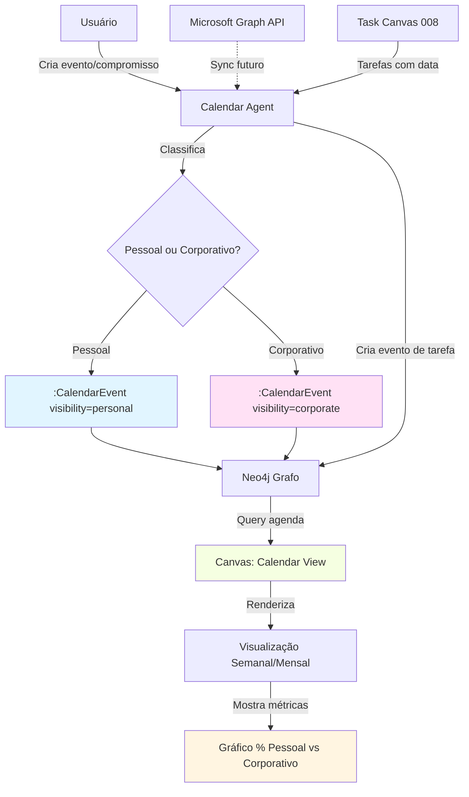
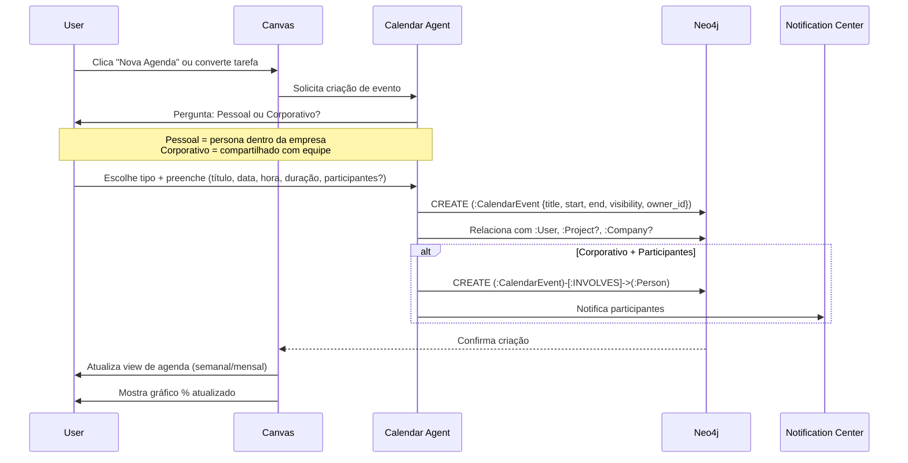
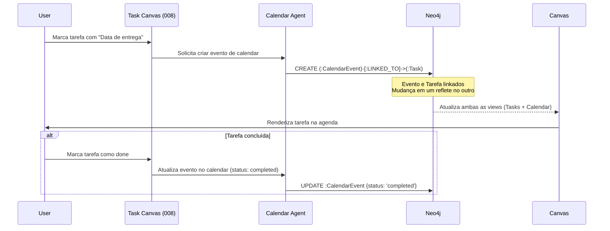

# Spec 023 – Agenda & Calendar System

## Context & Purpose

O **Agenda & Calendar System** é um gestor de agenda profissional que permite ao usuário organizar compromissos, eventos e tarefas com datas/horários, diferenciando entre **pessoal** (dentro do contexto da empresa/persona profissional) e **corporativo** (compartilhado com equipe/organização).

Este sistema complementa o Task Canvas (008), adicionando dimensão temporal e permitindo:
- **Visualização de agenda** pessoal e corporativa
- **Distribuição percentual** de tempo (pessoal vs corporativo)
- **Gráficos e métricas** de uso do tempo
- **Integração futura** com Microsoft Graph API (Outlook, Teams)
- **Renderização no Canvas** como item ao lado de Tarefas ou integrado

---

## High-Level View



---

## Process Flow: Criação de Evento



---

## Agent Collaboration: Integração Task ↔ Calendar



---

## User Scenarios

### Scenario 1 – Criação de Evento Pessoal (Persona Profissional)

**Given** usuário quer agendar reunião 1:1 com mentor,  
**When** clica em "Nova Agenda" no Canvas,  
**Then** Calendar Agent apresenta formulário com campos:
- Título (ex: "Reunião com Mentor João")
- Data e hora (ex: 10/12/2025 14:00)
- Duração (ex: 1h)
- Tipo: **Pessoal** (default para evento sem outros participantes da empresa)

**And** evento é criado como `:CalendarEvent {visibility: 'personal', owner_id: user.id}`,  
**And** Canvas renderiza evento na view semanal/mensal,  
**And** gráfico de distribuição % atualiza automaticamente.

---

### Scenario 2 – Criação de Evento Corporativo com Participantes

**Given** usuário quer agendar reunião de equipe,  
**When** cria evento e escolhe "Corporativo",  
**Then** Calendar Agent solicita lista de participantes (ex: busca por `:Person` no grafo),  
**And** cria `:CalendarEvent {visibility: 'corporate'}` com relações `[:INVOLVES]` para cada participante,  
**And** Notification Center (021) notifica cada participante,  
**And** evento aparece no calendar de todos os envolvidos.

---

### Scenario 3 – Conversão de Tarefa em Evento de Agenda

**Given** usuário tem tarefa "Entregar relatório" com data 15/12/2025,  
**When** Task Canvas (008) detecta tarefa com data,  
**Then** Calendar Agent automaticamente cria `:CalendarEvent` linkado à tarefa via `[:LINKED_TO]`,  
**And** evento aparece na agenda do usuário,  
**And** ao concluir tarefa, evento é marcado como "completed" automaticamente.

---

### Scenario 4 – Visualização de Distribuição Percentual

**Given** usuário acessa view de Agenda no Canvas,  
**When** Canvas renderiza calendar view,  
**Then** mostra:
- **Calendário visual** (semanal ou mensal) com eventos coloridos (pessoal = azul, corporativo = roxo)
- **Gráfico de pizza ou barra** mostrando % de tempo: 60% Corporativo, 40% Pessoal
- **Métricas**: Total de horas agendadas na semana/mês, média de eventos por dia

---

### Scenario 5 – Integração Futura com Microsoft Graph

**Given** integração com Microsoft Graph API ativada (futuro),  
**When** usuário autoriza sync com Outlook,  
**Then** Calendar Agent:
- Importa eventos do Outlook como `:CalendarEvent {source: 'microsoft_graph'}`
- Sincroniza bidirecionalmente (eventos criados no CVC Hub vão para Outlook)
- Mantém proveniência (`source_type`, `source_ref`)

---

## Functional Requirements

### Criação e Gerenciamento de Eventos

- **REQ-CAL-001**: Sistema DEVE permitir criar eventos de calendar com: título, descrição, data/hora início, data/hora fim, tipo (pessoal/corporativo).
- **REQ-CAL-002**: Eventos DEVEM ser nodes `:CalendarEvent` no Neo4j com relação `[:HAS_EVENT]` do `:User`.
- **REQ-CAL-003**: Eventos corporativos PODEM ter participantes (relação `[:INVOLVES]->(:Person)`).
- **REQ-CAL-004**: Usuário DEVE poder editar, deletar ou marcar evento como "concluído".
- **REQ-CAL-005**: Eventos PODEM ser recorrentes (ex: "toda segunda-feira às 10h"), armazenados como pattern em campo `recurrence_rule`.

### Classificação Pessoal vs Corporativo

- **REQ-CAL-006**: Sistema DEVE classificar eventos como `visibility: 'personal'` ou `'corporate'`.
- **REQ-CAL-007**: "Pessoal" significa **persona dentro da empresa** (ex: reunião 1:1, desenvolvimento pessoal), NÃO assuntos fora do trabalho.
- **REQ-CAL-008**: "Corporativo" significa **compartilhado com equipe/organização** (ex: reunião de projeto, stand-up).
- **REQ-CAL-009**: Default DEVE ser "pessoal" para eventos sem participantes, "corporativo" para eventos com múltiplos participantes.

### Integração com Task Canvas

- **REQ-CAL-010**: Tarefas (`:Task`) com campo `due_date` DEVEM automaticamente gerar `:CalendarEvent` linkado via `[:LINKED_TO]`.
- **REQ-CAL-011**: Mudanças em tarefa (conclusão, adiamento) DEVEM refletir no evento correspondente.
- **REQ-CAL-012**: Mudanças em evento (reagendar) DEVEM atualizar `due_date` da tarefa linkada.

### Visualização e Métricas no Canvas

- **REQ-CAL-013**: Canvas DEVE renderizar view de Calendar como item no menu principal (ao lado de "Minhas Tarefas").
- **REQ-CAL-014**: View de Calendar DEVE oferecer visualizações: Dia, Semana, Mês.
- **REQ-CAL-015**: Eventos pessoais e corporativos DEVEM ter cores/ícones distintos (ex: azul vs roxo).
- **REQ-CAL-016**: Canvas DEVE exibir **gráfico de distribuição percentual** de tempo (pessoal vs corporativo) na mesma tela ou em dashboard separado (020).
- **REQ-CAL-017**: Métricas DEVEM incluir:
  - Total de horas agendadas (semana/mês)
  - % Pessoal vs Corporativo
  - Média de eventos por dia
  - Top 5 tipos de eventos (ex: "Reuniões 1:1", "Stand-ups", "Entregas")

### Notificações e Lembretes

- **REQ-CAL-018**: Sistema DEVE integrar com Notification Center (021) para enviar lembretes de eventos (ex: 15min antes).
- **REQ-CAL-019**: Eventos corporativos com participantes DEVEM notificar todos os envolvidos na criação/edição.
- **REQ-CAL-020**: Usuário DEVE poder configurar preferências de lembrete (quanto tempo antes, tipo de notificação).

### Integração Futura com Microsoft Graph

- **REQ-CAL-021**: Sistema DEVE prever arquitetura para sync bidirecional com Microsoft Graph API (Outlook Calendar).
- **REQ-CAL-022**: Eventos importados DEVEM ter `source_type: 'microsoft_graph'` e `source_ref: <event_id>`.
- **REQ-CAL-023**: Sync DEVE respeitar princípios de Zero Hardcode (configuração de API keys, endpoints via env vars).
- **REQ-CAL-024**: Conflitos de sync (ex: evento editado em ambos os lados) DEVEM ser resolvidos via estratégia configurável (last-write-wins, manual resolution).

---

## Success Criteria

- ✅ Usuários conseguem criar e visualizar eventos pessoais e corporativos no Canvas.
- ✅ Integração com Task Canvas funciona: tarefas com data geram eventos automaticamente.
- ✅ Gráfico de distribuição % (pessoal vs corporativo) atualiza em tempo real.
- ✅ Notificações de eventos chegam via Notification Center 15min antes.
- ✅ View de Calendar é intuitiva (semanal/mensal) com cores distintas por tipo.
- ✅ Arquitetura está pronta para integração futura com Microsoft Graph (endpoints configuráveis, sem hardcode).

---

## Key Entities (Neo4j)

### :CalendarEvent

```cypher
(:CalendarEvent {
  id: uuid,
  title: string,
  description: string,
  start_datetime: datetime,
  end_datetime: datetime,
  duration_minutes: integer,
  visibility: 'personal' | 'corporate',
  status: 'scheduled' | 'completed' | 'cancelled',
  location: string?,
  recurrence_rule: string?,  // iCal format: "FREQ=WEEKLY;BYDAY=MO"
  source_type: 'manual' | 'task_linked' | 'microsoft_graph',
  source_ref: string?,  // ID externo (ex: Outlook event ID)
  owner_id: uuid,
  created_at: timestamp,
  updated_at: timestamp
})
```

**Relationships**:
- `(:User)-[:HAS_EVENT]->(:CalendarEvent)`
- `(:CalendarEvent)-[:INVOLVES]->(:Person)` (participantes)
- `(:CalendarEvent)-[:LINKED_TO]->(:Task)` (tarefa correspondente)
- `(:CalendarEvent)-[:RELATED_TO]->(:Project)` (opcional, se evento é sobre projeto específico)
- `(:CalendarEvent)-[:PART_OF]->(:Company)` (para eventos corporativos)

---

### :CalendarView (config de visualização do usuário)

```cypher
(:CalendarView {
  id: uuid,
  user_id: uuid,
  default_view: 'day' | 'week' | 'month',
  show_personal: boolean,
  show_corporate: boolean,
  reminder_minutes_before: integer,
  created_at: timestamp,
  updated_at: timestamp
})
```

**Relationships**:
- `(:User)-[:HAS_CALENDAR_VIEW]->(:CalendarView)`

---

## Technical Constraints

- **Timezone Handling**: Todos os eventos devem ser armazenados em UTC (`start_datetime`, `end_datetime`) e convertidos para timezone do usuário no frontend.
- **Recorrência**: Usar formato iCal para `recurrence_rule` (padrão da indústria, compatível com Outlook/Google Calendar).
- **Performance**: Queries de calendar para visualização mensal devem ser otimizadas (index em `start_datetime`, `owner_id`, `visibility`).
- **Microsoft Graph**: Integração deve usar OAuth 2.0, com tokens armazenados de forma segura (não em Neo4j, usar vault ou env vars).
- **Zero Hardcode**: Endpoints, API keys, regras de sync devem vir de configuração (env vars ou nodes de config no grafo).

---

## Assumptions

- Usuário tem apenas 1 calendar (não múltiplos calendars como Google Calendar).
- Eventos "pessoais" no contexto da empresa (NÃO confundir com "vida pessoal fora do trabalho").
- Integração com Microsoft Graph é **futura** (não MVP), mas arquitetura deve estar pronta.
- Tarefas com `due_date` sempre geram evento de calendar automaticamente (pode ser configurável depois).

---

## Open Questions

- [ ] Calendar deve ter view de "Hoje" além de Semana/Mês?
- [ ] Permitir arrastar eventos no Calendar para reagendar (drag & drop)?
- [ ] Como lidar com eventos de dia inteiro (sem hora específica)?
- [ ] Eventos corporativos devem ter aprovação antes de notificar participantes?
- [ ] Sincronização com Google Calendar também ou só Microsoft Graph?
- [ ] Gráfico de distribuição % deve incluir tempo de "gaps" (sem eventos agendados)?

---

## Related Specs

- **008 – Task Generation & Canvas**: Tarefas com datas geram eventos de calendar.
- **016 – Main Interface Layout**: Calendar View é item no menu principal, renderizado no Canvas.
- **020 – Gamification & User KPIs**: Métricas de uso do tempo (% pessoal vs corporativo) integram com dashboard.
- **021 – Notification Center**: Lembretes de eventos enviados como notificações.
- **009 – User Memory Decision**: Eventos pessoais vs corporativos seguem mesma lógica de visibilidade.
- **015 – Neo4j Graph Model**: `:CalendarEvent` integra com modelo global de nodes.

---

## Notes

- **Agenda como "Gestor de Tempo Profissional"**: Este sistema não é apenas um calendar, mas uma ferramenta de gestão de tempo que ajuda o usuário a entender como está distribuindo esforço entre atividades pessoais (desenvolvimento, 1:1s) e corporativas (reuniões de equipe, entregas).
- **Visualização Percentual**: Insight poderoso para CVC Hub, onde mentores/startups podem ver se estão dedicando tempo suficiente a mentorias, desenvolvimento de negócio, etc.
- **Pipeline Completo**: Como mencionado pelo usuário, este sistema pode evoluir para um "pipeline de gestão de agenda" com sugestões proativas (ex: "Você tem 3 reuniões consecutivas, deseja agendar intervalo?").
