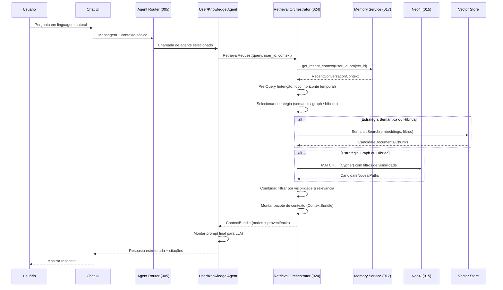
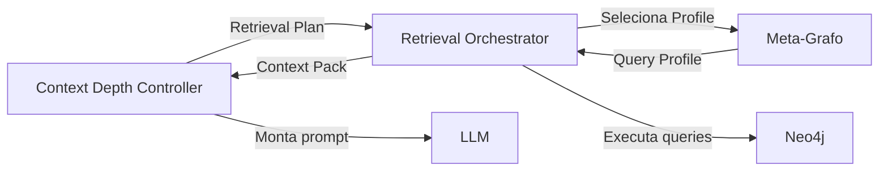

# Feature Specification: Retrieval Orchestration & Retrieval Ecosystem

**Feature Branch**: `024-retrieval-orchestration`  
**Created**: 2025-12-07  
**Status**: Draft  
**Priority**: P1 (Core)  
**Source**: TRG-SPC-20251206-012 (Retrieval Ecosystem) + `system-flows.md` + specs 001/005/014/015/017

---

## Purpose

Definir o **ecossistema de recuperação de informação (Retrieval)** do CVC Hub, que orquestra:
- Entendimento da pergunta do usuário (`pre-query`).  
- Escolha de **estratégia de busca** (semântica, grafo, keywords, cache).  
- Execução de queries em Neo4j + índice vetorial.  
- Garantia de **proveniência**, visibilidade e limites de custo/profundidade.  
- Entrega de um **"pacote de contexto" estruturado** para os agentes (Knowledge Agent, User Agent, Task Agent), usado na formulação da resposta.

> Regra macro: Retrieval não é só "rodar uma query"; é um **orquestrador** que decide **como** buscar e **o que** devolver para a LLM, respeitando princípios de memória, visibilidade e proveniência.

---

## Process Flow (Business View)

```mermaid
flowchart TD
    U[👤 Usuário
    Pergunta em linguagem natural] --> CH[💬 Chat]
    CH --> AR[🔀 Agent Router (005)]
    AR --> RQ[🧠 Pre-Query
    (entender intenção)]
    RQ --> RE[🔎 Retrieval Orchestrator]

    subgraph RETRIEVAL["🔍 Retrieval Ecosystem (024)"]
        STRAT[🎯 Escolher Estratégia
        (semântico / grafo / híbrido)]
        SEM[🔢 Busca Semântica
        (embeddings)]
        GQL[🗂️ Graph Query
        (Cypher/Neo4j)]
        KW[🔤 Keyword Search]
        CCH[⚡ Cache de Resultados]
        Filt[🧹 Filtro de Visibilidade
        & Relevância]
        Bundle[📦 Pacote de Contexto
        (nodes + proveniência)]
    end

    RE --> STRAT
    STRAT --> CCH
    CCH -->|miss| SEM
    CCH -->|miss| GQL
    CCH -->|hit| Filt

    SEM --> Filt
    GQL --> Filt
    KW --> Filt

    Filt --> Bundle
    Bundle --> AG[🤖 Agente Chamador
    (Knowledge/Task/User Agent)]
    AG --> CH
    CH --> U

    classDef core fill:#e3f2fd,stroke:#1565c0,color:#000
    classDef store fill:#e8f5e9,stroke:#2e7d32,color:#000

    class RE,RETRIEVAL,STRAT,SEM,GQL,KW,CCH,Filt,Bundle core
```

**Visão de negócio**:
- Usuário faz pergunta → Router seleciona agente → agente aciona **Retrieval Orchestrator**.  
- Orquestrador escolhe estratégia, busca nos índices/grafo, aplica regras de visibilidade/proveniência, devolve um **pacote de contexto** para a LLM formular resposta confiável.

---

## Sequence Diagram (Technical View)



---

## User Scenarios & Testing

### User Story 1 – Pergunta Factual com Citação (Priority: P1)

Usuário faz pergunta sobre documento ou conhecimento específico e espera **resposta factual com fonte clara**.

**Acceptance Scenarios**:

1. **Given** usuário pergunta "Quais são os critérios do programa X?", **When** Retrieval Orchestrator é acionado, **Then** ele:
   - Identifica intenção de **busca factual**.  
   - Roda busca semântica + grafo sobre documentos marcados como corporativos relevantes.  
   - Monta contexto com trechos principais + metadados (`source_type`, `source_ref`, etc.).

2. **Given** resposta é gerada pela LLM, **When** usuário vê mensagem no chat, **Then** ela inclui **citações com proveniência** (ex.: "Fonte: Documento Y, seção 3.2") baseadas nos nodes retornados por Retrieval.

---

### User Story 2 – Pergunta sobre Tarefas/Projetos (Priority: P1)

Usuário pergunta algo sobre tarefas ou projetos em andamento, que depende mais da **estrutura do grafo** do que de texto solto.

**Acceptance Scenarios**:

1. **Given** usuário pergunta "Quais tarefas da minha startup estão atrasadas?", **When** Retrieval Orchestrator é acionado, **Then** ele:
   - Identifica que o foco é em **nodes de Task/Plan**.  
   - Prioriza estratégia de **Graph Query (Cypher)** filtrando por `owner_id`, `status`, `due_date`, `visibility`.  
   - Retorna nodes de Task + links para projetos/startups relevantes.

2. **Given** tarefas são retornadas, **When** agente monta resposta, **Then** usuário vê tanto a lista textual quanto a possibilidade de visualizar essas tarefas no **Canvas** (ligação com spec 008).

---

### User Story 3 – Pergunta Contextual/de Orientação (Priority: P2)

Usuário faz pergunta mais aberta (ex.: "O que você sugere que eu faça agora?") e espera **orientação contextual** baseada em histórico, tarefas e perfil.

**Acceptance Scenarios**:

1. **Given** usuário pergunta "O que deveríamos priorizar esta semana?", **When** Retrieval Orchestrator é acionado, **Then** ele:
   - Usa `Memory Service` para pegar tarefas recentes, planos ativos e contexto da startup.  
   - Usa grafo para buscar relacionamentos fortes (tasks prioritárias, nós marcados como críticos).  
   - Devolve contexto que permita ao agente sugerir **próximas ações** coerentes com o Canvas e AI Profile (022).

---

## Functional Requirements

### Pre-Query & Intent Understanding

- **REQ-RETR-001**: Retrieval Orchestrator DEVE receber uma estrutura `RetrievalRequest` contendo, no mínimo: `user_id`, `conversation_id`, `raw_query`, `agent_type`, `project_id?`, `preferred_answer_style?`.
- **REQ-RETR-002**: Orquestrador DEVE executar passo de **Pre-Query** utilizando LLM ou heurística para derivar:
  - `retrieval_intent` (ex.: `"factual"`, `"graph_insight"`, `"orientation"`).  
  - `focus_entities` (ex.: `Task`, `Project`, `Knowledge`, `Document`).  
  - `time_horizon` (ex.: `"last_7d"`, `"all_time"`).  
  - `answer_constraints` (ex.: tamanho da resposta, necessidade de lista, etc.).
- **REQ-RETR-003**: O resultado de Pre-Query DEVE ser logado em `:RetrievalJob` (ver entidades) para auditoria e melhoria futura.

### Estratégia de Busca & Combinação

- **REQ-RETR-004**: Retrieval Orchestrator DEVE ter **estratégias nomeadas** configuráveis (ex.: `semantic_only`, `graph_only`, `hybrid_semantic_graph`).
- **REQ-RETR-005**: Para cada `retrieval_intent`, sistema DEVE ter uma estratégia **default** configurada (via `:RetrievalConfig` ou equivalente), sem hardcode fixo no código.
- **REQ-RETR-006**: Estratégia **semântica** DEVE:
  - Gerar embeddings da query usando Azure OpenAI.  
  - Buscar em índice vetorial apenas conteúdos com visibilidade compatível.  
  - Retornar lista de candidates com `score` e metadados.
- **REQ-RETR-007**: Estratégia **graph** DEVE executar queries Cypher pré-definidas/parametrizadas, usando:
  - Filtros por `owner_id`, `visibility`, `hierarchy_level`.  
  - Limite de profundidade (`max_hops`) configurável (ver Constituição A.XIX).
- **REQ-RETR-008**: Estratégia **híbrida** DEVE combinar resultados semânticos e de grafo, priorizando:
  - Nodes com maior `relevance_score`.  
  - Paths que conectem diretamente usuário/startup/tarefa ativa ao conhecimento.

### Visibilidade, Proveniência & Segurança

- **REQ-RETR-009**: TODAS as queries de retrieval DEVEM respeitar regras de visibilidade hierárquica (spec 012 + system-flows sec. 9):
  - Usuário não vê dados acima do seu nível de hierarquia.  
  - Dados pessoais permanecem privados.
- **REQ-RETR-010**: Cada item retornado no `ContextBundle` DEVE incluir metadados de proveniência (`source_type`, `source_ref`, `created_at`, `confidence`), alinhados com spec 014.
- **REQ-RETR-011**: Retrieval Orchestrator NÃO PODE retornar nodes/informações que violem restrições de visibilidade, mesmo que semanticamente relevantes.

### Context Bundle & Interface com Agentes

- **REQ-RETR-012**: Orquestrador DEVE montar um `ContextBundle` contendo:
  - Lista de `context_items` (nodes/trechos) com texto, metadados e tipo.  
  - `retrieval_summary` curto (explicando o que foi encontrado).  
  - `strategies_used`, `depth_used`, `tokens_estimated`.
- **REQ-RETR-013**: `ContextBundle` DEVE ser entregue ao agente chamador (Knowledge/Task/User Agent), que monta o prompt final para a LLM.
- **REQ-RETR-014**: Orquestrador NÃO DEVE acoplar lógica de resposta textual; sua responsabilidade termina ao entregar o contexto estruturado.

### Limites, Custos & Observabilidade

- **REQ-RETR-015**: Orquestrador DEVE respeitar limites configuráveis de:
  - `max_nodes_scanned`, `max_results`, `max_depth`, `max_tokens_context`.
- **REQ-RETR-016**: Cada execução DEVE registrar em `:RetrievalJob` ao menos: `strategy_used`, `nodes_scanned`, `nodes_returned`, `latency_ms`, `error?`.
- **REQ-RETR-017**: Observability Dashboard (spec 018) DEVE conseguir derivar métricas de:
  - Taxa de sucesso de retrieval.  
  - Latência média.  
  - Erros por tipo de estratégia.

### Integração com Memória & Persona

- **REQ-RETR-018**: Antes de rodar buscas pesadas, Orquestrador DEVE consultar `Memory Service` para obter contexto recente mínimo (`get_recent_context`), respeitando limites de tokens definidos em 017.
- **REQ-RETR-019**: Retrieval PODE priorizar conteúdos marcados como `priority_node` ou ligados a `AIProfile/Persona` (022) quando `retrieval_intent` envolver orientação ou coaching.
- **REQ-RETR-020**: Padrões de queries recorrentes (ex.: temas repetidos) DEVEM ser logados de forma que FeedbackAgent (019) possa usar para sugerir melhorias de persona ou conteúdos a ingerir.

---

## Key Entities (Neo4j)

Apoiado em `database-schema.md` e spec 015.

```cypher
// RetrievalJob - log de cada execução de retrieval
(:RetrievalJob {
  id: string,
  user_id: string,
  conversation_id: string,
  agent_type: string,          // 'knowledge', 'task', 'user', etc.
  raw_query: string,
  rewritten_query: string?,
  retrieval_intent: string,    // 'factual', 'graph_insight', ...
  strategy_used: string,       // 'semantic_only', 'graph_only', 'hybrid'
  nodes_scanned: integer,
  nodes_returned: integer,
  depth_used: integer,
  tokens_estimated: integer,
  latency_ms: integer,
  error_code: string?,
  created_at: datetime
})

// RetrievalConfig - parâmetros configuráveis por ambiente/org
(:RetrievalConfig {
  id: string,
  scope: string,               // 'global', 'org', 'user'
  max_depth: integer,
  max_nodes_scanned: integer,
  max_results: integer,
  max_tokens_context: integer,
  default_strategy_factual: string,
  default_strategy_graph_insight: string,
  default_strategy_orientation: string,
  created_at: datetime,
  updated_at: datetime
})

(:Org)-[:HAS_RETRIEVAL_CONFIG]->(:RetrievalConfig)
(:User)-[:HAS_RETRIEVAL_CONFIG]->(:RetrievalConfig)

// Relação entre RetrievalJob e resultados (para auditoria)
(:RetrievalJob)-[:RETURNED]->(:Knowledge|:Task|:Document|:Chunk)
```

---

## Technical Constraints

- Retrieval Orchestrator deve ser exposto como **serviço lógico** (pode ser módulo interno neste estágio), chamado por agentes via interface clara (`RetrievalRequest` → `ContextBundle`).  
- Limites de profundidade, custos e estratégias **não podem ser hardcoded**; devem vir de `RetrievalConfig` ou equivalente, alinhado ao princípio ZERO HARDCODE.  
- Orquestrador deve ser projetado para **extensibilidade** (novas estratégias de busca, novos tipos de index) sem quebrar interface pública.

---

## Integração com Query Profiles (Meta-Grafo)

O Retrieval Orchestrator agora usa **Query Profiles** do Meta-Grafo (spec 050) em vez de estratégias genéricas hardcoded.

### Query Profiles Disponíveis

| Profile | Intenção | Anchors | Max Hops |
|---------|----------|---------|----------|
| `org_context` | Estrutura organizacional | User, Department, Organization | 3 |
| `document_evidence` | Evidência documental | Document, Chunk, DocSummary | 2 |
| `process_state` | Estado de processos | Process, Task, DecisionPoint | 4 |
| `strategy_alignment` | Alinhamento estratégico | Purpose, StrategicObjective, OKR | 3 |

### Seleção de Profile

```python
def select_query_profile(intent: str, context: dict) -> QueryProfile:
    # Mapear intenção classificada para profile
    profile_map = {
        "factual": "document_evidence",
        "organizational": "org_context",
        "procedural": "process_state",
        "strategic": "strategy_alignment",
        "orientation": "strategy_alignment"  # fallback
    }
    
    profile_name = profile_map.get(intent, "org_context")
    
    # Carregar profile do meta-grafo
    return load_profile_from_metagraph(profile_name)
```

### Requisitos de Integração

- **REQ-RETR-021**: Retrieval Orchestrator DEVE carregar Query Profiles do Meta-Grafo (spec 050)
- **REQ-RETR-022**: Seleção de profile DEVE ser baseada em `retrieval_intent` classificado
- **REQ-RETR-023**: Profiles DEVEM especificar: anchors, rels permitidos, max_hops, políticas
- **REQ-RETR-024**: Se profile tem `require_rbac: true`, DEVE aplicar filtro de acesso
- **REQ-RETR-025**: Se profile tem `require_validity: true`, DEVE aplicar filtro temporal

---

## Integração com Context Depth Controller (CDC)

O Retrieval Orchestrator é acionado pelo CDC (spec 051) com um **Retrieval Plan** específico por nível de profundidade.

### Fluxo CDC → Retrieval



### Retrieval Plan por Nível CDC

| Nível | Fontes | Profile Sugerido | Tokens Max |
|-------|--------|------------------|------------|
| D0 | Working Set only | null | 500 |
| D1 | + Episodic | org_context | 1500 |
| D2 | + Semantic | document_evidence | 3000 |
| D3 | + Claims | document_evidence | 4000 |
| D4 | Reset + new anchor | strategy_alignment | 2500 |

### Context Pack Estruturado

O Retrieval Orchestrator agora produz um **Context Pack** estruturado para o CDC:

```typescript
interface ContextBundle {
  // Existente
  context_items: ContextItem[];
  retrieval_summary: string;
  strategies_used: string[];
  depth_used: number;
  tokens_estimated: number;
  
  // Novo: Organizado por classe de memória
  by_memory_class: {
    working_set: ContextItem[];
    episodic?: ContextItem[];
    semantic?: ContextItem[];
    procedural?: ContextItem[];
    claims?: ClaimItem[];
  };
  
  // Novo: Metadados do CDC
  cdc_metadata: {
    depth_level: 'D0' | 'D1' | 'D2' | 'D3' | 'D4';
    query_profile_used: string;
    filters_applied: string[];
  };
  
  // Novo: Instruções para LLM
  llm_instructions: string[];
}
```

### Requisitos de Integração CDC

- **REQ-RETR-026**: Retrieval DEVE aceitar Retrieval Plan do CDC especificando fontes e limites
- **REQ-RETR-027**: Context Pack DEVE ser organizado por classe de memória quando CDC solicita
- **REQ-RETR-028**: Retrieval DEVE incluir `cdc_metadata` no ContextBundle
- **REQ-RETR-029**: Retrieval DEVE respeitar `max_tokens` especificado pelo CDC
- **REQ-RETR-030**: Se CDC solicita Claims (D3), Retrieval DEVE buscar em `:Claim` nodes

---

## Retrieval por Semântica (não por hops genéricos)

Em vez de usar `max_hops` genérico, o retrieval agora é guiado por **semântica**:

### Princípios

1. **Anchors Específicos**: Query sempre começa por anchor relevante ao intent
2. **Rels Permitidos**: Só traversa relacionamentos autorizados pelo profile
3. **Filtros Obrigatórios**: RBAC + validade aplicados automaticamente
4. **Limite por Profile**: Cada profile tem seu próprio max_hops

### Exemplo de Query Semântica

```cypher
// Profile: document_evidence
// Intent: "Buscar documentos sobre LGPD"

// Passo 1: Anchor em Document
MATCH (d:Document)
WHERE d.updated_at >= datetime() - duration({days: 30})
  AND (d.expires_at IS NULL OR d.expires_at > datetime())

// Passo 2: Traversar rels permitidos (HAS_CHUNK, HAS_SUMMARY)
OPTIONAL MATCH (d)-[:HAS_SUMMARY]->(s:DocSummary)
OPTIONAL MATCH (d)-[:HAS_CHUNK]->(c:Chunk)
WHERE c.text CONTAINS "LGPD" OR s.text CONTAINS "LGPD"

// Passo 3: Aplicar RBAC
MATCH (u:User {id: $userId})-[:HAS_ROLE]->(r:Role)-[g:GRANTS]->(p:Permission)
WHERE (d)-[:OWNED_BY|:VISIBLE_TO*0..2]->(scope)
  AND (p)-[:ON_SCOPE]->(scope)

RETURN d, s, collect(c) AS chunks
ORDER BY d.updated_at DESC
LIMIT $limit
```

---

## Related Specs

- **001-knowledge-pipeline** – geração de embeddings e ingestão de conteúdos.  
- **005-agent-router** – decide qual agente chama Retrieval.  
- **007-chat-knowledge-capture** – principal origem de queries de usuário.  
- **009-user-memory-decision** – afeta o que pode ser recuperado (Corp vs Pessoal).  
- **010-data-filtration** – Real vs Passageiro (impacta persistência e relevância).  
- **012-graph-curation-ecosystem** – garante qualidade dos dados no grafo.  
- **014-provenance-system** – garante metadados de origem em todas as respostas.  
- **015-neo4j-graph-model** – modelo global de nodes/relacionamentos + pesos.  
- **017-memory-ecosystem** – memória multinível, classes de memória e Claims.  
- **018-observability-dashboard** – monitora métricas de retrieval.  
- **019-multi-agent-orchestration** – coordena agentes que usam Retrieval.  
- **022-onboarding-ai-profile** – AI Profile/Persona usada para priorização de conteúdos.
- **050-meta-graph-schema** – Query Profiles e Meta-Grafo.
- **051-context-depth-controller** – CDC que dirige o retrieval por nível.

---

## References

- `system-flows.md` – Fluxos 3 (Recuperação com Proveniência) e 10 (Pipeline end-to-end).  
- `database-schema.md` – metadados universais, visibilidade, proveniência.  
- Constitution: A.X (Auto-improvement via feedback), A.XIII (Caducidade), A.XIV (Memória multinível), A.XIX (Limite de profundidade de busca).
