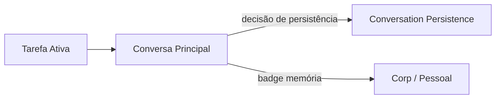

# Feature Specification: Conversation Persistence System

**Feature Branch**: `025-conversation-persistence-system`  
**Created**: 2025-12-07  
**Status**: Draft  
**Priority**: P1 (Core)  
**Source**: TRG-SPC-20251206-036 (Conversation Persistence System) + `frontend-flow-spec.md` + `system-flows.md` (sec. 2.1) + specs 007/009/010/017/024

---

## Purpose

Definir **como conversas de chat são persistidas, resumidas ou descartadas** no CVC Hub, de forma:
- Coerente com o foco em **Tarefa Ativa** (frontend-flow-spec).  
- Alinhada às decisões de **memória Corp/Pessoal** (009) e **Real vs Passageiro** (010).  
- Integrada ao **Memory Ecosystem** (017) e ao **Retrieval Orchestrator** (024).  

Objetivos principais:
- Evitar que todo chat vire "lixeira permanente".  
- Garantir que **insights importantes** sejam preservados, mesmo que o usuário descarte o resto.  
- Fornecer base clara para **retomar conversas**, sumarizá-las e usá-las como contexto futuro.

> Regra macro: Toda conversa nasce em **memória de sessão**; o usuário (com ajuda do sistema) decide o que vira memória de longo prazo.

---

## Process Flow (Business View)

### 1. Fluxo de Persistência de Conversa (adaptado de `system-flows.md`)

```mermaid
flowchart TB
    subgraph CHAT["💬 Conversa em Andamento"]
        CH1[Mensagens do Usuário]
        CH2[Respostas do Agente]
    end

    subgraph SESSION["📍 Memória de Sessão (Curto Prazo)"]
        SE1[Toda conversa é guardada
        temporariamente]
    end

    subgraph PAUSE["⏸️ Pausa/Encerramento"]
        PA1[Usuário pausa ou encerra]
    end

    subgraph DECIDE["👤 Decisão de Persistência"]
        DE1{O que fazer com
        esta conversa?}
        DE2[Salvar TUDO
        (Full Log)]
        DE3[Descartar TUDO
        (Só sessão)]
        DE4[Salvar apenas INSIGHTS
        (Knowledge/Notas)]
    end

    subgraph RESULT["💾 Resultado"]
        RE1[Memória Longo Prazo
        Conversation + Messages]
        RE2[Somente Memória Curto Prazo
        (expira via Decay)]
        RE3[Insights/Knowledge
        persistidos]
    end

    CHAT --> SESSION
    SESSION --> PAUSE
    PAUSE --> DECIDE

    DE1 -->|Salvar tudo| DE2
    DE1 -->|Descartar| DE3
    DE1 -->|Insights| DE4

    DE2 --> RE1
    DE3 --> RE2
    DE4 --> RE3

    style DECIDE fill:#e3f2fd,stroke:#1565c0,stroke-width:3px
    style SESSION fill:#fff3e0,stroke:#ff9800
```

**Notas de negócio**:
- **V1 simples**: opções aparecem em contexto de **Tarefa Ativa**; não exige seleção de mensagens uma a uma.  
- Mesmo se usuário descartar a conversa, **Knowledge já salvo** (spec 007) continua existindo no grafo.

---

## Relation with Task & Memory Scope

Do `frontend-flow-spec.md` (foco em **Tarefa Ativa** + badge Corp/Pessoal):

- Cada **Tarefa Ativa** tem **1 conversa principal** associada (V1).  
- Conversa tem **badge de memória**: 🏢 Corp / 👤 Pessoal (009).  
- A decisão de persistência atua **no nível da conversa inteira**, não por mensagem (granularidade fina fica para o futuro).



---

## User Scenarios & Testing

### User Story 1 – Retomar Conversa de Tarefa Importante (Priority: P1)

Usuário trabalha uma semana em uma tarefa, conversa bastante com o agente, fecha o sistema e volta depois. Quer ver o histórico **completo** dessa conversa.

**Acceptance Scenarios**:

1. **Given** usuário encerra sessão em uma Tarefa Ativa marcada como importante, **When** sistema mostra diálogo "O que fazer com esta conversa?", **Then** opção default é **Salvar TUDO**.
2. **Given** usuário escolheu "Salvar TUDO", **When** retorna dias depois e abre a mesma Tarefa, **Then** últimas N mensagens + atalho para carregar mensagens mais antigas são carregadas a partir do `:Conversation` no Neo4j.
3. **Given** conversa ficou muito longa, **When** sistema precisar enviar contexto para LLM, **Then** usa o modelo de resumo progressivo de 017 (últimas mensagens completas + 1-2 resumos agregados), não todo o log bruto.

---

### User Story 2 – Conversa Transitória com Salvamento só de Insights (Priority: P1)

Usuário faz brainstorming rápido com o agente, mas não quer guardar o log inteiro, apenas **alguns insights**.

**Acceptance Scenarios**:

1. **Given** conversa foi marcada como mais "exploratória" (ex.: tipo de sessão configurado), **When** usuário encerra, **Then** opção default é "Salvar apenas INSIGHTS".
2. **Given** usuário escolhe "INSIGHTS", **When** confirma, **Then** sistema:
   - Usa LLM para gerar 1–3 frases de resumo dos principais pontos.  
   - Cria nodes `:Knowledge` ou `:Note` ligados à Tarefa Ativa, **sem** manter todo o log de mensagens no longo prazo.
3. **Given** usuário volta depois, **When** abre a Tarefa, **Then** vê os insights salvos e não o histórico completo da conversa (apenas, se quiser, um resumo geral).

---

### User Story 3 – Deletar Conversa sem Perder Conhecimento (Priority: P1)

Usuário decide apagar uma conversa específica do histórico, mas já salvou conhecimentos importantes dela.

**Acceptance Scenarios**:

1. **Given** histórico de conversas mostra ícone de deletar (spec 007), **When** usuário confirma "Deletar conversa", **Then** sistema **NÃO apaga** nodes `:Knowledge` já salvos a partir dessa conversa.
2. **Given** conversa foi marcada como deletada, **When** agente de Retrieval busca conhecimento relevante, **Then** Knowledge continua sendo retornado normalmente (desde que visibilidade permita), mas logs de `:Message` não são mais usados como contexto detalhado.

---

## Functional Requirements

### Conversation Lifecycle & States

- **REQ-CONV-001**: Cada thread de chat DEVE ser representada por um node `:Conversation` (ver spec 007), com propriedades adicionais:
  - `persistence_policy`: `"full" | "insights_only" | "ephemeral"`.  
  - `memory_scope`: `"corporate" | "personal"` (integrado à decisão 009).  
  - `task_id`: id da Tarefa Ativa associada (quando aplicável).  
  - `deleted`: boolean (default `false`).
- **REQ-CONV-002**: Toda nova conversa inicia com `persistence_policy = "full"` **ou** outra default configurável por usuário/org (via configuração, não hardcode).
- **REQ-CONV-003**: Nodes `:Message` (spec 007) DEVEM sempre ser criados para cada mensagem enquanto conversa estiver ativa, independentemente da decisão futura.

### Persistence Decision Flow

- **REQ-CONV-004**: Sistema DEVE acionar fluxo de decisão de persistência quando ocorrer ao menos um destes eventos:
  - Usuário clicar explicitamente em "Encerrar conversa".  
  - Conversa ficar inativa por mais de `N` minutos (timeout configurável) e usuário voltar ao Canvas/Chat.  
- **REQ-CONV-005**: Diálogo de decisão DEVE oferecer no mínimo as opções:
  - "Salvar TUDO" (full log).  
  - "Salvar apenas INSIGHTS".  
  - "Descartar conversa".
- **REQ-CONV-006**: Decisão tomada DEVE ser registrada em entidade de log (`:ConversationPersistenceDecision`, ver entidades) com:
  - `decision_type`, `user_id`, `timestamp`.

### Behavior – "Salvar TUDO" (full log)

- **REQ-CONV-007**: Quando usuário escolhe "Salvar TUDO":
  - `:Conversation.persistence_policy` DEVE ser atualizado para `"full"`.  
  - Todos os `:Message` ligados a essa conversa permanecem disponíveis para retrieval (limitados por memory_level/decay, ver 017).  
- **REQ-CONV-008**: Conversas com `persistence_policy = "full"` DEVEM ser candidatas a:
  - Serem recuperadas na UI de histórico (spec 007).  
  - Serem consideradas em sumarização progressiva (017) para contexto futuro.

### Behavior – "Salvar apenas INSIGHTS"

- **REQ-CONV-009**: Quando usuário escolhe "Salvar apenas INSIGHTS":
  - `:Conversation.persistence_policy` DEVE ser atualizado para `"insights_only"`.  
  - Sistema DEVE executar job de extração de insights usando LLM, gerando um ou mais nodes `:Knowledge`/`:Note` ligados à `:Conversation` e à Tarefa Ativa.
- **REQ-CONV-010**: Após salvar insights, sistema PODE:
  - Manter somente **resumo curto** da conversa (ex.: `:Conversation.summary`) e descartar/downgrade de `:Message` para `memory_level = "short"` com `expires_at` próximo (Decay Agent decide o tempo).

### Behavior – "Descartar conversa"

- **REQ-CONV-011**: Quando usuário escolhe "Descartar conversa":
  - `:Conversation.persistence_policy` DEVE ser atualizado para `"ephemeral"`.  
  - `:Conversation.deleted` DEVE ser setado como `true` **ou** conversa removida fisicamente (decisão de implementação no plano técnico), respeitando necessidades de auditoria.
- **REQ-CONV-012**: Conversa descartada NÃO DEVE mais aparecer no histórico de conversas da UI (spec 007).
- **REQ-CONV-013**: Conhecimentos já salvos (`:Knowledge`, `:Document`, etc.) **NÃO** DEVEM ser removidos, mesmo que conversa seja descartada.

### Integration with Memory Ecosystem (017)

- **REQ-CONV-014**: Para conversas com `persistence_policy = "full"`, Memory Service (017) PODE:
  - Promover partes do histórico a médio/longo prazo com base em uso (acessos, relevância).  
  - Aplicar summarização progressiva para compor contexto (últimas mensagens + resumos).
- **REQ-CONV-015**: Para conversas com `persistence_policy = "insights_only"` ou `"ephemeral"`:
  - Memory Service DEVE priorizar insights/knowledge como fonte de verdade de longo prazo.  
  - Logs de `:Message` podem ter `memory_level = "short"` com caducidade agressiva.

### Integration with User Memory Decision (009) & Data Filtration (010)

- **REQ-CONV-016**: `memory_scope` da conversa DEVE refletir decisão Corp/Pessoal tomada no fluxo de 009 (badge na UI e metadado na conversa).
- **REQ-CONV-017**: Dados marcados como **Passageiros** no fluxo de 010 PODEM influenciar recomendação da política de persistência (ex.: sugerir "Insights only" ou "Descartar").

### Integration with Retrieval (024)

- **REQ-CONV-018**: Quando Retrieval Orchestrator (024) precisa contexto de conversas:
  - Para `persistence_policy = "full"`: PODE acessar `:Message` + summaries (respeitando limites de tokens).  
  - Para `"insights_only"`: DEVE preferir nodes `:Knowledge`/`:Note` e `:Conversation.summary` em vez de todo log.
- **REQ-CONV-019**: Conversas com `deleted = true` NÃO DEVEM ser usadas como fonte de contexto, exceto se política explícita de auditoria permitir acesso restrito (fora do MVP).

---

## Key Entities (Neo4j)

Complementa as entidades já definidas em 007 e 017.

```cypher
// Extensão de Conversation (ver 007)
(:Conversation {
  id: string,
  userId: string,
  title: string,
  summary: string,
  lastMessageAt: datetime,
  messageCount: integer,
  knowledgeCount: integer,
  active: boolean,
  -- campos adicionados por esta spec --
  taskId: string?,            // Tarefa Ativa associada
  persistence_policy: string, // "full" | "insights_only" | "ephemeral"
  memory_scope: string,       // "corporate" | "personal"
  deleted: boolean            // conversa foi removida da UI
})

// Log de decisão de persistência
(:ConversationPersistenceDecision {
  id: string,
  conversationId: string,
  userId: string,
  decision_type: string,      // "full" | "insights_only" | "ephemeral"
  reason: string?,            // opcional (ex.: "sessão exploratória")
  created_at: datetime
})

(:Conversation)-[:HAS_PERSISTENCE_DECISION]->(:ConversationPersistenceDecision)
```

---

## Technical Constraints

- Fluxo de decisão de persistência DEVE ser simples na V1: diálogo único ao encerrar/pausar, sem obrigar o usuário a configurar dezenas de opções.  
- Defaults (full vs insights vs discard) DEVEM ser configuráveis por usuário/empresa, nunca hardcoded fixo.  
- Em caso de erro ou timeout no fluxo de decisão, sistema DEVE assumir um default **seguro** (ex.: manter conversa por um tempo em memória curto/médio prazo, permitindo que usuário decida depois).

---

## Related Specs

- **007-chat-knowledge-capture** – modelo base de Conversation/Message + captura de Knowledge.  
- **009-user-memory-decision** – Corp vs Pessoal (memory_scope).  
- **010-data-filtration** – Real vs Passageiro (impacta política de retenção).  
- **016-main-interface-layout** – layout do chat e painel de histórico.  
- **017-memory-ecosystem** – memória multinível + summarização progressiva.  
- **018-observability-dashboard** – métricas de uso de conversas/persistência.  
- **021-notification-center** – futuras notificações sobre conversas arquivadas/ativas.  
- **024-retrieval-orchestration** – utilização de conversas/insights como contexto em queries.

---

## References

- `frontend-flow-spec.md` – foco em Tarefa Ativa + badge Corp/Pessoal + fluxo de onboarding.  
- `system-flows.md` – Fluxo 2.1 (Persistência de Conversa) e Fluxo 4 (Memória multinível).  
- `database-schema.md` – metadados universais, memória e visibilidade.  
- Constitution: A.XIII (Caducidade de Nodes), A.XIV (Memória multinível), A.XV (Visibilidade hierárquica).
