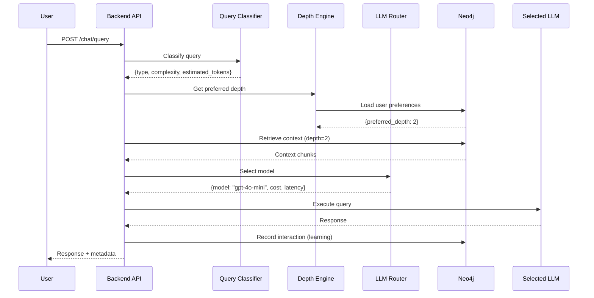

# Spec 026: Intelligent Router System

**Feature**: Sistema de Roteamento Inteligente  
**Priority**: P1 (High)  
**Sprint**: 3 ou 4  
**Effort**: 4 dias  
**Status**: 📋 Planned  

---

## Visão Geral

Sistema que otimiza **custo, latência e qualidade** através de:
1. **Context Depth Control** - Profundidade ajustável de contexto
2. **LLM Router** - Seleção automática do modelo ideal
3. **User Learning** - Aprende preferências ao longo do tempo

---

## Problema

Atualmente, sistemas usam sempre o mesmo modelo (ex: GPT-4o) para todas as queries, resultando em:
- ❌ **Alto custo** - Usa modelo caro mesmo para queries simples
- ❌ **Latência desnecessária** - Busca contexto profundo sempre
- ❌ **Experiência genérica** - Não se adapta ao usuário

---

## Solução

### 1. Context Depth Control

**3 níveis de profundidade**:

```yaml
Level 1 - Surface (Rápido):
  latency: ~500ms
  tokens: ~500
  scope: Resposta direta
  use_case: "Qual o status da startup X?"

Level 2 - Contextual (Balanceado):
  latency: ~2s
  tokens: ~2000
  scope: + Histórico recente + Relacionamentos
  use_case: "Por que rejeitamos a startup X?"

Level 3 - Deep Corporate (Profundo):
  latency: ~5s
  tokens: ~8000
  scope: + Histórico completo + Decisões similares + Estratégia
  use_case: "Como nossa tese de HealthTech evoluiu?"
```

**Aprendizado automático**:
- Sistema aprende qual profundidade o usuário prefere por tipo de query
- Armazena no Neo4j: `(:User)-[:PREFERS_DEPTH {query_type, depth, confidence}]`

### 2. LLM Router

**Seleção inteligente de modelo**:

```typescript
Query Classification → Model Selection:

Simples/Factual        → GPT-4o-mini ($0.15/1M)
Reasoning Complexo     → o1-preview  ($15/1M)
Código                 → Claude Sonnet ($3/1M)
Estratégico/Balanceado → GPT-4o      ($5/1M)
```

**Economia esperada**: 40-60% vs sempre usar GPT-4o

### 3. API Gateway

Endpoints consolidados (ver `_context/API-DESIGN.md`)

---

## Fluxo de Processo



---

## Requisitos Funcionais

### RF-01: Context Depth Manual
- Usuário pode especificar `depth_level: 1|2|3` no request
- Sistema retorna metadata de quantos tokens/chunks foram usados

### RF-02: Context Depth Auto
- Se `depth_level: "auto"`, sistema usa preferência aprendida
- Aprende através de feedback implícito (tokens lidos, tempo de leitura)

### RF-03: LLM Classification
- Classificador rápido (GPT-4o-mini) analisa query
- Retorna: `{type, complexity, estimated_tokens, requires_tools}`

### RF-04: Model Selection
- Baseado em classificação + preferências do usuário
- Considera: custo, velocidade, qualidade
- Permite override manual: `model_preference: "gpt-4o"`

### RF-05: Cost Tracking
- Registra custo de cada query no MongoDB
- Dashboard admin mostra: cost/day, cost/user, savings

### RF-06: Learning Loop
- Sistema aprende depth preferences
- Atualiza confidence score baseado em interações
- Neo4j: `(:User)-[:PREFERS_DEPTH {confidence, learned_from}]`

---

## User Scenarios

### Cenário 1: Usuário Executivo (Prefere Rapidez)

```
Query: "Status da Startup ABC?"

Sistema aprende:
- Usuário quase sempre aceita depth=1
- Tempo médio de leitura: 5 segundos
- Raramente pede mais contexto

Behavior:
depth=1 automaticamente → GPT-4o-mini → Resposta em 500ms
```

### Cenário 2: Analista (Prefere Contexto)

```
Query: "Por que rejeitamos Startup XYZ?"

Sistema aprende:
- Usuário quase sempre pede depth=3
- Lê contexto completo (>30s)
- Faz perguntas de follow-up

Behavior:
depth=3 automaticamente → GPT-4o → Resposta em 5s com contexto completo
```

### Cenário 3: Query Complexa (Reasoning)

```
Query: "Compare nossa estratégia de HealthTech com concorrentes e sugira melhorias"

Classifier detecta:
- type: "strategic"
- complexity: 5
- requires_tools: true

LLM Router:
- Seleciona o1-preview (deep reasoning)
- depth=3 (contexto completo)
- Multi-agent team
```

---

## Entidades Principais

### Neo4j

```cypher
// User Depth Preferences
(:User)-[:PREFERS_DEPTH {
  query_type: "factual" | "decision" | "strategic",
  preferred_depth: 1 | 2 | 3,
  confidence: float,
  learned_from_interactions: int,
  last_updated: datetime
}]->(:ContextStrategy)

// Query History (for learning)
(:QueryLog {
  id: uuid,
  user_id: string,
  query: string,
  classification: object,
  depth_used: int,
  model_used: string,
  tokens_used: int,
  latency_ms: int,
  cost_usd: float,
  user_feedback: "too_shallow" | "too_deep" | "just_right",
  timestamp: datetime
})
```

### MongoDB (Cost Tracking)

```typescript
interface CostLog {
  _id: ObjectId;
  user_id: string;
  query_id: string;
  model: string;
  tokens_input: number;
  tokens_output: number;
  cost_usd: number;
  timestamp: Date;
}

// TTL index: 90 days
db.cost_logs.createIndex({ timestamp: 1 }, { expireAfterSeconds: 7776000 });
```

---

## APIs

Ver detalhamento completo em: `_context/API-DESIGN.md`

**Principais endpoints**:
- `POST /chat/query` - Com depth + model routing
- `POST /llm/route` - Seleção de modelo
- `GET /user/:userId/preferences` - Preferências aprendidas
- `POST /user/:userId/learn-depth` - Feedback para aprendizado

---

## Métricas de Sucesso

### Eficiência
- ✅ Redução de custo: **40-60%** vs sempre GPT-4o
- ✅ Latência média: **<2s** para depth=1/2
- ✅ Accuracy classificador: **>90%**

### User Experience
- ✅ Depth learning accuracy: **>80%** após 20 interações
- ✅ User satisfaction: **>85%** (feedback)

### Cost Savings
```
Baseline (sempre GPT-4o): $5/1M tokens input
Otimizado:
  - 40% queries → GPT-4o-mini: $0.15/1M
  - 40% queries → GPT-4o: $5/1M
  - 20% queries → o1-preview: $15/1M

Custo médio: $4.21/1M tokens
Economia: 16% + melhor qualidade em queries complexas
```

---

## Restrições Técnicas

1. **Classificador deve ser rápido**: <200ms
2. **Aprendizado deve convergir**: <20 interações
3. **Fallback**: Se classifier falha, usa GPT-4o + depth=2
4. **Override sempre disponível**: Usuário pode forçar modelo/depth

---

## Dependencies

| Spec | Dependency | Reason |
|------|------------|--------|
| 005 | **MUST** | Agent Router base |
| 017 | **MUST** | Memory ecosystem |
| 024 | **SHOULD** | Retrieval orchestration |
| 015 | **MUST** | Neo4j graph model |

---

## Implementation Notes

### Phase 1: Classification (2d)
```typescript
// src/services/QueryClassifier.ts
class QueryClassifier {
  async classify(query: string): Promise<QueryClassification> {
    // Use GPT-4o-mini for fast classification
  }
}
```

### Phase 2: Depth Engine (1d)
```typescript
// src/services/DepthEngine.ts
class DepthEngine {
  async getPreferredDepth(userId: string, queryType: string): Promise<number> {
    // Load from Neo4j, use confidence scores
  }
  
  async learn(userId: string, feedback: DepthFeedback): Promise<void> {
    // Update preferences
  }
}
```

### Phase 3: LLM Router (1d)
```typescript
// src/services/LLMRouter.ts
class LLMRouter {
  selectModel(classification: QueryClassification): string {
    // Logic from API-DESIGN.md
  }
}
```

---

## Testing Strategy

```typescript
describe('Intelligent Router', () => {
  it('classifies simple query correctly', async () => {
    const result = await classifier.classify("Status da Startup X?");
    expect(result.type).toBe("factual");
    expect(result.complexity).toBeLessThanOrEqual(2);
  });
  
  it('learns depth preference', async () => {
    // Simulate 10 interactions with depth=1
    for (let i = 0; i < 10; i++) {
      await depthEngine.recordInteraction(userId, {depth: 1, feedback: "just_right"});
    }
    
    const pref = await depthEngine.getPreferredDepth(userId, "factual");
    expect(pref).toBe(1);
  });
  
  it('selects cheaper model for simple queries', async () => {
    const classification = {type: "factual", complexity: 1};
    const model = llmRouter.selectModel(classification);
    expect(model).toBe("gpt-4o-mini");
  });
});
```

---

## Risks & Mitigations

| Risk | Impact | Mitigation |
|------|--------|------------|
| Classifier incorreto | Alto | Fallback para GPT-4o, usuário pode override |
| Depth errado | Médio | Feedback loop rápido, ajusta em <5 interações |
| Custo não reduz | Médio | Monitorar dashboard, ajustar thresholds |

---

**Status**: 📋 Planned  
**Next Steps**: Adicionar ao Sprint 3 após Agent Router (005) funcional
