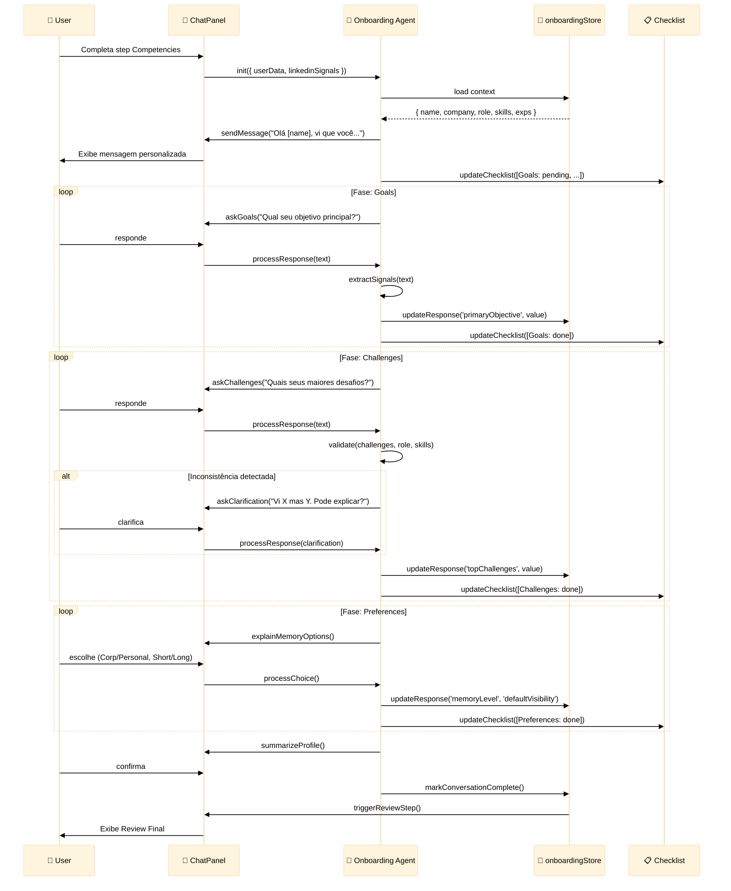

# Specification: Onboarding Conversation Pipeline

**ID**: TRG-SPC-027  
**Feature**: Onboarding Conversation Pipeline (Agent-Guided Chat)  
**Version**: 1.0.0  
**Status**: Draft  
**Created**: 2024-12-14  
**Updated**: 2024-12-14

---

## 1. Overview

### 1.1 What
Sistema de **onboarding guiado por conversa** onde um **Onboarding Agent** conduz o usuário através de perguntas adaptativas no chat, coletando informações de forma fluida e natural. Transição de formulários estáticos para diálogo inteligente.

### 1.2 Why
- **Experiência mais natural**: conversa > formulários rígidos
- **Adaptação dinâmica**: perguntas dependem de respostas anteriores
- **Extração inteligente**: captura sinais além dos campos fixos (competências, contexto, desafios)
- **Validação em tempo real**: agente valida e pede esclarecimentos durante a conversa
- **Persona building**: cria perfil rico baseado em diálogo, não apenas dados estruturados

### 1.3 Success Criteria
- ✅ Onboarding Agent inicia conversa automaticamente após LinkedIn step
- ✅ Agent faz perguntas baseadas em dados já coletados (nome, empresa, cargo, competências)
- ✅ Respostas do usuário são processadas e armazenadas em `onboardingStore`
- ✅ Agent valida inconsistências (ex: cargo vs competências não alinham)
- ✅ Conversa adaptativa: perguntas variam por cargo/setor
- ✅ Checklist de validação visível no sidebar durante onboarding
- ✅ Transição suave: formulários → chat → review final

---

## 2. User Stories

### US-1: Início Automático da Conversa
**Como** usuário que completou os dados básicos  
**Quero** que o Onboarding Agent inicie uma conversa comigo  
**Para** completar meu perfil de forma natural

**Acceptance Criteria**:
- [ ] Após step "Competências (LinkedIn)", chat exibe mensagem do Onboarding Agent
- [ ] Mensagem inicial personalizada: "Olá [nome], vi que você trabalha em [empresa] como [cargo]..."
- [ ] Agent sugere próximos passos: "Vou fazer algumas perguntas para entender melhor seu contexto"

### US-2: Perguntas Adaptativas por Cargo
**Como** Onboarding Agent  
**Quero** fazer perguntas relevantes ao cargo do usuário  
**Para** construir perfil preciso

**Acceptance Criteria**:
- [ ] Cargo "Investment Associate" → perguntas sobre pipeline de deal flow, estágios de investimento
- [ ] Cargo "CEO/Founder" → perguntas sobre produto, mercado, tração
- [ ] Cargo "Product Manager" → perguntas sobre features, roadmap, usuários
- [ ] Cargo genérico → perguntas padrão sobre objetivos e desafios

### US-3: Validação e Esclarecimentos
**Como** Onboarding Agent  
**Quero** validar informações inconsistentes  
**Para** garantir perfil de qualidade

**Acceptance Criteria**:
- [ ] Se competências não alinham com cargo, Agent pergunta: "Vi que você tem [skill X], mas trabalha como [role]. Faz sentido? Pode explicar?"
- [ ] Se experiências são vagas (sem período/empresa), Agent pede clarificação
- [ ] Agent confirma informações críticas: "Então seu objetivo principal é [X]. Correto?"

### US-4: Checklist Visível de Progresso
**Como** usuário em onboarding  
**Quero** ver um checklist do que falta completar  
**Para** entender meu progresso

**Acceptance Criteria**:
- [ ] Sidebar exibe checklist com status:
  - ✅ Dados básicos
  - ✅ LinkedIn/Competências
  - 🔄 Objetivos (em progresso)
  - ⏳ Desafios (pendente)
  - ⏳ Preferências de memória (pendente)
- [ ] Items completados têm ✅, em progresso 🔄, pendentes ⏳
- [ ] Checklist atualiza em tempo real conforme Agent coleta dados

### US-5: Transição Formulário → Chat → Review
**Como** usuário  
**Quero** alternar entre formulários e chat conforme necessário  
**Para** flexibilidade na experiência

**Acceptance Criteria**:
- [ ] Steps "Profile", "Organization", "Competencies" permanecem como formulários (input rápido)
- [ ] Steps "Goals", "AI Profile", "Memory" migram para chat (diálogo)
- [ ] Botão "Continuar no formulário" permite voltar ao modo clássico
- [ ] Review step exibe tanto dados de formulários quanto de chat

---

## 3. Functional Requirements

### FR-1: Onboarding Agent System Prompt
Agent deve ter contexto completo do usuário:
```
Você é o Onboarding Agent do [TENANT_NAME].
Seu objetivo é ajudar [USER_NAME] a completar seu perfil inicial de forma natural e fluida.

Contexto atual:
- Nome: [fullName]
- Email: [email]
- Empresa: [company]
- Cargo: [jobRole]
- Competências: [linkedinCompetencies]
- Experiências: [linkedinExperiences]

Missão:
1. Fazer perguntas para entender objetivos e desafios
2. Validar dados coletados (ex: competências vs cargo)
3. Extrair sinais adicionais (contexto de trabalho, projetos atuais)
4. Construir perfil rico para personalização futura

Tom: profissional, direto, empático. Evite formalismo excessivo.
```

### FR-2: Conversation State Management
- `onboardingStore` adiciona campo `conversationContext`:
  ```typescript
  conversationContext: {
    phase: 'goals' | 'challenges' | 'preferences' | 'validation' | 'done';
    collectedSignals: string[]; // sinais extras capturados
    validationChecklist: Array<{item: string; status: 'done' | 'pending' | 'in_progress'}>;
    messagesCount: number;
  }
  ```
- Agent atualiza `phase` conforme progresso

### FR-3: Adaptive Question Flow
Agent decide próxima pergunta baseado em:
1. **Cargo**: Investment Associate → deal flow, estágios
2. **Competências**: se tem "M&A" → perguntar sobre experiência com aquisições
3. **Experiências**: se trabalhou em startup → perguntar sobre desafios específicos
4. **Respostas anteriores**: se mencionou "escalabilidade" → aprofundar

### FR-4: Validation Logic
Agent valida:
- **Competências vs Cargo**: "Venture Building" + "Analista de RH" → questionar
- **Experiências vazias**: sem empresa/período → pedir complemento
- **Objetivos vagos**: "crescer" → pedir especificidade

### FR-5: Checklist Sidebar Integration
- `OnboardingWizard` renderiza checklist no sidebar
- Items do checklist:
  1. ✅ Dados básicos (nome, email, empresa, cargo)
  2. ✅ Competências & Experiências (LinkedIn)
  3. 🔄 Objetivos principais (em conversa)
  4. 🔄 Desafios atuais (em conversa)
  5. ⏳ Preferências de memória (aguardando)
  6. ⏳ Persona validation (aguardando)
- Atualizado em tempo real conforme Agent coleta

---

## 4. Process Flow

```mermaid
%%{init: {'theme': 'base', 'themeVariables': { 'primaryTextColor': '#000', 'secondaryTextColor': '#000'}}}%%
flowchart TD
    Start([👤 Usuário completa<br/>step Competencies]) --> CheckData[🔍 Sistema verifica<br/>dados coletados]
    
    CheckData --> InitAgent[🤖 Onboarding Agent<br/>recebe contexto:<br/>nome, empresa, cargo,<br/>competências, experiências]
    
    InitAgent --> SendGreeting[💬 Agent envia mensagem<br/>personalizada no chat:<br/>'Olá [nome], vi que você...' ]
    
    SendGreeting --> DisplayChecklist[📋 Sidebar exibe<br/>checklist de progresso]
    
    DisplayChecklist --> PhaseGoals[📍 Phase: GOALS<br/>Agent pergunta sobre<br/>objetivos principais]
    
    PhaseGoals --> UserResponds1[👤 Usuário responde<br/>via chat]
    
    UserResponds1 --> AgentProcesses1[🧠 Agent processa<br/>e extrai sinais]
    
    AgentProcesses1 --> UpdateStore1[💾 Atualiza onboardingStore:<br/>primaryObjective, signals]
    
    UpdateStore1 --> UpdateChecklist1[✅ Checklist: Objetivos → done]
    
    UpdateChecklist1 --> PhaseChall[📍 Phase: CHALLENGES<br/>Agent pergunta sobre<br/>maiores desafios]
    
    PhaseChall --> UserResponds2[👤 Usuário responde]
    
    UserResponds2 --> AgentProcesses2[🧠 Agent analisa<br/>e identifica gaps]
    
    AgentProcesses2 --> Validate{Dados consistentes?}
    
    Validate -->|Sim| UpdateStore2[💾 Atualiza: topChallenges]
    Validate -->|Não| AskClarification[❓ Agent pede<br/>esclarecimento:<br/>'Vi que você disse X,<br/>mas Y. Pode explicar?']
    
    AskClarification --> UserClarifies[👤 Usuário clarifica]
    UserClarifies --> AgentProcesses2
    
    UpdateStore2 --> UpdateChecklist2[✅ Checklist: Desafios → done]
    
    UpdateChecklist2 --> PhaseMemory[📍 Phase: PREFERENCES<br/>Agent explica opções<br/>de memória]
    
    PhaseMemory --> UserChooses[👤 Usuário escolhe<br/>defaultVisibility,<br/>memoryLevel]
    
    UserChooses --> UpdateStore3[💾 Atualiza preferências]
    
    UpdateStore3 --> PhaseValidation[📍 Phase: VALIDATION<br/>Agent resume perfil<br/>e confirma]
    
    PhaseValidation --> UserConfirms{Usuário confirma?}
    
    UserConfirms -->|Sim| MarkComplete[✅ Marca conversation<br/>como completa]
    UserConfirms -->|Não| AskChanges[🔄 Agent pergunta<br/>o que ajustar]
    
    AskChanges --> EditData[✏️ Usuário edita<br/>no chat ou formulário]
    EditData --> PhaseValidation
    
    MarkComplete --> ShowReview[📋 Exibe Review Step<br/>com todos os dados]
    
    ShowReview --> FinalConfirm[✅ Usuário confirma<br/>e conclui onboarding]
    
    FinalConfirm --> Done([🎉 Onboarding completo])
    
    classDef agentStyle fill:#fff3e0,stroke:#ff9800,stroke-width:2px
    classDef userStyle fill:#e3f2fd,stroke:#1976d2,stroke-width:2px
    classDef successStyle fill:#e8f5e9,stroke:#4caf50,stroke-width:2px
    classDef validationStyle fill:#fce4ec,stroke:#c2185b,stroke-width:2px
    
    class InitAgent,SendGreeting,AgentProcesses1,AgentProcesses2,AskClarification,PhaseGoals,PhaseChall,PhaseMemory,PhaseValidation agentStyle
    class UserResponds1,UserResponds2,UserClarifies,UserChooses,UserConfirms,EditData,FinalConfirm userStyle
    class MarkComplete,Done,UpdateChecklist1,UpdateChecklist2 successStyle
    class Validate validationStyle
```

---

## 5. Agent Collaboration Diagram



---

## 6. Data Model Extensions

### Onboarding Store Updates
```typescript
interface OnboardingResponses {
  // Existing fields...
  
  // NEW: Conversation context
  conversationPhase: 'goals' | 'challenges' | 'preferences' | 'validation' | 'done';
  conversationSignals: string[]; // Extra signals captured
  conversationMessagesCount: number;
  conversationStartedAt: string | null;
  conversationCompletedAt: string | null;
  
  // NEW: Validation checklist
  validationChecklist: Array<{
    item: string;
    status: 'done' | 'pending' | 'in_progress';
    updatedAt: string;
  }>;
}
```

### Agent Message Format
```typescript
interface OnboardingAgentMessage {
  role: 'assistant';
  content: string;
  metadata: {
    phase: string;
    intent: 'question' | 'validation' | 'clarification' | 'summary';
    targetField?: keyof OnboardingResponses;
  };
}
```

---

## 7. UI/UX Requirements

### Chat Integration
- **Agent Avatar**: ícone diferenciado (🤖 ou logo do tenant)
- **System Message Style**: fundo levemente colorido (azul claro) para diferenciar de user messages
- **Typing Indicator**: "Onboarding Agent está digitando..." durante processamento

### Checklist Sidebar
```
┌─────────────────────────────┐
│ ✅ Dados básicos            │
│ ✅ Competências (LinkedIn)  │
│ 🔄 Objetivos (em andamento) │
│ ⏳ Desafios                 │
│ ⏳ Preferências de memória  │
│ ⏳ Validação final          │
└─────────────────────────────┘
```

### Transition Indicators
- Quando transita de formulário → chat: toast "Vamos continuar conversando! Responda no chat abaixo."
- Opção "Voltar ao formulário" sempre visível (usuário pode preferir preencher manualmente)

---

## 8. Testing Strategy

### Unit Tests
- Agent system prompt gerado corretamente com contexto do usuário
- `extractSignals()` identifica objetivos/desafios em respostas naturais
- Validation logic detecta inconsistências (cargo vs skills)

### Integration Tests
- Fluxo completo: Formulários → Chat (Goals) → Chat (Challenges) → Review
- Checklist atualiza em tempo real conforme Agent progride
- Store persiste conversationContext entre sessões

### E2E Tests (Playwright)
- Usuário completa onboarding via chat
- Agent faz perguntas adaptativas baseadas em cargo
- Inconsistências são questionadas e resolvidas

---

## 9. Dependencies

- **Spec 026**: Invite-Only Auth (pré-cadastro fornece dados iniciais)
- **Frontend**: `ChatPanel.tsx`, `OnboardingWizard.tsx`, `onboarding-store.ts`
- **Agent**: Onboarding Agent (LLM com system prompt customizado)
- **LLM**: Azure OpenAI (GPT-4 ou similar para conversação)

---

## 10. Implementation Phases

### Phase 1: Basic Conversation Flow
- Agent inicia conversa após step Competencies
- Perguntas fixas sobre Goals e Challenges
- Respostas armazenadas em store

### Phase 2: Adaptive Questions
- Agent decide perguntas baseado em cargo/competências
- Validation logic implementada

### Phase 3: Checklist Integration
- Sidebar mostra progresso em tempo real
- Checklist persiste no store

### Phase 4: Review & Refinement
- Agent resume perfil antes de Review Step
- Usuário pode editar via chat ou voltar a formulários

---

## 11. Open Questions

- [ ] **[Q1]**: Agent deve usar streaming (mensagens aparecem gradualmente) ou enviar completas?
  - **Resposta provisória**: Streaming para melhor UX, mas não bloqueante.

- [ ] **[Q2]**: Quantas mensagens mínimas o Agent deve trocar antes de considerar onboarding "completo"?
  - **Resposta provisória**: Mínimo 6 (2 por fase: Goals, Challenges, Preferences).

- [ ] **[Q3]**: Permitir usuário pular conversa e ir direto ao Review?
  - **Resposta provisória**: Sim, via botão "Pular para revisão" (mas não recomendado).

---

## 12. Related Artifacts

- **Spec 026**: Invite-Only Auth (fornece dados pré-cadastro)
- **Spec 022**: Onboarding & AI Profile (estrutura de onboarding existente)
- **Constitution**: Princípio II (User-Centric Communication), Princípio VIII (Iterative Completeness)
- **Plan**: TBD (após aprovação desta spec)

---

> **Status**: 🟡 Draft - Aguardando validação  
> **Next Step**: Validar → Implementar → Testar fluxo completo
