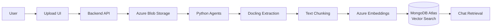
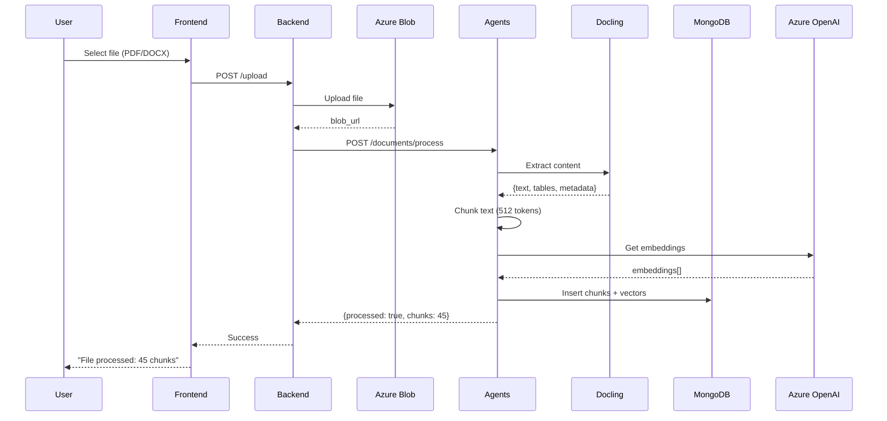

# Spec 028: File Upload & Processing

**Feature**: Upload de arquivos (PDF/DOCX) com extração e indexação  
**Priority**: P1 (MVP v1)  
**Sprint**: 1  
**Effort**: 3 dias  
**Status**: 📋 Planned  

---

## Visão Geral

Usuário pode **anexar arquivos** (PDF, DOCX, TXT) no chat. Sistema extrai conteúdo usando **Docling**, chunka texto, gera embeddings e indexa em **MongoDB Atlas** para retrieval.

---

## Problema

- Usuário quer discutir documentos específicos
- Contexto relevante está em PDFs/DOCX corporativos
- Sistema precisa "ler" o documento para responder perguntas

---

## Solução

### Architecture



### Flow



---

## Requisitos Funcionais

### RF-01: File Upload UI
- Drag & drop ou click to upload
- Suporte: PDF, DOCX, TXT (max 10MB)
- Preview do arquivo antes de enviar
- Progress bar durante upload

### RF-02: File Storage
- Upload para Azure Blob Storage
- Organização: `{user_id}/{conversation_id}/{filename}`
- Metadata: filename, size, mime_type, upload_date

### RF-03: Document Extraction (Docling)
- Extração de texto completo
- Preservar estrutura (headings, paragraphs)
- Extrair tabelas (opcional MVP)
- OCR para PDFs escaneados (fallback Azure Document Intelligence)

### RF-04: Text Chunking
- Chunk size: 512 tokens (overlap 50 tokens)
- Preserve sentence boundaries
- Metadata por chunk: page, section, file_id

### RF-05: Vector Indexing
- Generate embeddings (Azure text-embedding-3-small)
- Store em MongoDB Atlas collection `knowledge_nodes`
- Vector index para semantic search

### RF-06: Chat Integration
- Attach file → processa automaticamente
- Chat retrieval considera chunks do arquivo
- User pode perguntar: "O que diz o documento sobre X?"

---

## Requisitos Não-Funcionais

### RNF-01: Performance
- Upload: <5s para 5MB
- Processing: <30s para 50 páginas PDF
- Indexação: <1s por chunk

### RNF-02: Scalability
- Suporta até 100 arquivos por usuário
- Suporta PDFs até 10MB (MVP), 50MB (future)

### RNF-03: Reliability
- Retry logic para falhas de extração
- Fallback: Docling → Azure Document Intelligence

---

## Entidades

### MongoDB Collections

```javascript
// files
{
  _id: ObjectId,
  user_id: ObjectId,
  conversation_id: ObjectId,
  filename: string,
  original_filename: string,
  blob_url: string,
  mime_type: string,
  size_bytes: number,
  status: "uploading" | "processing" | "ready" | "failed",
  processing_metadata: {
    pages: number,
    chunks_created: number,
    extraction_method: "docling" | "azure_di",
    processing_time_ms: number
  },
  created_at: Date,
  processed_at: Date?
}

// knowledge_nodes (vector-indexed)
{
  _id: ObjectId,
  type: "file_chunk",
  content: string,  // Chunk text
  embedding: [1536 floats],  // Vector
  metadata: {
    file_id: ObjectId,
    user_id: ObjectId,
    filename: string,
    page: number,
    chunk_index: number,
    total_chunks: number
  },
  created_at: Date
}

// Vector index
db.knowledge_nodes.createIndex(
  { embedding: "vector" },
  {
    name: "vector_index",
    vectorDimension: 1536,
    vectorSimilarity: "cosine"
  }
)
```

---

## APIs

### Backend (Node.js)

```typescript
// POST /upload
// Multipart form upload
interface UploadRequest {
  file: File;
  conversation_id: string;
}

interface UploadResponse {
  file_id: string;
  blob_url: string;
  status: "uploading" | "processing";
}

// GET /files/:file_id/status
interface FileStatusResponse {
  file_id: string;
  status: "processing" | "ready" | "failed";
  progress: number;  // 0-100
  chunks_created: number?;
  error: string?;
}
```

### Agents (Python)

```python
# POST /documents/process
class ProcessDocumentRequest(BaseModel):
    file_id: str
    blob_url: str
    filename: str
    user_id: str

class ProcessDocumentResponse(BaseModel):
    file_id: str
    status: Literal["success", "failed"]
    chunks_created: int
    pages: int
    processing_time_ms: int
    error: str | None
```

---

## Implementation

### Phase 1: Upload (Day 1)

**Backend** (Node.js):
```typescript
// src/routes/upload.ts
import { BlobServiceClient } from '@azure/storage-blob';
import multer from 'multer';

const upload = multer({ storage: multer.memoryStorage() });

app.post('/upload', upload.single('file'), async (req, res) => {
  const file = req.file;
  const { conversation_id } = req.body;
  
  // Upload to Azure Blob
  const blobServiceClient = BlobServiceClient.fromConnectionString(
    process.env.AZURE_STORAGE_CONNECTION_STRING!
  );
  const containerClient = blobServiceClient.getContainerClient('eks-uploads');
  const blobName = `${req.user.id}/${conversation_id}/${file.originalname}`;
  const blockBlobClient = containerClient.getBlockBlobClient(blobName);
  
  await blockBlobClient.uploadData(file.buffer);
  
  // Save to MongoDB
  const fileDoc = await db.files.insertOne({
    user_id: req.user.id,
    conversation_id,
    filename: blobName,
    original_filename: file.originalname,
    blob_url: blockBlobClient.url,
    mime_type: file.mimetype,
    size_bytes: file.size,
    status: 'processing',
    created_at: new Date()
  });
  
  // Trigger processing (async)
  await fetch(`${AGENT_SERVER_URL}/documents/process`, {
    method: 'POST',
    body: JSON.stringify({
      file_id: fileDoc.insertedId.toString(),
      blob_url: blockBlobClient.url,
      filename: file.originalname,
      user_id: req.user.id
    })
  });
  
  res.json({
    file_id: fileDoc.insertedId.toString(),
    blob_url: blockBlobClient.url,
    status: 'processing'
  });
});
```

### Phase 2: Extraction (Day 2)

**Agents** (Python):
```python
# src/services/document_processor.py
from docling.document_converter import DocumentConverter
import tempfile
import httpx

class DocumentProcessor:
    def __init__(self):
        self.converter = DocumentConverter()
    
    async def process_document(self, blob_url: str, file_id: str) -> dict:
        # Download from blob
        async with httpx.AsyncClient() as client:
            response = await client.get(blob_url)
            
        # Save to temp file
        with tempfile.NamedTemporaryFile(delete=False, suffix='.pdf') as tmp:
            tmp.write(response.content)
            tmp_path = tmp.name
        
        # Extract with Docling
        result = self.converter.convert(tmp_path)
        
        # Export to markdown (preserves structure)
        markdown_text = result.document.export_to_markdown()
        
        # Chunk text
        chunks = await self.chunk_text(markdown_text, chunk_size=512)
        
        # Generate embeddings + store
        await self.index_chunks(chunks, file_id)
        
        return {
            "pages": len(result.document.pages),
            "chunks_created": len(chunks),
            "extraction_method": "docling"
        }
    
    async def chunk_text(self, text: str, chunk_size: int = 512) -> List[str]:
        """Intelligent chunking with overlap"""
        # Use tiktoken for token-based chunking
        enc = tiktoken.get_encoding("cl100k_base")
        tokens = enc.encode(text)
        
        chunks = []
        overlap = 50
        
        for i in range(0, len(tokens), chunk_size - overlap):
            chunk_tokens = tokens[i:i + chunk_size]
            chunk_text = enc.decode(chunk_tokens)
            chunks.append(chunk_text)
        
        return chunks
    
    async def index_chunks(self, chunks: List[str], file_id: str):
        """Generate embeddings and store in MongoDB"""
        for i, chunk in enumerate(chunks):
            # Get embedding from Azure OpenAI
            embedding = await get_embedding(chunk)
            
            # Insert into MongoDB
            await mongodb_client.knowledge_nodes.insert_one({
                "type": "file_chunk",
                "content": chunk,
                "embedding": embedding,
                "metadata": {
                    "file_id": file_id,
                    "chunk_index": i,
                    "total_chunks": len(chunks)
                },
                "created_at": datetime.utcnow()
            })
```

### Phase 3: Retrieval Integration (Day 3)

```python
# src/services/retrieval.py
async def retrieve_context(query: str, file_id: str | None = None, limit: int = 5):
    """Retrieve relevant chunks for query"""
    
    # Get query embedding
    query_embedding = await get_embedding(query)
    
    # Build MongoDB vector search pipeline
    pipeline = [
        {
            "$vectorSearch": {
                "index": "vector_index",
                "path": "embedding",
                "queryVector": query_embedding,
                "numCandidates": limit * 10,
                "limit": limit
            }
        }
    ]
    
    # Filter by file_id if provided
    if file_id:
        pipeline.insert(0, {
            "$match": {"metadata.file_id": file_id}
        })
    
    # Execute search
    cursor = mongodb_client.knowledge_nodes.aggregate(pipeline)
    results = await cursor.to_list(length=limit)
    
    return results
```

---

## UI Components

### Upload Button

```tsx
// components/FileUpload.tsx
'use client';
import { useState } from 'react';
import { Upload } from 'lucide-react';

export function FileUpload({ conversationId }: { conversationId: string }) {
  const [uploading, setUploading] = useState(false);
  const [progress, setProgress] = useState(0);
  
  const handleUpload = async (file: File) => {
    setUploading(true);
    
    const formData = new FormData();
    formData.append('file', file);
    formData.append('conversation_id', conversationId);
    
    const response = await fetch('/api/upload', {
      method: 'POST',
      body: formData
    });
    
    const data = await response.json();
    
    // Poll status
    pollProcessingStatus(data.file_id);
  };
  
  return (
    <div>
      <input
        type="file"
        accept=".pdf,.docx,.txt"
        onChange={(e) => e.target.files && handleUpload(e.target.files[0])}
        style={{ display: 'none' }}
        id="file-upload"
      />
      <label htmlFor="file-upload">
        <button disabled={uploading}>
          <Upload size={20} />
          {uploading ? 'Processing...' : 'Attach File'}
        </button>
      </label>
    </div>
  );
}
```

---

## User Scenarios

### Scenario 1: Upload & Query

```
1. User clicks "Attach File"
2. Selects "Annual_Report_2024.pdf"
3. Upload progress: 100%
4. Processing: "Extracting content... 45 chunks created"
5. User asks: "Qual foi o EBITDA em 2024?"
6. System retrieves relevant chunks from PDF
7. Bot responds: "Segundo o documento, EBITDA foi R$ 120M..."
```

### Scenario 2: Multi-file Context

```
1. User uploads 3 PDFs: Report Q1, Q2, Q3
2. All processed successfully
3. User asks: "Compare EBITDA across quarters"
4. System retrieves chunks from all 3 files
5. Bot provides comparative analysis
```

---

## Docling Configuration

```bash
# Install
pip install docling

# Optional: GPU support for faster OCR
pip install docling[gpu]
```

```python
# src/config/docling_config.py
from docling.document_converter import DocumentConverter, PdfFormatOption

def create_docling_converter():
    """Configure Docling with best settings for enterprise docs"""
    return DocumentConverter(
        allowed_formats=[PdfFormatOption.PDF, PdfFormatOption.DOCX],
        ocr_enabled=True,  # For scanned PDFs
        table_extraction=True,  # Extract tables
        image_extraction=False  # Skip images for MVP
    )
```

---

## Azure Services

### Azure Blob Storage

```bash
# Environment
AZURE_STORAGE_CONNECTION_STRING=DefaultEndpointsProtocol=https;...
AZURE_STORAGE_CONTAINER=eks-uploads
```

**Setup**:
1. Create Storage Account
2. Create container `eks-uploads`
3. Set CORS (allow uploads from frontend domain)
4. Enable soft delete (optional)

### Azure Document Intelligence (Fallback)

Se Docling falhar (PDF muito complexo), usar Azure DI:

```python
# Fallback extraction
from azure.ai.documentintelligence import DocumentIntelligenceClient

async def extract_with_azure_di(blob_url: str):
    client = DocumentIntelligenceClient(
        endpoint=os.getenv("AZURE_DOCUMENT_INTELLIGENCE_ENDPOINT"),
        credential=AzureKeyCredential(os.getenv("AZURE_DOCUMENT_INTELLIGENCE_KEY"))
    )
    
    poller = await client.begin_analyze_document(
        "prebuilt-read",
        blob_url
    )
    
    result = await poller.result()
    return result.content
```

---

## Testing Strategy

### Unit Tests

```python
def test_chunk_text():
    processor = DocumentProcessor()
    text = "A" * 1000
    chunks = await processor.chunk_text(text, chunk_size=100)
    
    assert len(chunks) > 0
    assert all(len(c) <= 100 for c in chunks)

def test_extract_pdf():
    processor = DocumentProcessor()
    result = await processor.process_document("test.pdf", "file_123")
    
    assert result["chunks_created"] > 0
    assert result["pages"] > 0
```

### E2E Tests

```typescript
test('file upload and query', async ({ page }) => {
  await page.goto('/chat');
  
  // Upload file
  await page.setInputFiles('input[type="file"]', 'test-doc.pdf');
  await expect(page.locator('text=Processing')).toBeVisible();
  await expect(page.locator('text=Ready')).toBeVisible({ timeout: 30000 });
  
  // Query about file
  await page.fill('input[placeholder="Type"]', 'What does the document say?');
  await page.click('button[type="submit"]');
  
  // Should see response citing the document
  await expect(page.locator('.message.assistant')).toContainText('document');
});
```

---

## Métricas de Sucesso

- ✅ Suporta PDF, DOCX, TXT (até 10MB)
- ✅ Extraction accuracy >95%
- ✅ Processing <30s para 50 páginas
- ✅ Retrieval relevance >80%
- ✅ 70%+ usuários anexam pelo menos 1 arquivo nas primeiras sessões

---

## Dependencies

| Spec | Dependency | Reason |
|------|------------|--------|
| 007 | **MUST** | Chat Knowledge Capture (base) |
| 001 | **SHOULD** | Knowledge Pipeline (indexing) |

---

## Risks & Mitigations

| Risk | Impact | Mitigation |
|------|--------|------------|
| Docling falha em PDFs complexos | Alto | Fallback para Azure Document Intelligence |
| Large files (>10MB) | Médio | Limit size, show error message |
| Processing timeout | Médio | Async processing + polling status |
| Storage costs | Baixo | Monitor usage, cleanup old files |

---

## Future Enhancements

- ⏳ Suportar imagens (PNG, JPG)
- ⏳ Extrair tabelas e renderizar
- ⏳ Multiple files em uma mensagem
- ⏳ File preview no chat
- ⏳ Delete/manage uploaded files

---

**Status**: 📋 Planned (Sprint 1)  
**Next**: Implementar após Voice Input (Spec 027)
