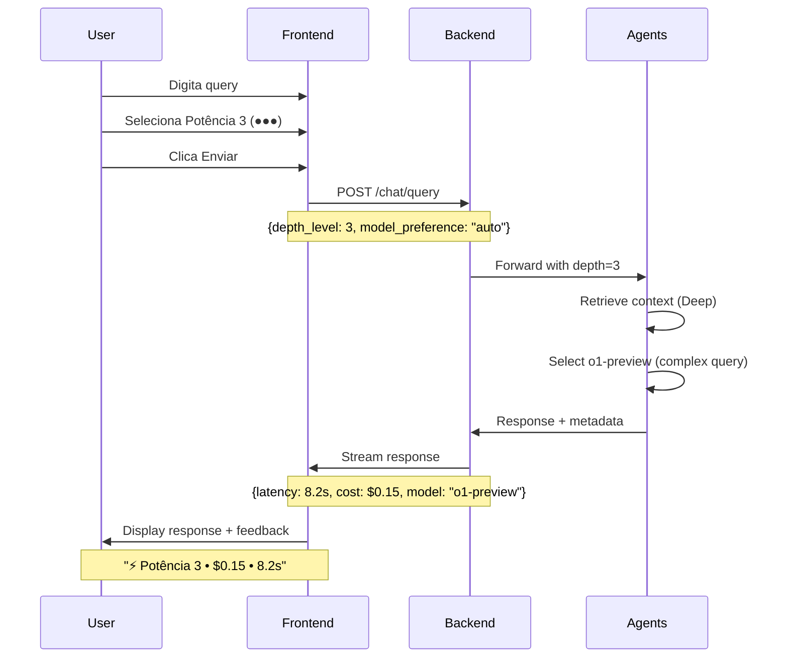
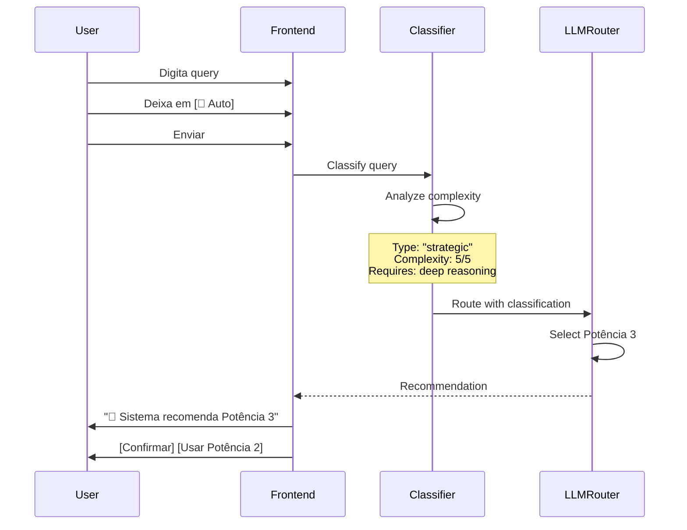

# Spec 030: Corporate Mode & Potência Ajustável

**Feature**: Modo corporativo com profundidade de resposta configurável pelo usuário  
**Priority**: P1 (MVP v1 - Core)  
**Sprint**: 1-2  
**Effort**: 3 dias  
**Status**: 📋 Planned  

---

## Visão Geral

Sistema que permite ao usuário **declarar o contexto** (corporativo vs pessoal) e **ajustar a potência/profundidade** da resposta baseado na complexidade percebida do problema. Integra com **Context Depth Control** (Spec 026) e **LLM Router** para otimizar custo, latência e qualidade.

---

## Problema

- Usuário não consegue indicar se pergunta é corporativa (compartilhável) ou pessoal (privada)
- Sistema não permite ajuste de profundidade de análise
- Queries simples recebem respostas muito elaboradas (desperdício)
- Queries complexas recebem respostas superficiais (insuficiente)
- Não há feedback sobre "potência" usada na resposta

---

## Solução

### 1. Corporate vs Personal Mode

**Toggle Visual** no chat input:

```
┌─────────────────────────────────────┐
│ [📂 Corporativo ▼] [🎤] [📎]        │
│                                     │
│ Digite sua mensagem...              │
│                                     │
│ [Potência: ●●○] [🔄 Auto]   [Enviar]│
└─────────────────────────────────────┘
```

**Comportamento**:
- **Corporativo**: Contexto compartilhado com equipe/área
  - Gravado em `:Knowledge` com `visibility: 'corporate'`
  - Acessível por outros usuários da mesma área/projeto
  - Aparece em buscas corporativas
  
- **Pessoal**: Contexto privado do usuário
  - Gravado em `:Knowledge` com `visibility: 'personal'`
  - Apenas usuário vê
  - Não aparece em buscas corporativas

### 2. Potência Ajustável (3 Níveis)

**Integração com Spec 026 (Context Depth)**:

```
Potência 1 (●○○) - Rápida
├─ Context Depth: 1 (Surface)
├─ LLM: GPT-4o-mini
├─ Latência: ~1s
└─ Use Case: Queries factuais, status rápido

Potência 2 (●●○) - Balanceada (Default)
├─ Context Depth: 2 (Contextual)
├─ LLM: GPT-4o
├─ Latência: ~3s
└─ Use Case: Análises médias, decisões operacionais

Potência 3 (●●●) - Profunda
├─ Context Depth: 3 (Deep Corporate)
├─ LLM: o1-preview (reasoning)
├─ Latência: ~8s
└─ Use Case: Decisões estratégicas, análises complexas
```

**Visual Feedback**:
```
[Bot] ⚡ Potência 2 usada (Balanceada)
💰 Custo: $0.02 • ⏱️ Tempo: 2.8s

Startup A apresenta indicadores saudáveis:
• Receita: +35% vs Q3
• Burn rate controlado
• Runway: 18 meses

[Ver análise profunda ●●●] [Exportar]
```

---

## User Flow

### Scenario 1: Usuário ajusta potência manualmente



### Scenario 2: Modo Auto (Sistema decide)



---

## Briefing de Dificuldade (User Input)

Usuário pode dar **hint** sobre complexidade:

```
┌─────────────────────────────────────┐
│ Como está a Startup A?              │
│                                     │
│ [Adicionar briefing ▼]              │
│   ☐ Query simples (status rápido)  │
│   ☐ Query média (análise básica)   │
│   ☑️ Query complexa (decisão crítica)│
└─────────────────────────────────────┘
```

**Metadata gravado**:
```javascript
{
  query: "Como está a Startup A?",
  user_briefing: {
    complexity_hint: "complex",
    reason: "Preciso tomar decisão de investimento",
    urgency: "high"
  }
}
```

Sistema usa esse **briefing como sinal** para:
- Forçar Potência 3 mesmo se query parecer simples
- Priorizar retrieval de documentos críticos
- Usar modelo de reasoning (o1-preview)

---

## Persistência & Aprendizado

### User Preferences (Neo4j)

```cypher
(:User)-[:HAS_DEPTH_PREFERENCE]->(:DepthPreference {
  query_type: "factual" | "decision" | "strategic",
  preferred_depth: 1 | 2 | 3,
  confidence: float,  // 0-1
  learned_from_interactions: int,
  last_updated: timestamp
})
```

**Learning Algorithm**:
1. Track: usuário escolhe Potência X para query tipo Y
2. Após N interações (N=10), calcular preferência
3. Se 80%+ queries "strategic" usam Potência 3 → auto-sugerir
4. Atualizar `confidence` score

**Exemplo**:
```
Interação 1-5: Usuário sempre muda de Potência 2 → 3 para queries de investimento
Interação 6+: Sistema auto-sugere Potência 3 para queries similares
```

---

## Integração com Spec 026 (LLM Router)

### Context Depth Mapping

| Potência | Context Depth (026) | Tokens | Chunks |
|----------|---------------------|--------|--------|
| 1 (●○○)  | Level 1 (Surface)   | ~500   | 1-2    |
| 2 (●●○)  | Level 2 (Contextual)| ~2000  | 5-10   |
| 3 (●●●)  | Level 3 (Deep)      | ~8000  | 20-40  |

### LLM Selection Logic

```python
# src/services/power_selector.py
async def select_power_settings(
    query: str,
    user_power: int | None,  # Manual selection
    user_briefing: dict | None,
    user_preferences: DepthPreference
) -> PowerSettings:
    """
    Determine power settings based on:
    - Manual user selection (highest priority)
    - User briefing hints
    - Query classification
    - Learned preferences
    """
    
    # 1. Manual override
    if user_power:
        return PowerSettings(
            depth_level=user_power,
            model=select_model_for_depth(user_power),
            reasoning="User manual selection"
        )
    
    # 2. Briefing hint
    if user_briefing and user_briefing.get('complexity_hint') == 'complex':
        return PowerSettings(
            depth_level=3,
            model="o1-preview",
            reasoning="User flagged as complex"
        )
    
    # 3. Classify query
    classification = await classify_query(query)
    
    # 4. Check learned preferences
    if classification.type in user_preferences:
        pref = user_preferences[classification.type]
        if pref.confidence > 0.8:
            return PowerSettings(
                depth_level=pref.preferred_depth,
                model=select_model_for_depth(pref.preferred_depth),
                reasoning=f"Learned preference (confidence: {pref.confidence})"
            )
    
    # 5. Default based on classification
    if classification.complexity >= 4:
        return PowerSettings(depth_level=3, model="o1-preview")
    elif classification.complexity >= 2:
        return PowerSettings(depth_level=2, model="gpt-4o")
    else:
        return PowerSettings(depth_level=1, model="gpt-4o-mini")
```

---

## UI Components

### Power Selector

```tsx
// components/PowerSelector.tsx
'use client';

export function PowerSelector({ 
  value, 
  onChange,
  isAuto,
  onAutoToggle 
}: PowerSelectorProps) {
  return (
    <div className="flex items-center gap-2">
      <label className="text-xs text-muted-foreground">Potência:</label>
      
      {/* Manual selector */}
      <div className="flex gap-1">
        {[1, 2, 3].map(level => (
          <button
            key={level}
            onClick={() => onChange(level)}
            disabled={isAuto}
            className={cn(
              "w-8 h-8 rounded-full",
              value >= level ? "bg-primary" : "bg-muted"
            )}
          >
            {value >= level ? "●" : "○"}
          </button>
        ))}
      </div>
      
      {/* Auto toggle */}
      <button
        onClick={onAutoToggle}
        className={cn(
          "text-xs px-2 py-1 rounded",
          isAuto ? "bg-primary text-white" : "bg-muted"
        )}
      >
        {isAuto ? "🔄 Auto" : "Manual"}
      </button>
      
      {/* Info tooltip */}
      <Tooltip content={getPowerDescription(value)} />
    </div>
  );
}

function getPowerDescription(level: number): string {
  const descriptions = {
    1: "Rápida: Respostas diretas (~1s, $0.001)",
    2: "Balanceada: Análise contextual (~3s, $0.02)",
    3: "Profunda: Reasoning complexo (~8s, $0.15)"
  };
  return descriptions[level];
}
```

### Corporate Toggle

```tsx
// components/CorporateToggle.tsx
export function CorporateToggle({ 
  value, 
  onChange 
}: CorporateToggleProps) {
  return (
    <button
      onClick={() => onChange(!value)}
      className={cn(
        "flex items-center gap-2 px-3 py-1 rounded-lg text-sm",
        value 
          ? "bg-blue-50 text-blue-700 border-blue-200" 
          : "bg-purple-50 text-purple-700 border-purple-200"
      )}
    >
      {value ? "📂 Corporativo" : "🔒 Pessoal"}
      <ChevronDown size={14} />
    </button>
  );
}
```

---

## Requisitos Funcionais

### RF-CM-001: Toggle Corporativo/Pessoal
- Chat input DEVE ter toggle visível entre modos
- Seleção DEVE ser persistida por conversa
- Modo DEVE afetar `visibility` do knowledge gravado

### RF-CM-002: Potência Manual (3 níveis)
- Usuário DEVE poder selecionar 1, 2 ou 3 manualmente
- Seleção DEVE mapear para Context Depth (Spec 026)
- Feedback visual DEVE mostrar latência + custo real

### RF-CM-003: Modo Auto
- Sistema DEVE classificar query automaticamente
- Auto-suggestion DEVE aparecer ANTES de processar
- Usuário DEVE poder override da sugestão

### RF-CM-004: Briefing de Dificuldade
- Opcional: usuário PODE adicionar hint de complexidade
- Hint DEVE ter peso maior que classificação automática
- Metadata DEVE ser gravado para tracking

### RF-CM-005: Aprendizado de Preferências
- Sistema DEVE track escolhas por tipo de query
- Após N=10 interações, calcular preferência
- Confidence >0.8 DEVE auto-aplicar preferência

### RF-CM-006: Feedback Transparente
- Response DEVE incluir metadata:
  - Potência usada
  - Modelo LLM usado
  - Latência real
  - Custo estimado
  - Reasoning (por que essa potência)

---

## Data Model

### Message Metadata (MongoDB)

```javascript
{
  _id: ObjectId,
  conversation_id: ObjectId,
  role: "user",
  content: string,
  metadata: {
    corporate_mode: boolean,
    power_level: 1 | 2 | 3,
    power_selection: "manual" | "auto" | "learned",
    user_briefing: {
      complexity_hint: "simple" | "medium" | "complex",
      reason: string,
      urgency: "low" | "medium" | "high"
    },
    // Response metadata
    depth_used: number,
    model_used: string,
    latency_ms: number,
    cost_usd: number,
    chunks_retrieved: number
  },
  created_at: Date
}
```

### Neo4j Knowledge Visibility

```cypher
// Corporate knowledge
(:Knowledge {
  id: uuid,
  content: text,
  visibility: 'corporate',  // ← Key field
  scope: {
    company_id: uuid,
    area_id: uuid,
    project_id: uuid
  },
  created_by: uuid,
  created_at: timestamp
})

// Personal knowledge
(:Knowledge {
  id: uuid,
  content: text,
  visibility: 'personal',  // ← Only creator sees
  created_by: uuid,
  created_at: timestamp
})
```

---

## User Scenarios

### Scenario 1: Executivo precisa decisão rápida

```
[User] Seleciona: Corporativo, Potência 1
[User] "Status da Startup A?"

[System] ⚡ Potência 1 (Rápida) • $0.001 • 0.8s
[Bot] Startup A: Ativa, Series A, runway 18m.

[Ver mais detalhes ●●○]
```

### Scenario 2: Analista precisa deep dive

```
[User] Seleciona: Corporativo, Potência 3
[User] Adiciona briefing: "Decisão crítica de investimento"
[User] "Devo investir na Startup A?"

[System] ⚡ Potência 3 (Profunda) • o1-preview • $0.18 • 12s
[Bot] Análise profunda da Startup A:

[Expande análise completa com reasoning chains]

Recomendação: ✅ Investir
Confidence: 87%
Riscos identificados: 3
Oportunidades: 5

[Exportar relatório] [Agendar reunião]
```

### Scenario 3: Sistema aprende e sugere

```
[User] Pergunta sobre investimento (10ª vez)
[System] 🤖 Detectei query estratégica.
         Recomendo Potência 3 (você usa em 90% dos casos similares)
         
         [Confirmar ●●●] [Usar ●●○]

[User] Confirmar
[System] Processa com Potência 3
```

---

## Métricas de Sucesso

- ✅ 80%+ usuários usam toggle corporativo/pessoal
- ✅ Modo Auto accuracy >85% após calibração
- ✅ User override rate <20% (indica boa predição)
- ✅ Custo médio reduzido 30% vs sempre usar Potência 3
- ✅ Satisfação com profundidade: >4.2/5

---

## Dependencies

| Spec | Dependency | Reason |
|------|------------|--------|
| 026 | **MUST** | Context Depth + LLM Router (base técnica) |
| 029 | **MUST** | UX Professional (UI integration) |
| 009 | **SHOULD** | User Memory Decision (visibilidade) |

---

## Implementation Notes

### Phase 1: UI Components (1d)
- PowerSelector component
- CorporateToggle component
- Feedback metadata display

### Phase 2: Backend Integration (1d)
- Power settings logic
- Integrate with Spec 026 APIs
- Metadata persistence

### Phase 3: Learning Algorithm (1d)
- Preference tracking
- Confidence calculation
- Auto-suggestion logic

---

## Testing Strategy

```typescript
describe('Corporate Mode & Power', () => {
  it('should toggle corporate/personal mode', () => {
    // Test toggle
    // Verify metadata
    // Check visibility in knowledge
  });
  
  it('should adjust power level manually', () => {
    // Set power 1, 2, 3
    // Verify depth mapping
    // Check model selection
  });
  
  it('should learn user preferences', () => {
    // Simulate 10 interactions
    // Verify preference creation
    // Check auto-suggestion
  });
  
  it('should respect user briefing', () => {
    // Add complexity hint
    // Verify power override
    // Check reasoning metadata
  });
});
```

---

## Cost Analysis

### Savings vs Always Power 3

**Baseline** (sempre Potência 3):
- 100 queries/day
- Custo: $0.15/query
- Total: $15/day = $450/month

**Com Power Selector** (distribuição inteligente):
- 40% queries Potência 1: $0.001 × 40 = $0.04
- 40% queries Potência 2: $0.02 × 40 = $0.80
- 20% queries Potência 3: $0.15 × 20 = $3.00
- **Total**: $3.84/day = $115/month

**Economia**: **74%** ($335/month)

---

**Status**: 📋 Planned (Sprint 1-2)  
**Next**: Implementar após Spec 026 (LLM Router) e 029 (UX)
