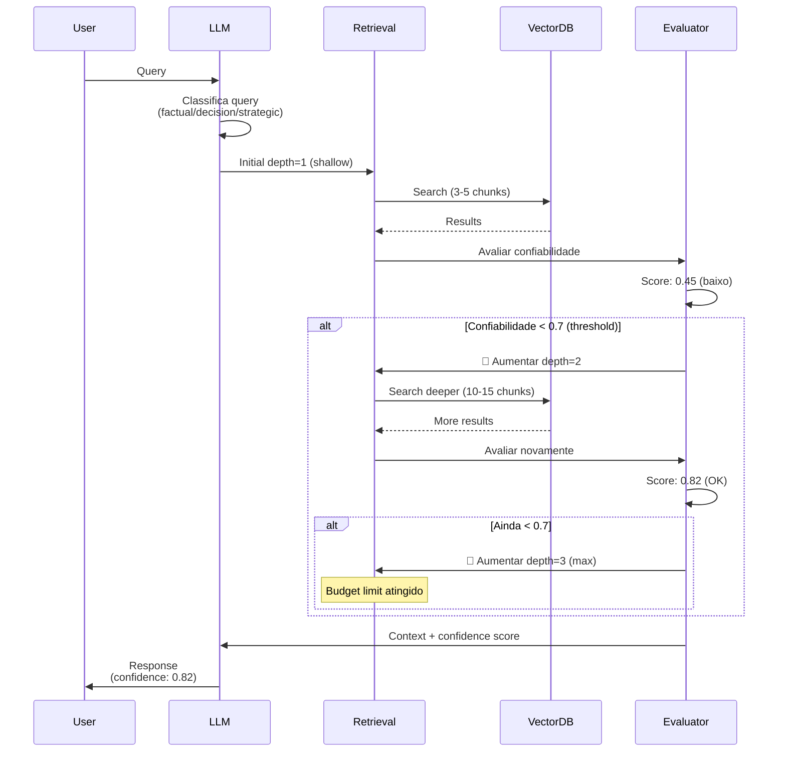

# Spec 032: Adaptive Retrieval Depth

**Feature**: IA decide automaticamente a profundidade de busca baseada na confiabilidade necessária  
**Priority**: P2 (Otimização MVP v1)  
**Sprint**: 2-3  
**Effort**: 4 dias  
**Status**: 📋 Planned  

---

## Visão Geral

Sistema que permite à IA **decidir autonomamente** quantos níveis de profundidade vai buscar no retrieval, baseado em:
- **Confiabilidade necessária** da resposta
- **Tipo de query** (factual vs estratégica)
- **Contexto disponível** (cache vs busca nova)
- **Budget de tokens/custo**

Integra com **Spec 026 (LLM Router)** e **Spec 030 (Potência Ajustável)**.

---

## Problema

- Sistema atual usa profundidade fixa ou escolhida pelo usuário
- Nem toda query precisa de busca profunda (desperdício)
- Queries críticas podem não ter profundidade suficiente
- Falta mecanismo para IA auto-avaliar confiabilidade

---

## Solução: Adaptive Retrieval

### Conceito

**IA faz 2 decisões**:
1. **Antes da busca**: Estimar profundidade necessária
2. **Após a busca**: Avaliar se resultado tem confiabilidade suficiente

Se confiabilidade < threshold → **Buscar mais fundo automaticamente**

---

## Flow: Adaptive Retrieval



---

## Classificação de Query

### Tipos de Query (com threshold de confiabilidade)

| Tipo | Exemplos | Confidence Needed | Initial Depth |
|------|----------|-------------------|---------------|
| **Factual** | "Qual o CEO da Startup A?" | 0.9+ | 1 (shallow) |
| **Operational** | "Status do projeto X?" | 0.7+ | 1 (shallow) |
| **Decision** | "Devo investir na Startup Y?" | 0.85+ | 2 (medium) |
| **Strategic** | "Análise completa do portfólio" | 0.9+ | 3 (deep) |

### Regras de Adaptação

```python
# src/services/adaptive_retrieval.py
class AdaptiveRetrieval:
    CONFIDENCE_THRESHOLDS = {
        'factual': 0.9,
        'operational': 0.7,
        'decision': 0.85,
        'strategic': 0.9
    }
    
    MAX_DEPTH = 3
    MAX_ITERATIONS = 3
    
    async def retrieve(self, query: str, query_type: str):
        threshold = self.CONFIDENCE_THRESHOLDS[query_type]
        
        # Start shallow
        depth = 1
        iterations = 0
        
        while iterations < self.MAX_ITERATIONS:
            # Retrieve at current depth
            results = await self.vector_search(query, depth)
            
            # Evaluate confidence
            confidence = await self.evaluate_confidence(query, results)
            
            # Log decision
            self.log_retrieval({
                'depth': depth,
                'chunks': len(results),
                'confidence': confidence,
                'threshold': threshold
            })
            
            # Check if sufficient
            if confidence >= threshold:
                return {
                    'results': results,
                    'confidence': confidence,
                    'depth_used': depth,
                    'iterations': iterations + 1
                }
            
            # Need more depth?
            if depth >= self.MAX_DEPTH:
                # Hit budget limit
                return {
                    'results': results,
                    'confidence': confidence,
                    'depth_used': depth,
                    'iterations': iterations + 1,
                    'warning': 'Max depth reached, confidence below threshold'
                }
            
            # Go deeper
            depth += 1
            iterations += 1
        
        # Should not reach here
        return results
```

---

## Confidence Evaluation

### Como Avaliar Confiabilidade

**Método 1: LLM Self-Assessment**

```python
async def evaluate_confidence(self, query: str, results: list):
    """
    Pede ao LLM avaliar se os resultados são suficientes
    """
    prompt = f"""
Você tem a seguinte query:
"{query}"

E os seguintes resultados da busca:
{format_results(results)}

Avalie se você consegue responder essa query com ALTA CONFIABILIDADE baseado apenas nesses resultados.

Responda em JSON:
{{
    "confidence": 0.0-1.0,
    "reasoning": "por que esse score",
    "missing_info": ["o que falta para aumentar confiança"]
}}
"""
    
    response = await self.llm.generate(prompt)
    evaluation = json.loads(response)
    
    return evaluation['confidence']
```

**Método 2: Heurísticas**

```python
def calculate_heuristic_confidence(self, query: str, results: list) -> float:
    """
    Calcula confiança baseado em heurísticas
    """
    scores = []
    
    # 1. Coverage: Quantos chunks relevantes?
    relevance_scores = [r['score'] for r in results]
    avg_relevance = sum(relevance_scores) / len(relevance_scores)
    scores.append(avg_relevance)
    
    # 2. Recency: Quão recente é a informação?
    now = datetime.now()
    recencies = [(now - r['created_at']).days for r in results]
    avg_recency = 1.0 / (1 + (sum(recencies) / len(recencies)) / 30)  # Decay mensal
    scores.append(avg_recency)
    
    # 3. Diversity: Fontes diferentes?
    sources = set([r['source_id'] for r in results])
    diversity = min(len(sources) / 3, 1.0)  # Ideal: 3+ fontes
    scores.append(diversity)
    
    # 4. Completeness: Query tem múltiplas partes?
    query_parts = extract_query_parts(query)
    covered_parts = count_covered_parts(query_parts, results)
    completeness = covered_parts / len(query_parts)
    scores.append(completeness)
    
    # Weighted average
    weights = [0.4, 0.2, 0.2, 0.2]  # Relevância é mais importante
    confidence = sum(s * w for s, w in zip(scores, weights))
    
    return confidence
```

---

## Budget Limits (Evitar Loop Infinito)

### Limites de Segurança

```python
class RetrievalBudget:
    """
    Limites para evitar busca infinita
    """
    MAX_DEPTH = 3              # Não vai além de depth 3
    MAX_ITERATIONS = 3         # Tenta no máximo 3 vezes
    MAX_CHUNKS = 50            # Não retorna mais de 50 chunks
    MAX_TOKENS = 10_000        # Contexto máximo (tokens)
    MAX_LATENCY_MS = 5_000     # Timeout 5s
    
    def check_budget(self, current_state: dict) -> bool:
        """
        Retorna False se budget estourou
        """
        if current_state['depth'] > self.MAX_DEPTH:
            return False
        if current_state['iterations'] > self.MAX_ITERATIONS:
            return False
        if current_state['total_chunks'] > self.MAX_CHUNKS:
            return False
        if current_state['elapsed_ms'] > self.MAX_LATENCY_MS:
            return False
        
        return True
```

---

## Integration com Spec 026 (LLM Router)

### Mapping: Adaptive Depth ↔ Potência

| Adaptive Depth | Context Depth (026) | Potência (030) | Chunks |
|----------------|---------------------|----------------|--------|
| 1 (shallow)    | Level 1 (Surface)   | ●○○ (Rápida)   | 3-5    |
| 2 (medium)     | Level 2 (Contextual)| ●●○ (Balanceada)| 10-15  |
| 3 (deep)       | Level 3 (Deep)      | ●●● (Profunda) | 20-40  |

**Quando usar Adaptive vs Manual**:
- **Adaptive (Auto)**: Usuário deixa "Potência: Auto" (Spec 030)
- **Manual**: Usuário força Potência 1, 2 ou 3

```python
async def retrieve_with_mode(self, query: str, user_mode: str, user_depth: int | None):
    """
    Integração com modo manual (Spec 030)
    """
    if user_depth is not None:
        # Usuário forçou profundidade
        return await self.fixed_depth_retrieval(query, user_depth)
    
    if user_mode == 'auto':
        # Adaptive mode
        query_type = classify_query(query)
        return await self.adaptive_retrieval(query, query_type)
    
    # Default: medium depth
    return await self.fixed_depth_retrieval(query, depth=2)
```

---

## Feedback Visual (UI)

### Mostrar Decisão da IA

```
[Bot] 🔍 Buscando informações...

[System] ⚡ Profundidade: 1 (shallow)
         Confiança: 0.45 (baixo)
         🔄 Aumentando para profundidade 2...

[System] ⚡ Profundidade: 2 (medium)
         Confiança: 0.82 (OK ✅)
         📊 15 chunks analisados

[Bot] Startup A apresenta os seguintes indicadores:
...

[Metadata]
📌 Confiança: 82%
📊 Profundidade usada: 2/3
⏱️ Tempo: 2.8s
💰 Custo: $0.03
```

---

## Metrics & Observability

### Tracking de Decisões

```python
# Gravar em MongoDB
retrieval_log = {
    'query_id': uuid,
    'query': str,
    'query_type': 'decision',
    'user_mode': 'auto',
    'iterations': [
        {
            'depth': 1,
            'chunks': 5,
            'confidence': 0.45,
            'threshold': 0.85,
            'decision': 'increase_depth'
        },
        {
            'depth': 2,
            'chunks': 15,
            'confidence': 0.82,
            'threshold': 0.85,
            'decision': 'sufficient'  # Ainda abaixo, mas próximo
        }
    ],
    'final_confidence': 0.82,
    'depth_used': 2,
    'total_chunks': 20,
    'latency_ms': 2800,
    'cost_usd': 0.03,
    'timestamp': datetime.now()
}
```

### Dashboard Metrics

```
Adaptive Retrieval Performance (Última Semana)

┌─────────────────────────────────────────┐
│ Média de Depth Usada: 1.8              │
│ Economia vs Sempre Deep: 45%            │
│ Taxa de Confiança >0.8: 89%            │
│ Queries que precisaram 2+ rounds: 32%  │
└─────────────────────────────────────────┘

Top Queries Iterativas (precisaram depth++)
1. "Análise completa portfólio" → 3 rounds
2. "Projeção Q1 2025 todas startups" → 3 rounds
3. "Risco de burn rate" → 2 rounds
```

---

## Requisitos Funcionais

### RF-AR-001: Classificação Automática
- Sistema DEVE classificar query em um dos 4 tipos
- Cada tipo DEVE ter threshold de confiabilidade definido

### RF-AR-002: Avaliação de Confiabilidade
- Sistema DEVE avaliar confiança após cada retrieval
- DEVE usar LLM self-assessment OU heurísticas
- Score DEVE ser 0.0-1.0

### RF-AR-003: Adaptação Iterativa
- Se confidence < threshold → aumentar depth
- Máximo de 3 iterações (budget limit)
- Log de cada decisão

### RF-AR-004: Budget Limits
- DEVE respeitar MAX_DEPTH=3
- DEVE respeitar MAX_ITERATIONS=3
- DEVE timeout após 5s

### RF-AR-005: Feedback Visual
- Mostrar profundidade usada
- Mostrar score de confiança
- Mostrar quantas iterações

### RF-AR-006: Integration Manual Mode
- Respeitar Potência manual (Spec 030)
- Adaptive APENAS se modo Auto

---

## User Scenarios

### Scenario 1: Query Simples (1 round suficiente)

```
[User] "Qual o CEO da Startup A?"

[System] 
- Classifica: factual (threshold 0.9)
- Depth 1 (3 chunks)
- Confidence: 0.95 ✅
- Responde imediatamente

[Bot] "O CEO da Startup A é Ana Oliveira."
📌 Confiança: 95% | Depth: 1/3 | 0.8s
```

### Scenario 2: Query Complexa (3 rounds)

```
[User] "Análise completa de risco do portfólio"

[System]
- Classifica: strategic (threshold 0.9)
- Round 1: Depth 1 → Confidence 0.52 ❌
- Round 2: Depth 2 → Confidence 0.73 ⚠️
- Round 3: Depth 3 → Confidence 0.88 ✅
- Budget limit (depth 3)

[Bot] [Análise detalhada com 40 chunks]
📌 Confiança: 88% | Depth: 3/3 | 8.2s
⚠️ Confidence abaixo do ideal (90%), mas max depth atingido
```

### Scenario 3: Usuário Force Potência (Override)

```
[User] Seleciona Potência 1 manual
[User] "Análise de risco do portfólio"

[System]
- Ignora adaptive (usuário forçou)
- Usa depth 1 fixo
- Confidence: 0.52 (baixo, mas respeitando user)

[Bot] [Resposta breve]
📌 Confiança: 52% | Depth: 1/3 (manual) | 1.2s
💡 Sugestão: Use Potência 2 ou Auto para análise mais completa
```

---

## Métricas de Sucesso

- ✅ Economia de custo: 40%+ vs sempre usar depth 3
- ✅ Confiança média: >0.8
- ✅ Latência: <5s mesmo com múltiplas iterações
- ✅ Taxa de satisfação: Usuário valida se resposta foi suficiente

---

## Dependencies

| Spec | Dependency | Reason |
|------|------------|--------|
| 026 | **MUST** | LLM Router + Context Depth (base técnica) |
| 030 | **SHOULD** | Potência manual (override adaptive) |
| 001 | **SHOULD** | Knowledge Pipeline (vector search) |

---

## Implementation Notes

### Phase 1: Classificação + Heurística (2d)
- Query classifier
- Heuristic confidence calculation
- Budget limits

### Phase 2: LLM Self-Assessment (1d)
- Prompt para LLM avaliar confiança
- JSON parsing

### Phase 3: Adaptive Loop (1d)
- Iteração depth++
- Logging de decisões
- Integration com Spec 026/030

---

## Testing Strategy

```python
def test_adaptive_retrieval():
    # Test 1: Simple query (1 round)
    result = await adaptive.retrieve("Qual o CEO?", "factual")
    assert result['depth_used'] == 1
    assert result['confidence'] >= 0.9
    
    # Test 2: Complex query (multiple rounds)
    result = await adaptive.retrieve("Análise completa", "strategic")
    assert result['iterations'] > 1
    assert result['confidence'] >= 0.85 or result['depth_used'] == 3
    
    # Test 3: Budget limit
    result = await adaptive.retrieve("Query impossível", "strategic")
    assert result['iterations'] <= 3
    assert result['depth_used'] <= 3
```

---

**Status**: 📋 Planned (Sprint 2-3)  
**Next**: Implementar após Spec 026 (LLM Router)
