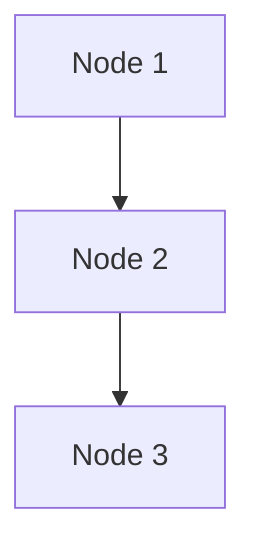
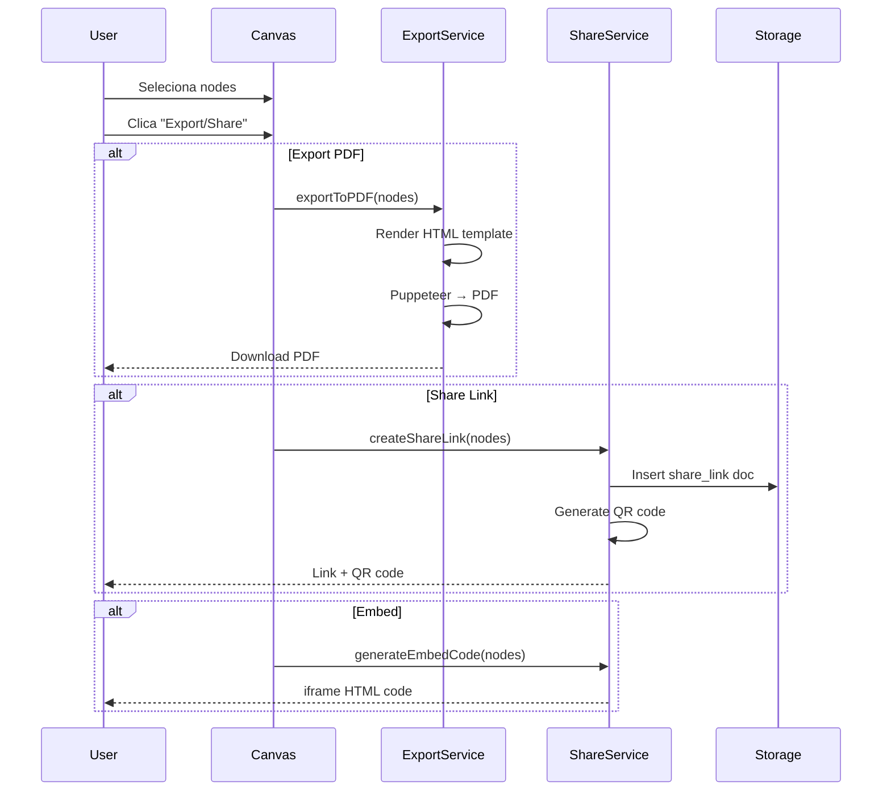

# Spec 035: Export & Share

**Feature**: Exportar e compartilhar insights/canvas com stakeholders  
**Priority**: P1 (MVP importante)  
**Sprint**: 2  
**Effort**: 2 dias  
**Status**: 📋 Planned  

---

## Visão Geral

Sistema para exportar conteúdo do Canvas e compartilhar insights com pessoas fora do sistema, incluindo:
- Export para **PDF, Markdown, JSON**
- **Links públicos** (read-only)
- **Embed** em docs/sites externos
- **QR codes** para mobile

---

## Problema

- Usuário cria insights valiosos no Canvas mas não consegue compartilhar externamente
- Stakeholders sem acesso ao sistema não conseguem ver análises
- Não há forma de gerar relatórios para apresentações
- Falta portabilidade de dados (vendor lock-in)

---

## User Scenarios

### Scenario 1: Analista compartilha relatório com investidor

```
[Analista] Cria análise de startup no Canvas
           → Clica "Export PDF"
           → Sistema gera PDF formatado com:
             - Logo da empresa (theme color)
             - Grafo visual
             - Insights key
             - Metadata (data, autor)
           → Download automático
           
[Analista] Envia PDF por email para investidor
[Investidor] Lê offline, sem precisar de conta
```

### Scenario 2: CEO quer share link público

```
[CEO] Seleciona nodes do Canvas (3 insights)
      → Clica "Share Link"
      → Sistema gera: https://eks.app/share/abc123
      → Toggle: "Allow comments" (opcional)
      
[CEO] Compartilha link no Slack da empresa
[Team] Acessa link → Vê insights read-only
       → Pode comentar (se habilitado)
```

### Scenario 3: Startup founder embeda métricas no pitch deck

```
[Founder] Gera iframe embed code
          → Copia código
          → Cola em Google Slides / Notion
          
[Investidores] Vêem métricas atualizadas em tempo real
               (iframe refresh automático)
```

---

## Export Formats

### 1. PDF Export

**Conteúdo**:
- Header com logo + theme color (Spec 031)
- Título do export
- Grafo visual (screenshot ou render SVG)
- Lista de insights com destaque
- Metadata (autor, data, fonte)

**Opções**:
- Layout: Portrait vs Landscape
- Include graph: Yes/No
- Page breaks: Auto vs Manual
- Watermark: "Confidential" (opcional)

**Tech Stack**:
- Puppeteer (headless Chrome)
- HTML → PDF rendering
- Custom CSS para branding

**Exemplo de uso**:
```typescript
// src/services/export/pdf.ts
import puppeteer from 'puppeteer';

export async function exportToPDF(
  nodes: KnowledgeNode[],
  options: {
    title: string;
    author: string;
    theme_color: string;
    include_graph: boolean;
  }
): Promise<Buffer> {
  const browser = await puppeteer.launch();
  const page = await browser.newPage();
  
  // Render HTML template
  const html = generatePDFTemplate(nodes, options);
  await page.setContent(html);
  
  // Generate PDF
  const pdf = await page.pdf({
    format: 'A4',
    printBackground: true,
    margin: {
      top: '20mm',
      bottom: '20mm',
      left: '15mm',
      right: '15mm'
    }
  });
  
  await browser.close();
  return pdf;
}
```

### 2. Markdown Export

**Formato**:
```markdown
# [Título do Export]

**Autor**: [Nome]  
**Data**: [DD/MM/YYYY]  
**Empresa**: [Nome da empresa]

---

## Insights

### 1. [Título do insight 1]
[Conteúdo completo]

**Metadata**:
- Tipo: [insight/analysis/metric]
- Confidence: [0-100%]
- Fonte: [conversation_id ou file_id]

### 2. [Título do insight 2]
...

---

## Grafo de Conhecimento



---

_Gerado em [timestamp] via EKS_
```

**Uso**:
- Copy/paste em Notion, Obsidian, Roam
- Commit em repositório Git (docs)
- Converter para outros formatos (Pandoc)

### 3. JSON Export

**Formato**:
```json
{
  "export_id": "exp_abc123",
  "title": "Análise Startup X",
  "author": {
    "user_id": "usr_001",
    "name": "Ana Silva"
  },
  "company": {
    "company_id": "cmp_001",
    "name": "CoCreateAI"
  },
  "exported_at": "2024-12-13T18:00:00Z",
  "nodes": [
    {
      "knowledge_id": "kn_001",
      "type": "insight",
      "title": "Burn rate alto",
      "content": "...",
      "metadata": {
        "confidence": 0.85,
        "source": "conv_123"
      }
    }
  ],
  "relationships": [
    {
      "from": "kn_001",
      "to": "kn_002",
      "type": "related_to"
    }
  ]
}
```

**Uso**:
- Import/export entre sistemas
- Backup de dados
- Integração com outros tools (API)

---

## Share Links (Read-Only)

### Public Link Generation

```typescript
// src/services/share.ts
import crypto from 'crypto';

export async function createShareLink(
  nodes: string[],
  options: {
    expires_at?: Date;
    allow_comments?: boolean;
    password_protected?: boolean;
    password?: string;
  }
): Promise<string> {
  // Generate unique token
  const token = crypto.randomBytes(16).toString('hex');
  
  // Store in DB
  await db.collection('share_links').insertOne({
    share_id: `shr_${token}`,
    token: token,
    node_ids: nodes,
    created_by: userId,
    expires_at: options.expires_at || addDays(new Date(), 30),
    allow_comments: options.allow_comments || false,
    password_hash: options.password ? await bcrypt.hash(options.password, 10) : null,
    view_count: 0,
    created_at: new Date()
  });
  
  return `https://eks.app/share/${token}`;
}
```

### Share Page UI

**Rota**: `/share/[token]`

**Features**:
- Header: "Compartilhado por [Nome] de [Empresa]"
- Nodes read-only (não editável)
- Comentários (se habilitado)
- Botão "Request Access" (pedir conta)
- Footer: "Powered by EKS"

**Proteções**:
- Rate limiting (max 100 views/hour)
- Password protection (opcional)
- Expiration date (default 30 dias)
- View tracking (analytics)

---

## Embed (iframe)

### Embed Code Generation

```html
<!-- Embed Code -->
<iframe 
  src="https://eks.app/embed/abc123" 
  width="800" 
  height="600"
  frameborder="0"
  allowfullscreen
></iframe>
```

**Opções**:
- Auto-refresh: True/False (poll a cada 30s)
- Show header: True/False
- Theme: Light/Dark
- Interactive: True (allow navigation) / False (static)

**Segurança**:
- CORS headers configurados
- X-Frame-Options: SAMEORIGIN ou whitelist
- CSP (Content Security Policy)

---

## QR Code

### Generation

```typescript
// src/services/qrcode.ts
import QRCode from 'qrcode';

export async function generateQRCode(shareLink: string): Promise<string> {
  // Generate QR code as data URL
  const qrDataURL = await QRCode.toDataURL(shareLink, {
    width: 300,
    margin: 2,
    color: {
      dark: '#000000',
      light: '#FFFFFF'
    }
  });
  
  return qrDataURL;
}
```

**Uso**:
- Exibir QR no modal "Share"
- Download QR como PNG
- Escanear com celular → abre share link

---

## Implementation Flow



---

## Requisitos Funcionais

### RF-EXP-001: Export Formats
- Sistema DEVE suportar PDF, Markdown, JSON
- PDF DEVE incluir branding (logo, theme color)
- Export DEVE incluir metadata (autor, data)

### RF-EXP-002: Share Links
- Link DEVE ser único e não guessable
- DEVE permitir expiração (default 30 dias)
- DEVE rastrear view count
- PODE ter password protection

### RF-EXP-003: Embed
- iframe DEVE ser responsivo
- DEVE suportar auto-refresh (opcional)
- DEVE ter whitelist de domínios

### RF-EXP-004: QR Code
- DEVE gerar QR code para share links
- QR DEVE ser downloadável como PNG
- Escanear QR DEVE abrir share link no mobile

### RF-EXP-005: Analytics
- DEVE rastrear número de views
- DEVE logar quando foi acessado
- DEVE mostrar ao criador (dashboard)

---

## UI Components

### Export Modal

```tsx
// components/export/ExportModal.tsx
export function ExportModal({ nodes }: { nodes: KnowledgeNode[] }) {
  const [format, setFormat] = useState<'pdf' | 'markdown' | 'json'>('pdf');
  const [options, setOptions] = useState({
    title: '',
    include_graph: true
  });

  const handleExport = async () => {
    const result = await api.export(nodes, format, options);
    
    if (format === 'pdf') {
      // Trigger download
      const blob = new Blob([result.data], { type: 'application/pdf' });
      const url = URL.createObjectURL(blob);
      const a = document.createElement('a');
      a.href = url;
      a.download = `${options.title}.pdf`;
      a.click();
    } else if (format === 'markdown') {
      // Copy to clipboard + download
      navigator.clipboard.writeText(result.data);
      toast.success('Markdown copiado para clipboard!');
    }
  };

  return (
    <Dialog>
      <DialogContent>
        <h2>Export {nodes.length} insights</h2>
        
        <RadioGroup value={format} onValueChange={setFormat}>
          <Radio value="pdf">📄 PDF</Radio>
          <Radio value="markdown">📝 Markdown</Radio>
          <Radio value="json">🗂️ JSON</Radio>
        </RadioGroup>
        
        <Input 
          placeholder="Título do export"
          value={options.title}
          onChange={e => setOptions({ ...options, title: e.target.value })}
        />
        
        <Checkbox 
          checked={options.include_graph}
          onCheckedChange={val => setOptions({ ...options, include_graph: val })}
        >
          Incluir visualização do grafo
        </Checkbox>
        
        <Button onClick={handleExport}>Export</Button>
      </DialogContent>
    </Dialog>
  );
}
```

### Share Modal

```tsx
// components/share/ShareModal.tsx
export function ShareModal({ nodes }: { nodes: KnowledgeNode[] }) {
  const [shareLink, setShareLink] = useState<string | null>(null);
  const [qrCode, setQrCode] = useState<string | null>(null);
  const [options, setOptions] = useState({
    expires_in_days: 30,
    allow_comments: false,
    password: ''
  });

  const handleCreateLink = async () => {
    const result = await api.createShareLink(nodes, options);
    setShareLink(result.data.link);
    setQrCode(result.data.qr_code);
  };

  return (
    <Dialog>
      <DialogContent>
        <h2>Compartilhar {nodes.length} insights</h2>
        
        {!shareLink ? (
          <>
            <Select value={options.expires_in_days} onValueChange={val => setOptions({ ...options, expires_in_days: val })}>
              <option value={7}>Expira em 7 dias</option>
              <option value={30}>Expira em 30 dias</option>
              <option value={90}>Expira em 90 dias</option>
              <option value={0}>Nunca expira</option>
            </Select>
            
            <Checkbox 
              checked={options.allow_comments}
              onCheckedChange={val => setOptions({ ...options, allow_comments: val })}
            >
              Permitir comentários
            </Checkbox>
            
            <Input 
              type="password"
              placeholder="Senha (opcional)"
              value={options.password}
              onChange={e => setOptions({ ...options, password: e.target.value })}
            />
            
            <Button onClick={handleCreateLink}>Gerar Link</Button>
          </>
        ) : (
          <>
            <div className="share-link">
              <Input value={shareLink} readOnly />
              <Button onClick={() => navigator.clipboard.writeText(shareLink)}>
                📋 Copiar
              </Button>
            </div>
            
            <div className="qr-code">
              
              <Button onClick={() => downloadQR(qrCode)}>
                Download QR
              </Button>
            </div>
            
            <Tabs>
              <Tab label="Link">
                <p>Compartilhe este link com qualquer pessoa.</p>
                <p>Expira em: {options.expires_in_days} dias</p>
              </Tab>
              
              <Tab label="Embed">
                <CodeBlock language="html">
                  {`<iframe src="${shareLink.replace('/share/', '/embed/')}" width="800" height="600"></iframe>`}
                </CodeBlock>
              </Tab>
            </Tabs>
          </>
        )}
      </DialogContent>
    </Dialog>
  );
}
```

---

## Analytics Dashboard

### Share Link Stats

```tsx
// pages/analytics/shares.tsx
export function ShareAnalytics() {
  const [shares, setShares] = useState([]);

  useEffect(() => {
    api.getMyShares().then(res => setShares(res.data));
  }, []);

  return (
    <div>
      <h1>Meus Compartilhamentos</h1>
      
      <Table>
        <thead>
          <tr>
            <th>Título</th>
            <th>Criado em</th>
            <th>Expira em</th>
            <th>Views</th>
            <th>Última visualização</th>
            <th>Ações</th>
          </tr>
        </thead>
        <tbody>
          {shares.map(share => (
            <tr key={share.share_id}>
              <td>{share.title}</td>
              <td>{formatDate(share.created_at)}</td>
              <td>{formatDate(share.expires_at)}</td>
              <td>{share.view_count}</td>
              <td>{share.last_viewed_at ? formatDate(share.last_viewed_at) : '-'}</td>
              <td>
                <Button onClick={() => copyLink(share.link)}>Copiar</Button>
                <Button onClick={() => revokeShare(share.share_id)}>Revogar</Button>
              </td>
            </tr>
          ))}
        </tbody>
      </Table>
    </div>
  );
}
```

---

## Security Considerations

**Rate Limiting**:
- Max 100 views/hora por share link
- Max 10 exports/dia por usuário

**Data Exposure**:
- Share links NUNCA expõem dados sensíveis (emails, senhas)
- Apenas dados marcados como "shareable"
- Watermark "Confidential" (opcional)

**Access Control**:
- Apenas criador pode revogar share link
- Password protection para links sensíveis
- Expiration automática (cleanup job)

---

## Dependencies

| Spec | Dependency | Reason |
|------|------------|--------|
| 029 | **SHOULD** | UX Professional (Canvas bem estruturado para exportar) |
| 031 | **MUST** | Design System (branding no PDF) |

---

## Implementation Notes

### Phase 1: Export (1d)
- PDF export com Puppeteer
- Markdown export (template)
- JSON export

### Phase 2: Share Links (1d)
- Share link generation
- Share page (read-only view)
- QR code generation
- Analytics tracking

---

**Status**: 📋 Planned (Sprint 2)  
**Next**: Implementar após UX Professional (Spec 029)
