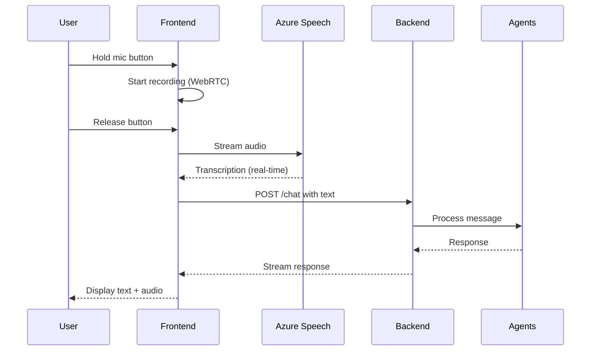

# Spec 027: Voice Input

**Feature**: Entrada de voz no chat usando Azure Speech  
**Priority**: P1 (MVP v1)  
**Sprint**: 1  
**Effort**: 2 dias  
**Status**: 📋 Planned  

---

## Visão Geral

Usuário pode **gravar voz** no navegador e enviar para o chat. Sistema transcreve usando **Azure Speech-to-Text** e processa como mensagem de texto normal.

---

## Problema

- Usuário quer interagir via voz (mãos livres, acessibilidade)
- Digitação é lenta para contextos longos
- Voz é mais natural para brainstorming

---

## Solução

### Flow



### UI/UX

**Chat Input Area**:
```
┌─────────────────────────────────────────┐
│ Type a message...              🎤 [Send]│
└─────────────────────────────────────────┘
```

**Recording State**:
```
┌─────────────────────────────────────────┐
│ 🔴 Recording... (3s)           ⏹️ Stop  │
└─────────────────────────────────────────┘
```

**Transcribing State**:
```
┌─────────────────────────────────────────┐
│ ⏳ Transcribing...                      │
└─────────────────────────────────────────┘
```

---

## Requisitos Funcionais

### RF-01: Voice Recording
- Botão de microfone no chat input
- Hold-to-record (press & hold)
- Máximo 60 segundos
- Indicador visual de gravação (waveform)

### RF-02: Audio Streaming
- Audio capturado via WebRTC (`getUserMedia`)
- Formato: WAV ou OGG
- Stream para Azure Speech em real-time

### RF-03: Transcription
- Azure Speech API (Speech-to-Text)
- Idioma: pt-BR (default)
- Real-time transcription display
- Fallback para erro de transcrição

### RF-04: Message Integration
- Transcrição vira mensagem de texto
- Processar normalmente via `/chat`
- Marcar no metadata: `voice: true`

### RF-05: Error Handling
- Permissão de microfone negada → mostrar modal
- Erro de transcrição → permitir retentar
- Timeout (>60s) → auto-stop

---

## Requisitos Não-Funcionais

### RNF-01: Latência
- Transcrição: <2s para 10s de áudio
- End-to-end (voice → response): <5s

### RNF-02: Qualidade
- Accuracy: >90% (português brasileiro)
- Suporta ruído de fundo moderado

### RNF-03: Acessibilidade
- Keyboard shortcuts (Ctrl+M para toggle mic)
- Screen reader support

---

## Entidades

### MongoDB

```javascript
// messages collection
{
  _id: ObjectId,
  conversation_id: ObjectId,
  role: "user",
  content: string,  // Transcribed text
  metadata: {
    voice: true,
    audio_duration_seconds: 12,
    audio_url: string?,  // Optional: store original
    transcription_confidence: 0.95
  },
  created_at: Date
}
```

---

## APIs

### Frontend → Azure Speech (Direct)

```typescript
// src/services/voiceService.ts
import * as SpeechSDK from 'microsoft-cognitiveservices-speech-sdk';

export class VoiceService {
  private speechConfig: SpeechSDK.SpeechConfig;
  
  constructor() {
    this.speechConfig = SpeechSDK.SpeechConfig.fromSubscription(
      process.env.NEXT_PUBLIC_AZURE_SPEECH_KEY!,
      process.env.NEXT_PUBLIC_AZURE_SPEECH_REGION!
    );
    this.speechConfig.speechRecognitionLanguage = 'pt-BR';
  }
  
  async transcribeFromMicrophone(): Promise<string> {
    const audioConfig = SpeechSDK.AudioConfig.fromDefaultMicrophoneInput();
    const recognizer = new SpeechSDK.SpeechRecognizer(
      this.speechConfig,
      audioConfig
    );
    
    return new Promise((resolve, reject) => {
      recognizer.recognizeOnceAsync(
        result => {
          if (result.reason === SpeechSDK.ResultReason.RecognizedSpeech) {
            resolve(result.text);
          } else {
            reject(new Error('Transcription failed'));
          }
        },
        error => reject(error)
      );
    });
  }
}
```

### Usage in Chat Component

```tsx
// components/ChatInput.tsx
'use client';
import { useState } from 'react';
import { VoiceService } from '@/services/voiceService';

export function ChatInput() {
  const [isRecording, setIsRecording] = useState(false);
  const [transcript, setTranscript] = useState('');
  const voiceService = new VoiceService();
  
  const handleVoiceInput = async () => {
    setIsRecording(true);
    try {
      const text = await voiceService.transcribeFromMicrophone();
      setTranscript(text);
      // Send as normal message
      await sendMessage(text);
    } catch (error) {
      console.error('Transcription error:', error);
    } finally {
      setIsRecording(false);
    }
  };
  
  return (
    <div className="chat-input">
      <input value={transcript} placeholder="Type or speak..." />
      <button onClick={handleVoiceInput} disabled={isRecording}>
        {isRecording ? '🔴 Recording...' : '🎤'}
      </button>
    </div>
  );
}
```

---

## Azure Speech Configuration

### Environment Variables

```bash
# frontend/.env.local
NEXT_PUBLIC_AZURE_SPEECH_KEY=xxx
NEXT_PUBLIC_AZURE_SPEECH_REGION=eastus
```

### Azure Portal Setup

1. Create **Speech Service** resource
2. Get API key + region
3. Configure CORS (allow localhost + production domain)
4. Pricing: Free tier (5h audio/month)

---

## User Scenarios

### Scenario 1: Quick Voice Query

```
1. User clicks mic button
2. Speaks: "Qual o status da startup ABC?"
3. System transcribes in real-time
4. User sees transcript appear
5. Releases button
6. Message sent automatically
7. Bot responds normally
```

### Scenario 2: Long Voice Context

```
1. User holds mic for 30s
2. Speaks full context about deal
3. Waveform shows recording
4. Release button
5. Transcription takes 2s
6. Full text appears in input
7. User can edit before sending (optional)
8. Sends message
```

### Scenario 3: Error Handling

```
1. User clicks mic
2. Browser asks permission
3. User denies → Modal: "Mic permission needed"
4. User grants permission
5. Recording starts
6. Network error → "Retry transcription?"
7. Success on retry
```

---

## Testing Strategy

### Unit Tests

```typescript
describe('VoiceService', () => {
  it('should transcribe audio correctly', async () => {
    const service = new VoiceService();
    const text = await service.transcribeFromMicrophone();
    expect(text).toBeTruthy();
  });
  
  it('should handle permission denied', async () => {
    // Mock getUserMedia rejection
    await expect(service.transcribeFromMicrophone())
      .rejects.toThrow('Permission denied');
  });
});
```

### E2E Tests

```typescript
// tests/e2e/voice.spec.ts
test('voice input flow', async ({ page, context }) => {
  await context.grantPermissions(['microphone']);
  
  await page.goto('/');
  await page.click('[aria-label="Voice input"]');
  
  // Wait for recording indicator
  await expect(page.locator('text=Recording')).toBeVisible();
  
  // Simulate audio (mock in test env)
  await page.waitForTimeout(2000);
  
  // Check transcript appears
  await expect(page.locator('input[placeholder*="Type"]')).toHaveValue(/./);
});
```

---

## Métricas de Sucesso

- ✅ Voice input funciona em 95%+ dos browsers modernos
- ✅ Transcription accuracy >90% (pt-BR)
- ✅ Latência <3s (recording → transcript)
- ✅ 50%+ dos usuários experimentam voz nas primeiras 10 mensagens

---

## Dependencies

| Spec | Dependency | Reason |
|------|------------|--------|
| 007 | **SHOULD** | Chat Knowledge Capture (base) |

---

## Implementation Notes

### Phase 1: Basic Recording (Day 1)
```typescript
// Get microphone access
const stream = await navigator.mediaDevices.getUserMedia({ audio: true });

// Use MediaRecorder API
const recorder = new MediaRecorder(stream);
recorder.start();

// Collect audio chunks
recorder.ondataavailable = (e) => chunks.push(e.data);

// Stop recording
recorder.stop();
```

### Phase 2: Azure Speech Integration (Day 2)
```typescript
// Install SDK
npm install microsoft-cognitiveservices-speech-sdk

// Configure
const config = SpeechSDK.SpeechConfig.fromSubscription(key, region);
config.speechRecognitionLanguage = 'pt-BR';

// Recognize
const recognizer = new SpeechSDK.SpeechRecognizer(config, audioConfig);
recognizer.recognizeOnceAsync(result => {
  console.log(result.text);
});
```

---

## Risks & Mitigations

| Risk | Impact | Mitigation |
|------|--------|------------|
| Mic permission denied | Alto | Clear modal explicando necessidade |
| Poor transcription quality | Médio | Allow edit before send |
| Azure Speech quota exceeded | Alto | Monitor usage, upgrade se necessário |
| Browser compatibility | Médio | Feature detection + fallback |

---

## Future Enhancements (Post-MVP)

- ⏳ Text-to-Speech (bot response em voz)
- ⏳ Multi-language support (en-US, es-ES)
- ⏳ Voice commands ("New conversation", "Delete message")
- ⏳ Salvar audio original (optional)

---

**Status**: 📋 Planned (Sprint 1)  
**Next**: Iniciar implementação após Chat básico (Spec 007)
