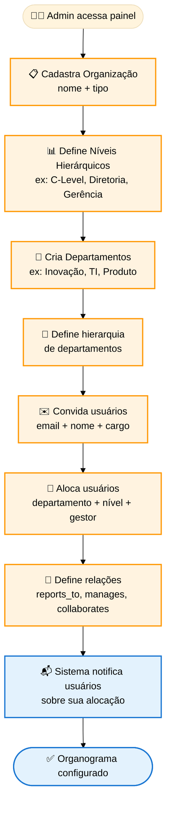
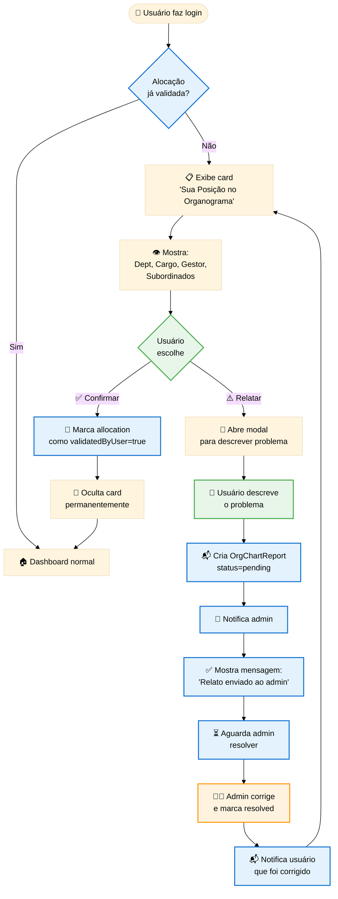

# Specification: Organizational Chart Management

**ID**: TRG-SPC-028  
**Feature**: Organizational Chart Management (Admin Setup + User Validation)  
**Version**: 1.1.0  
**Status**: Draft  
**Created**: 2024-12-14  
**Updated**: 2024-12-14 (v1.1: Integração com onboarding, remoção de tipos de org)

---

## 1. Overview

### 1.1 What
Sistema de **gestão de organograma organizacional** onde administradores cadastram a estrutura da empresa (departamentos, áreas, hierarquias) e alocam usuários em posições específicas. Usuários visualizam suas relações diretas no organograma e podem **confirmar** ou **relatar problemas**, gerando notificações para o admin.

### 1.2 Why
- **Contexto corporativo**: sistema precisa saber a estrutura organizacional para personalização
- **Validação colaborativa**: usuários confirmam sua posição, reduzindo erros de cadastro
- **Governança**: admin mantém visão centralizada e recebe alertas de inconsistências
- **Personalização**: agentes AI usam posição no organograma para adaptar respostas
- **Visibilidade hierárquica**: memória corporativa respeita estrutura organizacional

### 1.3 Success Criteria
- ✅ Admin consegue cadastrar empresa, departamentos e usuários com alocações
- ✅ Admin define relações hierárquicas (reports to, manages, collaborates with)
- ✅ Usuário vê sua posição no organograma ao fazer login
- ✅ Usuário confirma ou relata problema na sua alocação
- ✅ Admin recebe notificação quando usuário relata problema
- ✅ Organograma é visualizado de forma intuitiva (hierárquico, não apenas lista)

---

## 2. User Stories

### US-1: Admin Cadastra Estrutura Organizacional
**Como** administrador  
**Quero** cadastrar a estrutura organizacional da empresa  
**Para** alocar usuários e fornecer contexto ao sistema

**Acceptance Criteria**:
- [ ] Admin acessa painel "Estrutura Organizacional"
- [ ] Campo: Nome da Empresa (único, sem tipos/categorias)
- [ ] Admin cria departamentos/áreas (ex: "TI", "RH", "Risco", "Investimentos")
- [ ] Admin pode definir hierarquia entre departamentos se necessário (parent/child opcional)
- [ ] Admin define níveis hierárquicos customizados (CEO, Diretoria, Gerência, Coordenação, Analista)
- [ ] Sistema suporta estruturas planas (sem hierarquia rígida entre departamentos)

### US-2: Admin Aloca Usuários no Organograma
**Como** administrador  
**Quero** alocar cada usuário em uma posição específica no organograma  
**Para** definir suas relações hierárquicas e departamento

**Acceptance Criteria**:
- [ ] Admin vê lista de usuários cadastrados
- [ ] Para cada usuário, admin define:
  - Departamento/Área
  - Nível hierárquico (C-Level, Diretoria, etc)
  - Cargo específico (ex: "Head of Innovation")
  - Reports to (quem é o gestor direto)
  - Manages (lista de subordinados diretos)
- [ ] Admin pode definir relações transversais ("colabora com")
- [ ] Mudanças são salvas e notificam o usuário afetado

### US-3: Usuário Visualiza Sua Posição no Organograma
**Como** usuário  
**Quero** visualizar minha posição no organograma  
**Para** entender minhas relações hierárquicas e confirmar se está correto

**Acceptance Criteria**:
- [ ] **Durante onboarding (step "Organização")**: dados são pré-preenchidos e exibidos como read-only com botão "Relatar Erro"
- [ ] **Após login (se não validou)**: card "Sua Posição no Organograma" aparece no Canvas
- [ ] Card mostra:
  - Nome do departamento
  - Cargo
  - Gestor direto (com nome + cargo + nível hierárquico)
  - Subordinados diretos (com nome + cargo + nível hierárquico)
- [ ] Visualização em formato de mini-árvore hierárquica (3 níveis: gestor → você → subordinados)
- [ ] Card desaparece após validação ou após relato

### US-4: Usuário Confirma ou Relata Problema
**Como** usuário  
**Quero** confirmar ou relatar problema na minha alocação  
**Para** corrigir inconsistências

**Acceptance Criteria**:
- [ ] Card tem dois botões: "✅ Confirmar" e "⚠️ Relatar Problema"
- [ ] Se clicar "Confirmar": status muda para "Validado pelo usuário" e não exibe mais o card
- [ ] Se clicar "Relatar Problema": abre modal com textarea
- [ ] Usuário descreve o problema (ex: "Meu gestor direto não é João, é Maria")
- [ ] Sistema envia notificação ao admin com detalhes do relato
- [ ] Usuário vê mensagem: "Relato enviado ao admin. Você será notificado quando for corrigido."

### US-5: Admin Recebe e Resolve Relatos
**Como** administrador  
**Quero** ver relatos de problemas no organograma  
**Para** corrigir inconsistências rapidamente

**Acceptance Criteria**:
- [ ] Admin vê badge de notificações no painel "Estrutura Organizacional"
- [ ] Lista mostra: usuário, data, descrição do problema, status (pendente/resolvido)
- [ ] Admin pode editar a alocação do usuário e marcar como "Resolvido"
- [ ] Usuário recebe notificação quando problema é resolvido
- [ ] Usuário valida novamente a nova alocação

---

## 3. Functional Requirements

### FR-1: Data Model - Organizational Structure
```typescript
interface Organization {
  id: string;
  name: string; // ex: "Alok Corporation"
  type: "enterprise" | "startup" | "cvc" | "cocreate";
  createdAt: string;
  updatedAt: string;
}

interface Department {
  id: string;
  organizationId: string;
  name: string; // ex: "Inovação Corporativa"
  parentDepartmentId: string | null; // Hierarquia de departamentos
  level: number; // 0 = root, 1 = sub-dept, etc
  createdAt: string;
}

interface HierarchyLevel {
  id: string;
  organizationId: string;
  name: string; // ex: "C-Level", "Diretoria", "Gerência"
  order: number; // 1 = topo, 2 = abaixo, etc
}

interface UserAllocation {
  userId: string;
  organizationId: string;
  departmentId: string;
  hierarchyLevelId: string;
  jobTitle: string; // ex: "Head of Corporate Innovation"
  reportsToUserId: string | null; // Gestor direto
  validatedByUser: boolean;
  validatedAt: string | null;
  createdAt: string;
  updatedAt: string;
}

interface OrgChartRelation {
  id: string;
  fromUserId: string;
  toUserId: string;
  relationType: "reports_to" | "manages" | "collaborates_with";
  createdAt: string;
}

interface OrgChartReport {
  id: string;
  userId: string;
  description: string; // Descrição do problema
  status: "pending" | "resolved";
  resolvedByAdminId: string | null;
  resolvedAt: string | null;
  createdAt: string;
}
```

### FR-2: Admin - Setup Organization
- Endpoint: `POST /admin/organization`
- Cria organização com nome e tipo
- Admin único por organização (usuário com role=admin)

### FR-3: Admin - Manage Departments
- Endpoint: `POST /admin/departments`
- Admin cria departamentos e define hierarquia (parent/child)
- Suporta múltiplos níveis (ex: "Inovação" > "Inovação Aberta" > "Parcerias")

### FR-4: Admin - Define Hierarchy Levels
- Endpoint: `POST /admin/hierarchy-levels`
- Admin cria níveis customizados (C-Level, Diretoria, Gerência, Coordenação, Analista)
- Níveis têm ordem numérica (1 = topo)

### FR-5: Admin - Allocate Users
- Endpoint: `PATCH /admin/users/:userId/allocation`
- Admin define: departmentId, hierarchyLevelId, jobTitle, reportsToUserId
- Sistema cria automaticamente relações `reports_to` e `manages` baseado em `reportsToUserId`

### FR-6: User - View Own Org Chart Position
- Endpoint: `GET /user/org-chart/me`
- Retorna: departamento, cargo, gestor direto, subordinados, colaboradores
- Formato: mini-árvore hierárquica (3 níveis)

### FR-7: User - Validate or Report Issue
- Endpoint: `POST /user/org-chart/validate` (confirma)
- Endpoint: `POST /user/org-chart/report` (relata problema)
- Report cria entrada em `OrgChartReport` com status=pending

### FR-8: Admin - View and Resolve Reports
- Endpoint: `GET /admin/org-chart/reports`
- Lista todos os relatos pendentes
- Admin pode editar alocação do usuário e marcar report como resolved

---

## 4. Process Flow - Admin Setup



---

## 5. Process Flow - User Validation



---

## 6. UI/UX Requirements

### Admin Panel - Organization Setup
- **Sidebar**: nova opção "Estrutura Organizacional"
- **Tabs**: 
  1. Organização (nome, tipo)
  2. Níveis Hierárquicos (lista ordenada)
  3. Departamentos (árvore hierárquica)
  4. Usuários (tabela com alocações)
  5. Relatos (lista de problemas reportados)

### Admin - User Allocation Form
```
┌─────────────────────────────────────┐
│ Alocar: João Silva                  │
├─────────────────────────────────────┤
│ Departamento:  [▼ Inovação]         │
│ Nível:         [▼ Gerência]         │
│ Cargo:         [Head of Innovation] │
│ Reports to:    [▼ Maria Santos]     │
│                                     │
│ Subordinados:  [+ Adicionar]        │
│   - Carlos Souza (Analista)        │
│   - Ana Lima (Coordenadora)        │
│                                     │
│ Colabora com:  [+ Adicionar]        │
│   - Pedro (TI) - Projetos conjuntos│
│                                     │
│          [Cancelar]  [Salvar]       │
└─────────────────────────────────────┘
```

### User - Org Chart Position Card
```
┌─────────────────────────────────────┐
│ 📊 Sua Posição no Organograma       │
├─────────────────────────────────────┤
│                                     │
│     Maria Santos (Diretora)         │
│              ↓                      │
│     ► VOCÊ (João Silva)             │
│       Head of Innovation            │
│       Depto: Inovação               │
│              ↓                      │
│     ├─ Carlos Souza (Analista)      │
│     └─ Ana Lima (Coordenadora)      │
│                                     │
│ Colabora com: Pedro (TI)            │
│                                     │
│    [✅ Confirmar]  [⚠️ Relatar]     │
└─────────────────────────────────────┘
```

### User - Report Issue Modal
```
┌─────────────────────────────────────┐
│ ⚠️ Relatar Problema no Organograma  │
├─────────────────────────────────────┤
│                                     │
│ Descreva o problema:                │
│ ┌─────────────────────────────────┐ │
│ │ Meu gestor direto não é Maria,  │ │
│ │ é o Pedro Oliveira (Diretor).   │ │
│ │                                 │ │
│ └─────────────────────────────────┘ │
│                                     │
│        [Cancelar]  [Enviar Relato]  │
└─────────────────────────────────────┘
```

### Admin - Reports List
```
┌──────────────────────────────────────────────┐
│ 🔔 Relatos de Problemas (3 pendentes)       │
├──────────────────────────────────────────────┤
│                                              │
│ João Silva - 14/12/2024 10:30               │
│ "Meu gestor direto não é Maria..."         │
│ [Ver Detalhes] [Editar Alocação] [Resolver]│
│                                              │
│ Carlos Souza - 13/12/2024 15:20             │
│ "Não trabalho mais no dept Inovação..."    │
│ [Ver Detalhes] [Editar Alocação] [Resolver]│
│                                              │
└──────────────────────────────────────────────┘
```

---

## 7. Integration Points

### With Onboarding System
- Durante onboarding, após step "Profile", mostrar card de validação do organograma
- Se usuário confirmar, marca como validado e prossegue
- Se relatar, continua onboarding mas envia notificação ao admin

### With Chat System
- Onboarding Agent pode usar posição no organograma para personalizar perguntas
  - Ex: "Como Head of Innovation, quais seus principais desafios em fomentar inovação?"
- Router pode rotear queries baseado em hierarquia
  - Ex: queries sobre estratégia → direcionar para C-Level
  
### With Memory System
- Memória corporativa respeita organograma
  - Informações de um departamento são visíveis para gestor daquele departamento
  - C-Level tem visibilidade cross-departamental

---

## 8. Testing Strategy

### Unit Tests
- CRUD de departamentos, níveis hierárquicos, alocações
- Validação de relações (reports_to deve apontar para usuário existente)
- Geração automática de relações `manages` baseado em `reports_to`

### Integration Tests
- Admin cria organograma completo → usuários veem suas posições
- Usuário relata problema → admin recebe notificação → admin resolve → usuário valida novamente

### E2E Tests (Playwright)
- Fluxo completo: Admin setup → User login → User valida → User relata → Admin resolve

---

## 9. Open Questions

- [ ] **[Q1]**: Suportar múltiplas organizações na mesma instância (multi-tenant)?
  - **Resposta provisória**: Não. Uma instância = uma organização. Multi-tenancy é futuro.

- [ ] **[Q2]**: Permitir usuários sem alocação (ex: consultores externos)?
  - **Resposta provisória**: Sim, mas exibir aviso no perfil: "Sem alocação no organograma".

- [ ] **[Q3]**: Visualização completa do organograma (todos os usuários) ou apenas relações diretas?
  - **Resposta provisória**: Por padrão, apenas relações diretas (3 níveis). Admin tem visão completa.

---

## 10. Related Artifacts

- **Spec 026**: Invite-Only Auth (usuários pré-cadastrados agora incluem alocação)
- **Spec 022**: Onboarding (integração com validação de organograma)
- **Constitution**: Princípio de Visibilidade Hierárquica

---

> **Status**: 🟡 Draft - Aguardando validação  
> **Next Step**: Validar spec → Implementar painel admin → Implementar visualização usuário
