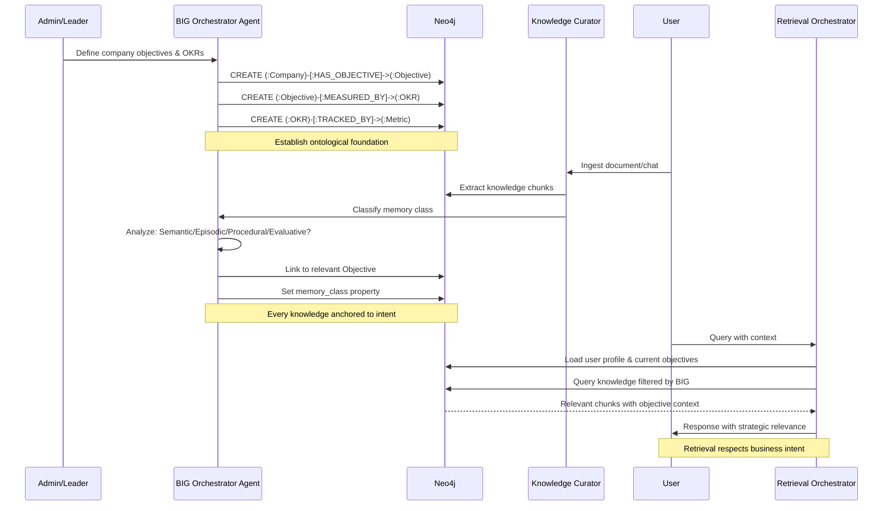

# Feature Specification: Business Intent Graph (BIG)

**Feature Branch**: `040-business-intent-graph`  
**Created**: 2025-12-29  
**Status**: Draft  
**Priority**: P0 (Foundation)  
**Source**: Chat insights (chat011, chat012, chat013) + BIG architectural pattern

## Context & Purpose

The **Business Intent Graph (BIG)** is the "ontological soul" of the Enterprise Knowledge System. It anchors all knowledge, memory, and actions to business objectives, creating a living organizational digital twin where every piece of information is semantically connected to strategic intent.

BIG transforms the knowledge graph from a passive repository into an **active cognitive framework** where:
- All knowledge is filtered by strategic relevance
- Memory is classified by cognitive purpose (4 memory classes)
- Retrieval respects business context and objectives
- The organization's "why" drives the "what" and "how"

This is the foundational spec that all other features reference.

---

## Process Flow (Business View)

```mermaid
flowchart TD
    OrgOnboard[Organization Onboarding] --> DefineVision[Define Vision & Mission]
    DefineVision --> CreateObjectives[Create Strategic Objectives]
    CreateObjectives --> DefineOKRs[Define OKRs per Objective]
    DefineOKRs --> SetMetrics[Set Measurable Metrics]
    
    SetMetrics --> AnchorMemory[Anchor Memory Classes]
    
    AnchorMemory --> Semantic[Semantic Memory:<br/>Ontology & Concepts]
    AnchorMemory --> Episodic[Episodic Memory:<br/>Events & Timeline]
    AnchorMemory --> Procedural[Procedural Memory:<br/>Playbooks & Processes]
    AnchorMemory --> Evaluative[Evaluative Memory:<br/>Lessons & Insights]
    
    Semantic --> KnowledgeGraph[Living Knowledge Graph]
    Episodic --> KnowledgeGraph
    Procedural --> KnowledgeGraph
    Evaluative --> KnowledgeGraph
    
    KnowledgeGraph --> ContextRetrieval[Context-Aware Retrieval]
    ContextRetrieval --> FilterByIntent[Filter by Business Intent]
    FilterByIntent --> AgentResponse[Agent Response]
    
    AgentResponse --> UpdateGraph[Update Graph with New Knowledge]
    UpdateGraph --> KnowledgeGraph
    
    classDef foundation fill:#e3f2fd,stroke:#1976d2,color:#000
    classDef memory fill:#fff3e0,stroke:#ff9800,color:#000
    classDef graph fill:#e8f5e9,stroke:#4caf50,color:#000
    classDef retrieval fill:#fce4ec,stroke:#e91e63,color:#000
    
    class OrgOnboard,DefineVision,CreateObjectives,DefineOKRs,SetMetrics foundation
    class Semantic,Episodic,Procedural,Evaluative memory
    class KnowledgeGraph,UpdateGraph graph
    class ContextRetrieval,FilterByIntent,AgentResponse retrieval
```

### Flow Insights

**Gaps identified**:
- How to handle objectives that change over time? (temporal versioning needed)
- What happens when knowledge doesn't map to any objective? (orphan knowledge handling)
- How to balance strategic vs operational objectives? (hierarchy depth)
- How to measure objective achievement automatically? (metric automation)

**Opportunities identified**:
- Auto-suggest OKRs based on industry benchmarks and company profile
- Detect knowledge gaps by analyzing objective coverage
- Predict objective risk by monitoring related knowledge freshness
- Generate strategic insights by analyzing memory class distributions
- Enable "strategic queries" (e.g., "Show me all knowledge supporting Q1 OKR #3")

**Risks identified**:
- Over-engineering: Too many objectives creates complexity
- Rigidity: Strict anchoring may limit exploratory knowledge
- Maintenance burden: Objectives need continuous curation
- User adoption: Business users may resist formal OKR structure

---

## Agent Collaboration



---

## User Scenarios & Testing

### User Story 1 - Organization Onboarding with BIG (Priority: P0)

As a CVC manager, I want to define my fund's investment objectives during onboarding so that all knowledge ingested is automatically filtered by strategic relevance.

**Why this priority**: Foundation for all other features. Without BIG, the system is just a generic knowledge base.

**Independent Test**: Create company with objectives, ingest document, verify knowledge is linked to objectives.

**Acceptance Scenarios**:

1. **Given** new organization onboarding, **When** admin defines vision "Support early-stage B2B SaaS in LatAm", **Then** BIG Agent creates (:Company) node with vision property and suggests initial objectives based on industry patterns

2. **Given** objectives defined, **When** admin creates OKR "Invest in 10 startups by Q4", **Then** system creates (:Objective)-[:MEASURED_BY]->(:OKR) with target metrics and timeline

3. **Given** BIG structure created, **When** user ingests first document, **Then** Knowledge Curator automatically links extracted knowledge to relevant objectives with confidence score

---

### User Story 2 - Memory Classification by Cognitive Purpose (Priority: P0)

As the system, I want to classify every knowledge chunk into one of 4 memory classes so that retrieval respects the type of information being requested.

**Why this priority**: Core cognitive architecture. Different memory types require different retrieval strategies.

**Independent Test**: Ingest diverse content (definition, meeting, process doc, lesson learned), verify correct memory_class assignment.

**Acceptance Scenarios**:

1. **Given** document with concept definitions, **When** Knowledge Curator processes it, **Then** chunks are classified as `memory_class: semantic` and linked to (:Concept) nodes

2. **Given** meeting transcript, **When** processed, **Then** chunks are classified as `memory_class: episodic` and linked to (:TimePoint) with temporal properties

3. **Given** process documentation, **When** processed, **Then** chunks are classified as `memory_class: procedural` and linked to (:Process) nodes as playbooks

4. **Given** retrospective or lesson learned, **When** processed, **Then** chunks are classified as `memory_class: evaluative` and linked to (:Insight) nodes

---

### User Story 3 - Strategic Knowledge Retrieval (Priority: P1)

As a user, I want my queries to return knowledge filtered by my current objectives so that I only see strategically relevant information.

**Why this priority**: Demonstrates BIG value. Users see immediate benefit of objective-anchored knowledge.

**Independent Test**: Query same term with different objective contexts, verify different results.

**Acceptance Scenarios**:

1. **Given** user working on "Q1 fundraising" objective, **When** queries "pitch deck", **Then** retrieval prioritizes knowledge linked to fundraising objective over other contexts

2. **Given** user switches to "portfolio monitoring" objective, **When** queries "metrics", **Then** retrieval prioritizes operational metrics knowledge over fundraising metrics

3. **Given** query with no clear objective, **When** user asks generic question, **Then** system prompts "Which objective is this related to?" or uses user's default objective

---

### User Story 4 - Objective Coverage Analysis (Priority: P2)

As a leader, I want to see which objectives have insufficient knowledge coverage so that I can prioritize knowledge acquisition efforts.

**Why this priority**: Strategic insight. Helps leaders identify blind spots.

**Independent Test**: Create objectives with varying knowledge coverage, verify gap detection.

**Acceptance Scenarios**:

1. **Given** 5 strategic objectives, **When** admin views BIG dashboard, **Then** system shows knowledge count per objective with coverage heatmap

2. **Given** objective with <10 knowledge chunks, **When** coverage is analyzed, **Then** system flags as "under-documented" and suggests knowledge sources

3. **Given** objective with no knowledge in last 30 days, **When** freshness is analyzed, **Then** system flags as "stale" and prompts for update

---

### User Story 5 - Bitemporal Truth Tracking (Priority: P1)

As the system, I want to track both when a fact was true in the world (valid_time) and when it was recorded (transaction_time) so that historical analysis is accurate.

**Why this priority**: Essential for audit, compliance, and temporal reasoning.

**Independent Test**: Record fact with past valid_time, verify both timestamps are preserved.

**Acceptance Scenarios**:

1. **Given** knowledge about "Company X raised $5M in Jan 2024", **When** recorded in March 2024, **Then** node has `valid_from: 2024-01-15`, `recorded_at: 2024-03-10`

2. **Given** knowledge is corrected (e.g., "Actually it was $6M"), **When** updated, **Then** new version created with `valid_from: 2024-01-15`, `recorded_at: 2024-03-20`, old version archived

3. **Given** temporal query "What did we know about Company X in February 2024?", **When** executed, **Then** system returns knowledge where `recorded_at <= 2024-02-28` AND `valid_from <= 2024-02-28`

---

## Functional Requirements

### BIG Structure & Ontology

- **REQ-BIG-001**: System MUST support hierarchical objective structure: Company → Area → Project → Objective
- **REQ-BIG-002**: Every (:Objective) node MUST have: `title`, `description`, `owner_id`, `status` (active/archived), `created_at`, `target_date`
- **REQ-BIG-003**: Every (:Objective) MUST link to at least one (:OKR) via [:MEASURED_BY] relationship
- **REQ-BIG-004**: Every (:OKR) MUST have: `title`, `key_result_type` (quantitative/qualitative), `target_value`, `current_value`, `unit`, `deadline`
- **REQ-BIG-005**: Every (:OKR) MAY link to multiple (:Metric) nodes via [:TRACKED_BY] for automated measurement
- **REQ-BIG-006**: System MUST support objective versioning with [:SUPERSEDES] relationship between versions

### 4 Memory Classes

- **REQ-BIG-007**: Every knowledge node MUST have `memory_class` property with values: `semantic`, `episodic`, `procedural`, `evaluative`
- **REQ-BIG-008**: Semantic memory nodes MUST link to (:Concept) nodes via [:DEFINES] relationship
- **REQ-BIG-009**: Episodic memory nodes MUST link to (:TimePoint) nodes via [:OCCURRED_AT] relationship
- **REQ-BIG-010**: Procedural memory nodes MUST link to (:Process) nodes via [:DESCRIBES_STEP] relationship
- **REQ-BIG-011**: Evaluative memory nodes MUST link to (:Insight) nodes via [:SUPPORTS_LESSON] relationship
- **REQ-BIG-012**: Memory class MUST be automatically assigned by BIG Agent with confidence score ≥ 0.7, otherwise flagged for human review

### Bitemporal Model

- **REQ-BIG-013**: Every knowledge node MUST have bitemporal properties: `valid_from`, `valid_to`, `recorded_at`, `updated_at`
- **REQ-BIG-014**: `valid_from` represents when the fact became true in the real world (user-provided or inferred)
- **REQ-BIG-015**: `valid_to` represents when the fact ceased to be true (null = still valid)
- **REQ-BIG-016**: `recorded_at` represents when the system first recorded this fact (auto-generated)
- **REQ-BIG-017**: `updated_at` represents when the node was last modified (auto-updated)
- **REQ-BIG-018**: System MUST support temporal queries: "as-of" (transaction time) and "valid-at" (valid time)

### Provenance Chain (PROV-O)

- **REQ-BIG-019**: Every knowledge node MUST link to source via [:DERIVED_FROM] relationship
- **REQ-BIG-020**: Provenance chain MUST be traversable: Knowledge → Chunk → Document → User
- **REQ-BIG-021**: System MUST record transformation steps: extraction, classification, enrichment
- **REQ-BIG-022**: Every transformation MUST have: `agent_id`, `method`, `confidence`, `timestamp`

### Knowledge Anchoring

- **REQ-BIG-023**: Every knowledge node MUST link to at least one (:Objective) via [:SUPPORTS] relationship
- **REQ-BIG-024**: [:SUPPORTS] relationship MUST have: `relevance_score` (0.0-1.0), `assigned_by` (agent/human), `assigned_at`
- **REQ-BIG-025**: System MUST flag "orphan knowledge" (no objective link) for human review
- **REQ-BIG-026**: User MUST be able to manually override objective linkage with justification

### BIG Agent

- **REQ-BIG-027**: BIG Orchestrator Agent MUST run on every knowledge ingestion to classify memory class
- **REQ-BIG-028**: BIG Agent MUST analyze chunk content and suggest objective linkage with confidence ≥ 0.6
- **REQ-BIG-029**: BIG Agent MUST detect when new objectives should be created based on knowledge patterns
- **REQ-BIG-030**: BIG Agent MUST monitor objective health: coverage, freshness, metric progress

---

## Non-Functional Requirements

### Performance

- **REQ-BIG-NFR-001**: Objective hierarchy query MUST complete in <100ms for depth ≤ 5
- **REQ-BIG-NFR-002**: Memory class classification MUST complete in <2s per document
- **REQ-BIG-NFR-003**: Temporal query (as-of/valid-at) MUST complete in <500ms for result set <1000 nodes

### Scalability

- **REQ-BIG-NFR-004**: System MUST support ≥100 active objectives per company
- **REQ-BIG-NFR-005**: System MUST support ≥1M knowledge nodes per company
- **REQ-BIG-NFR-006**: System MUST support ≥10 years of temporal history per node

### Usability

- **REQ-BIG-NFR-007**: Objective creation flow MUST complete in <5 minutes for non-technical users
- **REQ-BIG-NFR-008**: Memory class assignment MUST be explainable (show reasoning)
- **REQ-BIG-NFR-009**: BIG dashboard MUST visualize objective hierarchy and coverage in <3s

---

## Success Criteria

1. **Objective Anchoring**: 95% of ingested knowledge is automatically linked to objectives with confidence ≥ 0.7
2. **Memory Classification Accuracy**: 90% of memory class assignments are validated as correct by human review
3. **Retrieval Relevance**: Users report 40% improvement in search result relevance compared to non-BIG baseline
4. **Temporal Accuracy**: 100% of temporal queries return correct results for "as-of" and "valid-at" scenarios
5. **User Adoption**: 80% of organizations complete BIG onboarding within first week
6. **Coverage Insight**: Leaders can identify under-documented objectives within 30 seconds

---

## Key Entities

### Neo4j Node Types (New)

- **:Objective** - Strategic business objective
- **:OKR** - Objective Key Result (measurable outcome)
- **:Metric** - Quantitative metric for tracking OKR
- **:Concept** - Semantic memory concept (ontology)
- **:TimePoint** - Temporal anchor for episodic memory
- **:Process** - Procedural memory process/playbook
- **:Insight** - Evaluative memory lesson learned

### Neo4j Relationships (New)

- **[:HAS_OBJECTIVE]** - Company/Area/Project → Objective
- **[:MEASURED_BY]** - Objective → OKR
- **[:TRACKED_BY]** - OKR → Metric
- **[:SUPPORTS]** - Knowledge → Objective (with relevance_score)
- **[:DEFINES]** - Knowledge → Concept (semantic memory)
- **[:OCCURRED_AT]** - Knowledge → TimePoint (episodic memory)
- **[:DESCRIBES_STEP]** - Knowledge → Process (procedural memory)
- **[:SUPPORTS_LESSON]** - Knowledge → Insight (evaluative memory)
- **[:SUPERSEDES]** - Objective → Objective (versioning)
- **[:DERIVED_FROM]** - Knowledge → Chunk (provenance)

### Properties (Extended)

All knowledge nodes inherit base properties from `database-schema.md` plus:

- `memory_class`: `semantic` | `episodic` | `procedural` | `evaluative`
- `valid_from`: DateTime (when fact became true)
- `valid_to`: DateTime | null (when fact ceased to be true)
- `recorded_at`: DateTime (when system recorded it)
- `updated_at`: DateTime (last modification)

---

## Dependencies

- **Spec 015** (Neo4j Graph Model) - Base node types and relationships
- **Spec 012** (Graph Curation Ecosystem) - Knowledge ingestion pipeline
- **Spec 017** (Memory Ecosystem) - Memory levels (will be extended with memory classes)
- **Spec 024** (Retrieval Orchestration) - Context-aware retrieval (will use BIG for filtering)

---

## Assumptions

1. Organizations are willing to define strategic objectives explicitly (not all companies have formal OKRs)
2. Memory class can be automatically inferred with reasonable accuracy (≥70%) using LLM analysis
3. Users understand the value of objective-anchored knowledge (may require education)
4. Bitemporal model complexity is justified by audit/compliance requirements
5. Agno framework supports agent orchestration for BIG classification

---

## Macroáreas Estratégicas (Novo - 2025-02-01)

> *"Objetivos estratégicos são abstratos demais para o dia a dia."*

A solução é criar uma **camada semântica intermediária** entre Objetivos e Iniciativas.

### Estrutura Hierárquica Completa

```
Missão / Visão (Purpose)
   ↓
Objetivos Estratégicos (Objective)
   ↓
Macroáreas Estratégicas (StrategicArea)  ← NOVO
   ↓
Iniciativas / Projetos / Melhorias (Initiative/Project)
```

### O que são Macroáreas

As **macroáreas** funcionam como:
- **Eixos de esforço** - direções de trabalho
- **Campos de energia estratégica** - onde a organização investe atenção
- **Vetores de ataque** - zonas de investimento cognitivo e operacional

**Exemplos genéricos**:
- Eficiência Operacional
- Inteligência de Decisão
- Experiência do Cliente
- Redução de Risco
- Inovação de Produto

### Modelo de Dados

```cypher
(:StrategicArea {
  id: string,
  name: string,                 // "Eficiência Operacional"
  description: string,
  owner_id: string,
  status: string,               // "active" | "archived"
  created_at: datetime
})

// Relacionamentos
(:StrategicArea)-[:SERVES]->(:Objective)
(:Initiative)-[:CONTRIBUTES_TO]->(:StrategicArea)
(:Feedback)-[:SIGNALS_NEED_IN]->(:StrategicArea)
(:Project)-[:CONTRIBUTES_TO]->(:StrategicArea)
```

### Visualização de Energia Estratégica

O EKS permite responder perguntas que **nenhum BI tradicional responde bem**:

- Quais objetivos estratégicos estão **superalimentados**?
- Quais estão **órfãos de iniciativas**?
- Onde temos **muitas melhorias táticas**, mas pouco impacto estratégico?
- Onde existem **poucas iniciativas, mas de alto potencial**?

Isso é **leitura sistêmica do esforço organizacional**, não relatório.

### Requisitos de Macroáreas

- **REQ-BIG-031**: Sistema DEVE suportar `:StrategicArea` como camada entre Objective e Initiative
- **REQ-BIG-032**: Toda `:StrategicArea` DEVE estar vinculada a pelo menos um `:Objective`
- **REQ-BIG-033**: Sistema DEVE calcular densidade de iniciativas por Macroárea
- **REQ-BIG-034**: Dashboard DEVE visualizar cobertura de Macroáreas

> **Referência**: Ver spec `055-strategic-feedback-system` para sistema completo de feedback estratégico.

---

## Out of Scope

- Automatic OKR progress tracking from external systems (future integration)
- Multi-company objective sharing/benchmarking (future feature)
- Objective recommendation based on industry best practices (future AI capability)
- Real-time objective achievement prediction (future analytics)
- Integration with project management tools (Jira, Asana) for metric automation

---

## Consolidação Ontológica

BIG define os conceitos estratégicos que são referenciados em outras specs:

### Labels Definidos Aqui (Canônicos)

| Label | Descrição | Usado em |
|-------|-----------|----------|
| `:Objective` | Objetivo estratégico | 022 (como StrategicObjective), 050 |
| `:OKR` | Key Result mensurável | 050 |
| `:Metric` | Métrica de acompanhamento | 050 |

### Labels Compartilhados

| Label | Definido em | Usado aqui para |
|-------|-------------|-----------------|
| `:Purpose` | BIG + 022 | Missão/visão organizacional |
| `:Knowledge` | 015 | Base para todas as classes de memória |
| `:Concept`, `:TimePoint`, `:Process`, `:Insight` | 017 | Âncoras das 4 classes de memória |

### Relacionamento [:SUPPORTS]

O relacionamento `[:SUPPORTS]` entre Knowledge e Objective é central para BIG:

```cypher
(:Knowledge)-[:SUPPORTS {
  relevance_score: float,    // 0.0-1.0 (quão relevante para o objetivo)
  assigned_by: string,       // "agent" | "human"
  assigned_at: datetime,
  confidence: float          // 0.0-1.0 (certeza da atribuição)
}]->(:Objective)
```

> **Nota**: `[:SUPPORTS]` também existe entre Claims (spec 017), mas com semântica diferente (evidência para afirmação).

---

## Notes

- BIG is inspired by cognitive science (4 memory types) and organizational theory (objectives-driven)
- Bitemporal model follows Slowly Changing Dimensions (SCD Type 2) pattern from data warehousing
- PROV-O is W3C standard for provenance: https://www.w3.org/TR/prov-o/
- OWL-Time is W3C standard for temporal representation: https://www.w3.org/TR/owl-time/
- Memory classes align with cognitive psychology: semantic (facts), episodic (events), procedural (how-to), evaluative (wisdom)
- **Use canonical labels** as defined in specs 015 and 050

