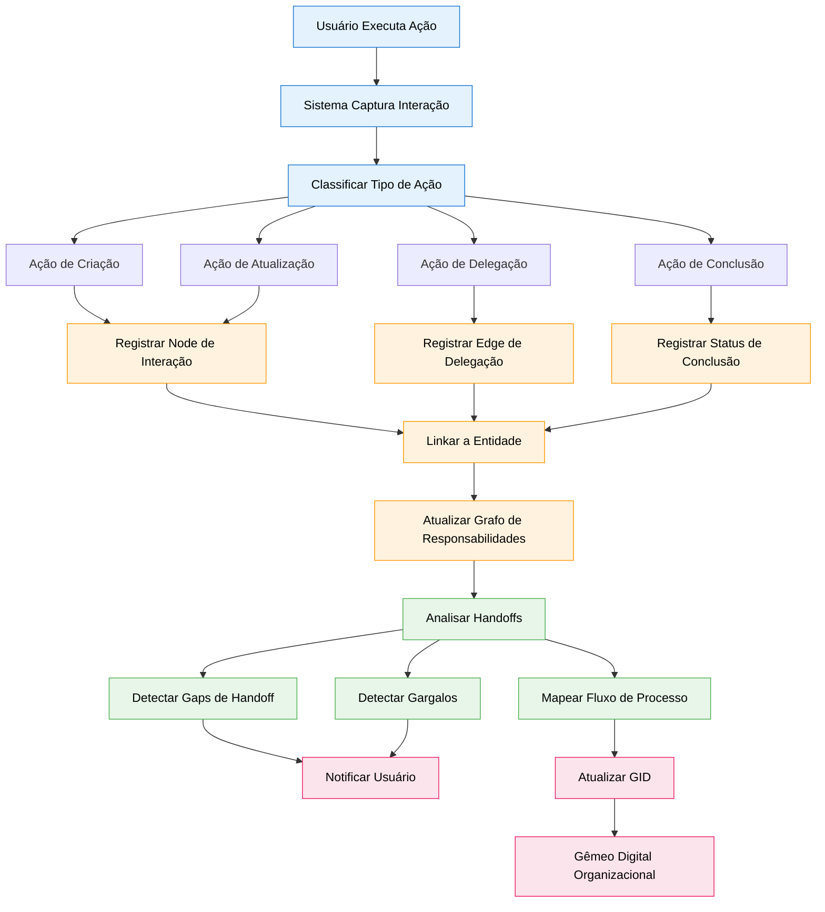
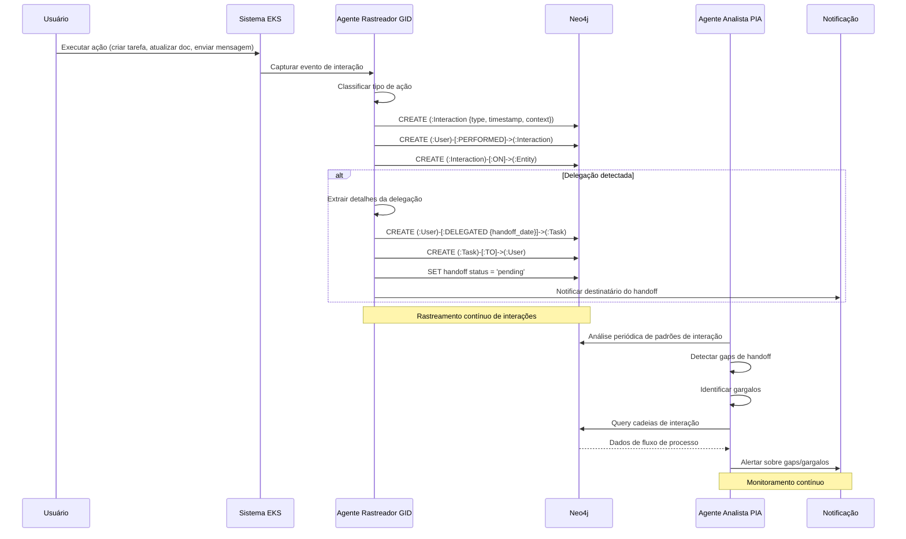

# Especificação de Feature: Grafo de Interação & Delegação (GID)

**Feature Branch**: `041-interaction-delegation-graph`  
**Criado**: 2025-12-29  
**Status**: Draft  
**Prioridade**: P0 (Foundation)  
**Fonte**: Insights dos chats (chat005) + conceito de Gêmeo Digital Organizacional

## Contexto & Propósito

O **Grafo de Interação & Delegação (GID)** captura a estrutura organizacional viva registrando QUEM fez O QUÊ, delegou para QUEM, e com qual HANDOFF. Ele transforma o organograma estático em um **mapa dinâmico do fluxo de trabalho real**, revelando a rede organizacional real além das hierarquias formais.

O GID é essencial para:
- **Gêmeo Digital Organizacional** ("gêmeo organizacional") - Mapa em tempo real de como a empresa realmente funciona
- **Inteligência de Processos** - Entender workflows reais vs processos documentados
- **Rastreamento de Handoffs** - Identificar gargalos e gaps de comunicação
- **Mapeamento de Responsabilidades** - Cadeias claras de accountability
- **Contexto de Conhecimento** - Entender quem sabe o quê baseado em interações

Esta spec trabalha em conjunto com PIA (Process Intelligence & Analysis - spec 046) para habilitar mapeamento colaborativo de processos.

---

## Fluxo de Processo (Visão de Negócio)

### Insights do Fluxo

**Gaps identificados**:
- Como capturar interações fora do sistema? (email, reuniões, Slack)
- O que define um "handoff" vs uma menção simples? (análise semântica necessária)
- Como lidar com delegações implícitas? (inferidas do comportamento)
- Como validar que handoffs foram realmente recebidos? (mecanismo de acknowledgment)

**Oportunidades identificadas**:
- Auto-detectar padrões de processo do histórico de interações
- Sugerir caminhos ótimos de delegação baseado em sucessos passados
- Identificar "knowledge brokers" (pessoas que conectam diferentes áreas)
- Prever atrasos de handoff baseado em dados históricos
- Gerar matrizes RACI automaticamente de dados de interação
- Visualizar "organograma sombra" (rede real de colaboração)

**Riscos identificados**:
- Privacidade: Rastrear todas interações pode parecer invasivo
- Volume de dados: Organizações com alta interação geram grafos massivos
- Ruído: Nem todas interações são significativas (conversas casuais)
- Acurácia: Classificação automatizada pode identificar handoffs incorretamente
- Adoção: Usuários podem resistir ao rastreamento explícito de handoffs

---

## Colaboração de Agentes

---

## Cenários de Usuário & Testes

### User Story 1 - Captura Automática de Interações (Prioridade: P0)

Como sistema, quero capturar automaticamente interações de usuários para que o gêmeo digital organizacional permaneça atualizado sem input manual.

**Por que esta prioridade**: Fundação do GID. Sem captura automática, o grafo fica desatualizado.

**Teste Independente**: Usuário executa várias ações, verificar que interações são registradas com metadados corretos.

**Cenários de Aceitação**:

1. **Dado** usuário cria uma tarefa, **Quando** tarefa é salva, **Então** sistema cria (:Interaction {type: 'create', entity_type: 'task'}) linkada a usuário e tarefa

2. **Dado** usuário atualiza um documento, **Quando** documento é salvo, **Então** sistema cria (:Interaction {type: 'update', entity_type: 'document'}) com resumo do diff

3. **Dado** usuário envia mensagem de chat, **Quando** mensagem é enviada, **Então** sistema cria (:Interaction {type: 'message', entity_type: 'conversation'}) com participantes

---

### User Story 2 - Rastreamento de Delegação com Handoff (Prioridade: P0)

Como usuário, quero delegar explicitamente tarefas a colegas para que handoffs sejam rastreados e ambas as partes sejam notificadas.

**Por que esta prioridade**: Capacidade central do GID. Handoffs são críticos para fluxo de processo.

**Teste Independente**: Delegar tarefa, verificar edge de delegação criado e destinatário notificado.

**Cenários de Aceitação**:

1. **Dado** usuário tem uma tarefa, **Quando** usuário delega a colega com nota de handoff, **Então** sistema cria (:User)-[:DELEGATED {handoff_date, handoff_note, status: 'pending'}]->(:Task)-[:TO]->(:Colleague)

2. **Dado** delegação criada, **Quando** destinatário visualiza suas tarefas, **Então** tarefa delegada aparece com contexto de handoff e opções "Aceitar/Rejeitar"

3. **Dado** destinatário aceita handoff, **Quando** aceitação é confirmada, **Então** status da delegação atualiza para 'accepted' e delegador original é notificado

4. **Dado** destinatário rejeita handoff, **Quando** rejeição é submetida com motivo, **Então** status da delegação atualiza para 'rejected', tarefa retorna ao delegador, e motivo é registrado

---

### User Story 3 - Detecção de Gaps de Handoff (Prioridade: P1)

Como gestor, quero ser alertado quando handoffs estão incompletos ou travados para que eu possa intervir antes que atrasos escalem.

**Por que esta prioridade**: Gestão proativa. Previne gargalos de se tornarem crises.

**Teste Independente**: Criar delegação sem aceitação após threshold, verificar que alerta é gerado.

**Cenários de Aceitação**:

1. **Dado** delegação pendente por >48 horas, **Quando** Monitor PIA executa, **Então** sistema marca como "handoff travado" e notifica ambas as partes e gestor

2. **Dado** múltiplas delegações para mesma pessoa, **Quando** taxa de aceitação <50%, **Então** sistema marca pessoa como potencial gargalo e sugere revisão de carga de trabalho

3. **Dado** cadeia de handoff (A→B→C), **Quando** B aceita mas não delega adiante dentro do prazo esperado, **Então** sistema detecta "cadeia quebrada" e alerta

---

### User Story 4 - Visualização de Fluxo de Processo (Prioridade: P1)

Como líder, quero visualizar fluxos de processo reais baseados em dados de interação para que eu possa identificar ineficiências e otimizar workflows.

**Por que esta prioridade**: Insight estratégico. Revela gap entre processos documentados e reais.

**Teste Independente**: Gerar fluxo de processo do histórico de interações, verificar acurácia.

**Cenários de Aceitação**:

1. **Dado** 3 meses de dados de interação, **Quando** líder solicita "Fluxo do processo de vendas", **Então** sistema gera flowchart mostrando passos reais, handoffs, e durações médias

2. **Dado** visualização de fluxo de processo, **Quando** líder clica em um handoff, **Então** sistema mostra métricas detalhadas: atraso médio, taxa de sucesso, problemas comuns

3. **Dado** múltiplas variantes de processo detectadas, **Quando** sistema analisa padrões, **Então** sistema destaca caminho mais eficiente e sugere padronização

---

### User Story 5 - Mapeamento de Responsabilidades (Prioridade: P2)

Como usuário, quero ver quem é responsável pelo quê baseado em interações reais para que eu saiba a quem contatar para tópicos específicos.

**Por que esta prioridade**: Descoberta de conhecimento. Ajuda usuários a navegar a organização.

**Teste Independente**: Query "Quem lida com X?", verificar que sistema retorna usuários baseado em histórico de interações.

**Cenários de Aceitação**:

1. **Dado** query "Quem lida com revisão de contratos?", **Quando** sistema analisa interações, **Então** retorna lista ranqueada de usuários que frequentemente interagem com documentos de contrato

2. **Dado** onboarding de novo funcionário, **Quando** funcionário pergunta "Quem pode ajudar com Y?", **Então** sistema sugere especialistas baseado em frequência e recência de interações

3. **Dado** mapa de responsabilidades, **Quando** usuário visualiza seu próprio perfil, **Então** sistema mostra "Você é reconhecido como especialista em: [tópicos]" baseado em padrões de interação

---

## Requisitos Funcionais

### Captura de Interações

- **REQ-GID-001**: Sistema DEVE capturar automaticamente interações para: criação de tarefa, atualização de tarefa, delegação de tarefa, criação de documento, atualização de documento, mensagens de chat, comentários
- **REQ-GID-002**: Todo node (:Interaction) DEVE ter: `id`, `type`, `timestamp`, `user_id`, `entity_type`, `entity_id`, `context` (JSON)
- **REQ-GID-003**: Tipos de interação DEVEM incluir: `create`, `update`, `delete`, `delegate`, `accept`, `reject`, `complete`, `comment`, `mention`
- **REQ-GID-004**: Sistema DEVE linkar interações via: (:User)-[:PERFORMED]->(:Interaction)-[:ON]->(:Entity)
- **REQ-GID-005**: Sistema DEVE capturar contexto de interação: estado antes/depois para atualizações, participantes para mensagens, motivo para delegações

### Delegação & Handoff

- **REQ-GID-006**: Toda delegação DEVE criar: (:User)-[:DELEGATED {handoff_date, handoff_note, status, expected_completion}]->(:Task)-[:TO]->(:User)
- **REQ-GID-007**: Status de handoff DEVE ser um de: `pending`, `accepted`, `rejected`, `completed`, `cancelled`
- **REQ-GID-008**: Sistema DEVE notificar destinatário imediatamente após criação de delegação
- **REQ-GID-009**: Destinatário DEVE poder aceitar/rejeitar delegação com nota opcional
- **REQ-GID-010**: Sistema DEVE rastrear tempo de aceitação de handoff e tempo de conclusão para métricas
- **REQ-GID-011**: Sistema DEVE suportar cadeias de delegação: A→B→C com rastreabilidade completa

### Detecção de Gaps de Handoff

- **REQ-GID-012**: Agente Monitor PIA DEVE executar diariamente para detectar gaps de handoff
- **REQ-GID-013**: Sistema DEVE marcar delegações pendentes >48 horas como "handoff travado"
- **REQ-GID-014**: Sistema DEVE detectar "cadeias quebradas" onde delegação é aceita mas não é executada dentro do prazo esperado
- **REQ-GID-015**: Sistema DEVE calcular score de gargalo por usuário: (delegações pendentes / total de delegações) em janela de 30 dias
- **REQ-GID-016**: Sistema DEVE alertar gestores quando score de gargalo de membro da equipe >0.3

### Análise de Fluxo de Processo

- **REQ-GID-017**: Sistema DEVE suportar queries de fluxo de processo: "Mostre como [nome do processo] realmente funciona"
- **REQ-GID-018**: Fluxo de processo DEVE ser gerado do histórico de interações usando travessia de grafo
- **REQ-GID-019**: Fluxo de processo DEVE incluir: passos (tipos de interação), handoffs (delegações), durações (tempo entre interações), taxas de sucesso
- **REQ-GID-020**: Sistema DEVE detectar variantes de processo e destacar caminho mais comum
- **REQ-GID-021**: Sistema DEVE calcular métricas de eficiência de processo: duração média, atrasos de handoff, taxa de conclusão

### Mapeamento de Responsabilidades

- **REQ-GID-022**: Sistema DEVE manter scores de responsabilidade por par usuário-tópico baseado em frequência e recência de interações
- **REQ-GID-023**: Cálculo de score de responsabilidade: `score = (interaction_count * recency_weight) / total_interactions`
- **REQ-GID-024**: Sistema DEVE suportar queries: "Quem é responsável por [tópico]?" retornando lista ranqueada com scores
- **REQ-GID-025**: Sistema DEVE atualizar mapa de responsabilidades diariamente baseado em novas interações
- **REQ-GID-026**: Perfil de usuário DEVE mostrar "Áreas de expertise reconhecidas" baseado em scores de responsabilidade >0.7

---

## Requisitos Não-Funcionais

### Performance

- **REQ-GID-NFR-001**: Captura de interação DEVE completar em <50ms (non-blocking)
- **REQ-GID-NFR-002**: Geração de fluxo de processo DEVE completar em <3s para 1000 interações
- **REQ-GID-NFR-003**: Query de responsabilidade DEVE completar em <500ms

### Escalabilidade

- **REQ-GID-NFR-004**: Sistema DEVE suportar ≥10K interações por dia por empresa
- **REQ-GID-NFR-005**: Sistema DEVE suportar ≥1M interações por empresa (histórico de 1 ano)
- **REQ-GID-NFR-006**: Sistema DEVE suportar ≥100 delegações concorrentes por usuário

### Privacidade & Segurança

- **REQ-GID-NFR-007**: Dados de interação DEVEM respeitar configurações de privacidade do usuário (escopo de visibilidade)
- **REQ-GID-NFR-008**: Gestores DEVEM ver apenas interações dentro de sua equipe/área
- **REQ-GID-NFR-009**: Sistema DEVE suportar "interações privadas" que não são rastreadas no GID
- **REQ-GID-NFR-010**: Dados de interação DEVEM ser anonimizáveis para analytics (compliance GDPR)

---

## Critérios de Sucesso

1. **Completude de Captura**: 95% das ações de usuário são automaticamente capturadas como interações
2. **Rastreamento de Handoff**: 100% das delegações explícitas são rastreadas com status de handoff
3. **Acurácia de Detecção de Gaps**: 90% dos "handoffs travados" marcados são confirmados como problemas reais por gestores
4. **Insight de Processo**: Líderes podem gerar fluxos de processo precisos em 30 segundos
5. **Acurácia de Responsabilidade**: 85% das queries "Quem lida com X?" retornam especialista correto nos top 3 resultados
6. **Adoção de Usuário**: 70% dos usuários usam ativamente features de delegação em 30 dias

---

## Entidades-Chave

### Tipos de Node Neo4j (Novos)

- **:Interaction** - Evento de interação de usuário capturado
- **:Handoff** - Handoff explícito entre usuários (pode ser separado de Interaction para metadados mais ricos)

### Relacionamentos Neo4j (Novos)

- **[:PERFORMED]** - User → Interaction (quem fez)
- **[:ON]** - Interaction → Entity (o que foi afetado: Task, Document, etc.)
- **[:DELEGATED]** - User → Task (delegação com metadados de handoff)
- **[:TO]** - Task → User (destinatário da delegação)
- **[:ACCEPTED_BY]** - Task → User (aceitação de handoff)
- **[:REJECTED_BY]** - Task → User (rejeição de handoff)
- **[:FOLLOWS]** - Interaction → Interaction (sequência no processo)

### Propriedades (Estendidas)

**Propriedades de :Interaction**:
- `id`: UUID
- `type`: `create` | `update` | `delete` | `delegate` | `accept` | `reject` | `complete` | `comment` | `mention`
- `timestamp`: DateTime
- `user_id`: UUID
- `entity_type`: string (Task, Document, etc.)
- `entity_id`: UUID
- `context`: JSON (estado antes/depois, participantes, etc.)
- `duration`: integer (milissegundos, para ações temporizadas)

**Propriedades de relacionamento [:DELEGATED]**:
- `handoff_date`: DateTime
- `handoff_note`: string (contexto opcional)
- `status`: `pending` | `accepted` | `rejected` | `completed` | `cancelled`
- `expected_completion`: DateTime (opcional)
- `accepted_at`: DateTime (quando destinatário aceitou)
- `completed_at`: DateTime (quando tarefa foi concluída)
- `rejection_reason`: string (se rejeitada)

---

## Dependências

- **Spec 040** (Business Intent Graph) - Interações linkam a objetivos para contexto estratégico
- **Spec 015** (Neo4j Graph Model) - Nodes base de Task e User
- **Spec 046** (PIA - Process Intelligence & Analysis) - Agentes PIA analisam dados do GID
- **Spec 007** (Chat & Conversations) - Mensagens de chat são capturadas como interações

---

## Premissas

1. Usuários estão dispostos a tornar delegações explícitas (nem todos handoffs são formais)
2. Overhead de captura de interação é aceitável (<50ms por ação)
3. Preocupações de privacidade podem ser endereçadas com escopos de visibilidade e opções de opt-out
4. Acurácia de fluxo de processo melhora ao longo do tempo conforme mais interações são capturadas
5. Gestores encontram valor em detecção de gaps de handoff (não visto como microgerenciamento)

---

## Fora do Escopo

- Integração com ferramentas externas de comunicação (Slack, email) para captura de interações (futuro)
- Recomendações automáticas de otimização de processos (capacidade IA futura)
- Features de colaboração em tempo real (presença, co-edição) (spec separada)
- Gamificação de taxas de conclusão de handoff (melhoria futura)
- Rastreamento de interações entre empresas (futuro para ecossistema CVC)

---

## Notas

- "Handoff" é conceito crítico em workflows organizacionais - a transferência de trabalho/informação entre pessoas
- "Gêmeo organizacional" é o mapa vivo de como a empresa realmente funciona
- GID revela o "organograma sombra" - rede real de colaboração vs hierarquia formal
- Técnicas de mineração de processos podem ser aplicadas a dados do GID para analytics avançadas
- Matriz RACI (Responsible, Accountable, Consulted, Informed) pode ser auto-gerada do GID

