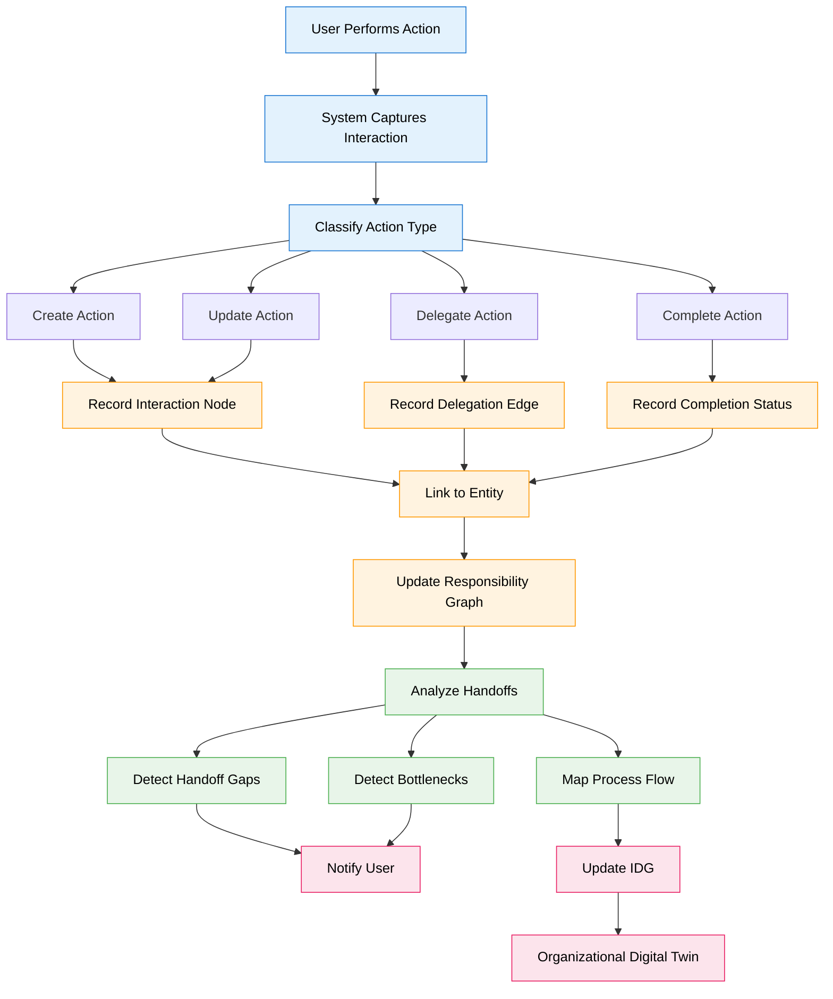
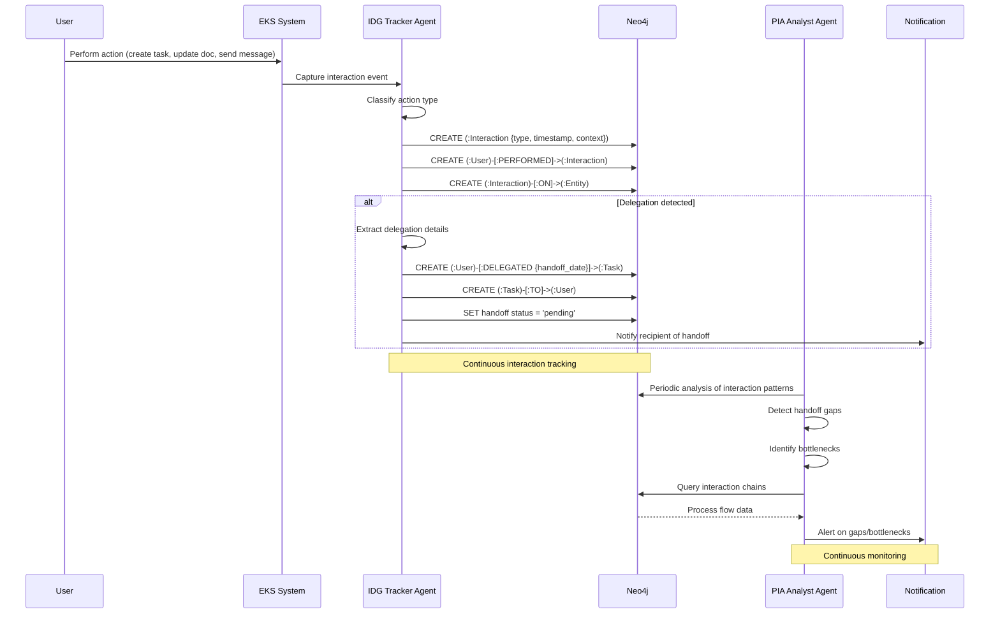

# Feature Specification: Interaction & Delegation Graph (IDG)

**Feature Branch**: `031-interaction-delegation-graph`  
**Created**: 2025-12-29  
**Status**: Draft  
**Priority**: P0 (Foundation)  
**Source**: Chat insights (chat005) + Organizational Digital Twin concept

## Context & Purpose

The **Interaction & Delegation Graph (IDG)** captures the living organizational structure by recording WHO did WHAT, delegated to WHOM, and with what HANDOFF. It transforms the static org chart into a **dynamic map of actual work flow**, revealing the real organizational network beyond formal hierarchies.

IDG is essential for:
- **Organizational Digital Twin** ("gêmeo organizacional") - Real-time map of how the company truly functions
- **Process Intelligence** - Understanding actual workflows vs documented processes
- **Handoff Tracking** - Identifying bottlenecks and communication gaps
- **Responsibility Mapping** - Clear accountability chains
- **Knowledge Context** - Understanding who knows what based on interactions

This spec works in tandem with PIA (Process Intelligence & Analysis - spec 036) to enable collaborative process mapping.

---

## Process Flow (Business View)

### Flow Insights

**Gaps identified**:
- How to capture interactions outside the system? (email, meetings, Slack)
- What defines a "handoff" vs a simple mention? (semantic analysis needed)
- How to handle implicit delegations? (inferred from behavior)
- How to validate that handoffs were actually received? (acknowledgment mechanism)

**Opportunities identified**:
- Auto-detect process patterns from interaction history
- Suggest optimal delegation paths based on past success
- Identify "knowledge brokers" (people who connect different areas)
- Predict handoff delays based on historical data
- Generate RACI matrices automatically from interaction data
- Visualize "shadow org chart" (actual collaboration network)

**Risks identified**:
- Privacy concerns: Tracking all interactions may feel invasive
- Data volume: High-interaction organizations generate massive graphs
- Noise: Not all interactions are meaningful (chat small talk)
- Accuracy: Automated classification may misidentify handoffs
- Adoption: Users may resist explicit handoff tracking

---

## Agent Collaboration

---

## User Scenarios & Testing

### User Story 1 - Automatic Interaction Capture (Priority: P0)

As the system, I want to automatically capture user interactions so that the organizational digital twin stays up-to-date without manual input.

**Why this priority**: Foundation for IDG. Without automatic capture, the graph becomes stale.

**Independent Test**: User performs various actions, verify interactions are recorded with correct metadata.

**Acceptance Scenarios**:

1. **Given** user creates a task, **When** task is saved, **Then** system creates (:Interaction {type: 'create', entity_type: 'task'}) linked to user and task

2. **Given** user updates a document, **When** document is saved, **Then** system creates (:Interaction {type: 'update', entity_type: 'document'}) with diff summary

3. **Given** user sends a chat message, **When** message is sent, **Then** system creates (:Interaction {type: 'message', entity_type: 'conversation'}) with participants

---

### User Story 2 - Delegation Tracking with Handoff (Priority: P0)

As a user, I want to explicitly delegate tasks to colleagues so that handoffs are tracked and both parties are notified.

**Why this priority**: Core IDG capability. Handoffs are critical for process flow.

**Independent Test**: Delegate task, verify delegation edge created and recipient notified.

**Acceptance Scenarios**:

1. **Given** user has a task, **When** user delegates to colleague with handoff note, **Then** system creates (:User)-[:DELEGATED {handoff_date, handoff_note, status: 'pending'}]->(:Task)-[:TO]->(:Colleague)

2. **Given** delegation created, **When** recipient views their tasks, **Then** delegated task appears with handoff context and "Accept/Reject" options

3. **Given** recipient accepts handoff, **When** acceptance is confirmed, **Then** delegation status updates to 'accepted' and original delegator is notified

4. **Given** recipient rejects handoff, **When** rejection is submitted with reason, **Then** delegation status updates to 'rejected', task returns to delegator, and reason is logged

---

### User Story 3 - Handoff Gap Detection (Priority: P1)

As a manager, I want to be alerted when handoffs are incomplete or stuck so that I can intervene before delays escalate.

**Why this priority**: Proactive management. Prevents bottlenecks from becoming crises.

**Independent Test**: Create delegation with no acceptance after threshold, verify alert is generated.

**Acceptance Scenarios**:

1. **Given** delegation pending for >48 hours, **When** PIA Monitor runs, **Then** system flags as "stuck handoff" and notifies both parties and manager

2. **Given** multiple delegations to same person, **When** acceptance rate <50%, **Then** system flags person as potential bottleneck and suggests workload review

3. **Given** handoff chain (A→B→C), **When** B accepts but doesn't delegate further within expected timeframe, **Then** system detects "broken chain" and alerts

---

### User Story 4 - Process Flow Visualization (Priority: P1)

As a leader, I want to visualize actual process flows based on interaction data so that I can identify inefficiencies and optimize workflows.

**Why this priority**: Strategic insight. Reveals gap between documented and actual processes.

**Independent Test**: Generate process flow from interaction history, verify accuracy.

**Acceptance Scenarios**:

1. **Given** 3 months of interaction data, **When** leader requests "Sales process flow", **Then** system generates flowchart showing actual steps, handoffs, and average durations

2. **Given** process flow visualization, **When** leader clicks on a handoff, **Then** system shows detailed metrics: average delay, success rate, common issues

3. **Given** multiple process variants detected, **When** system analyzes patterns, **Then** system highlights most efficient path and suggests standardization

---

### User Story 5 - Responsibility Mapping (Priority: P2)

As a user, I want to see who is responsible for what based on actual interactions so that I know who to contact for specific topics.

**Why this priority**: Knowledge discovery. Helps users navigate the organization.

**Independent Test**: Query "Who handles X?", verify system returns users based on interaction history.

**Acceptance Scenarios**:

1. **Given** query "Who handles contract reviews?", **When** system analyzes interactions, **Then** returns ranked list of users who frequently interact with contract documents

2. **Given** new employee onboarding, **When** employee asks "Who can help with Y?", **Then** system suggests experts based on interaction frequency and recency

3. **Given** responsibility map, **When** user views their own profile, **Then** system shows "You are recognized as an expert in: [topics]" based on interaction patterns

---

## Functional Requirements

### Interaction Capture

- **REQ-IDG-001**: System MUST automatically capture interactions for: task creation, task update, task delegation, document creation, document update, chat messages, comments
- **REQ-IDG-002**: Every (:Interaction) node MUST have: `id`, `type`, `timestamp`, `user_id`, `entity_type`, `entity_id`, `context` (JSON)
- **REQ-IDG-003**: Interaction types MUST include: `create`, `update`, `delete`, `delegate`, `accept`, `reject`, `complete`, `comment`, `mention`
- **REQ-IDG-004**: System MUST link interactions via: (:User)-[:PERFORMED]->(:Interaction)-[:ON]->(:Entity)
- **REQ-IDG-005**: System MUST capture interaction context: before/after state for updates, participants for messages, reason for delegations

### Delegation & Handoff

- **REQ-IDG-006**: Every delegation MUST create: (:User)-[:DELEGATED {handoff_date, handoff_note, status, expected_completion}]->(:Task)-[:TO]->(:User)
- **REQ-IDG-007**: Handoff status MUST be one of: `pending`, `accepted`, `rejected`, `completed`, `cancelled`
- **REQ-IDG-008**: System MUST notify recipient immediately upon delegation creation
- **REQ-IDG-009**: Recipient MUST be able to accept/reject delegation with optional note
- **REQ-IDG-010**: System MUST track handoff acceptance time and completion time for metrics
- **REQ-IDG-011**: System MUST support delegation chains: A→B→C with full traceability

### Handoff Gap Detection

- **REQ-IDG-012**: PIA Monitor Agent MUST run daily to detect handoff gaps
- **REQ-IDG-013**: System MUST flag delegations pending >48 hours as "stuck handoff"
- **REQ-IDG-014**: System MUST detect "broken chains" where delegation is accepted but not acted upon within expected timeframe
- **REQ-IDG-015**: System MUST calculate bottleneck score per user: (pending delegations / total delegations) over 30-day window
- **REQ-IDG-016**: System MUST alert managers when team member bottleneck score >0.3

### Process Flow Analysis

- **REQ-IDG-017**: System MUST support process flow queries: "Show me how [process name] actually works"
- **REQ-IDG-018**: Process flow MUST be generated from interaction history using graph traversal
- **REQ-IDG-019**: Process flow MUST include: steps (interaction types), handoffs (delegations), durations (time between interactions), success rates
- **REQ-IDG-020**: System MUST detect process variants and highlight most common path
- **REQ-IDG-021**: System MUST calculate process efficiency metrics: average duration, handoff delays, completion rate

### Responsibility Mapping

- **REQ-IDG-022**: System MUST maintain responsibility scores per user-topic pair based on interaction frequency and recency
- **REQ-IDG-023**: Responsibility score calculation: `score = (interaction_count * recency_weight) / total_interactions`
- **REQ-IDG-024**: System MUST support queries: "Who is responsible for [topic]?" returning ranked list with scores
- **REQ-IDG-025**: System MUST update responsibility map daily based on new interactions
- **REQ-IDG-026**: User profile MUST show "Recognized expertise areas" based on responsibility scores >0.7

---

## Non-Functional Requirements

### Performance

- **REQ-IDG-NFR-001**: Interaction capture MUST complete in <50ms (non-blocking)
- **REQ-IDG-NFR-002**: Process flow generation MUST complete in <3s for 1000 interactions
- **REQ-IDG-NFR-003**: Responsibility query MUST complete in <500ms

### Scalability

- **REQ-IDG-NFR-004**: System MUST support ≥10K interactions per day per company
- **REQ-IDG-NFR-005**: System MUST support ≥1M interactions per company (1 year history)
- **REQ-IDG-NFR-006**: System MUST support ≥100 concurrent delegations per user

### Privacy & Security

- **REQ-IDG-NFR-007**: Interaction data MUST respect user privacy settings (visibility scope)
- **REQ-IDG-NFR-008**: Managers MUST only see interactions within their team/area
- **REQ-IDG-NFR-009**: System MUST support "private interactions" that are not tracked in IDG
- **REQ-IDG-NFR-010**: Interaction data MUST be anonymizable for analytics (GDPR compliance)

---

## Success Criteria

1. **Capture Completeness**: 95% of user actions are automatically captured as interactions
2. **Handoff Tracking**: 100% of explicit delegations are tracked with handoff status
3. **Gap Detection Accuracy**: 90% of flagged "stuck handoffs" are confirmed as actual issues by managers
4. **Process Insight**: Leaders can generate accurate process flows within 30 seconds
5. **Responsibility Accuracy**: 85% of "Who handles X?" queries return correct expert in top 3 results
6. **User Adoption**: 70% of users actively use delegation features within 30 days

---

## Key Entities

### Neo4j Node Types (New)

- **:Interaction** - Captured user interaction event
- **:Handoff** - Explicit handoff between users (can be separate from Interaction for richer metadata)

### Neo4j Relationships (New)

- **[:PERFORMED]** - User → Interaction (who did it)
- **[:ON]** - Interaction → Entity (what was affected: Task, Document, etc.)
- **[:DELEGATED]** - User → Task (delegation with handoff metadata)
- **[:TO]** - Task → User (delegation recipient)
- **[:ACCEPTED_BY]** - Task → User (handoff acceptance)
- **[:REJECTED_BY]** - Task → User (handoff rejection)
- **[:FOLLOWS]** - Interaction → Interaction (sequence in process)

### Properties (Extended)

**:Interaction properties**:
- `id`: UUID
- `type`: `create` | `update` | `delete` | `delegate` | `accept` | `reject` | `complete` | `comment` | `mention`
- `timestamp`: DateTime
- `user_id`: UUID
- `entity_type`: string (Task, Document, etc.)
- `entity_id`: UUID
- `context`: JSON (before/after state, participants, etc.)
- `duration`: integer (milliseconds, for timed actions)

**[:DELEGATED] relationship properties**:
- `handoff_date`: DateTime
- `handoff_note`: string (optional context)
- `status`: `pending` | `accepted` | `rejected` | `completed` | `cancelled`
- `expected_completion`: DateTime (optional)
- `accepted_at`: DateTime (when recipient accepted)
- `completed_at`: DateTime (when task completed)
- `rejection_reason`: string (if rejected)

---

## Dependencies

- **Spec 030** (Business Intent Graph) - Interactions link to objectives for strategic context
- **Spec 015** (Neo4j Graph Model) - Base Task and User nodes
- **Spec 036** (PIA - Process Intelligence & Analysis) - PIA agents analyze IDG data
- **Spec 007** (Chat & Conversations) - Chat messages are captured as interactions

---

## Assumptions

1. Users are willing to make delegations explicit (not all handoffs are formal)
2. Interaction capture overhead is acceptable (<50ms per action)
3. Privacy concerns can be addressed with visibility scopes and opt-out options
4. Process flow accuracy improves over time as more interactions are captured
5. Managers find value in handoff gap detection (not seen as micromanagement)

---

## Out of Scope

- Integration with external communication tools (Slack, email) for interaction capture (future)
- Automatic process optimization recommendations (future AI capability)
- Real-time collaboration features (presence, co-editing) (separate spec)
- Gamification of handoff completion rates (future enhancement)
- Cross-company interaction tracking (future for CVC ecosystem)

---

## Notes

- "Handoff" is a critical concept in organizational workflows - the transfer of work/information between people
- "Gêmeo organizacional" (organizational digital twin) is the living map of how the company truly functions
- IDG reveals the "shadow org chart" - actual collaboration network vs formal hierarchy
- Process mining techniques can be applied to IDG data for advanced analytics
- RACI matrix (Responsible, Accountable, Consulted, Informed) can be auto-generated from IDG

