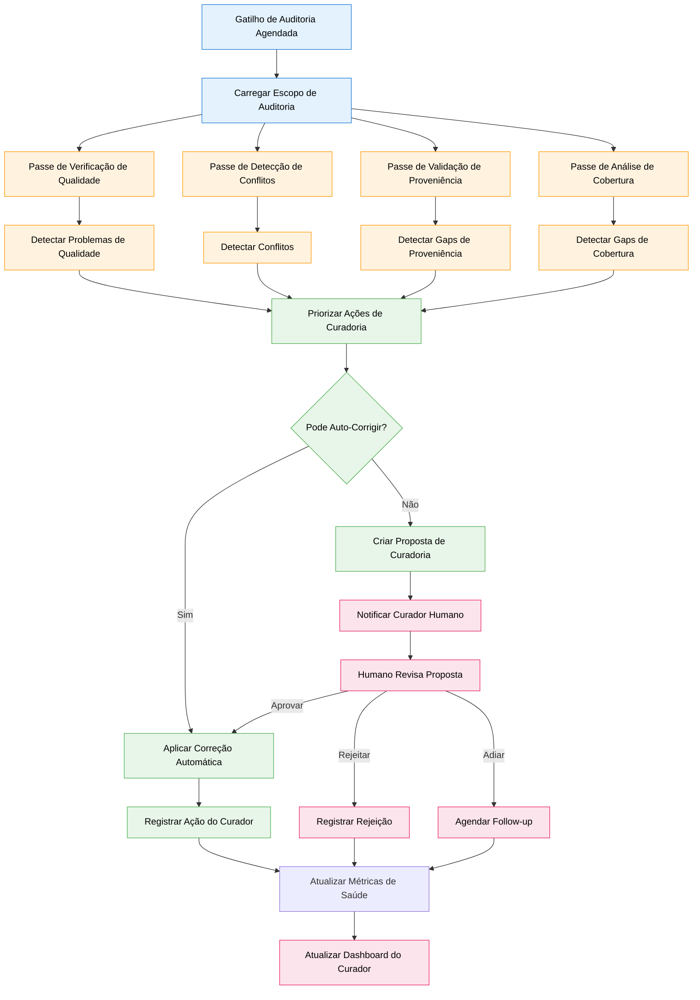
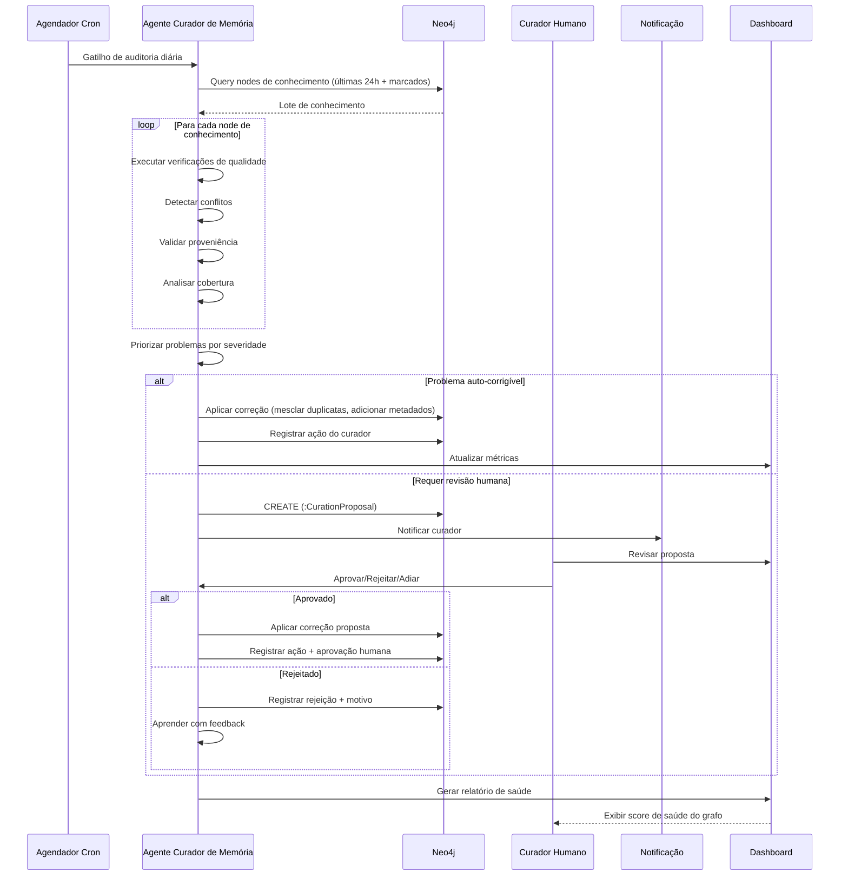

# Especificação de Feature: Curador de Memória (Memory Steward)

**Feature Branch**: `042-memory-steward`  
**Criado**: 2025-12-29  
**Status**: Draft  
**Prioridade**: P1 (Governance)  
**Fonte**: Insights dos chats + requisitos de governança do GIN

## Contexto & Propósito

O **Curador de Memória (Memory Steward)** é um agente IA responsável por manter a saúde, qualidade e coerência do grafo de conhecimento. Ele age como o "sistema imunológico" do EKS, monitorando continuamente por problemas e propondo ações de curadoria.

Enquanto o Memory Decay Agent (spec 017) lida com aspectos temporais (frescor, expiração), o Curador de Memória foca em:
- **Garantia de Qualidade** - Detectar conhecimento de baixa qualidade, incompleto ou inconsistente
- **Resolução de Conflitos** - Identificar informações contraditórias
- **Validação de Proveniência** - Assegurar que trilhas de auditoria estejam completas
- **Análise de Cobertura** - Encontrar gaps de conhecimento relativos a objetivos
- **Manutenção de Higiene** - Remover duplicatas, mesclar conceitos similares

O Curador de Memória incorpora o princípio de que **grafos de conhecimento requerem governança ativa**, não apenas acumulação passiva.

---

## Fluxo de Processo (Visão de Negócio)

### Insights do Fluxo

**Gaps identificados**:
- O que define conhecimento de "baixa qualidade"? (precisa rubrica de scoring)
- Como detectar conflitos semânticos vs perspectivas complementares? (desafio de NLP)
- Quando auto-corrigir vs requerer aprovação humana? (threshold de risco)
- Como balancear agressividade do curador vs autonomia do usuário? (política de governança)

**Oportunidades identificadas**:
- Aprender com decisões de curadores humanos para melhorar acurácia de auto-fix
- Detectar conceitos emergentes que deveriam se tornar nodes formais de ontologia
- Identificar "campeões de conhecimento" que consistentemente fornecem input de alta qualidade
- Prever decadência de conhecimento antes que se torne crítico
- Gerar recomendações de aquisição de conhecimento baseado em análise de gaps

**Riscos identificados**:
- Curadoria over-agressiva pode deletar conhecimento valioso
- Conflitos falso-positivos criam fadiga de curador
- Validação de proveniência pode ser muito rigorosa para conhecimento informal
- Análise de cobertura pode pressionar usuários a documentar excessivamente

---

## Colaboração de Agentes

---

## Cenários de Usuário & Testes

### User Story 1 - Detecção Automática de Duplicatas (Prioridade: P1)

Como Curador de Memória, quero detectar nodes de conhecimento duplicados ou quase-duplicados para que o grafo permaneça limpo e eficiente.

**Por que esta prioridade**: Duplicatas desperdiçam armazenamento e confundem retrieval. Problema comum em ambientes colaborativos.

**Teste Independente**: Criar 2 nodes de conhecimento similares, verificar que Curador detecta e propõe merge.

**Cenários de Aceitação**:

1. **Dado** dois nodes de conhecimento com >90% de similaridade de conteúdo, **Quando** Curador executa verificação de qualidade, **Então** cria (:CurationProposal {type: 'merge', reason: 'duplicate content', confidence: 0.95})

2. **Dado** proposta de merge criada, **Quando** curador humano revisa, **Então** vê comparação lado-a-lado com diff destacado e preview de merge

3. **Dado** curador aprova merge, **Quando** Curador aplica correção, **Então** cria node único mesclado, preserva ambas cadeias de proveniência, arquiva originais com relacionamento [:MERGED_INTO]

---

### User Story 2 - Detecção de Conflitos (Prioridade: P1)

Como Curador de Memória, quero detectar conhecimento contraditório para que usuários estejam cientes de informações conflitantes.

**Por que esta prioridade**: Conflitos corroem confiança no sistema. Crítico para tomada de decisão.

**Teste Independente**: Criar nodes de conhecimento conflitantes, verificar que Curador detecta e marca.

**Cenários de Aceitação**:

1. **Dado** dois nodes de conhecimento afirmando "Empresa X levantou $5M" e "Empresa X levantou $6M", **Quando** Curador executa verificação de conflito, **Então** detecta conflito semântico e cria (:ConflictFlag) linkando ambos nodes

2. **Dado** conflito detectado, **Quando** Curador analisa proveniência, **Então** determina qual fonte é mais autoritativa (press release oficial > artigo de notícia > mensagem de chat)

3. **Dado** conflito marcado, **Quando** usuário recupera qualquer node, **Então** UI mostra aviso "Informação conflitante existe" com link para alternativa

4. **Dado** conflito requer resolução, **Quando** Curador cria proposta, **Então** sugere: "Marcar mais recente/autoritativa como primária, arquivar node conflitante"

---

### User Story 3 - Validação de Proveniência (Prioridade: P1)

Como Curador de Memória, quero assegurar que todo conhecimento tem cadeias de proveniência completas para que trilhas de auditoria sejam confiáveis.

**Por que esta prioridade**: Proveniência é mandatória conforme princípios GIN. Essencial para compliance.

**Teste Independente**: Criar node de conhecimento com proveniência incompleta, verificar que Curador detecta gap.

**Cenários de Aceitação**:

1. **Dado** node de conhecimento sem relacionamento [:DERIVED_FROM], **Quando** Curador executa verificação de proveniência, **Então** marca como "conhecimento órfão" com severity: high

2. **Dado** conhecimento com [:DERIVED_FROM]->(:Chunk) mas chunk não tem [:PART_OF]->(:Document), **Quando** Curador valida cadeia, **Então** marca como "cadeia de proveniência quebrada"

3. **Dado** gap de proveniência detectado, **Quando** Curador tenta auto-fix, **Então** busca chunk/documento correspondente por hash de conteúdo e linka se encontrado com confidence >0.9

4. **Dado** auto-fix não possível, **Quando** Curador cria proposta, **Então** notifica criador original para fornecer informação de fonte

---

### User Story 4 - Análise de Gap de Cobertura (Prioridade: P2)

Como líder, quero ver quais objetivos de negócio carecem de cobertura suficiente de conhecimento para que eu possa priorizar aquisição de conhecimento.

**Por que esta prioridade**: Insight estratégico. Ajuda alocar recursos para documentação/pesquisa.

**Teste Independente**: Criar objetivos com contagens variadas de conhecimento, verificar que Curador identifica gaps.

**Cenários de Aceitação**:

1. **Dado** objetivo com <5 nodes de conhecimento, **Quando** Curador executa análise de cobertura, **Então** marca como "sub-documentado" e calcula coverage score: (actual_count / expected_count)

2. **Dado** objetivo sem conhecimento nos últimos 60 dias, **Quando** Curador analisa frescor, **Então** marca como "objetivo obsoleto" e sugere atualização de conhecimento

3. **Dado** gaps de cobertura identificados, **Quando** Curador gera relatório, **Então** inclui: severidade de gap, fontes de conhecimento sugeridas, ações recomendadas

4. **Dado** relatório de cobertura, **Quando** líder visualiza dashboard, **Então** vê heatmap de objetivos coloridos por coverage score (vermelho <20%, amarelo 20-60%, verde >60%)

---

### User Story 5 - Scoring de Qualidade (Prioridade: P2)

Como Curador de Memória, quero atribuir scores de qualidade a nodes de conhecimento para que conteúdo de baixa qualidade possa ser melhorado ou removido.

**Por que esta prioridade**: Mantém saúde do grafo. Previne "podridão de conhecimento".

**Teste Independente**: Criar nodes de conhecimento com qualidade variada, verificar que Curador pontua com acurácia.

**Cenários de Aceitação**:

1. **Dado** node de conhecimento, **Quando** Curador calcula quality score, **Então** considera: completude (tem título, conteúdo, metadados), proveniência (cadeia completa), frescor (recentemente validado), uso (contagem de acesso), confiança (autoridade da fonte)

2. **Dado** quality score <0.4, **Quando** Curador avalia, **Então** marca para revisão com sugestões específicas de melhoria (ex: "Adicionar referência de fonte", "Clarificar termos ambíguos")

3. **Dado** quality score <0.2 por >90 dias, **Quando** Curador executa verificação de higiene, **Então** propõe arquivamento ou deleção com aprovação humana requerida

---

## Requisitos Funcionais

### Verificações de Qualidade

- **REQ-CURA-001**: Curador de Memória DEVE executar auditoria diária em todos nodes de conhecimento modificados nas últimas 24 horas
- **REQ-CURA-002**: Quality score DEVE ser calculado como média ponderada: completude (30%), proveniência (25%), frescor (20%), uso (15%), confiança (10%)
- **REQ-CURA-003**: Conhecimento com quality score <0.4 DEVE ser marcado para revisão
- **REQ-CURA-004**: Verificação de qualidade DEVE detectar: metadados faltando, conteúdo incompleto (<50 chars), links quebrados, referências inválidas

### Detecção de Conflitos

- **REQ-CURA-005**: Curador DEVE detectar conflitos semânticos usando: detecção de contradição exata, detecção de discrepância numérica, detecção de inconsistência temporal
- **REQ-CURA-006**: Confidence de conflito DEVE ser calculada: match exato (1.0), similaridade semântica >0.9 (0.8), diferença numérica >20% (0.7)
- **REQ-CURA-007**: Conflitos detectados DEVEM criar node (:ConflictFlag) linkando conhecimento conflitante com confidence score
- **REQ-CURA-008**: Resolução de conflito DEVE priorizar por: autoridade da fonte, recência, status de validação, frequência de uso

### Validação de Proveniência

- **REQ-CURA-009**: Curador DEVE validar cadeia completa de proveniência: Knowledge → Chunk → Document → User
- **REQ-CURA-010**: Conhecimento órfão (sem [:DERIVED_FROM]) DEVE ser marcado com severity: high
- **REQ-CURA-011**: Cadeias de proveniência quebradas DEVEM ser marcadas com severity: medium
- **REQ-CURA-012**: Curador DEVE tentar auto-fix para cadeias quebradas usando matching de hash de conteúdo com confidence >0.9

### Análise de Cobertura

- **REQ-CURA-013**: Curador DEVE calcular coverage score por objetivo: (knowledge_count / expected_baseline) onde baseline = max(10, avg_across_objectives)
- **REQ-CURA-014**: Objetivos com coverage score <0.2 DEVEM ser marcados como "criticamente sub-documentado"
- **REQ-CURA-015**: Objetivos sem conhecimento em >60 dias DEVEM ser marcados como "obsoleto"
- **REQ-CURA-016**: Relatório de cobertura DEVE incluir: severidade de gap, contagem de conhecimento, frescor, ações sugeridas

### Propostas de Curadoria

- **REQ-CURA-017**: Curador DEVE criar (:CurationProposal) para problemas requerendo revisão humana
- **REQ-CURA-018**: Proposta DEVE incluir: issue_type, severity, affected_nodes, proposed_action, confidence, reasoning
- **REQ-CURA-019**: Tipos de proposta DEVEM incluir: merge, delete, archive, update_metadata, resolve_conflict, add_provenance
- **REQ-CURA-020**: Propostas com confidence >0.95 E severity <medium PODEM ser auto-aplicadas (configurável)
- **REQ-CURA-021**: Curador humano DEVE poder: aprovar, rejeitar (com motivo), adiar, modificar proposta

### Ações & Registro do Curador

- **REQ-CURA-022**: Toda ação do Curador DEVE ser registrada em node (:StewardAction) com: timestamp, action_type, affected_nodes, outcome, confidence
- **REQ-CURA-023**: Curador DEVE aprender com feedback humano: ações aprovadas aumentam confidence, ações rejeitadas diminuem confidence para padrões similares
- **REQ-CURA-024**: Dashboard do Curador DEVE exibir: ações tomadas (últimos 7 dias), propostas pendentes, problemas detectados, score de saúde do grafo

---

## Requisitos Não-Funcionais

### Performance

- **REQ-CURA-NFR-001**: Auditoria diária DEVE completar em <10 minutos para 10K nodes de conhecimento
- **REQ-CURA-NFR-002**: Cálculo de quality score DEVE completar em <100ms por node
- **REQ-CURA-NFR-003**: Detecção de conflitos DEVE completar em <5 minutos para 10K nodes

### Acurácia

- **REQ-CURA-NFR-004**: Detecção de duplicatas DEVE ter precisão >0.9 (baixos falso-positivos)
- **REQ-CURA-NFR-005**: Detecção de conflitos DEVE ter recall >0.8 (capturar maioria dos conflitos)
- **REQ-CURA-NFR-006**: Scoring de qualidade DEVE correlacionar >0.7 com avaliações de curadores humanos

### Governança

- **REQ-CURA-NFR-007**: Curador DEVE respeitar configurações de privacidade do usuário (não auditar conhecimento privado)
- **REQ-CURA-NFR-008**: Ações de auto-fix DEVEM ser reversíveis por 30 dias (soft delete)
- **REQ-CURA-NFR-009**: Agressividade do Curador DEVE ser configurável por organização (conservativo/balanceado/agressivo)

---

## Critérios de Sucesso

1. **Detecção de Problemas**: Curador detecta 90% dos problemas de qualidade confirmados por revisão humana
2. **Acurácia de Auto-Fix**: 95% das correções auto-aplicadas são validadas como corretas
3. **Eficiência do Curador**: Curadores humanos gastam 50% menos tempo em verificações manuais de qualidade
4. **Saúde do Grafo**: Score geral de qualidade do grafo melhora em 30% após 3 meses
5. **Resolução de Conflitos**: 80% dos conflitos detectados são resolvidos em 7 dias
6. **Confiança do Usuário**: 85% dos usuários confiam em recomendações do Curador (survey)

---

## Entidades-Chave

### Tipos de Node Neo4j (Novos)

- **:CurationProposal** - Ação de curadoria proposta requerendo revisão humana
- **:ConflictFlag** - Marcador para conhecimento conflitante
- **:StewardAction** - Log de ações do Curador
- **:QualityScore** - Avaliação de qualidade para node de conhecimento

### Relacionamentos Neo4j (Novos)

- **[:PROPOSES_FIX]** - Steward → CurationProposal
- **[:AFFECTS]** - CurationProposal → Knowledge (nodes afetados)
- **[:CONFLICTS_WITH]** - Knowledge → Knowledge (via ConflictFlag)
- **[:APPLIED_BY]** - StewardAction → User (aprovador humano)
- **[:MERGED_INTO]** - Knowledge → Knowledge (histórico de merge)

### Propriedades (Estendidas)

**Propriedades de :CurationProposal**:
- `id`: UUID
- `issue_type`: `duplicate` | `conflict` | `provenance_gap` | `low_quality` | `coverage_gap`
- `severity`: `low` | `medium` | `high` | `critical`
- `proposed_action`: `merge` | `delete` | `archive` | `update` | `resolve_conflict`
- `confidence`: float (0.0-1.0)
- `reasoning`: text
- `status`: `pending` | `approved` | `rejected` | `deferred`
- `created_at`: DateTime
- `reviewed_at`: DateTime
- `reviewed_by`: UUID

---

## Dependências

- **Spec 040** (Business Intent Graph) - Análise de cobertura requer objetivos
- **Spec 017** (Memory Ecosystem) - Integra com Memory Decay Agent
- **Spec 012** (Graph Curation Ecosystem) - Curador faz parte da camada de curadoria
- **Spec 043** (Trust Score) - Scoring de qualidade usa trust scores

---

## Premissas

1. Curadores humanos estão disponíveis para revisar propostas em 48 horas
2. Organizações aceitam curadoria guiada por IA com supervisão humana
3. Rubrica de scoring de qualidade pode ser padronizada entre organizações
4. Acurácia de detecção de conflitos melhora com dados de treinamento
5. Ações do Curador são auditáveis e reversíveis

---

## Fora do Escopo

- Curadoria em tempo real (Curador executa em schedule, não por ação)
- Benchmarking de qualidade de conhecimento entre empresas (futuro)
- Geração automática de conhecimento para preencher gaps (capacidade IA futura)
- Integração com ferramentas externas de qualidade de conhecimento (futuro)
- Customização de personalidade/tom do Curador (melhoria UX futura)

---

## Notas

- Curador de Memória incorpora "higiene de grafo de conhecimento" - manutenção contínua é essencial
- Inspirado por sistema imunológico: detectar ameaças, propor respostas, aprender com outcomes
- Balanço entre automação e supervisão humana é crítico para confiança
- Scoring de qualidade é subjetivo - rubrica deve ser customizável por organização
- Curador aprende com feedback humano usando princípios de reinforcement learning

