# Feature Specification: Memory Steward

**Feature Branch**: `032-memory-steward`  
**Created**: 2025-12-29  
**Status**: Draft  
**Priority**: P1 (Governance)  
**Source**: Chat insights + BIG governance requirements

## Context & Purpose

The **Memory Steward** is an AI agent responsible for maintaining the health, quality, and coherence of the knowledge graph. It acts as the "immune system" of the EKS, continuously monitoring for issues and proposing curation actions.

While the Memory Decay Agent (spec 017) handles temporal aspects (freshness, expiration), the Memory Steward focuses on:
- **Quality Assurance** - Detecting low-quality, incomplete, or inconsistent knowledge
- **Conflict Resolution** - Identifying contradictory information
- **Provenance Validation** - Ensuring audit trails are complete
- **Coverage Analysis** - Finding gaps in knowledge relative to objectives
- **Hygiene Maintenance** - Removing duplicates, merging similar concepts

The Memory Steward embodies the principle that **knowledge graphs require active governance**, not just passive accumulation.

---

## Process Flow (Business View)

```mermaid
flowchart TD
    Schedule[Scheduled Audit Trigger] --> LoadScope[Load Audit Scope]
    LoadScope --> QualityCheck[Quality Check Pass]
    LoadScope --> ConflictCheck[Conflict Detection Pass]
    LoadScope --> ProvenanceCheck[Provenance Validation Pass]
    LoadScope --> CoverageCheck[Coverage Analysis Pass]
    
    QualityCheck --> DetectIssues1[Detect Quality Issues]
    ConflictCheck --> DetectIssues2[Detect Conflicts]
    ProvenanceCheck --> DetectIssues3[Detect Provenance Gaps]
    CoverageCheck --> DetectIssues4[Detect Coverage Gaps]
    
    DetectIssues1 --> PrioritizeActions[Prioritize Curation Actions]
    DetectIssues2 --> PrioritizeActions
    DetectIssues3 --> PrioritizeActions
    DetectIssues4 --> PrioritizeActions
    
    PrioritizeActions --> AutoFix{Can Auto-Fix?}
    
    AutoFix -->|Yes| ApplyFix[Apply Automatic Fix]
    AutoFix -->|No| CreateProposal[Create Curation Proposal]
    
    ApplyFix --> LogAction[Log Steward Action]
    CreateProposal --> NotifyHuman[Notify Human Curator]
    
    NotifyHuman --> HumanReview[Human Reviews Proposal]
    HumanReview -->|Approve| ApplyFix
    HumanReview -->|Reject| LogRejection[Log Rejection]
    HumanReview -->|Defer| ScheduleFollowup[Schedule Follow-up]
    
    LogAction --> UpdateMetrics[Update Health Metrics]
    LogRejection --> UpdateMetrics
    ScheduleFollowup --> UpdateMetrics
    
    UpdateMetrics --> ReportDashboard[Update Steward Dashboard]
    
    classDef trigger fill:#e3f2fd,stroke:#1976d2,color:#000
    classDef check fill:#fff3e0,stroke:#ff9800,color:#000
    classDef action fill:#e8f5e9,stroke:#4caf50,color:#000
    classDef human fill:#fce4ec,stroke:#e91e63,color:#000
    
    class Schedule,LoadScope trigger
    class QualityCheck,ConflictCheck,ProvenanceCheck,CoverageCheck,DetectIssues1,DetectIssues2,DetectIssues3,DetectIssues4 check
    class PrioritizeActions,AutoFix,ApplyFix,CreateProposal,LogAction action
    class NotifyHuman,HumanReview,LogRejection,ScheduleFollowup,ReportDashboard human
```

### Flow Insights

**Gaps identified**:
- What defines "low quality" knowledge? (needs scoring rubric)
- How to detect semantic conflicts vs complementary perspectives? (NLP challenge)
- When to auto-fix vs require human approval? (risk threshold)
- How to balance steward aggressiveness vs user autonomy? (governance policy)

**Opportunities identified**:
- Learn from human curator decisions to improve auto-fix accuracy
- Detect emerging concepts that should become formal ontology nodes
- Identify "knowledge champions" who consistently provide high-quality input
- Predict knowledge decay before it becomes critical
- Generate knowledge acquisition recommendations based on gap analysis

**Risks identified**:
- Over-aggressive curation may delete valuable knowledge
- False positive conflicts create curator fatigue
- Provenance validation may be too strict for informal knowledge
- Coverage analysis may pressure users to document excessively

---

## Agent Collaboration

---

## User Scenarios & Testing

### User Story 1 - Automatic Duplicate Detection (Priority: P1)

As the Memory Steward, I want to detect duplicate or near-duplicate knowledge nodes so that the graph remains clean and efficient.

**Why this priority**: Duplicates waste storage and confuse retrieval. Common issue in collaborative environments.

**Independent Test**: Create 2 similar knowledge nodes, verify Steward detects and proposes merge.

**Acceptance Scenarios**:

1. **Given** two knowledge nodes with >90% content similarity, **When** Steward runs quality check, **Then** creates (:CurationProposal {type: 'merge', reason: 'duplicate content', confidence: 0.95})

2. **Given** merge proposal created, **When** human curator reviews, **Then** sees side-by-side comparison with diff highlighting and merge preview

3. **Given** curator approves merge, **When** Steward applies fix, **Then** creates single merged node, preserves both provenance chains, archives originals with [:MERGED_INTO] relationship

---

### User Story 2 - Conflict Detection (Priority: P1)

As the Memory Steward, I want to detect contradictory knowledge so that users are aware of conflicting information.

**Why this priority**: Conflicts erode trust in the system. Critical for decision-making.

**Independent Test**: Create conflicting knowledge nodes, verify Steward detects and flags.

**Acceptance Scenarios**:

1. **Given** two knowledge nodes stating "Company X raised $5M" and "Company X raised $6M", **When** Steward runs conflict check, **Then** detects semantic conflict and creates (:ConflictFlag) linking both nodes

2. **Given** conflict detected, **When** Steward analyzes provenance, **Then** determines which source is more authoritative (official press release > news article > chat message)

3. **Given** conflict flagged, **When** user retrieves either node, **Then** UI shows warning "Conflicting information exists" with link to alternative

4. **Given** conflict requires resolution, **When** Steward creates proposal, **Then** suggests: "Mark newer/more authoritative as primary, archive conflicting node"

---

### User Story 3 - Provenance Validation (Priority: P1)

As the Memory Steward, I want to ensure all knowledge has complete provenance chains so that audit trails are trustworthy.

**Why this priority**: Provenance is mandatory per BIG principles. Essential for compliance.

**Independent Test**: Create knowledge node with incomplete provenance, verify Steward detects gap.

**Acceptance Scenarios**:

1. **Given** knowledge node without [:DERIVED_FROM] relationship, **When** Steward runs provenance check, **Then** flags as "orphan knowledge" with severity: high

2. **Given** knowledge with [:DERIVED_FROM]->(:Chunk) but chunk has no [:PART_OF]->(:Document), **When** Steward validates chain, **Then** flags as "broken provenance chain"

3. **Given** provenance gap detected, **When** Steward attempts auto-fix, **Then** searches for matching chunk/document by content hash and links if found with confidence >0.9

4. **Given** auto-fix not possible, **When** Steward creates proposal, **Then** notifies original creator to provide source information

---

### User Story 4 - Coverage Gap Analysis (Priority: P2)

As a leader, I want to see which business objectives lack sufficient knowledge coverage so that I can prioritize knowledge acquisition.

**Why this priority**: Strategic insight. Helps allocate resources for documentation/research.

**Independent Test**: Create objectives with varying knowledge counts, verify Steward identifies gaps.

**Acceptance Scenarios**:

1. **Given** objective with <5 knowledge nodes, **When** Steward runs coverage analysis, **Then** flags as "under-documented" and calculates coverage score: (actual_count / expected_count)

2. **Given** objective with no knowledge in last 60 days, **When** Steward analyzes freshness, **Then** flags as "stale objective" and suggests knowledge refresh

3. **Given** coverage gaps identified, **When** Steward generates report, **Then** includes: gap severity, suggested knowledge sources, recommended actions

4. **Given** coverage report, **When** leader views dashboard, **Then** sees heatmap of objectives colored by coverage score (red <20%, yellow 20-60%, green >60%)

---

### User Story 5 - Quality Scoring (Priority: P2)

As the Memory Steward, I want to assign quality scores to knowledge nodes so that low-quality content can be improved or removed.

**Why this priority**: Maintains graph health. Prevents "knowledge rot".

**Independent Test**: Create knowledge nodes with varying quality, verify Steward scores accurately.

**Acceptance Scenarios**:

1. **Given** knowledge node, **When** Steward calculates quality score, **Then** considers: completeness (has title, content, metadata), provenance (complete chain), freshness (recently validated), usage (access count), trust (source authority)

2. **Given** quality score <0.4, **When** Steward evaluates, **Then** flags for review with specific improvement suggestions (e.g., "Add source reference", "Clarify ambiguous terms")

3. **Given** quality score <0.2 for >90 days, **When** Steward runs hygiene check, **Then** proposes archival or deletion with human approval required

---

## Functional Requirements

### Quality Checks

- **REQ-STEW-001**: Memory Steward MUST run daily audit on all knowledge nodes modified in last 24 hours
- **REQ-STEW-002**: Quality score MUST be calculated as weighted average: completeness (30%), provenance (25%), freshness (20%), usage (15%), trust (10%)
- **REQ-STEW-003**: Knowledge with quality score <0.4 MUST be flagged for review
- **REQ-STEW-004**: Quality check MUST detect: missing metadata, incomplete content (<50 chars), broken links, invalid references

### Conflict Detection

- **REQ-STEW-005**: Steward MUST detect semantic conflicts using: exact contradiction detection, numerical discrepancy detection, temporal inconsistency detection
- **REQ-STEW-006**: Conflict confidence MUST be calculated: exact match (1.0), semantic similarity >0.9 (0.8), numerical difference >20% (0.7)
- **REQ-STEW-007**: Detected conflicts MUST create (:ConflictFlag) node linking conflicting knowledge with confidence score
- **REQ-STEW-008**: Conflict resolution MUST prioritize by: source authority, recency, validation status, usage frequency

### Provenance Validation

- **REQ-STEW-009**: Steward MUST validate complete provenance chain: Knowledge → Chunk → Document → User
- **REQ-STEW-010**: Orphan knowledge (no [:DERIVED_FROM]) MUST be flagged with severity: high
- **REQ-STEW-011**: Broken provenance chains MUST be flagged with severity: medium
- **REQ-STEW-012**: Steward MUST attempt auto-fix for broken chains using content hash matching with confidence >0.9

### Coverage Analysis

- **REQ-STEW-013**: Steward MUST calculate coverage score per objective: (knowledge_count / expected_baseline) where baseline = max(10, avg_across_objectives)
- **REQ-STEW-014**: Objectives with coverage score <0.2 MUST be flagged as "critically under-documented"
- **REQ-STEW-015**: Objectives with no knowledge in >60 days MUST be flagged as "stale"
- **REQ-STEW-016**: Coverage report MUST include: gap severity, knowledge count, freshness, suggested actions

### Curation Proposals

- **REQ-STEW-017**: Steward MUST create (:CurationProposal) for issues requiring human review
- **REQ-STEW-018**: Proposal MUST include: issue_type, severity, affected_nodes, proposed_action, confidence, reasoning
- **REQ-STEW-019**: Proposal types MUST include: merge, delete, archive, update_metadata, resolve_conflict, add_provenance
- **REQ-STEW-020**: Proposals with confidence >0.95 AND severity <medium MAY be auto-applied (configurable)
- **REQ-STEW-021**: Human curator MUST be able to: approve, reject (with reason), defer, modify proposal

### Steward Actions & Logging

- **REQ-STEW-022**: Every Steward action MUST be logged in (:StewardAction) node with: timestamp, action_type, affected_nodes, outcome, confidence
- **REQ-STEW-023**: Steward MUST learn from human feedback: approved actions increase confidence, rejected actions decrease confidence for similar patterns
- **REQ-STEW-024**: Steward dashboard MUST display: actions taken (last 7 days), proposals pending, issues detected, graph health score

---

## Non-Functional Requirements

### Performance

- **REQ-STEW-NFR-001**: Daily audit MUST complete in <10 minutes for 10K knowledge nodes
- **REQ-STEW-NFR-002**: Quality score calculation MUST complete in <100ms per node
- **REQ-STEW-NFR-003**: Conflict detection MUST complete in <5 minutes for 10K nodes

### Accuracy

- **REQ-STEW-NFR-004**: Duplicate detection MUST have precision >0.9 (low false positives)
- **REQ-STEW-NFR-005**: Conflict detection MUST have recall >0.8 (catch most conflicts)
- **REQ-STEW-NFR-006**: Quality scoring MUST correlate >0.7 with human curator assessments

### Governance

- **REQ-STEW-NFR-007**: Steward MUST respect user privacy settings (not audit private knowledge)
- **REQ-STEW-NFR-008**: Auto-fix actions MUST be reversible for 30 days (soft delete)
- **REQ-STEW-NFR-009**: Steward aggressiveness MUST be configurable per organization (conservative/balanced/aggressive)

---

## Success Criteria

1. **Issue Detection**: Steward detects 90% of quality issues confirmed by human review
2. **Auto-Fix Accuracy**: 95% of auto-applied fixes are validated as correct
3. **Curator Efficiency**: Human curators spend 50% less time on manual quality checks
4. **Graph Health**: Overall graph quality score improves by 30% after 3 months
5. **Conflict Resolution**: 80% of detected conflicts are resolved within 7 days
6. **User Trust**: 85% of users trust Steward recommendations (survey)

---

## Key Entities

### Neo4j Node Types (New)

- **:CurationProposal** - Proposed curation action requiring human review
- **:ConflictFlag** - Marker for conflicting knowledge
- **:StewardAction** - Log of Steward actions
- **:QualityScore** - Quality assessment for knowledge node

### Neo4j Relationships (New)

- **[:PROPOSES_FIX]** - Steward → CurationProposal
- **[:AFFECTS]** - CurationProposal → Knowledge (affected nodes)
- **[:CONFLICTS_WITH]** - Knowledge → Knowledge (via ConflictFlag)
- **[:APPLIED_BY]** - StewardAction → User (human approver)
- **[:MERGED_INTO]** - Knowledge → Knowledge (merge history)

### Properties (Extended)

**:CurationProposal properties**:
- `id`: UUID
- `issue_type`: `duplicate` | `conflict` | `provenance_gap` | `low_quality` | `coverage_gap`
- `severity`: `low` | `medium` | `high` | `critical`
- `proposed_action`: `merge` | `delete` | `archive` | `update` | `resolve_conflict`
- `confidence`: float (0.0-1.0)
- `reasoning`: text
- `status`: `pending` | `approved` | `rejected` | `deferred`
- `created_at`: DateTime
- `reviewed_at`: DateTime
- `reviewed_by`: UUID

---

## Dependencies

- **Spec 030** (Business Intent Graph) - Coverage analysis requires objectives
- **Spec 017** (Memory Ecosystem) - Integrates with Memory Decay Agent
- **Spec 012** (Graph Curation Ecosystem) - Steward is part of curation layer
- **Spec 033** (Trust Score) - Quality scoring uses trust scores

---

## Assumptions

1. Human curators are available to review proposals within 48 hours
2. Organizations accept AI-driven curation with human oversight
3. Quality scoring rubric can be standardized across organizations
4. Conflict detection accuracy improves with training data
5. Steward actions are auditable and reversible

---

## Out of Scope

- Real-time curation (Steward runs on schedule, not per-action)
- Cross-company knowledge quality benchmarking (future)
- Automatic knowledge generation to fill gaps (future AI capability)
- Integration with external knowledge quality tools (future)
- Steward personality/tone customization (future UX enhancement)

---

## Notes

- Memory Steward embodies "knowledge graph hygiene" - continuous maintenance is essential
- Inspired by immune system: detect threats, propose responses, learn from outcomes
- Balance between automation and human oversight is critical for trust
- Quality scoring is subjective - rubric should be customizable per organization
- Steward learns from human feedback using reinforcement learning principles

