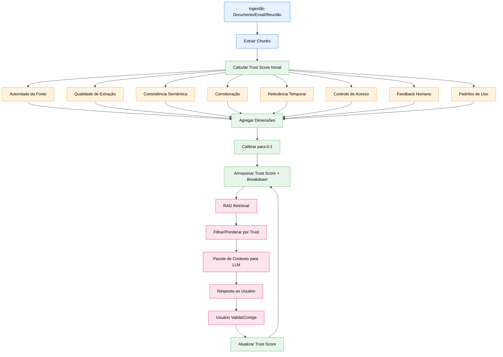
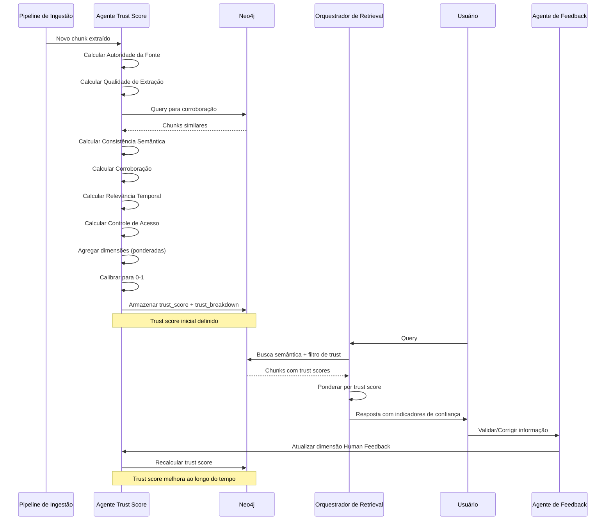

# Especificação de Feature: Trust Score para Chunks RAG

**Feature Branch**: `043-trust-score-rag`  
**Criado**: 2025-12-29  
**Status**: Draft  
**Prioridade**: P1 (Quality)  
**Fonte**: Insights dos chats (chat007) + requisitos de confiabilidade RAG

## Contexto & Propósito

O **Trust Score** é uma probabilidade calibrada (0.0-1.0) que indica a confiabilidade de chunks de informação recuperados para RAG (Retrieval Augmented Generation). Ele aborda um gap crítico em sistemas RAG atuais: **nem toda informação recuperada é igualmente confiável**.

Trust Score possibilita:
- **Confiabilidade Transparente** - Usuários veem o quanto confiar em cada pedaço de informação
- **Retrieval Ponderado** - Chunks de maior confiança são priorizados no contexto
- **IA Explicável** - Usuários entendem POR QUE um chunk tem alta/baixa confiança
- **Loop de Feedback de Qualidade** - Trust scores melhoram ao longo do tempo com validação
- **Gestão de Risco** - Decisões críticas usam apenas informação de alta confiança

Isso é especialmente importante para **emails e reuniões** onde a qualidade da informação varia significativamente baseado em fonte, método de extração e corroboração.

---

## Fluxo de Processo (Visão de Negócio)



### Insights do Fluxo

**Gaps identificados**:
- Como calibrar scores entre diferentes tipos de documento? (emails vs docs oficiais)
- Qual peso cada dimensão deveria ter? (específico de domínio vs universal)
- Como lidar com problema de cold-start? (novos chunks sem dados de uso/feedback)
- Como prevenir manipulação de score? (gaming the system)

**Oportunidades identificadas**:
- Aprender pesos ótimos de dimensões a partir de feedback do usuário ao longo do tempo
- Detectar "trust drift" (scores diminuindo ao longo do tempo) como alerta precoce
- Identificar "campeões de confiança" (usuários cujas validações melhoram acurácia)
- Auto-sugerir upgrades de documento (ex: "Converter este email para doc oficial?")
- Gerar relatórios de confiança para compliance/auditoria
- Habilitar "busca trust-aware" (mostrar apenas resultados acima do threshold)

**Riscos identificados**:
- Dependência excessiva em trust scores pode descartar conhecimento informal valioso
- Overhead de cálculo de score pode lentificar pipeline de ingestão
- Usuários podem não entender nuances de trust score (educação necessária)
- Chunks de baixa confiança podem criar viés negativo contra certas fontes

---

## Colaboração de Agentes



---

## Cenários de Usuário & Testes

### User Story 1 - Exibição de Trust Score no Retrieval (Prioridade: P1)

Como usuário, quero ver trust scores para informação recuperada para que eu possa avaliar confiabilidade antes de tomar decisões.

**Por que esta prioridade**: Proposta de valor central. Usuários precisam de transparência para confiar no sistema.

**Teste Independente**: Recuperar chunks com trust scores variados, verificar que UI exibe scores com explicações.

**Cenários de Aceitação**:

1. **Dado** usuário pergunta "O que foi decidido na última reunião do board?", **Quando** sistema recupera chunks, **Então** cada chunk exibe trust score como badge colorido (verde >0.8, amarelo 0.5-0.8, vermelho <0.5)

2. **Dado** usuário passa mouse sobre badge de trust score, **Quando** tooltip aparece, **Então** mostra breakdown: "Fonte: Ata Oficial (0.95), Extração: Alta (0.90), Corroboração: 3 fontes (0.85), Geral: 0.90"

3. **Dado** usuário clica "Por que este score?", **Quando** painel de explicabilidade abre, **Então** mostra breakdown detalhado de todas 8 dimensões com indicadores visuais

---

### User Story 2 - Retrieval Filtrado por Trust (Prioridade: P1)

Como usuário, quero filtrar resultados de busca por trust score mínimo para que eu veja apenas informação confiável para decisões críticas.

**Por que esta prioridade**: Gestão de risco. Decisões de alto impacto requerem informação de alta confiança.

**Teste Independente**: Definir threshold de confiança, verificar que apenas chunks acima do threshold são retornados.

**Cenários de Aceitação**:

1. **Dado** usuário habilita modo "Alta Confiança Apenas", **Quando** sistema recupera chunks, **Então** retorna apenas chunks com trust_score ≥ 0.8

2. **Dado** usuário define threshold customizado (ex: 0.7), **Quando** busca é executada, **Então** resultados são filtrados e UI mostra "Mostrando 12 de 45 resultados (confiança ≥ 0.7)"

3. **Dado** nenhum chunk atende threshold de confiança, **Quando** busca retorna vazio, **Então** sistema sugere "Diminuir threshold para 0.6 para ver 8 resultados adicionais"

---

### User Story 3 - Scoring de Email/Reunião (Prioridade: P0)

Como sistema, quero atribuir trust scores apropriados a chunks de email e reunião baseado em autoridade da fonte e qualidade de extração.

**Por que esta prioridade**: Emails/reuniões são caso de uso primário. Qualidade varia significativamente.

**Teste Independente**: Ingerir email e transcrição de reunião, verificar que trust scores refletem diferenças de qualidade.

**Cenários de Aceitação**:

1. **Dado** email do CEO, **Quando** Trust Agent calcula Autoridade da Fonte, **Então** atribui score alto (0.9) baseado no cargo do remetente

2. **Dado** email de contato externo (desconhecido), **Quando** Trust Agent calcula Autoridade da Fonte, **Então** atribui score médio (0.5) pendente validação

3. **Dado** transcrição de reunião do Zoom (auto-transcrita), **Quando** Trust Agent calcula Qualidade de Extração, **Então** atribui score médio (0.6) devido à incerteza de OCR

4. **Dado** ata de reunião (escrita por humano), **Quando** Trust Agent calcula Qualidade de Extração, **Então** atribui score alto (0.95) devido ao formato estruturado

---

### User Story 4 - Boost de Corroboração (Prioridade: P1)

Como sistema, quero aumentar trust scores quando informação é corroborada por múltiplas fontes independentes.

**Por que esta prioridade**: Corroboração é sinal forte de confiabilidade. Reduz falso-positivos.

**Teste Independente**: Ingerir mesmo fato de 3 fontes diferentes, verificar que trust score aumenta.

**Cenários de Aceitação**:

1. **Dado** chunk afirma "Empresa X levantou $5M", **Quando** Trust Agent encontra 2 outros chunks com mesmo fato de fontes diferentes, **Então** score de dimensão Corroboração = 0.9 (3 fontes)

2. **Dado** chunk é único (sem corroboração), **Quando** Trust Agent busca chunks similares, **Então** score de dimensão Corroboração = 0.3 (fonte única)

3. **Dado** chunk é contradito por outras fontes, **Quando** Trust Agent detecta conflito, **Então** score de dimensão Corroboração = 0.1 e marca conflito

---

### User Story 5 - Loop de Feedback Humano (Prioridade: P1)

Como usuário, quero validar ou corrigir informação para que trust scores melhorem ao longo do tempo.

**Por que esta prioridade**: Melhoria contínua. Sistema aprende com expertise do usuário.

**Teste Independente**: Usuário valida chunk, verificar que trust score aumenta.

**Cenários de Aceitação**:

1. **Dado** usuário lê chunk e clica "Isso está correto", **Quando** Agente de Feedback processa validação, **Então** dimensão Human Feedback aumenta de 0.5 para 0.8

2. **Dado** usuário corrige informação em chunk, **Quando** correção é salva, **Então** trust score do chunk original diminui para 0.3 e novo chunk corrigido tem trust score 0.9

3. **Dado** múltiplos usuários validam mesmo chunk, **Quando** Trust Agent agrega feedback, **Então** dimensão Human Feedback = (validações_positivas / total_validações)

---

## Requisitos Funcionais

### Cálculo de Trust Score

- **REQ-TRUST-001**: Todo node (:Chunk) DEVE ter `trust_score` (float 0.0-1.0) e `trust_breakdown` (JSON)
- **REQ-TRUST-002**: Trust score DEVE ser calculado como média ponderada de 8 dimensões
- **REQ-TRUST-003**: Pesos padrão de dimensões DEVEM ser: Autoridade da Fonte (20%), Qualidade de Extração (15%), Consistência Semântica (15%), Corroboração (15%), Relevância Temporal (10%), Controle de Acesso (5%), Feedback Humano (15%), Padrões de Uso (5%)
- **REQ-TRUST-004**: Pesos de dimensões DEVEM ser configuráveis por organização
- **REQ-TRUST-005**: Trust score DEVE ser recalculado quando qualquer dimensão muda significativamente (Δ > 0.1)

### Dimensão 1: Autoridade da Fonte (20%)

- **REQ-TRUST-006**: Autoridade da Fonte DEVE considerar: tipo de documento, cargo do autor, canal de publicação
- **REQ-TRUST-007**: Scores de tipo de documento: Documento oficial (1.0), Memo interno (0.8), Email de executivo (0.7), Email de colega (0.5), Mensagem de chat (0.3), Fonte externa (0.4)
- **REQ-TRUST-008**: Cargo do autor DEVE ser determinado do perfil do usuário ou inferido do domínio do email
- **REQ-TRUST-009**: Scores de canal de publicação: Intranet da empresa (0.9), Drive compartilhado (0.7), Email pessoal (0.5), Website externo (0.4)

### Dimensão 2: Qualidade de Extração (15%)

- **REQ-TRUST-010**: Qualidade de Extração DEVE considerar: confiança de parsing, acurácia de OCR, preservação de estrutura
- **REQ-TRUST-011**: Confiança de parsing DEVE ser fornecida pelo pipeline de extração (0.0-1.0)
- **REQ-TRUST-012**: Acurácia de OCR (se aplicável) DEVE ser estimada a partir de scores de confiança de caracteres
- **REQ-TRUST-013**: Score de preservação de estrutura: Estrutura perfeita (1.0), Perda menor de formatação (0.8), Perda significativa (0.5), Corrompido (0.2)

### Dimensão 3: Consistência Semântica (15%)

- **REQ-TRUST-014**: Consistência Semântica DEVE medir alinhamento com ontologia da empresa (conceitos GIN)
- **REQ-TRUST-015**: Score de consistência = (conceitos_correspondidos / total_conceitos) onde conceitos correspondidos existem no GIN
- **REQ-TRUST-016**: Chunks com termos indefinidos/ambíguos DEVEM ter scores de consistência menores
- **REQ-TRUST-017**: Consistência DEVE ser calculada usando similaridade de embedding para definições de conceitos canônicos

### Dimensão 4: Corroboração (15%)

- **REQ-TRUST-018**: Corroboração DEVE buscar chunks similares de fontes independentes
- **REQ-TRUST-019**: Score de corroboração = min(1.0, log2(fontes_corroborantes + 1) / 3)
- **REQ-TRUST-020**: Fontes são independentes se: documento diferente, autor diferente, timestamp diferente (>24h de diferença)
- **REQ-TRUST-021**: Fontes contraditórias DEVEM diminuir score de corroboração para <0.2

### Dimensão 5: Relevância Temporal (10%)

- **REQ-TRUST-022**: Relevância Temporal DEVE considerar: idade do chunk, última data de validação, volatilidade do tópico
- **REQ-TRUST-023**: Score de relevância = base_score * decay_factor onde decay_factor = e^(-idade_dias / meia_vida_dias)
- **REQ-TRUST-024**: Meia-vida DEVE ser específica por tópico: Dados financeiros (30 dias), Specs de produto (90 dias), História da empresa (365 dias), Processos (180 dias)
- **REQ-TRUST-025**: Chunks recentemente validados (últimos 30 dias) DEVEM ter relevância temporal elevada para 1.0

### Dimensão 6: Controle de Acesso (5%)

- **REQ-TRUST-026**: Controle de Acesso DEVE verificar que usuário tem permissão para ver esta informação
- **REQ-TRUST-027**: Score = 1.0 se usuário tem acesso total, 0.5 se acesso parcial, 0.0 se sem acesso (chunk não deve ser recuperado)
- **REQ-TRUST-028**: Acesso parcial aplica quando: usuário pode ver resumo mas não detalhes, usuário pode ver com redações

### Dimensão 7: Feedback Humano (15%)

- **REQ-TRUST-029**: Feedback Humano DEVE rastrear: validações explícitas, correções, uso em decisões
- **REQ-TRUST-030**: Score de feedback = (feedback_positivo / total_feedback) com suavização de Laplace: (positivo + 1) / (total + 2)
- **REQ-TRUST-031**: Tipos de feedback: Validação explícita (+1), Correção (-1), Usado em decisão (+0.5), Ignorado (-0.2)
- **REQ-TRUST-032**: Feedback de especialistas do domínio DEVE ser ponderado 2x maior que usuários regulares

### Dimensão 8: Padrões de Uso (5%)

- **REQ-TRUST-033**: Padrões de Uso DEVEM considerar: frequência de retrieval, taxa de sucesso de contexto, engajamento do usuário
- **REQ-TRUST-034**: Score de uso = (retrievals_bem_sucedidos / total_retrievals) onde bem-sucedido = usuário engajou com chunk
- **REQ-TRUST-035**: Indicadores de engajamento: Tempo de leitura >5s, clicou para detalhes, usado em query de follow-up, compartilhado com colegas
- **REQ-TRUST-036**: Chunks nunca recuperados DEVEM ter score de uso = 0.5 (neutro, não penalizado)

### Agente Trust Score

- **REQ-TRUST-037**: Agente Trust Score DEVE executar em toda ingestão de chunk para calcular score inicial
- **REQ-TRUST-038**: Agente Trust Score DEVE recalcular scores diariamente para chunks acessados nos últimos 7 dias
- **REQ-TRUST-039**: Agente Trust Score DEVE recalcular imediatamente quando feedback humano é recebido
- **REQ-TRUST-040**: Agente Trust Score DEVE registrar todas mudanças de score com motivo em (:TrustScoreHistory)

### Integração com Retrieval

- **REQ-TRUST-041**: Orquestrador de Retrieval DEVE suportar parâmetro trust_threshold (padrão: 0.0, sem filtragem)
- **REQ-TRUST-042**: Retrieval DEVE ponderar chunks por: relevance_score * trust_score para ranking
- **REQ-TRUST-043**: Pacote de contexto DEVE incluir trust_score e trust_breakdown para cada chunk
- **REQ-TRUST-044**: UI DEVE exibir trust score como badge colorido com tooltip de explicação

---

## Requisitos Não-Funcionais

### Performance

- **REQ-TRUST-NFR-001**: Cálculo inicial de trust score DEVE completar em <200ms por chunk
- **REQ-TRUST-NFR-002**: Recálculo de trust score DEVE completar em <100ms por chunk
- **REQ-TRUST-NFR-003**: Busca de corroboração DEVE completar em <500ms (query de similaridade semântica)

### Acurácia

- **REQ-TRUST-NFR-004**: Trust scores DEVEM correlacionar >0.75 com avaliações humanas de confiabilidade
- **REQ-TRUST-NFR-005**: Chunks de alta confiança (>0.8) DEVEM ter <5% taxa de erro em validação
- **REQ-TRUST-NFR-006**: Calibração de trust score DEVE ser atualizada mensalmente baseado em dados de feedback

### Explicabilidade

- **REQ-TRUST-NFR-007**: Trust breakdown DEVE ser legível por humanos com nomes de dimensões claros
- **REQ-TRUST-NFR-008**: UI DEVE explicar cada dimensão em <50 palavras
- **REQ-TRUST-NFR-009**: Usuários DEVEM poder aprofundar em detalhes de cálculo de dimensão

---

## Critérios de Sucesso

1. **Acurácia de Score**: Trust scores correlacionam >0.75 com avaliações humanas de confiabilidade (validado em 500+ chunks)
2. **Confiança do Usuário**: 80% dos usuários reportam que trust scores ajudam a avaliar confiabilidade da informação (survey)
3. **Qualidade de Decisão**: Decisões de alto impacto usam chunks com trust score médio >0.8
4. **Loop de Feedback**: Trust scores melhoram em média 0.15 após 3 meses de feedback do usuário
5. **Qualidade de Retrieval**: Usuários avaliam resultados 40% mais relevantes com ranking ponderado por trust
6. **Explicabilidade**: 90% dos usuários entendem breakdown de trust score sem treinamento

---

## Entidades-Chave

### Propriedades Neo4j (Estendidas)

**Propriedades de :Chunk** (novas):
- `trust_score`: float (0.0-1.0) - Trust score calibrado geral
- `trust_breakdown`: JSON - Scores detalhados para cada dimensão
  ```json
  {
    "source_authority": 0.85,
    "extraction_quality": 0.90,
    "semantic_consistency": 0.75,
    "corroboration": 0.80,
    "temporal_relevance": 0.70,
    "access_control": 1.0,
    "human_feedback": 0.65,
    "usage_patterns": 0.55,
    "last_calculated": "2025-12-29T10:30:00Z"
  }
  ```
- `trust_history_id`: UUID - Link para histórico de trust score

### Tipos de Node Neo4j (Novos)

- **:TrustScoreHistory** - Trilha de auditoria de mudanças de trust score
- **:TrustFeedback** - Feedback do usuário sobre confiabilidade de chunk

### Relacionamentos Neo4j (Novos)

- **[:HAS_TRUST_HISTORY]** - Chunk → TrustScoreHistory
- **[:VALIDATED_BY]** - Chunk → User (via TrustFeedback)
- **[:CORROBORATES]** - Chunk → Chunk (link de corroboração)

---

## Dependências

- **Spec 040** (Business Intent Graph) - Consistência Semântica usa ontologia GIN
- **Spec 024** (Retrieval Orchestration) - Trust scores integrados no retrieval
- **Spec 012** (Graph Curation Ecosystem) - Trust Agent parte do pipeline de curadoria
- **Spec 019** (Multi-Agent Orchestration) - Feedback Agent lida com validações

---

## Premissas

1. Usuários entendem scores de probabilidade (escala 0.0-1.0)
2. Pesos de dimensões são padrões razoáveis (podem ser ajustados por organização)
3. Busca de corroboração é computacionalmente viável (similaridade semântica)
4. Feedback humano está disponível e é confiável (não adversarial)
5. Trust scores não criam dependência excessiva (usuários ainda aplicam julgamento)

---

## Fora do Escopo

- Atualizações de trust score em tempo real (calculado em schedule ou gatilho)
- Benchmarking de trust score entre empresas (futuro)
- Sugestões automáticas de upgrade de conteúdo (capacidade IA futura)
- Trust score para conteúdo gerado (outputs de LLM) (spec separada)
- Integração com serviços externos de fact-checking (futuro)

---

## Notas

- Trust Score é inspirado por probabilidade calibrada em forecasting (Brier score)
- 8 dimensões escolhidas baseadas em pesquisa de qualidade de informação e melhores práticas RAG
- Corroboração é poderosa mas computacionalmente cara (requer busca semântica)
- Feedback humano é dimensão mais valiosa mas tem problema de cold-start
- Trust scores devem ser transparentes, não métricas "caixa preta" escondidas
- Explicabilidade é crítica para adoção do usuário e confiança no sistema

