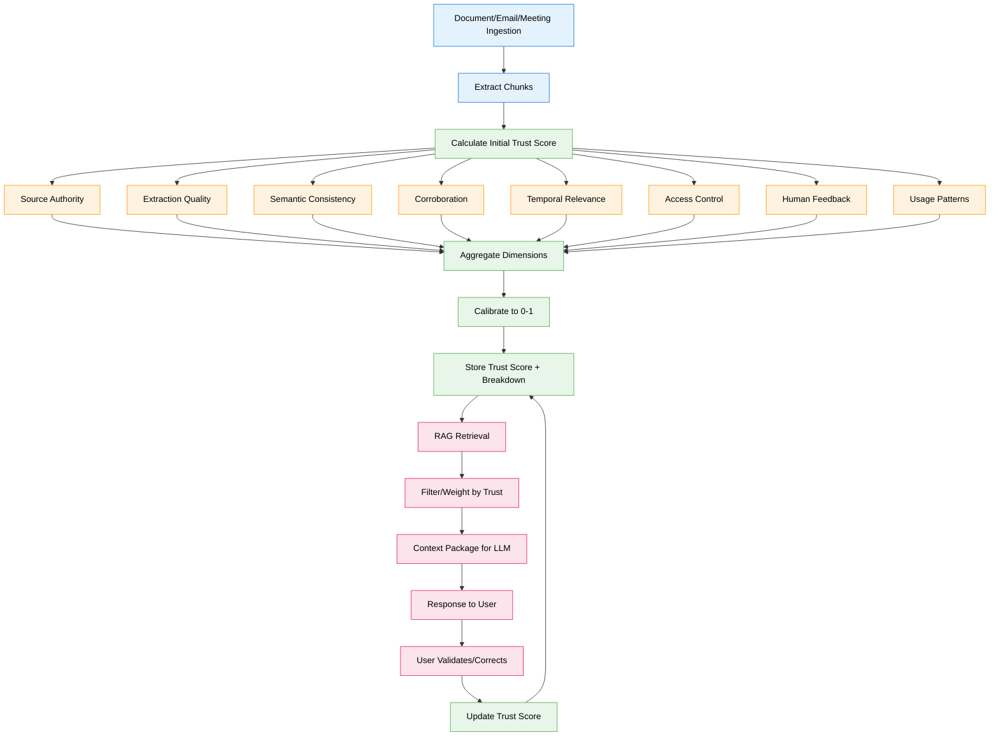
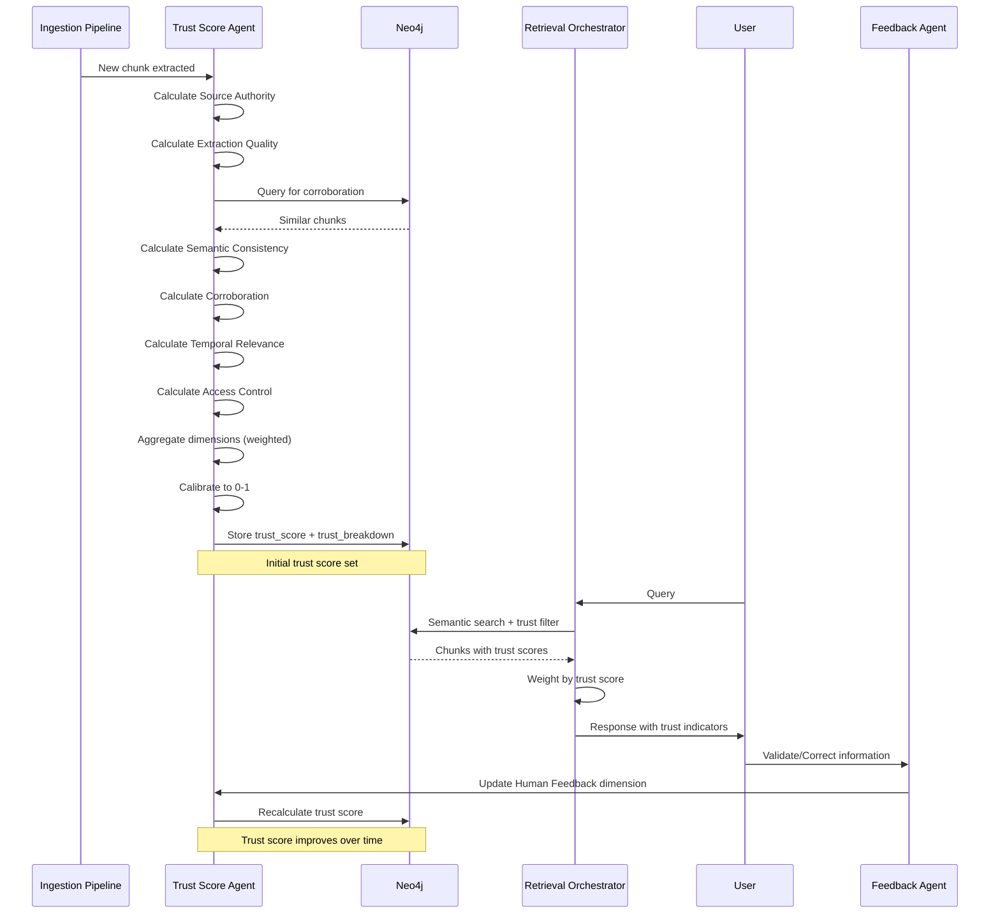

# Feature Specification: Trust Score for RAG Chunks

**Feature Branch**: `033-trust-score-rag`  
**Created**: 2025-12-29  
**Status**: Draft  
**Priority**: P1 (Quality)  
**Source**: Chat insights (chat007) + RAG reliability requirements

## Context & Purpose

The **Trust Score** is a calibrated probability (0.0-1.0) that indicates the reliability of information chunks retrieved for RAG (Retrieval Augmented Generation). It addresses a critical gap in current RAG systems: **not all retrieved information is equally trustworthy**.

Trust Score enables:
- **Transparent Reliability** - Users see how much to trust each piece of information
- **Weighted Retrieval** - Higher-trust chunks are prioritized in context
- **Explainable AI** - Users understand WHY a chunk has high/low trust
- **Quality Feedback Loop** - Trust scores improve over time with validation
- **Risk Management** - Critical decisions use only high-trust information

This is especially important for **emails and meetings** where information quality varies significantly based on source, extraction method, and corroboration.

---

## Process Flow (Business View)



### Flow Insights

**Gaps identified**:
- How to calibrate scores across different document types? (emails vs official docs)
- What weight should each dimension have? (domain-specific vs universal)
- How to handle cold-start problem? (new chunks have no usage/feedback data)
- How to prevent score manipulation? (gaming the system)

**Opportunities identified**:
- Learn optimal dimension weights from user feedback over time
- Detect "trust drift" (scores decreasing over time) as early warning
- Identify "trust champions" (users whose validations improve accuracy)
- Auto-suggest document upgrades (e.g., "Convert this email to official doc?")
- Generate trust reports for compliance/audit
- Enable "trust-aware search" (only show results above threshold)

**Risks identified**:
- Over-reliance on trust scores may dismiss valuable informal knowledge
- Score calculation overhead may slow ingestion pipeline
- Users may not understand trust score nuances (education needed)
- Low-trust chunks may create negative bias against certain sources

---

## Agent Collaboration



---

## User Scenarios & Testing

### User Story 1 - Trust Score Display in Retrieval (Priority: P1)

As a user, I want to see trust scores for retrieved information so that I can assess reliability before making decisions.

**Why this priority**: Core value proposition. Users need transparency to trust the system.

**Independent Test**: Retrieve chunks with varying trust scores, verify UI displays scores with explanations.

**Acceptance Scenarios**:

1. **Given** user queries "What was decided in last board meeting?", **When** system retrieves chunks, **Then** each chunk displays trust score as colored badge (green >0.8, yellow 0.5-0.8, red <0.5)

2. **Given** user hovers over trust score badge, **When** tooltip appears, **Then** shows breakdown: "Source: Official Minutes (0.95), Extraction: High (0.90), Corroboration: 3 sources (0.85), Overall: 0.90"

3. **Given** user clicks "Why this score?", **When** explainability panel opens, **Then** shows detailed breakdown of all 8 dimensions with visual indicators

---

### User Story 2 - Trust-Filtered Retrieval (Priority: P1)

As a user, I want to filter search results by minimum trust score so that I only see reliable information for critical decisions.

**Why this priority**: Risk management. High-stakes decisions require high-trust information.

**Independent Test**: Set trust threshold, verify only chunks above threshold are returned.

**Acceptance Scenarios**:

1. **Given** user enables "High Trust Only" mode, **When** system retrieves chunks, **Then** only returns chunks with trust_score ≥ 0.8

2. **Given** user sets custom threshold (e.g., 0.7), **When** search is executed, **Then** results are filtered and UI shows "Showing 12 of 45 results (trust ≥ 0.7)"

3. **Given** no chunks meet trust threshold, **When** search returns empty, **Then** system suggests "Lower trust threshold to 0.6 to see 8 more results"

---

### User Story 3 - Email/Meeting Trust Scoring (Priority: P0)

As the system, I want to assign appropriate trust scores to email and meeting chunks based on source authority and extraction quality.

**Why this priority**: Emails/meetings are primary use case. Quality varies significantly.

**Independent Test**: Ingest email and meeting transcript, verify trust scores reflect quality differences.

**Acceptance Scenarios**:

1. **Given** email from CEO, **When** Trust Agent calculates Source Authority, **Then** assigns high score (0.9) based on sender role

2. **Given** email from external contact (unknown), **When** Trust Agent calculates Source Authority, **Then** assigns medium score (0.5) pending validation

3. **Given** meeting transcript from Zoom (auto-transcribed), **When** Trust Agent calculates Extraction Quality, **Then** assigns medium score (0.6) due to OCR uncertainty

4. **Given** meeting minutes (human-written), **When** Trust Agent calculates Extraction Quality, **Then** assigns high score (0.95) due to structured format

---

### User Story 4 - Corroboration Boost (Priority: P1)

As the system, I want to increase trust scores when information is corroborated by multiple independent sources.

**Why this priority**: Corroboration is strong signal of reliability. Reduces false positives.

**Independent Test**: Ingest same fact from 3 different sources, verify trust score increases.

**Acceptance Scenarios**:

1. **Given** chunk states "Company X raised $5M", **When** Trust Agent finds 2 other chunks with same fact from different sources, **Then** Corroboration dimension score = 0.9 (3 sources)

2. **Given** chunk is unique (no corroboration), **When** Trust Agent searches for similar chunks, **Then** Corroboration dimension score = 0.3 (single source)

3. **Given** chunk is contradicted by other sources, **When** Trust Agent detects conflict, **Then** Corroboration dimension score = 0.1 and flags conflict

---

### User Story 5 - Human Feedback Loop (Priority: P1)

As a user, I want to validate or correct information so that trust scores improve over time.

**Why this priority**: Continuous improvement. System learns from user expertise.

**Independent Test**: User validates chunk, verify trust score increases.

**Acceptance Scenarios**:

1. **Given** user reads chunk and clicks "This is accurate", **When** Feedback Agent processes validation, **Then** Human Feedback dimension increases from 0.5 to 0.8

2. **Given** user corrects information in chunk, **When** correction is saved, **Then** original chunk trust score decreases to 0.3 and new corrected chunk has trust score 0.9

3. **Given** multiple users validate same chunk, **When** Trust Agent aggregates feedback, **Then** Human Feedback dimension = (positive_validations / total_validations)

---

## Functional Requirements

### Trust Score Calculation

- **REQ-TRUST-001**: Every (:Chunk) node MUST have `trust_score` (float 0.0-1.0) and `trust_breakdown` (JSON)
- **REQ-TRUST-002**: Trust score MUST be calculated as weighted average of 8 dimensions
- **REQ-TRUST-003**: Default dimension weights MUST be: Source Authority (20%), Extraction Quality (15%), Semantic Consistency (15%), Corroboration (15%), Temporal Relevance (10%), Access Control (5%), Human Feedback (15%), Usage Patterns (5%)
- **REQ-TRUST-004**: Dimension weights MUST be configurable per organization
- **REQ-TRUST-005**: Trust score MUST be recalculated when any dimension changes significantly (Δ > 0.1)

### Dimension 1: Source Authority (20%)

- **REQ-TRUST-006**: Source Authority MUST consider: document type, author role, publication channel
- **REQ-TRUST-007**: Document type scores: Official document (1.0), Internal memo (0.8), Email from executive (0.7), Email from colleague (0.5), Chat message (0.3), External source (0.4)
- **REQ-TRUST-008**: Author role MUST be determined from user profile or inferred from email domain
- **REQ-TRUST-009**: Publication channel scores: Company intranet (0.9), Shared drive (0.7), Personal email (0.5), External website (0.4)

### Dimension 2: Extraction Quality (15%)

- **REQ-TRUST-010**: Extraction Quality MUST consider: parsing confidence, OCR accuracy, structure preservation
- **REQ-TRUST-011**: Parsing confidence MUST be provided by extraction pipeline (0.0-1.0)
- **REQ-TRUST-012**: OCR accuracy (if applicable) MUST be estimated from character confidence scores
- **REQ-TRUST-013**: Structure preservation score: Perfect structure (1.0), Minor formatting loss (0.8), Significant loss (0.5), Corrupted (0.2)

### Dimension 3: Semantic Consistency (15%)

- **REQ-TRUST-014**: Semantic Consistency MUST measure alignment with company ontology (BIG concepts)
- **REQ-TRUST-015**: Consistency score = (matched_concepts / total_concepts) where matched concepts exist in BIG
- **REQ-TRUST-016**: Chunks with undefined/ambiguous terms MUST have lower consistency scores
- **REQ-TRUST-017**: Consistency MUST be calculated using embedding similarity to canonical concept definitions

### Dimension 4: Corroboration (15%)

- **REQ-TRUST-018**: Corroboration MUST search for similar chunks from independent sources
- **REQ-TRUST-019**: Corroboration score = min(1.0, log2(corroborating_sources + 1) / 3)
- **REQ-TRUST-020**: Sources are independent if: different document, different author, different timestamp (>24h apart)
- **REQ-TRUST-021**: Contradicting sources MUST decrease corroboration score to <0.2

### Dimension 5: Temporal Relevance (10%)

- **REQ-TRUST-022**: Temporal Relevance MUST consider: chunk age, last validation date, topic volatility
- **REQ-TRUST-023**: Relevance score = base_score * decay_factor where decay_factor = e^(-age_days / half_life_days)
- **REQ-TRUST-024**: Half-life MUST be topic-specific: Financial data (30 days), Product specs (90 days), Company history (365 days), Processes (180 days)
- **REQ-TRUST-025**: Recently validated chunks (last 30 days) MUST have temporal relevance boosted to 1.0

### Dimension 6: Access Control (5%)

- **REQ-TRUST-026**: Access Control MUST verify user has permission to see this information
- **REQ-TRUST-027**: Score = 1.0 if user has full access, 0.5 if partial access, 0.0 if no access (chunk should not be retrieved)
- **REQ-TRUST-028**: Partial access applies when: user can see summary but not details, user can see with redactions

### Dimension 7: Human Feedback (15%)

- **REQ-TRUST-029**: Human Feedback MUST track: explicit validations, corrections, usage in decisions
- **REQ-TRUST-030**: Feedback score = (positive_feedback / total_feedback) with Laplace smoothing: (positive + 1) / (total + 2)
- **REQ-TRUST-031**: Feedback types: Explicit validation (+1), Correction (-1), Used in decision (+0.5), Ignored (-0.2)
- **REQ-TRUST-032**: Feedback from domain experts MUST be weighted 2x higher than regular users

### Dimension 8: Usage Patterns (5%)

- **REQ-TRUST-033**: Usage Patterns MUST consider: retrieval frequency, context success rate, user engagement
- **REQ-TRUST-034**: Usage score = (successful_retrievals / total_retrievals) where successful = user engaged with chunk
- **REQ-TRUST-035**: Engagement indicators: Read time >5s, clicked for details, used in follow-up query, shared with colleagues
- **REQ-TRUST-036**: Chunks never retrieved MUST have usage score = 0.5 (neutral, not penalized)

### Trust Score Agent

- **REQ-TRUST-037**: Trust Score Agent MUST run on every chunk ingestion to calculate initial score
- **REQ-TRUST-038**: Trust Score Agent MUST recalculate scores daily for chunks accessed in last 7 days
- **REQ-TRUST-039**: Trust Score Agent MUST recalculate immediately when human feedback is received
- **REQ-TRUST-040**: Trust Score Agent MUST log all score changes with reason in (:TrustScoreHistory)

### Retrieval Integration

- **REQ-TRUST-041**: Retrieval Orchestrator MUST support trust_threshold parameter (default: 0.0, no filtering)
- **REQ-TRUST-042**: Retrieval MUST weight chunks by: relevance_score * trust_score for ranking
- **REQ-TRUST-043**: Context package MUST include trust_score and trust_breakdown for each chunk
- **REQ-TRUST-044**: UI MUST display trust score as colored badge with tooltip explanation

---

## Non-Functional Requirements

### Performance

- **REQ-TRUST-NFR-001**: Initial trust score calculation MUST complete in <200ms per chunk
- **REQ-TRUST-NFR-002**: Trust score recalculation MUST complete in <100ms per chunk
- **REQ-TRUST-NFR-003**: Corroboration search MUST complete in <500ms (semantic similarity query)

### Accuracy

- **REQ-TRUST-NFR-004**: Trust scores MUST correlate >0.75 with human reliability assessments
- **REQ-TRUST-NFR-005**: High-trust chunks (>0.8) MUST have <5% error rate in validation
- **REQ-TRUST-NFR-006**: Trust score calibration MUST be updated monthly based on feedback data

### Explainability

- **REQ-TRUST-NFR-007**: Trust breakdown MUST be human-readable with clear dimension names
- **REQ-TRUST-NFR-008**: UI MUST explain each dimension in <50 words
- **REQ-TRUST-NFR-009**: Users MUST be able to drill down into dimension calculation details

---

## Success Criteria

1. **Score Accuracy**: Trust scores correlate >0.75 with human reliability assessments (validated on 500+ chunks)
2. **User Trust**: 80% of users report trust scores help them assess information reliability (survey)
3. **Decision Quality**: High-stakes decisions use chunks with average trust score >0.8
4. **Feedback Loop**: Trust scores improve by average 0.15 after 3 months of user feedback
5. **Retrieval Quality**: Users rate results 40% more relevant with trust-weighted ranking
6. **Explainability**: 90% of users understand trust score breakdown without training

---

## Key Entities

### Neo4j Properties (Extended)

**:Chunk properties** (new):
- `trust_score`: float (0.0-1.0) - Overall calibrated trust score
- `trust_breakdown`: JSON - Detailed scores for each dimension
  ```json
  {
    "source_authority": 0.85,
    "extraction_quality": 0.90,
    "semantic_consistency": 0.75,
    "corroboration": 0.80,
    "temporal_relevance": 0.70,
    "access_control": 1.0,
    "human_feedback": 0.65,
    "usage_patterns": 0.55,
    "last_calculated": "2025-12-29T10:30:00Z"
  }
  ```
- `trust_history_id`: UUID - Link to trust score history

### Neo4j Node Types (New)

- **:TrustScoreHistory** - Audit trail of trust score changes
- **:TrustFeedback** - User feedback on chunk reliability

### Neo4j Relationships (New)

- **[:HAS_TRUST_HISTORY]** - Chunk → TrustScoreHistory
- **[:VALIDATED_BY]** - Chunk → User (via TrustFeedback)
- **[:CORROBORATES]** - Chunk → Chunk (corroboration link)

---

## Dependencies

- **Spec 030** (Business Intent Graph) - Semantic Consistency uses BIG ontology
- **Spec 024** (Retrieval Orchestration) - Trust scores integrated into retrieval
- **Spec 012** (Graph Curation Ecosystem) - Trust Agent part of curation pipeline
- **Spec 019** (Multi-Agent Orchestration) - Feedback Agent handles validations

---

## Assumptions

1. Users understand probability scores (0.0-1.0 scale)
2. Dimension weights are reasonable defaults (can be tuned per organization)
3. Corroboration search is computationally feasible (semantic similarity)
4. Human feedback is available and reliable (not adversarial)
5. Trust scores don't create over-reliance (users still apply judgment)

---

## Out of Scope

- Real-time trust score updates (calculated on schedule or trigger)
- Cross-company trust score benchmarking (future)
- Automatic content upgrade suggestions (future AI capability)
- Trust score for generated content (LLM outputs) (separate spec)
- Integration with external fact-checking services (future)

---

## Notes

- Trust Score is inspired by calibrated probability in forecasting (Brier score)
- 8 dimensions chosen based on information quality research and RAG best practices
- Corroboration is powerful but computationally expensive (requires semantic search)
- Human feedback is most valuable dimension but has cold-start problem
- Trust scores should be transparent, not hidden "black box" metrics
- Explainability is critical for user adoption and trust in the system

