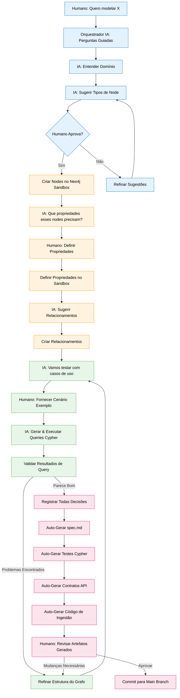
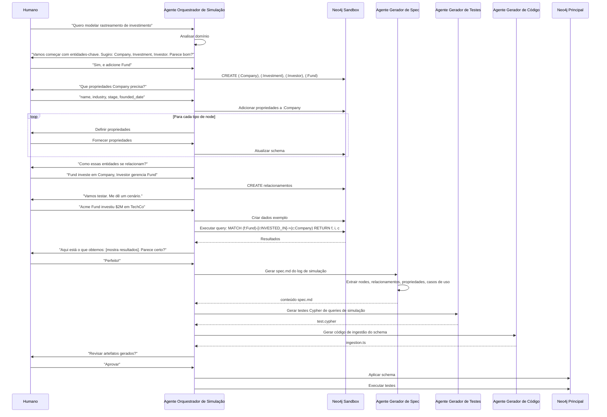

# Especificação de Feature: Simulação de Grafo Guiada por Spec

**Feature Branch**: `044-spec-driven-simulation`  
**Criado**: 2025-12-29  
**Status**: Draft  
**Prioridade**: P2 (Innovation)  
**Fonte**: Insights dos chats (chat006) + metodologia de simulação guiada

## Contexto & Propósito

**Simulação de Grafo Guiada por Spec** inverte o fluxo tradicional de desenvolvimento. Em vez de:
1. Escrever spec → 2. Escrever código → 3. Construir grafo → 4. Testar

Fazemos:
1. **Simulação guiada** (humano + IA constroem grafo interativamente) → 2. **Auto-gerar spec** → 3. **Auto-gerar testes** → 4. **Auto-gerar código**

Esta abordagem:
- **Acelera desenvolvimento** - Ver a estrutura do grafo imediatamente, não após semanas de codificação
- **Melhora qualidade** - Testar queries em dados reais antes de comprometer com schema
- **Cria specs vivas** - Especificações evoluem com o grafo, não separadamente
- **Habilita exploração** - Testar diferentes estruturas sem refatoração de código
- **Captura intenção** - Cada passo de simulação se torna documentação

O Orquestrador IA guia o humano através da construção do grafo, fazendo perguntas, sugerindo propriedades e registrando decisões como especificações executáveis.

---

## Fluxo de Processo (Visão de Negócio)

### Insights do Fluxo

**Gaps identificados**:
- Como prevenir poluição do sandbox? (limpeza entre sessões)
- Como versionar sessões de simulação? (rastrear iterações)
- Como lidar com domínios complexos requerendo múltiplas sessões? (continuidade de sessão)
- Como garantir que código gerado corresponde à simulação? (validação)

**Oportunidades identificadas**:
- Registrar simulação como tutorial executável para onboarding
- Gerar diagramas visuais de grafo automaticamente da simulação
- Criar "biblioteca de simulação" de padrões comuns (autenticação de usuário, documentos, etc.)
- Habilitar simulação colaborativa (múltiplos usuários construindo juntos)
- Gerar benchmarks de performance de queries de simulação
- Criar cenários "what-if" (fazer fork de simulação para testar alternativas)

**Riscos identificados**:
- Simulação pode não refletir complexidade de produção
- Código gerado pode requerer refinamento manual significativo
- Usuários podem pular casos extremos importantes durante simulação
- Migração sandbox-para-produção pode introduzir bugs

---

## Colaboração de Agentes

---

## Cenários de Usuário & Testes

### User Story 1 - Sessão de Simulação Guiada (Prioridade: P1)

Como desenvolvedor, quero uma IA para me guiar através da construção de uma estrutura de grafo interativamente para que eu possa visualizar o modelo antes de escrever código.

**Por que esta prioridade**: Fluxo central. Habilita prototipagem rápida.

**Teste Independente**: Iniciar sessão de simulação, construir grafo simples, verificar nodes/relacionamentos criados.

**Cenários de Aceitação**:

1. **Dado** usuário inicia simulação com "Quero modelar gestão de documentos", **Quando** Orquestrador analisa domínio, **Então** sugere tipos de node iniciais: Document, User, Folder, Tag

2. **Dado** usuário aprova tipos de node, **Quando** Orquestrador cria nodes no sandbox, **Então** confirma criação e pergunta "Que propriedades Document precisa?"

3. **Dado** usuário define propriedades, **Quando** Orquestrador aplica ao sandbox, **Então** mostra schema atual e pergunta sobre relacionamentos

4. **Dado** usuário define relacionamentos, **Quando** Orquestrador cria edges, **Então** visualiza estrutura do grafo e sugere testar com casos de uso

---

### User Story 2 - Teste de Casos de Uso (Prioridade: P1)

Como desenvolvedor, quero testar queries em dados simulados antes de comprometer com um schema para que eu possa validar que o modelo funciona para cenários reais.

**Por que esta prioridade**: Previne mudanças custosas de schema posteriormente. Valida design cedo.

**Teste Independente**: Fornecer caso de uso, verificar que Orquestrador gera dados de teste e queries apropriados.

**Cenários de Aceitação**:

1. **Dado** estrutura de grafo definida, **Quando** usuário fornece cenário "Usuário faz upload de documento para pasta", **Então** Orquestrador cria exemplo: (:User {name: "Alice"})-[:UPLOADED]->(:Document {title: "Report.pdf"})-[:IN]->(:Folder {name: "Q4 Reports"})

2. **Dado** dados de teste criados, **Quando** Orquestrador gera query "Encontrar todos documentos na pasta Q4 Reports", **Então** executa: `MATCH (f:Folder {name: "Q4 Reports"})<-[:IN]-(d:Document) RETURN d`

3. **Dado** query executada, **Quando** resultados retornados, **Então** Orquestrador mostra resultados ao usuário e pergunta "Isso corresponde à sua expectativa?"

4. **Dado** usuário identifica problema (ex: "Deveria também mostrar quem fez upload"), **Quando** usuário solicita refinamento, **Então** Orquestrador atualiza query e re-executa

---

### User Story 3 - Geração Automática de Spec (Prioridade: P1)

Como desenvolvedor, quero que a simulação gere automaticamente um documento de especificação para que eu não tenha que escrevê-lo manualmente.

**Por que esta prioridade**: Elimina trabalho redundante de documentação. Garante que spec corresponde à realidade.

**Teste Independente**: Completar simulação, verificar spec.md gerada com conteúdo correto.

**Cenários de Aceitação**:

1. **Dado** sessão de simulação completada, **Quando** Gerador de Spec processa log de simulação, **Então** gera spec.md com seções: Context, Node Types, Relationships, Properties, Use Cases

2. **Dado** spec gerada, **Quando** usuário revisa, **Então** vê todas decisões tomadas durante simulação documentadas com justificativa

3. **Dado** spec inclui casos de uso, **Quando** usuário lê seção "User Scenarios", **Então** vê cenários de teste da simulação como critérios de aceitação

---

### User Story 4 - Geração de Testes & Código (Prioridade: P2)

Como desenvolvedor, quero que a simulação gere testes Cypher e código de ingestão para que eu possa começar a implementar imediatamente.

**Por que esta prioridade**: Acelera desenvolvimento. Fornece ponto de partida funcional.

**Teste Independente**: Gerar testes e código, verificar que executam com sucesso.

**Cenários de Aceitação**:

1. **Dado** simulação completada, **Quando** Gerador de Testes processa queries, **Então** gera test.cypher com: dados de setup, queries de teste, resultados esperados, teardown

2. **Dado** testes gerados, **Quando** executados contra sandbox, **Então** todos testes passam

3. **Dado** schema finalizado, **Quando** Gerador de Código cria código de ingestão, **Então** gera funções TypeScript para: createNode, updateNode, createRelationship com type safety

4. **Dado** código gerado, **Quando** desenvolvedor revisa, **Então** vê comentários TODO para lógica de negócio que requer implementação manual

---

### User Story 5 - Refinamento Iterativo (Prioridade: P2)

Como desenvolvedor, quero refinar a estrutura do grafo durante simulação sem perder progresso para que eu possa explorar alternativas.

**Por que esta prioridade**: Encoraja experimentação. Reduz medo de fazer mudanças.

**Teste Independente**: Fazer mudanças em mid-simulação, verificar que histórico é preservado e artefatos são regenerados.

**Cenários de Aceitação**:

1. **Dado** simulação em progresso, **Quando** usuário percebe "Precisamos de um node Version para documentos", **Então** Orquestrador adiciona tipo de node e pergunta como se relaciona com nodes existentes

2. **Dado** estrutura mudada, **Quando** Orquestrador atualiza sandbox, **Então** preserva dados de teste existentes e migra para nova estrutura onde possível

3. **Dado** refinamento completo, **Quando** artefatos regenerados, **Então** spec.md mostra histórico de versões: "V1: Design inicial, V2: Suporte a versionamento adicionado"

---

## Requisitos Funcionais

### Orquestrador de Simulação

- **REQ-SIM-001**: Sistema DEVE fornecer Agente Orquestrador de Simulação (Agno) para guiar humano através da construção de grafo
- **REQ-SIM-002**: Orquestrador DEVE fazer perguntas estruturadas: entendimento de domínio, tipos de node, propriedades, relacionamentos, casos de uso
- **REQ-SIM-003**: Orquestrador DEVE sugerir padrões razoáveis baseados em análise de domínio (usando conhecimento LLM)
- **REQ-SIM-004**: Orquestrador DEVE validar inputs do usuário: tipos de propriedade, direções de relacionamento, convenções de nomenclatura
- **REQ-SIM-005**: Orquestrador DEVE manter estado de sessão de simulação: passo atual, decisões tomadas, artefatos gerados

### Ambiente Neo4j Sandbox

- **REQ-SIM-006**: Sistema DEVE fornecer database Neo4j sandbox isolado por sessão de simulação
- **REQ-SIM-007**: Sandbox DEVE suportar todas operações Neo4j: CREATE, MATCH, UPDATE, DELETE, constraints, indexes
- **REQ-SIM-008**: Sandbox DEVE ser acessível via: queries Cypher, Neo4j Browser, endpoints API
- **REQ-SIM-009**: Sandbox DEVE auto-limpar após sessão terminar (retenção configurável: 24h padrão)
- **REQ-SIM-010**: Sistema DEVE suportar snapshots de sandbox: salvar estado, restaurar estado, fazer fork para novo sandbox

### Registro de Simulação

- **REQ-SIM-011**: Todo passo de simulação DEVE ser registrado: timestamp, ação, input, output, decisão
- **REQ-SIM-012**: Log de simulação DEVE ser armazenado como JSON estruturado para acesso programático
- **REQ-SIM-013**: Log DEVE incluir: criações de node, definições de propriedade, criações de relacionamento, queries executadas, resultados validados, refinamentos feitos
- **REQ-SIM-014**: Sistema DEVE suportar replay de simulação: recriar sandbox a partir do log

### Geração de Spec

- **REQ-SIM-015**: Gerador de Spec DEVE criar spec.md seguindo formato de template SpecKit
- **REQ-SIM-016**: Spec gerada DEVE incluir: Context (da discussão de domínio), Node Types (da simulação), Relationships (da simulação), Properties (das definições), User Scenarios (dos casos de uso), Functional Requirements (inferidos da estrutura)
- **REQ-SIM-017**: Spec DEVE incluir diagrama Mermaid de Process Flow gerado dos passos de simulação
- **REQ-SIM-018**: Spec DEVE documentar decisões de design e justificativa da conversa de simulação
- **REQ-SIM-019**: Spec DEVE ser editável por humano após geração (não travada)

### Geração de Testes

- **REQ-SIM-020**: Gerador de Testes DEVE criar arquivo de teste Cypher com: setup, casos de teste, assertions, teardown
- **REQ-SIM-021**: Casos de teste DEVEM ser derivados dos casos de uso de simulação
- **REQ-SIM-022**: Cada teste DEVE incluir: descrição, dados de setup, query, resultado esperado, cleanup
- **REQ-SIM-023**: Testes DEVEM ser executáveis contra sandbox e Neo4j principal
- **REQ-SIM-024**: Gerador de Testes DEVE criar testes de casos extremos: resultados vazios, múltiplas correspondências, violações de constraint

### Geração de Código

- **REQ-SIM-025**: Gerador de Código DEVE criar funções TypeScript para: criação de node, atualização de node, criação de relacionamento, queries
- **REQ-SIM-026**: Código gerado DEVE usar driver Neo4j com tratamento adequado de erro e transações
- **REQ-SIM-027**: Código gerado DEVE incluir tipos TypeScript para: propriedades de node, propriedades de relacionamento, resultados de query
- **REQ-SIM-028**: Código gerado DEVE incluir comentários TODO para lógica de negócio requerendo implementação manual
- **REQ-SIM-029**: Gerador de Código DEVE criar contrato API (OpenAPI) para funções geradas

---

## Requisitos Não-Funcionais

### Performance

- **REQ-SIM-NFR-001**: Criação de sandbox DEVE completar em <5 segundos
- **REQ-SIM-NFR-002**: Tempo de resposta do Orquestrador DEVE ser <2 segundos por interação
- **REQ-SIM-NFR-003**: Geração de spec DEVE completar em <10 segundos para simulação com <50 passos

### Usabilidade

- **REQ-SIM-NFR-004**: Perguntas do Orquestrador DEVEM ser claras e não-técnicas (linguagem de negócio)
- **REQ-SIM-NFR-005**: Usuário DEVE poder desfazer último passo na simulação
- **REQ-SIM-NFR-006**: Sistema DEVE fornecer feedback visual: visualização de grafo, resultados de query, indicador de progresso

### Confiabilidade

- **REQ-SIM-NFR-007**: Estado de simulação DEVE ser auto-salvo a cada 5 minutos
- **REQ-SIM-NFR-008**: Sistema DEVE recuperar de erros do Orquestrador sem perder sessão
- **REQ-SIM-NFR-009**: Código gerado DEVE passar linting e type checking

---

## Critérios de Sucesso

1. **Velocidade de Desenvolvimento**: Desenvolvedores constroem modelos de grafo 60% mais rápido comparado à abordagem tradicional spec-first
2. **Qualidade**: Specs geradas têm 90% de cobertura de decisões de simulação (validado por revisão humana)
3. **Cobertura de Testes**: Testes gerados cobrem 80% dos casos de uso discutidos na simulação
4. **Usabilidade do Código**: 70% do código gerado é usado sem modificação
5. **Satisfação do Usuário**: 85% dos desenvolvedores preferem abordagem de simulação sobre workflow tradicional (survey)
6. **Velocidade de Iteração**: Refinamentos durante simulação levam <5 minutos vs horas para refatoração de código

---

## Entidades-Chave

### Tipos de Node Neo4j (Novos)

- **:SimulationSession** - Registro de sessão de simulação
- **:SimulationStep** - Passo individual na simulação
- **:GeneratedArtifact** - Spec, teste ou código gerado da simulação

### Relacionamentos Neo4j (Novos)

- **[:HAS_STEP]** - SimulationSession → SimulationStep
- **[:GENERATED]** - SimulationSession → GeneratedArtifact
- **[:REFINED_FROM]** - SimulationSession → SimulationSession (iteração)

### Propriedades

**Propriedades de :SimulationSession**:
- `id`: UUID
- `domain`: string (ex: "rastreamento de investimento")
- `user_id`: UUID
- `status`: `in_progress` | `completed` | `abandoned`
- `sandbox_db_name`: string
- `started_at`: DateTime
- `completed_at`: DateTime
- `step_count`: integer

**Propriedades de :SimulationStep**:
- `id`: UUID
- `step_number`: integer
- `step_type`: `domain_analysis` | `node_definition` | `property_definition` | `relationship_definition` | `use_case_test` | `refinement`
- `input`: JSON (input do usuário)
- `output`: JSON (resposta do sistema)
- `decision`: JSON (o que foi decidido)
- `timestamp`: DateTime

---

## Dependências

- **Spec 015** (Neo4j Graph Model) - Sandbox usa mesmo schema base
- **Spec 040** (Business Intent Graph) - Simulação pode criar estruturas compatíveis com GIN
- **Agno Framework** - Implementação do Agente Orquestrador
- **Neo4j Sandbox** - Instâncias de database isoladas

---

## Premissas

1. Usuários estão confortáveis com orientação conversacional de IA
2. Instâncias Neo4j sandbox são baratas/rápidas de provisionar
3. Qualidade de código gerado é aceitável como ponto de partida (não pronto para produção)
4. Sessões de simulação são tipicamente <2 horas
5. Desenvolvedores revisam artefatos gerados antes de usar

---

## Fora do Escopo

- Construtor visual de grafo drag-and-drop (melhoria UI futura)
- Simulação colaborativa multi-usuário (feature futura)
- Biblioteca de templates de simulação (futuro)
- Ferramentas de migração para produção (spec separada)
- Benchmarking de performance durante simulação (futuro)

---

## Notas

- Simulação de Grafo Guiada por Spec é inspirada por "especificações executáveis" e "documentação viva"
- Esta abordagem é particularmente valiosa para domínios complexos onde schema não é óbvio antecipadamente
- Artefatos gerados são pontos de partida, não produtos finais - revisão humana essencial
- Log de simulação se torna material valioso de onboarding para novos membros da equipe
- Esta metodologia alinha com princípio "mostre, não conte" - ver o grafo funcionando antes de comprometer

