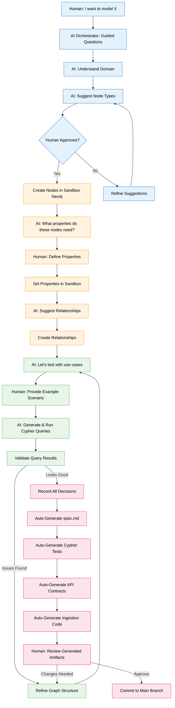
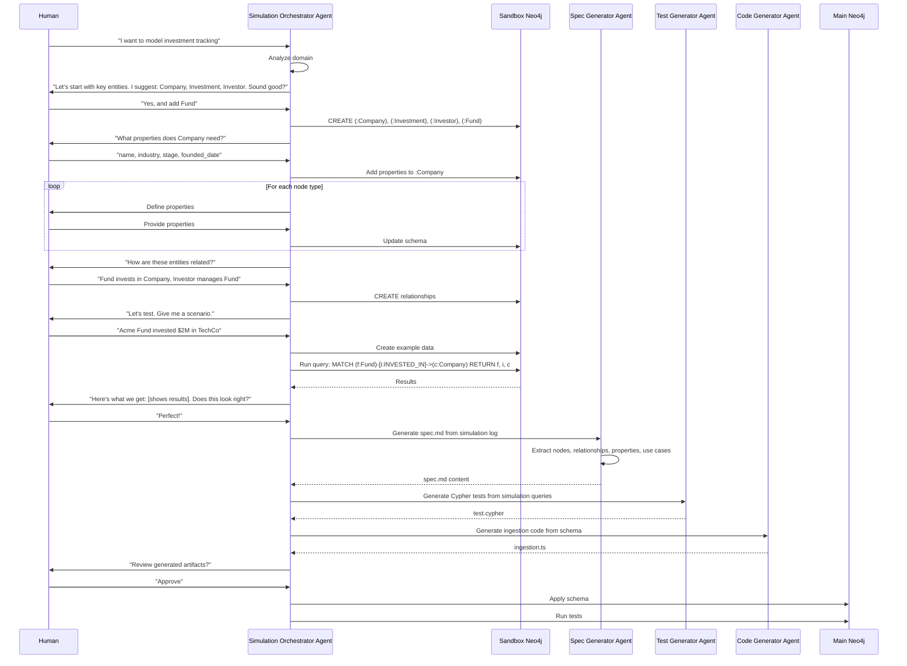

# Feature Specification: Spec-Driven Graph Simulation

**Feature Branch**: `034-spec-driven-simulation`  
**Created**: 2025-12-29  
**Status**: Draft  
**Priority**: P2 (Innovation)  
**Source**: Chat insights (chat006) + Guided simulation methodology

## Context & Purpose

**Spec-Driven Graph Simulation** inverts the traditional development workflow. Instead of:
1. Write spec → 2. Write code → 3. Build graph → 4. Test

We do:
1. **Guided simulation** (human + AI build graph interactively) → 2. **Auto-generate spec** → 3. **Auto-generate tests** → 4. **Auto-generate code**

This approach:
- **Accelerates development** - See the graph structure immediately, not after weeks of coding
- **Improves quality** - Test queries on real data before committing to schema
- **Creates living specs** - Specifications evolve with the graph, not separately
- **Enables exploration** - Try different structures without code refactoring
- **Captures intent** - Every simulation step becomes documentation

The AI Orchestrator guides the human through graph construction, asking questions, suggesting properties, and recording decisions as executable specifications.

---

## Process Flow (Business View)

### Flow Insights

**Gaps identified**:
- How to prevent sandbox pollution? (cleanup between sessions)
- How to version simulation sessions? (track iterations)
- How to handle complex domains requiring multiple sessions? (session continuity)
- How to ensure generated code matches simulation? (validation)

**Opportunities identified**:
- Record simulation as executable tutorial for onboarding
- Generate visual graph diagrams automatically from simulation
- Create "simulation library" of common patterns (user auth, documents, etc.)
- Enable collaborative simulation (multiple users building together)
- Generate performance benchmarks from simulation queries
- Create "what-if" scenarios (fork simulation to test alternatives)

**Risks identified**:
- Simulation may not reflect production complexity
- Generated code may require significant manual refinement
- Users may skip important edge cases during simulation
- Sandbox-to-production migration may introduce bugs

---

## Agent Collaboration

---

## User Scenarios & Testing

### User Story 1 - Guided Simulation Session (Priority: P1)

As a developer, I want an AI to guide me through building a graph structure interactively so that I can visualize the model before writing code.

**Why this priority**: Core workflow. Enables rapid prototyping.

**Independent Test**: Start simulation session, build simple graph, verify nodes/relationships created.

**Acceptance Scenarios**:

1. **Given** user starts simulation with "I want to model document management", **When** Orchestrator analyzes domain, **Then** suggests initial node types: Document, User, Folder, Tag

2. **Given** user approves node types, **When** Orchestrator creates nodes in sandbox, **Then** confirms creation and asks "What properties does Document need?"

3. **Given** user defines properties, **When** Orchestrator applies to sandbox, **Then** shows current schema and asks about relationships

4. **Given** user defines relationships, **When** Orchestrator creates edges, **Then** visualizes graph structure and suggests testing with use cases

---

### User Story 2 - Use Case Testing (Priority: P1)

As a developer, I want to test queries on simulated data before committing to a schema so that I can validate the model works for real scenarios.

**Why this priority**: Prevents costly schema changes later. Validates design early.

**Independent Test**: Provide use case, verify Orchestrator generates appropriate test data and queries.

**Acceptance Scenarios**:

1. **Given** graph structure defined, **When** user provides scenario "User uploads document to folder", **Then** Orchestrator creates example: (:User {name: "Alice"})-[:UPLOADED]->(:Document {title: "Report.pdf"})-[:IN]->(:Folder {name: "Q4 Reports"})

2. **Given** test data created, **When** Orchestrator generates query "Find all documents in Q4 Reports folder", **Then** runs: `MATCH (f:Folder {name: "Q4 Reports"})<-[:IN]-(d:Document) RETURN d`

3. **Given** query executed, **When** results returned, **Then** Orchestrator shows results to user and asks "Does this match your expectation?"

4. **Given** user identifies issue (e.g., "Should also show who uploaded"), **When** user requests refinement, **Then** Orchestrator updates query and re-runs

---

### User Story 3 - Automatic Spec Generation (Priority: P1)

As a developer, I want the simulation to automatically generate a specification document so that I don't have to write it manually.

**Why this priority**: Eliminates redundant documentation work. Ensures spec matches reality.

**Independent Test**: Complete simulation, verify spec.md generated with correct content.

**Acceptance Scenarios**:

1. **Given** simulation session completed, **When** Spec Generator processes simulation log, **Then** generates spec.md with sections: Context, Node Types, Relationships, Properties, Use Cases

2. **Given** spec generated, **When** user reviews, **Then** sees all decisions made during simulation documented with rationale

3. **Given** spec includes use cases, **When** user reads "User Scenarios" section, **Then** sees test scenarios from simulation as acceptance criteria

---

### User Story 4 - Test & Code Generation (Priority: P2)

As a developer, I want the simulation to generate Cypher tests and ingestion code so that I can immediately start implementing.

**Why this priority**: Accelerates development. Provides working starting point.

**Independent Test**: Generate tests and code, verify they execute successfully.

**Acceptance Scenarios**:

1. **Given** simulation completed, **When** Test Generator processes queries, **Then** generates test.cypher with: setup data, test queries, expected results, teardown

2. **Given** tests generated, **When** run against sandbox, **Then** all tests pass

3. **Given** schema finalized, **When** Code Generator creates ingestion code, **Then** generates TypeScript functions for: createNode, updateNode, createRelationship with type safety

4. **Given** code generated, **When** developer reviews, **Then** sees TODO comments for business logic that requires manual implementation

---

### User Story 5 - Iterative Refinement (Priority: P2)

As a developer, I want to refine the graph structure during simulation without losing progress so that I can explore alternatives.

**Why this priority**: Encourages experimentation. Reduces fear of making changes.

**Independent Test**: Make changes mid-simulation, verify history preserved and artifacts regenerated.

**Acceptance Scenarios**:

1. **Given** simulation in progress, **When** user realizes "We need a Version node for documents", **Then** Orchestrator adds node type and asks how it relates to existing nodes

2. **Given** structure changed, **When** Orchestrator updates sandbox, **Then** preserves existing test data and migrates to new structure where possible

3. **Given** refinement complete, **When** artifacts regenerated, **Then** spec.md shows version history: "V1: Initial design, V2: Added versioning support"

---

## Functional Requirements

### Simulation Orchestrator

- **REQ-SIM-001**: System MUST provide Simulation Orchestrator Agent (Agno) to guide human through graph construction
- **REQ-SIM-002**: Orchestrator MUST ask structured questions: domain understanding, node types, properties, relationships, use cases
- **REQ-SIM-003**: Orchestrator MUST suggest reasonable defaults based on domain analysis (using LLM knowledge)
- **REQ-SIM-004**: Orchestrator MUST validate user inputs: property types, relationship directions, naming conventions
- **REQ-SIM-005**: Orchestrator MUST maintain simulation session state: current step, decisions made, artifacts generated

### Sandbox Neo4j Environment

- **REQ-SIM-006**: System MUST provide isolated sandbox Neo4j database per simulation session
- **REQ-SIM-007**: Sandbox MUST support all Neo4j operations: CREATE, MATCH, UPDATE, DELETE, constraints, indexes
- **REQ-SIM-008**: Sandbox MUST be accessible via: Cypher queries, Neo4j Browser, API endpoints
- **REQ-SIM-009**: Sandbox MUST auto-cleanup after session ends (configurable retention: 24h default)
- **REQ-SIM-010**: System MUST support sandbox snapshots: save state, restore state, fork to new sandbox

### Simulation Recording

- **REQ-SIM-011**: Every simulation step MUST be logged: timestamp, action, input, output, decision
- **REQ-SIM-012**: Simulation log MUST be stored as structured JSON for programmatic access
- **REQ-SIM-013**: Log MUST include: node creations, property definitions, relationship creations, queries executed, results validated, refinements made
- **REQ-SIM-014**: System MUST support simulation replay: recreate sandbox from log

### Spec Generation

- **REQ-SIM-015**: Spec Generator MUST create spec.md following SpecKit template format
- **REQ-SIM-016**: Generated spec MUST include: Context (from domain discussion), Node Types (from simulation), Relationships (from simulation), Properties (from definitions), User Scenarios (from use cases), Functional Requirements (inferred from structure)
- **REQ-SIM-017**: Spec MUST include Process Flow Mermaid diagram generated from simulation steps
- **REQ-SIM-018**: Spec MUST document design decisions and rationale from simulation conversation
- **REQ-SIM-019**: Spec MUST be editable by human after generation (not locked)

### Test Generation

- **REQ-SIM-020**: Test Generator MUST create Cypher test file with: setup, test cases, assertions, teardown
- **REQ-SIM-021**: Test cases MUST be derived from simulation use cases
- **REQ-SIM-022**: Each test MUST include: description, setup data, query, expected result, cleanup
- **REQ-SIM-023**: Tests MUST be executable against both sandbox and main Neo4j
- **REQ-SIM-024**: Test Generator MUST create edge case tests: empty results, multiple matches, constraint violations

### Code Generation

- **REQ-SIM-025**: Code Generator MUST create TypeScript functions for: node creation, node update, relationship creation, queries
- **REQ-SIM-026**: Generated code MUST use Neo4j driver with proper error handling and transactions
- **REQ-SIM-027**: Generated code MUST include TypeScript types for: node properties, relationship properties, query results
- **REQ-SIM-028**: Generated code MUST include TODO comments for business logic requiring manual implementation
- **REQ-SIM-029**: Code Generator MUST create API contract (OpenAPI) for generated functions

---

## Non-Functional Requirements

### Performance

- **REQ-SIM-NFR-001**: Sandbox creation MUST complete in <5 seconds
- **REQ-SIM-NFR-002**: Orchestrator response time MUST be <2 seconds per interaction
- **REQ-SIM-NFR-003**: Spec generation MUST complete in <10 seconds for simulation with <50 steps

### Usability

- **REQ-SIM-NFR-004**: Orchestrator questions MUST be clear and non-technical (business language)
- **REQ-SIM-NFR-005**: User MUST be able to undo last step in simulation
- **REQ-SIM-NFR-006**: System MUST provide visual feedback: graph visualization, query results, progress indicator

### Reliability

- **REQ-SIM-NFR-007**: Simulation state MUST be auto-saved every 5 minutes
- **REQ-SIM-NFR-008**: System MUST recover from Orchestrator errors without losing session
- **REQ-SIM-NFR-009**: Generated code MUST pass linting and type checking

---

## Success Criteria

1. **Development Speed**: Developers build graph models 60% faster compared to traditional spec-first approach
2. **Quality**: Generated specs have 90% coverage of simulation decisions (validated by human review)
3. **Test Coverage**: Generated tests cover 80% of use cases discussed in simulation
4. **Code Usability**: 70% of generated code is used without modification
5. **User Satisfaction**: 85% of developers prefer simulation approach over traditional workflow (survey)
6. **Iteration Speed**: Refinements during simulation take <5 minutes vs hours for code refactoring

---

## Key Entities

### Neo4j Node Types (New)

- **:SimulationSession** - Record of simulation session
- **:SimulationStep** - Individual step in simulation
- **:GeneratedArtifact** - Spec, test, or code generated from simulation

### Neo4j Relationships (New)

- **[:HAS_STEP]** - SimulationSession → SimulationStep
- **[:GENERATED]** - SimulationSession → GeneratedArtifact
- **[:REFINED_FROM]** - SimulationSession → SimulationSession (iteration)

### Properties

**:SimulationSession properties**:
- `id`: UUID
- `domain`: string (e.g., "investment tracking")
- `user_id`: UUID
- `status`: `in_progress` | `completed` | `abandoned`
- `sandbox_db_name`: string
- `started_at`: DateTime
- `completed_at`: DateTime
- `step_count`: integer

**:SimulationStep properties**:
- `id`: UUID
- `step_number`: integer
- `step_type`: `domain_analysis` | `node_definition` | `property_definition` | `relationship_definition` | `use_case_test` | `refinement`
- `input`: JSON (user input)
- `output`: JSON (system response)
- `decision`: JSON (what was decided)
- `timestamp`: DateTime

---

## Dependencies

- **Spec 015** (Neo4j Graph Model) - Sandbox uses same base schema
- **Spec 030** (Business Intent Graph) - Simulation can create BIG-compliant structures
- **Agno Framework** - Orchestrator Agent implementation
- **Neo4j Sandbox** - Isolated database instances

---

## Assumptions

1. Users are comfortable with conversational AI guidance
2. Sandbox Neo4j instances are cheap/fast to provision
3. Generated code quality is acceptable for starting point (not production-ready)
4. Simulation sessions are typically <2 hours
5. Developers review generated artifacts before using

---

## Out of Scope

- Visual drag-and-drop graph builder (future UI enhancement)
- Multi-user collaborative simulation (future feature)
- Simulation templates library (future)
- Production migration tools (separate spec)
- Performance benchmarking during simulation (future)

---

## Notes

- Spec-Driven Graph Simulation is inspired by "executable specifications" and "living documentation"
- This approach is particularly valuable for complex domains where schema is not obvious upfront
- Generated artifacts are starting points, not final products - human review essential
- Simulation log becomes valuable onboarding material for new team members
- This methodology aligns with "show, don't tell" principle - see the graph working before committing

