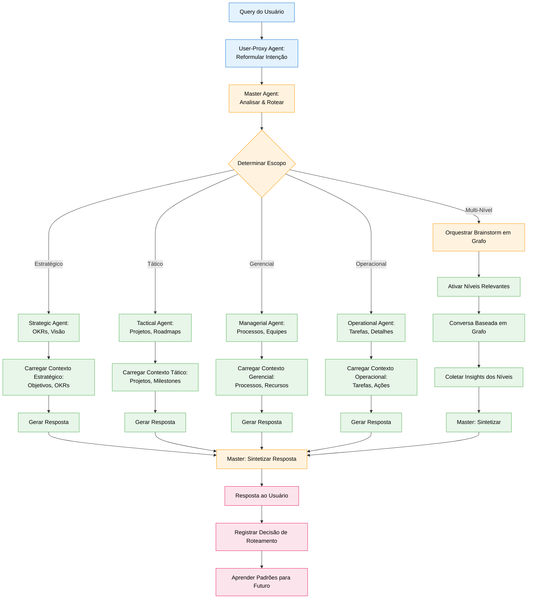
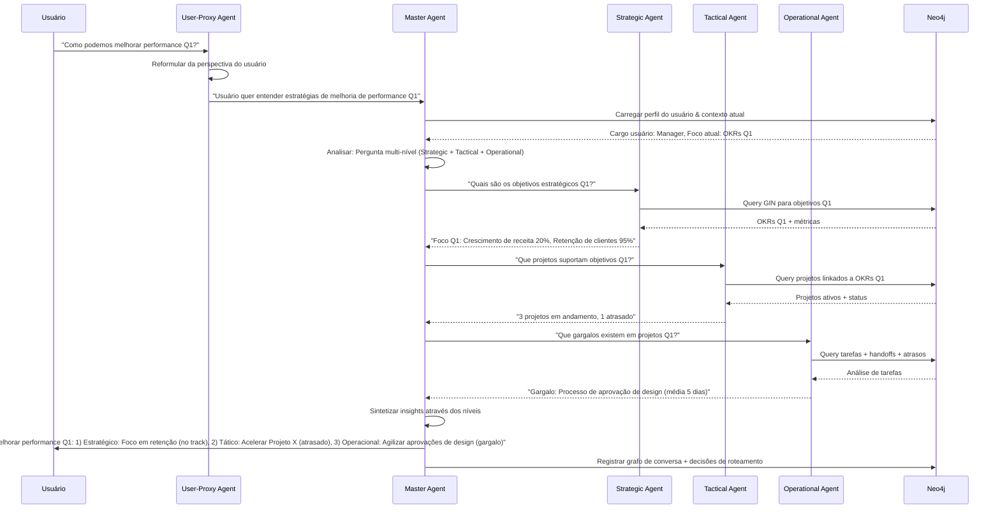

# Especificação de Feature: Brainstorm Hierárquico de Agentes

**Feature Branch**: `045-hierarchical-brainstorm`  
**Criado**: 2025-12-29  
**Status**: Draft  
**Prioridade**: P2 (Advanced)  
**Fonte**: Insights dos chats (chat009) + otimização Graph-of-Thought

## Contexto & Propósito

**Brainstorm Hierárquico de Agentes** otimiza colaboração multi-agente organizando agentes em níveis de abstração e orquestrando fluxos de conversa não-lineares. Em vez de "chain-of-thought" sequencial, isso implementa **"graph-of-thought"** onde agentes em diferentes níveis hierárquicos contribuem baseado em seu escopo de expertise.

O insight-chave: **Conversa entre agentes não é linear; é um grafo**. Uma pergunta estratégica pode precisar de input de agentes operacionais, depois síntese no nível tático, depois validação no nível estratégico - criando um grafo de conversa, não uma cadeia.

Hierarquia de Agentes (por nível de abstração):
1. **User-Proxy Agent** - Reformula intenção do usuário da perspectiva do usuário
2. **Master Agent** - Contexto global, visão da empresa toda, orquestra outros agentes
3. **Strategic Agent** - Objetivos de longo prazo, OKRs, visão (conecta ao GIN)
4. **Tactical Agent** - Projetos de médio prazo, iniciativas, roadmaps
5. **Managerial Agent** - Processos, equipes, alocação de recursos
6. **Operational Agent** - Tarefas, detalhes, execução

Esta arquitetura habilita **respostas apropriadas ao contexto** onde cada agente opera dentro de seu escopo, e o Master Agent sintetiza através dos níveis.

---

## Fluxo de Processo (Visão de Negócio)

### Insights do Fluxo

**Gaps identificados**:
- Como determinar estrutura ótima de grafo de conversa? (planejamento de grafo)
- Como prevenir dependências circulares em conversas de agentes? (detecção de ciclos)
- Como balancear profundidade vs amplitude no brainstorm? (estratégia de exploração)
- Como lidar com insights conflitantes de diferentes níveis? (resolução de conflitos)

**Oportunidades identificadas**:
- Aprender padrões ótimos de roteamento de interações bem-sucedidas
- Visualizar grafo de conversa para transparência
- Habilitar modo "deep dive" (usuário solicita nível específico)
- Cachear padrões comuns de conversa para velocidade
- Gerar sumários de conversa em cada nível
- Detectar quando níveis adicionais deveriam ser consultados

**Riscos identificados**:
- Complexidade: Orquestração de grafo é mais difícil que cadeias lineares
- Latência: Conversas multi-agente levam mais tempo
- Custo: Mais ativações de agente = mais chamadas LLM
- Coerência: Sintetizar perspectivas diversas pode perder clareza

---

## Colaboração de Agentes

---

## Cenários de Usuário & Testes

### User Story 1 - Resposta Apropriada ao Contexto (Prioridade: P1)

Como usuário, quero respostas que correspondam ao nível de abstração da minha pergunta para que eu obtenha informação relevante sem detalhes desnecessários.

**Por que esta prioridade**: Proposta de valor central. Previne sobrecarga de informação.

**Teste Independente**: Perguntar questão estratégica, verificar Strategic Agent ativado; perguntar questão operacional, verificar Operational Agent ativado.

**Cenários de Aceitação**:

1. **Dado** usuário pergunta "Quais são nossos objetivos de longo prazo?", **Quando** Master Agent analisa, **Então** roteia apenas para Strategic Agent (sem detalhes operacionais)

2. **Dado** usuário pergunta "Que tarefas vencem hoje?", **Quando** Master Agent analisa, **Então** roteia apenas para Operational Agent (sem contexto estratégico)

3. **Dado** usuário pergunta "Como está progredindo o Projeto X?", **Quando** Master Agent analisa, **Então** roteia para Tactical Agent com contexto de Operational Agent (multi-nível)

---

### User Story 2 - Brainstorm Baseado em Grafo (Prioridade: P1)

Como Master Agent, quero orquestrar conversas não-lineares entre agentes para que perguntas complexas recebam respostas abrangentes.

**Por que esta prioridade**: Habilita raciocínio sofisticado. Diferencia de roteamento simples.

**Teste Independente**: Perguntar questão complexa requerendo múltiplos níveis, verificar que grafo de conversa é criado e atravessado.

**Cenários de Aceitação**:

1. **Dado** usuário pergunta "Por que estamos atrasados nas metas Q1?", **Quando** Master Agent planeja conversa, **Então** cria grafo: Strategic (metas) → Tactical (projetos) → Operational (gargalos) → Managerial (recursos)

2. **Dado** grafo de conversa planejado, **Quando** Master Agent executa, **Então** ativa agentes em ordem ótima (não estritamente sequencial)

3. **Dado** insights coletados, **Quando** Master Agent sintetiza, **Então** resposta inclui perspectivas de todos níveis ativados com atribuição clara

---

### User Story 3 - Reformulação do User-Proxy (Prioridade: P2)

Como User-Proxy Agent, quero reformular queries de usuário da perspectiva do usuário para que o sistema entenda contexto implícito.

**Por que esta prioridade**: Melhora entendimento de query. Reduz ambiguidade.

**Teste Independente**: Fornecer query ambígua, verificar que User-Proxy clarifica intenção.

**Cenários de Aceitação**:

1. **Dado** usuário pergunta "Como estamos?", **Quando** User-Proxy analisa, **Então** reformula baseado no perfil do usuário: "Como [equipe do usuário] está performando em [objetivos atuais]?"

2. **Dado** usuário pergunta "O que vem a seguir?", **Quando** User-Proxy analisa, **Então** reformula: "Quais são tarefas/milestones próximos para [cargo do usuário]?"

3. **Dado** reformulação melhora clareza, **Quando** Master Agent recebe query reformulada, **Então** acurácia de roteamento melhora em ≥30% (medido por satisfação do usuário)

---

### User Story 4 - Carregamento de Contexto Hierárquico (Prioridade: P1)

Como agente hierárquico, quero carregar apenas o contexto relevante ao meu nível de abstração para que eu possa responder eficientemente sem sobrecarga de informação.

**Por que esta prioridade**: Performance e foco. Cada agente tem contexto limitado.

**Teste Independente**: Ativar Strategic Agent, verificar que carrega objetivos mas não detalhes de tarefas.

**Cenários de Aceitação**:

1. **Dado** Strategic Agent ativado, **Quando** carrega contexto, **Então** queries: Objectives, OKRs, Metrics, Vision (sem tarefas ou detalhes de processo)

2. **Dado** Operational Agent ativado, **Quando** carrega contexto, **Então** queries: Tasks, Actions, Handoffs, Deadlines (sem objetivos estratégicos)

3. **Dado** Managerial Agent ativado, **Quando** carrega contexto, **Então** queries: Processes, Teams, Resources, Workflows (visão balanceada mid-level)

---

### User Story 5 - Visualização de Grafo de Conversa (Prioridade: P2)

Como usuário, quero ver como agentes colaboraram para responder minha pergunta para que eu entenda o processo de raciocínio.

**Por que esta prioridade**: Transparência e confiança. Usuários veem "por trás das cenas."

**Teste Independente**: Completar query multi-agente, verificar que grafo de conversa é exibido.

**Cenários de Aceitação**:

1. **Dado** resposta multi-agente entregue, **Quando** usuário clica "Mostrar raciocínio", **Então** UI exibe grafo de conversa: nodes (agentes), edges (fluxo de informação), labels (insights)

2. **Dado** grafo de conversa exibido, **Quando** usuário clica em node de agente, **Então** mostra: contexto carregado, query processada, insight gerado

3. **Dado** usuário revisa grafo, **Quando** identifica ativação desnecessária de agente, **Então** pode fornecer feedback para melhorar roteamento futuro

---

## Requisitos Funcionais

### Hierarquia de Agentes

- **REQ-HIER-001**: Sistema DEVE implementar 6 níveis hierárquicos de agente: User-Proxy, Master, Strategic, Tactical, Managerial, Operational
- **REQ-HIER-002**: Cada agente DEVE ter escopo definido: Strategic (objetivos, OKRs), Tactical (projetos, milestones), Managerial (processos, equipes), Operational (tarefas, ações)
- **REQ-HIER-003**: Hierarquia de agentes DEVE ser armazenada no Neo4j: (:Agent)-[:REPORTS_TO]->(:Agent)
- **REQ-HIER-004**: Cada agente DEVE ter regras de carregamento de contexto definindo quais tipos de node ele consulta

### User-Proxy Agent

- **REQ-HIER-005**: User-Proxy Agent DEVE executar em toda query de usuário antes do Master Agent
- **REQ-HIER-006**: User-Proxy DEVE carregar perfil do usuário: cargo, foco atual, interações recentes, preferências
- **REQ-HIER-007**: User-Proxy DEVE reformular queries ambíguas usando contexto do usuário
- **REQ-HIER-008**: Reformulação DEVE preservar intenção do usuário enquanto adiciona clareza

### Master Agent

- **REQ-HIER-009**: Master Agent DEVE analisar query reformulada para determinar escopo: single-level ou multi-level
- **REQ-HIER-010**: Master Agent DEVE planejar grafo de conversa para queries multi-level
- **REQ-HIER-011**: Grafo de conversa DEVE ser DAG (Directed Acyclic Graph) - sem ciclos
- **REQ-HIER-012**: Master Agent DEVE orquestrar ativação de agente em ordem ótima
- **REQ-HIER-013**: Master Agent DEVE sintetizar insights de todos agentes ativados
- **REQ-HIER-014**: Master Agent DEVE registrar grafo de conversa para aprendizado e transparência

### Agentes Hierárquicos (Strategic, Tactical, Managerial, Operational)

- **REQ-HIER-015**: Cada agente DEVE carregar contexto com escopo de seu nível
- **REQ-HIER-016**: Strategic Agent DEVE consultar: (:Objective), (:OKR), (:Metric) do GIN
- **REQ-HIER-017**: Tactical Agent DEVE consultar: (:Project), (:Milestone), (:Initiative)
- **REQ-HIER-018**: Managerial Agent DEVE consultar: (:Process), (:Team), (:Resource), (:Workflow)
- **REQ-HIER-019**: Operational Agent DEVE consultar: (:Task), (:Action), (:Handoff), (:Interaction)
- **REQ-HIER-020**: Cada agente DEVE gerar insight com confidence score e raciocínio

### Brainstorm Baseado em Grafo

- **REQ-HIER-021**: Master Agent DEVE suportar conversa baseada em grafo: agentes podem solicitar input de outros agentes
- **REQ-HIER-022**: Grafo de conversa DEVE rastrear: ativações de agente, fluxo de informação, dependências
- **REQ-HIER-023**: Sistema DEVE detectar e prevenir dependências circulares (A pergunta B, B pergunta A)
- **REQ-HIER-024**: Sistema DEVE suportar ativação paralela de agentes quando não existem dependências
- **REQ-HIER-025**: Conversa DEVE terminar quando todos insights requeridos coletados ou profundidade máxima alcançada (padrão: 5 níveis)

### Síntese & Resposta

- **REQ-HIER-026**: Master Agent DEVE sintetizar insights com atribuição clara: "Strategic: ..., Tactical: ..., Operational: ..."
- **REQ-HIER-027**: Síntese DEVE resolver conflitos entre níveis (ex: meta estratégica vs realidade operacional)
- **REQ-HIER-028**: Resposta DEVE incluir confidence score baseado em consenso de agentes
- **REQ-HIER-029**: Resposta DEVE incluir ID de grafo de conversa para transparência

---

## Requisitos Não-Funcionais

### Performance

- **REQ-HIER-NFR-001**: Roteamento single-level DEVE completar em <2 segundos
- **REQ-HIER-NFR-002**: Brainstorm multi-level DEVE completar em <10 segundos para 3 agentes
- **REQ-HIER-NFR-003**: Planejamento de grafo de conversa DEVE completar em <1 segundo

### Acurácia

- **REQ-HIER-NFR-004**: Acurácia de roteamento DEVE ser >85% (nível correto ativado)
- **REQ-HIER-NFR-005**: Reformulação User-Proxy DEVE melhorar clareza de query em 70% dos casos (avaliação humana)
- **REQ-HIER-NFR-006**: Síntese do Master Agent DEVE preservar insights-chave de todos agentes (sem perda de informação)

### Escalabilidade

- **REQ-HIER-NFR-007**: Sistema DEVE suportar ≥10 conversas multi-agente concorrentes
- **REQ-HIER-NFR-008**: Grafo de conversa DEVE suportar ≥10 ativações de agente por query
- **REQ-HIER-NFR-009**: Sistema DEVE cachear padrões comuns de conversa para velocidade

---

## Critérios de Sucesso

1. **Relevância de Resposta**: Usuários avaliam respostas 50% mais relevantes comparado a baseline single-agent
2. **Apropriação de Contexto**: 90% das respostas correspondem ao nível de abstração da query
3. **Qualidade de Síntese**: Respostas multi-level são avaliadas "abrangentes" por 80% dos usuários
4. **Performance**: 95% das queries completam dentro dos requisitos de latência
5. **Transparência**: 75% dos usuários acham visualização de grafo de conversa útil
6. **Aprendizado**: Acurácia de roteamento melhora em 20% após 1 mês de feedback

---

## Entidades-Chave

### Tipos de Node Neo4j (Estendidos)

- **:Agent** (estendido com hierarquia) - Adicionar propriedade `hierarchy_level`: `user_proxy` | `master` | `strategic` | `tactical` | `managerial` | `operational`
- **:ConversationGraph** - Registro de conversa multi-agente
- **:AgentActivation** - Ativação individual de agente em conversa

### Relacionamentos Neo4j (Novos)

- **[:REPORTS_TO]** - Agent → Agent (hierarquia)
- **[:ACTIVATED_IN]** - Agent → ConversationGraph
- **[:REQUESTED_INPUT_FROM]** - AgentActivation → AgentActivation (fluxo de conversa)
- **[:SYNTHESIZED_BY]** - ConversationGraph → Agent (Master)

### Propriedades

**Propriedades de :ConversationGraph**:
- `id`: UUID
- `user_query`: string
- `reformulated_query`: string
- `scope`: `single_level` | `multi_level`
- `activated_agents`: array de IDs de agente
- `conversation_structure`: JSON (representação DAG)
- `synthesis`: text
- `confidence`: float (0.0-1.0)
- `latency_ms`: integer
- `created_at`: DateTime

---

## Dependências

- **Spec 040** (Business Intent Graph) - Strategic Agent consulta GIN
- **Spec 041** (Interaction & Delegation Graph) - Operational Agent consulta GID
- **Spec 005** (Agent Router / PLA) - Master Agent estende capacidades de router
- **Spec 019** (Multi-Agent Orchestration) - Framework base de agentes
- **Agno Framework** - Implementação de agentes

---

## Premissas

1. Usuários aceitam latência ligeiramente maior para melhor qualidade (multi-agente leva mais tempo)
2. Hierarquia de agentes é universal (aplica a todas organizações)
3. Escopo de contexto melhora foco (contexto limitado é melhor que contexto completo)
4. Conversa baseada em grafo é mais efetiva que cadeias lineares
5. Usuários acham visualização de grafo de conversa valiosa (não sobrecarregante)

---

## Fora do Escopo

- Criação dinâmica de agentes (hierarquia é fixa)
- Colaboração de agentes entre empresas (futuro)
- Brainstorm colaborativo em tempo real (múltiplos usuários + agentes)
- Customização de personalidade de agente (melhoria UX futura)
- Otimização automática de grafo de conversa (capacidade IA futura)

---

## Notas

- Brainstorm Hierárquico de Agentes é inspirado por hierarquias organizacionais e ciência cognitiva (diferentes níveis de abstração para diferentes tarefas)
- "Graph-of-Thought" é mais poderoso que "Chain-of-Thought" para raciocínio complexo
- User-Proxy Agent é crítico para entendimento de contexto implícito
- Master Agent é o orquestrador, não apenas um router - ele planeja e sintetiza
- Grafos de conversa deveriam ser visualizados para transparência e confiança
- Esta arquitetura habilita "IA apropriada ao contexto" onde respostas correspondem ao nível de investigação do usuário

