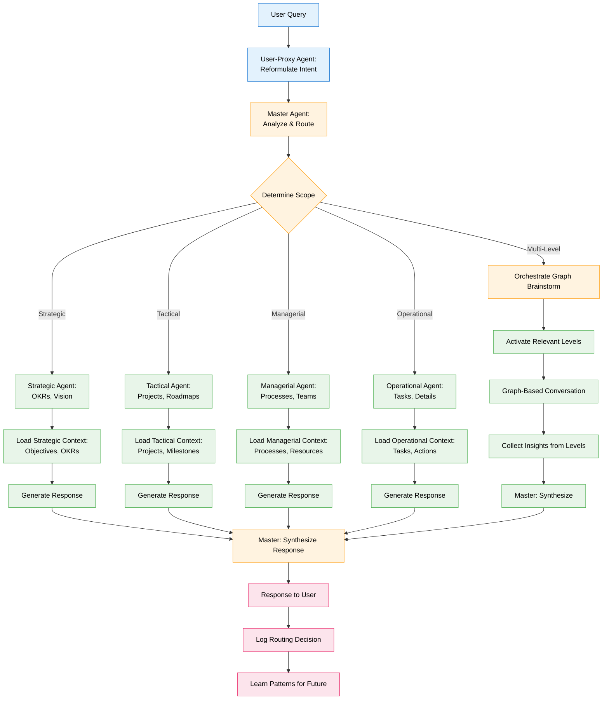
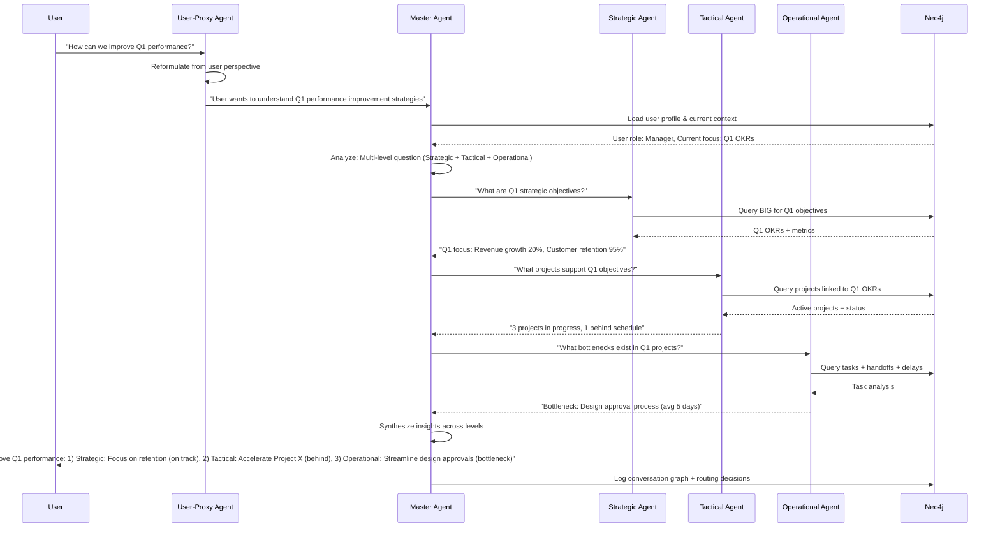

# Feature Specification: Hierarchical Agent Brainstorm

**Feature Branch**: `035-hierarchical-brainstorm`  
**Created**: 2025-12-29  
**Status**: Draft  
**Priority**: P2 (Advanced)  
**Source**: Chat insights (chat009) + Graph-of-Thought optimization

## Context & Purpose

**Hierarchical Agent Brainstorm** optimizes multi-agent collaboration by organizing agents into abstraction levels and orchestrating non-linear conversation flows. Instead of sequential "chain-of-thought," this implements **"graph-of-thought"** where agents at different hierarchical levels contribute based on their expertise scope.

The key insight: **Conversation between agents isn't linear; it's a graph**. A strategic question may need input from operational agents, then synthesis at tactical level, then validation at strategic level - creating a conversation graph, not a chain.

Agent Hierarchy (by abstraction level):
1. **User-Proxy Agent** - Reformulates user intent from user's perspective
2. **Master Agent** - Global context, company-wide view, orchestrates other agents
3. **Strategic Agent** - Long-term objectives, OKRs, vision (connects to BIG)
4. **Tactical Agent** - Mid-term projects, initiatives, roadmaps
5. **Managerial Agent** - Processes, teams, resource allocation
6. **Operational Agent** - Tasks, details, execution

This architecture enables **context-appropriate responses** where each agent operates within its scope, and the Master Agent synthesizes across levels.

---

## Process Flow (Business View)

### Flow Insights

**Gaps identified**:
- How to determine optimal conversation graph structure? (graph planning)
- How to prevent circular dependencies in agent conversations? (cycle detection)
- How to balance depth vs breadth in brainstorm? (exploration strategy)
- How to handle conflicting insights from different levels? (conflict resolution)

**Opportunities identified**:
- Learn optimal routing patterns from successful interactions
- Visualize conversation graph for transparency
- Enable "deep dive" mode (user requests specific level)
- Cache common conversation patterns for speed
- Generate conversation summaries at each level
- Detect when additional levels should be consulted

**Risks identified**:
- Complexity: Graph orchestration is harder than linear chains
- Latency: Multi-agent conversations take longer
- Cost: More agent activations = more LLM calls
- Coherence: Synthesizing diverse perspectives may lose clarity

---

## Agent Collaboration

---

## User Scenarios & Testing

### User Story 1 - Context-Appropriate Response (Priority: P1)

As a user, I want responses that match the abstraction level of my question so that I get relevant information without unnecessary details.

**Why this priority**: Core value proposition. Prevents information overload.

**Independent Test**: Ask strategic question, verify Strategic Agent activated; ask operational question, verify Operational Agent activated.

**Acceptance Scenarios**:

1. **Given** user asks "What are our long-term objectives?", **When** Master Agent analyzes, **Then** routes to Strategic Agent only (no operational details)

2. **Given** user asks "What tasks are due today?", **When** Master Agent analyzes, **Then** routes to Operational Agent only (no strategic context)

3. **Given** user asks "How is Project X progressing?", **When** Master Agent analyzes, **Then** routes to Tactical Agent with context from Operational Agent (multi-level)

---

### User Story 2 - Graph-Based Brainstorm (Priority: P1)

As the Master Agent, I want to orchestrate non-linear conversations between agents so that complex questions get comprehensive answers.

**Why this priority**: Enables sophisticated reasoning. Differentiates from simple routing.

**Independent Test**: Ask complex question requiring multiple levels, verify conversation graph is created and traversed.

**Acceptance Scenarios**:

1. **Given** user asks "Why are we behind on Q1 goals?", **When** Master Agent plans conversation, **Then** creates graph: Strategic (goals) → Tactical (projects) → Operational (bottlenecks) → Managerial (resources)

2. **Given** conversation graph planned, **When** Master Agent executes, **Then** activates agents in optimal order (not strictly sequential)

3. **Given** insights collected, **When** Master Agent synthesizes, **Then** response includes perspectives from all activated levels with clear attribution

---

### User Story 3 - User-Proxy Reformulation (Priority: P2)

As the User-Proxy Agent, I want to reformulate user queries from the user's perspective so that the system understands implicit context.

**Why this priority**: Improves query understanding. Reduces ambiguity.

**Independent Test**: Provide ambiguous query, verify User-Proxy clarifies intent.

**Acceptance Scenarios**:

1. **Given** user asks "How are we doing?", **When** User-Proxy analyzes, **Then** reformulates based on user profile: "How is [user's team] performing on [current objectives]?"

2. **Given** user asks "What's next?", **When** User-Proxy analyzes, **Then** reformulates: "What are upcoming tasks/milestones for [user's role]?"

3. **Given** reformulation improves clarity, **When** Master Agent receives reformulated query, **Then** routing accuracy improves by ≥30% (measured by user satisfaction)

---

### User Story 4 - Hierarchical Context Loading (Priority: P1)

As a hierarchical agent, I want to load only the context relevant to my abstraction level so that I can respond efficiently without information overload.

**Why this priority**: Performance and focus. Each agent has bounded context.

**Independent Test**: Activate Strategic Agent, verify it loads objectives but not task details.

**Acceptance Scenarios**:

1. **Given** Strategic Agent activated, **When** loads context, **Then** queries: Objectives, OKRs, Metrics, Vision (no tasks or process details)

2. **Given** Operational Agent activated, **When** loads context, **Then** queries: Tasks, Actions, Handoffs, Deadlines (no strategic objectives)

3. **Given** Managerial Agent activated, **When** loads context, **Then** queries: Processes, Teams, Resources, Workflows (balanced mid-level view)

---

### User Story 5 - Conversation Graph Visualization (Priority: P2)

As a user, I want to see how agents collaborated to answer my question so that I understand the reasoning process.

**Why this priority**: Transparency and trust. Users see "behind the scenes."

**Independent Test**: Complete multi-agent query, verify conversation graph is displayed.

**Acceptance Scenarios**:

1. **Given** multi-agent response delivered, **When** user clicks "Show reasoning", **Then** UI displays conversation graph: nodes (agents), edges (information flow), labels (insights)

2. **Given** conversation graph displayed, **When** user clicks on agent node, **Then** shows: context loaded, query processed, insight generated

3. **Given** user reviews graph, **When** identifies unnecessary agent activation, **Then** can provide feedback to improve future routing

---

## Functional Requirements

### Agent Hierarchy

- **REQ-HIER-001**: System MUST implement 6 hierarchical agent levels: User-Proxy, Master, Strategic, Tactical, Managerial, Operational
- **REQ-HIER-002**: Each agent MUST have defined scope: Strategic (objectives, OKRs), Tactical (projects, milestones), Managerial (processes, teams), Operational (tasks, actions)
- **REQ-HIER-003**: Agent hierarchy MUST be stored in Neo4j: (:Agent)-[:REPORTS_TO]->(:Agent)
- **REQ-HIER-004**: Each agent MUST have context loading rules defining which node types it queries

### User-Proxy Agent

- **REQ-HIER-005**: User-Proxy Agent MUST run on every user query before Master Agent
- **REQ-HIER-006**: User-Proxy MUST load user profile: role, current focus, recent interactions, preferences
- **REQ-HIER-007**: User-Proxy MUST reformulate ambiguous queries using user context
- **REQ-HIER-008**: Reformulation MUST preserve user intent while adding clarity

### Master Agent

- **REQ-HIER-009**: Master Agent MUST analyze reformulated query to determine scope: single-level or multi-level
- **REQ-HIER-010**: Master Agent MUST plan conversation graph for multi-level queries
- **REQ-HIER-011**: Conversation graph MUST be DAG (Directed Acyclic Graph) - no cycles
- **REQ-HIER-012**: Master Agent MUST orchestrate agent activation in optimal order
- **REQ-HIER-013**: Master Agent MUST synthesize insights from all activated agents
- **REQ-HIER-014**: Master Agent MUST log conversation graph for learning and transparency

### Hierarchical Agents (Strategic, Tactical, Managerial, Operational)

- **REQ-HIER-015**: Each agent MUST load context scoped to its level
- **REQ-HIER-016**: Strategic Agent MUST query: (:Objective), (:OKR), (:Metric) from BIG
- **REQ-HIER-017**: Tactical Agent MUST query: (:Project), (:Milestone), (:Initiative)
- **REQ-HIER-018**: Managerial Agent MUST query: (:Process), (:Team), (:Resource), (:Workflow)
- **REQ-HIER-019**: Operational Agent MUST query: (:Task), (:Action), (:Handoff), (:Interaction)
- **REQ-HIER-020**: Each agent MUST generate insight with confidence score and reasoning

### Graph-Based Brainstorm

- **REQ-HIER-021**: Master Agent MUST support graph-based conversation: agents can request input from other agents
- **REQ-HIER-022**: Conversation graph MUST track: agent activations, information flow, dependencies
- **REQ-HIER-023**: System MUST detect and prevent circular dependencies (A asks B, B asks A)
- **REQ-HIER-024**: System MUST support parallel agent activation when no dependencies exist
- **REQ-HIER-025**: Conversation MUST terminate when all required insights collected or max depth reached (default: 5 levels)

### Synthesis & Response

- **REQ-HIER-026**: Master Agent MUST synthesize insights with clear attribution: "Strategic: ..., Tactical: ..., Operational: ..."
- **REQ-HIER-027**: Synthesis MUST resolve conflicts between levels (e.g., strategic goal vs operational reality)
- **REQ-HIER-028**: Response MUST include confidence score based on agent consensus
- **REQ-HIER-029**: Response MUST include conversation graph ID for transparency

---

## Non-Functional Requirements

### Performance

- **REQ-HIER-NFR-001**: Single-level routing MUST complete in <2 seconds
- **REQ-HIER-NFR-002**: Multi-level brainstorm MUST complete in <10 seconds for 3 agents
- **REQ-HIER-NFR-003**: Conversation graph planning MUST complete in <1 second

### Accuracy

- **REQ-HIER-NFR-004**: Routing accuracy MUST be >85% (correct level activated)
- **REQ-HIER-NFR-005**: User-Proxy reformulation MUST improve query clarity in 70% of cases (human evaluation)
- **REQ-HIER-NFR-006**: Master Agent synthesis MUST preserve key insights from all agents (no information loss)

### Scalability

- **REQ-HIER-NFR-007**: System MUST support ≥10 concurrent multi-agent conversations
- **REQ-HIER-NFR-008**: Conversation graph MUST support ≥10 agent activations per query
- **REQ-HIER-NFR-009**: System MUST cache common conversation patterns for speed

---

## Success Criteria

1. **Response Relevance**: Users rate responses 50% more relevant compared to single-agent baseline
2. **Context Appropriateness**: 90% of responses match the abstraction level of the query
3. **Synthesis Quality**: Multi-level responses are rated "comprehensive" by 80% of users
4. **Performance**: 95% of queries complete within latency requirements
5. **Transparency**: 75% of users find conversation graph visualization helpful
6. **Learning**: Routing accuracy improves by 20% after 1 month of feedback

---

## Key Entities

### Neo4j Node Types (Extended)

- **:Agent** (extended with hierarchy) - Add `hierarchy_level` property: `user_proxy` | `master` | `strategic` | `tactical` | `managerial` | `operational`
- **:ConversationGraph** - Record of multi-agent conversation
- **:AgentActivation** - Individual agent activation in conversation

### Neo4j Relationships (New)

- **[:REPORTS_TO]** - Agent → Agent (hierarchy)
- **[:ACTIVATED_IN]** - Agent → ConversationGraph
- **[:REQUESTED_INPUT_FROM]** - AgentActivation → AgentActivation (conversation flow)
- **[:SYNTHESIZED_BY]** - ConversationGraph → Agent (Master)

### Properties

**:ConversationGraph properties**:
- `id`: UUID
- `user_query`: string
- `reformulated_query`: string
- `scope`: `single_level` | `multi_level`
- `activated_agents`: array of agent IDs
- `conversation_structure`: JSON (DAG representation)
- `synthesis`: text
- `confidence`: float (0.0-1.0)
- `latency_ms`: integer
- `created_at`: DateTime

---

## Dependencies

- **Spec 030** (Business Intent Graph) - Strategic Agent queries BIG
- **Spec 031** (Interaction & Delegation Graph) - Operational Agent queries IDG
- **Spec 005** (Agent Router / PLA) - Master Agent extends router capabilities
- **Spec 019** (Multi-Agent Orchestration) - Base agent framework
- **Agno Framework** - Agent implementation

---

## Assumptions

1. Users accept slightly higher latency for better quality (multi-agent takes longer)
2. Agent hierarchy is universal (applies to all organizations)
3. Context scoping improves focus (bounded context is better than full context)
4. Graph-based conversation is more effective than linear chains
5. Users find conversation graph visualization valuable (not overwhelming)

---

## Out of Scope

- Dynamic agent creation (hierarchy is fixed)
- Cross-company agent collaboration (future)
- Real-time collaborative brainstorm (multiple users + agents)
- Agent personality customization (future UX enhancement)
- Automatic conversation graph optimization (future AI capability)

---

## Notes

- Hierarchical Agent Brainstorm is inspired by organizational hierarchies and cognitive science (different abstraction levels for different tasks)
- "Graph-of-Thought" is more powerful than "Chain-of-Thought" for complex reasoning
- User-Proxy Agent is critical for implicit context understanding
- Master Agent is the orchestrator, not just a router - it plans and synthesizes
- Conversation graphs should be visualized for transparency and trust
- This architecture enables "context-appropriate AI" where responses match the user's level of inquiry

