# Feature Specification: PIA (Process Intelligence & Analysis)

**Feature Branch**: `036-pia-process-intelligence`  
**Created**: 2025-12-29  
**Status**: Draft  
**Priority**: P1 (Strategic)  
**Source**: Chat insights (chat005) + Organizational Digital Twin vision

## Context & Purpose

**PIA (Process Intelligence & Analysis)** is a team of AI agents that guides collaborators in mapping organizational processes from macro to micro, creating the **"mapa vivo da empresa"** (living company map). PIA transforms implicit organizational knowledge into an explicit, continuously updated digital twin.

PIA enables:
- **Collaborative Process Mapping** - Every employee contributes their view of how work flows
- **Macro-to-Micro Discovery** - Start with company vision, drill down to individual activities
- **Coherence Checking** - Detect gaps, bottlenecks, and inconsistencies automatically
- **Business Rules Extraction** - Identify implicit rules governing workflows
- **Continuous Monitoring** - Track actual execution vs documented processes
- **Gamification** - Motivate employees to document and improve processes

The PIA team consists of:
1. **Collector Agent** - Guides users through structured mapping workflow
2. **Analyst/Curator Agent** - Checks coherence, extracts business rules, validates handoffs
3. **Monitor Agent** - Tracks process execution, detects deviations, suggests improvements

---

## Process Flow (Business View)

### Flow Insights

**Gaps identified**:
- How to handle processes that span multiple areas? (cross-functional workflows)
- How to resolve conflicting process descriptions from different users? (consensus mechanism)
- How to balance detail vs usability? (too much detail overwhelms)
- How to maintain process maps as organization evolves? (change management)

**Opportunities identified**:
- Auto-generate process documentation from mapped workflows
- Detect "shadow processes" (actual vs documented workflows)
- Identify process champions (users who map most accurately)
- Suggest process standardization opportunities
- Generate training materials from process maps
- Enable process simulation (what-if scenarios)
- Create BPMN diagrams automatically from IDG data

**Risks identified**:
- User fatigue: Mapping is time-consuming
- Incomplete coverage: Not all processes mapped
- Accuracy: Users may describe idealized vs actual processes
- Maintenance burden: Keeping maps up-to-date requires ongoing effort

---

## Agent Collaboration

```mermaid
sequenceDiagram
    participant User as Collaborator
    participant Collector as PIA Collector Agent
    participant Analyst as PIA Analyst Agent
    participant Monitor as PIA Monitor Agent
    participant Neo4j
    participant Notification
    participant Gamification
    
    User->>Collector: "I want to map my process"
    Collector->>Neo4j: Load user profile (role, area)
    Neo4j-->>Collector: User context
    Collector->>Collector: Generate personalized questionnaire
    Collector->>User: "Let's start. What's your main area?"
    User->>Collector: "Sales"
    
    Collector->>User: "What processes do you handle in Sales?"
    User->>Collector: "Lead qualification, Proposal creation, Contract negotiation"
    
    Collector->>User: "Let's detail 'Lead qualification'. What are the steps?"
    User->>Collector: "1) Receive lead from marketing, 2) Research company, 3) Initial call, 4) Score lead, 5) Pass to Account Executive or discard"
    
    Collector->>User: "Who do you receive leads from?"
    User->>Collector: "Marketing team (Maria)"
    
    Collector->>User: "Who do you pass qualified leads to?"
    User->>Collector: "Account Executive (João)"
    
    Collector->>Analyst: Validate mapping
    Analyst->>Neo4j: Check if Maria (Marketing) exists
    Analyst->>Neo4j: Check if João (AE) exists
    Neo4j-->>Analyst: Both exist
    Analyst->>Analyst: Check handoff coherence
    Analyst->>Analyst: Extract business rule: "Lead score >70 = qualified"
    Analyst->>Neo4j: CREATE process + activities + handoffs
    Analyst->>Neo4j: CREATE business rule with confidence 0.8
    
    Analyst->>Gamification: Award points to user
    Gamification->>User: "🎉 +50 points! Process mapped successfully"
    
    Note over Monitor: Continuous monitoring begins
    
    Monitor->>Neo4j: Periodic query: actual handoffs vs mapped
    Neo4j-->>Monitor: Deviation detected: João receives leads with score <70
    Monitor->>Analyst: Analyze deviation
    Analyst->>Analyst: Possible rule violation or outdated rule
    Monitor->>Notification: Alert manager + user
    Notification->>User: "Deviation detected in Lead Qualification process"
```

---

## User Scenarios & Testing

### User Story 1 - Guided Process Mapping (Priority: P0)

As a collaborator, I want PIA to guide me through mapping my processes step-by-step so that I can contribute without needing process mapping expertise.

**Why this priority**: Foundation for PIA. Without guided mapping, adoption fails.

**Independent Test**: User starts mapping, verify Collector provides structured questions.

**Acceptance Scenarios**:

1. **Given** user initiates process mapping, **When** Collector loads user profile, **Then** generates personalized questionnaire based on user role (e.g., Sales rep gets sales-focused questions)

2. **Given** user answers macro question "What processes do you handle?", **When** Collector receives answer, **Then** asks micro questions for each process: "What are the steps in [process]?"

3. **Given** user describes steps, **When** Collector detects handoff keywords ("pass to", "send to", "delegate"), **Then** asks clarifying questions: "Who specifically do you pass this to?"

4. **Given** user completes mapping, **When** Collector finishes, **Then** shows summary: "You mapped 3 processes, 12 activities, 5 handoffs. Review before submitting?"

---

### User Story 2 - Handoff Coherence Checking (Priority: P0)

As the PIA Analyst, I want to validate that handoffs are coherent (sender's output matches receiver's input) so that process maps are accurate.

**Why this priority**: Prevents broken process maps. Ensures quality.

**Independent Test**: Map process with invalid handoff, verify Analyst detects gap.

**Acceptance Scenarios**:

1. **Given** user maps "I pass lead to João (AE)", **When** Analyst checks, **Then** queries Neo4j: Does João exist? Does João's role accept leads?

2. **Given** João doesn't have "receive lead" in his mapped processes, **When** Analyst detects gap, **Then** flags as "unconfirmed handoff" and notifies both user and João to confirm

3. **Given** João confirms handoff, **When** João maps his process including "receive lead from [user]", **Then** Analyst marks handoff as "validated" and increases confidence score to 1.0

4. **Given** handoff remains unconfirmed for 7 days, **When** Analyst reviews, **Then** escalates to manager for resolution

---

### User Story 3 - Business Rules Extraction (Priority: P1)

As the PIA Analyst, I want to automatically extract business rules from process descriptions so that implicit knowledge becomes explicit.

**Why this priority**: Captures valuable domain knowledge. Enables automation.

**Independent Test**: User describes process with rule, verify Analyst extracts it.

**Acceptance Scenarios**:

1. **Given** user states "If lead score >70, pass to AE; otherwise discard", **When** Analyst processes, **Then** extracts rule: `IF lead.score > 70 THEN action = 'pass_to_ae' ELSE action = 'discard'` with confidence 0.9

2. **Given** rule extracted, **When** Analyst stores in Neo4j, **Then** creates (:BusinessRule) node linked to process with properties: condition, action, confidence, source_user

3. **Given** multiple users describe same process, **When** Analyst detects conflicting rules, **Then** flags conflict and requests clarification from both users

4. **Given** rule validated by multiple users, **When** confidence increases, **Then** rule becomes "golden rule" (high confidence, multiple sources)

---

### User Story 4 - Gamification for Engagement (Priority: P1)

As a user, I want to earn points and recognition for mapping processes so that I'm motivated to contribute.

**Why this priority**: Drives adoption. Makes documentation fun.

**Independent Test**: Complete mapping, verify points awarded and leaderboard updated.

**Acceptance Scenarios**:

1. **Given** user completes first process mapping, **When** submission validated, **Then** awards 50 points + "First Mapper" badge

2. **Given** user maps process with high coherence (all handoffs validated), **When** Analyst scores quality, **Then** awards bonus 20 points for accuracy

3. **Given** user's mapped process is used by 10+ colleagues, **When** usage tracked, **Then** awards "Process Champion" badge + 100 points

4. **Given** company-wide leaderboard, **When** user views, **Then** sees top mappers, most mapped areas, coverage percentage per department

---

### User Story 5 - Continuous Process Monitoring (Priority: P1)

As a manager, I want PIA to monitor actual process execution and alert me to deviations so that I can intervene proactively.

**Why this priority**: Ensures processes stay current. Detects issues early.

**Independent Test**: Execute process differently than mapped, verify Monitor detects deviation.

**Acceptance Scenarios**:

1. **Given** process mapped: "Leads with score >70 go to AE", **When** Monitor detects lead with score 65 sent to AE, **Then** flags deviation and alerts manager + user

2. **Given** deviation detected, **When** Monitor analyzes pattern (happens 10+ times), **Then** suggests: "Rule may be outdated. Consider updating threshold to 65?"

3. **Given** bottleneck detected (average handoff delay >5 days), **When** Monitor identifies cause (approval process), **Then** suggests: "Streamline approval: delegate to team leads?"

4. **Given** process improvement suggested, **When** manager reviews and approves, **Then** Monitor updates process definition and notifies affected users

---

## Functional Requirements

### PIA Collector Agent

- **REQ-PIA-001**: Collector MUST generate personalized questionnaires based on user role and area
- **REQ-PIA-002**: Questionnaire MUST follow macro-to-micro structure: Company → Area → Process → Activity → Handoff
- **REQ-PIA-003**: Collector MUST detect handoff keywords: "pass to", "send to", "delegate", "transfer", "forward"
- **REQ-PIA-004**: Collector MUST ask clarifying questions for ambiguous inputs
- **REQ-PIA-005**: Collector MUST provide examples and templates for common processes
- **REQ-PIA-006**: Collector MUST support iterative mapping: save progress, resume later

### PIA Analyst Agent

- **REQ-PIA-007**: Analyst MUST validate handoff coherence: sender exists, receiver exists, receiver accepts input type
- **REQ-PIA-008**: Analyst MUST flag unconfirmed handoffs and notify both parties
- **REQ-PIA-009**: Analyst MUST extract business rules from process descriptions using NLP
- **REQ-PIA-010**: Business rules MUST be stored as: condition (IF), action (THEN), confidence (0.0-1.0), source
- **REQ-PIA-011**: Analyst MUST detect conflicting rules and request human resolution
- **REQ-PIA-012**: Analyst MUST assign quality scores to mapped processes: completeness, coherence, detail level
- **REQ-PIA-013**: Analyst MUST store all mappings in IDG (Interaction & Delegation Graph)

### PIA Monitor Agent

- **REQ-PIA-014**: Monitor MUST run daily audits comparing actual execution vs mapped processes
- **REQ-PIA-015**: Monitor MUST detect deviations: rule violations, missing handoffs, unexpected paths
- **REQ-PIA-016**: Monitor MUST detect bottlenecks: handoff delays >threshold, high rejection rates
- **REQ-PIA-017**: Monitor MUST identify improvement opportunities: redundant steps, automation candidates
- **REQ-PIA-018**: Monitor MUST generate alerts with severity: critical (blocks work), high (delays), medium (inefficiency), low (suggestion)
- **REQ-PIA-019**: Monitor MUST suggest process changes with confidence scores and impact estimates

### Gamification System

- **REQ-PIA-020**: System MUST award points for: first mapping (50), complete process (30), validated handoff (10), high quality (bonus 20)
- **REQ-PIA-021**: System MUST track badges: First Mapper, Process Champion, Quality Contributor, Team Leader
- **REQ-PIA-022**: System MUST maintain leaderboards: individual, team, department
- **REQ-PIA-023**: System MUST display coverage metrics: % of processes mapped, % of handoffs validated, % of rules extracted
- **REQ-PIA-024**: Gamification MUST be opt-in (users can disable if desired)

### Process Storage (IDG Integration)

- **REQ-PIA-025**: Every mapped process MUST create: (:Process) node with properties: name, description, owner, area, created_at
- **REQ-PIA-026**: Every activity MUST create: (:Activity) node linked to process with properties: name, description, sequence_order, duration_estimate
- **REQ-PIA-027**: Every handoff MUST create: (:User)-[:HANDS_OFF {what, when, how}]->(:Activity)-[:TO]->(:User)
- **REQ-PIA-028**: Every business rule MUST create: (:BusinessRule) node linked to activity with properties: condition, action, confidence, source_user_id
- **REQ-PIA-029**: Process maps MUST be versioned: track changes over time with [:SUPERSEDES] relationships

---

## Non-Functional Requirements

### Performance

- **REQ-PIA-NFR-001**: Collector response time MUST be <2 seconds per question
- **REQ-PIA-NFR-002**: Analyst validation MUST complete in <5 seconds per process
- **REQ-PIA-NFR-003**: Monitor daily audit MUST complete in <30 minutes for 1000 processes

### Usability

- **REQ-PIA-NFR-004**: Questionnaire MUST be completable in <15 minutes for simple process
- **REQ-PIA-NFR-005**: UI MUST show progress indicator: "Step 3 of 5: Define handoffs"
- **REQ-PIA-NFR-006**: System MUST support multiple languages (initially: Portuguese, English)

### Accuracy

- **REQ-PIA-NFR-007**: Handoff coherence checking MUST have >95% accuracy (validated by human review)
- **REQ-PIA-NFR-008**: Business rule extraction MUST have >80% accuracy (rules correctly identified)
- **REQ-PIA-NFR-009**: Deviation detection MUST have <10% false positive rate

---

## Success Criteria

1. **Coverage**: 70% of organizational processes mapped within 6 months
2. **Engagement**: 60% of employees actively participate in mapping
3. **Quality**: 85% of mapped processes have validated handoffs
4. **Business Rules**: 500+ business rules extracted and validated
5. **Monitoring**: 90% of critical deviations detected within 24 hours
6. **Improvement**: 30% reduction in process bottlenecks after 6 months
7. **User Satisfaction**: 80% of users find PIA helpful (survey)

---

## Key Entities

### Neo4j Node Types (New)

- **:Process** - Organizational process
- **:Activity** - Step within a process
- **:BusinessRule** - Extracted business rule
- **:ProcessMapping** - Record of mapping session
- **:GamificationScore** - User gamification data

### Neo4j Relationships (New)

- **[:HAS_ACTIVITY]** - Process → Activity
- **[:HANDS_OFF]** - User → Activity (with handoff metadata)
- **[:TO]** - Activity → User (handoff recipient)
- **[:GOVERNED_BY]** - Activity → BusinessRule
- **[:MAPPED_BY]** - Process → User (who mapped it)
- **[:SUPERSEDES]** - Process → Process (versioning)

### Properties

**:Process properties**:
- `id`: UUID
- `name`: string
- `description`: text
- `owner_id`: UUID (process owner)
- `area`: string
- `status`: `draft` | `validated` | `active` | `deprecated`
- `quality_score`: float (0.0-1.0)
- `created_at`: DateTime
- `updated_at`: DateTime

**:Activity properties**:
- `id`: UUID
- `name`: string
- `description`: text
- `sequence_order`: integer
- `duration_estimate`: integer (minutes)
- `inputs`: array of strings
- `outputs`: array of strings
- `tools_used`: array of strings

**:BusinessRule properties**:
- `id`: UUID
- `condition`: string (IF clause)
- `action`: string (THEN clause)
- `confidence`: float (0.0-1.0)
- `source_user_id`: UUID
- `validated_by`: array of UUIDs
- `status`: `draft` | `validated` | `golden`

**[:HANDS_OFF] relationship properties**:
- `what`: string (what is handed off)
- `when`: string (timing/trigger)
- `how`: string (method: email, system, meeting)
- `status`: `pending` | `validated` | `broken`
- `average_duration`: integer (minutes)

---

## Dependencies

- **Spec 031** (Interaction & Delegation Graph) - PIA stores data in IDG
- **Spec 030** (Business Intent Graph) - Processes link to objectives
- **Spec 019** (Multi-Agent Orchestration) - PIA team is multi-agent system
- **Agno Framework** - Agent implementation

---

## Assumptions

1. Employees are willing to spend time mapping processes (gamification helps)
2. Managers support process mapping initiatives (top-down buy-in)
3. Process descriptions are reasonably accurate (not idealized)
4. Handoff validation is feasible (users respond to confirmation requests)
5. Continuous monitoring is acceptable (not seen as surveillance)

---

## Out of Scope

- BPMN diagram generation (future feature)
- Process simulation (what-if scenarios) (future)
- Integration with project management tools (future)
- Automatic process optimization (future AI capability)
- Cross-company process benchmarking (future)

---

## Notes

- PIA creates the "gêmeo organizacional" (organizational digital twin) - living map of how company works
- "Mapa vivo da empresa" emphasizes continuous updates, not static documentation
- Gamification is critical for adoption - make documentation fun
- Business rules extraction captures implicit knowledge that would otherwise be lost
- PIA Monitor enables proactive management, not reactive firefighting
- This is inspired by process mining but with collaborative human input, not just log analysis

