# Spec 047: Admin CSV Upload - Carga Inicial de Estrutura Organizacional

**Feature Branch**: `047-admin-csv-upload`  
**Created**: 2025-12-29  
**Status**: Draft  
**Priority**: P0 (Critical - Bloqueante MVP)  
**Source**: Caso real Alocc + Nodes.csv

---

## Context & Purpose

O **Admin CSV Upload** é a **primeira ação** que um Admin faz ao configurar o sistema. Permite fazer upload de um arquivo CSV contendo a estrutura organizacional completa (usuários, departamentos, hierarquias) e **automaticamente criar toda a estrutura no Neo4j**.

### Por Que P0 (Bloqueante)

Sem essa feature:
- ❌ Não há usuários cadastrados
- ❌ Não há estrutura organizacional
- ❌ Onboarding não pode acontecer
- ❌ Sistema não pode ser usado

**Esta é literalmente a primeira feature que deve funcionar.**

---

## Visão Geral

```mermaid
flowchart TD
    Admin[👨‍💼 Admin] --> Upload[📤 Upload Nodes.csv]
    Upload --> Validate[✅ Validar Formato]
    Validate -->|OK| Parse[📋 Parse CSV]
    Validate -->|Erro| Error[❌ Mostrar Erros]
    
    Parse --> CreateCompany[🏢 Criar :Company]
    CreateCompany --> CreateDepts[🏛️ Criar :Department nodes]
    CreateDepts --> CreateUsers[👥 Criar :User nodes]
    CreateUsers --> CreateRelations[🔗 Criar Relationships]
    
    CreateRelations --> Summary[📊 Mostrar Resumo]
    Summary --> ViewGraph[🔍 Visualizar Grafo]
    
    style Upload fill:#ff9800
    style CreateCompany fill:#4caf50
    style CreateUsers fill:#2196f3
    style CreateRelations fill:#9c27b0
```



---

## Formato do CSV (Referência: Nodes.csv)

### Campos Obrigatórios

| Campo | Tipo | Exemplo | Obrigatório |
|-------|------|---------|-------------|
| **Nome** | string | "Rodrigo Trindade" | ✅ Sim |
| **Empresa** | string | "Alocc Gestão Patrimonial" | ✅ Sim |
| **Função** | string | "Analista de Processos" | ✅ Sim |
| **Departamento** | string | "Sistemas" | ✅ Sim |
| **Departamento(s) que Lidera** | string | "Sistemas; TI" (separado por ;) | ⚪ Não |
| **Acesso** | string | "TNA-RJ 2; Sistemas; Atendimento" | ⚪ Não |
| **e-mail** | string | "rodrigo.trindade@alocc.com.br" | ✅ Sim |
| **Status** | string | "Ativo" ou "Inativo" | ✅ Sim |

### Exemplo de Linha

```csv
Rodrigo Trindade,Alocc Gestão Patrimonial,Analista de Processos,Sistemas,,TNA-RJ 2; Atendimento; Sistemas,rodrigo.trindade@alocc.com.br,Ativo
```

---

## Modelo de Dados Gerado

### Nodes Criados

```cypher
// 1. Company (único por empresa)
(:Company {
  id: UUID,
  name: "Alocc Gestão Patrimonial",
  created_at: DateTime,
  created_by: "admin@co-createai.com.br",
  source: "csv_upload"
})

// 2. Department (único por nome)
(:Department {
  id: UUID,
  name: "Sistemas",
  type: "internal", // "internal" ou "partner" (ex: TNA Parceiro)
  created_at: DateTime,
  created_by: "admin@co-createai.com.br",
  source: "csv_upload"
})

// 3. User (um por linha do CSV)
(:User {
  id: UUID,
  name: "Rodrigo Trindade",
  email: "rodrigo.trindade@alocc.com.br",
  function: "Analista de Processos",
  status: "Ativo", // "Ativo" | "Inativo"
  onboarded: false, // será true após spec 022
  created_at: DateTime,
  created_by: "admin@co-createai.com.br",
  source: "csv_upload",
  csv_row: 41 // para debugging
})
```

### Relationships Criados

```cypher
// 1. User trabalha na Company
(:User {email: "rodrigo.trindade@alocc.com.br"})-[:WORKS_FOR]->(:Company {name: "Alocc Gestão Patrimonial"})

// 2. User trabalha em Department
(:User {email: "rodrigo.trindade@alocc.com.br"})-[:WORKS_IN]->(:Department {name: "Sistemas"})

// 3. User lidera Department(s) (se "Departamento que Lidera" existe)
(:User {email: "andrea.martins@alocc.com.br"})-[:LEADS]->(:Department {name: "Atendimento"})

// 4. User tem acesso a múltiplos Departments (campo "Acesso")
(:User {email: "rodrigo.trindade@alocc.com.br"})-[:HAS_ACCESS {granted_at: DateTime}]->(:Department {name: "TNA-RJ 2"})
(:User {email: "rodrigo.trindade@alocc.com.br"})-[:HAS_ACCESS {granted_at: DateTime}]->(:Department {name: "Atendimento"})

// 5. User reporta para Leader (inferido de [:LEADS])
// Exemplo: Rodrigo (Sistemas) → reporta para Patricia Marinho (Líder de Projetos, Sistemas)
(:User {email: "rodrigo.trindade@alocc.com.br"})-[:REPORTS_TO]->(:User {email: "patricia.marinho@alocc.com.br"})
```

---

## Process Flow

### Sequence Diagram

```mermaid
sequenceDiagram
    participant Admin
    participant UI as Admin Dashboard
    participant API as Backend API
    participant Parser as CSV Parser
    participant Neo4j
    
    Admin->>UI: Select Nodes.csv file
    Admin->>UI: Click "Upload"
    UI->>API: POST /admin/upload/csv (multipart/form-data)
    
    API->>API: Validate file (CSV, <5MB, .csv extension)
    API-->>UI: ❌ Error se inválido
    
    API->>Parser: Parse CSV rows
    Parser->>Parser: Validate headers (Nome, Empresa, e-mail...)
    Parser-->>API: ❌ Error se headers inválidos
    
    Parser->>Parser: Validate each row (email unique, required fields)
    Parser-->>API: List of errors (se houver)
    
    alt Validation Failed
        API-->>UI: {success: false, errors: [...]}
        UI-->>Admin: Mostrar erros por linha
    else Validation OK
        API->>Neo4j: BEGIN Transaction
        
        loop For each unique Company
            API->>Neo4j: CREATE (:Company)
        end
        
        loop For each unique Department
            API->>Neo4j: CREATE (:Department)
        end
        
        loop For each User row
            API->>Neo4j: CREATE (:User)
            API->>Neo4j: CREATE (:User)-[:WORKS_FOR]->(:Company)
            API->>Neo4j: CREATE (:User)-[:WORKS_IN]->(:Department)
            
            alt User tem "Departamento que Lidera"
                API->>Neo4j: CREATE (:User)-[:LEADS]->(:Department)
            end
            
            alt User tem "Acesso"
                API->>Neo4j: CREATE (:User)-[:HAS_ACCESS]->(:Department)
            end
        end
        
        loop Infer REPORTS_TO relationships
            API->>Neo4j: MATCH leaders, CREATE (:User)-[:REPORTS_TO]->(:Leader)
        end
        
        API->>Neo4j: COMMIT Transaction
        
        API->>Neo4j: Query summary stats
        Neo4j-->>API: {users: 49, departments: 16, company: 1}
        
        API-->>UI: {success: true, summary: {...}}
        UI-->>Admin: Mostrar resumo + link para grafo
    end
```



---

## User Stories

### User Story 1: Upload CSV Válido (Priority: P0)

**Como** Admin  
**Quero** fazer upload do Nodes.csv  
**Para** criar toda a estrutura organizacional no sistema de uma vez

**Acceptance Scenarios**:

1. **Given** Admin logado, **When** acessa Admin Dashboard, **Then** vê botão "Upload Estrutura Organizacional (CSV)"

2. **Given** Admin clica em upload, **When** seleciona Nodes.csv válido, **Then** sistema valida arquivo (extensão .csv, tamanho <5MB)

3. **Given** arquivo válido, **When** backend processa, **Then** cria:
   - 1 (:Company {name: "Alocc Gestão Patrimonial"})
   - 16 (:Department) nodes
   - 49 (:User) nodes
   - ~200+ relationships ([:WORKS_FOR], [:WORKS_IN], [:LEADS], [:HAS_ACCESS], [:REPORTS_TO])

4. **Given** processamento completo, **When** Admin vê resumo, **Then** exibe:
   ```
   ✅ Estrutura criada com sucesso!
   
   📊 Resumo:
   - Empresa: Alocc Gestão Patrimonial
   - Departamentos: 16
   - Usuários: 49 (49 ativos, 0 inativos)
   - Líderes: 10
   - Relacionamentos: 203
   
   [Ver Grafo] [Ver Usuários] [Exportar Relatório]
   ```

---

### User Story 2: Erro de Validação (Priority: P0)

**Como** Admin  
**Quero** ser notificado se o CSV tem erros  
**Para** corrigi-los antes de processar

**Acceptance Scenarios**:

1. **Given** CSV com header errado, **When** Admin faz upload, **Then** exibe:
   ```
   ❌ Erro no arquivo CSV
   
   Headers esperados:
   Nome, Empresa, Função, Departamento, Departamento(s) que Lidera, Acesso, e-mail, Status
   
   Headers encontrados:
   Name, Company, Role, Department, Email, Status
   
   Por favor, corrija o arquivo e tente novamente.
   ```

2. **Given** CSV com email duplicado, **When** processa, **Then** exibe:
   ```
   ❌ Erros encontrados (3):
   
   Linha 12: Email duplicado 'andrea.martins@alocc.com.br' (já usado na linha 6)
   Linha 25: Campo obrigatório 'e-mail' está vazio
   Linha 33: Status inválido 'Pendente' (deve ser 'Ativo' ou 'Inativo')
   
   [Download CSV com Erros Marcados]
   ```

3. **Given** CSV com departamento inexistente em "Lidera", **When** processa, **Then** cria departamento automaticamente e loga warning:
   ```
   ⚠️ Avisos (2):
   
   Linha 10: Departamento 'Marketing' criado automaticamente (mencionado em "Departamento que Lidera")
   Linha 21: Departamento 'Comitê Estratégico' criado automaticamente
   
   [Continuar] [Cancelar]
   ```

---

### User Story 3: Ver Estrutura Criada (Priority: P1)

**Como** Admin  
**Quero** visualizar a estrutura organizacional criada  
**Para** confirmar que está correta

**Acceptance Scenarios**:

1. **Given** upload concluído, **When** Admin clica "Ver Grafo", **Then** exibe visualização interativa:
   - Centro: (:Company) "Alocc"
   - Volta: (:Department) nodes conectados
   - Usuários conectados aos departamentos
   - Cores diferentes para Líderes vs Analistas

2. **Given** grafo exibido, **When** Admin clica em (:User {name: "Rodrigo Trindade"}), **Then** exibe card:
   ```
   👤 Rodrigo Trindade
   📧 rodrigo.trindade@alocc.com.br
   💼 Analista de Processos
   🏛️ Departamento: Sistemas
   📊 Status: Ativo
   🔑 Acesso: 16 departamentos
   👔 Reporta para: Patricia Marinho
   🔗 Relacionamentos: 18
   
   [Editar] [Ver Perfil] [Enviar Convite]
   ```

---

## Functional Requirements

### Upload & Validation

**REQ-CSV-001**: Sistema DEVE aceitar apenas arquivos .csv com tamanho máximo de 5MB

**REQ-CSV-002**: Sistema DEVE validar headers obrigatórios: `Nome, Empresa, Função, Departamento, e-mail, Status`

**REQ-CSV-003**: Sistema DEVE validar cada linha:
- Email único (não pode duplicar)
- Email no formato válido (regex)
- Status é "Ativo" ou "Inativo"
- Campos obrigatórios não vazios

**REQ-CSV-004**: Se validação falhar, sistema DEVE retornar **lista completa de erros** com número da linha

### Processing

**REQ-CSV-005**: Sistema DEVE usar **transação Neo4j** (rollback se qualquer erro)

**REQ-CSV-006**: Sistema DEVE criar nodes na ordem: (:Company) → (:Department) → (:User) → relationships

**REQ-CSV-007**: Sistema DEVE criar relacionamentos:
- `[:WORKS_FOR]`: Todo usuário → empresa
- `[:WORKS_IN]`: Todo usuário → departamento principal
- `[:LEADS]`: Se "Departamento que Lidera" existe
- `[:HAS_ACCESS]`: Para cada departamento no campo "Acesso" (split por `;`)
- `[:REPORTS_TO]`: Inferido (usuário em dept X reporta para leader de dept X)

**REQ-CSV-008**: Sistema DEVE criar Department automaticamente se mencionado mas não existe

### Idempotência

**REQ-CSV-009**: Sistema DEVE verificar se Company já existe (por nome) antes de criar

**REQ-CSV-010**: Se Admin re-faz upload:
- **Opção A** (Recomendado): Sistema exibe warning "Já existe estrutura. Deseja substituir ou mesclar?"
- **Opção B**: Sistema faz merge (atualiza existentes, adiciona novos)

### Output

**REQ-CSV-011**: Sistema DEVE retornar resumo:
```json
{
  "success": true,
  "summary": {
    "company": "Alocc Gestão Patrimonial",
    "departments_created": 16,
    "users_created": 49,
    "users_active": 49,
    "users_inactive": 0,
    "leaders": 10,
    "relationships_created": 203,
    "processing_time_ms": 1250
  },
  "warnings": [...],
  "graph_url": "/admin/graph"
}
```

---

## Technical Design

### API Endpoint

```typescript
POST /admin/upload/csv
Content-Type: multipart/form-data
Authorization: Bearer <admin_jwt>

Body:
- file: Nodes.csv

Response (Success):
{
  "success": true,
  "summary": {...},
  "warnings": [],
  "graph_url": "/admin/graph"
}

Response (Validation Error):
{
  "success": false,
  "errors": [
    {
      "row": 12,
      "field": "e-mail",
      "message": "Email duplicado",
      "value": "andrea@alocc.com.br"
    }
  ]
}
```

### CSV Parser Logic (Pseudocode)

```python
def parse_csv(file):
    # 1. Validate headers
    expected = ["Nome", "Empresa", "Função", "Departamento", 
                "Departamento(s) que Lidera", "Acesso", "e-mail", "Status"]
    headers = csv.read_headers()
    if headers != expected:
        raise ValidationError(f"Headers inválidos: {headers}")
    
    # 2. Parse rows
    rows = []
    errors = []
    emails_seen = set()
    
    for i, row in enumerate(csv.read_rows(), start=2):
        # Validate required fields
        if not row["Nome"] or not row["e-mail"] or not row["Status"]:
            errors.append({
                "row": i,
                "message": "Campo obrigatório vazio"
            })
            continue
        
        # Validate email format
        if not is_valid_email(row["e-mail"]):
            errors.append({
                "row": i,
                "field": "e-mail",
                "message": "Email inválido",
                "value": row["e-mail"]
            })
            continue
        
        # Check duplicate email
        if row["e-mail"] in emails_seen:
            errors.append({
                "row": i,
                "field": "e-mail",
                "message": "Email duplicado",
                "value": row["e-mail"]
            })
            continue
        
        emails_seen.add(row["e-mail"])
        
        # Validate status
        if row["Status"] not in ["Ativo", "Inativo"]:
            errors.append({
                "row": i,
                "field": "Status",
                "message": "Status inválido (deve ser 'Ativo' ou 'Inativo')",
                "value": row["Status"]
            })
            continue
        
        rows.append(row)
    
    if errors:
        raise ValidationError(errors)
    
    return rows
```

### Neo4j Creation Logic

```cypher
// 1. Create Company (idempotent)
MERGE (c:Company {name: $company_name})
ON CREATE SET
  c.id = randomUUID(),
  c.created_at = datetime(),
  c.created_by = $admin_email,
  c.source = 'csv_upload'
RETURN c.id as company_id

// 2. Create Departments (idempotent)
UNWIND $departments as dept
MERGE (d:Department {name: dept.name})
ON CREATE SET
  d.id = randomUUID(),
  d.type = dept.type,
  d.created_at = datetime(),
  d.created_by = $admin_email,
  d.source = 'csv_upload'

// 3. Create Users
UNWIND $users as user
CREATE (u:User {
  id: randomUUID(),
  name: user.name,
  email: user.email,
  function: user.function,
  status: user.status,
  onboarded: false,
  created_at: datetime(),
  created_by: $admin_email,
  source: 'csv_upload',
  csv_row: user.row_number
})

// 4. Create relationships
MATCH (u:User), (c:Company {name: $company_name}), (d:Department {name: u.department})
WHERE u.source = 'csv_upload'
CREATE (u)-[:WORKS_FOR]->(c)
CREATE (u)-[:WORKS_IN]->(d)

// 5. Create LEADS relationships
MATCH (u:User), (d:Department)
WHERE u.leads_departments CONTAINS d.name
CREATE (u)-[:LEADS]->(d)

// 6. Create HAS_ACCESS relationships
MATCH (u:User), (d:Department)
WHERE d.name IN u.access_departments
CREATE (u)-[:HAS_ACCESS {granted_at: datetime()}]->(d)

// 7. Infer REPORTS_TO relationships
MATCH (u:User)-[:WORKS_IN]->(d:Department)<-[:LEADS]-(leader:User)
WHERE u.id <> leader.id
CREATE (u)-[:REPORTS_TO]->(leader)
```

---

## Success Criteria

- ✅ Admin consegue fazer upload do Nodes.csv (49 usuários Alocc)
- ✅ Estrutura completa criada no Neo4j em <2 segundos
- ✅ 100% dos usuários com relacionamentos corretos
- ✅ Validação detecta 100% dos erros (emails duplicados, campos vazios)
- ✅ Resumo exibido com estatísticas corretas
- ✅ Visualização do grafo funcional

---

## Integration Points

### Specs Relacionadas

- **Spec 003 (Admin Login)**: Admin precisa estar autenticado
- **Spec 015 (Neo4j Graph Model)**: Define schema dos nodes
- **Spec 022 (Onboarding)**: Usuários criados aqui farão onboarding depois
- **Spec 002 (Admin Node Manager)**: Dashboard onde upload acontece

---

## Non-Functional Requirements

### Performance

- **NFR-CSV-001**: Upload + processamento de 50 usuários DEVE completar em <3 segundos
- **NFR-CSV-002**: Upload de 500 usuários DEVE completar em <30 segundos

### Security

- **NFR-CSV-003**: Apenas Admin autenticado pode fazer upload
- **NFR-CSV-004**: CSV não deve ser armazenado após processamento (GDPR)

### Usability

- **NFR-CSV-005**: Mensagens de erro DEVEM ser claras e acionáveis
- **NFR-CSV-006**: Resumo DEVE ser visual e fácil de validar

---

## Risks & Mitigations

| Risco | Probabilidade | Impacto | Mitigação |
|-------|---------------|---------|-----------|
| **Email duplicado quebra sistema** | Média | Alto | Validar antes de criar |
| **CSV encoding issues (UTF-8)** | Alta | Médio | Detectar encoding automaticamente |
| **Neo4j timeout em uploads grandes** | Baixa | Alto | Usar batch insert (500 users/batch) |
| **Departamentos inconsistentes** | Média | Médio | Normalizar nomes (trim, lowercase) |

---

## Future Enhancements (v2)

- [ ] Suporte para múltiplas empresas no mesmo CSV
- [ ] Update mode: merge com estrutura existente
- [ ] Export: gerar CSV da estrutura atual
- [ ] Validação avançada: detectar loops em hierarchy
- [ ] Integration: importar de LDAP/Active Directory

---

**Status**: 🟡 Draft (Spec Criada)  
**Priority**: 🔴 P0 (Bloqueante MVP)  
**Effort**: 2 dias  
**Dependencies**: Spec 003 (Admin Login), Spec 015 (Neo4j Model)

---

**Criado por**: Spec Orchestrator Agent  
**Data**: 2025-12-29  
**Source**: Caso real Alocc + Nodes.csv

