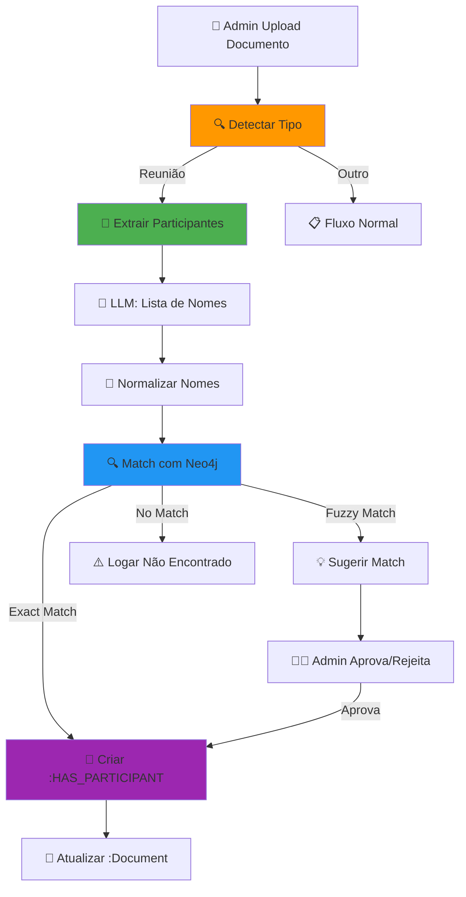
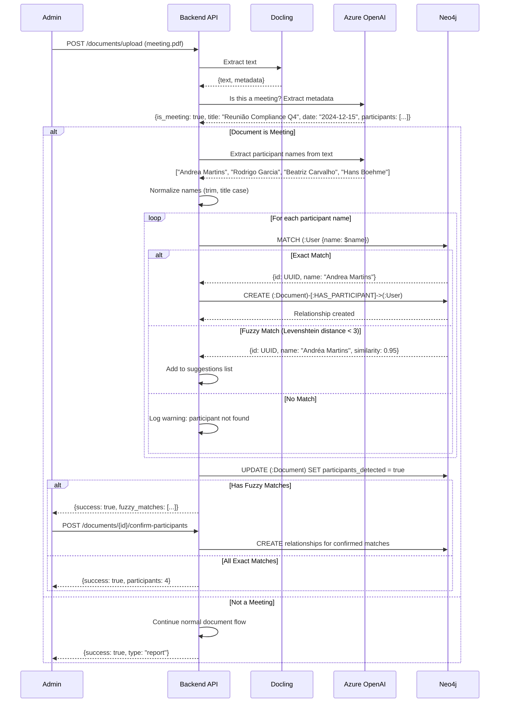

# Spec 048: Meeting Participant Detection - Identificação Automática de Participantes

**Feature Branch**: `048-meeting-participant-detection`  
**Created**: 2025-12-29  
**Status**: Draft  
**Priority**: P1 (MVP Core)  
**Source**: Caso real Alocc + necessidade de relacionar conhecimento a pessoas

---

## Context & Purpose

Quando um documento é identificado como **ata de reunião**, o sistema deve **automaticamente detectar os participantes** mencionados no texto e criar relacionamentos `:HAS_PARTICIPANT` no grafo. Isso permite:

- 🔍 **Retrieval contextual**: "O que Andrea Martins falou na última reunião?"
- 📊 **Analytics**: Quantas reuniões por pessoa/departamento
- 🔗 **Knowledge graph**: Conhecimento → Reunião → Participantes
- 🎯 **Targeting**: Notificar participantes quando reunião é mencionada

---

## Visão Geral



---

## Process Flow

### Sequence Diagram



---

## User Stories

### User Story 1: Upload Ata de Reunião (Priority: P1)

**Como** Admin  
**Quero** fazer upload de uma ata de reunião  
**Para** que o sistema automaticamente identifique e relacione os participantes

**Acceptance Scenarios**:

1. **Given** Admin faz upload de "Ata_Compliance_Q4_2024.pdf", **When** Docling extrai texto contendo "Presentes: Andrea Martins, Rodrigo Garcia, Beatriz Carvalho", **Then** sistema identifica como reunião

2. **Given** documento é reunião, **When** LLM extrai nomes, **Then** retorna lista:
   ```json
   {
     "is_meeting": true,
     "title": "Reunião Compliance Q4 2024",
     "date": "2024-12-15",
     "participants": [
       "Andrea Martins",
       "Rodrigo Garcia",
       "Beatriz Carvalho",
       "Hans Boehme"
     ]
   }
   ```

3. **Given** lista de participantes, **When** sistema busca no Neo4j, **Then**:
   - "Andrea Martins" → Match exato com `(:User {email: "andrea.martins@alocc.com.br"})`
   - "Rodrigo Garcia" → Match exato com `(:User {email: "rodrigo@alocc.com.br"})`
   - "Beatriz Carvalho" → Match exato com `(:User {email: "beatriz.carvalho@alocc.com.br"})`
   - "Hans Boehme" → Match exato com `(:User {email: "hans@alocc.com.br"})`

4. **Given** matches encontrados, **When** sistema cria relacionamentos, **Then** no Neo4j:
   ```cypher
   (:Document {id: "doc-123", title: "Ata Compliance Q4"})-[:HAS_PARTICIPANT]->(:User {name: "Andrea Martins"})
   (:Document {id: "doc-123"})-[:HAS_PARTICIPANT]->(:User {name: "Rodrigo Garcia"})
   (:Document {id: "doc-123"})-[:HAS_PARTICIPANT]->(:User {name: "Beatriz Carvalho"})
   (:Document {id: "doc-123"})-[:HAS_PARTICIPANT]->(:User {name: "Hans Boehme"})
   ```

5. **Given** relacionamentos criados, **When** Admin vê documento, **Then** exibe:
   ```
   📄 Ata_Compliance_Q4_2024.pdf
   📅 Data: 15/12/2024
   👥 Participantes (4):
     ✅ Andrea Martins (Líder do Atendimento)
     ✅ Rodrigo Garcia (Líder Compliance)
     ✅ Beatriz Carvalho (Analista Atendimento)
     ✅ Hans Boehme (Diretor Operacional)
   
   [Ver Documento] [Editar Participantes]
   ```

---

### User Story 2: Fuzzy Matching (Priority: P1)

**Como** Sistema  
**Quero** sugerir matches quando nome não é exato  
**Para** Admin confirmar manualmente

**Acceptance Scenarios**:

1. **Given** participante mencionado como "Andréa" (com acento), **When** sistema busca, **Then** não encontra match exato

2. **Given** no match exato, **When** sistema faz fuzzy search (Levenshtein), **Then** encontra "Andrea Martins" com similarity 0.95

3. **Given** fuzzy match encontrado, **When** processamento completa, **Then** Admin vê:
   ```
   ⚠️ Participantes sugeridos (1):
   
   "Andréa" no documento → Andrea Martins (Líder do Atendimento)
   Confiança: 95%
   
   [✅ Confirmar] [❌ Ignorar] [🔍 Buscar Outra Pessoa]
   ```

4. **Given** Admin confirma match, **When** clica "Confirmar", **Then** sistema cria `(:Document)-[:HAS_PARTICIPANT]->(:User {name: "Andrea Martins"})`

---

### User Story 3: Participante Não Cadastrado (Priority: P1)

**Como** Sistema  
**Quero** alertar quando participante não está no sistema  
**Para** Admin cadastrar ou ignorar

**Acceptance Scenarios**:

1. **Given** participante mencionado "João Silva", **When** sistema busca, **Then** não encontra no Neo4j

2. **Given** no match, **When** processamento completa, **Then** Admin vê:
   ```
   ⚠️ Participantes não encontrados (1):
   
   "João Silva" mencionado no documento, mas não está cadastrado no sistema.
   
   [➕ Cadastrar Novo Usuário] [🔍 Buscar Manualmente] [❌ Ignorar]
   ```

3. **Given** Admin clica "Cadastrar", **When** preenche dados, **Then** sistema cria (:User) e depois `[:HAS_PARTICIPANT]`

---

## Functional Requirements

### Detection

**REQ-MEET-001**: Sistema DEVE usar LLM para detectar se documento é reunião (keywords: "ata", "reunião", "presentes", "participantes", agenda)

**REQ-MEET-002**: Sistema DEVE extrair:
- Lista de nomes de participantes
- Título da reunião
- Data (se mencionada)
- Departamentos envolvidos (se mencionados)

### Matching

**REQ-MEET-003**: Sistema DEVE fazer **exact match** primeiro (case-insensitive, trim)

**REQ-MEET-004**: Se exact match falhar, sistema DEVE fazer **fuzzy match** usando Levenshtein distance:
- Similarity > 0.90 → sugerir com "Alta confiança"
- Similarity 0.80-0.90 → sugerir com "Média confiança"
- Similarity < 0.80 → não sugerir

**REQ-MEET-005**: Sistema DEVE buscar por nome completo E por email (se mencionado no texto)

### Relationships

**REQ-MEET-006**: Sistema DEVE criar relacionamento:
```cypher
(:Document {type: "meeting"})-[:HAS_PARTICIPANT {
  role: "participant", // ou "organizer", "facilitator"
  confidence: 1.0, // 1.0 = exact, <1.0 = fuzzy
  detected_at: datetime(),
  confirmed_by: admin_id // se foi confirmado manualmente
}]->(:User)
```

**REQ-MEET-007**: Sistema DEVE atualizar (:Document):
```cypher
{
  participants_detected: true,
  participants_count: 4,
  participants_confirmed: 3,
  participants_pending: 1
}
```

### Manual Intervention

**REQ-MEET-008**: Admin DEVE poder:
- Confirmar fuzzy matches
- Adicionar participantes manualmente
- Remover participantes incorretos
- Editar role (participant → organizer)

---

## Technical Design

### LLM Prompt for Detection

```python
MEETING_DETECTION_PROMPT = """
Analyze this document and determine if it's a meeting record.

Document text:
{document_text}

Return JSON:
{
  "is_meeting": boolean,
  "confidence": float (0-1),
  "title": string or null,
  "date": "YYYY-MM-DD" or null,
  "participants": [string] // list of full names,
  "departments": [string] // if mentioned,
  "reasoning": string // why you classified this way
}

Look for keywords: ata, reunião, presentes, participantes, agenda, pautas, deliberações, meeting, attendees.

Examples:
- "Ata da Reunião de Compliance realizada em 15/12/2024. Presentes: Andrea Martins, Rodrigo Garcia..."
  → is_meeting: true, participants: ["Andrea Martins", "Rodrigo Garcia"]

- "Relatório Trimestral de Vendas Q4 2024..."
  → is_meeting: false
"""
```

### Participant Extraction Prompt

```python
PARTICIPANT_EXTRACTION_PROMPT = """
Extract ALL participant names from this meeting document.

Document text:
{document_text}

Return JSON:
{
  "participants": [
    {
      "name": string, // full name
      "role": "participant" | "organizer" | "facilitator" | "guest",
      "department": string or null, // if mentioned
      "mentioned_as": string // how they were mentioned (for debugging)
    }
  ]
}

Look for sections:
- "Presentes:", "Participantes:", "Attendees:", "Present:"
- "Organizador:", "Facilitador:", "Chair:"
- Names followed by titles: "Andrea Martins (Líder do Atendimento)"

Extract ONLY names that are clearly people (not companies or departments).
Use full names when possible.

Example:
"Presentes: Andrea Martins (Atendimento), Rodrigo Garcia (Compliance), Beatriz Carvalho"
→ [
  {"name": "Andrea Martins", "role": "participant", "department": "Atendimento"},
  {"name": "Rodrigo Garcia", "role": "participant", "department": "Compliance"},
  {"name": "Beatriz Carvalho", "role": "participant"}
]
"""
```

### Matching Logic

```python
def match_participant(name: str, neo4j_session) -> dict:
    """
    Match participant name to User in Neo4j.
    
    Returns:
    {
      "match_type": "exact" | "fuzzy" | "none",
      "user_id": UUID or null,
      "user_name": string or null,
      "similarity": float (0-1),
      "suggestions": [User] // if multiple fuzzy matches
    }
    """
    # 1. Exact match (case-insensitive, trimmed)
    normalized_name = name.strip().title()
    
    exact_match = neo4j_session.run("""
        MATCH (u:User)
        WHERE toLower(u.name) = toLower($name)
        RETURN u.id as id, u.name as name, u.email as email
        LIMIT 1
    """, name=normalized_name).single()
    
    if exact_match:
        return {
            "match_type": "exact",
            "user_id": exact_match["id"],
            "user_name": exact_match["name"],
            "similarity": 1.0
        }
    
    # 2. Fuzzy match (Levenshtein distance)
    all_users = neo4j_session.run("""
        MATCH (u:User)
        WHERE u.status = 'Ativo'
        RETURN u.id as id, u.name as name, u.email as email
    """).data()
    
    fuzzy_matches = []
    for user in all_users:
        similarity = calculate_similarity(normalized_name, user["name"])
        if similarity > 0.80:
            fuzzy_matches.append({
                "user_id": user["id"],
                "user_name": user["name"],
                "user_email": user["email"],
                "similarity": similarity
            })
    
    if fuzzy_matches:
        # Sort by similarity
        fuzzy_matches.sort(key=lambda x: x["similarity"], reverse=True)
        best_match = fuzzy_matches[0]
        
        return {
            "match_type": "fuzzy",
            "user_id": best_match["user_id"],
            "user_name": best_match["user_name"],
            "similarity": best_match["similarity"],
            "suggestions": fuzzy_matches[:3] // top 3
        }
    
    # 3. No match
    return {
        "match_type": "none",
        "similarity": 0.0
    }

def calculate_similarity(str1: str, str2: str) -> float:
    """Calculate similarity using Levenshtein distance."""
    from Levenshtein import ratio
    return ratio(str1.lower(), str2.lower())
```

---

## Data Model

### Document Node (Extended)

```cypher
(:Document {
  id: UUID,
  title: string,
  type: "meeting" | "report" | "email" | "note",
  
  // Meeting-specific fields
  is_meeting: boolean,
  meeting_date: date, // if extracted
  meeting_title: string,
  
  // Participant detection status
  participants_detected: boolean,
  participants_count: integer,
  participants_confirmed: integer, // confirmed by admin
  participants_pending: integer, // fuzzy matches pending confirmation
  
  // Standard fields
  uploaded_by: UUID,
  created_at: datetime,
  processed_at: datetime
})
```

### Relationship

```cypher
(:Document)-[:HAS_PARTICIPANT {
  role: "participant" | "organizer" | "facilitator" | "guest",
  confidence: float, // 1.0 = exact, <1.0 = fuzzy
  detected_at: datetime,
  confirmed_by: UUID, // admin who confirmed (if fuzzy)
  confirmed_at: datetime,
  mentioned_as: string // how name appeared in document
}]->(:User)
```

---

## Success Criteria

- ✅ 90%+ das reuniões são corretamente identificadas
- ✅ 85%+ dos participantes são matched automaticamente (exact match)
- ✅ Fuzzy matching tem <10% false positives
- ✅ Admin consegue confirmar/rejeitar matches em <30 segundos por documento
- ✅ Queries tipo "Reuniões de Andrea Martins" retornam resultados corretos

---

## Example Queries

### Find all meetings a user participated in

```cypher
MATCH (u:User {email: "andrea.martins@alocc.com.br"})<-[:HAS_PARTICIPANT]-(d:Document {type: "meeting"})
RETURN d.title, d.meeting_date, d.participants_count
ORDER BY d.meeting_date DESC
```

### Find all participants in a meeting

```cypher
MATCH (d:Document {id: "doc-123"})-[r:HAS_PARTICIPANT]->(u:User)
RETURN u.name, u.function, u.email, r.role, r.confidence
ORDER BY r.role, u.name
```

### Find meetings between two people

```cypher
MATCH (u1:User {name: "Andrea Martins"})<-[:HAS_PARTICIPANT]-(d:Document)-[:HAS_PARTICIPANT]->(u2:User {name: "Rodrigo Garcia"})
WHERE d.type = "meeting"
RETURN d.title, d.meeting_date
ORDER BY d.meeting_date DESC
```

---

## Integration Points

### Specs Relacionadas

- **Spec 013 (Ingestion Ecosystem)**: Pipeline que chama participant detection
- **Spec 028 (File Upload)**: Upload inicial do documento
- **Spec 047 (Admin CSV Upload)**: Usuários já estão no sistema para matching
- **Spec 024 (Retrieval)**: Queries podem filtrar por participante

---

## Risks & Mitigations

| Risco | Probabilidade | Impacto | Mitigação |
|-------|---------------|---------|-----------|
| **LLM não extrai todos os nomes** | Média | Médio | Permitir admin adicionar manualmente |
| **Nomes ambíguos (ex: "João")** | Alta | Médio | Pedir confirmação se múltiplos matches |
| **Nomes escritos errado no documento** | Alta | Baixo | Fuzzy matching resolve 90% dos casos |
| **Performance: processar doc grande** | Baixa | Médio | Processar async, limitar texto para LLM |

---

## Future Enhancements (v2)

- [ ] Detectar role automaticamente (quem organizou vs participou)
- [ ] Extrair agenda items e ligar a participantes
- [ ] Detectar action items e atribuir a participantes
- [ ] Integração com calendário (Google Calendar, Outlook)
- [ ] Sugerir participantes baseado em reuniões anteriores similares

---

**Status**: 🟡 Draft (Spec Criada)  
**Priority**: 🟡 P1 (MVP Core)  
**Effort**: 1.5 dias  
**Dependencies**: Spec 013 (Ingestion), Spec 047 (CSV Upload), Spec 015 (Neo4j Model)

---

**Criado por**: Spec Orchestrator Agent  
**Data**: 2025-12-29  
**Source**: Caso real Alocc + necessidade de relacionar conhecimento

