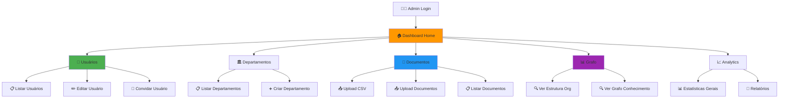

# Spec 049: Admin Dashboard - Painel de Gestão da Estrutura Organizacional

**Feature Branch**: `049-admin-dashboard`  
**Created**: 2025-12-29  
**Status**: Draft  
**Priority**: P1 (MVP Core)  
**Source**: Necessidade de visualização e gestão pós-upload CSV

---

## Context & Purpose

O **Admin Dashboard** é o painel onde o Admin (ex: `admin@co-createai.com.br`) gerencia a estrutura organizacional, monitora onboarding de usuários, faz upload de documentos e visualiza o grafo de conhecimento.

### Key Capabilities

- 📤 **Upload CSV**: Carregar estrutura inicial (Spec 047)
- 👥 **Gerenciar Usuários**: Ver lista, status de onboarding, editar perfis
- 🏛️ **Gerenciar Departamentos**: CRUD de departamentos
- 📄 **Upload Documentos**: Upload e ingestão de atas, relatórios
- 📊 **Visualizar Grafo**: Ver estrutura organizacional visualmente
- 📈 **Analytics**: Estatísticas de uso, conhecimento, reuniões

---

## Visão Geral



---

## Screens & Components

### 1. Dashboard Home 🏠

**Layout**:
```
┌─────────────────────────────────────────────────┐
│ 👨‍💼 Admin Dashboard | Alocc Gestão Patrimonial │
├─────────────────────────────────────────────────┤
│                                                 │
│  📊 Resumo Geral                               │
│  ┌──────────┬──────────┬──────────┬──────────┐ │
│  │ 👥 49    │ ✅ 15    │ 📄 23    │ 💬 156   │ │
│  │ Usuários │ Onboard  │ Docs     │ Convs    │ │
│  └──────────┴──────────┴──────────┴──────────┘ │
│                                                 │
│  📈 Atividade Recente                          │
│  • Rodrigo Trindade completou onboarding       │
│  • Andrea Martins criou 3 conhecimentos        │
│  • Ata_Compliance_Q4.pdf processada            │
│                                                 │
│  ⚠️ Ações Pendentes (2)                        │
│  • 3 participantes aguardando confirmação      │
│  • 5 usuários não completaram onboarding       │
│                                                 │
│  [Upload CSV] [Upload Documento] [Ver Grafo]   │
└─────────────────────────────────────────────────┘
```

**Cards de Estatísticas**:
- **Usuários**: Total (49), Ativos (49), Inativos (0), Onboarded (15)
- **Departamentos**: Total (16), Com Líderes (10)
- **Documentos**: Total (23), Reuniões (8), Relatórios (15)
- **Conhecimento**: Total (156), Corporativo (120), Pessoal (36)
- **Conversas**: Total (45), Ativas hoje (12)

---

### 2. Usuários 👥

**Lista de Usuários**:
```
┌──────────────────────────────────────────────────────────────────┐
│ 👥 Usuários (49)                             [➕ Convidar Novo]  │
├──────────────────────────────────────────────────────────────────┤
│ 🔍 Buscar: [_____________] 🏛️ Dept: [Todos ▼] ✅ Status: [Todos ▼]│
├──────────────────────────────────────────────────────────────────┤
│ Nome              │ Função           │ Dept        │ Status │ ⚙️│
├──────────────────────────────────────────────────────────────────┤
│ ✅ Andrea Martins │ Líder           │ Atendimento │ Ativo  │[...]│
│    andrea.martins@alocc.com.br                    Onboarded      │
│                                                                   │
│ ⏳ Rodrigo Garcia │ Líder Compliance│ Compliance  │ Ativo  │[...]│
│    rodrigo@alocc.com.br                           Pending        │
│                                                                   │
│ ✅ Rodrigo Trindade│ Analista       │ Sistemas    │ Ativo  │[...]│
│    rodrigo.trindade@alocc.com.br                  Onboarded      │
└──────────────────────────────────────────────────────────────────┘
```

**Filtros**:
- Por nome/email
- Por departamento
- Por status (Ativo/Inativo)
- Por onboarding (Completo/Pendente)
- Por role (Líder/Analista/Diretor)

**Ações por Usuário**:
- ✏️ **Editar**: Nome, função, departamento, acesso
- 📧 **Convidar**: Enviar email de convite para onboarding
- 🔍 **Ver Perfil**: Detalhes completos, histórico
- ❌ **Desativar**: Marcar como inativo

---

### 3. Detalhes do Usuário

**Modal/Page**:
```
┌──────────────────────────────────────────────────────────────┐
│ 👤 Rodrigo Trindade                         [✏️ Editar]      │
├──────────────────────────────────────────────────────────────┤
│ 📧 Email: rodrigo.trindade@alocc.com.br                      │
│ 💼 Função: Analista de Processos                             │
│ 🏛️ Departamento: Sistemas                                    │
│ 👔 Reporta para: Patricia Marinho                            │
│ ✅ Status: Ativo | Onboarded em 28/12/2024                  │
│                                                              │
│ 🔑 Acesso (16 departamentos):                               │
│ • TNA-RJ 2, TNA-RJ 4, Atendimento, Estruturado...           │
│                                                              │
│ 📊 Atividade:                                               │
│ • Conversas: 12                                             │
│ • Conhecimentos criados: 8 (7 corporativo, 1 pessoal)      │
│ • Documentos acessados: 5                                   │
│ • Reuniões participadas: 3                                  │
│ • Última atividade: hoje às 14:35                          │
│                                                              │
│ 🤖 AI Profile:                                              │
│ • Literacia IA: Técnico                                     │
│ • Preferências: Canvas avançado, Chat detalhado            │
│                                                              │
│ [Ver Grafo de Conhecimento] [Ver Conversas] [Enviar Msg]   │
└──────────────────────────────────────────────────────────────┘
```

---

### 4. Departamentos 🏛️

**Lista de Departamentos**:
```
┌────────────────────────────────────────────────────────┐
│ 🏛️ Departamentos (16)                    [➕ Criar]    │
├────────────────────────────────────────────────────────┤
│ Nome              │ Tipo      │ Líder           │ # ⚙️│
├────────────────────────────────────────────────────────┤
│ Atendimento       │ Internal  │ Andrea Martins  │ 4 │
│ Compliance        │ Internal  │ Rodrigo Garcia  │ 3 │
│ Sistemas          │ Internal  │ Patricia Marinho│ 2 │
│ TNA Parceiro      │ Partner   │ -               │ 14│
│ Investimentos     │ Internal  │ Eduardo Otero   │ 1 │
│ Legal             │ Internal  │ Bernardo Daudt  │ 1 │
│ Risco             │ Internal  │ Thiago Pereira  │ 4 │
│ ...               │           │                 │   │
└────────────────────────────────────────────────────────┘
```

**Detalhes do Departamento**:
```
┌───────────────────────────────────────────────────┐
│ 🏛️ Atendimento                    [✏️ Editar]    │
├───────────────────────────────────────────────────┤
│ Tipo: Internal                                    │
│ 👔 Líder: Andrea Martins                         │
│ 👥 Membros (4):                                  │
│   • Andrea Martins (Líder)                       │
│   • Beatriz Carvalho (Analista)                  │
│   • Leticia Martini (Analista)                   │
│   • Fernanda Barbieri (Analista)                 │
│                                                   │
│ 📊 Atividade:                                    │
│ • Conversas: 34                                  │
│ • Conhecimentos: 28                              │
│ • Documentos: 12                                 │
│ • Reuniões: 5                                    │
│                                                   │
│ [Ver Grafo] [Ver Conversas] [Ver Documentos]     │
└───────────────────────────────────────────────────┘
```

---

### 5. Documentos 📄

**Upload de Documentos**:
```
┌──────────────────────────────────────────────────────┐
│ 📄 Upload de Documentos                              │
├──────────────────────────────────────────────────────┤
│ 📤 Arrastar arquivo ou [Selecionar]                 │
│                                                      │
│ Tipos suportados: PDF, DOCX, TXT                    │
│ Tamanho máximo: 10MB                                │
│                                                      │
│ 🏷️ Tipo de documento:                              │
│ • [ ] Reunião (detectar participantes)             │
│ • [ ] Relatório                                    │
│ • [ ] Procedimento                                 │
│ • [x] Detectar automaticamente                     │
│                                                      │
│ 🏛️ Departamentos relacionados:                    │
│ [Atendimento ▼] [Compliance ▼] [+ Adicionar]       │
│                                                      │
│ [Cancelar] [Upload]                                 │
└──────────────────────────────────────────────────────┘
```

**Lista de Documentos**:
```
┌─────────────────────────────────────────────────────────────┐
│ 📄 Documentos (23)                      [📤 Upload Novo]    │
├─────────────────────────────────────────────────────────────┤
│ 🔍 [____________] 🏷️ Tipo: [Todos ▼] 📅 Período: [30d ▼]  │
├─────────────────────────────────────────────────────────────┤
│ Nome                        │ Tipo     │ Data    │ Status│⚙️│
├─────────────────────────────────────────────────────────────┤
│ 📋 Ata_Compliance_Q4.pdf   │ Reunião  │ 15/12  │ ✅   │[..]│
│    👥 4 participantes, 12 chunks                            │
│                                                              │
│ 📊 Relatorio_Vendas_Q4.pdf │ Relatório│ 10/12  │ ✅   │[..]│
│    15 chunks, sem participantes                             │
│                                                              │
│ 📋 Ata_TI_Nov.pdf          │ Reunião  │ 05/11  │ ⚠️   │[..]│
│    ⚠️ 2 participantes pendentes de confirmação              │
└─────────────────────────────────────────────────────────────┘
```

**Status de Documento**:
- ✅ **Processado**: Extraído, indexado, participantes confirmados
- ⏳ **Processando**: Em fila de processamento
- ⚠️ **Pendente**: Participantes aguardando confirmação
- ❌ **Erro**: Falha no processamento

---

### 6. Visualização de Grafo 📊

**Estrutura Organizacional**:
```
┌──────────────────────────────────────────────────────┐
│ 📊 Grafo: Estrutura Organizacional                  │
├──────────────────────────────────────────────────────┤
│                                                      │
│            [Alocc Gestão Patrimonial]               │
│                       │                              │
│          ┌────────────┼────────────┐                │
│          │            │            │                 │
│    [Atendimento]  [Compliance]  [Sistemas]          │
│       │               │            │                 │
│   ┌───┼───┐       ┌───┼───┐    ┌──┼──┐            │
│   │   │   │       │   │   │    │  │  │             │
│  [A] [B] [F]     [R] [Y] [A]  [R] [P] [B]          │
│                                                      │
│ 🔍 Zoom: [- | 100% | +]                            │
│ 🎨 Layout: [Hierárquico ▼] [Exportar PNG]          │
│                                                      │
│ 📊 Estatísticas:                                    │
│ • 49 usuários, 16 departamentos                     │
│ • 10 líderes, 39 analistas                          │
│ • 203 relacionamentos                               │
└──────────────────────────────────────────────────────┘
```

**Grafo de Conhecimento**:
```
┌──────────────────────────────────────────────────────┐
│ 📊 Grafo: Conhecimento                              │
├──────────────────────────────────────────────────────┤
│ 🔍 Filtros:                                         │
│ • 🏛️ Dept: [Todos ▼]                               │
│ • 👤 Pessoa: [Todos ▼]                             │
│ • 📅 Período: [30 dias ▼]                          │
│ • 🏷️ Tipo: [Todos ▼]                              │
│                                                      │
│     [Conv1]──►[Knowledge A]──►[User1]              │
│        │           │                                 │
│        ▼           ▼                                 │
│     [Task1]     [Doc1]──►[User2]                   │
│        │           │                                 │
│        ▼           ▼                                 │
│     [User3]     [Meeting1]──►[User4]               │
│                                                      │
│ 🔍 Buscar no grafo: [_________________]            │
│                                                      │
│ [Expandir Nível] [Colapsar] [Resetar View]         │
└──────────────────────────────────────────────────────┘
```

---

### 7. Analytics 📈

**Dashboard de Estatísticas**:
```
┌──────────────────────────────────────────────────────┐
│ 📈 Analytics & Relatórios                           │
├──────────────────────────────────────────────────────┤
│ 📅 Período: [Últimos 30 dias ▼]                    │
│                                                      │
│ 👥 Usuários                                         │
│ • Ativos (últimos 7d): 32 de 49 (65%)              │
│ • Onboarding completado: 15 de 49 (31%)            │
│ • Média de conversas/usuário: 2.3                   │
│ • Usuários mais ativos:                             │
│   1. Andrea Martins (18 conversas, 12 conhecimentos)│
│   2. Rodrigo Trindade (12 conversas, 8 conhecimentos)│
│   3. Beatriz Carvalho (10 conversas, 6 conhecimentos)│
│                                                      │
│ 💬 Conversas & Conhecimento                         │
│ • Total conversas: 156                              │
│ • Conhecimentos criados: 89                         │
│ • Corporativo: 72 (81%)                             │
│ • Pessoal: 17 (19%)                                 │
│ • Tarefas geradas: 34                               │
│                                                      │
│ 📄 Documentos                                       │
│ • Documentos processados: 23                        │
│ • Reuniões: 8 (34.8%)                               │
│ • Relatórios: 15 (65.2%)                            │
│ • Chunks totais: 456                                │
│ • Participantes identificados: 38                   │
│                                                      │
│ 🏛️ Por Departamento                                │
│ Top 3 mais ativos:                                  │
│ 1. Atendimento: 34 conversas, 28 conhecimentos     │
│ 2. Compliance: 28 conversas, 18 conhecimentos      │
│ 3. Sistemas: 22 conversas, 15 conhecimentos        │
│                                                      │
│ [Exportar Relatório PDF] [Enviar por Email]         │
└──────────────────────────────────────────────────────┘
```

---

## Functional Requirements

### Dashboard Home

**REQ-DASH-001**: Dashboard DEVE exibir cards com estatísticas em tempo real (usuários, documentos, conversas, conhecimentos)

**REQ-DASH-002**: Dashboard DEVE exibir atividade recente (últimas 10 ações)

**REQ-DASH-003**: Dashboard DEVE exibir ações pendentes (fuzzy matches, onboardings incompletos)

### Gestão de Usuários

**REQ-DASH-004**: Admin DEVE poder listar todos os usuários com filtros (nome, departamento, status, onboarding)

**REQ-DASH-005**: Admin DEVE poder editar perfil de usuário (nome, função, departamento, acesso)

**REQ-DASH-006**: Admin DEVE poder convidar usuário via email

**REQ-DASH-007**: Admin DEVE poder desativar usuário (status = Inativo)

**REQ-DASH-008**: Admin DEVE poder ver detalhes completos de um usuário (perfil, atividade, grafo)

### Gestão de Departamentos

**REQ-DASH-009**: Admin DEVE poder listar todos os departamentos

**REQ-DASH-010**: Admin DEVE poder criar novo departamento

**REQ-DASH-011**: Admin DEVE poder editar departamento (nome, tipo, líder)

**REQ-DASH-012**: Admin DEVE poder ver membros de um departamento

### Upload & Documentos

**REQ-DASH-013**: Admin DEVE poder fazer upload de CSV (Spec 047)

**REQ-DASH-014**: Admin DEVE poder fazer upload de documentos (PDF/DOCX)

**REQ-DASH-015**: Admin DEVE poder ver lista de documentos com filtros (tipo, data, status)

**REQ-DASH-016**: Admin DEVE poder ver detalhes de documento (chunks, participantes, knowledge extraído)

**REQ-DASH-017**: Admin DEVE poder confirmar/rejeitar participantes fuzzy match

### Visualização de Grafo

**REQ-DASH-018**: Admin DEVE poder visualizar estrutura organizacional em grafo interativo

**REQ-DASH-019**: Admin DEVE poder visualizar grafo de conhecimento

**REQ-DASH-020**: Admin DEVE poder filtrar grafo (departamento, pessoa, período, tipo)

**REQ-DASH-021**: Admin DEVE poder exportar grafo como imagem (PNG)

### Analytics

**REQ-DASH-022**: Admin DEVE poder ver estatísticas gerais (usuários ativos, conversas, conhecimentos, documentos)

**REQ-DASH-023**: Admin DEVE poder filtrar analytics por período

**REQ-DASH-024**: Admin DEVE poder ver ranking de usuários mais ativos

**REQ-DASH-025**: Admin DEVE poder ver estatísticas por departamento

**REQ-DASH-026**: Admin DEVE poder exportar relatório (PDF/CSV)

---

## Technical Design

### Tech Stack

```yaml
Frontend: Next.js 14 + TypeScript
UI Library: Shadcn/ui (Radix UI + Tailwind)
Charts: Recharts
Graph Viz: D3.js ou React Flow
Tables: TanStack Table (React Table v8)
Forms: React Hook Form + Zod
```

### API Endpoints

```typescript
// Users
GET    /admin/users                 // List users
GET    /admin/users/:id             // Get user details
PUT    /admin/users/:id             // Update user
POST   /admin/users/:id/invite      // Send invite email
POST   /admin/users/:id/deactivate  // Deactivate user

// Departments
GET    /admin/departments           // List departments
POST   /admin/departments           // Create department
PUT    /admin/departments/:id       // Update department
GET    /admin/departments/:id       // Get department details

// Documents
POST   /admin/upload/csv            // Upload CSV (Spec 047)
POST   /admin/documents             // Upload document
GET    /admin/documents             // List documents
GET    /admin/documents/:id         // Get document details
POST   /admin/documents/:id/confirm-participants // Confirm fuzzy matches

// Graph
GET    /admin/graph/org             // Get organizational graph data
GET    /admin/graph/knowledge       // Get knowledge graph data

// Analytics
GET    /admin/analytics/summary     // Get summary stats
GET    /admin/analytics/users       // Get user stats
GET    /admin/analytics/departments // Get department stats
GET    /admin/analytics/export      // Export report (PDF)
```

---

## Success Criteria

- ✅ Admin consegue fazer upload do CSV e ver estrutura criada em <1 minuto
- ✅ Admin consegue navegar para qualquer seção do dashboard em <3 cliques
- ✅ Grafo renderiza estrutura de 49 usuários sem lag (<1s)
- ✅ Filtros de busca retornam resultados em <500ms
- ✅ Dashboard carrega em <2 segundos
- ✅ UI é responsiva (funciona em tablet)

---

## Integration Points

### Specs Relacionadas

- **Spec 003 (Admin Login)**: Autenticação de admin
- **Spec 047 (Admin CSV Upload)**: Upload inicial de estrutura
- **Spec 048 (Meeting Participants)**: Confirmação de participantes
- **Spec 013 (Ingestion)**: Upload de documentos
- **Spec 022 (Onboarding)**: Status de onboarding dos usuários
- **Spec 015 (Neo4j Model)**: Queries para dados

---

## Non-Functional Requirements

### Performance

- **NFR-DASH-001**: Dashboard home DEVE carregar em <2 segundos
- **NFR-DASH-002**: Lista de usuários (50) DEVE renderizar em <1 segundo
- **NFR-DASH-003**: Grafo (49 nodes) DEVE renderizar em <1 segundo

### Usability

- **NFR-DASH-004**: UI DEVE ser intuitiva (admin consegue usar sem treinamento)
- **NFR-DASH-005**: Todas as ações DEVEM ter feedback visual (loading, sucesso, erro)

### Security

- **NFR-DASH-006**: Apenas Admin autenticado pode acessar dashboard
- **NFR-DASH-007**: Logs de todas as ações de admin DEVEM ser salvos

---

## Wireframes

*Ver mockups em `/specs/049-admin-dashboard/wireframes.md` (futuro)*

---

**Status**: 🟡 Draft (Spec Criada)  
**Priority**: 🟡 P1 (MVP Core)  
**Effort**: 3 dias  
**Dependencies**: Spec 003 (Admin Login), Spec 047 (CSV Upload), Spec 048 (Participants)

---

**Criado por**: Spec Orchestrator Agent  
**Data**: 2025-12-29  
**Source**: Necessidade de UI para gestão pós-CSV upload

