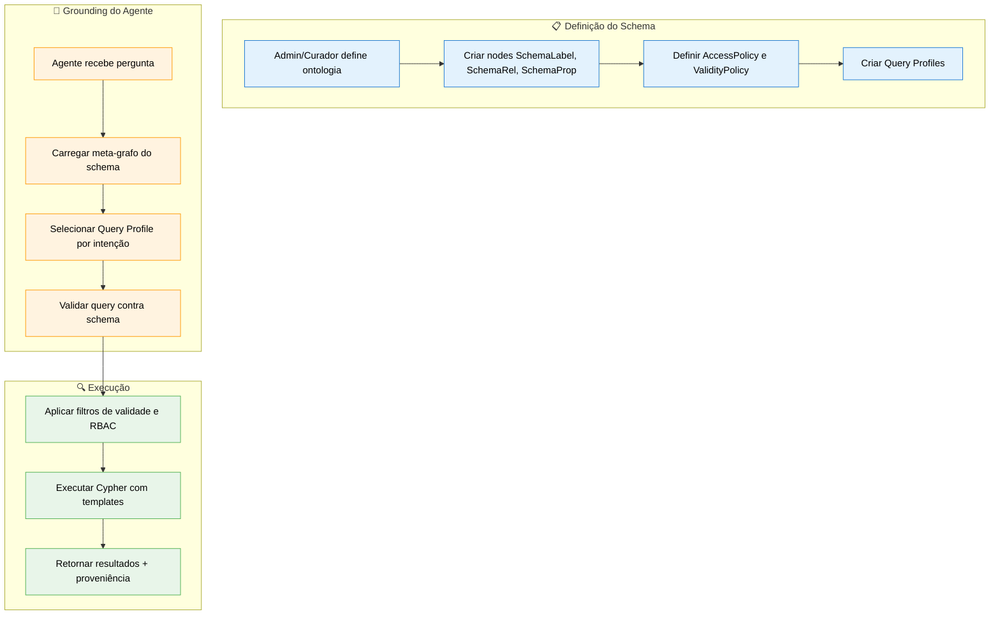

# Especificação de Feature: Meta-Grafo e Schema Operacional

**Feature Branch**: `050-meta-graph-schema`  
**Criado**: 2025-01-19  
**Status**: Draft  
**Prioridade**: P0 (Foundation)  
**Fonte**: Insights dos chats (chat02_06, chat02_07) + padrão Schema-as-Data

## Contexto & Propósito

O **Meta-Grafo** é a representação do schema do grafo **como dados consultáveis no próprio grafo**. Em vez de depender de documentação externa ou configuração estática, o agente pode consultar o próprio Neo4j para saber:

- Quais labels existem e o que significam
- Quais tipos de relacionamento são permitidos
- Quais propriedades cada label deve ter
- Quais são as restrições e políticas de acesso

Este é o **contrato semântico** que habilita o agente a **gerar queries Cypher corretas** sem "inventar" labels ou relacionamentos.

### Por que isso é fundamental?

> *"Se o modelo sabe Cypher mas não sabe que você usa `:Department` e não `:Area`, ele vai errar."*

O Meta-Grafo resolve o problema de **grounding do agente no schema real**:

1. **Agente não inventa**: Consulta labels e rels permitidos antes de gerar query
2. **Query Profiles**: Estratégias de busca pré-definidas por intenção
3. **RBAC operacional**: Políticas de acesso como propriedades de concessão
4. **Validade temporal**: Filtros de caducidade embutidos nos profiles

---

## Fluxo de Processo (Visão de Negócio)



---

## Modelo do Meta-Grafo

### Estrutura de Nodes

```cypher
// SchemaLabel - Define um tipo de node permitido
(:SchemaLabel {
  name: string,           // "Department", "User", "Document"
  description: string,    // Descrição semântica
  category: string,       // "org", "person", "content", "process", "meta"
  is_abstract: boolean,   // Se pode ser instanciado diretamente
  created_at: datetime,
  updated_at: datetime
})

// SchemaRel - Define um tipo de relacionamento permitido
(:SchemaRel {
  type: string,           // "BELONGS_TO", "REPORTS_TO", "HAS_CHUNK"
  description: string,    // Descrição semântica
  from_label: string,     // Label de origem permitido
  to_label: string,       // Label de destino permitido
  cardinality: string,    // "1:1", "1:N", "N:M"
  weight_properties: [string],  // ["confidence", "recency"]
  created_at: datetime
})

// SchemaProp - Define uma propriedade de um label
(:SchemaProp {
  owner: string,          // Label que possui esta propriedade
  name: string,           // "email", "dept_id", "confidence"
  type: string,           // "string", "integer", "float", "datetime", "boolean"
  is_key: boolean,        // Se é chave única
  is_required: boolean,   // Se é obrigatória
  default_value: any,     // Valor default (se houver)
  description: string
})

// QueryProfile - Estratégia de busca por intenção
(:QueryProfile {
  name: string,           // "org_context", "document_evidence"
  intent: string,         // Descrição da intenção
  max_hops: integer,      // Profundidade máxima
  return_shape: string,   // "flat", "tree", "subgraph"
  require_validity: boolean,
  require_rbac: boolean,
  created_at: datetime
})

// AccessPolicy - Política de acesso
(:AccessPolicy {
  name: string,           // "strategic_only", "department_scope"
  level: string,          // "strategic", "tactical", "operational"
  description: string,
  filter_cypher: string   // Fragment Cypher para filtro
})

// CypherTemplate - Template de query por intenção
(:CypherTemplate {
  name: string,
  intent: string,
  cypher: string,         // Template com $params
  params: [string],       // ["userId", "depth", "since"]
  description: string
})
```

### Relacionamentos do Meta-Grafo

```cypher
// SchemaLabel tem propriedades
(:SchemaLabel)-[:HAS_PROPERTY]->(:SchemaProp)

// SchemaLabel pode herdar de outro (taxonomia)
(:SchemaLabel)-[:EXTENDS]->(:SchemaLabel)

// QueryProfile define anchor label
(:QueryProfile)-[:ANCHOR]->(:SchemaLabel)

// QueryProfile permite certos relacionamentos
(:QueryProfile)-[:ALLOW_REL]->(:SchemaRel)

// QueryProfile requer política
(:QueryProfile)-[:REQUIRES_POLICY]->(:AccessPolicy)

// QueryProfile usa template
(:QueryProfile)-[:USES_TEMPLATE]->(:CypherTemplate)
```

---

## Query Profiles Padrão

### 1. `org_context` - Contexto Organizacional

```yaml
name: org_context
intent: "Entender estrutura da organização: quem, onde, hierarquia"
anchor_labels: [User, Department, Organization, Location]
allow_rels: [WORKS_AT, IN_DEPARTMENT, LOCATED_IN, REPORTS_TO, PART_OF]
max_hops: 3
require_validity: true
require_rbac: false
return_shape: subgraph
```

**Template Cypher**:
```cypher
MATCH (u:User {id: $userId})
OPTIONAL MATCH (u)-[:IN_DEPARTMENT]->(d:Department)
OPTIONAL MATCH (u)-[:WORKS_AT]->(o:Organization)
OPTIONAL MATCH (u)-[:REPORTS_TO*1..2]->(manager:User)
OPTIONAL MATCH (d)-[:PART_OF*1..3]->(parent:Department)
RETURN u, d, o, manager, parent
```

---

### 2. `document_evidence` - Evidência Documental

```yaml
name: document_evidence
intent: "Recuperar documentos e chunks como evidência para afirmações"
anchor_labels: [Document, Chunk, DocSummary]
allow_rels: [HAS_CHUNK, HAS_SUMMARY, MENTIONS, EXTRACTED_FROM]
max_hops: 2
require_validity: true
require_rbac: true
return_shape: tree
```

**Template Cypher**:
```cypher
MATCH (d:Document)
WHERE d.updated_at >= datetime() - duration({days: $daysSince})
  AND (d.expires_at IS NULL OR d.expires_at > datetime())
OPTIONAL MATCH (d)-[:HAS_SUMMARY]->(s:DocSummary)
OPTIONAL MATCH (d)-[:HAS_CHUNK]->(c:Chunk)
WHERE c.idx BETWEEN $startIdx AND $endIdx
RETURN d, s, collect(c) AS chunks
ORDER BY d.updated_at DESC
LIMIT $limit
```

---

### 3. `process_state` - Estado de Processos

```yaml
name: process_state
intent: "Verificar estado atual de processos, tarefas e fluxos"
anchor_labels: [Process, Task, DecisionPoint, ValueStream]
allow_rels: [HAS_TASK, PART_OF, TRIGGERS, FOLLOWS, DECIDED_BY]
max_hops: 4
require_validity: true
require_rbac: true
return_shape: flat
```

---

### 4. `strategy_alignment` - Alinhamento Estratégico

```yaml
name: strategy_alignment
intent: "Verificar alinhamento com missão, visão, OKRs e objetivos"
anchor_labels: [Purpose, StrategicObjective, OKR, Metric, ValueProposition]
allow_rels: [HAS_OBJECTIVE, MEASURED_BY, SUPPORTS, PERCEIVES]
max_hops: 3
require_validity: true
require_rbac: true
return_shape: tree
```

---

## Cenários de Usuário & Testes

### User Story 1 - Agente Consulta Schema Antes de Gerar Query (Prioridade: P0)

Como agente de IA, quero consultar o meta-grafo antes de gerar queries Cypher para garantir que uso labels e relacionamentos válidos.

**Cenários de Aceitação**:

1. **Dado** agente recebe pergunta "Quem são os gestores de TI?", **Quando** agente prepara query, **Então** consulta SchemaLabel para verificar que "User" e "Department" existem

2. **Dado** agente tenta usar `:Area` em vez de `:Department`, **Quando** valida contra meta-grafo, **Então** recebe erro e sugestão do label correto

3. **Dado** agente gera query com REPORTS_TO, **Quando** valida SchemaRel, **Então** confirma que `(:User)-[:REPORTS_TO]->(:User)` é válido

---

### User Story 2 - Seleção de Query Profile por Intenção (Prioridade: P0)

Como sistema, quero selecionar o Query Profile adequado baseado na intenção da pergunta para aplicar filtros e limites corretos.

**Cenários de Aceitação**:

1. **Dado** pergunta "Quem é o gestor do João?", **Quando** classifica intenção, **Então** seleciona profile `org_context`

2. **Dado** pergunta "Quais documentos mencionam LGPD?", **Quando** classifica intenção, **Então** seleciona profile `document_evidence`

3. **Dado** pergunta "Estamos no caminho do OKR de vendas?", **Quando** classifica intenção, **Então** seleciona profile `strategy_alignment`

---

### User Story 3 - RBAC como Propriedade da Concessão (Prioridade: P1)

Como sistema, quero que permissões de acesso sejam modeladas como propriedades nos relacionamentos de concessão para permitir queries eficientes.

**Cenários de Aceitação**:

1. **Dado** usuário tem acesso tático a Financeiro, **Quando** consulta documentos, **Então** query inclui filtro `WHERE grant.level IN ["tactical", "operational"]`

2. **Dado** documento é "strategic", **Quando** usuário operacional consulta, **Então** documento não aparece nos resultados

3. **Dado** usuário é promovido a nível estratégico, **Quando** propriedade `level` é atualizada em `:GRANTS`, **Então** acesso imediatamente reflete mudança

---

## Requisitos Funcionais

### Meta-Grafo

- **REQ-META-001**: Sistema DEVE manter meta-grafo com todos SchemaLabel, SchemaRel, SchemaProp no próprio Neo4j
- **REQ-META-002**: Todo SchemaLabel DEVE ter `name`, `description`, `category`
- **REQ-META-003**: Todo SchemaRel DEVE especificar `from_label` e `to_label` válidos
- **REQ-META-004**: Sistema DEVE validar instâncias contra meta-grafo antes de persistir
- **REQ-META-005**: Meta-grafo DEVE ser versionado (SchemaVersion node com timestamp)

### Query Profiles

- **REQ-META-006**: Sistema DEVE ter pelo menos 4 Query Profiles padrão: `org_context`, `document_evidence`, `process_state`, `strategy_alignment`
- **REQ-META-007**: Todo QueryProfile DEVE especificar `anchor_labels`, `allow_rels`, `max_hops`
- **REQ-META-008**: QueryProfile DEVE poder referenciar políticas (AccessPolicy) obrigatórias
- **REQ-META-009**: Agente DEVE selecionar QueryProfile baseado em classificação de intenção da pergunta
- **REQ-META-010**: QueryProfile DEVE ter CypherTemplate associado para queries parametrizadas

### Validação e Grounding

- **REQ-META-011**: Agente DEVE consultar SchemaLabel antes de gerar qualquer query com labels
- **REQ-META-012**: Agente DEVE consultar SchemaRel antes de usar relacionamentos em queries
- **REQ-META-013**: Sistema DEVE rejeitar queries que usem labels/rels não definidos no meta-grafo
- **REQ-META-014**: Sistema DEVE sugerir correção quando label/rel aproximado existe (fuzzy match)

### RBAC Operacional

- **REQ-META-015**: Permissões DEVEM ser modeladas como propriedades no relacionamento `:GRANTS`
- **REQ-META-016**: Propriedade `level` DEVE aceitar valores: `strategic`, `tactical`, `operational`
- **REQ-META-017**: QueryProfile com `require_rbac: true` DEVE aplicar filtro automático baseado em grants do usuário
- **REQ-META-018**: Sistema DEVE suportar grant por scope (Department, Project, Organization)

### Políticas de Validade

- **REQ-META-019**: QueryProfile com `require_validity: true` DEVE aplicar filtros temporais
- **REQ-META-020**: Filtro de validade DEVE verificar `expires_at IS NULL OR expires_at > datetime()`
- **REQ-META-021**: Sistema PODE aplicar filtro de freshness adicional (`updated_at >= datetime() - duration`)

---

## Entidades-Chave

### Tipos de Node Neo4j (Novos)

- **:SchemaLabel** - Definição de um tipo de node
- **:SchemaRel** - Definição de um tipo de relacionamento
- **:SchemaProp** - Definição de uma propriedade
- **:QueryProfile** - Estratégia de busca por intenção
- **:AccessPolicy** - Política de acesso/RBAC
- **:CypherTemplate** - Template de query parametrizada
- **:SchemaVersion** - Versão do schema para auditoria

### Relacionamentos Neo4j (Novos)

- **[:HAS_PROPERTY]** - SchemaLabel → SchemaProp
- **[:EXTENDS]** - SchemaLabel → SchemaLabel (herança)
- **[:ANCHOR]** - QueryProfile → SchemaLabel
- **[:ALLOW_REL]** - QueryProfile → SchemaRel
- **[:REQUIRES_POLICY]** - QueryProfile → AccessPolicy
- **[:USES_TEMPLATE]** - QueryProfile → CypherTemplate
- **[:GRANTS]** - Role → Permission (com props: level, scope)

### RBAC Model

```cypher
// Modelo completo de RBAC
(:User)-[:HAS_ROLE]->(:Role)-[:GRANTS {level: "tactical"}]->(:Permission)-[:ON_SCOPE]->(:Department)

// Query de verificação
MATCH (u:User {id: $userId})-[:HAS_ROLE]->(r:Role)-[g:GRANTS]->(p:Permission)-[:ON_SCOPE]->(s)
WHERE g.level IN $requiredLevels
RETURN p, g.level AS grantLevel, s AS scope
```

---

## Inicialização do Meta-Grafo

### Script de Bootstrap

```cypher
// === LABELS CANÔNICOS ===

// Organização & Pessoas (category: org, person)
CREATE (:SchemaLabel {name: "User", description: "Usuário do sistema", category: "person"})
CREATE (:SchemaLabel {name: "Person", description: "Pessoa genérica (contato, stakeholder)", category: "person"})
CREATE (:SchemaLabel {name: "Department", description: "Departamento organizacional (canônico, preferir sobre Area)", category: "org"})
CREATE (:SchemaLabel {name: "Organization", description: "Organização/Empresa (sinônimo: Company)", category: "org"})
CREATE (:SchemaLabel {name: "Location", description: "Localização física", category: "org"})
CREATE (:SchemaLabel {name: "Project", description: "Projeto", category: "org"})

// Conteúdo & Conhecimento (category: content)
CREATE (:SchemaLabel {name: "Document", description: "Documento ingerido", category: "content"})
CREATE (:SchemaLabel {name: "Chunk", description: "Fragmento de documento (usa idx para posição)", category: "content"})
CREATE (:SchemaLabel {name: "DocSummary", description: "Resumo de documento", category: "content"})
CREATE (:SchemaLabel {name: "Knowledge", description: "Conhecimento consolidado (canônico)", category: "content"})
CREATE (:SchemaLabel {name: "MemoryItem", description: "Especialização de Knowledge com ciclo de vida", category: "content", is_abstract: false})

// Estratégia (category: strategy) - alinhado com BIG (040)
CREATE (:SchemaLabel {name: "Purpose", description: "Propósito/missão da organização", category: "strategy"})
CREATE (:SchemaLabel {name: "Objective", description: "Objetivo estratégico (canônico)", category: "strategy"})
CREATE (:SchemaLabel {name: "OKR", description: "Key Result mensurável", category: "strategy"})
CREATE (:SchemaLabel {name: "Metric", description: "Métrica de acompanhamento", category: "strategy"})
CREATE (:SchemaLabel {name: "ValueProposition", description: "Proposta de valor", category: "strategy"})

// Processo (category: process) - alinhado com 017 e 022
CREATE (:SchemaLabel {name: "Process", description: "Processo de negócio (canônico)", category: "process"})
CREATE (:SchemaLabel {name: "ValueStream", description: "Fluxo de valor", category: "process"})
CREATE (:SchemaLabel {name: "DecisionPoint", description: "Ponto de decisão em processo", category: "process"})
CREATE (:SchemaLabel {name: "Task", description: "Tarefa", category: "process"})

// Memória Cognitiva (category: memory) - alinhado com 017
CREATE (:SchemaLabel {name: "Concept", description: "Conceito semântico", category: "memory"})
CREATE (:SchemaLabel {name: "TimePoint", description: "Âncora temporal (episódico)", category: "memory"})
CREATE (:SchemaLabel {name: "Insight", description: "Lição aprendida (avaliativo)", category: "memory"})
CREATE (:SchemaLabel {name: "Claim", description: "Afirmação feita em conversa", category: "memory"})
CREATE (:SchemaLabel {name: "Decision", description: "Decisão tomada", category: "memory"})
CREATE (:SchemaLabel {name: "ConversationSummary", description: "Resumo de conversa", category: "memory"})

// === RELACIONAMENTOS CANÔNICOS ===

// Organização
CREATE (:SchemaRel {type: "WORKS_AT", from_label: "User", to_label: "Organization", cardinality: "N:1"})
CREATE (:SchemaRel {type: "IN_DEPARTMENT", from_label: "User", to_label: "Department", cardinality: "N:1"})
CREATE (:SchemaRel {type: "LOCATED_IN", from_label: "User", to_label: "Location", cardinality: "N:1"})
CREATE (:SchemaRel {type: "REPORTS_TO", from_label: "User", to_label: "User", cardinality: "N:1"})
CREATE (:SchemaRel {type: "PART_OF", from_label: "Department", to_label: "Department", cardinality: "N:1"})

// Conteúdo
CREATE (:SchemaRel {type: "HAS_CHUNK", from_label: "Document", to_label: "Chunk", cardinality: "1:N"})
CREATE (:SchemaRel {type: "HAS_SUMMARY", from_label: "Document", to_label: "DocSummary", cardinality: "1:1"})
CREATE (:SchemaRel {type: "MENTIONS", from_label: "Chunk", to_label: "Person", cardinality: "N:M"})
CREATE (:SchemaRel {type: "EXTRACTED_FROM", from_label: "Knowledge", to_label: "Document", cardinality: "N:1", weight_properties: ["confidence", "method"]})
CREATE (:SchemaRel {type: "DERIVED_FROM", from_label: "Knowledge", to_label: "Chunk", cardinality: "N:1"})

// Estratégia (BIG)
CREATE (:SchemaRel {type: "HAS_PURPOSE", from_label: "Organization", to_label: "Purpose", cardinality: "1:1"})
CREATE (:SchemaRel {type: "HAS_OBJECTIVE", from_label: "Organization", to_label: "Objective", cardinality: "1:N"})
CREATE (:SchemaRel {type: "MEASURED_BY", from_label: "Objective", to_label: "OKR", cardinality: "1:N"})
CREATE (:SchemaRel {type: "TRACKED_BY", from_label: "OKR", to_label: "Metric", cardinality: "1:N"})
CREATE (:SchemaRel {type: "SUPPORTS", from_label: "Knowledge", to_label: "Objective", cardinality: "N:M", weight_properties: ["relevance_score", "assigned_by"]})
CREATE (:SchemaRel {type: "PERCEIVES", from_label: "Person", to_label: "Purpose", cardinality: "N:M", weight_properties: ["confidence", "coherence", "perspective"]})

// Memória Cognitiva (4 classes)
CREATE (:SchemaRel {type: "DEFINES", from_label: "Knowledge", to_label: "Concept", cardinality: "N:M", description: "Memória semântica"})
CREATE (:SchemaRel {type: "OCCURRED_AT", from_label: "Knowledge", to_label: "TimePoint", cardinality: "N:1", description: "Memória episódica"})
CREATE (:SchemaRel {type: "DESCRIBES_STEP", from_label: "Knowledge", to_label: "Process", cardinality: "N:M", description: "Memória procedural"})
CREATE (:SchemaRel {type: "SUPPORTS_LESSON", from_label: "Knowledge", to_label: "Insight", cardinality: "N:M", description: "Memória avaliativa"})

// Claims e Decisões
CREATE (:SchemaRel {type: "ASSERTS", from_label: "Message", to_label: "Claim", cardinality: "1:N"})
CREATE (:SchemaRel {type: "CONTRADICTS", from_label: "Claim", to_label: "Claim", cardinality: "N:M"})
CREATE (:SchemaRel {type: "RESOLVED_BY", from_label: "Claim", to_label: "Decision", cardinality: "N:1"})
CREATE (:SchemaRel {type: "SUPERSEDES", from_label: "Knowledge", to_label: "Knowledge", cardinality: "1:1", description: "Versionamento"})

// Processo
CREATE (:SchemaRel {type: "CONTAINS", from_label: "ValueStream", to_label: "Process", cardinality: "1:N"})
CREATE (:SchemaRel {type: "HAS_DECISION_POINT", from_label: "Process", to_label: "DecisionPoint", cardinality: "1:N"})
CREATE (:SchemaRel {type: "EXECUTES", from_label: "Department", to_label: "Process", cardinality: "N:M"})

// Criar Query Profile padrão: org_context
CREATE (qp:QueryProfile {
  name: "org_context",
  intent: "Entender estrutura da organização",
  max_hops: 3,
  return_shape: "subgraph",
  require_validity: true,
  require_rbac: false
})

// Linkar profile aos anchors permitidos
MATCH (qp:QueryProfile {name: "org_context"})
MATCH (sl:SchemaLabel) WHERE sl.name IN ["User", "Department", "Organization"]
CREATE (qp)-[:ANCHOR]->(sl)

// Linkar profile aos rels permitidos
MATCH (qp:QueryProfile {name: "org_context"})
MATCH (sr:SchemaRel) WHERE sr.type IN ["WORKS_AT", "IN_DEPARTMENT", "REPORTS_TO", "PART_OF"]
CREATE (qp)-[:ALLOW_REL]->(sr)
```

---

## Dependências

- **Spec 015** (Neo4j Graph Model) - Base para SchemaLabels e SchemaRels
- **Spec 024** (Retrieval Orchestration) - Consumidor principal de Query Profiles
- **Spec 051** (Context Depth Controller) - Usa Query Profiles para definir estratégia

---

## Specs Relacionadas

- **015-neo4j-graph-model** - Modelo base que meta-grafo descreve
- **024-retrieval-orchestration** - Usa Query Profiles para retrieval
- **051-context-depth-controller** - Define profundidade baseado em profiles
- **017-memory-ecosystem** - Classes de memória referenciadas nos profiles

---

## Consolidação Ontológica

O Meta-Grafo é a fonte de verdade para labels e relacionamentos. Para evitar conceitos concorrentes:

### Labels Canônicos (Usar Estes)

| Label Canônico | Sinônimos/Deprecated | Spec de Referência |
|----------------|---------------------|-------------------|
| `:Department` | `:Area` (deprecated) | 015 |
| `:Organization` | `:Company` (sinônimo) | 015 |
| `:Knowledge` | `:MemoryItem` (especialização) | 015, 017 |
| `:Objective` | `:StrategicObjective` (sinônimo) | 040, 022 |
| `:Process` | `:MacroProcess` (especialização) | 017, 022 |

### Relacionamentos Padronizados

| Relacionamento | Contexto | Propriedades Padrão |
|----------------|----------|---------------------|
| `[:SUPPORTS]` | Knowledge→Objective | `relevance_score`, `assigned_by` |
| `[:SUPPORTS]` | Claim→Claim | `confidence` |
| `[:EXTRACTED_FROM]` | Knowledge→Document | `confidence`, `method` |
| `[:PERCEIVES]` | Person→Purpose | `confidence`, `coherence`, `perspective` |
| `[:GRANTS]` | Role→Permission | `level`, `scope_type`, `valid_from` |

### Regra de Ouro

> Quando em dúvida sobre qual label usar, consulte o Meta-Grafo (`:SchemaLabel`) para verificar o nome canônico.

---

## Notas

- O meta-grafo é inspirado em **Schema.org** e **SHACL** (Shapes Constraint Language)
- APOC procedures podem ser usadas para expandir subgrafos: `apoc.path.subgraphAll`
- Query Profiles são análogos a "views" em bancos relacionais, mas para grafos
- O contrato de schema permite **self-healing**: sistema detecta drift e sugere correções
- **Consolidação ontológica** é crítica: use os labels canônicos definidos acima

