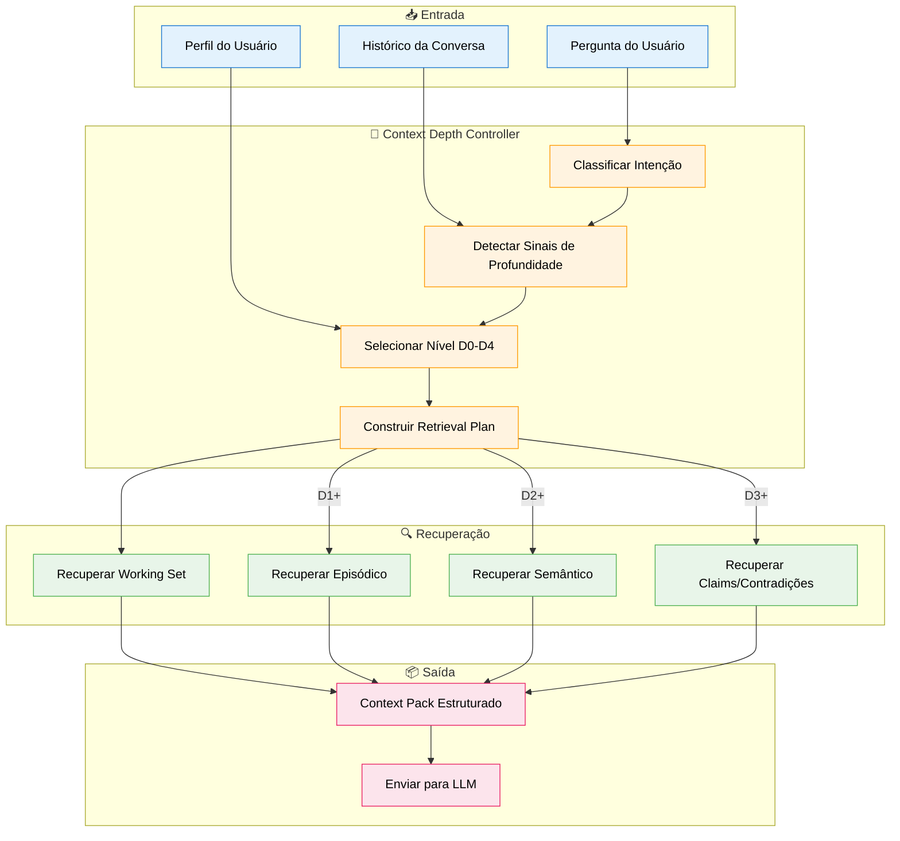
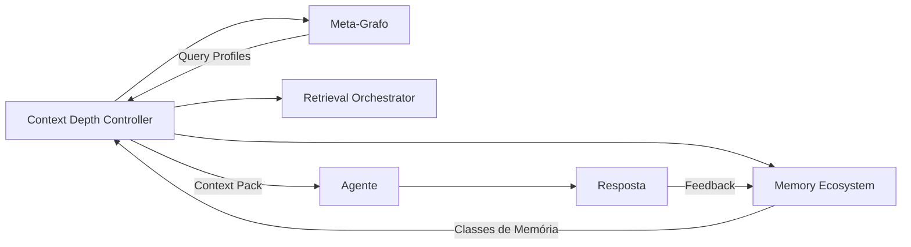

# Especificação de Feature: Context Depth Controller (CDC)

**Feature Branch**: `051-context-depth-controller`  
**Criado**: 2025-01-19  
**Status**: Draft  
**Prioridade**: P0 (Foundation)  
**Fonte**: Insights dos chats (chat02_07) + padrão de profundidade cognitiva

## Contexto & Propósito

O **Context Depth Controller (CDC)** é o componente que decide **quanto e que tipo de contexto** fornecer ao LLM para cada interação. Em vez de simplesmente "passar tudo" ou usar hops genéricos, o CDC analisa a **intenção da pergunta** e monta um **pacote de contexto** adequado.

### Problema que resolve

> *"Contexto é profundidade controlada de conhecimento relevante. Em uma conversa não precisamos ter tudo na 'ponta da língua'. Saber lidar com o que está sendo proposto e se 'lembrar' (recuperar memória) é o caminho mais viável."*

O CDC evita:
- **Over-retrieval**: Trazer contexto demais aumenta custo e confunde o modelo
- **Under-retrieval**: Trazer pouco perde informação crítica
- **Retrieval cego**: Buscar sem entender a intenção da pergunta

---

## Os 5 Níveis de Profundidade (D0-D4)

| Nível | Nome | Descrição | Contexto Típico |
|-------|------|-----------|-----------------|
| **D0** | Resposta Direta | Pergunta factual simples | Mínimo: Working Set atual |
| **D1** | Continuidade Local | Continua/refina tema recente | Working Set + última janela episódica |
| **D2** | Profundidade Conceitual | Explica ou contextualiza | + Memória semântica relacionada |
| **D3** | Contestação/Correção | Usuário discorda ou corrige | + Claims anteriores + contradições |
| **D4** | Exploração/Mudança de Frame | Novo tema ou mudança de perspectiva | Reset parcial + novo anchor semântico |

---

## Fluxo de Processo



---

## Sinais de Profundidade

O CDC detecta **sinais** na mensagem e no histórico para decidir o nível de profundidade.

### Sinais por Nível

| Sinal | Descrição | Nível Sugerido |
|-------|-----------|----------------|
| Pergunta direta com resposta curta esperada | "Qual o email do João?" | D0 |
| Pronomes anafóricos | "e sobre isso?", "como funciona?" | D1 |
| Pedido de explicação | "por quê?", "explica melhor" | D2 |
| Marcadores de discordância | "não concordo", "está errado", "na verdade" | D3 |
| Mudança de tema | Novo assunto, sem conexão com anterior | D4 |
| Pedido de comparação | "qual a diferença entre X e Y?" | D2 |
| Referência temporal | "na última reunião", "semana passada" | D1-D2 |
| Pedido de lista/resumo | "liste todos", "resuma" | D2 |

### Heurísticas de Detecção

```python
def detect_depth_level(query: str, history: list[Message]) -> DepthLevel:
    # D3: Contestação
    if contains_disagreement_markers(query):
        return DepthLevel.D3
    
    # D4: Mudança de frame
    if is_topic_shift(query, history):
        return DepthLevel.D4
    
    # D2: Aprofundamento
    if contains_explanation_request(query):
        return DepthLevel.D2
    
    # D1: Continuidade
    if contains_anaphoric_references(query) or is_follow_up(query, history):
        return DepthLevel.D1
    
    # D0: Default para perguntas simples
    return DepthLevel.D0
```

---

## Retrieval Plan por Nível

### D0 - Resposta Direta

```yaml
depth: D0
retrieval_sources:
  - working_set: last_2_messages
  - user_profile: basic
max_tokens: 500
query_profile: null  # Pode não precisar de query ao grafo
strategy: direct_answer
```

### D1 - Continuidade Local

```yaml
depth: D1
retrieval_sources:
  - working_set: last_5_messages
  - episodic_window: last_conversation_summary
  - user_profile: with_context
max_tokens: 1500
query_profile: org_context
strategy: continue_thread
```

### D2 - Profundidade Conceitual

```yaml
depth: D2
retrieval_sources:
  - working_set: last_3_messages
  - episodic_window: recent_summaries
  - semantic_memory: related_concepts
  - procedural_memory: if_how_to_question
max_tokens: 3000
query_profile: document_evidence
strategy: explain_with_context
```

### D3 - Contestação/Correção

```yaml
depth: D3
retrieval_sources:
  - working_set: full_session
  - claims: user_claims_in_session
  - contradictions: check_knowledge_conflicts
  - episodic_window: relevant_past_discussions
max_tokens: 4000
query_profile: document_evidence
strategy: verify_and_reconcile
special_instructions:
  - Identificar claim original
  - Buscar evidências conflitantes
  - Não defender posição anterior cegamente
```

### D4 - Exploração/Mudança de Frame

```yaml
depth: D4
retrieval_sources:
  - working_set: clear_and_reset
  - semantic_memory: new_topic_anchor
  - user_profile: full_with_objectives
max_tokens: 2500
query_profile: strategy_alignment
strategy: fresh_start_with_context
special_instructions:
  - Reconhecer mudança de tema
  - Manter apenas contexto de persona
  - Iniciar nova âncora semântica
```

---

## Context Pack Estruturado

O CDC produz um **Context Pack** que é entregue ao agente para montar o prompt.

### Estrutura do Context Pack

```typescript
interface ContextPack {
  // Metadados
  depth_level: 'D0' | 'D1' | 'D2' | 'D3' | 'D4';
  query_profile_used: string | null;
  total_tokens_estimated: number;
  
  // Working Set (sempre presente)
  working_set: {
    recent_messages: Message[];
    session_summary?: string;
  };
  
  // Memória Episódica (D1+)
  episodic?: {
    conversation_summaries: ConversationSummary[];
    relevant_events: TimePoint[];
  };
  
  // Memória Semântica (D2+)
  semantic?: {
    concepts: Concept[];
    knowledge_chunks: Chunk[];
    definitions: Knowledge[];
  };
  
  // Claims e Contradições (D3)
  claims?: {
    user_claims: Claim[];
    system_claims: Claim[];
    contradictions: Contradiction[];
  };
  
  // Procedural (quando aplicável)
  procedural?: {
    relevant_processes: Process[];
    playbook_steps: Step[];
  };
  
  // Contexto de Persona (sempre)
  persona_context: {
    user_role: string;
    department: string;
    access_level: string;
    current_objectives?: Objective[];
  };
  
  // Instruções especiais para o LLM
  llm_instructions: string[];
}
```

---

## Cenários de Usuário & Testes

### User Story 1 - Resposta Direta (D0) (Prioridade: P0)

Como usuário, quero respostas rápidas para perguntas simples sem latência de recuperação desnecessária.

**Cenários de Aceitação**:

1. **Dado** pergunta "Qual o email do João Silva?", **Quando** CDC classifica, **Então** seleciona D0 e busca apenas no working set + perfil básico

2. **Dado** D0 selecionado, **Quando** monta context pack, **Então** total de tokens < 500 e latência < 200ms

---

### User Story 2 - Continuidade (D1) (Prioridade: P0)

Como usuário, quero continuar uma conversa sem repetir contexto já estabelecido.

**Cenários de Aceitação**:

1. **Dado** conversa sobre "projeto X", **Quando** usuário pergunta "e o orçamento?", **Então** CDC detecta anáfora e seleciona D1

2. **Dado** D1 selecionado, **Quando** monta context pack, **Então** inclui últimas 5 mensagens + resumo da conversa atual

---

### User Story 3 - Contestação (D3) (Prioridade: P1)

Como usuário, quero poder corrigir o sistema quando ele erra, e que ele considere minha correção.

**Cenários de Aceitação**:

1. **Dado** sistema afirmou "O prazo é dia 15", **Quando** usuário diz "Não, o prazo mudou para dia 20", **Então** CDC detecta D3

2. **Dado** D3 selecionado, **Quando** monta context pack, **Então** inclui claim original + busca evidências no grafo + marca para reconciliação

3. **Dado** context pack D3, **Quando** LLM responde, **Então** reconhece a correção e não defende cegamente a afirmação anterior

---

### User Story 4 - Mudança de Tema (D4) (Prioridade: P1)

Como usuário, quero poder mudar de assunto sem que o sistema fique preso ao contexto anterior.

**Cenários de Aceitação**:

1. **Dado** conversa sobre "vendas Q1", **Quando** usuário pergunta "Quais são as políticas de férias?", **Então** CDC detecta D4

2. **Dado** D4 selecionado, **Quando** monta context pack, **Então** limpa working set, mantém persona, inicia nova âncora semântica

---

## Requisitos Funcionais

### Classificação de Profundidade

- **REQ-CDC-001**: CDC DEVE analisar cada mensagem do usuário para determinar nível D0-D4
- **REQ-CDC-002**: CDC DEVE considerar histórico recente (últimas N mensagens) na classificação
- **REQ-CDC-003**: CDC DEVE usar heurísticas linguísticas para detectar sinais de profundidade
- **REQ-CDC-004**: CDC PODE usar LLM leve para classificação quando heurísticas são insuficientes
- **REQ-CDC-005**: Classificação DEVE completar em < 100ms para não impactar latência

### Retrieval Plan

- **REQ-CDC-006**: CDC DEVE produzir Retrieval Plan específico por nível de profundidade
- **REQ-CDC-007**: Retrieval Plan DEVE especificar fontes, limites de tokens e query profiles
- **REQ-CDC-008**: CDC DEVE respeitar limites de tokens configuráveis por nível
- **REQ-CDC-009**: CDC DEVE selecionar Query Profile adequado (ref: spec 050)

### Context Pack

- **REQ-CDC-010**: CDC DEVE produzir Context Pack estruturado com todas as seções aplicáveis
- **REQ-CDC-011**: Context Pack DEVE sempre incluir working_set e persona_context
- **REQ-CDC-012**: Context Pack DEVE incluir episodic para D1+
- **REQ-CDC-013**: Context Pack DEVE incluir semantic para D2+
- **REQ-CDC-014**: Context Pack DEVE incluir claims para D3
- **REQ-CDC-015**: Context Pack DEVE incluir llm_instructions específicas por nível

### Integração

- **REQ-CDC-016**: CDC DEVE integrar com Memory Service (spec 017) para recuperação
- **REQ-CDC-017**: CDC DEVE usar Query Profiles do Meta-Grafo (spec 050)
- **REQ-CDC-018**: CDC DEVE alimentar Retrieval Orchestrator (spec 024) com plano de busca
- **REQ-CDC-019**: CDC DEVE logar decisões para observabilidade (spec 018)

---

## Infraestrutura Epistemológica

O CDC faz parte da **infraestrutura epistemológica** do EKS - os mecanismos que controlam como conhecimento é produzido, validado, justificado e evolui.

### Conceito

> *"Epistemologia é a teoria do conhecimento. A infraestrutura epistemológica é o conjunto de mecanismos que determinam como o sistema 'sabe' o que 'sabe'."*

O CDC contribui para isso ao:

1. **Controlar profundidade de evidência**: D2+ busca fundamentação
2. **Rastrear claims**: D3 identifica afirmações e contradições
3. **Manter contexto justificável**: Todo contexto tem proveniência
4. **Permitir correção**: Usuário pode contestar e sistema aprende

### Relação com Outras Camadas



---

## Entidades-Chave

### Tipos de Node Neo4j

O CDC não cria novos node types, mas usa extensivamente:

- **:ConversationSummary** - Resumos de conversa (D1+)
- **:Claim** - Afirmações feitas na conversa (D3)
- **:Knowledge** com `memory_class` - Para retrieval semântico (D2+)
- **:Process** - Para retrieval procedural

### Logs e Métricas

```cypher
(:CDCDecision {
  id: string,
  conversation_id: string,
  message_id: string,
  detected_signals: [string],
  depth_level: string,       // "D0" | "D1" | "D2" | "D3" | "D4"
  query_profile_used: string,
  sources_retrieved: [string],
  tokens_used: integer,
  latency_ms: integer,
  created_at: datetime
})

(:CDCDecision)-[:FOR_MESSAGE]->(:Message)
(:CDCDecision)-[:USED_PROFILE]->(:QueryProfile)
```

---

## Dependências

- **Spec 017** (Memory Ecosystem) - Fonte de memória por classes
- **Spec 050** (Meta-Graph Schema) - Query Profiles e políticas
- **Spec 024** (Retrieval Orchestration) - Execução do retrieval plan

---

## Specs Relacionadas

- **017-memory-ecosystem** - Classes de memória que CDC utiliza
- **024-retrieval-orchestration** - Executa planos de busca do CDC
- **050-meta-graph-schema** - Query Profiles que CDC seleciona
- **018-observability-dashboard** - Visualiza decisões do CDC

---

## Consolidação com Outras Specs

O CDC integra conceitos de múltiplas specs. Para garantir consistência:

### Mapeamento de Conceitos

| CDC usa | Definido em | Label Canônico |
|---------|-------------|----------------|
| Claims | 017 | `:Claim` |
| ConversationSummary | 017 | `:ConversationSummary` |
| Knowledge com memory_class | 017 | `:Knowledge` (com propriedade `memory_class`) |
| Process (procedural) | 017, 022 | `:Process` |
| Query Profiles | 050 | `:QueryProfile` |

### Propriedades de Peso Usadas

| Contexto | Propriedades | Referência |
|----------|--------------|------------|
| Claims | `confidence`, `status` | 017 |
| Knowledge retrieval | `memory_class`, `recency` | 015, 017 |
| Contradições | `[:CONTRADICTS]` | 017 |

---

## Notas

- O CDC é inspirado em teorias de memória de trabalho (Baddeley) e atenção seletiva
- A classificação D0-D4 pode evoluir com aprendizado baseado em feedback do usuário
- Em caso de dúvida sobre nível, CDC deve errar para cima (mais contexto)
- Performance é crítica: classificação deve ser < 100ms
- **Sempre usar labels canônicos** definidos em spec 015 e 050

